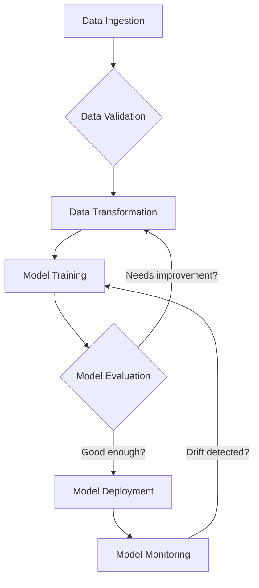
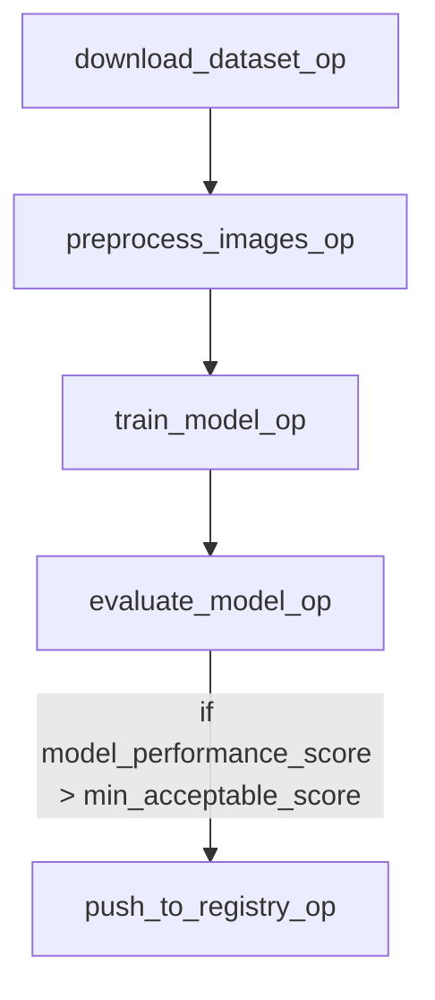

## Course Overview

Welcome to "Building Machine Learning Pipelines," a comprehensive Cohortia course designed for aspiring Machine Learning Engineers and Data Scientists eager to operationalize their ML models. In today's fast-paced AI landscape, simply building a great model isn't enough; the real challenge lies in deploying, managing, and maintaining it reliably in production. This course bridges that gap by diving deep into the principles and practices of MLOps, focusing specifically on how to construct robust, scalable, and automated machine learning pipelines using industry-leading tools like TensorFlow Extended (TFX) and Kubeflow Pipelines. We'll move beyond ad-hoc scripting to embrace structured, repeatable workflows that ensure data quality, model performance, and efficient resource utilization.

Throughout this course, you will gain hands-on experience with each stage of the ML lifecycle within a pipeline context. We'll start by understanding the foundational concepts of MLOps and the benefits of pipeline automation, then progressively build up our capabilities. You'll learn how to ingest and validate raw data to catch anomalies early, transform and engineer features consistently across training and serving, and train models with hyperparameter tuning. A critical focus will be placed on model evaluation and analysis, moving beyond simple metrics to understand model behavior across different data slices, ensuring fairness and robustness before deployment.

The course culminates in deploying models for serving and orchestrating entire ML workflows using Kubeflow Pipelines. You will learn to define, schedule, and monitor complex multi-step ML processes, enabling continuous integration and continuous delivery (CI/CD) for machine learning. By the end of this program, you will not only be proficient in using TFX components for various ML tasks but also skilled in stitching them together into coherent, automated pipelines that can adapt to changing data and business requirements. This practical, project-based approach ensures you develop the critical skills needed to build and manage production-ready ML systems, making you an invaluable asset in any data-driven organization.

This course is ideal for data scientists, machine learning engineers, and software engineers who have a solid understanding of machine learning fundamentals and Python programming. Familiarity with TensorFlow is beneficial but not strictly required, as key concepts will be introduced. Prepare to transform your understanding of ML development from experimental notebooks to scalable, maintainable production systems.

Upon successful completion of this course, you will be able to:
*   Articulate the core principles of MLOps and the necessity of automated ML pipelines.
*   Design and implement data ingestion and validation components using TFX DataValidation.
*   Develop robust data transformation and feature engineering steps with TFX Transform.
*   Configure and execute model training and hyperparameter tuning within a TFX pipeline.
*   Perform comprehensive model evaluation and analysis, including fairness metrics, using TFX Evaluator and Model Analysis.
*   Deploy trained models to serving infrastructure like TensorFlow Serving using TFX Pusher.
*   Orchestrate end-to-end machine learning pipelines using Kubeflow Pipelines.
*   Monitor pipeline execution, troubleshoot issues, and manage pipeline versions effectively.
*   Apply best practices for building scalable, reproducible, and maintainable ML systems.
*   Integrate continuous integration and continuous delivery (CI/CD) principles into ML workflows.

## Syllabus Structure

| Module # | Theme | Chapters |
|----------|-------|----------|
| 1 | Introduction to MLOps and ML Pipelines | 4 |
| 2 | Data Ingestion and Validation with TFX | 5 |
| 3 | Data Transformation and Feature Engineering | 5 |
| 4 | Model Training and Hyperparameter Tuning | 6 |
| 5 | Advanced Model Evaluation and Analysis | 6 |
| 6 | Model Deployment and Serving Strategies | 7 |
| 7 | Orchestrating Pipelines with Kubeflow | 7 |
| 8 | Monitoring, Governance, and Advanced MLOps | 8 |

Total chapters: 48
---

## Module 1: Introduction to MLOps and ML Pipelines
**Goal:** Establish a foundational understanding of MLOps principles and the necessity of ML pipelines for robust, scalable, and maintainable machine learning systems.

---

### Chapter 1.1 — The MLOps Paradigm: Bridging Development and Operations for ML

#### Learning objectives
*   Define MLOps and articulate its core purpose within the machine learning lifecycle.
*   Differentiate MLOps from traditional DevOps, highlighting unique challenges in machine learning.
*   Identify the key principles and benefits of adopting an MLOps approach.
*   Recognize the common pitfalls and anti-patterns in ML development that MLOps aims to solve.

#### Detailed lesson content
Welcome to the exciting world of Machine Learning Operations, or MLOps! As you embark on this journey to build robust and scalable machine learning pipelines, it's crucial to first understand the foundational philosophy that underpins this entire course. MLOps isn't just a buzzword; it's a set of practices that combines Machine Learning, DevOps, and Data Engineering to deploy and maintain ML systems in production reliably and efficiently. Think of it as the bridge between the experimental, often chaotic, world of model development and the structured, stable environment required for continuous operation. Without MLOps, many promising ML models developed in research labs or Jupyter notebooks never make it to production, or if they do, they struggle with maintenance, performance degradation, and lack of reproducibility.

The core purpose of MLOps is to streamline the entire machine learning lifecycle, from data collection and model training to deployment, monitoring, and continuous improvement. In traditional software development, DevOps practices have revolutionized how applications are built, tested, and deployed, emphasizing automation, collaboration, and continuous delivery. MLOps extends these principles to the unique context of machine learning. However, ML systems introduce complexities that go beyond typical software. For instance, an ML model's performance isn't just dependent on its code; it's also heavily influenced by the data it was trained on and the data it encounters in production. This dependency on data means that issues like data drift (changes in the input data distribution) or model drift (degradation of model performance over time due to changes in the real world) can silently cripple a deployed model, even if the underlying code remains unchanged. MLOps provides the frameworks and tools to detect and mitigate these issues proactively.

Differentiating MLOps from traditional DevOps is key. While both emphasize automation, continuous integration/continuous delivery (CI/CD), and monitoring, MLOps adds several critical dimensions. In DevOps, the primary artifact is code. In MLOps, you're managing three interconnected artifacts: code, data, and models. This "triplet" dependency means that a change in any one of these can impact the others. For example, updating a data preprocessing script (code) might require retraining the model (model) on the new data (data). Similarly, a new version of a dataset might necessitate changes in model architecture or hyperparameters. Furthermore, ML models are often opaque; their decision-making process can be complex, making debugging and auditing challenging. MLOps addresses this by promoting explainability, reproducibility, and versioning not just for code, but for datasets, models, and even the training environments.

The key principles of adopting an MLOps approach revolve around automation, reproducibility, continuous delivery, continuous monitoring, and governance. Automation is paramount; manual steps in data preparation, model training, evaluation, and deployment are prone to errors and bottlenecks. MLOps seeks to automate these stages through pipelines, which we'll explore in detail in subsequent chapters. Reproducibility ensures that any experiment or deployed model can be recreated exactly, which is vital for debugging, auditing, and regulatory compliance. This involves versioning everything: code, data, models, and even dependencies. Continuous delivery for ML means that once a model passes evaluation, it can be automatically deployed to production. Continuous monitoring tracks the model's performance, data quality, and system health in real-time, alerting engineers to potential issues like drift or performance degradation. Finally, governance ensures that models are fair, transparent, and compliant with ethical and legal standards, often involving robust logging, auditing, and explainability frameworks.

Without MLOps, organizations often fall into common pitfalls. These include "model graveyards" where promising models are developed but never deployed, or "silent failures" where models are deployed but degrade without detection, leading to poor business outcomes. Another common anti-pattern is the "Jupyter notebook hell," where models are trained and evaluated in isolated, non-reproducible environments, making collaboration and productionization nearly impossible. MLOps aims to solve these by enforcing structured workflows, promoting collaboration between data scientists, ML engineers, and operations teams, and providing the necessary infrastructure to manage the complexity of ML systems at scale. For instance, tools like Kubeflow and TFX, which we will extensively cover, are designed precisely to implement these MLOps principles, providing frameworks for data validation, transformation, model training, and serving in a scalable and reproducible manner.

#### Key concepts
*   **MLOps:** A set of practices that combines Machine Learning, DevOps, and Data Engineering to deploy and maintain ML systems in production reliably and efficiently.
*   **DevOps:** A software development methodology that integrates software development (Dev) with information technology operations (Ops) to shorten the systems development life cycle and provide continuous delivery.
*   **CI/CD for ML:** Continuous Integration and Continuous Delivery adapted for machine learning, encompassing automated testing, training, and deployment of ML models.
*   **Reproducibility:** The ability to achieve the same results (e.g., model performance) by running the same code, data, and environment configurations.
*   **Model Drift:** The degradation of a machine learning model's performance over time due to changes in the relationship between input features and the target variable in the real world.
*   **Data Drift:** A change in the distribution of input data to a machine learning model over time, which can lead to reduced model performance.
*   **Model Governance:** The set of policies, procedures, and oversight mechanisms to ensure that ML models are developed, deployed, and used responsibly, ethically, and in compliance with regulations.

#### Hands-on activity
**Activity: MLOps Readiness Assessment**

Imagine your team has just developed a new sentiment analysis model for customer feedback. Currently, the model is trained manually on a monthly basis, and deployment involves manually copying model files to a server. Your task is to identify the current state of MLOps adoption and propose initial improvements.

**Instructions:**
1.  **Review the Scenario:** Read the description above.
2.  **Assess Current State:** Using the MLOps principles discussed (automation, reproducibility, monitoring, governance), identify which areas are lacking or completely absent in the current workflow.
3.  **Propose Improvements:** For each lacking area, suggest a concrete, actionable improvement that aligns with MLOps principles. Think about what tools or practices could be introduced.
4.  **Write a Short Report:** Summarize your findings and proposals in a brief markdown document.

**Template for your report:**

```markdown
# MLOps Readiness Assessment: Sentiment Analysis Model

## Current State Analysis:

### Automation:
*   Current status: [Describe current manual steps for training and deployment]
*   Lacking: [Explain why current state is not automated]

### Reproducibility:
*   Current status: [Describe how data, code, and models are currently managed/versioned]
*   Lacking: [Explain reproducibility gaps]

### Monitoring:
*   Current status: [Describe any current monitoring of model performance or data quality]
*   Lacking: [Explain what's not being monitored or how monitoring is insufficient]

### Governance:
*   Current status: [Describe how model decisions are tracked, audited, or explained]
*   Lacking: [Explain any governance gaps]

## Proposed MLOps Improvements:

### Automation Improvements:
*   [Suggestion 1: e.g., "Implement a scheduled script for data ingestion and model retraining."]
*   [Suggestion 2: e.g., "Automate model deployment using a CI/CD pipeline triggered by successful retraining."]

### Reproducibility Improvements:
*   [Suggestion 1: e.g., "Use Git for version control of all model code and training scripts."]
*   [Suggestion 2: e.g., "Implement a data versioning system (e.g., DVC) for training datasets."]

### Monitoring Improvements:
*   [Suggestion 1: e.g., "Deploy a model monitoring service to track prediction latency and error rates."]
*   [Suggestion 2: e.g., "Implement data drift detection on incoming customer feedback data."]

### Governance Improvements:
*   [Suggestion 1: e.g., "Log all model predictions and associated input features for auditing."]
*   [Suggestion 2: e.g., "Integrate an explainability tool (e.g., SHAP, LIME) to understand model decisions."]
```

#### Assessment idea
1.  **Question:** Which of the following is a primary reason why MLOps is considered more complex than traditional DevOps?
    a) ML models are always deployed on cloud infrastructure.
    b) MLOps deals with three interconnected artifacts: code, data, and models, unlike DevOps which primarily focuses on code.
    c) ML engineers typically have less programming experience than software developers.
    d) MLOps tools are generally more expensive than DevOps tools.
    **Correct Answer:** b) MLOps deals with three interconnected artifacts: code, data, and models, unlike DevOps which primarily focuses on code.
    **Explanation:** While other options might sometimes be true, the fundamental complexity introduced by MLOps stems from the need to manage and version not just code, but also the datasets used for training and the resulting models, as changes in any one can impact the others.

2.  **Question:** Your team has deployed a recommendation engine. Over time, customers start complaining that the recommendations are becoming less relevant, even though no code changes have been made. What MLOps concept is most likely at play here, and what MLOps principle would help detect it?
    a) Model governance; Reproducibility.
    b) Data drift; Continuous monitoring.
    c) CI/CD for ML; Automation.
    d) Jupyter notebook hell; Versioning.
    **Correct Answer:** b) Data drift; Continuous monitoring.
    **Explanation:** If the recommendations are becoming less relevant without code changes, it strongly suggests that the characteristics of the input data (e.g., user preferences, product catalog) have changed, leading to "data drift." The MLOps principle of "continuous monitoring" is designed to detect such performance degradations and data quality issues in real-time or near real-time, alerting the team to retrain or re-evaluate the model.

#### AI generation note
Create a 12-minute animated explainer video. Start with a visual analogy comparing traditional software development to ML development, highlighting the added complexity of data and models. Use clear, concise text overlays for definitions of MLOps, DevOps, data drift, and model drift. Include animated diagrams showing the "code-data-model triplet" and how changes in one affect the others. The tone should be professional and encouraging. Conclude with a visual summary of MLOps principles. Include a reflective prompt for learners to consider their own experiences with ML project challenges. Ensure captions and alt text for all visual elements.

---

### Chapter 1.2 — Understanding the ML Workflow: From Data to Deployment

#### Learning objectives
*   Outline the typical stages of an end-to-end machine learning project lifecycle.
*   Describe the purpose and key activities involved in each stage, from data ingestion to model serving and monitoring.
*   Identify the iterative nature of the ML workflow and the feedback loops between stages.
*   Recognize the specific challenges and considerations at each stage that necessitate a pipeline approach.

#### Detailed lesson content
Having understood the 'why' behind MLOps, let's now delve into the 'what' – the typical workflow of a machine learning project. Unlike traditional software development, where the process might be relatively linear from requirements to deployment, an ML project is inherently iterative and experimental. It's a continuous cycle, often requiring revisiting earlier stages based on insights gained later. Understanding this workflow is fundamental to appreciating why ML pipelines are not just a convenience, but a necessity for building robust and maintainable systems.

The journey of an ML model typically begins with **Data Ingestion and Collection**. This initial stage involves gathering raw data from various sources, which could range from databases, APIs, sensor streams, log files, or even external datasets. The goal here is to acquire all the necessary information that might be relevant for solving the problem at hand. This isn't just about pulling data; it also involves understanding data schemas, potential data sources, and establishing reliable connections. For instance, if you're building a recommendation system, you might ingest user interaction logs, product metadata, and user demographic information. A common mistake here is underestimating the complexity of data sources or failing to establish robust, fault-tolerant ingestion mechanisms, leading to data loss or inconsistencies downstream.

Following ingestion, we move into **Data Validation**. This is a critical, often overlooked, step where the quality and integrity of the ingested data are checked. Data validation ensures that the data conforms to expected schemas, ranges, types, and statistical properties. Are there missing values where there shouldn't be? Are numerical features within plausible bounds? Are categorical features limited to expected categories? Tools like TensorFlow Extended (TFX) provide powerful components specifically for data validation, allowing you to define schema expectations and detect anomalies. Neglecting this stage can lead to "garbage in, garbage out," where a model trained on faulty data will inevitably perform poorly in production, regardless of its sophistication. This is where you might catch, for example, a column that should contain positive integers suddenly having negative values due to a data source error.

Next is **Data Transformation and Feature Engineering**. Raw data is rarely in a format directly usable by ML models. This stage involves cleaning the data (handling missing values, outliers), normalizing/scaling numerical features, encoding categorical features (e.g., one-hot encoding), and creating new features from existing ones (feature engineering) to improve model performance. For example, from a timestamp, you might extract "day of week" or "hour of day" as new features. The choices made here are crucial and often require domain expertise. It's also vital that these transformations are applied consistently both during training and inference. Inconsistent transformations are a common source of model-serving errors.

With prepared features, we proceed to **Model Training**. This is where the machine learning algorithm learns patterns from the data. It involves selecting an appropriate model architecture (e.g., a neural network, a gradient boosting model), splitting the data into training, validation, and test sets, defining hyperparameters, and executing the training process. During training, the model's parameters are optimized to minimize a predefined loss function. This stage is often iterative, involving experimentation with different models, hyperparameters, and feature sets. For instance, you might train several variations of a deep learning model for image classification, adjusting learning rates or layer configurations.

Once a model is trained, it must be subjected to rigorous **Model Evaluation**. This stage assesses the model's performance on unseen data (the test set) using appropriate metrics (e.g., accuracy, precision, recall, F1-score, AUC, RMSE). Beyond statistical metrics, evaluation also involves checking for bias, fairness, and robustness. A model might perform well on average but poorly for specific subgroups, or be highly sensitive to small perturbations in input data. It's also essential to compare the new model's performance against a baseline or existing production model to ensure it offers a meaningful improvement. This is where you decide if the model is good enough to be considered for deployment.

If the model passes evaluation, it moves to **Model Serving and Deployment**. This involves making the trained model available for predictions in a production environment. This could mean deploying it as a REST API endpoint, embedding it within an application, or using it for batch predictions. The deployment strategy depends on latency requirements, throughput, and scalability needs. For example, a real-time fraud detection model would require low-latency online serving, while a monthly sales forecast model might be served via batch inference. Tools like TensorFlow Serving or Kubeflow's KFServing are designed to handle the complexities of model serving, including version management and scaling.

Finally, the deployed model requires continuous **Monitoring**. This is not a one-time activity but an ongoing process. Monitoring tracks the model's performance in the real world, looking for signs of model drift, data drift, or concept drift. It also monitors the infrastructure for resource utilization, latency, and error rates. If performance degrades or anomalies are detected, it triggers alerts, potentially initiating a retraining cycle or human intervention. For example, a monitoring system for a spam classifier might detect a sudden drop in its ability to identify new spam patterns, indicating model drift. This feedback loop is crucial for the long-term health and effectiveness of any ML system.

The entire ML workflow is highly iterative. Insights from model evaluation might lead to revisiting data transformation or even data collection. Issues detected during monitoring might trigger retraining, which then cycles back through evaluation and deployment. This continuous feedback loop is what makes MLOps so vital – it provides the structure and automation to manage this complexity, ensuring that the ML system remains effective and relevant over time.

#### Key concepts
*   **Data Ingestion:** The process of collecting and importing raw data from various sources into a storage system for processing.
*   **Data Validation:** The process of ensuring that data is accurate, consistent, and conforms to expected schemas and statistical properties.
*   **Data Transformation:** The process of converting raw data into a suitable format for machine learning, including cleaning, normalization, encoding, and feature engineering.
*   **Feature Engineering:** The process of creating new input features from existing raw data to improve the performance of machine learning models.
*   **Model Training:** The process of fitting a machine learning algorithm to a dataset to learn patterns and make predictions.
*   **Model Evaluation:** The process of assessing a trained model's performance on unseen data using various metrics to determine its effectiveness and suitability for deployment.
*   **Model Serving:** The process of deploying a trained machine learning model to a production environment to make predictions in real-time or batch.
*   **Continuous Monitoring:** The ongoing process of tracking a deployed model's performance, data quality, and system health to detect issues like drift or degradation.
*   **Iterative Workflow:** The cyclical nature of the ML development process, where insights from later stages often necessitate revisiting and refining earlier stages.

#### Hands-on activity
**Activity: Mapping a Real-World ML Project to the Workflow**

Consider a real-world machine learning project: building a system to predict customer churn for a telecommunications company. Your task is to map specific activities and potential challenges of this project to the stages of the ML workflow discussed in this chapter.

**Instructions:**
1.  **Choose an ML Project:** We'll use "Customer Churn Prediction."
2.  **Describe Activities per Stage:** For each stage of the ML workflow, list 2-3 specific activities that would occur in the context of this project.
3.  **Identify Potential Challenges:** For each stage, identify one common challenge or mistake that could arise and how it might impact subsequent stages.

**Template for your response:**

```markdown
# ML Workflow Mapping: Customer Churn Prediction

## 1. Data Ingestion and Collection
*   **Activities:**
    *   Collecting customer demographic data (age, location, subscription plan) from CRM databases.
    *   Ingesting call logs, internet usage data, and billing history from operational databases.
*   **Potential Challenge:** Inconsistent customer IDs across different data sources, leading to difficulties in merging data and potential data loss.

## 2. Data Validation
*   **Activities:**
    *   Checking for missing values in critical columns like 'subscription_plan' or 'monthly_bill'.
    *   Validating that 'internet_usage_GB' is a positive numerical value and within a reasonable range.
*   **Potential Challenge:** Failing to detect an upstream error where 'monthly_bill' is accidentally recorded as negative for some customers, leading to skewed feature distributions.

## 3. Data Transformation and Feature Engineering
*   **Activities:**
    *   One-hot encoding categorical features like 'subscription_plan' and 'contract_type'.
    *   Creating new features such as 'average_monthly_usage' or 'customer_tenure_months' from raw data.
*   **Potential Challenge:** Applying different scaling methods (e.g., StandardScaler vs. MinMaxScaler) during training and inference, causing inconsistent feature representations and poor model performance.

## 4. Model Training
*   **Activities:**
    *   Training a gradient boosting model (e.g., XGBoost) on historical customer data to predict churn.
    *   Experimenting with different hyperparameters like learning rate and number of estimators.
*   **Potential Challenge:** Overfitting the model to the training data, leading to excellent performance on the training set but poor generalization to new, unseen customers.

## 5. Model Evaluation
*   **Activities:**
    *   Calculating precision, recall, and F1-score on a held-out test set to assess the model's ability to identify churners.
    *   Analyzing the confusion matrix to understand false positives and false negatives.
*   **Potential Challenge:** Evaluating the model solely on accuracy, which can be misleading for imbalanced datasets (e.g., very few churners), leading to a model that always predicts "no churn."

## 6. Model Serving and Deployment
*   **Activities:**
    *   Deploying the trained churn prediction model as a REST API endpoint that customer service agents can query.
    *   Setting up a batch inference job to score all active customers monthly.
*   **Potential Challenge:** Deploying the model without sufficient resource allocation, leading to high latency or service outages during peak usage.

## 7. Continuous Monitoring
*   **Activities:**
    *   Tracking the model's prediction accuracy and F1-score on new, labeled customer data over time.
    *   Monitoring the distribution of input features (e.g., 'monthly_bill') for data drift.
*   **Potential Challenge:** Not setting up alerts for significant drops in model performance or sudden shifts in input data distributions, causing the model to silently degrade without detection.
```

#### Assessment idea
1.  **Question:** During which stage of the ML workflow would you typically use tools like TensorFlow Data Validation (TFDV) to check for anomalies and schema violations in your dataset?
    a) Model Training
    b) Data Transformation and Feature Engineering
    c) Data Validation
    d) Model Serving and Deployment
    **Correct Answer:** c) Data Validation
    **Explanation:** TensorFlow Data Validation (TFDV) is specifically designed for the Data Validation stage. Its primary purpose is to analyze input data, infer its schema, and identify anomalies or deviations from that schema, ensuring data quality before it proceeds to transformation and training.

2.  **Question:** A data scientist trains an excellent churn prediction model that performs perfectly on the training data. However, when deployed, it performs poorly on new, unseen customer data. Which common mistake is most likely the cause, and which ML workflow stage is primarily affected?
    a) Data drift; Continuous Monitoring.
    b) Overfitting; Model Training.
    c) Inconsistent feature engineering; Data Transformation.
    d) Low-latency serving; Model Serving.
    **Correct Answer:** b) Overfitting; Model Training.
    **Explanation:** Performing perfectly on training data but poorly on unseen data is the classic symptom of overfitting. This issue primarily occurs during the Model Training stage when the model learns the training data too well, including its noise and specific patterns, losing its ability to generalize to new examples. While inconsistent feature engineering (c) can also cause poor performance, the description "performs perfectly on the training data" points more directly to overfitting.

#### AI generation note
Produce a 10-minute interactive slide deck. Each slide should represent a stage of the ML workflow, with clear headings and bullet points summarizing activities. Include a simple, illustrative diagram for each stage (e.g., data sources flowing into a validation step, a model being trained on data splits). Incorporate a "Common Pitfall" section on each stage slide, with a brief explanation. Include a drag-and-drop exercise where learners match a description of an activity to the correct ML workflow stage. Use a professional, clear visual style. Ensure accessibility with alt text for diagrams and keyboard navigation.

---

### Chapter 1.3 — Why Pipelines? The Case for Automation and Reproducibility

#### Learning objectives
*   Explain the fundamental rationale behind using ML pipelines for developing and deploying machine learning models.
*   Identify the key benefits that ML pipelines provide, such as automation, reproducibility, and scalability.
*   Compare and contrast manual, ad-hoc ML workflows with structured, pipeline-driven approaches.
*   Understand the basic concept of a Directed Acyclic Graph (DAG) as the underlying structure of most ML pipelines.

#### Detailed lesson content
Now that we have a solid understanding of the iterative and complex nature of the ML workflow, the next logical step is to ask: how do we manage this complexity effectively? The answer, unequivocally, lies in **ML pipelines**. A machine learning pipeline is essentially an automated sequence of steps that orchestrates the entire ML workflow, from data ingestion to model deployment and monitoring. It's a structured, repeatable, and automated way to manage the lifecycle of your machine learning models, moving away from fragmented scripts and manual interventions.

Imagine trying to build a house by hand, without any blueprints, specialized tools, or a coordinated team. You'd likely end up with something functional, but it would be slow, error-prone, difficult to modify, and impossible to replicate consistently. This analogy perfectly describes the state of many ML projects without pipelines. Data scientists often work in isolated Jupyter notebooks, running scripts manually, copying files, and tracking experiments in spreadsheets. While this ad-hoc approach might work for small, experimental projects, it quickly becomes unmanageable for production-grade systems.

The fundamental rationale for using ML pipelines boils down to addressing the inherent challenges of ML development: **complexity, iteration, and dependencies**. Each stage of the ML workflow (data collection, validation, transformation, training, evaluation, deployment, monitoring) is dependent on the successful completion and output of the previous stages. For example, model training depends on validated and transformed data. If the data transformation step changes, the model needs to be retrained. If the data ingestion process fails, all downstream steps are affected. Pipelines explicitly define these dependencies, ensuring that steps execute in the correct order and that data flows correctly between them.

One of the most significant benefits pipelines offer is **automation**. By defining each step as a distinct, executable component within a pipeline, we can automate the entire process. This means that instead of manually running scripts for data cleaning, then feature engineering, then training, a pipeline can be triggered to execute all these steps sequentially or in parallel, as defined. This automation drastically reduces human error, saves time, and allows for continuous integration and continuous delivery (CI/CD) practices to be applied to ML. For instance, a new model version could be automatically trained and evaluated every time new data becomes available or a code change is committed.

**Reproducibility** is another cornerstone benefit. In a pipeline, every step, its inputs, and its outputs are explicitly defined. This means that if you need to reproduce a specific model version or experiment, you can simply re-run the exact pipeline configuration with the corresponding versioned data and code. This is invaluable for debugging, auditing, and ensuring compliance. Without pipelines, reproducing an old model's results can be a nightmare, often involving trying to remember which script was run, which dataset version was used, and what environment settings were in place. With tools like Kubeflow Pipelines or TFX, each run of a pipeline is typically logged, including parameters, metrics, and artifact locations, making reproducibility a built-in feature.

Consider the common mistake of "training-serving skew," where the data preprocessing logic used during model training differs from the logic used during model inference. This can lead to significant performance degradation in production. A well-designed ML pipeline mitigates this by ensuring that the exact same transformation logic is applied consistently across both training and serving paths. For example, if you normalize a feature by subtracting the mean and dividing by the standard deviation during training, the pipeline ensures those same mean and standard deviation values are used for normalization when a new data point arrives for prediction.

**Scalability** is also greatly enhanced by pipelines. As your data grows and your models become more complex, manual processes quickly hit a wall. Pipelines, especially when built on cloud-native orchestration platforms like Kubeflow, can leverage distributed computing resources. Each step in a pipeline can be executed in its own isolated container, allowing for parallel execution of independent tasks and efficient scaling of compute resources. This means you can process terabytes of data or train large models without manually managing infrastructure.

The underlying structure of most ML pipelines is a **Directed Acyclic Graph (DAG)**. A DAG is a graph where nodes represent individual steps or components (e.g., "Data Ingestion," "Feature Engineering," "Model Training"), and directed edges represent the dependencies between these steps. "Directed" means the flow is one-way (e.g., data flows from "Ingestion" to "Validation," not the other way around). "Acyclic" means there are no loops; you can't go back to a previous step in the same run. This structure clearly defines the order of operations and the data flow, making the entire workflow transparent and manageable. For example, in a DAG, the "Model Training" node would have directed edges from "Data Transformation" and "Model Evaluation" would have an edge from "Model Training."


*Conceptual DAG for an ML Pipeline*

This diagram illustrates how steps are connected and how feedback loops (like "Needs improvement?" or "Drift detected?") trigger re-execution of earlier stages, forming the continuous MLOps cycle. Tools like Apache Airflow, Kubeflow Pipelines, and TFX leverage this DAG concept to define and orchestrate complex ML workflows, providing visual representations and robust execution engines. By adopting pipelines, you move from a chaotic, manual process to a structured, automated, and reproducible system that can reliably deliver and maintain high-quality machine learning models in production.

#### Key concepts
*   **ML Pipeline:** An automated, structured sequence of steps that orchestrates the entire machine learning workflow, from data ingestion to model deployment and monitoring.
*   **Automation:** The ability to execute the entire ML workflow or specific stages without manual intervention, reducing human error and increasing efficiency.
*   **Reproducibility:** The ability to consistently recreate the exact results of an ML experiment or model deployment by re-running the pipeline with the same inputs and configurations.
*   **Scalability:** The capacity of the ML pipeline to handle increasing data volumes, model complexity, and computational demands by efficiently utilizing resources.
*   **Directed Acyclic Graph (DAG):** A mathematical structure used to represent the sequence and dependencies of tasks in an ML pipeline, where nodes are tasks and directed edges indicate dependencies, with no cyclical paths.
*   **Training-Serving Skew:** A common problem in ML where the data distribution or feature engineering logic used during model training differs from what is used during model inference, leading to performance degradation.

#### Hands-on activity
**Activity: Designing a Simple Feature Engineering Pipeline Step**

You are tasked with preparing a dataset for a simple linear regression model to predict house prices. The raw data contains a 'square_footage' column and a 'num_bedrooms' column. You need to create a new feature: 'price_per_sqft' and ensure that 'square_footage' is never zero or negative.

**Instructions:**
1.  **Define a Python function** that simulates a data transformation step. This function should:
    *   Take a Pandas DataFrame as input.
    *   Validate that 'square_footage' is positive. If not, replace invalid values (e.g., with the median or raise an error for simplicity in this exercise).
    *   Create a new column 'price_per_sqft' by dividing a hypothetical 'price' column by 'square_footage'. (Assume 'price' exists for this exercise).
    *   Return the modified DataFrame.
2.  **Demonstrate the function** with a sample DataFrame, including a case with invalid 'square_footage'.

**Starter Code:**

```python
import pandas as pd
import numpy as np

def feature_engineering_step(df: pd.DataFrame) -> pd.DataFrame:
    """
    Performs feature engineering for house price prediction.
    - Validates 'square_footage' to be positive.
    - Creates 'price_per_sqft' feature.
    """
    print("--- Running Feature Engineering Step ---")

    # 1. Validate 'square_footage': Ensure it's positive.
    # For simplicity, we'll replace non-positive values with NaN and then fill with median.
    # In a real pipeline, you might raise an error or use more sophisticated imputation.
    invalid_sqft_mask = df['square_footage'] <= 0
    if invalid_sqft_mask.any():
        print(f"Warning: {invalid_sqft_mask.sum()} non-positive 'square_footage' values found.")
        # Replace non-positive with NaN
        df.loc[invalid_sqft_mask, 'square_footage'] = np.nan
        # Fill NaN with the median of valid square_footage
        median_sqft = df['square_footage'].median()
        df['square_footage'].fillna(median_sqft, inplace=True)
        print(f"Non-positive 'square_footage' replaced with median: {median_sqft}")

    # 2. Create 'price_per_sqft' feature
    # Ensure 'price' column exists for this calculation
    if 'price' not in df.columns:
        print("Error: 'price' column not found for 'price_per_sqft' calculation.")
        return df # Or raise an error in a real scenario

    df['price_per_sqft'] = df['price'] / df['square_footage']
    print("Created 'price_per_sqft' feature.")
    print("--- Feature Engineering Step Complete ---")
    return df

# --- Sample Data ---
# Scenario 1: Clean data
data_clean = {
    'square_footage': [1500, 2000, 1200, 1800],
    'num_bedrooms': [3, 4, 2, 3],
    'price': [300000, 450000, 250000, 380000]
}
df_clean = pd.DataFrame(data_clean)

# Scenario 2: Data with invalid square_footage
data_invalid = {
    'square_footage': [1500, 0, 1200, -100, 2200],
    'num_bedrooms': [3, 4, 2, 3, 4],
    'price': [300000, 450000, 250000, 380000, 500000]
}
df_invalid = pd.DataFrame(data_invalid)

print("Original Clean DataFrame:")
print(df_clean)
print("\nProcessed Clean DataFrame:")
print(feature_engineering_step(df_clean.copy())) # Use .copy() to avoid modifying original

print("\nOriginal Invalid DataFrame:")
print(df_invalid)
print("\nProcessed Invalid DataFrame:")
print(feature_engineering_step(df_invalid.copy())) # Use .copy() to avoid modifying original
```

#### Assessment idea
1.  **Question:** Your team manually runs several Python scripts in sequence to prepare data, train a model, and evaluate it. What is the primary risk of this ad-hoc approach compared to using an ML pipeline, especially when trying to reproduce an older experiment?
    a) The scripts might run too slowly.
    b) It's difficult to ensure the exact same versions of data, code, and environment settings are used, making reproduction challenging.
    c) Manual execution prevents the use of GPU acceleration.
    d) It makes it impossible to deploy the model to production.
    **Correct Answer:** b) It's difficult to ensure the exact same versions of data, code, and environment settings are used, making reproduction challenging.
    **Explanation:** The core issue with manual, ad-hoc workflows is the lack of explicit definition and tracking of dependencies and versions across data, code, and environments. This makes reproducing an older experiment (e.g., to debug a past result or verify a claim) extremely difficult, as the exact state of all inputs and components at that time is often lost or poorly documented. Pipelines enforce this structure.

2.  **Question:** In the context of ML pipelines, what does the "Acyclic" part of a Directed Acyclic Graph (DAG) signify?
    a) That the pipeline can run infinitely without stopping.
    b) That tasks can be executed in any random order.
    c) That there are no feedback loops or cycles, meaning a task cannot directly or indirectly lead back to itself in the same run.
    d) That all tasks must be executed in parallel.
    **Correct Answer:** c) That there are no feedback loops or cycles, meaning a task cannot directly or indirectly lead back to itself in the same run.
    **Explanation:** "Acyclic" means "without cycles." In a DAG, this ensures that each task has a clear start and end, and the execution flow is always forward. While an overall MLOps process might have feedback loops (e.g., monitoring triggering retraining), within a single pipeline run, the DAG structure ensures a deterministic, non-looping execution path.

#### AI generation note
Create an 8-minute animated explainer video. Start with a visual comparing a messy, manual ML workflow (scattered notebooks, manual file copies) to a clean, automated pipeline (interconnected, flowing components). Use a flowing animation to illustrate the concept of a DAG, showing nodes as distinct ML steps (e.g., "Data Prep," "Train Model," "Evaluate") and directed arrows as dependencies. Emphasize the benefits with on-screen text for "Automation," "Reproducibility," and "Scalability." Include a brief animation demonstrating how training-serving skew is prevented by consistent pipeline steps. Conclude with a visual of a simple Kubeflow Pipeline DAG. Ensure high-contrast visuals and clear voiceover.

---

### Chapter 1.4 — Key Components of an ML Pipeline: Data, Model, and Infrastructure

#### Learning objectives
*   Identify the distinct categories of components that constitute a comprehensive ML pipeline.
*   Describe the role and significance of data-related components, including data sources, validation, and transformation.
*   Explain the function of model-related components, such as training, evaluation, and serving.
*   Understand the importance of underlying infrastructure and orchestration tools in enabling pipeline execution and monitoring.
*   Recognize how these components interact to form an integrated ML system.

#### Detailed lesson content
Having established the critical need for ML pipelines, let's now break down their anatomy. A comprehensive ML pipeline isn't a monolithic block of code; rather, it's a collection of interconnected, specialized components, each responsible for a specific task within the ML workflow. These components can broadly be categorized into data-related, model-related, and infrastructure/orchestration elements. Understanding each component's role is crucial for designing, building, and maintaining effective pipelines, especially when working with frameworks like TFX and Kubeflow.

The first set of components revolves around **Data**. This is the lifeblood of any ML system, and managing it effectively is paramount.
*   **Data Sources and Ingestion:** This component is responsible for connecting to various data repositories (e.g., cloud storage like Google Cloud Storage, Amazon S3, Azure Blob Storage; databases like BigQuery, PostgreSQL; streaming platforms like Kafka) and ingesting raw data into the pipeline. It handles data extraction, format conversion, and initial loading. For example, a component might pull daily customer transaction logs from a data warehouse.
*   **Data Validation:** As discussed, this is a crucial gatekeeper. Components here check the quality, consistency, and schema compliance of the ingested data. They detect anomalies, missing values, and statistical outliers. Tools like TFX's `StatisticsGen` and `SchemaGen` components are excellent examples, automatically generating descriptive statistics and inferring a data schema, which `ExampleValidator` then uses to detect violations. This prevents bad data from corrupting downstream processes.
*   **Data Transformation and Feature Engineering:** This component takes validated raw data and transforms it into features suitable for model training. This includes cleaning (e.g., imputation of missing values), scaling numerical features, encoding categorical features (e.g., one-hot encoding), and creating new, more informative features. TFX's `Transform` component, for instance, can apply transformations consistently across both training and serving data, preventing training-serving skew. The output of this stage is often a transformed dataset ready for model consumption.
*   **Feature Store (Optional but Recommended):** While not a direct pipeline step, a feature store is an increasingly vital component that stores, serves, and manages curated features for both training and inference. It ensures feature consistency and reusability across different models and teams. A pipeline might publish newly engineered features to a feature store, and subsequent model training or serving components would retrieve them from there.

The next set of components focuses on the **Model** itself.
*   **Model Training:** This is where the core machine learning algorithm is applied to the prepared features. This component takes the transformed dataset, selects a model architecture (e.g., scikit-learn model, TensorFlow model, PyTorch model), defines hyperparameters, and executes the training process. The output is a trained model artifact. This component might leverage distributed training frameworks for large models or datasets. For example, a Kubeflow Pipeline component could encapsulate a Python script that trains a TensorFlow model using a specific dataset.
*   **Model Evaluation and Analysis:** Once trained, the model needs to be rigorously evaluated. This component calculates various performance metrics (e.g., accuracy, precision, recall, AUC, RMSE) on a held-out test set. Beyond just metrics, it might also perform deeper analysis, such as identifying model bias, fairness issues, or analyzing model explainability (e.g., using SHAP or LIME). TFX's `Evaluator` component can compare a candidate model against a baseline, ensuring that only demonstrably better models are pushed forward.
*   **Model Validation and Versioning:** This component makes the final decision on whether a trained and evaluated model is fit for deployment. It might enforce stricter criteria than basic evaluation, such as A/B testing results or business impact simulations. Successful models are then typically registered in a **Model Registry**, which acts as a central repository for versioned models, metadata, and performance metrics. This ensures traceability and allows for easy rollback to previous versions.
*   **Model Serving and Deployment:** This component takes a validated model from the model registry and deploys it to a production environment. This could involve creating a REST API endpoint, deploying to a serverless function, or setting up a batch prediction service. Tools like TensorFlow Serving or Kubeflow's KFServing are designed for this, handling aspects like model version management, scaling, and traffic routing.

Finally, all these data and model components require underlying **Infrastructure and Orchestration**.
*   **Orchestrator:** This is the brain of the pipeline. It manages the execution flow of the entire DAG, scheduling tasks, managing dependencies, passing data between components, and handling retries in case of failures. Examples include Apache Airflow, Kubeflow Pipelines, and Argo Workflows. The orchestrator ensures that components run in the correct order and that resources are allocated efficiently.
*   **Compute Resources:** Each pipeline component requires compute power. This could be CPUs, GPUs, or TPUs, running on virtual machines, containers (e.g., Docker), or serverless functions. The infrastructure provides the scalable and elastic resources needed for data processing and model training.
*   **Storage:** Various types of storage are needed: for raw data (data lakes/warehouses), intermediate artifacts (e.g., transformed datasets, model checkpoints), and final model artifacts (model registry). These are typically cloud storage solutions or distributed file systems.
*   **Monitoring and Logging:** These are cross-cutting concerns. Monitoring components track the health and performance of the pipeline itself (e.g., execution times, failures) and the deployed model (e.g., prediction latency, data drift, model drift). Logging captures events, errors, and metrics from all components, providing visibility and aiding in debugging.
*   **Metadata Store:** A central repository that tracks all artifacts, parameters, and executions within the pipeline. This is crucial for reproducibility, auditing, and understanding the lineage of models and data. TFX's ML Metadata (MLMD) store is a prime example.

These components don't operate in isolation; they are designed to interact seamlessly within the pipeline framework. For instance, a data transformation component produces an artifact (transformed data) that becomes the input for the model training component. The orchestrator manages these handoffs, ensuring that the entire system functions as a cohesive unit. This modular design allows for independent development, testing, and scaling of each part, making the entire ML system more robust and maintainable.

#### Key concepts
*   **Data Sources and Ingestion:** Components responsible for connecting to and extracting raw data from various storage systems.
*   **Data Validation Component:** A pipeline step that checks the quality, consistency, and schema compliance of data.
*   **Data Transformation Component:** A pipeline step that cleans, scales, encodes, and engineers features from raw data.
*   **Feature Store:** A centralized repository for storing, serving, and managing features for both training and inference.
*   **Model Training Component:** A pipeline step that trains a machine learning model using prepared features and selected algorithms.
*   **Model Evaluation Component:** A pipeline step that assesses a trained model's performance using metrics and deeper analysis.
*   **Model Registry:** A centralized repository for versioned models, their metadata, and performance metrics.
*   **Model Serving Component:** A pipeline step that deploys a validated model to a production environment for making predictions.
*   **Orchestrator:** The core component that manages the execution flow, schedules tasks, and handles dependencies within the pipeline (e.g., Kubeflow Pipelines, Airflow).
*   **Metadata Store:** A database that tracks all artifacts, parameters, and executions within an ML pipeline for lineage and reproducibility.

#### Hands-on activity
**Activity: Sketching a Kubeflow Pipeline Structure**

Imagine you need to build a Kubeflow Pipeline for a simple image classification task using TensorFlow. You've identified the following high-level steps:
1.  Download a public image dataset (e.g., MNIST or CIFAR-10).
2.  Preprocess the images (normalize pixel values, resize).
3.  Train a convolutional neural network (CNN).
4.  Evaluate the trained model.
5.  If the model meets performance criteria, push it to a model registry.

Your task is to sketch out the components and their connections, thinking about what each component would *do* and what *artifacts* it would pass to the next.

**Instructions:**
1.  **List Components:** For each step above, identify a distinct Kubeflow Pipeline component.
2.  **Define Inputs/Outputs:** For each component, specify its primary input artifacts and output artifacts.
3.  **Draw a Conceptual DAG:** Use a simple text-based or Mermaid diagram to illustrate the flow and dependencies between these components.

**Example Structure (use this as a guide for your output):**

```markdown
# Conceptual Kubeflow Pipeline: Image Classification

## Pipeline Components and Artifacts:

### 1. Component: `download_dataset_op`
*   **Purpose:** Downloads the raw image dataset from a public URL.
*   **Inputs:** `dataset_url` (parameter)
*   **Outputs:** `raw_dataset_path` (artifact: path to downloaded dataset)

### 2. Component: `preprocess_images_op`
*   **Purpose:** Normalizes pixel values, resizes images, and splits into train/test.
*   **Inputs:** `raw_dataset_path` (artifact from `download_dataset_op`)
*   **Outputs:** `preprocessed_train_data_path`, `preprocessed_test_data_path` (artifacts)

### 3. Component: `train_model_op`
*   **Purpose:** Trains a CNN model using TensorFlow.
*   **Inputs:** `preprocessed_train_data_path` (artifact from `preprocess_images_op`), `epochs`, `batch_size` (parameters)
*   **Outputs:** `trained_model_path` (artifact: path to saved model), `training_history_metrics` (artifact: JSON/CSV of loss/accuracy)

### 4. Component: `evaluate_model_op`
*   **Purpose:** Evaluates the trained model on the test set.
*   **Inputs:** `trained_model_path` (artifact from `train_model_op`), `preprocessed_test_data_path` (artifact from `preprocess_images_op`)
*   **Outputs:** `evaluation_metrics` (artifact: JSON of accuracy, precision, recall, etc.), `model_performance_score` (artifact: float, e.g., accuracy)

### 5. Component: `push_to_registry_op`
*   **Purpose:** Registers the model in a model registry if performance criteria are met.
*   **Inputs:** `trained_model_path` (artifact from `train_model_op`), `model_performance_score` (artifact from `evaluate_model_op`), `min_acceptable_score` (parameter)
*   **Outputs:** `registered_model_id` (artifact: ID of the registered model, if successful)

## Conceptual Pipeline DAG (using Mermaid):


```

#### Assessment idea
1.  **Question:** A data scientist is developing a new feature by combining two existing columns. This transformation needs to be applied consistently during both model training and when the model makes predictions in production. Which key component of an ML pipeline is specifically designed to ensure this consistency and prevent training-serving skew?
    a) Model Training Component
    b) Data Ingestion Component
    c) Data Transformation Component
    d) Model Serving Component
    **Correct Answer:** c) Data Transformation Component
    **Explanation:** The Data Transformation Component is responsible for applying all preprocessing and feature engineering logic. By encapsulating this logic within a pipeline component and reusing it for both training data preparation and inference data preparation, it guarantees that the exact same transformations are applied consistently, directly preventing training-serving skew.

2.  **Question:** After a model is trained and evaluated, it needs to be made available for real-time predictions via an API endpoint. Which component of an ML pipeline is primarily responsible for this task, potentially handling aspects like version management and scaling?
    a) Model Evaluation Component
    b) Model Registry
    c) Orchestrator
    d) Model Serving Component
    **Correct Answer:** d) Model Serving Component
    **Explanation:** The Model Serving Component is specifically designed to take a validated model and deploy it to a production environment, making it accessible for inference. This often involves setting up API endpoints, managing different model versions, and scaling the serving infrastructure to handle prediction requests. The Model Registry (b) stores the model, but the Serving Component actively deploys and serves it.

#### AI generation note
Create a 10-minute video walkthrough using a Jupyter Notebook. Start by showing a conceptual diagram of the components. Then, for each component category (Data, Model, Infrastructure), show a simple Python function or command that represents its core action. For data, show a pandas `read_csv` and a simple validation check. For transformation, show a `StandardScaler` application. For training, a simple `model.fit()` with dummy data. For serving, a conceptual `model.predict()` call. Emphasize how outputs from one function become inputs for the next. Use a split-screen view showing the code and its conceptual output. Include a reflection prompt asking learners to consider how these components would map to a real-world project they've worked on.

---

## Module 2: Data Ingestion and Validation with TFX

This module introduces you to the critical initial stages of an ML pipeline within the TFX framework: data ingestion and validation. You will learn how TFX components like ExampleGen, StatisticsGen, SchemaGen, and ExampleValidator work together to ensure your machine learning models are trained on high-quality, consistent data, preventing common issues like data drift and schema mismatches before they impact model performance.

---

### Chapter 2.1 — Introduction to TFX and its Components

#### Learning objectives
*   Explain the purpose and benefits of using TensorFlow Extended (TFX) for building robust ML pipelines.
*   Identify the core components of a TFX pipeline and their roles in the ML workflow.
*   Understand the MLOps principles that TFX helps to enforce, particularly regarding data quality and reproducibility.
*   Set up a basic local TFX environment for development and experimentation.

#### Detailed lesson content
Welcome to the world of TensorFlow Extended (TFX), a powerful, Google-production-scale platform designed to build and manage machine learning pipelines. As you embark on your journey to construct robust ML pipelines, understanding TFX is paramount because it provides a comprehensive, end-to-end solution for orchestrating every step of the machine learning lifecycle, from data ingestion and preparation to model training, evaluation, and deployment. TFX isn't just a collection of tools; it's an opinionated framework that enforces best practices for MLOps, ensuring that your ML systems are reliable, scalable, and maintainable in production environments. It addresses common challenges like data skew, model drift, and reproducibility, which are often overlooked in simpler, script-based ML workflows.

At its core, TFX is built around a series of interconnected components, each responsible for a specific stage of the ML pipeline. These components are designed to be modular and reusable, allowing you to construct complex workflows by chaining them together. The output of one component typically serves as the input for the next, creating a clear data flow and dependency graph. Let's briefly look at some of the foundational components you'll encounter throughout this course. `ExampleGen` is the entry point for your data, responsible for ingesting raw data from various sources and converting it into a standardized format suitable for TFX. Following ingestion, `StatisticsGen` computes descriptive statistics over your datasets, providing crucial insights into data distributions and potential anomalies. `SchemaGen` then infers a robust schema from your data, defining its expected structure, types, and constraints. This schema is vital for `ExampleValidator`, which uses it to identify anomalies, detect data drift, and ensure the quality and consistency of incoming data. Beyond data validation, `Transform` performs feature engineering and preprocessing, `Trainer` trains your machine learning model, `Evaluator` assesses its performance, and `Pusher` deploys the validated model to a serving infrastructure. Each component plays a critical role in maintaining the integrity and performance of your ML system.

The MLOps principles that TFX helps enforce are crucial for moving ML from experimental notebooks to production systems. Reproducibility is a cornerstone: TFX pipelines track metadata for every artifact generated and every execution run, allowing you to trace back the exact data, code, and configurations used to produce a specific model. This is invaluable for debugging, auditing, and ensuring consistency. Data quality and validation are also heavily emphasized. By explicitly defining a schema and continuously validating incoming data against it, TFX helps prevent "garbage in, garbage out" scenarios, where subtle data changes can silently degrade model performance. Furthermore, TFX promotes modularity and automation. Each component is a self-contained unit that can be tested independently, and the entire pipeline can be automated to run on a schedule or in response to new data, reducing manual effort and potential for human error. This structured approach is what distinguishes TFX from ad-hoc scripting and makes it an indispensable tool for serious ML engineering.

To begin working with TFX, the first step is to set up a suitable development environment. For local experimentation and learning, a Python virtual environment is often the simplest approach. You'll need to install the `tfx` package, along with `tensorflow` and `apache-beam` (which TFX uses for distributed data processing). A common mistake beginners make is overlooking the `apache-beam` dependency, which is essential for TFX's data processing capabilities, even in local mode. Ensure your Python version is compatible with the latest TFX release (check the official TFX documentation for current recommendations). You can create a virtual environment and install TFX using pip:

```bash
# Create a new virtual environment
python3 -m venv tfx_env
source tfx_env/bin/activate

# Install TFX and its dependencies
pip install tfx==1.15.0  # Or the latest compatible version
pip install tensorflow==2.15.0 # Ensure TensorFlow version compatibility
pip install apache-beam[gcp]==2.53.0 # Apache Beam for data processing
```

After installation, you can verify your setup by importing `tfx` in a Python interpreter. While local setup is great for development, for production-grade pipelines, TFX integrates seamlessly with orchestrators like Apache Airflow, Apache Beam, and Kubeflow Pipelines. For this module, we'll primarily focus on local execution to understand the core concepts before moving to more complex orchestrators. Safety note: always use a virtual environment to isolate your project dependencies and avoid conflicts with other Python projects on your system. This prevents "dependency hell" and ensures your TFX environment remains stable.

#### Key concepts
*   **TensorFlow Extended (TFX):** An end-to-end platform for deploying production ML pipelines, providing components for data ingestion, validation, transformation, training, evaluation, and deployment.
*   **MLOps:** A set of practices that aims to deploy and maintain ML systems in production reliably and efficiently, emphasizing automation, monitoring, and versioning.
*   **TFX Component:** A self-contained, reusable module within a TFX pipeline responsible for a specific task (e.g., `ExampleGen`, `StatisticsGen`, `Trainer`).
*   **Pipeline Orchestrator:** A system that schedules, manages, and executes the components of a TFX pipeline (e.g., Apache Airflow, Apache Beam, Kubeflow Pipelines).
*   **Artifact:** Any data or model produced or consumed by a TFX component, managed by the ML Metadata (MLMD) store.

#### Hands-on activity
**Activity: Setting up a TFX Local Environment and Running a "Hello World" Component**

Your task is to set up a Python virtual environment, install TFX, and then write a minimal Python script to instantiate and run a single TFX component locally, such as `ExampleGen` (even without actual data yet, just to see it initialize). This will confirm your installation and basic understanding of TFX component instantiation.

```python
# hello_tfx.py
import os
import tfx
from tfx.orchestration.local.local_dag_runner import LocalDagRunner
from tfx.components import ExampleGen
from tfx.proto import example_gen_pb2

# Define a temporary output directory for artifacts
_pipeline_root = os.path.join(os.getcwd(), 'tfx_pipeline_output')

# Configure ExampleGen to use a dummy input path (it won't actually read data yet)
# We're just demonstrating component instantiation
input_base = os.path.join(os.getcwd(), 'dummy_data_dir') # Create this directory if it doesn't exist
os.makedirs(input_base, exist_ok=True)

example_gen = ExampleGen(input_base=input_base)

# Define a simple pipeline with just one component
# In a real pipeline, you'd have more components and define a `pipeline` function.
# For this "Hello World", we'll just run the component directly via LocalDagRunner.
# This is a simplified approach for demonstration, not a full pipeline definition.

print(f"Attempting to run ExampleGen component locally. Output will be in: {_pipeline_root}")

# To run a single component locally without a full pipeline definition,
# we need to simulate a minimal pipeline structure.
# This is more complex than just `example_gen.run()`.
# A more realistic "hello world" for TFX involves defining a small pipeline.

# Let's define a minimal pipeline function for LocalDagRunner
def _create_pipeline():
    return tfx.orchestration.pipeline.Pipeline(
        pipeline_name='hello_tfx_pipeline',
        pipeline_root=_pipeline_root,
        components=[example_gen],
        enable_cache=True,
        metadata_connection_config=tfx.orchestration.metadata.sqlite_metadata_connection_config.create_sqlite_metadata_connection_config(
            os.path.join(_pipeline_root, 'metadata.sqlite')
        )
    )

if __name__ == '__main__':
    # Clean up previous runs
    if os.path.exists(_pipeline_root):
        import shutil
        shutil.rmtree(_pipeline_root)

    # Run the pipeline locally
    LocalDagRunner().run(_create_pipeline())
    print("ExampleGen component (part of 'hello_tfx_pipeline') executed successfully locally.")
    print(f"Check '{_pipeline_root}' for generated artifacts and metadata.")

```
**Instructions:**
1.  Save the code above as `hello_tfx.py`.
2.  Make sure you have activated your `tfx_env` virtual environment.
3.  Run `python hello_tfx.py` from your terminal.
4.  Observe the output and confirm that TFX components are initialized and executed. Check for the `tfx_pipeline_output` directory and its contents.

#### Assessment idea
1.  **Question:** Which of the following is NOT a primary benefit of using TFX for building ML pipelines?
    a) Enforcing MLOps best practices.
    b) Providing a standardized framework for ML lifecycle management.
    c) Automatically generating production-ready deep learning models without manual intervention.
    d) Ensuring data quality and reproducibility across pipeline runs.

    **Correct Answer:** c) Automatically generating production-ready deep learning models without manual intervention.
    **Explanation:** While TFX streamlines the process of building and deploying ML models, it does not automatically generate models. It provides the framework and tools for you to define, train, and validate your models, but the model architecture and training logic still require human design and implementation. TFX focuses on the *pipeline* around the model.

2.  **Question:** You've just installed TFX in your virtual environment, but when you try to run a simple TFX pipeline, you encounter an error related to `apache_beam` not being found. What is the most likely reason for this error, and how would you resolve it?

    **Correct Answer:** The most likely reason is that `apache-beam` was not installed or was installed incorrectly. TFX relies heavily on Apache Beam for distributed data processing, even in local execution modes. To resolve this, you need to install `apache-beam` specifically within your active virtual environment. The correct command would be `pip install apache-beam[gcp]` (or `apache-beam` if GCP-specific features are not needed for local setup). It's a common oversight because `tfx` itself doesn't always pull in all Beam dependencies directly.

#### AI generation note
Create a 12-minute mixed-media lesson. Start with a 3-minute animated overview explaining TFX's purpose and MLOps benefits, using diagrams showing the ML lifecycle and where TFX components fit in. Transition to a 7-minute live coding demo showing the `tfx_env` creation, `pip install tfx` and dependencies, and then running the `hello_tfx.py` script. Highlight the terminal output and the created `tfx_pipeline_output` directory. Use a split-screen view for the code editor and terminal. Conclude with a 2-minute summary emphasizing the importance of virtual environments and dependency management. Include interactive prompts asking learners to predict the output of the `hello_tfx.py` script before it runs.

---

### Chapter 2.2 — Ingesting Data with ExampleGen

#### Learning objectives
*   Explain the role and functionality of the `ExampleGen` component in a TFX pipeline.
*   Identify various data sources supported by `ExampleGen`, including CSV, TFRecord, and BigQuery.
*   Configure `ExampleGen` to ingest data from a local CSV file into the standardized `tf.train.Example` format.
*   Understand the output structure of `ExampleGen` and how it prepares data for subsequent TFX components.

#### Detailed lesson content
The journey of any machine learning pipeline begins with data, and in TFX, the `ExampleGen` component is your primary gateway for ingesting this raw data. `ExampleGen` is the very first component in most TFX pipelines, serving the crucial role of taking your raw input data from various sources and converting it into a standardized format that all subsequent TFX components can understand and process. This standardization is key to TFX's modularity and interoperability, ensuring that regardless of whether your data originates from a CSV file, a database, or a cloud storage bucket, it's presented consistently throughout the pipeline. Without `ExampleGen`, each component would need to handle diverse data formats, leading to complex, brittle, and non-reusable code.

`ExampleGen` is remarkably versatile, supporting a wide array of data sources, making it adaptable to most real-world scenarios. For flat files, it can directly read CSV files, which are common for tabular datasets, and TFRecord files, which are TensorFlow's own optimized binary format for sequences of serialized `tf.train.Example` protocol buffers. Beyond local files, `ExampleGen` integrates seamlessly with cloud data sources. For instance, it can pull data directly from Google Cloud Storage (GCS) buckets, BigQuery tables (Google's fully managed, serverless data warehouse), and even other distributed file systems. The choice of data source often depends on your existing data infrastructure and the scale of your dataset. For smaller, local projects, CSV or TFRecord files are perfectly adequate. For large-scale, enterprise-level applications, BigQuery or GCS are more appropriate, leveraging their distributed nature. A common mistake is trying to feed `ExampleGen` with unsupported formats directly; remember that `ExampleGen` expects specific input types or a custom executor for specialized formats.

Configuring `ExampleGen` is straightforward, primarily involving specifying the input data source. Let's consider a common scenario: ingesting data from a local CSV file. You would typically point `ExampleGen` to a directory containing your CSV file(s). `ExampleGen` automatically detects the CSV format and processes it. The core output of `ExampleGen` is a set of TFRecord files, each containing serialized `tf.train.Example` protocol buffers. A `tf.train.Example` is a flexible standard message type that represents a single data point, where each feature (column) is stored as a list of bytes, floats, or integers. This structured format is highly efficient for TensorFlow operations and facilitates easy serialization and deserialization across distributed systems.

Here's a practical example of how to configure `CsvExampleGen` to ingest data from a local CSV file. First, let's create a dummy CSV file named `data.csv` in a directory called `data_input`:

```csv
feature_a,feature_b,label
10,2.5,0
20,3.1,1
15,2.8,0
22,3.5,1
```

Now, let's write the Python code for a minimal TFX pipeline that uses `CsvExampleGen`:

```python
import os
from tfx.orchestration.local.local_dag_runner import LocalDagRunner
from tfx.components import CsvExampleGen
from tfx.orchestration.pipeline import Pipeline
from tfx.orchestration.metadata import sqlite_metadata_connection_config

# Define pipeline root and data input path
_pipeline_root = os.path.join(os.getcwd(), 'tfx_csv_pipeline_output')
_data_root = os.path.join(os.getcwd(), 'data_input')

# Create the data input directory and the dummy CSV file
os.makedirs(_data_root, exist_ok=True)
with open(os.path.join(_data_root, 'data.csv'), 'w') as f:
    f.write("feature_a,feature_b,label\n")
    f.write("10,2.5,0\n")
    f.write("20,3.1,1\n")
    f.write("15,2.8,0\n")
    f.write("22,3.5,1\n")

# Instantiate CsvExampleGen
# The input_base argument points to the directory containing the CSV files.
example_gen = CsvExampleGen(input_base=_data_root)

# Define a simple TFX pipeline
def _create_csv_pipeline():
    return Pipeline(
        pipeline_name='csv_ingestion_pipeline',
        pipeline_root=_pipeline_root,
        components=[example_gen],
        enable_cache=True,
        metadata_connection_config=sqlite_metadata_connection_config.create_sqlite_metadata_connection_config(
            os.path.join(_pipeline_root, 'metadata.sqlite')
        )
    )

if __name__ == '__main__':
    # Clean up previous runs
    if os.path.exists(_pipeline_root):
        import shutil
        shutil.rmtree(_pipeline_root)

    print(f"Running CsvExampleGen pipeline. Output will be in: {_pipeline_root}")
    LocalDagRunner().run(_create_csv_pipeline())
    print("CsvExampleGen executed successfully.")
    print(f"Check '{_pipeline_root}/csv_ingestion_pipeline/CsvExampleGen' for generated TFRecord files.")

    # Optional: Verify output (requires tensorflow to read TFRecord)
    import tensorflow as tf
    output_dir = os.path.join(_pipeline_root, 'csv_ingestion_pipeline', 'CsvExampleGen', example_gen.outputs['examples'].id, 'Split-train')
    print(f"Attempting to read from {output_dir}")
    tfrecord_files = [os.path.join(output_dir, f) for f in os.listdir(output_dir) if f.endswith('.tfrecord')]
    if tfrecord_files:
        print(f"Found TFRecord files: {tfrecord_files}")
        for tfrecord_file in tfrecord_files:
            raw_dataset = tf.data.TFRecordDataset(tfrecord_file)
            for raw_record in raw_dataset.take(1):
                example = tf.train.Example()
                example.ParseFromString(raw_record.numpy())
                print(f"Sample parsed tf.train.Example: {example}")
                break
    else:
        print("No TFRecord files found. Check pipeline output path.")
```

When you run this script, `CsvExampleGen` will read `data.csv`, split it into training and evaluation datasets (by default, 2/3 for train, 1/3 for eval), and convert each row into a `tf.train.Example` protobuf. These serialized examples are then written to TFRecord files within the `_pipeline_root` directory. The output of `ExampleGen` is an `Examples` artifact, which is essentially a pointer to these TFRecord files. This artifact is then passed to downstream components like `StatisticsGen` and `SchemaGen`, ensuring a consistent data interface throughout the pipeline. Understanding this output structure is crucial because it dictates how subsequent components will consume the data. For instance, `StatisticsGen` will read these TFRecord files to compute statistics, and `Transform` will use them for feature engineering. This seamless hand-off of standardized data is a core strength of TFX, preventing data format incompatibilities and simplifying pipeline development.

#### Key concepts
*   **ExampleGen:** The TFX component responsible for ingesting raw data from various sources and converting it into a standardized `tf.train.Example` or `tf.SequenceExample` format.
*   **`tf.train.Example`:** A standard TensorFlow protocol buffer message type used to represent a single data point, where features are stored as lists of bytes, floats, or integers.
*   **TFRecord:** TensorFlow's optimized binary file format for storing sequences of serialized `tf.train.Example` or `tf.SequenceExample` messages, efficient for large datasets.
*   **Input Base:** The directory or path specified to `ExampleGen` where the raw input data files (e.g., CSV, TFRecord) are located.
*   **Data Split:** `ExampleGen` automatically splits the ingested data into training and evaluation sets by default (e.g., 2/3 train, 1/3 eval), which can be configured.

#### Hands-on activity
**Activity: Ingesting a Custom CSV Dataset with `CsvExampleGen`**

Your task is to create a new CSV file representing a small dataset (e.g., house prices, customer churn, or a simple classification problem). Then, modify the provided `csv_ingestion_pipeline.py` script to ingest your custom CSV data using `CsvExampleGen`. After running the pipeline, verify that the TFRecord files are generated correctly and try to inspect a few `tf.train.Example` records programmatically.

```python
# custom_csv_ingestion.py
import os
import shutil
import tensorflow as tf
from tfx.orchestration.local.local_dag_runner import LocalDagRunner
from tfx.components import CsvExampleGen
from tfx.orchestration.pipeline import Pipeline
from tfx.orchestration.metadata import sqlite_metadata_connection_config

# --- Configuration ---
_pipeline_name = 'custom_data_pipeline'
_pipeline_root = os.path.join(os.getcwd(), 'tfx_custom_output')
_data_root = os.path.join(os.getcwd(), 'custom_data_input')
_custom_csv_filename = 'my_custom_data.csv'

# --- Create custom CSV data ---
os.makedirs(_data_root, exist_ok=True)
custom_csv_content = """age,income,education,has_loan,label
25,50000,Bachelor,0,0
35,75000,Master,1,1
42,60000,PhD,0,0
28,45000,HighSchool,1,0
55,90000,Master,0,1
"""
with open(os.path.join(_data_root, _custom_csv_filename), 'w') as f:
    f.write(custom_csv_content)
print(f"Created custom CSV file: {os.path.join(_data_root, _custom_csv_filename)}")

# --- Instantiate CsvExampleGen ---
# Point input_base to the directory containing your CSV file(s)
example_gen = CsvExampleGen(input_base=_data_root)

# --- Define the TFX Pipeline ---
def _create_custom_pipeline():
    return Pipeline(
        pipeline_name=_pipeline_name,
        pipeline_root=_pipeline_root,
        components=[example_gen],
        enable_cache=True,
        metadata_connection_config=sqlite_metadata_connection_config.create_sqlite_metadata_connection_config(
            os.path.join(_pipeline_root, 'metadata.sqlite')
        )
    )

# --- Run the Pipeline ---
if __name__ == '__main__':
    # Clean up previous runs
    if os.path.exists(_pipeline_root):
        shutil.rmtree(_pipeline_root)
        print(f"Cleaned up previous pipeline output: {_pipeline_root}")

    print(f"Running {_pipeline_name} with CsvExampleGen. Output will be in: {_pipeline_root}")
    LocalDagRunner().run(_create_custom_pipeline())
    print(f"{_pipeline_name} executed successfully.")

    # --- Verify Output ---
    # Construct the path to the ExampleGen's output directory
    # The output path structure is usually:
    # <pipeline_root>/<pipeline_name>/<component_name>/<artifact_id>/<split_name>/<files>
    example_gen_output_path = os.path.join(
        _pipeline_root,
        _pipeline_name,
        'CsvExampleGen', # Component name
        example_gen.outputs['examples'].id, # Artifact ID for 'examples'
        'Split-train' # Or 'Split-eval'
    )
    print(f"\nAttempting to read generated TFRecord files from: {example_gen_output_path}")

    tfrecord_files = [os.path.join(example_gen_output_path, f)
                      for f in os.listdir(example_gen_output_path) if f.endswith('.tfrecord')]

    if tfrecord_files:
        print(f"Found TFRecord files: {tfrecord_files}")
        # Read and print the first Example from the first TFRecord file
        raw_dataset = tf.data.TFRecordDataset(tfrecord_files[0])
        for raw_record in raw_dataset.take(1):
            example = tf.train.Example()
            example.ParseFromString(raw_record.numpy())
            print(f"\nSuccessfully parsed a sample tf.train.Example:\n{example}")
            break
    else:
        print("No TFRecord files found. Please check the pipeline output path and execution.")

```
**Instructions:**
1.  Save the code as `custom_csv_ingestion.py`.
2.  Run `python custom_csv_ingestion.py` in your active virtual environment.
3.  Observe the output, specifically the confirmation of TFRecord file generation and the printed `tf.train.Example`.
4.  Experiment by adding more columns or rows to `my_custom_data.csv` and re-running the script to see how the `tf.train.Example` structure changes.

#### Assessment idea
1.  **Question:** You have a large dataset stored in multiple CSV files within a directory `/mnt/data/sales_records/`. How would you configure `CsvExampleGen` to ingest all these files into your TFX pipeline?
    a) `example_gen = CsvExampleGen(input_file='/mnt/data/sales_records/*.csv')`
    b) `example_gen = CsvExampleGen(input_base='/mnt/data/sales_records/')`
    c) `example_gen = CsvExampleGen(data_path='file:///mnt/data/sales_records/')`
    d) `example_gen = CsvExampleGen(csv_files=['/mnt/data/sales_records/file1.csv', '/mnt/data/sales_records/file2.csv'])`

    **Correct Answer:** b) `example_gen = CsvExampleGen(input_base='/mnt/data/sales_records/')`
    **Explanation:** `CsvExampleGen` expects the `input_base` argument to be a directory path. It will automatically discover and process all CSV files within that directory. Options a) and d) use incorrect argument names or formats for `input_base`, and c) uses a URI scheme that is not typically necessary for local file paths with `CsvExampleGen`.

2.  **Question:** After running `ExampleGen`, you examine the output directory and find several `.tfrecord` files. What is the primary purpose of converting raw data into `tf.train.Example` and storing it in TFRecord format within a TFX pipeline?

    **Correct Answer:** The primary purpose is to standardize the data format for efficient and consistent processing by downstream TFX components and TensorFlow itself. `tf.train.Example` provides a structured, schema-aware representation of individual data points, allowing for flexible feature types (bytes, floats, integers). TFRecord is a binary, compressed format optimized for large datasets, enabling faster I/O and efficient distributed processing across a cluster. This standardization eliminates the need for each subsequent component to handle diverse raw data formats, simplifying pipeline development, improving performance, and ensuring interoperability.

#### AI generation note
Produce a 10-minute live coding video. Begin by quickly reviewing the `data.csv` content. Then, walk through the `custom_csv_ingestion.py` script step-by-step, explaining each part of `CsvExampleGen` configuration and the pipeline definition. Execute the script, showing the terminal output clearly. Crucially, navigate the file system to show the generated `tfx_custom_output` directory, specifically pointing out the `Split-train` and `Split-eval` subdirectories and the `.tfrecord` files within. Conclude by demonstrating how to programmatically read and print a `tf.train.Example` from one of the generated TFRecord files using `tf.data.TFRecordDataset`, highlighting the feature structure. Use a split-screen for code and terminal/file explorer.

---

### Chapter 2.3 — Understanding Your Data with StatisticsGen

#### Learning objectives
*   Understand the purpose and importance of generating descriptive statistics in an ML pipeline.
*   Explain how the `StatisticsGen` component works within TFX to analyze data distributions.
*   Interpret the statistical outputs generated by `StatisticsGen`, including feature distributions and summary metrics.
*   Utilize Facets Overview to visualize and explore data statistics effectively.

#### Detailed lesson content
Once your raw data has been ingested and standardized by `ExampleGen`, the next crucial step in any robust ML pipeline is to thoroughly understand its characteristics. This is where the `StatisticsGen` component comes into play. Its primary purpose is to compute descriptive statistics over your dataset, providing invaluable insights into the distribution, range, and unique values of each feature. Think of `StatisticsGen` as your data's first health check. Before you even consider feature engineering or model training, you need to know if your data contains missing values, unexpected outliers, skewed distributions, or categorical features with too many unique values. These insights are fundamental for making informed decisions about data preprocessing, identifying potential data quality issues, and ultimately, building a more effective machine learning model. Skipping this step is a common pitfall, as hidden data issues can silently undermine model performance and lead to incorrect conclusions.

`StatisticsGen` operates by taking the `Examples` artifact (the TFRecord files containing `tf.train.Example`s) produced by `ExampleGen` as its input. It then processes this data, typically using Apache Beam for scalable computation, to calculate a comprehensive set of statistics for both numerical and categorical features. For numerical features, it computes metrics like count, mean, standard deviation, min, max, median, and quantiles. For categorical features, it identifies the number of unique values, the frequency of each category, and the top-k most frequent values. Importantly, `StatisticsGen` computes these statistics separately for each data split (e.g., training and evaluation sets), allowing you to compare distributions and detect potential discrepancies between your splits, which could indicate data leakage or sampling bias. The output of `StatisticsGen` is a `Statistics` artifact, which contains a serialized protocol buffer representing these computed statistics.

Interpreting the statistical outputs generated by `StatisticsGen` is a critical skill for any ML engineer. The raw protocol buffer output can be a bit dense, but TFX provides excellent integration with visualization tools. One of the most powerful tools for this is Facets Overview, an open-source visualization tool developed by Google. Facets Overview takes the statistics generated by `StatisticsGen` and renders them into an interactive web-based visualization, allowing you to quickly compare statistics across different datasets or splits. You can see histograms for numerical features, bar charts for categorical features, and summary tables that highlight key metrics like missing values, unique values, and data types. This visual representation makes it much easier to spot anomalies, understand feature distributions, and identify potential issues that need addressing before moving forward in the pipeline. For example, if a numerical feature's histogram shows a bimodal distribution, it might suggest the presence of two distinct subgroups within your data that could benefit from separate modeling or more sophisticated feature engineering.

Let's integrate `StatisticsGen` into our pipeline and visualize its output using Facets Overview. We'll extend the previous `CsvExampleGen` example.

```python
import os
import shutil
import tensorflow as tf
from tfx.orchestration.local.local_dag_runner import LocalDagRunner
from tfx.components import CsvExampleGen, StatisticsGen
from tfx.orchestration.pipeline import Pipeline
from tfx.orchestration.metadata import sqlite_metadata_connection_config
from tfx.types import Channel
from tfx.types.standard_artifacts import Examples, Statistics

# --- Configuration ---
_pipeline_name = 'data_stats_pipeline'
_pipeline_root = os.path.join(os.getcwd(), 'tfx_stats_output')
_data_root = os.path.join(os.getcwd(), 'data_for_stats')
_csv_filename = 'customer_data.csv'

# --- Create dummy CSV data with some characteristics for statistics ---
os.makedirs(_data_root, exist_ok=True)
customer_csv_content = """customer_id,age,income,product_category,purchase_amount,is_churned
101,30,65000,Electronics,1200.50,0
102,45,80000,Books,50.25,0
103,22,35000,Electronics,800.00,1
104,50,95000,HomeGoods,2500.75,0
105,38,70000,Books,150.00,0
106,28,40000,Electronics,950.20,1
107,60,110000,HomeGoods,3000.00,0
108,33,55000,Electronics,700.00,1
109,48,90000,Books,200.00,0
110,25,40000,Electronics,1000.00,1
111,30,65000,Electronics,1200.50,0
112,45,80000,Books,50.25,0
113,22,35000,Electronics,800.00,1
114,50,95000,HomeGoods,2500.75,0
115,38,70000,Books,150.00,0
116,28,40000,Electronics,950.20,1
117,60,110000,HomeGoods,3000.00,0
118,33,55000,Electronics,700.00,1
119,48,90000,Books,200.00,0
120,25,40000,Electronics,1000.00,1
"""
with open(os.path.join(_data_root, _csv_filename), 'w') as f:
    f.write(customer_csv_content)
print(f"Created custom CSV file: {os.path.join(_data_root, _csv_filename)}")

# --- Instantiate CsvExampleGen ---
example_gen = CsvExampleGen(input_base=_data_root)

# --- Instantiate StatisticsGen ---
# It takes the 'examples' output from ExampleGen as its input
statistics_gen = StatisticsGen(examples=example_gen.outputs['examples'])

# --- Define the TFX Pipeline ---
def _create_stats_pipeline():
    return Pipeline(
        pipeline_name=_pipeline_name,
        pipeline_root=_pipeline_root,
        components=[
            example_gen,
            statistics_gen # Add StatisticsGen to the pipeline
        ],
        enable_cache=True,
        metadata_connection_config=sqlite_metadata_connection_config.create_sqlite_metadata_connection_config(
            os.path.join(_pipeline_root, 'metadata.sqlite')
        )
    )

# --- Run the Pipeline ---
if __name__ == '__main__':
    if os.path.exists(_pipeline_root):
        shutil.rmtree(_pipeline_root)
        print(f"Cleaned up previous pipeline output: {_pipeline_root}")

    print(f"Running {_pipeline_name} with CsvExampleGen and StatisticsGen.")
    LocalDagRunner().run(_create_stats_pipeline())
    print(f"{_pipeline_name} executed successfully.")

    # --- How to view Statistics with Facets Overview ---
    # After the pipeline runs, the statistics will be stored in the pipeline root.
    # You can typically find them under:
    # <pipeline_root>/<pipeline_name>/StatisticsGen/<artifact_id>/
    # The artifact_id will be a number.
    # The actual statistics are in a file named 'Schema' or similar proto format.

    # To visualize using Facets Overview, you usually need to extract the proto
    # and use the Facets library directly in a Jupyter notebook or similar.
    # For a simple local run, we can point to the generated statistics.
    # Note: Direct visualization from a script is not straightforward.
    # We'll guide on how to view in a separate step or notebook.
    print(f"\nStatisticsGen output path: {statistics_gen.outputs['statistics'].uri}")
    print("To view statistics, you would typically use Facets Overview in a Jupyter notebook.")
    print("Example of how to load and display in a notebook (requires `facets` library):")
    print("  from tfx.orchestration.experimental.interactive.interactive_context import InteractiveContext")
    print("  context = InteractiveContext(pipeline_root='YOUR_PIPELINE_ROOT_PATH')")
    print("  context.show(statistics_gen.outputs['statistics'])")

```
After running this script, `StatisticsGen` will produce a `Statistics` artifact. You won't see a direct graphical output from the script itself. To truly leverage the power of `StatisticsGen`, you'd typically use a Jupyter notebook with the `tfx` interactive context and the `facets` library. Inside a notebook, you could do:

```python
# In a Jupyter Notebook
from tfx.orchestration.experimental.interactive.interactive_context import InteractiveContext
import os

# Assuming _pipeline_root from the script is '/path/to/your/tfx_stats_output'
_pipeline_root = os.path.join(os.getcwd(), 'tfx_stats_output') # Adjust if running from different directory

context = InteractiveContext(pipeline_root=_pipeline_root)

# Get the latest Statistics artifact from the pipeline
# This assumes 'statistics_gen' was the name of your StatisticsGen component
# You might need to inspect the MLMD store or use context.show_artifacts() to find the correct ID
# For simplicity, if you know the pipeline ran, you can often find the artifact by type.
stats_artifacts = context.store.get_artifacts_by_type('Statistics')
latest_stats = stats_artifacts[-1] # Get the most recent one

context.show(latest_stats)
```
This notebook snippet would render the interactive Facets Overview visualization directly within your notebook, allowing you to explore the distributions of `age`, `income`, `purchase_amount`, and `product_category`, and `is_churned` across your training and evaluation splits. Common mistakes here include not installing `facets` (`pip install facets-overview`) or not understanding how to correctly retrieve and display artifacts from the ML Metadata store in an interactive context. Always ensure your `InteractiveContext` points to the correct `pipeline_root` where your `metadata.sqlite` file resides.

#### Key concepts
*   **StatisticsGen:** The TFX component that computes descriptive statistics (e.g., mean, standard deviation, quantiles, unique values) for features in the input dataset.
*   **Facets Overview:** An open-source visualization tool integrated with TFX that provides an interactive summary of dataset statistics, useful for data exploration and anomaly detection.
*   **Statistics Artifact:** The output of `StatisticsGen`, a serialized protocol buffer containing the computed statistics for the dataset.
*   **Data Distribution:** The way values of a feature are spread across the dataset, often visualized with histograms for numerical features and bar charts for categorical features.
*   **Data Skew:** An imbalance in the distribution of data, where certain values or categories occur much more frequently than others, potentially impacting model training.

#### Hands-on activity
**Activity: Generate and Visualize Statistics for a New Dataset**

Your task is to:
1.  Create a new CSV file named `sensor_data.csv` with at least 5 columns (mix of numerical and categorical) and around 20-30 rows. Include some intentional data characteristics like:
    *   A numerical column with a wide range of values.
    *   A categorical column with a few dominant values and some rare ones.
    *   A numerical column with some potential outliers.
2.  Modify the `data_stats_pipeline.py` script to ingest this `sensor_data.csv` using `CsvExampleGen` and then generate statistics using `StatisticsGen`.
3.  After the pipeline runs, use a Jupyter notebook (or a Python script with `InteractiveContext` if you've set it up) to load the generated `Statistics` artifact and display it using `context.show()`. Interpret the Facets Overview visualization to identify any interesting patterns or potential data quality issues.

```python
# sensor_data_pipeline.py
import os
import shutil
import tensorflow as tf
from tfx.orchestration.local.local_dag_runner import LocalDagRunner
from tfx.components import CsvExampleGen, StatisticsGen
from tfx.orchestration.pipeline import Pipeline
from tfx.orchestration.metadata import sqlite_metadata_connection_config
from tfx.types import Channel
from tfx.types.standard_artifacts import Examples, Statistics

# --- Configuration ---
_pipeline_name = 'sensor_data_stats_pipeline'
_pipeline_root = os.path.join(os.getcwd(), 'tfx_sensor_output')
_data_root = os.path.join(os.getcwd(), 'sensor_data_input')
_csv_filename = 'sensor_data.csv'

# --- Create custom CSV data for sensor readings ---
os.makedirs(_data_root, exist_ok=True)
sensor_csv_content = """timestamp,temperature_c,humidity_percent,sensor_location,pressure_hpa,status
2023-01-01 08:00:00,22.5,60.1,LabA,1012.3,OK
2023-01-01 08:01:00,22.7,60.5,LabA,1012.5,OK
2023-01-01 08:02:00,22.6,60.2,LabA,1012.4,OK
2023-01-01 08:03:00,23.1,61.0,LabB,1013.0,WARNING
2023-01-01 08:04:00,23.0,60.8,LabB,1012.9,OK
2023-01-01 08:05:00,22.9,60.7,LabC,1012.8,OK
2023-01-01 08:06:00,22.8,60.6,LabA,1012.7,OK
2023-01-01 08:07:00,23.5,62.0,LabB,1013.5,CRITICAL
2023-01-01 08:08:00,23.2,61.5,LabA,1013.2,OK
2023-01-01 08:09:00,22.0,59.0,LabC,1011.8,OK
2023-01-01 08:10:00,24.0,63.0,LabB,1014.0,WARNING
2023-01-01 08:11:00,22.1,59.5,LabA,1011.9,OK
2023-01-01 08:12:00,21.9,58.8,LabC,1011.7,OK
2023-01-01 08:13:00,25.0,65.0,LabB,1015.0,CRITICAL
2023-01-01 08:14:00,22.3,60.0,LabA,1012.1,OK
2023-01-01 08:15:00,22.4,60.3,LabA,1012.2,OK
2023-01-01 08:16:00,23.0,61.0,LabB,1013.0,OK
2023-01-01 08:17:00,22.9,60.9,LabC,1012.9,OK
2023-01-01 08:18:00,22.8,60.8,LabA,1012.8,OK
2023-01-01 08:19:00,23.6,62.5,LabB,1013.6,WARNING
"""
with open(os.path.join(_data_root, _csv_filename), 'w') as f:
    f.write(sensor_csv_content)
print(f"Created custom CSV file: {os.path.join(_data_root, _csv_filename)}")

# --- Instantiate CsvExampleGen ---
example_gen = CsvExampleGen(input_base=_data_root)

# --- Instantiate StatisticsGen ---
statistics_gen = StatisticsGen(examples=example_gen.outputs['examples'])

# --- Define the TFX Pipeline ---
def _create_sensor_pipeline():
    return Pipeline(
        pipeline_name=_pipeline_name,
        pipeline_root=_pipeline_root,
        components=[
            example_gen,
            statistics_gen
        ],
        enable_cache=True,
        metadata_connection_config=sqlite_metadata_connection_config.create_sqlite_metadata_connection_config(
            os.path.join(_pipeline_root, 'metadata.sqlite')
        )
    )

# --- Run the Pipeline ---
if __name__ == '__main__':
    if os.path.exists(_pipeline_root):
        shutil.rmtree(_pipeline_root)
        print(f"Cleaned up previous pipeline output: {_pipeline_root}")

    print(f"Running {_pipeline_name} with CsvExampleGen and StatisticsGen.")
    LocalDagRunner().run(_create_sensor_pipeline())
    print(f"{_pipeline_name} executed successfully.")

    print(f"\nPipeline root for interactive context: {_pipeline_root}")
    print("To visualize statistics, run the following in a Jupyter notebook:")
    print("  !pip install facets-overview")
    print("  from tfx.orchestration.experimental.interactive.interactive_context import InteractiveContext")
    print(f"  context = InteractiveContext(pipeline_root='{_pipeline_root}')")
    print("  stats_artifacts = context.store.get_artifacts_by_type('Statistics')")
    print("  context.show(stats_artifacts[-1]) # Display the most recent Statistics artifact")

```
**Instructions:**
1.  Save the code as `sensor_data_pipeline.py`.
2.  Run `python sensor_data_pipeline.py` in your active virtual environment.
3.  Open a Jupyter notebook (ensure `facets-overview` is installed in the kernel environment).
4.  Copy and paste the provided Jupyter notebook snippet (from the `if __name__ == '__main__':` block's print statements) into a cell and execute it.
5.  Analyze the Facets Overview visualization. Look for:
    *   The distribution of `temperature_c` and `humidity_percent`. Are they normal? Skewed?
    *   The unique values and counts for `sensor_location` and `status`. Are there any rare categories?
    *   Any features with missing values (though our synthetic data might not have them).
    *   Differences between train and eval splits (if noticeable with small data).

#### Assessment idea
1.  **Question:** You observe that the `income` feature in your dataset, as visualized by Facets Overview, shows a heavily right-skewed distribution (many low values, a few very high values). What potential issues might this cause for a machine learning model, and what initial data preprocessing step might you consider?

    **Correct Answer:** A heavily right-skewed `income` distribution can cause several issues:
    *   **Model Bias:** Models might perform poorly on higher income brackets if they are underrepresented in the training data.
    *   **Convergence Issues:** Gradient-based optimization algorithms can struggle with features having vastly different scales or distributions, leading to slower convergence or suboptimal solutions.
    *   **Outlier Sensitivity:** Models can be overly sensitive to the few high-income outliers, leading to overfitting or unstable predictions.
    *   **Feature Importance:** Features with skewed distributions might not contribute effectively to the model if not properly transformed.
    An initial data preprocessing step to consider would be **log transformation** (e.g., `log(income + 1)`). This can help to reduce the skewness, make the distribution more symmetrical, and bring the feature closer to a normal distribution, which often improves model performance and stability.

2.  **Question:** You've run `StatisticsGen` on a new dataset, and when viewing the Facets Overview, you notice that a categorical feature named `user_country` has over 5000 unique values, with the top 10 countries accounting for 95% of the data. The remaining 5% is spread across thousands of rare countries. What practical implications does this have for model training, and what strategy could you employ to handle this feature?

    **Correct Answer:**
    *   **Practical Implications:** A categorical feature with 5000+ unique values, especially with a long tail of rare categories, presents significant challenges for model training. One-hot encoding would result in a very high-dimensional, sparse feature vector, increasing memory consumption, computational cost, and potentially leading to the "curse of dimensionality" or overfitting to rare categories. Tree-based models might handle it better but still struggle with very low-frequency categories.
    *   **Strategy:** A common strategy is **feature engineering to reduce cardinality**. This could involve:
        *   **Grouping rare categories:** Consolidate all categories below a certain frequency threshold (e.g., 1%) into a single "Other" category.
        *   **Top-N encoding:** Only keep the top N most frequent categories and treat all others as "Other".
        *   **Embedding:** For very high-cardinality features, learning an embedding (a dense, lower-dimensional representation) can be effective, especially in neural networks.
        *   **Hashing:** Using a hashing trick to map categories to a fixed number of bins, though this can lead to collisions.
    The most straightforward initial approach would be grouping rare categories into an "Other" category to manage cardinality.

#### AI generation note
Create a 10-minute video combining animated explanations and a Jupyter notebook demo. Start with a 3-minute animation explaining why statistics are crucial, showing examples of skewed data and outliers. Then, transition to a 7-minute Jupyter notebook walkthrough. First, show the `sensor_data_pipeline.py` script running in the terminal, highlighting the `StatisticsGen` output path. Then, switch to a Jupyter notebook, demonstrating how to install `facets-overview`, initialize `InteractiveContext`, retrieve the `Statistics` artifact, and display it using `context.show()`. Interactively explore the Facets Overview visualization, pointing out histograms, unique value counts for `sensor_location`, and potential outliers in `temperature_c` or `pressure_hpa`. Include a reflection prompt asking learners to identify one potential data quality issue from the displayed statistics.

---

### Chapter 2.4 — Defining Data Schema with SchemaGen

#### Learning objectives
*   Explain the role of a data schema in maintaining data quality and consistency within an ML pipeline.
*   Describe how the `SchemaGen` component automatically infers a schema from data statistics.
*   Understand the structure of a TFX schema (TensorFlow Data Validation schema) and its key elements.
*   Learn how to manually inspect, refine, and version a TFX schema to enforce specific data constraints.

#### Detailed lesson content
After you've ingested your data and generated its descriptive statistics, the next logical step in ensuring data quality is to define a formal data schema. In the context of TFX, the `SchemaGen` component is responsible for this critical task. A data schema acts as a contract for your data; it explicitly defines the expected types, domains, and properties of each feature in your dataset. Why is this so important? Imagine a scenario where a numerical feature, say `age`, suddenly starts appearing as a string in your production data feed due to an upstream system change. Without a schema, your model training might silently fail or produce nonsensical results. A schema provides a robust mechanism to catch such inconsistencies early, preventing "garbage in, garbage out" scenarios and ensuring that your model always receives data in the format it expects. This is a cornerstone of MLOps, as it establishes a clear specification for data quality and consistency, making your pipelines more resilient to unexpected data changes.

`SchemaGen` works by taking the `Statistics` artifact produced by `StatisticsGen` as its primary input. It then analyzes these statistics to infer a preliminary schema. For instance, if `StatisticsGen` reports that a feature `X` has only integer values, `SchemaGen` will infer its type as `INT`. If `X` has floating-point values, it will infer `FLOAT`. For categorical features, it will identify the string type and potentially infer the domain (the set of allowed values) based on the observed categories. This automatic inference is incredibly helpful for quickly getting started, especially with new datasets. However, it's crucial to understand that `SchemaGen`'s inference is based solely on the *observed* data. If your training data doesn't contain all possible valid values for a categorical feature, `SchemaGen` won't know about them. Similarly, if a numerical feature *should* always be positive, `SchemaGen` won't infer that constraint unless all observed values are positive, and even then, it might not add a strict lower bound. This is why manual inspection and refinement are often necessary.

The TFX schema is based on the TensorFlow Data Validation (TFDV) schema protocol buffer. It's a powerful and flexible format that allows you to define a wide range of constraints. Key elements of a TFX schema include:
*   **Feature Name:** The name of each column/feature.
*   **Feature Type:** The expected data type (e.g., `INT`, `FLOAT`, `BYTES` for strings, `STRUCT` for nested structures).
*   **Presence:** Whether a feature is required (`min_fraction_present: 1.0`) or optional.
*   **Valency:** The number of values expected for a feature (e.g., `min_valency: 1`, `max_valency: 1` for a single-valued feature).
*   **Domain:** For categorical features, the set of allowed string values. For numerical features, a range (`min`, `max`).
*   **Skew and Drift Thresholds:** (More advanced, used by `ExampleValidator`) Thresholds to detect significant changes in feature distributions or values over time.

Let's integrate `SchemaGen` into our pipeline and see how it infers a schema. We'll continue with our `customer_data.csv` example.

```python
import os
import shutil
import tensorflow as tf
from tfx.orchestration.local.local_dag_runner import LocalDagRunner
from tfx.components import CsvExampleGen, StatisticsGen, SchemaGen
from tfx.orchestration.pipeline import Pipeline
from tfx.orchestration.metadata import sqlite_metadata_connection_config
from tfx.types import Channel
from tfx.types.standard_artifacts import Examples, Statistics, Schema

# --- Configuration ---
_pipeline_name = 'data_schema_pipeline'
_pipeline_root = os.path.join(os.getcwd(), 'tfx_schema_output')
_data_root = os.path.join(os.getcwd(), 'data_for_schema')
_csv_filename = 'customer_data_extended.csv' # Using a slightly more complex dataset

# --- Create dummy CSV data with some characteristics for schema inference ---
os.makedirs(_data_root, exist_ok=True)
customer_csv_content_extended = """customer_id,age,income,product_category,purchase_amount,is_churned,region
101,30,65000,Electronics,1200.50,0,North
102,45,80000,Books,50.25,0,South
103,22,35000,Electronics,800.00,1,East
104,50,95000,HomeGoods,2500.75,0,West
105,38,70000,Books,150.00,0,North
106,28,40000,Electronics,950.20,1,South
107,60,110000,HomeGoods,3000.00,0,East
108,33,55000,Electronics,700.00,1,West
109,48,90000,Books,200.00,0,North
110,25,40000,Electronics,1000.00,1,South
111,30,65000,Electronics,1200.50,0,North
112,45,80000,Books,50.25,0,South
113,22,35000,Electronics,800.00,1,East
114,50,95000,HomeGoods,2500.75,0,West
115,38,70000,Books,150.00,0,North
116,28,40000,Electronics,950.20,1,South
117,60,110000,HomeGoods,3000.00,0,East
118,33,55000,Electronics,700.00,1,West
119,48,90000,Books,200.00,0,North
120,25,40000,Electronics,1000.00,1,South
"""
with open(os.path.join(_data_root, _csv_filename), 'w') as f:
    f.write(customer_csv_content_extended)
print(f"Created custom CSV file: {os.path.join(_data_root, _csv_filename)}")

# --- Instantiate CsvExampleGen ---
example_gen = CsvExampleGen(input_base=_data_root)

# --- Instantiate StatisticsGen ---
statistics_gen = StatisticsGen(examples=example_gen.outputs['examples'])

# --- Instantiate SchemaGen ---
# It takes the 'statistics' output from StatisticsGen as its input
schema_gen = SchemaGen(statistics=statistics_gen.outputs['statistics'])

# --- Define the TFX Pipeline ---
def _create_schema_pipeline():
    return Pipeline(
        pipeline_name=_pipeline_name,
        pipeline_root=_pipeline_root,
        components=[
            example_gen,
            statistics_gen,
            schema_gen # Add SchemaGen to the pipeline
        ],
        enable_cache=True,
        metadata_connection_config=sqlite_metadata_connection_config.create_sqlite_metadata_connection_config(
            os.path.join(_pipeline_root, 'metadata.sqlite')
        )
    )

# --- Run the Pipeline ---
if __name__ == '__main__':
    if os.path.exists(_pipeline_root):
        shutil.rmtree(_pipeline_root)
        print(f"Cleaned up previous pipeline output: {_pipeline_root}")

    print(f"Running {_pipeline_name} with CsvExampleGen, StatisticsGen, and SchemaGen.")
    LocalDagRunner().run(_create_schema_pipeline())
    print(f"{_pipeline_name} executed successfully.")

    # --- How to view Schema ---
    # Similar to StatisticsGen, SchemaGen outputs a Schema artifact.
    # You can inspect it programmatically or via Jupyter notebook.
    print(f"\nSchemaGen output path: {schema_gen.outputs['schema'].uri}")
    print("To view schema, you would typically use a Jupyter notebook with TFDV.")
    print("Example of how to load and display in a notebook (requires `tensorflow_data_validation`):")
    print("  from tfx.orchestration.experimental.interactive.interactive_context import InteractiveContext")
    print("  import tensorflow_data_validation as tfdv")
    print("  context = InteractiveContext(pipeline_root='YOUR_PIPELINE_ROOT_PATH')")
    print("  schema_artifact = context.store.get_artifacts_by_type('Schema')[-1]")
    print("  schema = tfdv.load_schema_text(os.path.join(schema_artifact.uri, 'schema.pbtxt'))")
    print("  tfdv.display_schema(schema)")

```
After running this script, `SchemaGen` will produce a `Schema` artifact. To view and potentially modify this schema, you would again turn to a Jupyter notebook, leveraging the `tensorflow_data_validation` (TFDV) library.

```python
# In a Jupyter Notebook
from tfx.orchestration.experimental.interactive.interactive_context import InteractiveContext
import tensorflow_data_validation as tfdv
import os

_pipeline_root = os.path.join(os.getcwd(), 'tfx_schema_output') # Adjust path

context = InteractiveContext(pipeline_root=_pipeline_root)

# Get the latest Schema artifact
schema_artifact = context.store.get_artifacts_by_type('Schema')[-1]
schema = tfdv.load_schema_text(os.path.join(schema_artifact.uri, 'schema.pbtxt'))

print("Inferred Schema:")
tfdv.display_schema(schema)

# --- Manual Refinement Example ---
# Let's say we know 'age' should always be between 18 and 99.
# And 'product_category' should only have specific values.
# And 'region' should be required.

# Make a copy to modify
modified_schema = schema

# Add a minimum and maximum value for 'age'
tfdv.set_feature_constraints(modified_schema, 'age', min_value=18, max_value=99)

# Define a strict domain for 'product_category'
# Note: SchemaGen might have inferred a domain, but we can override/refine it.
tfdv.set_domain(modified_schema, 'product_category', tfdv.Domain(name='product_category', value=['Electronics', 'Books', 'HomeGoods', 'Apparel']))

# Make 'region' a required feature
tfdv.get_feature(modified_schema, 'region').presence.min_fraction_present = 1.0
tfdv.get_feature(modified_schema, 'region').presence.min_count = 1

print("\nModified Schema:")
tfdv.display_schema(modified_schema)

# You would then save this modified schema to a file
# tfdv.write_schema_text(modified_schema, os.path.join(_pipeline_root, 'my_custom_schema.pbtxt'))
# And potentially use it in a subsequent SchemaGen run or directly with ExampleValidator.
```
Manually refining the schema is a crucial step. For instance, `SchemaGen` might infer `age` as an `INT` with no bounds. You, as the domain expert, know that `age` must be between 18 and 99. You can add these `min_value` and `max_value` constraints to the schema. Similarly, for categorical features like `product_category`, `SchemaGen` will infer the domain based on observed values. If you know there's an `Apparel` category that simply wasn't present in your small training dataset, you can explicitly add it to the domain. This manual refinement ensures that the schema accurately reflects your domain knowledge and business rules, not just the characteristics of the initial training data. Versioning your schema (e.g., saving `schema_v1.pbtxt`, `schema_v2.pbtxt`) is also a good practice, especially as your data evolves, to maintain a history of your data contracts.

#### Key concepts
*   **SchemaGen:** The TFX component that infers a data schema (using TensorFlow Data Validation) from the statistics generated by `StatisticsGen`.
*   **Data Schema:** A formal definition of the expected types, domains, and properties of features in a dataset, acting as a contract for data quality.
*   **TensorFlow Data Validation (TFDV):** A library used by TFX to analyze and validate data, and to generate and serve data schemas.
*   **Schema Artifact:** The output of `SchemaGen`, a serialized protocol buffer representing the inferred data schema.
*   **Domain:** For categorical features, the set of all allowed values; for numerical features, the range of allowed values.
*   **Valency:** The number of values a feature is expected to have per example (e.g., single-valued, multi-valued).

#### Hands-on activity
**Activity: Infer, Inspect, and Refine a Schema for a Financial Transaction Dataset**

Your task is to:
1.  Create a new CSV file named `transactions.csv` with at least 6 columns, representing a financial transaction dataset. Include features like `transaction_id`, `amount`, `currency`, `merchant_category`, `is_fraud`, and `transaction_time`.
    *   Ensure `amount` has some floating-point values and `is_fraud` is binary.
    *   Include a few distinct `currency` values (e.g., USD, EUR, GBP).
    *   Include some `merchant_category` values that might be missing from your initial small dataset but are expected (e.g., 'Travel' if not present).
2.  Build a TFX pipeline using `CsvExampleGen`, `StatisticsGen`, and `SchemaGen` to process this `transactions.csv`.
3.  After the pipeline runs, use a Jupyter notebook with `tfdv.display_schema()` to view the inferred schema.
4.  Manually refine the schema in the notebook:
    *   Add `min_value` and `max_value` constraints to `amount` (e.g., greater than 0, less than 100000).
    *   Explicitly define the domain for `currency` (e.g., `['USD', 'EUR', 'GBP', 'JPY']`).
    *   Make `transaction_id` a required feature and ensure it has a valency of 1.

```python
# transactions_pipeline.py
import os
import shutil
import tensorflow as tf
from tfx.orchestration.local.local_dag_runner import LocalDagRunner
from tfx.components import CsvExampleGen, StatisticsGen, SchemaGen
from tfx.orchestration.pipeline import Pipeline
from tfx.orchestration.metadata import sqlite_metadata_connection_config
from tfx.types import Channel
from tfx.types.standard_artifacts import Examples, Statistics, Schema

# --- Configuration ---
_pipeline_name = 'transactions_schema_pipeline'
_pipeline_root = os.path.join(os.getcwd(), 'tfx_transactions_output')
_data_root = os.path.join(os.getcwd(), 'transactions_data_input')
_csv_filename = 'transactions.csv'

# --- Create custom CSV data for transactions ---
os.makedirs(_data_root, exist_ok=True)
transactions_csv_content = """transaction_id,amount,currency,merchant_category,is_fraud,transaction_time
TRX001,150.25,USD,Groceries,0,2023-10-26T10:00:00Z
TRX002,25.00,EUR,Dining,0,2023-10-26T10:05:00Z
TRX003,1200.75,USD,Electronics,1,2023-10-26T10:10:00Z
TRX004,500.00,GBP,OnlineRetail,0,2023-10-26T10:15:00Z
TRX005,10.50,EUR,Groceries,0,2023-10-26T10:20:00Z
TRX006,75.00,USD,Dining,0,2023-10-26T10:25:00Z
TRX007,2500.00,USD,Electronics,1,2023-10-26T10:30:00Z
TRX008,30.00,GBP,OnlineRetail,0,2023-10-26T10:35:00Z
TRX009,180.00,USD,Groceries,0,2023-10-26T10:40:00Z
TRX010,50.00,EUR,Dining,0,2023-10-26T10:45:00Z
"""
with open(os.path.join(_data_root, _csv_filename), 'w') as f:
    f.write(transactions_csv_content)
print(f"Created custom CSV file: {os.path.join(_data_root, _csv_filename)}")

# --- Instantiate TFX Components ---
example_gen = CsvExampleGen(input_base=_data_root)
statistics_gen = StatisticsGen(examples=example_gen.outputs['examples'])
schema_gen = SchemaGen(statistics=statistics_gen.outputs['statistics'])

# --- Define the TFX Pipeline ---
def _create_transactions_pipeline():
    return Pipeline(
        pipeline_name=_pipeline_name,
        pipeline_root=_pipeline_root,
        components=[
            example_gen,
            statistics_gen,
            schema_gen
        ],
        enable_cache=True,
        metadata_connection_config=sqlite_metadata_connection_config.create_sqlite_metadata_connection_config(
            os.path.join(_pipeline_root, 'metadata.sqlite')
        )
    )

# --- Run the Pipeline ---
if __name__ == '__main__':
    if os.path.exists(_pipeline_root):
        shutil.rmtree(_pipeline_root)
        print(f"Cleaned up previous pipeline output: {_pipeline_root}")

    print(f"Running {_pipeline_name} with CsvExampleGen, StatisticsGen, and SchemaGen.")
    LocalDagRunner().run(_create_transactions_pipeline())
    print(f"{_pipeline_name} executed successfully.")

    print(f"\nPipeline root for interactive context: {_pipeline_root}")
    print("To visualize and refine schema, run the following in a Jupyter notebook:")
    print("  !pip install tensorflow-data-validation")
    print("  from tfx.orchestration.experimental.interactive.interactive_context import InteractiveContext")
    print("  import tensorflow_data_validation as tfdv")
    print("  import os")
    print(f"  context = InteractiveContext(pipeline_root='{_pipeline_root}')")
    print("  schema_artifact = context.store.get_artifacts_by_type('Schema')[-1]")
    print("  schema = tfdv.load_schema_text(os.path.join(schema_artifact.uri, 'schema.pbtxt'))")
    print("  print('Inferred Schema:')")
    print("  tfdv.display_schema(schema)")
    print("\n  # --- Manual Refinement ---")
    print("  # Add constraints to 'amount'")
    print("  tfdv.set_feature_constraints(schema, 'amount', min_value=0.01, max_value=100000.0)")
    print("  # Define domain for 'currency'")
    print("  tfdv.set_domain(schema, 'currency', tfdv.Domain(name='currency', value=['USD', 'EUR', 'GBP', 'JPY', 'CAD']))")
    print("  # Make 'transaction_id' required and single-valued")
    print("  tfdv.get_feature(schema, 'transaction_id').presence.min_fraction_present = 1.0")
    print("  tfdv.get_feature(schema, 'transaction_id').presence.min_count = 1")
    print("  tfdv.get_feature(schema, 'transaction_id').valency.min = 1")
    print("  tfdv.get_feature(schema, 'transaction_id').valency.max = 1")
    print("  print('\\nRefined Schema:')")
    print("  tfdv.display_schema(schema)")

```
**Instructions:**
1.  Save the code as `transactions_pipeline.py`.
2.  Run `python transactions_pipeline.py` in your active virtual environment.
3.  Open a Jupyter notebook (ensure `tensorflow-data-validation` is installed).
4.  Copy and paste the provided Jupyter notebook snippet into a cell and execute it.
5.  Observe the inferred schema and then the refined schema. Pay attention to how the constraints for `amount`, `currency`, and `transaction_id` have changed.

#### Assessment idea
1.  **Question:** Your `SchemaGen` component infers that a feature named `product_id` is of type `BYTES` (string) and has a valency of 1. However, you know that `product_id` should always be a positive integer and that some legacy data might contain non-numeric `product_id`s. How would you refine the schema to enforce these constraints, and why is it important to define a strict type for `product_id`?

    **Correct Answer:**
    To refine the schema:
    *   **Change Type:** Set the feature type to `INT` using `tfdv.get_feature(schema, 'product_id').type = tfdv.FeatureType.INT`.
    *   **Add Value Constraints:** Set a minimum value using `tfdv.set_feature_constraints(schema, 'product_id', min_value=1)`.
    *   **Consider Missing/Invalid Handling:** While not directly a schema constraint, if legacy data has non-numeric IDs, the `ExampleValidator` (next chapter) will flag these as anomalies. You'd then need a `Transform` component to clean or filter such records, or handle them during ingestion.
    It's crucial to define a strict type (`INT`) for `product_id` because:
    *   **Data Integrity:** It ensures that only valid integer IDs are processed, preventing errors in downstream components that expect numerical data.
    *   **Model Performance:** Models often treat numerical and categorical (string) features differently. Incorrect typing can lead to suboptimal feature representations or model training issues.
    *   **Early Error Detection:** `ExampleValidator` will immediately flag any `product_id` that is not an integer or is not positive, allowing you to catch data quality issues before they impact your model.

2.  **Question:** You notice that your `SchemaGen` output for a categorical feature `payment_method` only includes `['Credit Card', 'Debit Card']` in its domain, but your business logic expects `['Credit Card', 'Debit Card', 'PayPal', 'Bank Transfer']`. What does this discrepancy imply about your training data, and how would you correct the schema?

    **Correct Answer:** This discrepancy implies that your initial training data, from which `SchemaGen` inferred the schema, did not contain any examples with `payment_method` values of 'PayPal' or 'Bank Transfer'. `SchemaGen` infers domains based *only* on observed values.
    To correct the schema, you would manually add the missing domain values using `tensorflow_data_validation`:
    ```python
    import tensorflow_data_validation as tfdv
    # Assuming 'schema' is your loaded TFDV schema object
    tfdv.set_domain(schema, 'payment_method', tfdv.Domain(name='payment_method', value=['Credit Card', 'Debit Card', 'PayPal', 'Bank Transfer']))
    ```
    This ensures that future data containing 'PayPal' or 'Bank Transfer' will be considered valid by `ExampleValidator`, rather than being flagged as out-of-domain anomalies.

#### AI generation note
Design a 12-minute interactive lesson. Start with a 3-minute conceptual overview using animated diagrams to illustrate the "data contract" idea of a schema and how `SchemaGen` infers it from `StatisticsGen` output. Then, transition to a 9-minute Jupyter notebook demo. First, show the `transactions_pipeline.py` script running in the terminal. Then, switch to a Jupyter notebook, demonstrating how to load the inferred schema using `tfdv.display_schema()`. Walk through each feature's inferred type and properties. Next, live-code the manual refinement steps for `amount`, `currency`, and `transaction_id`, explaining the `tfdv.set_feature_constraints` and `tfdv.set_domain` functions. Show the `tfdv.display_schema()` output after each major refinement. Include an interactive element asking learners to identify a feature that might need manual domain definition based on a hypothetical scenario.

---

### Chapter 2.5 — Validating Data Quality with ExampleValidator

#### Learning objectives
*   Explain the role of `ExampleValidator` in detecting anomalies and data drift within an ML pipeline.
*   Describe how `ExampleValidator` uses the inferred schema and data statistics to perform validation.
*   Interpret the anomaly detection reports generated by `ExampleValidator`.
*   Configure `ExampleValidator` to set custom validation rules, including drift and skew thresholds.
*   Understand common strategies for handling data anomalies and validation failures.

#### Detailed lesson content
With your data ingested, statistics understood, and a robust schema defined, you're now equipped for the final and arguably most critical step in data quality assurance: validation. The `ExampleValidator` component in TFX is specifically designed to perform this vital function. Its role is to identify anomalies in your data, such as missing values where a feature is required, out-of-domain categorical values, or numerical values that fall outside expected ranges. Beyond simple anomalies, `ExampleValidator` is also a powerful tool for detecting data drift and data skew, which are insidious problems where the distribution of your production data silently changes over time, causing your deployed model's performance to degrade. By catching these issues early, `ExampleValidator` acts as a crucial gatekeeper, ensuring that only high-quality, consistent data proceeds to model training and serving, thereby safeguarding your model's integrity and performance in production.

`ExampleValidator` operates by taking two key inputs: the `Statistics` artifact (from `StatisticsGen`) and the `Schema` artifact (from `SchemaGen`). It compares the statistics of your *new* data (e.g., a new batch for training or serving) against the expectations defined in your schema. For instance, if your schema specifies that the `age` feature must be an `INT` between 18 and 99, `ExampleValidator` will flag any incoming data where `age` is a string or falls outside this range. For categorical features, it checks if all observed values are within the defined domain. It also performs a deeper comparison: it looks for significant differences between the statistics of your current data and a baseline dataset (typically your training data). This is how it detects data drift (changes in distribution over time) and data skew (differences between training and serving data distributions). The output of `ExampleValidator` is an `Anomalies` artifact, which is a protocol buffer detailing any detected data quality issues.

Interpreting the anomaly detection reports from `ExampleValidator` is crucial for debugging data issues. Similar to `StatisticsGen` and `SchemaGen`, TFX integrates with TFDV to provide rich visualizations for these anomalies. When you display the `Anomalies` artifact in a Jupyter notebook, TFDV will present a clear, interactive report highlighting:
*   **Missing Features:** Features present in the schema but missing in the data.
*   **Unexpected Features:** Features present in the data but not in the schema.
*   **Invalid Types:** Features with a data type mismatch from the schema.
*   **Out-of-Domain Values:** Categorical features with values not in the schema's defined domain.
*   **Out-of-Range Values:** Numerical features with values outside the schema's `min_value` or `max_value`.
*   **Skew/Drift:** Features whose distributions have significantly changed compared to the baseline, exceeding defined thresholds.
Each anomaly is detailed with the feature name, the type of anomaly, and often examples or statistics illustrating the problem. This visual report makes it straightforward to pinpoint exactly where your data quality issues lie.

Let's extend our pipeline to include `ExampleValidator` and simulate some anomalies in our data.

```python
import os
import shutil
import tensorflow as tf
from tfx.orchestration.local.local_dag_runner import LocalDagRunner
from tfx.components import CsvExampleGen, StatisticsGen, SchemaGen, ExampleValidator
from tfx.orchestration.pipeline import Pipeline
from tfx.orchestration.metadata import sqlite_metadata_connection_config
from tfx.types import Channel
from tfx.types.standard_artifacts import Examples, Statistics, Schema, Anomalies
import tensorflow_data_validation as tfdv

# --- Configuration ---
_pipeline_name = 'data_validation_pipeline'
_pipeline_root = os.path.join(os.getcwd(), 'tfx_validator_output')
_data_root = os.path.join(os.getcwd(), 'data_for_validation')
_training_csv = 'training_data.csv'
_eval_csv = 'eval_data_with_anomalies.csv' # This will contain anomalies

# --- Create training data (baseline) ---
os.makedirs(_data_root, exist_ok=True)
training_csv_content = """customer_id,age,income,product_category,purchase_amount,is_churned,region
101,30,65000,Electronics,1200.50,0,North
102,45,80000,Books,50.25,0,South
103,22,35000,Electronics,800.00,1,East
104,50,95000,HomeGoods,2500.75,0,West
105,38,70000,Books,150.00,0,North
106,28,40000,Electronics,950.20,1,South
"""
with open(os.path.join(_data_root, _training_csv), 'w') as f:
    f.write(training_csv_content)

# --- Create evaluation data with intentional anomalies ---
# Anomaly 1: 'age' outside range (15, 105)
# Anomaly 2: 'product_category' is 'Apparel' (not in training data domain)
# Anomaly 3: 'region' is missing for customer 107
# Anomaly 4: 'income' is string "high" instead of number
eval_csv_content_anomalies = """customer_id,age,income,product_category,purchase_amount,is_churned,region
107,15,"high",Apparel,300.00,0,
108,33,55000,Electronics,700.00,1,West
109,105,90000,Books,200.00,0,North
110,25,40000,Electronics,1000.00,1,South
"""
with open(os.path.join(_data_root, _eval_csv), 'w') as f:
    f.write(eval_csv_content_anomalies)
print(f"Created training data: {os.path.join(_data_root, _training_csv)}")
print(f"Created evaluation data with anomalies: {os.path.join(_data_root, _eval_csv)}")

# --- Instantiate TFX Components ---
# ExampleGen will ingest both files, treating _training_csv as train split
# and _eval_csv as eval split.
example_gen = CsvExampleGen(input_base=_data_root)

statistics_gen = StatisticsGen(examples=example_gen.outputs['examples'])

# SchemaGen will infer schema from the training split (default)
schema_gen = SchemaGen(statistics=statistics_gen.outputs['statistics'])

# ExampleValidator takes examples, statistics (for the data to validate), and the schema.
# It will compare the eval split's statistics against the schema inferred from the train split.
example_validator = ExampleValidator(
    statistics=statistics_gen.outputs['statistics'],
    schema=schema_gen.outputs['schema']
)

# --- Define the TFX Pipeline ---
def _create_validator_pipeline():
    return Pipeline(
        pipeline_name=_pipeline_name,
        pipeline_root=_pipeline_root,
        components=[
            example_gen,
            statistics_gen,
            schema_gen,
            example_validator # Add ExampleValidator
        ],
        enable_cache=True,
        metadata_connection_config=sqlite_metadata_connection_config.create_sqlite_metadata_connection_config(
            os.path.join(_pipeline_root, 'metadata.sqlite')
        )
    )

# --- Run the Pipeline ---
if __name__ == '__main__':
    if os.path.exists(_pipeline_root):
        shutil.rmtree(_pipeline_root)
        print(f"Cleaned up previous pipeline output: {_pipeline_root}")

    print(f"Running {_pipeline_name} with ExampleValidator.")
    LocalDagRunner().run(_create_validator_pipeline())
    print(f"{_pipeline_name} executed successfully.")

    print(f"\nPipeline root for interactive context: {_pipeline_root}")
    print("To view anomalies, run the following in a Jupyter notebook:")
    print("  !pip install tensorflow-data-validation")
    print("  from tfx.orchestration.experimental.interactive.interactive_context import InteractiveContext")
    print("  import tensorflow_data_validation as tfdv")
    print("  import os")
    print(f"  context = InteractiveContext(pipeline_root='{_pipeline_root}')")
    print("  anomalies_artifact = context.store.get_artifacts_by_type('Anomalies')[-1]")
    print("  anomalies = tfdv.load_anomalies_text(os.path.join(anomalies_artifact.uri, 'anomalies.pbtxt'))")
    print("  tfdv.display_anomalies(anomalies)")

```
After running this pipeline, the `ExampleValidator` will detect the anomalies we intentionally introduced. To view them, you would use a Jupyter notebook with `tfdv.display_anomalies()`.

```python
# In a Jupyter Notebook
from tfx.orchestration.experimental.interactive.interactive_context import InteractiveContext
import tensorflow_data_validation as tfdv
import os

_pipeline_root = os.path.join(os.getcwd(), 'tfx_validator_output') # Adjust path

context = InteractiveContext(pipeline_root=_pipeline_root)

anomalies_artifact = context.store.get_artifacts_by_type('Anomalies')[-1]
anomalies = tfdv.load_anomalies_text(os.path.join(anomalies_artifact.uri, 'anomalies.pbtxt'))

print("Detected Anomalies:")
tfdv.display_anomalies(anomalies)

# --- Custom Validation Rules: Drift and Skew ---
# You can also configure ExampleValidator to check for drift and skew.
# This requires modifying the schema with drift/skew anomaly detection thresholds.
# Let's say we want to detect if 'age' distribution shifts significantly.
# We'll reload the schema and add a threshold.
schema_artifact = context.store.get_artifacts_by_type('Schema')[-1]
schema = tfdv.load_schema_text(os.path.join(schema_artifact.uri, 'schema.pbtxt'))

# Add a skew anomaly detection threshold for 'age' (e.g., L-infinity norm > 0.01)
# This compares the training data distribution to the serving/eval data distribution.
tfdv.get_feature(schema, 'age').skew_comparator.infinity_norm.threshold = 0.01

# Add a drift anomaly detection threshold for 'income' (e.g., L-infinity norm > 0.05)
# This compares the current batch's distribution to the previous batch's distribution
# (or a baseline, depending on how ExampleValidator is configured for drift).
# For simplicity, ExampleValidator typically compares eval split to train split.
tfdv.get_feature(schema, 'income').drift_comparator.infinity_norm.threshold = 0.05

# Save the modified schema
modified_schema_path = os.path.join(_pipeline_root, 'modified_schema.pbtxt')
tfdv.write_schema_text(schema, modified_schema_path)

print(f"\nModified schema with drift/skew thresholds saved to: {modified_schema_path}")
print("To apply these, you would re-run ExampleValidator using this modified schema.")
# In a real pipeline, you'd pass this modified schema to ExampleValidator
# example_validator_with_drift = ExampleValidator(
#     statistics=statistics_gen.outputs['statistics'],
#     schema=Channel(type=Schema, uri=modified_schema_path) # Pass the path to the modified schema
# )
```
Configuring `ExampleValidator` with custom validation rules is powerful. You can add `skew_comparator` and `drift_comparator` to individual features within your schema. These comparators use metrics like L-infinity norm or Jensen-Shannon divergence to quantify differences in feature distributions. If the difference exceeds a specified `threshold`, an anomaly is flagged. This allows you to proactively monitor your data for subtle changes that could impact model performance.

When `ExampleValidator` flags anomalies, you have several strategies to handle them:
1.  **Fail the Pipeline:** For critical anomalies (e.g., missing required features), you might configure the pipeline to stop, preventing bad data from corrupting downstream components. This is often the default behavior for severe schema violations.
2.  **Alert and Continue:** For less critical anomalies or during development, you might log the anomalies, send an alert to an MLOps engineer, but allow the pipeline to continue.
3.  **Data Cleaning/Transformation:** Introduce a `Transform` component (discussed in a later module) to clean, impute, or filter out anomalous data points. For instance, if `age` is out of range, you might clip it or impute with the mean/median. If `product_category` has out-of-domain values, you might map them to an "Other" category.
4.  **Data Source Investigation:** Anomalies often point to issues in upstream data sources or ingestion processes. The `ExampleValidator` report provides the evidence needed to investigate and fix these upstream problems.

Common mistakes include not setting appropriate drift/skew thresholds (too strict, too lenient), or ignoring the `Anomalies` output, allowing bad data to proceed. Always review the validation results and have a clear strategy for handling different types of anomalies.

#### Key concepts
*   **ExampleValidator:** The TFX component that validates incoming data against a defined schema and baseline statistics to detect anomalies, data drift, and data skew.
*   **Anomalies Artifact:** The output of `ExampleValidator`, a protocol buffer detailing any detected data quality issues.
*   **Data Drift:** A change in the statistical properties of the target variable or input features over time, leading to model performance degradation.
*   **Data Skew:** A discrepancy between the characteristics of the data used for training and the data encountered during serving/evaluation.
*   **Skew Comparator / Drift Comparator:** Configuration within the TFX schema that defines thresholds for detecting significant differences in feature distributions for skew (train vs. serving) or drift (current vs. baseline).
*   **L-infinity Norm:** A metric often used in TFDV to quantify the maximum absolute difference between two probability distributions, useful for detecting drift/skew.

#### Hands-on activity
**Activity: Introduce and Validate Anomalies in a User Engagement Dataset**

Your task is to:
1.  Create a `user_engagement_train.csv` (baseline) and `user_engagement_eval.csv` (with anomalies) in a directory.
    *   `user_engagement_train.csv`: Features like `user_id`, `session_duration_sec`, `pages_viewed`, `device_type` (e.g., 'Mobile', 'Desktop'), `country` (e.g., 'USA', 'CAN').
    *   `user_engagement_eval.csv`: Introduce several anomalies:
        *   `session_duration_sec`: A negative value (e.g., -10).
        *   `pages_viewed`: A very high outlier (e.g., 5000) or a non-numeric value.
        *   `device_type`: An out-of-domain value (e.g., 'Tablet' if not in train).
        *   `country`: A missing value.
        *   An extra, unexpected feature (e.g., `browser_version`).
2.  Build a TFX pipeline with `CsvExampleGen`, `StatisticsGen`, `SchemaGen`, and `ExampleValidator` to process these datasets. Ensure `ExampleGen` correctly separates train and eval splits.
3.  After the pipeline runs, use a Jupyter notebook to display the `Anomalies` artifact and interpret the report, identifying all the anomalies you introduced.
4.  (Optional, advanced) Manually modify the schema to add a drift threshold for `pages_viewed` (e.g., L-infinity norm > 0.01) and re-run `ExampleValidator` (or simulate it) to see if it flags distribution changes.

```python
# user_engagement_pipeline.py
import os
import shutil
import tensorflow as tf
from tfx.orchestration.local.local_dag_runner import LocalDagRunner
from tfx.components import CsvExampleGen, StatisticsGen, SchemaGen, ExampleValidator
from tfx.orchestration.pipeline import Pipeline
from tfx.orchestration.metadata import sqlite_metadata_connection_config
from tfx.types import Channel
from tfx.types.standard_artifacts import Examples, Statistics, Schema, Anomalies
import tensorflow_data_validation as tfdv

# --- Configuration ---
_pipeline_name = 'user_engagement_validation_pipeline'
_pipeline_root = os.path.join(os.getcwd(), 'tfx_user_engagement_output')
_data_root = os.path.join(os.getcwd(), 'user_engagement_data')
_training_csv = 'user_engagement_train.csv'
_eval_csv = 'user_engagement_eval.csv'

# --- Create training data (baseline) ---
os.makedirs(_data_root, exist_ok=True)
training_csv_content = """user_id,session_duration_sec,pages_viewed,device_type,country
U001,120,5,Mobile,USA
U002,300,10,Desktop,CAN
U003,60,3,Mobile,USA
U004,450,15,Desktop,GBR
U005,90,4,Mobile,USA
U006,180,7,Desktop,CAN
"""
with open(os.path.join(_data_root, _training_csv), 'w') as f:
    f.write(training_csv_content)

# --- Create evaluation data with intentional anomalies ---
# Anomaly 1: session_duration_sec is negative (-10)
# Anomaly 2: pages_viewed is non-numeric ("high")
# Anomaly 3: device_type is 'Tablet' (out-of-domain)
# Anomaly 4: country is missing
# Anomaly 5: Extra feature 'browser_version'
eval_csv_content_anomalies = """user_id,session_duration_sec,pages_viewed,device_type,country,browser_version
U007,-10,"high",Tablet,,Chrome/118
U008,250,12,Desktop,CAN,Firefox/100
U009,80,4,Mobile,USA,Safari/17
U010,350,18,Desktop,GBR,Edge/117
"""
with open(os.path.join(_data_root, _eval_csv), 'w') as f:
    f.write(eval_csv_content_anomalies)
print(f"Created training data: {os.path.join(_data_root, _training_csv)}")
print(f"Created evaluation data with anomalies: {os.path.join(_data_root, _eval_csv)}")

# --- Instantiate TFX Components ---
example_gen = CsvExampleGen(input_base=_data_root)
statistics_gen = StatisticsGen(examples=example_gen.outputs['examples'])
schema_gen = SchemaGen(statistics=statistics_gen.outputs['statistics'])
example_validator = ExampleValidator(
    statistics=statistics_gen.outputs['statistics'],
    schema=schema_gen.outputs['schema']
)

# --- Define the TFX Pipeline ---
def _create_user_engagement_pipeline():
    return Pipeline(
        pipeline_name=_pipeline_name,
        pipeline_root=_pipeline_root,
        components=[
            example_gen,
            statistics_gen,
            schema_gen,
            example_validator
        ],
        enable_cache=True,
        metadata_connection_config=sqlite_metadata_connection_config.create_sqlite_metadata_connection_config(
            os.path.join(_pipeline_root, 'metadata.sqlite')
        )
    )

# --- Run the Pipeline ---
if __name__ == '__main__':
    if os.path.exists(_pipeline_root):
        shutil.rmtree(_pipeline_root)
        print(f"Cleaned up previous pipeline output: {_pipeline_root}")

    print(f"Running {_pipeline_name} with ExampleValidator.")
    LocalDagRunner().run(_create_user_engagement_pipeline())
    print(f"{_pipeline_name} executed successfully.")

    print(f"\nPipeline root for interactive context: {_pipeline_root}")
    print("To view anomalies, run the following in a Jupyter notebook:")
    print("  !pip install tensorflow-data-validation")
    print("  from tfx.orchestration.experimental.interactive.interactive_context import InteractiveContext")
    print("  import tensorflow_data_validation as tfdv")
    print("  import os")
    print(f"  context = InteractiveContext(pipeline_root='{_pipeline_root}')")
    print("  anomalies_artifact = context.store.get_artifacts_by_type('Anomalies')[-1]")
    print("  anomalies = tfdv.load_anomalies_text(os.path.join(anomalies_artifact.uri, 'anomalies.pbtxt'))")
    print("  tfdv.display_anomalies(anomalies)")
    print("\n  # --- Optional: Modify schema for drift detection and re-run ExampleValidator ---")
    print("  schema_artifact = context.store.get_artifacts_by_type('Schema')[-1]")
    print("  schema = tfdv.load_schema_text(os.path.join(schema_artifact.uri, 'schema.pbtxt'))")
    print("  tfdv.get_feature(schema, 'pages_viewed').drift_comparator.infinity_norm.threshold = 0.01")
    print("  modified_schema_path = os.path.join(_pipeline_root, 'modified_user_engagement_schema.pbtxt')")
    print("  tfdv.write_schema_text(schema, modified_schema_path)")
    print("  print(f'Modified schema saved to: {modified_schema_path}')")
    print("  # To apply this, you'd need to re-run the pipeline with ExampleValidator pointing to this schema,")
    print("  # or manually instantiate ExampleValidator in the notebook with the new schema path.")

```
**Instructions:**
1.  Save the code as `user_engagement_pipeline.py`.
2.  Run `python user_engagement_pipeline.py` in your active virtual environment.
3.  Open a Jupyter notebook (ensure `tensorflow-data-validation` is installed).
4.  Copy and paste the provided Jupyter notebook snippet into a cell and execute it.
5.  Carefully examine the `tfdv.display_anomalies()` output. Identify each anomaly you introduced and understand why `ExampleValidator` flagged it.
6.  (Optional) If you're comfortable, try implementing the optional step to add a drift threshold to the schema and re-running `ExampleValidator` (you might need to manually create a new `ExampleValidator` instance in Python, pointing it to the modified schema file, and running it).

#### Assessment idea
1.  **Question:** Your `ExampleValidator` report shows a `TYPE_UNEXPECTED` anomaly for the `income` feature in your serving data, indicating it's now a `STRING` instead of the expected `FLOAT`. Additionally, you see a `DOMAIN_MISMATCH` for `product_category` with values like 'Gadgets' and 'Software' not present in your training schema. What are the immediate implications for your deployed model, and what are two distinct actions you should take to address these issues?

    **Correct Answer:**
    *   **Immediate Implications:** The deployed model will likely fail or produce highly inaccurate predictions. If `income` is expected as a `FLOAT` but receives `STRING`, any numerical operations (e.g., scaling, multiplication) will break. If `product_category` receives unknown values, one-hot encoding or embedding layers might produce all zeros or throw errors, leading to incorrect feature representations. This directly impacts model performance and reliability.
    *   **Actions to take:**
        1.  **Stop/Pause Serving (if critical):** For severe anomalies like `TYPE_UNEXPECTED` on a critical feature, it's often best to immediately stop or pause the model serving to prevent erroneous predictions and potential system failures.
        2.  **Investigate Upstream Data Source:** The first priority is to identify *why* the data changed. This requires investigating the upstream data source or data ingestion process that feeds the serving pipeline. Was there a schema change, a manual data entry error, or a bug in an ETL job?
        3.  **Update Schema and Retrain (for `DOMAIN_MISMATCH`):** For `DOMAIN_MISMATCH` in `product_category`, if 'Gadgets' and 'Software' are legitimate new categories, the schema needs to be updated to include them. Then, the model should ideally be retrained with data that includes these new categories to ensure it learns to handle them correctly.
        4.  **Implement Data Cleaning/Transformation (for `TYPE_UNEXPECTED`):** For the `income` type issue, if the upstream source cannot be immediately fixed, a `Transform` component could be introduced to attempt to cast `income` to a `FLOAT` and handle conversion errors (e.g., by imputing or dropping problematic records). This is a temporary fix but can keep the pipeline running while the root cause is addressed.

2.  **Question:** You've configured `ExampleValidator` with a drift threshold for `pages_viewed`. After a new data batch arrives, `ExampleValidator` flags a `DISTRIBUTION_DRIT` anomaly for this feature. What does this specifically tell you, and why is detecting this type of anomaly important for long-term model maintenance?

    **Correct Answer:**
    *   **What it tells you:** A `DISTRIBUTION_DRIT` anomaly for `pages_viewed` indicates that the statistical distribution of this feature in the *current* data batch has significantly changed compared to the baseline distribution (e.g., the training data or a previous serving batch), exceeding the predefined drift threshold. For example, users might suddenly be viewing many more pages on average, or the distribution might have become much more skewed.
    *   **Why it's important:** Detecting data drift is crucial for long-term model maintenance because:
        *   **Model Performance Degradation:** Machine learning models are trained on specific data distributions. If the real-world data distribution shifts, the model's learned patterns may no longer be relevant, leading to a silent but significant drop in prediction accuracy, precision, or recall. This is often called "model decay."
        *   **Actionable Insight:** Drift detection provides an early warning system. It prompts MLOps engineers to investigate the cause of the drift (e.g., changes in user behavior, new product features, external events) and take corrective actions, such as retraining the model on fresh data, updating features, or even redesigning the model.
        *   **Trust and Reliability:** Proactive detection and handling of drift help maintain the trust and reliability of ML systems in production, preventing them from making consistently poor decisions over time.

#### AI generation note
Create a 12-minute live coding video. Begin with a 2-minute recap of the `SchemaGen` output and the `tfx_validator_output` directory structure. Then, spend 8 minutes walking through the `user_engagement_pipeline.py` script. Clearly explain the intentional anomalies introduced in `user_engagement_eval.csv`. Run the script, showing the terminal output. Immediately switch to a Jupyter notebook, load the `Anomalies` artifact, and use `tfdv.display_anomalies()` to visualize the report. Go through each detected anomaly (negative `session_duration_sec`, string `pages_viewed`, out-of-domain `device_type`, missing `country`, unexpected `browser_version`), explaining why `ExampleValidator` flagged it. Conclude with a 2-minute discussion on common handling strategies for these anomalies, using on-screen text overlays for bullet points. Include an interactive element asking learners to propose a fix for one of the detected anomalies.

---

## Module 3: Data Transformation and Feature Engineering

This module delves into the critical phase of preparing your data for machine learning models: data transformation and feature engineering. You'll learn why these steps are indispensable for robust ML pipelines, explore the powerful capabilities of TensorFlow Extended (TFX) Transform for schema-aware processing, and master various techniques to engineer meaningful features from raw data. By the end of this module, you'll be equipped to design and implement sophisticated data transformation pipelines that enhance model performance and maintain consistency across training and serving.

---

### Chapter 3.1 — Understanding Data Transformation in ML Pipelines

#### Learning objectives
*   Explain the fundamental importance of data transformation and feature engineering in machine learning pipelines.
*   Identify various types of data transformations and their purposes in preparing data for models.
*   Understand the challenges associated with inconsistent data transformation between training and serving.
*   Recognize where the data transformation step fits within a typical MLOps pipeline.

#### Detailed lesson content
Data transformation and feature engineering are arguably the most crucial steps in building effective machine learning models, often consuming a significant portion of a data scientist's time. Raw data, as it comes from various sources, is rarely in a format directly usable by machine learning algorithms. Models expect numerical inputs, often within a specific range, and benefit immensely from features that capture underlying patterns and relationships in the data. Without proper transformation, models might struggle to learn meaningful representations, leading to suboptimal performance, slow convergence, or even complete failure. For instance, a model might perform poorly if it receives categorical strings instead of numerical encodings, or if numerical features have vastly different scales, causing gradient descent to oscillate inefficiently.

The primary goal of data transformation is to convert raw data into a format that is both compatible with machine learning algorithms and optimized for their performance. This involves a wide array of techniques. We might need to handle missing values, which could involve imputation strategies like replacing them with the mean, median, or a constant. Categorical features, such as product categories or user roles, must be converted into numerical representations like one-hot encodings or embeddings. Text data requires tokenization, stemming, lemmatization, and potentially vectorization techniques like TF-IDF or word embeddings. Numerical features often need scaling (e.g., Min-Max scaling to a range like [0, 1]) or normalization (e.g., Z-score normalization to a mean of 0 and standard deviation of 1) to prevent features with larger magnitudes from dominating the learning process. Furthermore, feature engineering goes beyond simple transformations by creating new features from existing ones, such as combining two features to create an interaction term, extracting day of the week from a timestamp, or creating polynomial features to capture non-linear relationships. These engineered features can significantly boost a model's predictive power by providing more explicit signals.

One of the most significant challenges in MLOps, particularly concerning data transformation, is ensuring consistency between the training and serving environments. Imagine a scenario where you normalize a feature by subtracting its mean and dividing by its standard deviation during training. If, during inference, you use a different mean and standard deviation (perhaps calculated only from the current batch of inference data), your model will receive inputs that are fundamentally different from what it learned during training. This inconsistency, often referred to as "training-serving skew," can lead to drastically degraded model performance in production. This is where specialized tools like TFX Transform become indispensable. TFX Transform captures the exact transformation logic and statistics (like means, standard deviations, vocabulary mappings) computed during training and applies them identically during serving, ensuring that your model always sees data in the same transformed space.

Within a typical MLOps pipeline, data transformation usually occurs after data ingestion and validation. After raw data is collected (e.g., by TFX ExampleGen) and its schema is inferred and validated (e.g., by TFX SchemaGen and TFX ExampleValidator), the data is passed to the transformation component. This component processes the data, applies all the necessary transformations and feature engineering steps, and then outputs the transformed data ready for model training. The key is that this transformation logic is encapsulated and reusable, not only for training but also for batch predictions and online serving. This modularity and consistency are central to building robust and reliable machine learning systems at scale.

#### Key concepts
*   **Data Transformation:** The process of converting raw data into a format suitable for machine learning models.
*   **Feature Engineering:** The art of creating new features from existing raw data to improve model performance.
*   **Training-Serving Skew:** Discrepancies between how data is processed during model training and how it's processed during model serving, leading to performance degradation.
*   **Scaling:** Adjusting the range of numerical features (e.g., Min-Max scaling).
*   **Normalization:** Rescaling numerical features to have a mean of 0 and a standard deviation of 1 (Z-score normalization).
*   **Categorical Encoding:** Converting categorical data (strings) into numerical representations (e.g., one-hot encoding, label encoding).
*   **Text Preprocessing:** Preparing text data for models through tokenization, stemming, lemmatization, and vectorization.

#### Hands-on activity
**Activity: Exploring a Raw Dataset and Identifying Transformation Needs**

**Goal:** Load a raw dataset, inspect its features, and identify which features would require transformation and what types of transformations might be beneficial.

**Instructions:**
1.  Open a Jupyter Notebook or Python environment.
2.  Load the provided CSV dataset (e.g., a simplified housing dataset with features like `num_bedrooms`, `city`, `price`, `has_garden`, `description`).
3.  Use Pandas to inspect the data: `df.head()`, `df.info()`, `df.describe()`, `df.isnull().sum()`.
4.  For each column, write down:
    *   Its data type.
    *   Whether it's numerical, categorical, or text.
    *   Any missing values.
    *   What transformation(s) you would propose (e.g., `num_bedrooms`: numerical, scale; `city`: categorical, one-hot encode; `description`: text, tokenize/vectorize).
    *   Justify your choices based on the principles discussed in this chapter.

**Starter Code:**
```python
import pandas as pd
import numpy as np

# Create a sample dataset (replace with loading your actual CSV)
data = {
    'num_bedrooms': [2, 3, 4, 2, 5, np.nan, 3, 2, 4, 3],
    'square_footage': [1200, 1500, 2000, 1100, 2500, 1300, 1600, 1000, 1900, 1400],
    'city': ['New York', 'Los Angeles', 'Chicago', 'New York', 'Houston', 'Los Angeles', 'Chicago', 'New York', 'Houston', 'Miami'],
    'has_garden': [True, False, True, False, True, False, True, False, True, False],
    'description': [
        'Spacious apartment with great views.',
        'Cozy house near downtown.',
        'Large family home with backyard.',
        'Studio in vibrant neighborhood.',
        'Luxury villa with pool.',
        'Charming bungalow, quiet street.',
        'Modern townhouse, close to park.',
        'Compact flat, city center.',
        'Executive residence, prime location.',
        'Beachfront property, stunning views.'
    ],
    'price': [300000, 450000, 600000, 280000, 800000, 350000, 500000, 250000, 700000, 550000]
}
df = pd.DataFrame(data)

print("Dataset Head:")
print(df.head())

print("\nDataset Info:")
df.info()

print("\nMissing Values:")
print(df.isnull().sum())

print("\nDescriptive Statistics for Numerical Columns:")
print(df.describe())

# Your task: Analyze each column and propose transformations
# Example for 'num_bedrooms':
# - Data Type: numerical (float due to NaN)
# - Missing Values: Yes (1)
# - Proposed Transformation: Impute missing values (e.g., with median), then scale (e.g., Min-Max or Z-score).
```

#### Assessment idea
1.  **Question:** Which of the following scenarios is a prime example of "training-serving skew" in an ML pipeline?
    A) A model trained on a GPU is deployed to a CPU-only environment.
    B) During training, a categorical feature 'color' is one-hot encoded based on a vocabulary of ['red', 'blue', 'green']. During serving, a new 'yellow' color appears, and the serving logic simply drops it.
    C) The training dataset contains 1 million examples, while the serving dataset processes only 1000 examples per hour.
    D) A model is trained using TensorFlow 2.x and deployed using TensorFlow 1.x.

    **Correct Answer:** B) During training, a categorical feature 'color' is one-hot encoded based on a vocabulary of ['red', 'blue', 'green']. During serving, a new 'yellow' color appears, and the serving logic simply drops it.
    **Explanation:** Training-serving skew specifically refers to a discrepancy in how data is processed or transformed between the training and serving environments. In option B, the vocabulary used for one-hot encoding during training is different from what's implicitly used during serving (by dropping 'yellow'), leading to inconsistent feature representations for the model. Options A and D relate to environment/framework mismatches, and C relates to data volume differences, but neither directly describes a data transformation inconsistency.

2.  **Question:** You are building a machine learning model to predict house prices. One of your features is `square_footage`, which ranges from 500 to 5000. Another feature is `num_bathrooms`, ranging from 1 to 5. Why would it be beneficial to apply a scaling transformation (e.g., Min-Max scaling or Z-score normalization) to `square_footage` before training a linear regression model?
    A) Scaling helps convert numerical data into categorical data.
    B) Scaling prevents features with larger numerical ranges from disproportionately influencing the model's loss function and gradient updates, leading to faster and more stable convergence.
    C) Scaling reduces the dimensionality of the dataset, making the model simpler.
    D) Scaling is only necessary for deep learning models, not linear regression.

    **Correct Answer:** B) Scaling prevents features with larger numerical ranges from disproportionately influencing the model's loss function and gradient updates, leading to faster and more stable convergence.
    **Explanation:** Features with larger ranges, like `square_footage` (500-5000), can have a much greater impact on the magnitude of gradients during training compared to features with smaller ranges, like `num_bathrooms` (1-5). This can make the optimization process (e.g., gradient descent) less efficient, causing it to take longer to converge or even get stuck in local minima. Scaling brings all features to a similar range, ensuring that each feature contributes more equally to the model's learning process.

#### AI generation note
Create a 10-minute animated explainer video. Start with a visual analogy of raw ingredients needing preparation for a complex recipe (ML model). Show raw data flowing into a "transformation kitchen" where different operations (chopping, blending, seasoning) are applied. Illustrate training-serving skew with a split screen: one side showing consistent transformation, the other showing a "recipe deviation" at serving time leading to a bad outcome. Use clear, concise language with animated diagrams showing data types changing (e.g., string 'red' -> [1,0,0]). Include a 2-question interactive mini-quiz at the end about identifying transformation needs.

---

### Chapter 3.2 — TFX Transform: Schema-Aware Data Processing

#### Learning objectives
*   Understand the architecture and purpose of the TFX Transform component within an ML pipeline.
*   Explain how TFX Transform leverages the data schema for robust and consistent transformations.
*   Implement a basic `preprocessing_fn` using the `tf.Transform` library for common transformations.
*   Describe how TFX Transform ensures training-serving consistency by exporting a `tf.Graph`.

#### Detailed lesson content
TFX Transform is a cornerstone component in the TensorFlow Extended ecosystem, designed to address the critical need for consistent and scalable data transformations in machine learning pipelines. Its primary role is to perform feature engineering and preprocessing on raw data *before* it reaches the model training stage. What makes TFX Transform particularly powerful is its schema-aware nature, meaning it operates with a deep understanding of your data's structure and types, as defined by the schema generated by TFX SchemaGen. This schema acts as a contract, guiding the transformations and helping to prevent errors that might arise from unexpected data formats.

At the heart of TFX Transform is the `tf.Transform` library, which provides a collection of functions for preprocessing data. The core concept is a user-defined function called `preprocessing_fn`. This function takes raw `tf.Tensor`s as input and returns transformed `tf.Tensor`s. Inside `preprocessing_fn`, you use `tf.Transform` APIs (prefixed with `tft.`) to define your transformations. For example, `tft.scale_to_z_score` computes the mean and variance of a feature over the entire training dataset and then applies Z-score normalization. Crucially, `tf.Transform` operates in two phases: an *analysis phase* and a *transform phase*. During the analysis phase, `tf.Transform` computes statistics (like means, variances, vocabularies) over the *entire* training dataset. These statistics are then "baked" into a `tf.Graph` during the transform phase, which applies the transformations using these fixed statistics. This two-phase approach is vital for preventing training-serving skew, as the same statistics are used for both training and serving.

Let's look at a simple `preprocessing_fn` example. Suppose we have a numerical feature `x` and a categorical feature `y`. We want to apply Z-score normalization to `x` and map `y` to a vocabulary.

```python
import tensorflow as tf
import tensorflow_transform as tft

# Example preprocessing_fn
def preprocessing_fn(inputs):
    """tf.transform's callback function for preprocessing inputs.
    Args:
        inputs: A dict of `tf.Tensor` representing the raw data.
    Returns:
        A dict of `tf.Tensor` representing the transformed data.
    """
    outputs = {}

    # Z-score normalize numerical feature 'x'
    # tft.scale_to_z_score computes mean and variance over the entire dataset
    # and then applies the scaling.
    outputs['x_scaled'] = tft.scale_to_z_score(inputs['x'])

    # Map categorical feature 'y' to an integer ID using a vocabulary
    # tft.vocabulary computes the vocabulary over the entire dataset.
    # The 'top_k' and 'num_oov_buckets' arguments are important for handling rare categories
    # and out-of-vocabulary terms.
    outputs['y_encoded'] = tft.compute_and_apply_vocabulary(
        inputs['y'],
        num_oov_buckets=1, # One bucket for out-of-vocabulary terms
        vocab_filename='y_vocab' # Optional: name for the vocabulary file
    )

    # Example of a simple pass-through for another feature
    outputs['z_passthrough'] = inputs['z']

    return outputs
```
In this `preprocessing_fn`, `inputs` is a dictionary where keys are feature names and values are `tf.Tensor`s. `tft.scale_to_z_score` will calculate the mean and standard deviation of `inputs['x']` across the entire training dataset. Similarly, `tft.compute_and_apply_vocabulary` will build a vocabulary from all unique values of `inputs['y']` in the training data. These computed statistics are then saved. When this `preprocessing_fn` is applied to new data (either for training or serving), it uses these *pre-computed* statistics, ensuring consistency.

The TFX Transform component in a pipeline takes raw examples (from ExampleGen) and the schema (from SchemaGen) as inputs. It then executes the `preprocessing_fn` over the entire training dataset to compute the necessary statistics. After this analysis, it transforms the training data, and crucially, it exports a `tf.Graph` (specifically, a `SavedModel`) that contains the entire transformation logic, including the computed statistics. This `SavedModel` is then used by the Trainer component to preprocess data *before* it's fed into the model, and it's also directly used by the serving infrastructure (e.g., TensorFlow Serving) to apply identical transformations to incoming inference requests. This mechanism guarantees that the data seen by the model during training is transformed in precisely the same way as the data seen during serving, effectively eliminating training-serving skew related to data preprocessing.

Common mistakes include forgetting to include all necessary features in the `preprocessing_fn` or incorrectly assuming that `tf.Transform` functions operate on individual examples rather than performing global analysis. Always remember that `tft.` functions are designed to analyze the *entire dataset* to derive statistics, which are then applied consistently. Another mistake is not handling out-of-vocabulary (OOV) terms for categorical features, which can lead to errors during serving if new categories appear. `num_oov_buckets` in `tft.compute_and_apply_vocabulary` is essential for gracefully handling such cases.

#### Key concepts
*   **TFX Transform Component:** A TFX component that performs data transformations and feature engineering.
*   **`tf.Transform` library:** The underlying Python library providing functions for data preprocessing within TFX Transform.
*   **`preprocessing_fn`:** A user-defined Python function that defines the sequence of transformations to be applied to the raw data.
*   **Schema-Aware Processing:** The ability of TFX Transform to use the data schema (from TFX SchemaGen) to guide and validate transformations.
*   **Analysis Phase:** The stage where `tf.Transform` computes global statistics (e.g., mean, variance, vocabulary) over the entire training dataset.
*   **Transform Phase:** The stage where `tf.Transform` applies the transformations using the statistics computed during the analysis phase.
*   **Exported `tf.Graph` (SavedModel):** The artifact produced by TFX Transform containing the complete transformation logic and statistics, ensuring training-serving consistency.

#### Hands-on activity
**Activity: Implementing a Basic `preprocessing_fn` with `tf.Transform`**

**Goal:** Create a `preprocessing_fn` that scales a numerical feature and encodes a categorical feature using `tf.Transform` functions.

**Instructions:**
1.  Set up a basic TFX pipeline environment (or simulate the `tf.Transform` part in a notebook).
2.  Define a `preprocessing_fn` that takes raw features and performs:
    *   Z-score normalization on a numerical feature named `'amount'`.
    *   Vocabulary-based encoding for a categorical feature named `'product_category'`, allowing for one out-of-vocabulary bucket.
    *   Pass through a feature named `'user_id'` without modification.
3.  Simulate the input data structure as a dictionary of `tf.Tensor`s.

**Starter Code:**
```python
import tensorflow as tf
import tensorflow_transform as tft
from tensorflow_transform.tf_metadata import schema_utils

# Define a simple schema for demonstration purposes
# In a real TFX pipeline, this would come from SchemaGen
raw_schema = schema_utils.schema_from_feature_spec({
    'amount': tf.io.FixedLenFeature([], tf.float32),
    'product_category': tf.io.FixedLenFeature([], tf.string),
    'user_id': tf.io.FixedLenFeature([], tf.int64),
})

# The preprocessing_fn
def preprocessing_fn(inputs):
    """tf.transform's callback function for preprocessing inputs.
    Args:
        inputs: A dict of `tf.Tensor` representing the raw data.
    Returns:
        A dict of `tf.Tensor` representing the transformed data.
    """
    outputs = {}

    # 1. Z-score normalize 'amount'
    # Your code here: Use tft.scale_to_z_score
    outputs['amount_scaled'] = tft.scale_to_z_score(inputs['amount'])

    # 2. Vocabulary-based encoding for 'product_category'
    # Your code here: Use tft.compute_and_apply_vocabulary
    outputs['product_category_encoded'] = tft.compute_and_apply_vocabulary(
        inputs['product_category'],
        num_oov_buckets=1,
        vocab_filename='product_category_vocab'
    )

    # 3. Pass through 'user_id'
    # Your code here: Simply assign the input tensor to the output
    outputs['user_id_passthrough'] = inputs['user_id']

    return outputs

# --- For demonstration, how you might test this locally (not part of TFX pipeline execution) ---
# This part is just to show how the function would conceptually work,
# tf.Transform's actual execution involves a Beam pipeline.

# Create dummy raw data (as tensors)
# In a real scenario, these would be batches of data from ExampleGen
raw_data_batch = {
    'amount': tf.constant([100.0, 250.0, 50.0, 150.0, 300.0], dtype=tf.float32),
    'product_category': tf.constant(['Electronics', 'Books', 'Electronics', 'Clothing', 'Books'], dtype=tf.string),
    'user_id': tf.constant([101, 102, 103, 101, 104], dtype=tf.int64)
}

# You would typically run this through a tft.Transform analyzer and transformer
# For local testing, you can manually call the function, but remember tft functions
# need to be run within a tf.Transform context to compute global stats.
# The actual execution is complex and handled by the TFX Transform component itself.
# This starter code primarily focuses on defining the `preprocessing_fn`.

# print("Raw Inputs:", raw_data_batch)
# transformed_outputs = preprocessing_fn(raw_data_batch)
# print("Transformed Outputs (conceptual, actual values depend on global stats):", transformed_outputs)
```

#### Assessment idea
1.  **Question:** What is the primary reason TFX Transform exports a `tf.Graph` (as a `SavedModel`) containing the transformation logic and statistics?
    A) To allow the model to learn the transformations during training.
    B) To enable offline analysis of data statistics without needing the original data.
    C) To ensure that the exact same transformations, using the same computed statistics, are applied consistently during both training and model serving, thereby preventing training-serving skew.
    D) To reduce the size of the training dataset before it's passed to the Trainer component.

    **Correct Answer:** C) To ensure that the exact same transformations, using the same computed statistics, are applied consistently during both training and model serving, thereby preventing training-serving skew.
    **Explanation:** The `SavedModel` exported by TFX Transform encapsulates the entire preprocessing pipeline, including the means, variances, vocabularies, etc., learned from the training data. This `SavedModel` is then used by the Trainer and by TensorFlow Serving, guaranteeing that any incoming data (for training or inference) undergoes identical transformations with identical parameters, which is crucial for maintaining model performance in production.

2.  **Question:** Consider the following snippet from a `preprocessing_fn`:
    ```python
    outputs['feature_a_scaled'] = tft.scale_to_0_1(inputs['feature_a'])
    outputs['feature_b_bucketized'] = tft.bucketize(inputs['feature_b'], num_buckets=5)
    ```
    During which phase of TFX Transform's operation would the minimum and maximum values for `feature_a` and the bucket boundaries for `feature_b` be determined?
    A) During the model training phase.
    B) During the data ingestion phase (ExampleGen).
    C) During the analysis phase of TFX Transform, over the entire training dataset.
    D) During the transform phase, on a per-example basis.

    **Correct Answer:** C) During the analysis phase of TFX Transform, over the entire training dataset.
    **Explanation:** `tf.Transform` functions like `tft.scale_to_0_1` and `tft.bucketize` are *analyzers*. They require scanning the entire dataset to compute global statistics (min/max values for scaling, quantiles for bucketing). This computation happens during the dedicated "analysis phase" of the TFX Transform component, before any actual data transformation takes place on individual examples. The transform phase then applies these *pre-computed* statistics.

#### AI generation note
Create an 8-minute interactive code demo. Begin by explaining the two phases (analysis and transform) with a simple diagram. Then, live code a `preprocessing_fn` in a Jupyter Notebook, demonstrating `tft.scale_to_z_score` on a numerical feature and `tft.compute_and_apply_vocabulary` on a categorical feature. Show how `tf.Transform` would conceptually "learn" the mean/std and vocabulary from a sample dataset. Highlight the `num_oov_buckets` parameter. Include a visual of the `SavedModel` artifact being generated. The interactive element should be a small coding exercise where learners complete a `tft.map_and_apply` call for a new feature.

---

### Chapter 3.3 — Feature Engineering Techniques with TFX

#### Learning objectives
*   Apply advanced feature engineering techniques such as feature crossing and bucketing using `tf.Transform`.
*   Understand the purpose and implementation of polynomial features and interaction terms within a TFX pipeline.
*   Identify common pitfalls in feature engineering, such as data leakage and overfitting, and strategies to mitigate them.
*   Design a `preprocessing_fn` that combines multiple feature engineering techniques for a given problem.

#### Detailed lesson content
Feature engineering is not just about transforming existing data; it's about creating new features that can provide more predictive power to your machine learning models. These new features often capture non-linear relationships, interactions between existing features, or domain-specific insights that raw data alone might not reveal. TFX Transform provides powerful primitives to implement sophisticated feature engineering techniques consistently across your pipeline.

One of the most effective techniques for capturing interactions between categorical or bucketized numerical features is **feature crossing**. A feature cross combines two or more features into a single, new feature. For example, if you have `city` and `day_of_week` as features, a feature cross `city_x_day_of_week` would create a unique feature for 'New York_Monday', 'New York_Tuesday', 'Los Angeles_Monday', and so on. This new feature can help the model learn patterns specific to certain combinations, which might not be apparent from the individual features. In `tf.Transform`, `tft.cross` is used for this purpose. It takes a list of features (which should typically be integer IDs, often produced by `tft.compute_and_apply_vocabulary` or `tft.bucketize`) and generates a new feature representing their cross product.

```python
import tensorflow as tf
import tensorflow_transform as tft

def preprocessing_fn_with_cross(inputs):
    outputs = {}

    # First, bucketize a numerical feature 'age'
    age_bucketized = tft.bucketize(inputs['age'], num_buckets=5)
    outputs['age_bucketized'] = age_bucketized

    # Then, encode a categorical feature 'gender'
    gender_encoded = tft.compute_and_apply_vocabulary(inputs['gender'])
    outputs['gender_encoded'] = gender_encoded

    # Now, create a feature cross between bucketized age and encoded gender
    # tft.cross expects integer IDs, which age_bucketized and gender_encoded provide.
    outputs['age_gender_cross'] = tft.cross([age_bucketized, gender_encoded])

    # Pass through original features if needed, or other transformations
    outputs['income_scaled'] = tft.scale_to_z_score(inputs['income'])
    return outputs
```
In this example, `tft.cross` creates a new feature `age_gender_cross` that represents specific combinations of age buckets and gender. This allows the model to learn, for instance, that 'young_male' users behave differently from 'middle_aged_female' users.

Another crucial technique is **bucketing (or binning)**, which transforms continuous numerical features into discrete categorical bins. For example, an `age` feature (0-100) could be bucketized into '0-18', '19-35', '36-60', '60+'. This can help models capture non-linear relationships by treating different ranges of a feature distinctly, and it's often a precursor to creating feature crosses with other categorical features. `tft.bucketize` is the primary function for this in `tf.Transform`. It can determine bucket boundaries based on quantiles (equal frequency) or fixed boundaries.

**Polynomial features** are another way to introduce non-linearity. While `tf.Transform` doesn't have a direct `tft.polynomial_features` function, you can create them by applying `tft.map_and_apply` with custom TensorFlow operations. For example, to create an `x_squared` feature from `x`, you could simply do `outputs['x_squared'] = tf.square(inputs['x'])`. For more complex polynomial interactions, you might combine features manually (e.g., `x * y`, `x**2 * y`).

When performing feature engineering, it's critical to be aware of **data leakage**. Data leakage occurs when information from outside the training data is used to create features, or when information from the target variable is inadvertently included in the features. For example, if you calculate the mean of a feature *including* the target variable for each row, and then use that mean as a feature, you're leaking information. TFX Transform helps mitigate this by ensuring that all statistics for transformations (like means, vocabularies, bucket boundaries) are computed *only* from the training dataset during the analysis phase. These statistics are then applied consistently to validation, test, and serving data, preventing leakage from future or unseen data. Another common pitfall is **overfitting** due to too many complex features, especially with high-cardinality feature crosses. It's important to experiment and validate the impact of new features on a hold-out set.

For safety, always ensure your `preprocessing_fn` is deterministic and idempotent. It should produce the same output for the same input, regardless of how many times it's run. Avoid using any random operations that are not explicitly seeded or controlled. Also, be mindful of the computational cost of complex feature engineering; some transformations can be very expensive, especially on large datasets.

#### Key concepts
*   **Feature Crossing:** Combining two or more features to create a new, more expressive feature that captures interactions.
*   **Bucketing (Binning):** Transforming a continuous numerical feature into discrete categorical bins or intervals.
*   **Polynomial Features:** Creating new features by raising existing features to a power (e.g., `x^2`, `x^3`) to capture non-linear relationships.
*   **Interaction Terms:** Features created by multiplying or combining existing features to model their combined effect.
*   **Data Leakage:** Inadvertently using information from the target variable or future data to create features, leading to overly optimistic model performance.
*   **Overfitting:** A model that performs very well on training data but poorly on unseen data, often due to excessive complexity or too many features.

#### Hands-on activity
**Activity: Implementing Feature Crosses and Bucketing in `preprocessing_fn`**

**Goal:** Enhance a `preprocessing_fn` to include feature crossing and bucketing for a dataset related to user behavior.

**Instructions:**
1.  Extend the `preprocessing_fn` from the previous chapter or create a new one.
2.  Assume you have raw features: `user_age` (numerical), `user_region` (categorical string), `time_of_day_hour` (numerical, 0-23).
3.  Implement the following:
    *   Bucketize `user_age` into 4 buckets.
    *   Encode `user_region` using a vocabulary (allow 1 OOV bucket).
    *   Bucketize `time_of_day_hour` into 3 buckets (e.g., morning, afternoon, evening).
    *   Create a feature cross between the bucketized `user_age` and the encoded `user_region`.
    *   Create another feature cross between the encoded `user_region` and the bucketized `time_of_day_hour`.
    *   Pass through any other numerical features (e.g., `session_duration`) with Z-score scaling.

**Starter Code:**
```python
import tensorflow as tf
import tensorflow_transform as tft

def advanced_preprocessing_fn(inputs):
    """tf.transform's callback function for advanced preprocessing.
    Args:
        inputs: A dict of `tf.Tensor` representing the raw data.
    Returns:
        A dict of `tf.Tensor` representing the transformed data.
    """
    outputs = {}

    # 1. Bucketize 'user_age' into 4 buckets
    # Your code here: Use tft.bucketize
    user_age_bucketized = tft.bucketize(inputs['user_age'], num_buckets=4)
    outputs['user_age_bucketized'] = user_age_bucketized

    # 2. Encode 'user_region' using a vocabulary
    # Your code here: Use tft.compute_and_apply_vocabulary
    user_region_encoded = tft.compute_and_apply_vocabulary(
        inputs['user_region'],
        num_oov_buckets=1,
        vocab_filename='user_region_vocab'
    )
    outputs['user_region_encoded'] = user_region_encoded

    # 3. Bucketize 'time_of_day_hour' into 3 buckets
    # Your code here: Use tft.bucketize
    time_of_day_bucketized = tft.bucketize(inputs['time_of_day_hour'], num_buckets=3)
    outputs['time_of_day_bucketized'] = time_of_day_bucketized

    # 4. Create a feature cross between bucketized user_age and encoded user_region
    # Your code here: Use tft.cross
    outputs['age_region_cross'] = tft.cross([user_age_bucketized, user_region_encoded])

    # 5. Create a feature cross between encoded user_region and bucketized time_of_day_hour
    # Your code here: Use tft.cross
    outputs['region_time_cross'] = tft.cross([user_region_encoded, time_of_day_bucketized])

    # 6. Z-score scale 'session_duration'
    # Your code here: Use tft.scale_to_z_score
    outputs['session_duration_scaled'] = tft.scale_to_z_score(inputs['session_duration'])

    return outputs

# Example of dummy input data for conceptual understanding
# In a real TFX pipeline, this would come from ExampleGen
# raw_data_example = {
#     'user_age': tf.constant([25.0, 40.0, 17.0, 65.0, 30.0], dtype=tf.float32),
#     'user_region': tf.constant(['East', 'West', 'South', 'East', 'North'], dtype=tf.string),
#     'time_of_day_hour': tf.constant([9.0, 14.0, 22.0, 11.0, 18.0], dtype=tf.float32),
#     'session_duration': tf.constant([120.0, 300.0, 50.0, 180.0, 240.0], dtype=tf.float32)
# }
# transformed_features = advanced_preprocessing_fn(raw_data_example)
# print(transformed_features)
```

#### Assessment idea
1.  **Question:** You are building a recommendation system and have features `user_id` (categorical) and `item_id` (categorical). You decide to create a feature cross between them. What is the primary benefit of using `tft.cross([user_id_encoded, item_id_encoded])` compared to just using `user_id_encoded` and `item_id_encoded` as separate features?
    A) It reduces the total number of features, simplifying the model.
    B) It helps the model learn specific preferences of a user for a particular item, capturing interaction effects that individual features might miss.
    C) It converts the categorical features into continuous numerical features.
    D) It automatically handles missing values for both `user_id` and `item_id`.

    **Correct Answer:** B) It helps the model learn specific preferences of a user for a particular item, capturing interaction effects that individual features might miss.
    **Explanation:** Feature crosses are specifically designed to capture interactions between features. By combining `user_id` and `item_id`, the model can learn that 'User X' has a strong preference for 'Item Y', which is a more granular and powerful signal than simply knowing 'User X' exists and 'Item Y' exists independently. This often leads to improved model performance for tasks like recommendation.

2.  **Question:** Your `preprocessing_fn` includes a step to bucketize a `customer_age` feature. You notice that your model performs exceptionally well on your training data but poorly on unseen validation data. Upon investigation, you realize that the bucket boundaries for `customer_age` were determined dynamically for each batch during training, but fixed boundaries were used for validation. What common feature engineering pitfall does this scenario illustrate, and how does TFX Transform help prevent it?
    A) It illustrates feature scaling issues; TFX Transform uses Min-Max scaling by default.
    B) It illustrates data leakage; TFX Transform prevents this by always using a global mean for bucketing.
    C) It illustrates overfitting; TFX Transform helps by automatically performing feature selection.
    D) It illustrates training-serving skew (specifically, inconsistency in transformation logic); TFX Transform prevents this by computing bucket boundaries once during the analysis phase over the entire training dataset and applying them consistently.

    **Correct Answer:** D) It illustrates training-serving skew (specifically, inconsistency in transformation logic); TFX Transform prevents this by computing bucket boundaries once during the analysis phase over the entire training dataset and applying them consistently.
    **Explanation:** The inconsistency in how `customer_age` is bucketized between training (dynamic per batch) and validation (fixed) is a classic example of training-serving skew. TFX Transform addresses this by ensuring that all statistics-dependent transformations, like bucketing, are analyzed once over the full training dataset during its analysis phase. The resulting bucket boundaries are then fixed and applied identically to all subsequent data splits (validation, test, serving), guaranteeing consistency.

#### AI generation note
Produce a 12-minute live coding session. Start with a simple dataset (e.g., user demographics and activity). First, demonstrate `tft.bucketize` on a numerical feature like `age`, showing how the output changes. Then, introduce a categorical feature like `region` and encode it with `tft.compute_and_apply_vocabulary`. The core of the demo should be `tft.cross` using the bucketized age and encoded region. Explain the intuition behind feature crosses with a visual overlay showing how two sparse features combine into a new, even sparser but more specific feature. Discuss the trade-offs and potential for high cardinality. Include a common mistake section on data leakage, explaining why `tf.Transform`'s analysis phase is crucial. End with a reflection prompt asking learners to identify a potential feature cross in their own data.

---

### Chapter 3.4 — Handling Categorical and Text Data in TFX

#### Learning objectives
*   Implement various strategies for encoding categorical features, including one-hot encoding and vocabulary-based mapping, using TFX Transform.
*   Understand techniques for processing text data, such as tokenization and n-grams, within the `preprocessing_fn`.
*   Explain how to manage high-cardinality categorical features and out-of-vocabulary (OOV) terms effectively in TFX.
*   Integrate basic text feature representations into a TFX Transform pipeline.

#### Detailed lesson content
Categorical and text data present unique challenges and opportunities in machine learning. Unlike numerical features, they cannot be directly fed into most models and require careful transformation to extract meaningful signals. TFX Transform provides robust mechanisms to handle these data types, ensuring consistency and scalability.

For **categorical features**, the most common transformation is converting them into numerical representations. One widely used technique is **one-hot encoding**, where each unique category becomes a new binary feature. For example, a `color` feature with values 'red', 'blue', 'green' would be transformed into three new features: `color_red`, `color_blue`, `color_green`. If the input is 'red', then `color_red` would be 1, and the others 0. In `tf.Transform`, this is typically a two-step process: first, map the categorical strings to integer IDs using a vocabulary, and then apply one-hot encoding to these integer IDs. The `tft.compute_and_apply_vocabulary` function is essential here, as it scans the entire training dataset to build a comprehensive vocabulary of unique categories. It also handles **out-of-vocabulary (OOV) terms** gracefully by assigning them to a special OOV bucket, preventing errors during serving if new categories appear. Once you have integer IDs, you can use `tft.one_hot` to convert them into a one-hot encoded tensor.

```python
import tensorflow as tf
import tensorflow_transform as tft

def preprocessing_fn_categorical(inputs):
    outputs = {}

    # Categorical feature 'product_type'
    # 1. Map strings to integer IDs using a vocabulary
    product_type_id = tft.compute_and_apply_vocabulary(
        inputs['product_type'],
        num_oov_buckets=1, # Assign new categories to an OOV bucket
        vocab_filename='product_type_vocab'
    )
    outputs['product_type_id'] = product_type_id

    # 2. One-hot encode the integer IDs
    # The depth of one_hot should be the vocabulary size + num_oov_buckets
    # tft.vocabulary_size provides the vocabulary size.
    vocab_size = tft.vocabulary_size(vocab_filename='product_type_vocab')
    outputs['product_type_one_hot'] = tft.one_hot(
        product_type_id,
        depth=vocab_size + 1 # +1 for the OOV bucket
    )

    # Another option for high cardinality: hashing
    # Hashing maps categories to a fixed number of bins, reducing dimensionality
    # but with potential for collisions.
    outputs['product_type_hashed'] = tft.hash_strings(inputs['product_type'], hash_buckets_size=100)

    return outputs
```
For **high-cardinality categorical features** (features with many unique values, like `user_id` or `product_id`), one-hot encoding can lead to an explosion in feature space, making models sparse and inefficient. In such cases, alternatives like **hashing** (`tft.hash_strings`) or **embeddings** are often preferred. Hashing maps categories to a fixed number of bins, reducing dimensionality but introducing potential collisions. Embeddings, on the other hand, learn dense, low-dimensional vector representations for each category, which are highly effective, especially in deep learning models. While `tf.Transform` can prepare the integer IDs for embeddings, the embedding layer itself is typically part of the Keras model definition.

**Text data** requires a different set of preprocessing steps. The first step is usually **tokenization**, breaking down text into individual words or subword units. While `tf.Transform` doesn't have a direct `tft.tokenize` function, you can use standard TensorFlow text operations within your `preprocessing_fn` (e.g., `tf.strings.split`). After tokenization, you might want to create **n-grams** (sequences of N words) to capture local word order. Again, this can be done using TensorFlow string operations. To convert these tokens into numerical features, you can use `tft.compute_and_apply_vocabulary` to map tokens to integer IDs, similar to categorical features. These IDs can then be used in embedding layers or for bag-of-words representations.

```python
import tensorflow as tf
import tensorflow_transform as tft

def preprocessing_fn_text(inputs):
    outputs = {}

    # Text feature 'review_text'
    # 1. Tokenize the text
    # tf.strings.split returns a RaggedTensor
    review_tokens = tf.strings.split(inputs['review_text'], sep=' ')
    outputs['review_tokens'] = review_tokens # Can be used for embedding lookup later

    # 2. Map tokens to integer IDs using a vocabulary
    # tft.make_and_apply_vocabulary takes a RaggedTensor
    review_token_ids = tft.compute_and_apply_vocabulary(
        review_tokens,
        num_oov_buckets=1,
        vocab_filename='review_vocab'
    )
    outputs['review_token_ids'] = review_token_ids

    # 3. (Optional) Create a bag-of-words representation
    # This requires flattening the token IDs and then using tft.sparse_tensor_to_dense_with_shape
    # or similar for a fixed-size representation.
    # For simplicity, we'll just output token IDs here.

    return outputs
```
Common mistakes when handling categorical and text data include not accounting for OOV terms, leading to errors in production. Always use `num_oov_buckets` with `tft.compute_and_apply_vocabulary`. For text, forgetting to handle varying sequence lengths (e.g., padding or using RaggedTensors) can also cause issues. For high-cardinality features, blindly applying one-hot encoding can lead to memory issues and sparse models; consider hashing or embeddings instead.

#### Key concepts
*   **One-Hot Encoding:** A categorical encoding scheme where each category is represented by a binary vector with a '1' at the index corresponding to its value and '0's elsewhere.
*   **Vocabulary-Based Mapping:** Assigning a unique integer ID to each unique category or token, based on a vocabulary built from the training data.
*   **Out-of-Vocabulary (OOV) Terms:** Categories or tokens that appear in new data but were not present in the training data's vocabulary.
*   **Hashing:** Mapping categorical values to a fixed number of integer bins using a hash function, useful for high-cardinality features.
*   **Embeddings:** Learning dense, low-dimensional vector representations for categorical features or text tokens.
*   **Tokenization:** The process of breaking down a stream of text into smaller units called tokens (e.g., words, subwords).
*   **N-grams:** Contiguous sequences of N items (words or tokens) from a given sample of text or speech.

#### Hands-on activity
**Activity: Processing Text and High-Cardinality Categorical Features**

**Goal:** Extend a `preprocessing_fn` to handle a text description feature and a high-cardinality categorical feature using TFX Transform.

**Instructions:**
1.  Assume you have raw features: `product_category` (high-cardinality string), `product_description` (text string).
2.  Implement the following in your `preprocessing_fn`:
    *   For `product_category`: Use `tft.compute_and_apply_vocabulary` to map it to integer IDs, allowing for 2 OOV buckets. Then, instead of one-hot encoding, just output the integer IDs (as they might be used for an embedding layer later).
    *   For `product_description`:
        *   Tokenize the text using `tf.strings.split`.
        *   Map the tokens to integer IDs using `tft.compute_and_apply_vocabulary`, allowing for 1 OOV bucket.
        *   Optionally, if you want a fixed-size representation, consider padding the token IDs or using a bag-of-words approach (though the latter is more complex and might be deferred to the model). For this activity, simply output the `RaggedTensor` of token IDs.

**Starter Code:**
```python
import tensorflow as tf
import tensorflow_transform as tft

def text_and_categorical_preprocessing_fn(inputs):
    """tf.transform's callback function for text and categorical preprocessing.
    Args:
        inputs: A dict of `tf.Tensor` representing the raw data.
    Returns:
        A dict of `tf.Tensor` representing the transformed data.
    """
    outputs = {}

    # High-cardinality categorical feature: 'product_category'
    # Map to integer IDs, allowing for 2 OOV buckets.
    # Your code here: Use tft.compute_and_apply_vocabulary
    product_category_id = tft.compute_and_apply_vocabulary(
        inputs['product_category'],
        num_oov_buckets=2,
        vocab_filename='product_category_vocab'
    )
    outputs['product_category_id'] = product_category_id

    # Text feature: 'product_description'
    # 1. Tokenize the text
    # Your code here: Use tf.strings.split
    description_tokens = tf.strings.split(inputs['product_description'], sep=' ')
    outputs['description_tokens_ragged'] = description_tokens # Output as RaggedTensor

    # 2. Map tokens to integer IDs using a vocabulary
    # Your code here: Use tft.compute_and_apply_vocabulary on the tokens
    description_token_ids = tft.compute_and_apply_vocabulary(
        description_tokens,
        num_oov_buckets=1,
        vocab_filename='description_vocab'
    )
    outputs['description_token_ids_ragged'] = description_token_ids

    # (Optional) Z-score scale a numerical feature for completeness
    outputs['price_scaled'] = tft.scale_to_z_score(inputs['price'])

    return outputs

# Example of dummy input data for conceptual understanding
# raw_data_example = {
#     'product_category': tf.constant(['Electronics', 'Books', 'Clothing', 'HomeGoods', 'Electronics', 'NewCategory'], dtype=tf.string),
#     'product_description': tf.constant([
#         'High-quality electronics gadget for tech enthusiasts.',
#         'Best-selling novel, a must-read for book lovers.',
#         'Comfortable cotton t-shirt, available in multiple sizes.',
#         'Modern home decor item, perfect for living room.',
#         'Smartwatch with advanced health tracking features.',
#         'Unique handcrafted item, limited edition.'
#     ], dtype=tf.string),
#     'price': tf.constant([150.0, 25.0, 30.0, 50.0, 200.0, 75.0], dtype=tf.float32)
# }
# transformed_features = text_and_categorical_preprocessing_fn(raw_data_example)
# print(transformed_features)
```

#### Assessment idea
1.  **Question:** You are preprocessing a `customer_country` categorical feature with 200 unique countries. If you were to use `tft.compute_and_apply_vocabulary` followed by `tft.one_hot` without any OOV buckets, what would be a significant potential issue when deploying this model to production?
    A) The model would become too complex due to an excessive number of numerical features.
    B) Any new country appearing in production data that was not in the training data's vocabulary would cause the transformation to fail or produce an error.
    C) One-hot encoding is only suitable for numerical features, not categorical ones.
    D) The vocabulary size would be too small, leading to information loss.

    **Correct Answer:** B) Any new country appearing in production data that was not in the training data's vocabulary would cause the transformation to fail or produce an error.
    **Explanation:** Without `num_oov_buckets`, `tft.compute_and_apply_vocabulary` creates a fixed vocabulary. If a new, unseen category (like a new country) appears during serving, it won't have a corresponding ID in the vocabulary, leading to a lookup error or an invalid input to the `tft.one_hot` function. Including OOV buckets assigns a dedicated ID to all unseen categories, allowing the pipeline to handle them gracefully.

2.  **Question:** You have a `product_review` text feature. You decide to tokenize it and then map the tokens to integer IDs using `tft.compute_and_apply_vocabulary`. Why is it generally a good practice to include `num_oov_buckets` when building a vocabulary for text tokens?
    A) It significantly reduces the memory footprint of the vocabulary.
    B) It allows the model to learn new words dynamically during inference.
    C) It ensures that any new, unseen words in future reviews are assigned a consistent numerical representation, preventing errors and allowing the model to generalize to new vocabulary.
    D) It converts the token IDs directly into embeddings, bypassing the need for a separate embedding layer.

    **Correct Answer:** C) It ensures that any new, unseen words in future reviews are assigned a consistent numerical representation, preventing errors and allowing the model to generalize to new vocabulary.
    **Explanation:** Text data is highly dynamic, and it's almost guaranteed that new words or misspellings will appear in production that were not in the training vocabulary. By setting `num_oov_buckets`, `tft.compute_and_apply_vocabulary` reserves specific integer IDs for these out-of-vocabulary terms. This prevents the transformation from failing and allows the model to process new text gracefully, even if it can't distinguish between individual OOV words.

#### AI generation note
Create a 10-minute live coding video. Start with a dataset containing a `product_category` (e.g., many unique values) and a `review_text` column. First, demonstrate `tft.compute_and_apply_vocabulary` for `product_category`, showing how to set `num_oov_buckets` and explaining its importance. Then, switch to `review_text`. Show `tf.strings.split` for tokenization, followed by `tft.compute_and_apply_vocabulary` on the resulting `RaggedTensor` of tokens. Visually explain how OOV buckets work for both categorical and text data using diagram overlays. Include a practical tip on when to choose hashing versus embeddings for high-cardinality features. The interactive element should be a quick quiz asking learners to choose the best encoding for a given categorical feature scenario.

---

### Chapter 3.5 — Scaling and Normalization for Model Readiness

#### Learning objectives
*   Differentiate between various scaling and normalization techniques and their appropriate use cases.
*   Implement Min-Max scaling, Z-score normalization, and log transformation using `tf.Transform`.
*   Understand the impact of different scaling methods on model training and performance.
*   Identify common pitfalls related to scaling, such as handling outliers and data distributions.

#### Detailed lesson content
Scaling and normalization are fundamental data transformations applied to numerical features to ensure that all features contribute equally to the model's learning process. When features have vastly different ranges, those with larger magnitudes can dominate the objective function, leading to biased learning and slower convergence for many machine learning algorithms, especially those based on gradient descent (e.g., linear regression, neural networks, SVMs). TFX Transform offers several functions to perform these critical operations consistently.

One of the most common techniques is **Min-Max scaling**, which rescales a feature to a fixed range, typically [0, 1] or [-1, 1]. The formula for Min-Max scaling to [0, 1] is: `(x - min(x)) / (max(x) - min(x))`. This transformation is useful when you need features to be within a specific bounded range. In `tf.Transform`, you use `tft.scale_to_0_1` or `tft.scale_by_min_max` for this. `tft.scale_by_min_max` allows you to specify a custom output range. The minimum and maximum values are computed over the entire training dataset during the analysis phase, ensuring consistency.

```python
import tensorflow as tf
import tensorflow_transform as tft

def preprocessing_fn_scaling(inputs):
    outputs = {}

    # Min-Max scaling to [0, 1] for 'feature_a'
    outputs['feature_a_minmax_scaled'] = tft.scale_to_0_1(inputs['feature_a'])

    # Min-Max scaling to a custom range [-1, 1] for 'feature_b'
    outputs['feature_b_custom_scaled'] = tft.scale_by_min_max(
        inputs['feature_b'],
        output_min=-1.0,
        output_max=1.0
    )
    return outputs
```
Another widely used technique is **Z-score normalization (Standardization)**, which transforms features to have a mean of 0 and a standard deviation of 1. The formula is: `(x - mean(x)) / std(x)`. This is particularly useful for algorithms that assume a Gaussian distribution or are sensitive to the scale of features (like SVMs, logistic regression, and neural networks). `tft.scale_to_z_score` performs this operation in `tf.Transform`, computing the mean and standard deviation from the training data.

```python
import tensorflow as tf
import tensorflow_transform as tft

def preprocessing_fn_zscore(inputs):
    outputs = {}

    # Z-score normalization for 'feature_c'
    outputs['feature_c_zscore_normalized'] = tft.scale_to_z_score(inputs['feature_c'])

    return outputs
```
**Log transformation** is a non-linear transformation often applied to features with a highly skewed distribution (e.g., income, population counts) or those with a long tail. Taking the logarithm (e.g., `log(x+1)` to handle zeros) can compress the range of values and make the distribution more symmetrical, which can help models that assume linearity or normality. `tft.log` is available for this. Similarly, **Power transformations** (like Box-Cox or Yeo-Johnson) can also be used to stabilize variance and make data more Gaussian-like, though these are more complex to implement directly in `tf.Transform` and might require custom `tf.map_fn` or `tf.py_func` if not available as direct `tft` functions.

```python
import tensorflow as tf
import tensorflow_transform as tft

def preprocessing_fn_log(inputs):
    outputs = {}

    # Log transformation for 'feature_d' (e.g., a skewed price feature)
    # Adding 1 to handle potential zero values.
    outputs['feature_d_log_transformed'] = tft.log(inputs['feature_d'] + 1.0)

    return outputs
```
The impact of scaling on model performance is significant. For gradient-based optimizers, scaling helps in faster convergence by creating a more spherical loss landscape. For distance-based algorithms (like K-Nearest Neighbors, K-Means), scaling prevents features with larger ranges from disproportionately influencing distance calculations. Tree-based models (Decision Trees, Random Forests, Gradient Boosting Machines) are generally less sensitive to feature scaling because they work by splitting data based on thresholds, but even for these, consistent preprocessing is good practice.

A common mistake is not handling **outliers** before scaling. Outliers can drastically skew the mean and standard deviation (for Z-score) or min/max values (for Min-Max), leading to ineffective scaling for the majority of the data. Robust scalers (like `RobustScaler` in scikit-learn, which uses median and interquartile range) are designed to handle outliers, but `tf.Transform` does not have a direct equivalent. You might need to implement outlier capping or removal as a custom step within your `preprocessing_fn` before applying `tft.scale_to_z_score` or `tft.scale_to_0_1`. Another mistake is applying scaling inconsistently between training and serving, which TFX Transform explicitly prevents by baking the statistics into the `SavedModel`. Always ensure that the scaling parameters (mean, std dev, min, max) are derived *only* from the training data.

#### Key concepts
*   **Min-Max Scaling:** Rescaling numerical features to a specific range, typically [0, 1] or [-1, 1].
*   **Z-score Normalization (Standardization):** Rescaling numerical features to have a mean of 0 and a standard deviation of 1.
*   **Log Transformation:** Applying a logarithmic function to a feature, often used for skewed distributions to make them more symmetrical.
*   **Power Transformation:** A family of transformations (e.g., Box-Cox) used to stabilize variance and make data more Gaussian-like.
*   **Outliers:** Data points that significantly deviate from other observations, which can disproportionately affect scaling parameters.
*   **Gradient Descent:** An optimization algorithm used to minimize the loss function of a model, sensitive to feature scales.

#### Hands-on activity
**Activity: Applying Multiple Scaling Techniques in `preprocessing_fn`**

**Goal:** Implement different scaling and normalization techniques for various numerical features in a `preprocessing_fn`.

**Instructions:**
1.  Assume you have raw numerical features: `income` (highly skewed, positive values), `age` (normally distributed), `temperature` (bounded range, e.g., -20 to 40).
2.  Implement the following in your `preprocessing_fn`:
    *   Apply log transformation to `income` (add 1 to handle zeros).
    *   Apply Z-score normalization to `age`.
    *   Apply Min-Max scaling to `temperature` to the range [0, 1].
    *   Pass through any other numerical features (e.g., `humidity`) with Z-score scaling.

**Starter Code:**
```python
import tensorflow as tf
import tensorflow_transform as tft

def comprehensive_scaling_preprocessing_fn(inputs):
    """tf.transform's callback function for comprehensive scaling.
    Args:
        inputs: A dict of `tf.Tensor` representing the raw data.
    Returns:
        A dict of `tf.Tensor` representing the transformed data.
    """
    outputs = {}

    # 1. Log transformation for 'income' (highly skewed)
    # Your code here: Use tft.log, remember to add a small constant to handle zeros if applicable
    outputs['income_log_transformed'] = tft.log(inputs['income'] + 1.0)

    # 2. Z-score normalization for 'age' (normally distributed)
    # Your code here: Use tft.scale_to_z_score
    outputs['age_zscore_normalized'] = tft.scale_to_z_score(inputs['age'])

    # 3. Min-Max scaling to [0, 1] for 'temperature' (bounded range)
    # Your code here: Use tft.scale_to_0_1
    outputs['temperature_minmax_scaled'] = tft.scale_to_0_1(inputs['temperature'])

    # 4. Z-score scaling for 'humidity' as a general numerical feature
    outputs['humidity_zscore_normalized'] = tft.scale_to_z_score(inputs['humidity'])

    return outputs

# Example of dummy input data for conceptual understanding
# raw_data_example = {
#     'income': tf.constant([10000.0, 50000.0, 2000.0, 150000.0, 30000.0], dtype=tf.float32),
#     'age': tf.constant([25.0, 40.0, 17.0, 65.0, 30.0], dtype=tf.float32),
#     'temperature': tf.constant([10.0, 25.0, -5.0, 35.0, 15.0], dtype=tf.float32),
#     'humidity': tf.constant([60.0, 75.0, 40.0, 80.0, 70.0], dtype=tf.float32)
# }
# transformed_features = comprehensive_scaling_preprocessing_fn(raw_data_example)
# print(transformed_features)
```

#### Assessment idea
1.  **Question:** You have a `transaction_amount` feature with values ranging from $1 to $1,000,000, and its distribution is highly skewed towards smaller values. Which transformation would generally be most appropriate to reduce its skewness and make it more amenable to a linear model, and why?
    A) Min-Max scaling to [0, 1], because it bounds the values.
    B) Z-score normalization, because it centers the data around zero.
    C) Log transformation (e.g., `log(transaction_amount + 1)`), because it compresses large values and expands small values, making skewed distributions more symmetrical.
    D) One-hot encoding, because it converts numerical data into categorical data.

    **Correct Answer:** C) Log transformation (e.g., `log(transaction_amount + 1)`), because it compresses large values and expands small values, making skewed distributions more symmetrical.
    **Explanation:** For highly skewed positive distributions, the log transformation is very effective at reducing the impact of extreme values and pulling the distribution towards a more symmetrical, often more Gaussian-like shape. Min-Max scaling and Z-score normalization preserve the shape of the distribution, so they wouldn't address the skewness itself, only the range or scale. One-hot encoding is for categorical data.

2.  **Question:** Your `preprocessing_fn` uses `tft.scale_to_z_score` on a `customer_income` feature. During the analysis phase, the mean and standard deviation are computed from the training data. Later, you encounter a new batch of inference data that contains a few extreme outliers in `customer_income`. How will `tft.scale_to_z_score` handle these outliers during serving, and what is a potential consequence?
    A) `tft.scale_to_z_score` will automatically detect and remove these outliers before scaling.
    B) The outliers will be scaled using the mean and standard deviation *from the training data*, resulting in extremely large or small scaled values that could negatively impact model predictions.
    C) `tft.scale_to_z_score` will recompute the mean and standard deviation for the new batch of inference data, leading to inconsistent scaling.
    D) The outliers will be capped at the min/max values observed during training.

    **Correct Answer:** B) The outliers will be scaled using the mean and standard deviation *from the training data*, resulting in extremely large or small scaled values that could negatively impact model predictions.
    **Explanation:** `tf.Transform` functions, including `tft.scale_to_z_score`, apply statistics *learned from the training data* consistently. It does not perform outlier detection or removal during the transform phase. Therefore, if new outliers appear, they will be scaled using the fixed training-derived mean and standard deviation, which can result in very large or very small scaled values that might push the model's input far outside its learned distribution, potentially degrading prediction quality. Pre-processing for outliers (e.g., capping) should be done *before* scaling within the `preprocessing_fn`.

#### AI generation note
Create a 12-minute interactive video tutorial. Visually explain Min-Max scaling, Z-score normalization, and log transformation using animated graphs showing original distributions transforming into new ones. Live code a `preprocessing_fn` in a Jupyter Notebook, applying `tft.scale_to_0_1`, `tft.scale_to_z_score`, and `tft.log` to different synthetic numerical features. Emphasize the importance of `+1.0` for log transformation with zeros. Discuss the impact of outliers on each scaling method with a visual comparison. The interactive element should be a small coding challenge where learners apply a specific scaling method to a new feature. Include a safety note about handling outliers before scaling.

---

## Module 4: Model Training and Hyperparameter Tuning
This module guides you through the critical phases of training machine learning models within a robust pipeline, focusing on how TFX orchestrates model training and how to optimize model performance through systematic hyperparameter tuning. You will learn to leverage TFX components to build, train, and refine models, preparing them for evaluation and deployment.

### Chapter 4.1 — Introduction to Model Training in TFX

#### Learning objectives
*   Understand the role and functionality of the `Trainer` component in a TFX pipeline.
*   Learn how TFX integrates with TensorFlow for model definition and training.
*   Identify the expected input data format for the `Trainer` component from upstream TFX components.
*   Develop a basic `Trainer` component to train a simple TensorFlow Keras model.

#### Detailed lesson content
After successfully preparing and transforming your data in the earlier stages of the pipeline, the next crucial step is to train your machine learning model. In TFX, this responsibility falls primarily on the `Trainer` component. The `Trainer` component is designed to train a TensorFlow model using the transformed data produced by the `Transform` component and the schema generated by the `SchemaGen` and validated by `ExampleValidator`. It's a powerful abstraction that encapsulates the entire training process, making it reproducible and scalable within your MLOps pipeline.

The core idea behind the TFX `Trainer` is to provide a standardized way to execute model training logic. Instead of writing standalone training scripts, you define your model and training strategy within a Python module that the `Trainer` component then executes. This module-based approach ensures that your training code is versioned alongside your pipeline definition and can be easily shared and reused. The `Trainer` component expects a specific function signature within your Python module, typically `run_fn`, which will contain the entire training logic, including model definition, compilation, and fitting.

A key aspect of working with the `Trainer` is understanding its inputs. It primarily consumes `tf.Example` records, which are the serialized format of your data after it has been processed by the `Transform` component. The `Transform` component outputs `tf.Example` records that include both the raw features and the transformed features, along with the transformation graph itself. The `Trainer` uses these transformed features to train the model. It also takes the schema of your data, which helps ensure consistency and proper feature handling during training. Furthermore, the `Trainer` can accept a `warm_starting` input, allowing you to initialize a new model's weights from a previously trained model, which is useful for continuous training scenarios or transfer learning.

Let's consider a practical scenario. Imagine you're building a model to predict house prices. Your `Transform` component has already normalized numerical features, tokenized categorical features, and perhaps generated some new polynomial features. The `Trainer` will receive this pre-processed data. Inside your training module, you would define a `tf.keras.Model` that expects these transformed features as inputs. You would then compile the model with an optimizer and a loss function, and finally, fit the model using the transformed dataset. TFX handles the plumbing: it provides the `Trainer` component with the paths to the transformed data, the schema, and any other necessary artifacts.

A common mistake beginners make is trying to perform data preprocessing directly within the `Trainer`'s `run_fn`. This is inefficient and goes against the pipeline's design principles. All data transformations should ideally happen upstream in the `Transform` component. The `Trainer` should only focus on model definition, training, and evaluation. Another pitfall is not correctly handling the input `tf.Example` format. The `Trainer` expects to parse these examples. Your `run_fn` needs to include logic to deserialize these `tf.Example`s back into usable tensors for your model. This usually involves using `tf.data.TFRecordDataset` to read the data and then a parsing function to extract features based on the schema.

For instance, a simple `run_fn` might look like this:

```python
import tensorflow as tf
from tensorflow import keras
from tfx.components.trainer.fn_args_utils import FnArgs
import tensorflow_transform as tft
from typing import Text, List, Dict

# Define constants for feature names
_NUMERICAL_FEATURE_KEYS = ['numerical_feature_1_xf', 'numerical_feature_2_xf']
_CATEGORICAL_FEATURE_KEYS = ['categorical_feature_tokenized_xf']
_LABEL_KEY = 'price_xf' # Assume label is also transformed
_TRAIN_BATCH_SIZE = 32
_EVAL_BATCH_SIZE = 32

def _input_fn(file_pattern: List[Text], tf_transform_output: tft.TFTransformOutput,
              batch_size: int = 32) -> tf.data.Dataset:
    """Generates features and labels for training/evaluation.

    Args:
        file_pattern: List of files or glob pattern of files to read for training.
        tf_transform_output: A TFTransformOutput object.
        batch_size: An int representing the number of records to combine in a batch.
    Returns:
        A tf.data.Dataset of (features, labels) tuple for the model.
    """
    transformed_feature_spec = tf_transform_output.transformed_feature_spec()

    def _parse_example(example_proto):
        features = tf.io.parse_single_example(example_proto, transformed_feature_spec)
        labels = features.pop(_LABEL_KEY)
        return features, labels

    dataset = tf.data.TFRecordDataset(file_pattern)
    dataset = dataset.map(_parse_example, num_parallel_calls=tf.data.AUTOTUNE)
    dataset = dataset.shuffle(buffer_size=10000).batch(batch_size).repeat()
    return dataset

def _build_keras_model(transformed_feature_spec: Dict[Text, tf.io.FixedLenFeature]) -> keras.Model:
    """Creates a Keras model for the house price prediction task."""
    input_layers = {}
    for feature_key, feature_config in transformed_feature_spec.items():
        if feature_key == _LABEL_KEY:
            continue # Skip the label
        
        # Assuming all features are float32 and scalar after transformation
        input_layers[feature_key] = keras.layers.Input(
            shape=(1,), name=feature_key, dtype=tf.float32
        )

    # Concatenate all inputs
    concatenated_features = keras.layers.concatenate(list(input_layers.values()))
    
    # Simple dense network
    hidden = keras.layers.Dense(128, activation='relu')(concatenated_features)
    hidden = keras.layers.Dropout(0.2)(hidden)
    output = keras.layers.Dense(1, activation='linear')(hidden) # Regression output

    model = keras.Model(inputs=input_layers, outputs=output)
    return model

def run_fn(fn_args: FnArgs):
    """Train the model with the given arguments.

    Args:
        fn_args: Holds args for the trainer's run_fn.
    """
    tf_transform_output = tft.TFTransformOutput(fn_args.transform_output)
    transformed_feature_spec = tf_transform_output.transformed_feature_spec()

    train_dataset = _input_fn(
        fn_args.train_files,
        tf_transform_output,
        batch_size=_TRAIN_BATCH_SIZE
    )
    eval_dataset = _input_fn(
        fn_args.eval_files,
        tf_transform_output,
        batch_size=_EVAL_BATCH_SIZE
    )

    model = _build_keras_model(transformed_feature_spec)
    model.compile(
        optimizer=keras.optimizers.Adam(learning_rate=0.001),
        loss='mean_squared_error',
        metrics=[keras.metrics.RootMeanSquaredError()]
    )

    print(f"Training for {fn_args.train_steps} steps, evaluating for {fn_args.eval_steps} steps.")
    model.fit(
        train_dataset,
        steps_per_epoch=fn_args.train_steps,
        validation_data=eval_dataset,
        validation_steps=fn_args.eval_steps,
        epochs=10, # Example number of epochs
        callbacks=[
            tf.keras.callbacks.TensorBoard(
                log_dir=fn_args.model_run_dir, update_freq='batch'
            )
        ]
    )

    # Save the model
    print(f"Saving model to: {fn_args.serving_model_dir}")
    model.save(fn_args.serving_model_dir, save_format='tf')
```

In this example, `_input_fn` is responsible for reading the transformed `tf.Example` records and converting them into a `tf.data.Dataset` suitable for training. The `_build_keras_model` function defines a simple Keras model, dynamically creating input layers based on the `transformed_feature_spec`. Finally, `run_fn` orchestrates the training process, compiling and fitting the model, and then saving it in the `serving_model_dir` for subsequent components like `Evaluator` and `Pusher`. Safety note: always ensure your model saving format (`tf` for SavedModel) is compatible with your serving infrastructure, typically TensorFlow Serving.

#### Key concepts
*   **Trainer Component:** A TFX component responsible for training a machine learning model using transformed data and schema.
*   **`run_fn`:** The entry point function within a user-defined Python module that contains the model definition and training logic for the `Trainer` component.
*   **`tf.Example`:** A standard TensorFlow data format for input data, often used as the output of the `Transform` component and input to the `Trainer`.
*   **`FnArgs`:** An object passed to `run_fn` that encapsulates all necessary arguments for training, such as input data paths, schema, and output directories.
*   **`tf.data.Dataset`:** TensorFlow's API for building efficient and scalable input pipelines, crucial for feeding data to the model during training.

#### Hands-on activity
**Activity: Implement a Basic TFX Trainer Module**

**Objective:** Create a Python module for the TFX `Trainer` component to train a simple Keras model on a synthetic dataset.

**Instructions:**
1.  Create a file named `trainer_module.py`.
2.  Inside this file, define a `_input_fn` to read `tf.Example`s (you can simulate this by creating a dummy `tf.data.Dataset` for now, or assume `tf_transform_output` is available).
3.  Define a `_build_keras_model` function that creates a simple `tf.keras.Sequential` model (e.g., two dense layers for a binary classification task).
4.  Implement the `run_fn` that takes `FnArgs`, calls `_input_fn` and `_build_keras_model`, compiles the model, fits it, and saves it.
5.  For simplicity, you can mock `FnArgs` or use placeholder paths for `train_files`, `eval_files`, `transform_output`, `model_run_dir`, `serving_model_dir`. Assume a simple schema with a few numerical features and one binary label.

```python
# trainer_module.py
import tensorflow as tf
from tensorflow import keras
from tfx.components.trainer.fn_args_utils import FnArgs
from tfx_bsl.public import tfxio
import tensorflow_transform as tft # For type hinting and consistency

# For demonstration, we'll define a simple feature spec and schema
# In a real TFX pipeline, this would come from tf_transform_output and schema_gen
_FEATURE_KEYS = ['feature_a', 'feature_b']
_LABEL_KEY = 'label'
_TRAIN_BATCH_SIZE = 32
_EVAL_BATCH_SIZE = 32

def _get_raw_feature_spec(schema):
    """Returns a feature spec for parsing raw tf.Example."""
    # This is a simplified example. In a real scenario, you'd parse from schema.
    return {
        'feature_a': tf.io.FixedLenFeature([], tf.float32),
        'feature_b': tf.io.FixedLenFeature([], tf.float32),
        'label': tf.io.FixedLenFeature([], tf.int64),
    }

def _input_fn(file_pattern, schema, batch_size=32):
    """Generates features and labels for training/evaluation."""
    feature_spec = _get_raw_feature_spec(schema)

    def _parse_example(example_proto):
        features = tf.io.parse_single_example(example_proto, feature_spec)
        labels = features.pop(_LABEL_KEY)
        return features, labels

    # For this activity, we'll create a dummy dataset.
    # In a real pipeline, file_pattern would point to TFRecord files.
    if not file_pattern: # If no file pattern, create dummy data
        print("Using dummy data for input_fn as no file_pattern provided.")
        dummy_data = [
            tf.train.Example(features=tf.train.Features(feature={
                'feature_a': tf.train.Feature(float_list=tf.train.FloatList(value=[float(i)])),
                'feature_b': tf.train.Feature(float_list=tf.train.FloatList(value=[float(i*2)])),
                'label': tf.train.Feature(int64_list=tf.train.Int64List(value=[i % 2]))
            })).SerializeToString() for i in range(100)
        ]
        dataset = tf.data.Dataset.from_tensor_slices(dummy_data)
    else:
        dataset = tf.data.TFRecordDataset(file_pattern)

    dataset = dataset.map(_parse_example).batch(batch_size).repeat()
    return dataset

def _build_keras_model(schema):
    """Creates a Keras model for a binary classification task."""
    input_layers = {}
    for feature_key in _FEATURE_KEYS:
        input_layers[feature_key] = keras.layers.Input(
            shape=(1,), name=feature_key, dtype=tf.float32
        )

    concatenated_features = keras.layers.concatenate(list(input_layers.values()))
    
    hidden = keras.layers.Dense(64, activation='relu')(concatenated_features)
    output = keras.layers.Dense(1, activation='sigmoid')(hidden) # Binary classification

    model = keras.Model(inputs=input_layers, outputs=output)
    return model

def run_fn(fn_args: FnArgs):
    """Train the model with the given arguments."""
    # For this activity, we'll create a dummy schema
    # In a real pipeline, fn_args.schema would be populated.
    dummy_schema_proto = tfxio.schema_pb2.Schema()
    for feature_key in _FEATURE_KEYS:
        feature = dummy_schema_proto.feature.add()
        feature.name = feature_key
        feature.type = tfxio.schema_pb2.FeatureType.FLOAT
    label_feature = dummy_schema_proto.feature.add()
    label_feature.name = _LABEL_KEY
    label_feature.type = tfxio.schema_pb2.FeatureType.INT

    # In a real TFX pipeline, tf_transform_output would be an actual artifact.
    # For this activity, we'll create a dummy TFTransformOutput for the _input_fn.
    # This is a simplification; a real scenario would involve loading the transform graph.
    # Here, we pass the dummy_schema_proto as a placeholder for the schema.
    # The _input_fn in this activity uses _get_raw_feature_spec, not transformed_feature_spec.
    # This is a slight deviation for simplicity in a hands-on activity.
    
    train_dataset = _input_fn(
        fn_args.train_files,
        dummy_schema_proto, # Use dummy schema for this activity
        batch_size=_TRAIN_BATCH_SIZE
    )
    eval_dataset = _input_fn(
        fn_args.eval_files,
        dummy_schema_proto, # Use dummy schema for this activity
        batch_size=_EVAL_BATCH_SIZE
    )

    model = _build_keras_model(dummy_schema_proto) # Schema is not directly used by _build_keras_model in this simplified example
    model.compile(
        optimizer=keras.optimizers.Adam(learning_rate=0.001),
        loss='binary_crossentropy',
        metrics=['accuracy']
    )

    print(f"Training for {fn_args.train_steps} steps, evaluating for {fn_args.eval_steps} steps.")
    model.fit(
        train_dataset,
        steps_per_epoch=fn_args.train_steps if fn_args.train_steps else 10, # Use 10 if steps not provided
        validation_data=eval_dataset,
        validation_steps=fn_args.eval_steps if fn_args.eval_steps else 5, # Use 5 if steps not provided
        epochs=1, # For quick demo
        callbacks=[
            tf.keras.callbacks.TensorBoard(
                log_dir=fn_args.model_run_dir, update_freq='batch'
            )
        ]
    )

    print(f"Saving model to: {fn_args.serving_model_dir}")
    model.save(fn_args.serving_model_dir, save_format='tf')

# To run this module for testing (outside of a TFX pipeline)
if __name__ == '__main__':
    import os
    import tempfile
    import shutil
    from tfx.proto import trainer_pb2
    from google.protobuf import text_format

    # Mock FnArgs for local testing
    temp_dir = tempfile.mkdtemp()
    mock_fn_args = FnArgs(
        train_files=[], # Using dummy data
        eval_files=[],  # Using dummy data
        schema_path=os.path.join(temp_dir, 'schema'),
        transform_output=os.path.join(temp_dir, 'transform_output'), # Placeholder
        serving_model_dir=os.path.join(temp_dir, 'serving_model'),
        model_run_dir=os.path.join(temp_dir, 'model_run'),
        train_steps=100,
        eval_steps=50,
        # Other args can be left as default or mocked as needed
    )
    print(f"Mocking FnArgs for local test run. Output will be in {temp_dir}")
    run_fn(mock_fn_args)
    print("Local test run complete.")
    shutil.rmtree(temp_dir)
    print(f"Cleaned up temporary directory: {temp_dir}")
```

#### Assessment idea
1.  **Question:** What is the primary purpose of the `Trainer` component in a TFX pipeline, and what key input does it expect from the `Transform` component?
    *   **Correct Answer:** The `Trainer` component's primary purpose is to train a machine learning model using prepared data. It expects `tf.Example` records (serialized protocol buffers) from the `Transform` component, which contain the raw and transformed features necessary for model training. It also utilizes the schema generated by `SchemaGen` and potentially refined by `ExampleValidator` to correctly interpret these features.

2.  **Question:** You are developing a custom training module for a TFX `Trainer`. You notice that your model is attempting to perform feature scaling (e.g., normalization) within the `run_fn`. Why is this generally considered a bad practice in a TFX pipeline, and what is the recommended approach?
    *   **Correct Answer:** Performing feature scaling directly within the `Trainer`'s `run_fn` is a bad practice because it duplicates preprocessing logic and makes the pipeline less efficient and harder to maintain. The recommended approach is to perform all data transformations, including feature scaling, in the `Transform` component. This ensures that transformations are applied consistently to both training and serving data (via the `tf.Transform` graph), are executed once per data batch, and are part of the versioned pipeline, leading to a more robust and reproducible MLOps workflow.

#### AI generation note
Create a 12-minute live coding video demonstrating the creation of a `trainer_module.py` file. Start by explaining the `Trainer` component's role. Then, progressively build the `_input_fn`, `_build_keras_model`, and `run_fn` functions as shown in the hands-on activity. Use a simple synthetic dataset for binary classification. Show the `tf.data.Dataset` creation and how features are parsed. Illustrate the Keras model definition and compilation. Conclude by showing a simplified execution of `run_fn` with mocked `FnArgs` and printing confirmation of model saving. Use a split-screen view showing the code editor on the left and a terminal output on the right. Emphasize common mistakes like in-trainer preprocessing. Include captions and a transcript.

### Chapter 4.2 — Developing Custom Trainers for TFX

#### Learning objectives
*   Identify scenarios where a custom `Trainer` is necessary over the default TFX `Trainer` configuration.
*   Learn to structure a custom Python module for advanced model training logic.
*   Integrate custom TensorFlow Keras models and `tf.data` input pipelines effectively within the TFX `Trainer`.
*   Understand how to pass custom arguments and configurations to a custom `Trainer` module.

#### Detailed lesson content
While the default TFX `Trainer` component is highly capable for many standard machine learning tasks, there will inevitably be situations where you need more control over the training process. This is where developing a custom trainer module becomes essential. A custom trainer allows you to implement complex model architectures, integrate with specialized training loops, incorporate custom callbacks, or use advanced data augmentation techniques that might not be directly supported by the out-of-the-box `Trainer` configurations. Essentially, it gives you the flexibility to write arbitrary TensorFlow code for your training needs while still benefiting from the TFX pipeline's orchestration, tracking, and scalability.

The primary reason to opt for a custom trainer is when your model or training strategy deviates significantly from a simple `model.fit()` call on a `tf.keras.Model`. For example, if you're working with custom training loops (e.g., for GANs or reinforcement learning), using a non-Keras model (though less common with TFX), or needing to integrate with specific distributed training strategies that require explicit setup beyond what TFX automatically provides. Another common use case is when you need to incorporate custom metrics, loss functions, or callbacks that require specific data access or environment variables during training.

To create a custom trainer, you'll still define a Python module, typically named `trainer_module.py` or similar, which contains the `run_fn` function. However, within this `run_fn`, you have complete freedom to implement your training logic. The `FnArgs` object passed to `run_fn` provides all the necessary paths and parameters, such as `train_files`, `eval_files`, `schema_path`, `transform_output`, `serving_model_dir`, and `model_run_dir`. Your task is to use these arguments to load data, define your model, train it, and save the final trained model.

Let's expand on the `_input_fn` and `_build_keras_model` we saw previously. When building a custom trainer, you'll often need to parse `tf.Example` records generated by the `Transform` component. The `tf_transform_output` object (obtained from `fn_args.transform_output`) is critical here. It contains the `transformed_feature_spec()`, which describes the exact format of the features after transformation. Using this spec ensures that your model receives data in the expected shape and type, preventing runtime errors.

Consider a scenario where you're training a deep learning model for image classification. Your `Transform` component might have normalized pixel values and performed image resizing. Your `Trainer` module would then need to read these transformed images (perhaps encoded as raw bytes or serialized tensors within `tf.Example`), decode them, and feed them to your convolutional neural network. The `_input_fn` would be responsible for this entire process, leveraging `tf.data` for efficient data loading and preprocessing on the fly.

```python
import tensorflow as tf
from tensorflow import keras
from tfx.components.trainer.fn_args_utils import FnArgs
import tensorflow_transform as tft
from typing import Text, Dict, List

# Define constants for feature names
_IMAGE_KEY = 'image_raw' # Assuming raw image bytes are passed through Transform
_LABEL_KEY = 'label_xf' # Assume label is transformed
_IMAGE_HEIGHT = 64
_IMAGE_WIDTH = 64
_IMAGE_CHANNELS = 3
_TRAIN_BATCH_SIZE = 64
_EVAL_BATCH_SIZE = 64
_NUM_CLASSES = 10 # Example for CIFAR-10 like dataset

def _decode_and_preprocess_image(image_bytes):
    """Decodes image bytes and preprocesses."""
    image = tf.io.decode_jpeg(image_bytes, channels=_IMAGE_CHANNELS)
    image = tf.image.resize(image, [_IMAGE_HEIGHT, _IMAGE_WIDTH])
    image = tf.cast(image, tf.float32) / 255.0 # Normalize to [0, 1]
    return image

def _input_fn(file_pattern: List[Text], tf_transform_output: tft.TFTransformOutput,
              batch_size: int = 32) -> tf.data.Dataset:
    """Generates features and labels for training/evaluation for image data.

    Args:
        file_pattern: List of files or glob pattern of files to read for training.
        tf_transform_output: A TFTransformOutput object.
        batch_size: An int representing the number of records to combine in a batch.
    Returns:
        A tf.data.Dataset of (features, labels) tuple for the model.
    """
    # Get the feature spec for the raw data to parse tf.Example
    # We assume _IMAGE_KEY and _LABEL_KEY are present in the raw_metadata.
    raw_feature_spec = tf_transform_output.raw_metadata.schema.as_feature_spec()
    
    # Update raw_feature_spec to include the actual feature types for parsing
    # This is a simplification; in a real scenario, you'd properly infer from schema.
    feature_spec_to_parse = {
        _IMAGE_KEY: tf.io.FixedLenFeature([], tf.string),
        _LABEL_KEY: tf.io.FixedLenFeature([], tf.int64), # Assuming raw label is int64
    }

    def _parse_example(example_proto):
        features = tf.io.parse_single_example(example_proto, feature_spec_to_parse)
        image = _decode_and_preprocess_image(features[_IMAGE_KEY])
        label = tf.cast(features[_LABEL_KEY], tf.int64)
        return image, label

    dataset = tf.data.TFRecordDataset(file_pattern)
    dataset = dataset.map(_parse_example, num_parallel_calls=tf.data.AUTOTUNE)
    dataset = dataset.shuffle(buffer_size=10000).batch(batch_size).repeat()
    return dataset

def _build_keras_model() -> keras.Model:
    """Creates a Keras CNN model for image classification."""
    model = keras.Sequential([
        keras.layers.Conv2D(32, (3, 3), activation='relu', input_shape=(_IMAGE_HEIGHT, _IMAGE_WIDTH, _IMAGE_CHANNELS)),
        keras.layers.MaxPooling2D((2, 2)),
        keras.layers.Conv2D(64, (3, 3), activation='relu'),
        keras.layers.MaxPooling2D((2, 2)),
        keras.layers.Conv2D(64, (3, 3), activation='relu'),
        keras.layers.Flatten(),
        keras.layers.Dense(64, activation='relu'),
        keras.layers.Dense(_NUM_CLASSES, activation='softmax')
    ])
    return model

def run_fn(fn_args: FnArgs):
    """Train the model with the given arguments."""
    tf_transform_output = tft.TFTransformOutput(fn_args.transform_output)

    train_dataset = _input_fn(
        fn_args.train_files,
        tf_transform_output,
        batch_size=_TRAIN_BATCH_SIZE
    )
    eval_dataset = _input_fn(
        fn_args.eval_files,
        tf_transform_output,
        batch_size=_EVAL_BATCH_SIZE
    )

    model = _build_keras_model()
    model.compile(
        optimizer=keras.optimizers.Adam(learning_rate=0.001),
        loss=keras.losses.SparseCategoricalCrossentropy(),
        metrics=[keras.metrics.SparseCategoricalAccuracy()]
    )

    # Define callbacks
    callbacks = [
        tf.keras.callbacks.EarlyStopping(monitor='val_loss', patience=5, restore_best_weights=True),
        tf.keras.callbacks.TensorBoard(log_dir=fn_args.model_run_dir, update_freq='batch')
    ]

    print(f"Training for {fn_args.train_steps} steps, evaluating for {fn_args.eval_steps} steps.")
    model.fit(
        train_dataset,
        steps_per_epoch=fn_args.train_steps,
        validation_data=eval_dataset,
        validation_steps=fn_args.eval_steps,
        epochs=10, # More epochs for a real CNN
        callbacks=callbacks
    )

    print(f"Saving model to: {fn_args.serving_model_dir}")
    model.save(fn_args.serving_model_dir, save_format='tf')
```

In this advanced example, the `_input_fn` takes `tf_transform_output` but explicitly handles raw image bytes, demonstrating a common customization. The `_build_keras_model` defines a Convolutional Neural Network (CNN). We also introduce `EarlyStopping` as a custom callback, which is a critical technique to prevent overfitting and save computational resources.

A common mistake when developing custom trainers is not correctly handling the `tf.transform` graph. If your `Transform` component applies transformations, your `Trainer` should either use the `transformed_feature_spec` directly or ensure that any manual preprocessing in `_input_fn` perfectly mirrors the `tf.Transform` logic. Mismatches between training and serving preprocessing are a classic source of "training-serving skew." Safety note: Always ensure your `_input_fn` is robust to empty or malformed `tf.Example` records, especially when dealing with real-world data, by adding error handling or filtering mechanisms in your `tf.data` pipeline.

Finally, to integrate this custom module into your TFX pipeline, you instantiate the `Trainer` component and point it to your module file:

```python
from tfx.components import Trainer
from tfx.proto import trainer_pb2
import os

# ... (previous pipeline components) ...

trainer = Trainer(
    module_file=os.path.abspath('trainer_module.py'),
    examples=transform.outputs['transformed_examples'],
    transform_graph=transform.outputs['transform_graph'],
    schema=schema_gen.outputs['schema'],
    train_args=trainer_pb2.TrainArgs(num_steps=10000),
    eval_args=trainer_pb2.EvalArgs(num_steps=500)
)
```
Here, `module_file` explicitly tells the `Trainer` where to find your custom `run_fn`. This modularity is a cornerstone of TFX, allowing for highly flexible and maintainable ML pipelines.

#### Key concepts
*   **Custom Trainer Module:** A user-defined Python file containing specialized `run_fn` logic for model training, offering greater flexibility than default `Trainer` configurations.
*   **`tf_transform_output`:** An artifact from the `Transform` component that contains the `tf.Transform` graph and the `transformed_feature_spec`, crucial for consistent data parsing in the `Trainer`.
*   **Custom Callbacks:** TensorFlow Keras callbacks (e.g., `EarlyStopping`, `ModelCheckpoint`) that can be integrated into the `run_fn` for advanced training control and monitoring.
*   **Training-Serving Skew:** A common problem where discrepancies between data preprocessing in training and serving lead to reduced model performance in production. Custom trainers must ensure consistency.
*   **`module_file`:** A parameter of the TFX `Trainer` component that specifies the path to the Python file containing the custom `run_fn`.

#### Hands-on activity
**Activity: Enhance the Custom Trainer with Early Stopping**

**Objective:** Modify the `trainer_module.py` from the previous activity to include `EarlyStopping` and `ModelCheckpoint` callbacks.

**Instructions:**
1.  Take your `trainer_module.py` from Chapter 4.1.
2.  Modify the `run_fn` to define a list of Keras callbacks.
3.  Add `tf.keras.callbacks.EarlyStopping` to stop training if `val_loss` does not improve for a certain number of epochs (e.g., `patience=5`). Ensure `restore_best_weights=True`.
4.  Add `tf.keras.callbacks.ModelCheckpoint` to save the best model based on `val_loss`.
5.  Pass these callbacks to the `model.fit()` method.
6.  Run the local test (`if __name__ == '__main__':`) to observe the effect (you might need to increase `epochs` for `EarlyStopping` to trigger).

```python
# trainer_module.py (updated from Chapter 4.1)
import tensorflow as tf
from tensorflow import keras
from tfx.components.trainer.fn_args_utils import FnArgs
from tfx_bsl.public import tfxio
import os # Added for ModelCheckpoint path
import tensorflow_transform as tft # For type hinting and consistency

# Define constants for feature names
_FEATURE_KEYS = ['feature_a', 'feature_b']
_LABEL_KEY = 'label'
_TRAIN_BATCH_SIZE = 32
_EVAL_BATCH_SIZE = 32

def _get_raw_feature_spec(schema):
    """Returns a feature spec for parsing raw tf.Example."""
    return {
        'feature_a': tf.io.FixedLenFeature([], tf.float32),
        'feature_b': tf.io.FixedLenFeature([], tf.float32),
        'label': tf.io.FixedLenFeature([], tf.int64),
    }

def _input_fn(file_pattern, schema, batch_size=32):
    """Generates features and labels for training/evaluation."""
    feature_spec = _get_raw_feature_spec(schema)

    def _parse_example(example_proto):
        features = tf.io.parse_single_example(example_proto, feature_spec)
        labels = features.pop(_LABEL_KEY)
        return features, labels

    if not file_pattern:
        print("Using dummy data for input_fn as no file_pattern provided.")
        dummy_data = [
            tf.train.Example(features=tf.train.Features(feature={
                'feature_a': tf.train.Feature(float_list=tf.train.FloatList(value=[float(i)])),
                'feature_b': tf.train.Feature(float_list=tf.train.FloatList(value=[float(i*2)])),
                'label': tf.train.Feature(int64_list=tf.train.Int64List(value=[i % 2]))
            })).SerializeToString() for i in range(1000) # Increased data for better training
        ]
        dataset = tf.data.Dataset.from_tensor_slices(dummy_data)
    else:
        dataset = tf.data.TFRecordDataset(file_pattern)

    dataset = dataset.map(_parse_example).batch(batch_size).repeat()
    return dataset

def _build_keras_model(schema):
    """Creates a Keras model for a binary classification task."""
    input_layers = {}
    for feature_key in _FEATURE_KEYS:
        input_layers[feature_key] = keras.layers.Input(
            shape=(1,), name=feature_key, dtype=tf.float32
        )

    concatenated_features = keras.layers.concatenate(list(input_layers.values()))
    
    hidden = keras.layers.Dense(64, activation='relu')(concatenated_features)
    output = keras.layers.Dense(1, activation='sigmoid')(hidden) # Binary classification

    model = keras.Model(inputs=input_layers, outputs=output)
    return model

def run_fn(fn_args: FnArgs):
    """Train the model with the given arguments."""
    dummy_schema_proto = tfxio.schema_pb2.Schema()
    for feature_key in _FEATURE_KEYS:
        feature = dummy_schema_proto.feature.add()
        feature.name = feature_key
        feature.type = tfxio.schema_pb2.FeatureType.FLOAT
    label_feature = dummy_schema_proto.feature.add()
    label_feature.name = _LABEL_KEY
    label_feature.type = tfxio.schema_pb2.FeatureType.INT

    train_dataset = _input_fn(
        fn_args.train_files,
        dummy_schema_proto,
        batch_size=_TRAIN_BATCH_SIZE
    )
    eval_dataset = _input_fn(
        fn_args.eval_files,
        dummy_schema_proto,
        batch_size=_EVAL_BATCH_SIZE
    )

    model = _build_keras_model(dummy_schema_proto)
    model.compile(
        optimizer=keras.optimizers.Adam(learning_rate=0.001),
        loss='binary_crossentropy',
        metrics=['accuracy']
    )

    # --- START OF MODIFICATION ---
    log_dir = os.path.join(fn_args.model_run_dir, 'logs')
    tensorboard_callback = tf.keras.callbacks.TensorBoard(log_dir=log_dir, update_freq='batch')
    early_stopping_callback = tf.keras.callbacks.EarlyStopping(
        monitor='val_loss', patience=10, restore_best_weights=True
    )
    model_checkpoint_callback = tf.keras.callbacks.ModelCheckpoint(
        filepath=os.path.join(fn_args.serving_model_dir, 'best_model'),
        monitor='val_loss',
        save_best_only=True,
        mode='min',
        verbose=1
    )
    callbacks = [tensorboard_callback, early_stopping_callback, model_checkpoint_callback]
    # --- END OF MODIFICATION ---

    print(f"Training for {fn_args.train_steps} steps, evaluating for {fn_args.eval_steps} steps.")
    model.fit(
        train_dataset,
        steps_per_epoch=fn_args.train_steps if fn_args.train_steps else 50, # Increased steps
        validation_data=eval_dataset,
        validation_steps=fn_args.eval_steps if fn_args.eval_steps else 25, # Increased steps
        epochs=50, # Increased epochs to allow early stopping to trigger
        callbacks=callbacks # Pass the list of callbacks
    )

    # The best model is already saved by ModelCheckpoint.
    # We can also save the final state of the model if needed, but ModelCheckpoint
    # ensures the best performing model is preserved.
    # model.save(fn_args.serving_model_dir, save_format='tf') # Optional, if not using ModelCheckpoint for final save
    print(f"Model training complete. Best model saved by ModelCheckpoint to: {fn_args.serving_model_dir}")

# To run this module for testing (outside of a TFX pipeline)
if __name__ == '__main__':
    import os
    import tempfile
    import shutil
    from tfx.proto import trainer_pb2
    from google.protobuf import text_format

    temp_dir = tempfile.mkdtemp()
    mock_fn_args = FnArgs(
        train_files=[],
        eval_files=[],
        schema_path=os.path.join(temp_dir, 'schema'),
        transform_output=os.path.join(temp_dir, 'transform_output'), # Placeholder
        serving_model_dir=os.path.join(temp_dir, 'serving_model'),
        model_run_dir=os.path.join(temp_dir, 'model_run'),
        train_steps=100,
        eval_steps=50,
    )
    print(f"Mocking FnArgs for local test run. Output will be in {temp_dir}")
    run_fn(mock_fn_args)
    print("Local test run complete.")
    # Clean up temp_dir
    shutil.rmtree(temp_dir)
    print(f"Cleaned up temporary directory: {temp_dir}")
```

#### Assessment idea
1.  **Question:** You are building a TFX pipeline for a novel deep learning architecture that requires a custom training loop, not just a simple `model.fit()` call. Which TFX component would you customize, and what is the key function you would implement within its Python module?
    *   **Correct Answer:** You would customize the `Trainer` component. The key function to implement within its Python module is `run_fn`. This function serves as the entry point for your custom training logic, allowing you to define and execute any TensorFlow code, including custom training loops, model definitions, and specialized callbacks.

2.  **Question:** A common issue in ML pipelines is "training-serving skew." How can a custom TFX `Trainer` module, in conjunction with the `Transform` component, help mitigate this problem?
    *   **Correct Answer:** Training-serving skew occurs when data preprocessing differs between training and serving. A custom TFX `Trainer` module mitigates this by using the `tf_transform_output` artifact (specifically, the `transformed_feature_spec`) from the `Transform` component. This ensures that the data parsing and feature handling within the `Trainer`'s `_input_fn` exactly match the transformations applied by `tf.Transform`. By consistently applying the *same* transformation graph during both training and inference (when the model is served), you guarantee that the model receives data in the identical format it was trained on, thus preventing skew.

#### AI generation note
Create a 15-minute interactive code demo. Start by reviewing the `trainer_module.py` from the previous chapter. Then, guide the learner through adding `EarlyStopping` and `ModelCheckpoint` callbacks to the `run_fn`. Explain the purpose and parameters of each callback. Show how to configure the `filepath` for `ModelCheckpoint` to save the best model. Run the modified `if __name__ == '__main__':` block, explaining the output and how `EarlyStopping` might curtail training epochs. Use a Jupyter Notebook environment for the demo, allowing for easy modification and execution of code cells. Include a reflection prompt asking learners to consider other useful Keras callbacks for their projects. Ensure high-contrast visuals for the code.

### Chapter 4.3 — Distributed Training with TFX and Kubeflow

#### Learning objectives
*   Understand the fundamental concepts of distributed training, including data parallelism and model parallelism.
*   Learn how TFX integrates with TensorFlow's distributed strategies for scalable model training.
*   Configure the TFX `Trainer` component for distributed execution on a Kubeflow Pipelines cluster.
*   Implement a `run_fn` that leverages `tf.distribute.Strategy` for multi-worker training.

#### Detailed lesson content
As machine learning models grow in complexity and datasets expand to terabytes or even petabytes, training on a single machine becomes impractical, if not impossible. This is where distributed training comes into play. Distributed training allows you to leverage multiple computational resources—CPUs, GPUs, or TPUs—across a cluster to accelerate the training process significantly. There are two primary paradigms: data parallelism and model parallelism. In data parallelism, each worker holds a complete copy of the model and trains on a different subset of the data, aggregating gradients periodically. Model parallelism, on the other hand, partitions the model itself across multiple devices, with each device computing a portion of the model's operations. For most common deep learning tasks, data parallelism is the more frequently used and easier-to-implement strategy.

TFX, being built on TensorFlow, inherently supports TensorFlow's robust distributed training capabilities, particularly through `tf.distribute.Strategy`. When running TFX pipelines on platforms like Kubeflow Pipelines, you can seamlessly scale your `Trainer` component to utilize multiple workers and GPUs. Kubeflow provides the underlying infrastructure (Kubernetes) to provision and manage these distributed training jobs. The key is to correctly configure your `Trainer` component and your `run_fn` to inform TensorFlow about the distributed environment.

The `tf.distribute.Strategy` API is TensorFlow's recommended way to distribute training. For multi-worker, multi-GPU setups, `tf.distribute.MultiWorkerMirroredStrategy` is often the go-to choice. This strategy creates copies of all variables in the model on each device across all workers, and it uses all-reduce to combine gradients and keep the model in sync.

To enable distributed training in a TFX `Trainer` running on Kubeflow, you need to:
1.  **Configure the `Trainer` component:** Specify the number of workers and GPUs per worker in the `Trainer`'s `custom_config`. This information is then passed to your `run_fn` via `FnArgs`.
2.  **Modify your `run_fn`:** Inside your `run_fn`, you'll detect the distributed environment and initialize the appropriate `tf.distribute.Strategy`. All model definition, compilation, and fitting should then occur within the scope of this strategy.

Let's look at how you'd modify the `run_fn` to support `MultiWorkerMirroredStrategy`. The `TF_CONFIG` environment variable is crucial here. Kubeflow (or any distributed training orchestrator) sets this variable on each worker, informing TensorFlow about the cluster topology (e.g., worker IPs, task types, indices). Your `run_fn` can then parse `TF_CONFIG` to initialize the strategy.

```python
import tensorflow as tf
from tensorflow import keras
from tfx.components.trainer.fn_args_utils import FnArgs
import tensorflow_transform as tft
from typing import Text, Dict, List
import json
import os

# Define constants for feature names (assuming numerical features)
_FEATURE_KEYS = ['feature_a_xf', 'feature_b_xf', 'feature_c_xf'] # Transformed feature names
_LABEL_KEY = 'label_xf'
_TRAIN_BATCH_SIZE = 64 # This will be per-replica batch size
_EVAL_BATCH_SIZE = 64
_NUM_CLASSES = 2 # For binary classification

def _input_fn(file_pattern: List[Text], tf_transform_output: tft.TFTransformOutput,
              batch_size: int = 32) -> tf.data.Dataset:
    """Generates features and labels for training/evaluation."""
    transformed_feature_spec = tf_transform_output.transformed_feature_spec()
    
    def _parse_example(example_proto):
        features = tf.io.parse_single_example(example_proto, transformed_feature_spec)
        labels = features.pop(_LABEL_KEY) # Use transformed label name
        return features, labels

    dataset = tf.data.TFRecordDataset(file_pattern)
    dataset = dataset.map(_parse_example, num_parallel_calls=tf.data.AUTOTUNE)
    # When using distributed strategy, it's common to shard the dataset per worker
    # to ensure each worker processes a unique subset of the data.
    # This is handled by dataset.shard()
    
    # For distributed training, ensure dataset is sharded and batched correctly
    # The batch size here is per-replica batch size. Global batch size will be batch_size * num_replicas
    dataset = dataset.shuffle(buffer_size=10000).batch(batch_size).repeat()
    return dataset

def _build_keras_model(feature_spec: Dict[Text, tf.io.FixedLenFeature]) -> keras.Model:
    """Creates a Keras model for a binary classification task."""
    input_layers = {}
    for feature_name, feature_config in feature_spec.items():
        if feature_name == _LABEL_KEY: # Skip label
            continue
        # Assuming all features are float32 and scalar after transform
        input_layers[feature_name] = keras.layers.Input(
            shape=(1,), name=feature_name, dtype=tf.float32
        )

    concatenated_features = keras.layers.concatenate(list(input_layers.values()))
    hidden = keras.layers.Dense(64, activation='relu')(concatenated_features)
    output = keras.layers.Dense(1, activation='sigmoid')(hidden) # Binary classification
    model = keras.Model(inputs=input_layers, outputs=output)
    return model

def run_fn(fn_args: FnArgs):
    """Train the model with the given arguments."""
    tf_transform_output = tft.TFTransformOutput(fn_args.transform_output)
    transformed_feature_spec = tf_transform_output.transformed_feature_spec()

    # --- Distributed Training Setup ---
    # Check if TF_CONFIG is set, indicating a distributed environment
    if 'TF_CONFIG' in os.environ:
        tf_config = json.loads(os.environ['TF_CONFIG'])
        print(f"TF_CONFIG found: {tf_config}")
        
        # Determine the cluster configuration and task type
        cluster_resolver = tf.distribute.cluster_resolver.TFConfigClusterResolver()
        strategy = tf.distribute.MultiWorkerMirroredStrategy(cluster_resolver=cluster_resolver)
        
        # Set a global batch size that scales with the number of replicas
        global_batch_size = _TRAIN_BATCH_SIZE * strategy.num_replicas_in_sync
        print(f"Using MultiWorkerMirroredStrategy with {strategy.num_replicas_in_sync} replicas.")
        print(f"Global batch size: {global_batch_size}")
    else:
        # Fallback to single-worker strategy if not distributed
        print("TF_CONFIG not found. Using OneDeviceStrategy (single worker).")
        strategy = tf.distribute.OneDeviceStrategy(device="/gpu:0" if tf.config.list_physical_devices('GPU') else "/cpu:0")
        global_batch_size = _TRAIN_BATCH_SIZE # Batch size remains the same
    
    with strategy.scope():
        train_dataset = _input_fn(
            fn_args.train_files,
            tf_transform_output,
            batch_size=global_batch_size // strategy.num_replicas_in_sync # Per-replica batch size
        )
        eval_dataset = _input_fn(
            fn_args.eval_files,
            tf_transform_output,
            batch_size=global_batch_size // strategy.num_replicas_in_sync
        )

        model = _build_keras_model(transformed_feature_spec)
        model.compile(
            optimizer=keras.optimizers.Adam(learning_rate=0.001),
            loss=keras.losses.BinaryCrossentropy(),
            metrics=[keras.metrics.BinaryAccuracy()]
        )

    callbacks = [
        tf.keras.callbacks.TensorBoard(log_dir=fn_args.model_run_dir, update_freq='batch'),
        tf.keras.callbacks.EarlyStopping(monitor='val_loss', patience=10, restore_best_weights=True)
    ]

    print(f"Training for {fn_args.train_steps} steps, evaluating for {fn_args.eval_steps} steps.")
    model.fit(
        train_dataset,
        steps_per_epoch=fn_args.train_steps,
        validation_data=eval_dataset,
        validation_steps=fn_args.eval_steps,
        epochs=10,
        callbacks=callbacks
    )

    # Only save the model from the chief worker to avoid conflicts
    if strategy.cluster_resolver.task_type == 'chief' or strategy.num_replicas_in_sync == 1:
        print(f"Saving model to: {fn_args.serving_model_dir}")
        model.save(fn_args.serving_model_dir, save_format='tf')
    else:
        print(f"Not saving model from worker: {strategy.cluster_resolver.task_type} {strategy.cluster_resolver.task_id}")
```

In this `run_fn`, we first check for `TF_CONFIG`. If present, we initialize `MultiWorkerMirroredStrategy`. Crucially, the model definition, compilation, and `model.fit()` call are wrapped within `strategy.scope()`. This ensures that TensorFlow manages variable synchronization and gradient aggregation across all workers. The `_input_fn` might also need adjustments, such as sharding the dataset (`dataset.shard()`) to ensure each worker processes unique data batches, although `MultiWorkerMirroredStrategy` often handles this implicitly for `tf.data.Dataset`s.

When deploying this on Kubeflow Pipelines, you would configure the `Trainer` component's `exec_properties` or `custom_config` to specify the number of workers and GPU resources. For example, using the Kubeflow `Trainer` extension:

```python
from tfx.extensions.trainer.trainer import Trainer as KFP_Trainer
from tfx.proto import trainer_pb2
import os

# ... (pipeline components) ...

kfp_trainer = KFP_Trainer(
    module_file=os.path.abspath('trainer_module.py'),
    examples=transform.outputs['transformed_examples'],
    transform_graph=transform.outputs['transform_graph'],
    schema=schema_gen.outputs['schema'],
    train_args=trainer_pb2.TrainArgs(num_steps=10000),
    eval_args=trainer_pb2.EvalArgs(num_steps=500),
    # Custom configuration for distributed training on Kubeflow
    custom_config={
        'replicas': 3, # Number of worker replicas
        'gpu_count': 1, # GPUs per replica
        'chief_cpu_request': '1',
        'chief_memory_request': '2Gi',
        'worker_cpu_request': '1',
        'worker_memory_request': '2Gi',
        'worker_accelerator_type': 'NVIDIA_TESLA_P100', # Example GPU type
        'worker_accelerator_count': 1
    }
)
```
This `custom_config` tells Kubeflow to provision a chief worker and two additional worker replicas, each with specified CPU, memory, and GPU resources. The `TF_CONFIG` environment variable will then be automatically set on each of these pods, enabling your `run_fn` to detect and utilize the distributed strategy.

A common mistake is forgetting to adjust the global batch size when using `MultiWorkerMirroredStrategy`. The `batch_size` parameter in `model.fit()` refers to the *per-replica* batch size. The effective global batch size is `per_replica_batch_size * num_replicas_in_sync`. You should typically scale your learning rate with the global batch size to maintain convergence properties. Safety note: Distributed training introduces complexities like network latency, synchronization overhead, and potential for deadlocks. Monitor your cluster resources and training logs closely. Ensure your data pipeline (`tf.data`) is optimized to prevent bottlenecks, as I/O can become the limiting factor in highly distributed setups.

#### Key concepts
*   **Distributed Training:** The process of training a machine learning model across multiple computational devices or machines to accelerate training.
*   **Data Parallelism:** A distributed training strategy where each worker trains a full copy of the model on a different subset of the data, synchronizing gradients.
*   **Model Parallelism:** A distributed training strategy where different parts of the model are distributed across different devices or machines.
*   **`tf.distribute.Strategy`:** TensorFlow's API for distributing training across multiple devices, including `MultiWorkerMirroredStrategy` for multi-worker, multi-GPU setups.
*   **`TF_CONFIG`:** An environment variable set by distributed training orchestrators (like Kubeflow) that describes the cluster topology for TensorFlow.
*   **Kubeflow Pipelines `Trainer` Extension:** A TFX extension that allows specifying Kubeflow-specific resource requests and distributed training configurations for the `Trainer` component.

#### Hands-on activity
**Activity: Simulate Distributed Training Environment**

**Objective:** Modify the `run_fn` to detect a simulated `TF_CONFIG` environment variable and print the distributed strategy details.

**Instructions:**
1.  Take your `trainer_module.py` from the previous activity.
2.  Add the `json` and `os` imports.
3.  Modify the `run_fn` to include the `if 'TF_CONFIG' in os.environ:` block as shown in the detailed lesson content.
4.  For local testing, simulate `TF_CONFIG` before calling `run_fn` in the `if __name__ == '__main__':` block. Create a mock `TF_CONFIG` for a chief and a worker.
5.  Observe how the `run_fn` adapts based on the presence and content of `TF_CONFIG`.

```python
# trainer_module.py (updated for distributed training simulation)
import tensorflow as tf
from tensorflow import keras
from tfx.components.trainer.fn_args_utils import FnArgs
from tfx_bsl.public import tfxio
import os
import json # Added
import tensorflow_transform as tft # Added for type hinting and consistency with real TFX

# Define constants for feature names
_FEATURE_KEYS = ['feature_a', 'feature_b']
_LABEL_KEY = 'label'
_TRAIN_BATCH_SIZE = 32 # This will be per-replica batch size
_EVAL_BATCH_SIZE = 32
_NUM_CLASSES = 2 # For binary classification

def _get_raw_feature_spec(schema):
    """Returns a feature spec for parsing raw tf.Example."""
    return {
        'feature_a': tf.io.FixedLenFeature([], tf.float32),
        'feature_b': tf.io.FixedLenFeature([], tf.float32),
        'label': tf.io.FixedLenFeature([], tf.int64),
    }

def _input_fn(file_pattern, schema, batch_size=32):
    """Generates features and labels for training/evaluation."""
    feature_spec = _get_raw_feature_spec(schema)

    def _parse_example(example_proto):
        features = tf.io.parse_single_example(example_proto, feature_spec)
        labels = features.pop(_LABEL_KEY)
        return features, labels

    if not file_pattern:
        print("Using dummy data for input_fn as no file_pattern provided.")
        dummy_data = [
            tf.train.Example(features=tf.train.Features(feature={
                'feature_a': tf.train.Feature(float_list=tf.train.FloatList(value=[float(i)])),
                'feature_b': tf.train.Feature(float_list=tf.train.FloatList(value=[float(i*2)])),
                'label': tf.train.Feature(int64_list=tf.train.Int64List(value=[i % 2]))
            })).SerializeToString() for i in range(1000)
        ]
        dataset = tf.data.Dataset.from_tensor_slices(dummy_data)
    else:
        dataset = tf.data.TFRecordDataset(file_pattern)

    dataset = dataset.map(_parse_example).batch(batch_size).repeat()
    return dataset

def _build_keras_model(schema) -> keras.Model:
    """Creates a Keras model for a binary classification task."""
    input_layers = {}
    for feature_key in _FEATURE_KEYS:
        input_layers[feature_key] = keras.layers.Input(
            shape=(1,), name=feature_key, dtype=tf.float32
        )

    concatenated_features = keras.layers.concatenate(list(input_layers.values()))
    
    hidden = keras.layers.Dense(64, activation='relu')(concatenated_features)
    output = keras.layers.Dense(1, activation='sigmoid')(hidden) # Binary classification

    model = keras.Model(inputs=input_layers, outputs=output)
    return model

def run_fn(fn_args: FnArgs):
    """Train the model with the given arguments."""
    dummy_schema_proto = tfxio.schema_pb2.Schema()
    for feature_key in _FEATURE_KEYS:
        feature = dummy_schema_proto.feature.add()
        feature.name = feature_key
        feature.type = tfxio.schema_pb2.FeatureType.FLOAT
    label_feature = dummy_schema_proto.feature.add()
    label_feature.name = _LABEL_KEY
    label_feature.type = tfxio.schema_pb2.FeatureType.INT

    # --- Distributed Training Setup ---
    if 'TF_CONFIG' in os.environ:
        tf_config = json.loads(os.environ['TF_CONFIG'])
        print(f"TF_CONFIG found: {tf_config}")
        
        # In a real scenario, use tf.distribute.cluster_resolver.TFConfigClusterResolver()
        # For this simulation, we'll just print info and use a dummy strategy if not chief.
        # If it's a real distributed run, strategy would be initialized here.
        
        # Simulate strategy for printing purposes
        if tf_config['task']['type'] == 'chief':
            print("This is the chief worker.")
            strategy = tf.distribute.OneDeviceStrategy(device="/cpu:0") # Placeholder
            num_replicas_in_sync = 1 # For chief, conceptually 1
        else:
            print(f"This is a worker: {tf_config['task']['type']} {tf_config['task']['index']}")
            strategy = tf.distribute.NoOpStrategy() # Placeholder for workers
            num_replicas_in_sync = 1 # For worker, conceptually 1
        
        # For this activity, we are just demonstrating the TF_CONFIG detection.
        # The actual strategy initialization and scope wrapping is left as conceptual.
        # To make it runnable, we'll use a simple strategy.
        if tf.config.list_physical_devices('GPU'):
            strategy = tf.distribute.OneDeviceStrategy(device="/gpu:0")
        else:
            strategy = tf.distribute.OneDeviceStrategy(device="/cpu:0")
        # In a real MultiWorkerMirroredStrategy, num_replicas_in_sync would be total workers + chief
        # For this simple strategy, it's 1.
        
        print(f"Using strategy: {type(strategy).__name__} with {num_replicas_in_sync} replicas.")
        global_batch_size = _TRAIN_BATCH_SIZE * num_replicas_in_sync
        per_replica_batch_size = _TRAIN_BATCH_SIZE
        print(f"Global batch size: {global_batch_size}, Per-replica batch size: {per_replica_batch_size}")

    else:
        print("TF_CONFIG not found. Using single-worker strategy.")
        if tf.config.list_physical_devices('GPU'):
            strategy = tf.distribute.OneDeviceStrategy(device="/gpu:0")
        else:
            strategy = tf.distribute.OneDeviceStrategy(device="/cpu:0")
        num_replicas_in_sync = 1
        global_batch_size = _TRAIN_BATCH_SIZE
        per_replica_batch_size = _TRAIN_BATCH_SIZE
        print(f"Using strategy: {type(strategy).__name__} with {num_replicas_in_sync} replicas.")
        print(f"Global batch size: {global_batch_size}, Per-replica batch size: {per_replica_batch_size}")

    with strategy.scope(): # Wrap model definition and compilation in strategy scope
        train_dataset = _input_fn(
            fn_args.train_files,
            dummy_schema_proto,
            batch_size=per_replica_batch_size
        )
        eval_dataset = _input_fn(
            fn_args.eval_files,
            dummy_schema_proto,
            batch_size=per_replica_batch_size
        )

        model = _build_keras_model(dummy_schema_proto)
        model.compile(
            optimizer=keras.optimizers.Adam(learning_rate=0.001),
            loss='binary_crossentropy',
            metrics=['accuracy']
        )

    callbacks = [
        tf.keras.callbacks.TensorBoard(log_dir=fn_args.model_run_dir, update_freq='batch'),
        tf.keras.callbacks.EarlyStopping(monitor='val_loss', patience=10, restore_best_weights=True)
    ]

    print(f"Training for {fn_args.train_steps} steps, evaluating for {fn_args.eval_steps} steps.")
    model.fit(
        train_dataset,
        steps_per_epoch=fn_args.train_steps if fn_args.train_steps else 50,
        validation_data=eval_dataset,
        validation_steps=fn_args.eval_steps if fn_args.eval_steps else 25,
        epochs=10,
        callbacks=callbacks
    )

    # Only save the model from the chief worker in a real distributed setup
    # For this simulation, we'll save it always if TF_CONFIG is not set, or if it's the chief.
    if 'TF_CONFIG' not in os.environ or json.loads(os.environ['TF_CONFIG'])['task']['type'] == 'chief':
        print(f"Saving model to: {fn_args.serving_model_dir}")
        model.save(fn_args.serving_model_dir, save_format='tf')
    else:
        print(f"Not saving model from worker: {json.loads(os.environ['TF_CONFIG'])['task']['type']} {json.loads(os.environ['TF_CONFIG'])['task']['index']}")

# To run this module for testing (outside of a TFX pipeline)
if __name__ == '__main__':
    import tempfile
    import shutil
    from tfx.proto import trainer_pb2

    # Mock FnArgs for local testing
    temp_dir = tempfile.mkdtemp()
    mock_fn_args = FnArgs(
        train_files=[],
        eval_files=[],
        schema_path=os.path.join(temp_dir, 'schema'),
        transform_output=os.path.join(temp_dir, 'transform_output'), # Placeholder
        serving_model_dir=os.path.join(temp_dir, 'serving_model'),
        model_run_dir=os.path.join(temp_dir, 'model_run'),
        train_steps=100,
        eval_steps=50,
    )

    print("\n--- Running without TF_CONFIG (single worker simulation) ---")
    if 'TF_CONFIG' in os.environ:
        del os.environ['TF_CONFIG'] # Ensure it's not set from previous runs
    run_fn(mock_fn_args)
    shutil.rmtree(temp_dir)
    print(f"Cleaned up temporary directory: {temp_dir}")

    temp_dir = tempfile.mkdtemp()
    mock_fn_args.serving_model_dir = os.path.join(temp_dir, 'serving_model')
    mock_fn_args.model_run_dir = os.path.join(temp_dir, 'model_run')

    print("\n--- Running with TF_CONFIG for Chief Worker Simulation ---")
    os.environ['TF_CONFIG'] = json.dumps({
        'cluster': {'worker': ['localhost:12345', 'localhost:12346'], 'chief': ['localhost:12347']},
        'task': {'type': 'chief', 'index': 0}
    })
    run_fn(mock_fn_args)
    shutil.rmtree(temp_dir)
    print(f"Cleaned up temporary directory: {temp_dir}")

    temp_dir = tempfile.mkdtemp()
    mock_fn_args.serving_model_dir = os.path.join(temp_dir, 'serving_model')
    mock_fn_args.model_run_dir = os.path.join(temp_dir, 'model_run')

    print("\n--- Running with TF_CONFIG for Worker 0 Simulation ---")
    os.environ['TF_CONFIG'] = json.dumps({
        'cluster': {'worker': ['localhost:12345', 'localhost:12346'], 'chief': ['localhost:12347']},
        'task': {'type': 'worker', 'index': 0}
    })
    run_fn(mock_fn_args)
    shutil.rmtree(temp_dir)
    print(f"Cleaned up temporary directory: {temp_dir}")

    # Clean up TF_CONFIG after all tests
    if 'TF_CONFIG' in os.environ:
        del os.environ['TF_CONFIG']
```

#### Assessment idea
1.  **Question:** You are tasked with training a large image classification model on a dataset of millions of images. Your current single-GPU training takes days. What distributed training strategy is most likely appropriate for this scenario, and how does it generally work?
    *   **Correct Answer:** Data parallelism is most likely appropriate. In data parallelism, each worker (e.g., a machine with one or more GPUs) gets a full copy of the model. The large dataset is then split into smaller batches, and each worker trains on a different batch. After processing their respective batches, workers compute gradients, which are then aggregated (e.g., averaged) across all workers. The aggregated gradients are used to update the model weights, and these updated weights are synchronized back to all workers. This process allows for faster training by distributing the computational load of processing data batches.

2.  **Question:** When configuring a TFX `Trainer` for distributed execution on Kubeflow Pipelines, what crucial environment variable does Kubeflow set on each worker pod, and why is it important for your `run_fn`?
    *   **Correct Answer:** Kubeflow sets the `TF_CONFIG` environment variable on each worker pod. This variable is crucial because it informs TensorFlow about the distributed cluster's topology, including the roles (chief, worker, parameter server) and network addresses of all nodes. Your `run_fn` uses `TF_CONFIG` to initialize the appropriate `tf.distribute.Strategy` (e.g., `MultiWorkerMirroredStrategy`), allowing TensorFlow to correctly manage data distribution, model synchronization, and gradient aggregation across the distributed workers. Without `TF_CONFIG`, TensorFlow would not be aware of the distributed environment and would default to single-device training.

#### AI generation note
Create a 10-minute video lecture with animated diagrams and code snippets. Start by explaining data parallelism vs. model parallelism using simple visuals (e.g., splitting a dataset, copying models). Then, show how `TF_CONFIG` is structured and how `tf.distribute.MultiWorkerMirroredStrategy` uses it. Walk through the `run_fn` modifications, highlighting the `if 'TF_CONFIG' in os.environ:` block and the `strategy.scope()`. Use animated diagrams to illustrate data flow and gradient synchronization in a multi-worker setup. Include a short interactive quiz on `tf.distribute.Strategy` types. Emphasize the role of Kubeflow in setting up the distributed environment.

### Chapter 4.4 — Introduction to Hyperparameter Tuning

#### Learning objectives
*   Define hyperparameters and distinguish them from model parameters.
*   Explain why hyperparameter tuning is a critical step in machine learning model development.
*   Describe common hyperparameter tuning strategies: grid search, random search, and Bayesian optimization.
*   Introduce the TFX `HyperTuner` component and its role in automated hyperparameter optimization.

#### Detailed lesson content
After establishing a robust training pipeline, the next step towards building high-performing models is hyperparameter tuning. In machine learning, we distinguish between two types of parameters: model parameters and hyperparameters. Model parameters are learned directly from the data during training (e.g., weights and biases in a neural network). Hyperparameters, on the other hand, are configuration variables external to the model that are set *before* the training process begins. These include learning rate, batch size, number of layers, number of units per layer, regularization strength, dropout rates, and optimizer choice. The performance of a machine learning model is highly sensitive to the choice of these hyperparameters. A poorly chosen set of hyperparameters can lead to underfitting, overfitting, or simply a suboptimal model, even with the best data and model architecture.

Hyperparameter tuning is the process of finding the optimal set of hyperparameters for a given model and dataset. It's essentially a search problem in a multi-dimensional space, where each dimension represents a hyperparameter. The goal is to maximize or minimize a chosen objective function (e.g., accuracy, F1-score, loss) on a validation set. This process is crucial because it directly impacts the model's generalization ability and overall effectiveness. Manual tuning, while possible for a few hyperparameters, quickly becomes intractable as the number of hyperparameters and their possible values increase. This is why automated hyperparameter tuning techniques are indispensable in modern ML workflows.

Let's explore some common strategies for hyperparameter tuning:

1.  **Grid Search:** This is the most straightforward method. You define a discrete set of possible values for each hyperparameter, and the algorithm exhaustively evaluates every possible combination of these values. For example, if learning rate can be `[0.1, 0.01, 0.001]` and batch size can be `[32, 64, 128]`, grid search would train a model for each of the `3 * 3 = 9` combinations.
    *   **Pros:** Guaranteed to find the best combination within the defined grid, easy to parallelize.
    *   **Cons:** Computationally very expensive, especially with many hyperparameters or large search spaces, as the number of trials grows exponentially. It can miss optimal values if they fall between grid points.

2.  **Random Search:** Instead of exhaustively trying all combinations, random search samples hyperparameter values from specified distributions (e.g., uniform, log-uniform) for a fixed number of iterations. Surprisingly, random search often outperforms grid search in high-dimensional search spaces because it explores more diverse combinations, rather than being stuck on a rigid grid.
    *   **Pros:** More efficient than grid search for the same number of trials, often finds better solutions faster, easy to parallelize.
    *   **Cons:** Still relies on a fixed number of trials, might not explore the most promising regions systematically.

3.  **Bayesian Optimization:** This is a more sophisticated and often more efficient technique. Instead of blindly searching, Bayesian optimization builds a probabilistic model (a "surrogate model") of the objective function. This surrogate model is cheaper to evaluate than the actual objective function (training a full model). It then uses an "acquisition function" to determine the next most promising set of hyperparameters to evaluate, balancing exploration (trying new, uncertain regions) and exploitation (refining promising regions). Common acquisition functions include Expected Improvement (EI) or Upper Confidence Bound (UCB).
    *   **Pros:** Significantly more efficient than grid or random search, especially for expensive objective functions, as it intelligently prunes unpromising regions.
    *   **Cons:** More complex to implement, harder to parallelize effectively (though some methods exist), can be sensitive to initial conditions.

In the context of TFX, the `HyperTuner` component automates the process of hyperparameter tuning. It integrates with various tuning engines, such as Keras Tuner, to systematically search for optimal hyperparameters for your model. The `HyperTuner` component takes the model's training code (your `trainer_module.py`) and a defined search space as input. It then orchestrates multiple training runs, each with a different set of hyperparameters, and outputs the best-performing model along with its optimal hyperparameters. This component is a game-changer for MLOps, as it allows you to incorporate automated optimization directly into your production pipelines, ensuring your models are always trained with near-optimal configurations.

The `HyperTuner` component essentially wraps your `Trainer` component's `run_fn`. Instead of directly running `run_fn` once, `HyperTuner` invokes it multiple times, each time injecting different hyperparameter values into the training process. The `Trainer` component then trains a model with these specific hyperparameters, and `HyperTuner` keeps track of the performance of each trial.

A common mistake is treating hyperparameter tuning as a one-time activity. In reality, as your data evolves or your model architecture changes, the optimal hyperparameters might also shift. Therefore, incorporating `HyperTuner` into your continuous integration/continuous deployment (CI/CD) pipeline for ML ensures that your models are always up-to-date and performant. Safety note: Be mindful of the computational resources required for hyperparameter tuning. Bayesian optimization can be efficient in terms of trials, but each trial still involves full model training. Ensure your infrastructure can handle the parallel execution of many training jobs, especially with grid or random search. Always define reasonable bounds for your search space to prevent runaway experiments.

#### Key concepts
*   **Hyperparameters:** Configuration variables external to the model that are set before training (e.g., learning rate, batch size, number of layers).
*   **Model Parameters:** Internal variables of the model that are learned from data during training (e.g., weights, biases).
*   **Hyperparameter Tuning:** The process of finding the optimal set of hyperparameters for a given model and dataset to maximize performance.
*   **Grid Search:** An exhaustive search strategy that evaluates every combination of hyperparameter values from a predefined discrete set.
*   **Random Search:** A search strategy that samples hyperparameter values from specified distributions for a fixed number of trials.
*   **Bayesian Optimization:** An intelligent search strategy that builds a probabilistic surrogate model of the objective function to guide the search for optimal hyperparameters, balancing exploration and exploitation.
*   **`HyperTuner` Component:** A TFX component that automates hyperparameter optimization by orchestrating multiple training runs with different hyperparameter configurations.

#### Hands-on activity
**Activity: Define a Simple Hyperparameter Search Space**

**Objective:** Define a search space for a simple Keras model using `keras_tuner.HyperParameters`.

**Instructions:**
1.  Install `keras-tuner`: `pip install keras-tuner`
2.  Create a Python script (e.g., `hp_search_space.py`).
3.  Define a function `build_model(hp)` that takes a `keras_tuner.HyperParameters` object.
4.  Inside `build_model`, define a simple `tf.keras.Sequential` model.
5.  Use `hp.Choice`, `hp.Int`, and `hp.Float` to define hyperparameters for:
    *   `num_hidden_layers`: an integer choice (e.g., 1, 2, 3)
    *   `units_per_layer`: an integer range (e.g., 32 to 128, step 32)
    *   `learning_rate`: a float choice (e.g., 1e-2, 1e-3, 1e-4)
    *   `dropout_rate`: a float range (e.g., 0.0 to 0.5, step 0.1)
6.  Print the chosen hyperparameter values within the `build_model` function to verify.

```python
# hp_search_space.py
import tensorflow as tf
from tensorflow import keras
import keras_tuner as kt

def build_model(hp: kt.HyperParameters) -> keras.Model:
    """
    Builds a Keras model with hyperparameters defined by the HyperParameters object.
    """
    model = keras.Sequential()
    model.add(keras.layers.InputLayer(input_shape=(10,))) # Example input shape

    # Define hyperparameters for the model architecture
    num_hidden_layers = hp.Int('num_hidden_layers', min_value=1, max_value=3, step=1)
    units_per_layer = hp.Int('units_per_layer', min_value=32, max_value=128, step=32)
    dropout_rate = hp.Float('dropout_rate', min_value=0.0, max_value=0.5, step=0.1)

    for i in range(num_hidden_layers):
        model.add(keras.layers.Dense(units=units_per_layer, activation='relu'))
        model.add(keras.layers.Dropout(rate=dropout_rate))

    model.add(keras.layers.Dense(1, activation='sigmoid')) # Binary classification output

    # Define hyperparameter for the optimizer's learning rate
    learning_rate = hp.Choice('learning_rate', values=[1e-2, 1e-3, 1e-4])

    model.compile(
        optimizer=keras.optimizers.Adam(learning_rate=learning_rate),
        loss='binary_crossentropy',
        metrics=['accuracy']
    )

    print(f"--- Model Built with Hyperparameters ---")
    print(f"  Number of hidden layers: {num_hidden_layers}")
    print(f"  Units per layer: {units_per_layer}")
    print(f"  Dropout rate: {dropout_rate}")
    print(f"  Learning rate: {learning_rate}")
    print(f"----------------------------------------")

    return model

if __name__ == '__main__':
    # Create a dummy HyperParameters object to test the build_model function
    # In a real tuner, this would be managed by the Keras Tuner itself.
    hp_test = kt.HyperParameters()
    
    # Manually set some values for demonstration
    hp_test.Fixed('num_hidden_layers', 2)
    hp_test.Fixed('units_per_layer', 64)
    hp_test.Fixed('dropout_rate', 0.2)
    hp_test.Fixed('learning_rate', 0.001)

    print("Testing build_model with fixed hyperparameters:")
    model = build_model(hp_test)
    model.summary()

    # Demonstrate how to sample random hyperparameters (as a tuner would)
    print("\nTesting build_model with random hyperparameters (simulating a tuner trial):")
    tuner = kt.RandomSearch(
        build_model,
        objective='val_accuracy',
        max_trials=1, # Just one trial for demonstration
        directory='my_dir',
        project_name='intro_hp_tuning'
    )
    # The tuner will call build_model with its own hp object
    # For this activity, just showing how build_model is called
    # tuner.search(x_train, y_train, epochs=10, validation_data=(x_val, y_val))
    # For now, we'll just show the build_model output.
    print("Keras Tuner would call build_model internally for each trial.")
    print("The above print statements from build_model show the selected HP for a trial.")
```

#### Assessment idea
1.  **Question:** Distinguish between model parameters and hyperparameters, providing an example for each in the context of a neural network. Why is tuning hyperparameters important?
    *   **Correct Answer:** **Model parameters** are internal variables of the model that are learned directly from the training data, such as the weights and biases of neurons in a neural network. **Hyperparameters** are external configuration variables that are set *before* the training process begins, such as the learning rate, the number of hidden layers, or the activation function used in a neural network. Tuning hyperparameters is crucial because they significantly influence the model's ability to learn from the data, generalize to unseen data, and avoid issues like underfitting or overfitting, ultimately determining the model's overall performance and effectiveness.

2.  **Question:** You have a limited computational budget for hyperparameter tuning. You need to explore a wide range of values for 5 different hyperparameters, each with 3-5 possible settings. Which tuning strategy (Grid Search, Random Search, or Bayesian Optimization) would you initially recommend for efficiency, and why?
    *   **Correct Answer:** For limited computational budget and a relatively wide search space, **Random Search** would be a good initial recommendation. While Grid Search is exhaustive, its computational cost grows exponentially with the number of hyperparameters, making it quickly infeasible for 5 hyperparameters. Bayesian Optimization is generally the most efficient but can be more complex to set up and might not show its full advantage until more trials are run. Random Search, by sampling values from distributions, explores the search space more effectively than Grid Search for the same number of trials, often finding good solutions faster and with less computational overhead than an exhaustive grid, making it a practical choice when resources are constrained.

#### AI generation note
Create an 8-minute animated video explaining hyperparameter tuning. Start with a clear distinction between model parameters and hyperparameters using visual metaphors (e.g., model parameters are like an artist's brushstrokes, hyperparameters are like the type of brush, paint, and canvas). Illustrate Grid Search, Random Search, and Bayesian Optimization with simple 2D search space diagrams showing how each strategy explores points. Introduce the `HyperTuner` component as the TFX solution. Use clear, concise language and professional tone. Include a single-question interactive reflection prompt asking learners to identify a hyperparameter in a given scenario.

### Chapter 4.5 — Implementing Hyperparameter Tuning with TFX and Keras Tuner

#### Learning objectives
*   Configure the TFX `HyperTuner` component to perform hyperparameter optimization within a pipeline.
*   Integrate `keras_tuner` (e.g., `RandomSearch`, `Hyperband`) with the TFX `HyperTuner` for model optimization.
*   Define a hyperparameter search space using `keras_tuner.HyperParameters` within a custom `trainer_module`.
*   Understand how `HyperTuner` orchestrates multiple `Trainer` runs and selects the best model.

#### Detailed lesson content
Having understood the importance of hyperparameter tuning, it's time to integrate this crucial step into our TFX pipeline using the `HyperTuner` component. The `HyperTuner` component in TFX is designed to automate the search for optimal hyperparameters by orchestrating multiple training runs, each with a different set of hyperparameter values. It works seamlessly with popular tuning libraries like Keras Tuner, providing a robust and scalable solution for hyperparameter optimization within your MLOps workflow.

The `HyperTuner` component essentially takes over the role of the standard `Trainer` component when tuning is enabled. Instead of just training one model, it manages an entire tuning experiment. It requires a custom `trainer_module` that not only defines the model but also specifies the hyperparameter search space. This is achieved by modifying the `_build_keras_model` function (or a similar model-building function) to accept a `keras_tuner.HyperParameters` object as an argument.

Let's walk through the process of setting up `HyperTuner` with `keras_tuner`. First, your `trainer_module.py` needs to be adapted. Instead of `_build_keras_model(schema)`, you'll define a function, often named `model_builder(hp)`, that takes a `hp: kt.HyperParameters` object. Inside this function, you'll use `hp.Int`, `hp.Float`, `hp.Choice`, etc., to define your hyperparameters. When `HyperTuner` invokes your module, it will pass a `HyperParameters` object to `model_builder`, which will have specific values for each hyperparameter for that particular trial.

Here's an example of how your `trainer_module.py` might look with `keras_tuner` integration:

```python
# trainer_module_for_tuning.py
import tensorflow as tf
from tensorflow import keras
from tfx.components.trainer.fn_args_utils import FnArgs
import tensorflow_transform as tft
import keras_tuner as kt # Import Keras Tuner
from typing import Text, Dict, List

# Define constants for feature names (assuming numerical features)
_FEATURE_KEYS = ['feature_a_xf', 'feature_b_xf', 'feature_c_xf'] # Transformed feature names
_LABEL_KEY = 'label_xf'
_TRAIN_BATCH_SIZE = 64
_EVAL_BATCH_SIZE = 64
_NUM_CLASSES = 2 # For binary classification

def _input_fn(file_pattern: List[Text], tf_transform_output: tft.TFTransformOutput,
              batch_size: int = 32) -> tf.data.Dataset:
    """Generates features and labels for training/evaluation."""
    transformed_feature_spec = tf_transform_output.transformed_feature_spec()
    
    def _parse_example(example_proto):
        features = tf.io.parse_single_example(example_proto, transformed_feature_spec)
        labels = features.pop(_LABEL_KEY)
        return features, labels

    dataset = tf.data.TFRecordDataset(file_pattern)
    dataset = dataset.map(_parse_example, num_parallel_calls=tf.data.AUTOTUNE)
    dataset = dataset.shuffle(buffer_size=10000).batch(batch_size).repeat()
    return dataset

def model_builder(hp: kt.HyperParameters) -> keras.Model:
    """
    Builds a Keras model with hyperparameters defined by the HyperParameters object.
    This function is called by Keras Tuner.
    """
    model = keras.Sequential()
    # Assuming input features are concatenated and have a fixed size after transformation
    # In a real scenario, you'd calculate input_shape from transformed_feature_spec
    model.add(keras.layers.InputLayer(input_shape=(len(_FEATURE_KEYS),))) 

    # Define hyperparameters for the model architecture
    num_hidden_layers = hp.Int('num_hidden_layers', min_value=1, max_value=3, step=1)
    units_per_layer = hp.Int('units_per_layer', min_value=32, max_value=128, step=32)
    dropout_rate = hp.Float('dropout_rate', min_value=0.0, max_value=0.5, step=0.1)

    for i in range(num_hidden_layers):
        model.add(keras.layers.Dense(units=units_per_layer, activation='relu'))
        model.add(keras.layers.Dropout(rate=dropout_rate))

    model.add(keras.layers.Dense(_NUM_CLASSES, activation='softmax')) # Multi-class classification

    # Define hyperparameter for the optimizer's learning rate
    learning_rate = hp.Choice('learning_rate', values=[1e-2, 1e-3, 1e-4])

    model.compile(
        optimizer=keras.optimizers.Adam(learning_rate=learning_rate),
        loss=keras.losses.SparseCategoricalCrossentropy(),
        metrics=['accuracy']
    )
    return model

def run_fn(fn_args: FnArgs):
    """Train the model with the given arguments."""
    tf_transform_output = tft.TFTransformOutput(fn_args.transform_output)

    train_dataset = _input_fn(
        fn_args.train_files,
        tf_transform_output,
        batch_size=_TRAIN_BATCH_SIZE
    )
    eval_dataset = _input_fn(
        fn_args.eval_files,
        tf_transform_output,
        batch_size=_EVAL_BATCH_SIZE
    )

    # Initialize Keras Tuner (e.g., RandomSearch, Hyperband)
    # The 'objective' should match the metric you want to optimize.
    # 'directory' and 'project_name' are for storing tuner logs and checkpoints.
    tuner = kt.RandomSearch(
        hypermodel=model_builder,
        objective='val_accuracy', # Optimize for validation accuracy
        max_trials=fn_args.num_steps // fn_args.train_steps, # Max trials based on total steps
        executions_per_trial=1, # How many models to train for each set of hyperparameters
        directory=fn_args.model_run_dir, # Use model_run_dir for tuner output
        project_name='tfx_hyper_tuning'
    )

    # Search for the best hyperparameters
    # The tuner will call model_builder multiple times with different HPs
    tuner.search(
        train_dataset,
        steps_per_epoch=fn_args.train_steps,
        validation_data=eval_dataset,
        validation_steps=fn_args.eval_steps,
        epochs=10, # Number of epochs for each trial
        callbacks=[tf.keras.callbacks.EarlyStopping(monitor='val_loss', patience=3)]
    )

    # Get the best model and save it
    best_hp = tuner.get_best_hyperparameters(num_trials=1)[0]
    best_model = tuner.get_best_models(num_models=1)[0]

    print(f"Best hyperparameters found: {best_hp.values}")
    print(f"Saving best model to: {fn_args.serving_model_dir}")
    best_model.save(fn_args.serving_model_dir, save_format='tf')

    # Optionally, save the best hyperparameters artifact
    # This requires a custom output for HyperTuner or writing to a known location
    # For now, we'll just print them.
```

The `run_fn` now initializes a `keras_tuner.RandomSearch` (or `Hyperband`, etc.) instance, passing it our `model_builder` function. The `tuner.search()` method then orchestrates the actual tuning process, running multiple trials. After the search, `tuner.get_best_hyperparameters()` and `tuner.get_best_models()` retrieve the optimal configuration and the corresponding trained model. Finally, the best model is saved to `fn_args.serving_model_dir`, ready for downstream components like `Evaluator`.

To integrate this into your TFX pipeline, you replace the standard `Trainer` with the `HyperTuner` component:

```python
from tfx.components import HyperTuner
from tfx.proto import trainer_pb2, tuner_pb2
import os

# ... (previous pipeline components) ...

# Define the tuning arguments
tuning_args = tuner_pb2.TuningArgs(
    num_trials=20, # Total number of hyperparameter combinations to try
    num_parallel_trials=3 # How many trials to run in parallel
)

# Define the trainer arguments for each trial run by the tuner
train_args_for_tuner = trainer_pb2.TrainArgs(num_steps=1000)
eval_args_for_tuner = trainer_pb2.EvalArgs(num_steps=100)

hyper_tuner = HyperTuner(
    module_file=os.path.abspath('trainer_module_for_tuning.py'),
    examples=transform.outputs['transformed_examples'],
    transform_graph=transform.outputs['transform_graph'],
    schema=schema_gen.outputs['schema'],
    base_model=None, # Optional: for warm-starting tuning
    tuning_args=tuning_args,
    train_args=train_args_for_tuner,
    eval_args=eval_args_for_tuner
)
```
Here, `tuning_args` specifies the total number of trials and how many can run in parallel, which is critical for managing computational resources on Kubeflow. `train_args` and `eval_args` define the training steps for *each* trial.

A common mistake is not correctly passing the `tf_transform_output` to the `_input_fn` within the `trainer_module_for_tuning.py`. The `HyperTuner` component still relies on the `Transform` component's output for consistent data processing. Another pitfall is setting `max_trials` too low, which might prevent the tuner from exploring enough of the search space to find truly optimal hyperparameters. Conversely, setting it too high can lead to excessive computation. Safety note: When running `HyperTuner` on a distributed system like Kubeflow, ensure your cluster has enough resources (CPU, GPU, memory) to handle `num_parallel_trials` simultaneously. Monitor resource utilization to prevent bottlenecks or job failures. Always define a clear objective metric (e.g., `val_accuracy`, `val_loss`) for the tuner to optimize.

#### Key concepts
*   **`HyperTuner` Component:** The TFX component responsible for orchestrating hyperparameter tuning experiments.
*   **`keras_tuner`:** A popular Python library for hyperparameter optimization, providing algorithms like `RandomSearch` and `Hyperband`.
*   **`kt.HyperParameters`:** An object from `keras_tuner` used to define the search space for hyperparameters within a model-building function.
*   **`model_builder(hp)`:** A function within the `trainer_module` that accepts a `kt.HyperParameters` object and constructs a Keras model based on the values sampled for that trial.
*   **`tuner.search()`:** The method in `keras_tuner` that executes the hyperparameter search process, running multiple training trials.
*   **`tuning_args`:** Parameters passed to the TFX `HyperTuner` component to configure the tuning process, such as `num_trials` and `num_parallel_trials`.

#### Hands-on activity
**Activity: Integrate Keras Tuner into a TFX-like Trainer Module**

**Objective:** Modify a `trainer_module.py` to use `keras_tuner.RandomSearch` to find optimal hyperparameters for a simple model.

**Instructions:**
1.  Start with the `trainer_module.py` from Chapter 4.3 (or a simplified version).
2.  Rename the `_build_keras_model` function to `model_builder` and modify its signature to accept `hp: kt.HyperParameters`.
3.  Inside `model_builder`, use `hp.Int`, `hp.Float`, `hp.Choice` to define a search space for at least 3 hyperparameters (e.g., number of dense layers, units per layer, learning rate).
4.  In the `run_fn`, initialize `kt.RandomSearch` (or `kt.Hyperband`) with your `model_builder` and an objective (e.g., `val_accuracy`).
5.  Call `tuner.search()` using your `train_dataset` and `eval_dataset`.
6.  After `tuner.search()`, retrieve the best hyperparameters and the best model, and then save the best model.
7.  Run the `if __name__ == '__main__':` block to simulate the tuning process locally.

```python
# trainer_module_for_tuning.py
import tensorflow as tf
from tensorflow import keras
from tfx.components.trainer.fn_args_utils import FnArgs
from tfx_bsl.public import tfxio
import tensorflow_transform as tft
import keras_tuner as kt
import os
import shutil
import tempfile
from tfx.proto import trainer_pb2

# Define constants for feature names
_FEATURE_KEYS = ['feature_a', 'feature_b']
_LABEL_KEY = 'label'
_TRAIN_BATCH_SIZE = 32
_EVAL_BATCH_SIZE = 32
_NUM_CLASSES = 2

def _get_raw_feature_spec(schema):
    """Returns a feature spec for parsing raw tf.Example."""
    return {
        'feature_a': tf.io.FixedLenFeature([], tf.float32),
        'feature_b': tf.io.FixedLenFeature([], tf.float32),
        'label': tf.io.FixedLenFeature([], tf.int64),
    }

def _input_fn(file_pattern, schema, batch_size=32):
    """Generates features and labels for training/evaluation."""
    feature_spec = _get_raw_feature_spec(schema)

    def _parse_example(example_proto):
        features = tf.io.parse_single_example(example_proto, feature_spec)
        labels = features.pop(_LABEL_KEY)
        return features, labels

    if not file_pattern:
        dummy_data = [
            tf.train.Example(features=tf.train.Features(feature={
                'feature_a': tf.train.Feature(float_list=tf.train.FloatList(value=[float(i)])),
                'feature_b': tf.train.Feature(float_list=tf.train.FloatList(value=[float(i*2)])),
                'label': tf.train.Feature(int64_list=tf.train.Int64List(value=[i % 2]))
            })).SerializeToString() for i in range(2000) # More data for tuning
        ]
        dataset = tf.data.Dataset.from_tensor_slices(dummy_data)
    else:
        dataset = tf.data.TFRecordDataset(file_pattern)

    dataset = dataset.map(_parse_example).batch(batch_size).repeat()
    return dataset

def model_builder(hp: kt.HyperParameters) -> keras.Model:
    """
    Builds a Keras model with hyperparameters defined by the HyperParameters object.
    """
    model = keras.Sequential()
    input_shape = (len(_FEATURE_KEYS),) # Assuming concatenated numerical features

    model.add(keras.layers.InputLayer(input_shape=input_shape))

    # Hyperparameter: number of dense layers
    num_hidden_layers = hp.Int('num_hidden_layers', min_value=1, max_value=3, step=1)
    
    for i in range(num_hidden_layers):
        # Hyperparameter: units in dense layer
        model.add(keras.layers.Dense(
            units=hp.Int(f'units_layer_{i}', min_value=32, max_value=128, step=32),
            activation='relu'
        ))
        # Hyperparameter: dropout rate
        model.add(keras.layers.Dropout(
            rate=hp.Float(f'dropout_layer_{i}', min_value=0.0, max_value=0.5, step=0.1)
        ))

    model.add(keras.layers.Dense(_NUM_CLASSES, activation='softmax'))

    # Hyperparameter: learning rate for optimizer
    learning_rate = hp.Choice('learning_rate', values=[1e-2, 1e-3, 1e-4])

    model.compile(
        optimizer=keras.optimizers.Adam(learning_rate=learning_rate),
        loss='sparse_categorical_crossentropy', # Use sparse if labels are integers
        metrics=['accuracy']
    )
    return model

def run_fn(fn_args: FnArgs):
    """Train the model with the given arguments."""
    dummy_schema_proto = tfxio.schema_pb2.Schema()
    for feature_key in _FEATURE_KEYS:
        feature = dummy_schema_proto.feature.add()
        feature.name = feature_key
        feature.type = tfxio.schema_pb2.FeatureType.FLOAT
    label_feature = dummy_schema_proto.feature.add()
    label_feature.name = _LABEL_KEY
    label_feature.type = tfxio.schema_pb2.FeatureType.INT

    train_dataset = _input_fn(
        fn_args.train_files,
        dummy_schema_proto,
        batch_size=_TRAIN_BATCH_SIZE
    )
    eval_dataset = _input_fn(
        fn_args.eval_files,
        dummy_schema_proto,
        batch_size=_EVAL_BATCH_SIZE
    )

    # Initialize Keras Tuner
    tuner = kt.RandomSearch(
        hypermodel=model_builder,
        objective='val_accuracy', # Maximize validation accuracy
        max_trials=10, # Number of different hyperparameter combinations to try
        executions_per_trial=1, # Number of models to train per trial (for robustness)
        directory=fn_args.model_run_dir, # Keras Tuner stores logs here
        project_name='tfx_hp_tuning_activity'
    )

    print("Starting hyperparameter search...")
    tuner.search(
        train_dataset,
        steps_per_epoch=fn_args.train_steps if fn_args.train_steps else 50,
        validation_data=eval_dataset,
        validation_steps=fn_args.eval_steps if fn_args.eval_steps else 25,
        epochs=5, # Short epochs for each trial for quick demo
        callbacks=[tf.keras.callbacks.EarlyStopping(monitor='val_loss', patience=2)]
    )
    print("Hyperparameter search complete.")

    # Get the best hyperparameters and the best model
    best_hp = tuner.get_best_hyperparameters(num_trials=1)[0]
    best_model = tuner.get_best_models(num_models=1)[0]

    print(f"\nBest hyperparameters found: {best_hp.values}")
    best_model.summary()

    # Save the best model
    print(f"Saving best model to: {fn_args.serving_model_dir}")
    best_model.save(fn_args.serving_model_dir, save_format='tf')

if __name__ == '__main__':
    temp_dir = tempfile.mkdtemp()
    mock_fn_args = FnArgs(
        train_files=[],
        eval_files=[],
        schema_path=os.path.join(temp_dir, 'schema'),
        transform_output=os.path.join(temp_dir, 'transform_output'), # Placeholder
        serving_model_dir=os.path.join(temp_dir, 'serving_model'),
        model_run_dir=os.path.join(temp_dir, 'model_run'),
        train_steps=100,
        eval_steps=50,
    )
    print(f"Running local Keras Tuner simulation. Output in {temp_dir}")
    run_fn(mock_fn_args)
    print("Local Keras Tuner simulation complete.")
    shutil.rmtree(temp_dir)
    print(f"Cleaned up temporary directory: {temp_dir}")
```

#### Assessment idea
1.  **Question:** Describe how the TFX `HyperTuner` component interacts with a `keras_tuner` instance and a custom `trainer_module.py` to perform hyperparameter optimization. What is the role of the `model_builder` function?
    *   **Correct Answer:** The TFX `HyperTuner` component orchestrates the hyperparameter tuning process. It takes a `module_file` (your `trainer_module.py`) and `tuning_args` as input. Internally, the `HyperTuner` invokes the `run_fn` within this module. Inside `run_fn`, a `keras_tuner` instance (e.g., `RandomSearch`) is initialized, which then repeatedly calls the `model_builder` function. The `model_builder` function, which accepts a `keras_tuner.HyperParameters` object (`hp`), is responsible for constructing a Keras model using hyperparameter values sampled by `keras_tuner` for each trial. The `keras_tuner` then trains this model, evaluates it, and tracks its performance, ultimately identifying the best-performing model and its corresponding hyperparameters, which the `run_fn` then saves.

2.  **Question:** You are using `keras_tuner.Hyperband` with TFX `HyperTuner` to optimize a model. You observe that the tuning process is taking an extremely long time, even though `max_trials` is set to a reasonable number. What are two common reasons for this, and how might you address them?
    *   **Correct Answer:** Two common reasons for slow tuning are:
        1.  **High `executions_per_trial` or `epochs` per trial:** If `executions_per_trial` is set to a value greater than 1, or if the `epochs` for each trial are too high, each individual trial will take longer to complete, significantly extending the overall tuning time. To address this, reduce `executions_per_trial` to 1 (unless robustness to randomness is critical) and consider using fewer epochs per trial, especially in the early stages of Hyperband, or implement aggressive `EarlyStopping` callbacks.
        2.  **Insufficient parallel resources:** If `num_parallel_trials` (configured in `tuning_args` for TFX `HyperTuner`) is set higher than the available computational resources (CPU/GPU cores, memory) on your Kubeflow cluster, trials will be queued and run sequentially instead of in parallel, leading to a much longer total tuning time. To address this, either increase the cluster's resources or reduce `num_parallel_trials` to match the actual parallel capacity. Also, ensure your `_input_fn` is optimized to avoid I/O bottlenecks.

#### AI generation note
Create a 15-minute live coding video in a Jupyter Notebook. Start by showing the `trainer_module_for_tuning.py` and explaining the `model_builder(hp)` function, highlighting `hp.Int`, `hp.Float`, `hp.Choice`. Then, demonstrate how to instantiate `kt.RandomSearch` within `run_fn` and call `tuner.search()`. Use a simplified synthetic dataset for quick training. Show the output of `tuner.search()`, `tuner.get_best_hyperparameters()`, and `tuner.get_best_models()`. Conclude by explaining how this module is integrated into the TFX `HyperTuner` component. Use a split-screen view for code and output. Include a mini-quiz on `keras_tuner` API usage.

### Chapter 4.6 — Advanced Hyperparameter Optimization and Model Selection

#### Learning objectives
*   Explore advanced hyperparameter optimization strategies beyond basic random search, such as Hyperband and Bayesian optimization with Katib.
*   Understand best practices for defining effective hyperparameter search spaces and objective functions.
*   Learn how to perform model selection based on various criteria, not just primary metrics, including latency, model size, and fairness.
*   Discuss strategies for exporting and managing the best model from a tuning run in a TFX pipeline.

#### Detailed lesson content
While Random Search provides a good baseline for hyperparameter tuning, more advanced strategies can significantly improve efficiency and lead to better models, especially when dealing with large search spaces or computationally expensive training runs. Two prominent advanced methods are Hyperband and Bayesian Optimization, often implemented using tools like Keras Tuner and Kubeflow's Katib.

**Hyperband** is an extension of random search that incorporates a principled early-stopping strategy. It allocates resources adaptively, quickly pruning poorly performing hyperparameter configurations and allocating more resources (e.g., more epochs) to promising ones. This multi-fidelity approach makes it much more efficient than pure random search, especially when training individual models is time-consuming. Keras Tuner offers a `Hyperband` class that you can easily integrate into your `run_fn` by simply swapping `kt.RandomSearch` with `kt.Hyperband`.

**Bayesian Optimization**, as discussed, builds a probabilistic model (a "surrogate model") of the objective function and uses an acquisition function to intelligently select the next hyperparameters to evaluate. For TFX pipelines running on Kubeflow, **Katib** is Kubeflow's native component for automated machine learning (AutoML), including hyperparameter tuning and neural architecture search. Katib supports various optimization algorithms, including Bayesian optimization, grid search, and random search. To use Katib for tuning a TFX pipeline, you would typically define a Katib `Experiment` manifest that points to your TFX `Trainer` component's `module_file` and specifies the search space and objective. Katib then orchestrates the creation of multiple training jobs (Kubernetes Pods), each running your `Trainer` with different hyperparameters, and reports the results back to the Katib controller. This is a more native Kubeflow way to handle tuning, especially for complex distributed scenarios.

When defining your hyperparameter search space, it's crucial to follow best practices:
*   **Use appropriate distributions:** For learning rates, `hp.Choice` with log-uniform values (e.g., `[1e-2, 1e-3, 1e-4]`) is often better than a uniform range. For regularization or dropout, a uniform float range is usually suitable.
*   **Bound the search space reasonably:** Avoid excessively wide ranges that lead to many unpromising trials. Use prior knowledge or small preliminary experiments to narrow down the bounds.
*   **Consider conditional hyperparameters:** Some hyperparameters might only be relevant if another hyperparameter takes a specific value (e.g., a second hidden layer's units only if `num_hidden_layers > 1`). Keras Tuner's `hp.conditional()` allows for this.

Beyond just finding the best-performing model, **model selection** involves choosing the *right* model for your specific deployment context. While accuracy or F1-score are often the primary objective, other factors are equally important in production:
*   **Latency:** How quickly can the model make a prediction? A highly accurate model might be useless if it takes too long to respond in a real-time application.
*   **Model Size:** A smaller model is easier to deploy, consumes less memory, and can lead to faster inference. Techniques like pruning and quantization can reduce model size.
*   **Computational Cost (FLOPs):** How many floating-point operations does the model require? This impacts energy consumption and inference cost.
*   **Fairness and Bias:** Does the model perform equally well across different demographic groups? Model analysis tools (like TFX `ModelAnalyzer`) are critical here.
*   **Robustness:** How well does the model perform under noisy or adversarial inputs?

You might need to define a multi-objective optimization problem or use a weighted sum of metrics to select the "best" model. For example, you might prioritize models with high accuracy *and* low latency, even if they aren't the absolute highest accuracy. TFX's `Evaluator` component can generate detailed metrics, including slicing metrics by different feature values, which helps in assessing fairness and robustness.

**Exporting the Best Model:** After `HyperTuner` or Katib identifies the best model, it's crucial to correctly export it for serving. In the `run_fn` for `HyperTuner`, `tuner.get_best_models(num_models=1)[0].save(fn_args.serving_model_dir, save_format='tf')` ensures the best model is saved in the TensorFlow SavedModel format, which is compatible with TensorFlow Serving. This SavedModel artifact then becomes the input for subsequent TFX components like `Evaluator` and `Pusher`.

A common mistake is to simply take the model with the highest validation accuracy without considering other production constraints. This can lead to models that are too large, too slow, or unfair, causing issues in deployment. Safety note: Always perform thorough model analysis and validation (using `Evaluator` and `ModelValidator`) on the selected best model before pushing it to production. Ensure that the model's performance on the validation set generalizes well to a separate test set and meets all defined business and ethical requirements.

#### Key concepts
*   **Hyperband:** An advanced hyperparameter optimization algorithm that uses adaptive resource allocation and early-stopping to efficiently find optimal hyperparameters.
*   **Katib:** Kubeflow's native AutoML component for hyperparameter tuning and neural architecture search, supporting various optimization algorithms including Bayesian optimization.
*   **Conditional Hyperparameters:** Hyperparameters whose relevance or range depends on the value of other hyperparameters.
*   **Multi-objective Optimization:** Optimizing for more than one objective simultaneously (e.g., accuracy and latency) during hyperparameter tuning or model selection.
*   **Model Selection Criteria:** Factors beyond primary performance metrics (e.g., accuracy) used to choose a model for deployment, including latency, model size, computational cost, fairness, and robustness.
*   **TensorFlow Serving:** A flexible, high-performance serving system for machine learning models, which consumes models saved in the TensorFlow SavedModel format.

#### Hands-on activity
**Activity: Explore Keras Tuner's Hyperband and Advanced HP Definition**

**Objective:** Modify the `model_builder` and `run_fn` to use `kt.Hyperband` and include conditional hyperparameters.

**Instructions:**
1.  Take your `trainer_module_for_tuning.py` from the previous activity.
2.  In `run_fn`, change `kt.RandomSearch` to `kt.Hyperband`. Adjust `max_epochs`, `factor`, and `hyperband_iterations` parameters for `Hyperband`.
3.  In `model_builder`, add a conditional hyperparameter. For example, if `num_hidden_layers` is greater than 1, add an additional dropout layer with its own `hp.Float` for `dropout_rate_extra`.
4.  Run the local simulation and observe the output, noting any changes in how trials are conducted (though `Hyperband`'s internal logic is more complex to observe directly from print statements).

```python
# trainer_module_for_tuning_advanced.py
import tensorflow as tf
from tensorflow import keras
from tfx.components.trainer.fn_args_utils import FnArgs
from tfx_bsl.public import tfxio
import tensorflow_transform as tft
import keras_tuner as kt
import os
import shutil
import tempfile
from tfx.proto import trainer_pb2

# Define constants for feature names
_FEATURE_KEYS = ['feature_a', 'feature_b']
_LABEL_KEY = 'label'
_TRAIN_BATCH_SIZE = 32
_EVAL_BATCH_SIZE = 32
_NUM_CLASSES = 2

def _get_raw_feature_spec(schema):
    """Returns a feature spec for parsing raw tf.Example."""
    return {
        'feature_a': tf.io.FixedLenFeature([], tf.float32),
        'feature_b': tf.io.FixedLenFeature([], tf.float32),
        'label': tf.io.FixedLenFeature([], tf.int64),
    }

def _input_fn(file_pattern, schema, batch_size=32):
    """Generates features and labels for training/evaluation."""
    feature_spec = _get_raw_feature_spec(schema)

    def _parse_example(example_proto):
        features = tf.io.parse_single_example(example_proto, feature_spec)
        labels = features.pop(_LABEL_KEY)
        return features, labels

    if not file_pattern:
        dummy_data = [
            tf.train.Example(features=tf.train.Features(feature={
                'feature_a': tf.train.Feature(float_list=tf.train.FloatList(value=[float(i)])),
                'feature_b': tf.train.Feature(float_list=tf.train.FloatList(value=[float(i*2)])),
                'label': tf.train.Feature(int64_list=tf.train.Int64List(value=[i % 2]))
            })).SerializeToString() for i in range(2000)
        ]
        dataset = tf.data.Dataset.from_tensor_slices(dummy_data)
    else:
        dataset = tf.data.TFRecordDataset(file_pattern)

    dataset = dataset.map(_parse_example).batch(batch_size).repeat()
    return dataset

def model_builder(hp: kt.HyperParameters) -> keras.Model:
    """
    Builds a Keras model with hyperparameters defined by the HyperParameters object.
    Includes conditional hyperparameters.
    """
    model = keras.Sequential()
    input_shape = (len(_FEATURE_KEYS),)

    model.add(keras.layers.InputLayer(input_shape=input_shape))

    num_hidden_layers = hp.Int('num_hidden_layers', min_value=1, max_value=3, step=1)
    
    for i in range(num_hidden_layers):
        model.add(keras.layers.Dense(
            units=hp.Int(f'units_layer_{i}', min_value=32, max_value=128, step=32),
            activation='relu'
        ))
        # Conditional hyperparameter: add dropout only if layer index is even or for specific layers
        if hp.Boolean(f'add_dropout_layer_{i}', default=True):
             model.add(keras.layers.Dropout(
                rate=hp.Float(f'dropout_rate_layer_{i}', min_value=0.0, max_value=0.5, step=0.1)
            ))
        
    # Example of a conditional hyperparameter based on a previous choice
    if num_hidden_layers == 3:
        # Add an extra dense layer with specific units if 3 layers chosen
        model.add(keras.layers.Dense(
            units=hp.Int('units_extra_layer', min_value=16, max_value=64, step=16),
            activation='relu'
        ))

    model.add(keras.layers.Dense(_NUM_CLASSES, activation='softmax'))

    learning_rate = hp.Choice('learning_rate', values=[1e-2, 1e-3, 1e-4])

    model.compile(
        optimizer=keras.optimizers.Adam(learning_rate=learning_rate),
        loss='sparse_categorical_crossentropy',
        metrics=['accuracy']
    )
    return model

def run_fn(fn_args: FnArgs):
    """Train the model with the given arguments."""
    dummy_schema_proto = tfxio.schema_pb2.Schema()
    for feature_key in _FEATURE_KEYS:
        feature = dummy_schema_proto.feature.add()
        feature.name = feature_key
        feature.type = tfxio.schema_pb2.FeatureType.FLOAT
    label_feature = dummy_schema_proto.feature.add()
    label_feature.name = _LABEL_KEY
    label_feature.type = tfxio.schema_pb2.FeatureType.INT

    train_dataset = _input_fn(
        fn_args.train_files,
        dummy_schema_proto,
        batch_size=_TRAIN_BATCH_SIZE
    )
    eval_dataset = _input_fn(
        fn_args.eval_files,
        dummy_schema_proto,
        batch_size=_EVAL_BATCH_SIZE
    )

    # Initialize Keras Tuner with Hyperband
    tuner = kt.Hyperband(
        hypermodel=model_builder,
        objective='val_accuracy',
        max_epochs=10, # Max epochs for a full trial
        factor=3, # Reduction factor for Hyperband
        hyperband_iterations=1, # Number of times to run the Hyperband algorithm
        directory=fn_args.model_run_dir,
        project_name='tfx_hp_tuning_advanced_activity'
    )

    print("Starting advanced hyperparameter search with Hyperband...")
    tuner.search(
        train_dataset,
        steps_per_epoch=fn_args.train_steps if fn_args.train_steps else 50,
        validation_data=eval_dataset,
        validation_steps=fn_args.eval_steps if fn_args.eval_steps else 25,
        callbacks=[tf.keras.callbacks.EarlyStopping(monitor='val_loss', patience=2)]
    )
    print("Advanced hyperparameter search complete.")

    best_hp = tuner.get_best_hyperparameters(num_trials=1)[0]
    best_model = tuner.get_best_models(num_models=1)[0]

    print(f"\nBest hyperparameters found: {best_hp.values}")
    best_model.summary()

    print(f"Saving best model to: {fn_args.serving_model_dir}")
    best_model.save(fn_args.serving_model_dir, save_format='tf')

if __name__ == '__main__':
    temp_dir = tempfile.mkdtemp()
    mock_fn_args = FnArgs(
        train_files=[],
        eval_files=[],
        schema_path=os.path.join(temp_dir, 'schema'),
        transform_output=os.path.join(temp_dir, 'transform_output'), # Placeholder
        serving_model_dir=os.path.join(temp_dir, 'serving_model'),
        model_run_dir=os.path.join(temp_dir, 'model_run'),
        train_steps=100,
        eval_steps=50,
    )
    print(f"Running local Keras Tuner Hyperband simulation. Output in {temp_dir}")
    run_fn(mock_fn_args)
    print("Local Keras Tuner Hyperband simulation complete.")
    shutil.rmtree(temp_dir)
    print(f"Cleaned up temporary directory: {temp_dir}")
```

#### Assessment idea
1.  **Question:** You are using TFX `HyperTuner` with `keras_tuner`. You want to optimize not only for `val_accuracy` but also to ensure the final model is relatively small to fit on edge devices. How can you incorporate model size as a consideration in your tuning and model selection process, and what advanced tuning strategy might be particularly helpful for efficiency?
    *   **Correct Answer:** To incorporate model size, you could:
        1.  **Define a custom objective:** While `keras_tuner` primarily optimizes a single metric, you could define a custom callback or a post-processing step that calculates model size (e.g., number of parameters, disk size) for each trial. Then, during model selection, you would choose from the top-performing models based on `val_accuracy` by prioritizing those with smaller sizes.
        2.  **Regularization/Pruning hyperparameters:** Include hyperparameters related to model complexity (e.g., L1/L2 regularization strength, number of units per layer, number of layers) in your search space. The tuner will then explore configurations that inherently lead to smaller models.
        3.  **Multi-objective selection:** Manually select the best model by reviewing models that achieve good accuracy while also meeting a size constraint, potentially using TFX `ModelAnalyzer` to get detailed metrics including model size.
        **Hyperband** would be a particularly helpful advanced tuning strategy. Its early-stopping mechanism efficiently prunes unpromising trials, meaning it can quickly discard large, poorly performing models, thus saving computational resources and focusing on more efficient architectures.

2.  **Question:** Explain how Katib, Kubeflow's AutoML component, can be used for hyperparameter tuning in a TFX pipeline. What benefit does it offer over purely `keras_tuner`-based approaches within a single `Trainer` pod?
    *   **Correct Answer:** Katib can be used for hyperparameter tuning in a TFX pipeline by defining a Katib `Experiment` manifest. This manifest specifies the search space for hyperparameters, the objective metric to optimize, and points to the TFX `Trainer` component's `module_file` as the trial template. Katib then dynamically creates and manages multiple Kubernetes Pods, each running an instance of the TFX `Trainer` with a different set of hyperparameters.
    The primary benefit of Katib over purely `keras_tuner`-based approaches within a single `Trainer` pod is **native distributed execution and resource management**. While `keras_tuner` can run trials in parallel on a single machine or within a single pod, Katib leverages Kubernetes to distribute trials across an entire cluster. This allows for massive parallelization of tuning experiments, better resource isolation for each trial, and integration with Kubeflow's monitoring and logging infrastructure, making it ideal for large-scale, production-grade hyperparameter optimization.

#### AI generation note
Create a 12-minute video lecture with animated code examples and architectural diagrams. Begin by explaining the core idea of Hyperband and its efficiency compared to Random Search, using a visual analogy of "racing" models and early stopping. Show a code snippet demonstrating the switch from `kt.RandomSearch` to `kt.Hyperband`. Then, transition to advanced model selection criteria beyond accuracy, using a decision matrix diagram (accuracy vs. latency vs. size). Briefly introduce Katib as a Kubeflow-native solution for distributed tuning, showing a high-level architectural diagram of Katib orchestrating multiple TFX `Trainer` pods. Conclude with a discussion on best practices for defining search spaces. Include a reflection prompt on balancing multiple model selection criteria.

---

## Module 5: Advanced Model Evaluation and Analysis

**Module Goal:** To equip learners with the knowledge and practical skills to perform comprehensive model evaluation, detect bias and drift, ensure model explainability, and set up automated analysis and deployment gates within an ML pipeline using TFX and Kubeflow.

### Chapter 5.1 — Beyond Accuracy: Comprehensive Model Metrics

#### Learning objectives
*   Explain the limitations of simple accuracy as a model evaluation metric for imbalanced datasets.
*   Differentiate between precision, recall, and F1-score, and identify scenarios where each is most appropriate.
*   Interpret Receiver Operating Characteristic (ROC) curves and Precision-Recall (PR) curves, along with their respective Area Under the Curve (AUC) scores.
*   Utilize TFX Model Analysis (TFMA) to compute and visualize a diverse set of evaluation metrics.

#### Detailed lesson content
While accuracy provides a quick snapshot of a model's overall correctness, it often paints an incomplete, and sometimes misleading, picture, especially when dealing with imbalanced datasets. Imagine a medical diagnosis model designed to detect a rare disease that affects only 1% of the population. A model that simply predicts "no disease" for everyone would achieve 99% accuracy, yet it would be utterly useless in practice, failing to identify any positive cases. This highlights why relying solely on accuracy can be a critical mistake in many real-world machine learning applications. We need a more nuanced understanding of how our model performs across different classes and error types.

To address these limitations, we turn to a suite of classification metrics derived from the confusion matrix. The confusion matrix breaks down predictions into four categories: True Positives (TP), True Negatives (TN), False Positives (FP), and False Negatives (FN). From these, we can calculate precision, recall, and F1-score. Precision measures the proportion of positive identifications that were actually correct (TP / (TP + FP)). It's crucial when the cost of a false positive is high, such as in spam detection where legitimate emails might be incorrectly flagged. Recall, also known as sensitivity, measures the proportion of actual positives that were identified correctly (TP / (TP + FN)). High recall is vital when the cost of a false negative is high, like in our disease detection example, where missing a positive case could have severe consequences. The F1-score is the harmonic mean of precision and recall (2 * (Precision * Recall) / (Precision + Recall)), offering a balance between the two and being particularly useful when you need to consider both false positives and false negatives.

Beyond these point-in-time metrics, Receiver Operating Characteristic (ROC) curves and Precision-Recall (PR) curves provide a holistic view of a classifier's performance across various threshold settings. An ROC curve plots the True Positive Rate (recall) against the False Positive Rate (FP / (FP + TN)) at different classification thresholds. The Area Under the ROC Curve (ROC-AUC) quantifies the model's ability to distinguish between classes; a perfect classifier has an ROC-AUC of 1.0, while a random classifier has 0.5. ROC curves are generally robust to class imbalance. In contrast, PR curves plot precision against recall at different thresholds. The Area Under the PR Curve (PR-AUC) is particularly informative for highly imbalanced datasets, as it focuses on the performance on the positive class, which is often the minority class. A high PR-AUC indicates good performance on the positive class without being overly penalized by the majority negative class. When your positive class is rare, PR-AUC is often a more insightful metric than ROC-AUC.

In the context of ML pipelines, TFX Model Analysis (TFMA) is an indispensable tool for computing and visualizing these comprehensive metrics. TFMA integrates seamlessly into your TFX pipeline, typically following the `Trainer` component. It can evaluate models not just on overall performance but also on slices of your data, allowing you to examine metrics for specific subgroups (e.g., by age, gender, or geographic region). This slicing capability is critical for identifying potential biases or performance disparities, which we will explore further in the next chapter. To configure TFMA, you define an `EvalConfig` that specifies the model, the data to evaluate on, and crucially, the metrics you want to compute. You can include `tfma.metrics.Accuracy`, `tfma.metrics.Precision`, `tfma.metrics.Recall`, `tfma.metrics.F1Score`, `tfma.metrics.AUC`, and `tfma.metrics.AUCPrecisionRecall`. TFMA automatically computes these metrics and generates a rich set of visualizations accessible through a Jupyter notebook or directly within the Kubeflow Pipelines UI, allowing for deep dives into model performance. A common mistake is to only look at the overall metrics. Always remember to slice your data and examine performance across different segments to catch hidden issues.

#### Key concepts
*   **Accuracy:** The proportion of correctly classified instances out of the total instances. Limited for imbalanced datasets.
*   **Confusion Matrix:** A table summarizing classification model performance, showing True Positives, True Negatives, False Positives, and False Negatives.
*   **Precision:** The proportion of positive predictions that were actually correct (TP / (TP + FP)). Important when minimizing false positives.
*   **Recall (Sensitivity):** The proportion of actual positive cases that were correctly identified (TP / (TP + FN)). Important when minimizing false negatives.
*   **F1-Score:** The harmonic mean of precision and recall, balancing both metrics.
*   **ROC Curve:** Plots True Positive Rate (Recall) against False Positive Rate at various classification thresholds.
*   **ROC-AUC:** Area Under the ROC Curve, a measure of a model's ability to distinguish between classes. Less sensitive to class imbalance.
*   **PR Curve:** Plots Precision against Recall at various classification thresholds.
*   **PR-AUC:** Area Under the PR Curve, particularly useful for highly imbalanced datasets as it focuses on the positive class.
*   **TFX Model Analysis (TFMA):** A TFX component for deep, comprehensive evaluation of TensorFlow models, including metric computation and data slicing.

#### Hands-on activity
**Objective:** Configure and run a TFX `Evaluator` component to calculate and visualize comprehensive metrics using TFMA.

**Scenario:** You have a pre-trained binary classification model from a previous chapter, and a `PushedModel` artifact. Now, you want to evaluate its performance beyond simple accuracy, specifically focusing on precision, recall, F1-score, and AUC for a potentially imbalanced dataset.

```python
import tensorflow_model_analysis as tfma
from tfx.orchestration.experimental.interactive.interactive_context import InteractiveContext
from tfx.types import Channel
from tfx.types.standard_artifacts import PushedModel, Examples

# Assume InteractiveContext is already initialized
# context = InteractiveContext(pipeline_root='path/to/pipeline_root')

# Assume 'pushed_model' and 'eval_examples' are existing TFX Channel artifacts
# For demonstration, let's mock them. In a real pipeline, these come from upstream components.
# pushed_model = Channel(type=PushedModel, uri='path/to/your/pushed_model')
# eval_examples = Channel(type=Examples, uri='path/to/your/eval_examples')

# --- Replace with your actual PushedModel and Examples artifacts ---
# You would typically get these from previous components:
# from tfx.components import Trainer, Pusher
# trainer = Trainer(...)
# pusher = Pusher(model=trainer.outputs['model'], ...)
# pushed_model = pusher.outputs['pushed_model']
# eval_examples = example_gen.outputs['examples'] # Assuming example_gen produced evaluation split

# For a standalone demo, if you have a local model path and TFRecord path for evaluation data:
# You might need to manually create a PushedModel artifact for testing if not running a full pipeline
# from tfx.types.artifact import Artifact
# class PushedModelArtifact(Artifact):
#     TYPE_NAME = 'PushedModel'
# pushed_model = PushedModelArtifact()
# pushed_model.uri = '/path/to/your/local/pushed_model_directory' # e.g., where SavedModel is
# eval_examples = Examples()
# eval_examples.uri = '/path/to/your/local/eval_tfrecords_directory' # e.g., where eval data TFRecords are

# --- End of replacement section ---

# Define the EvalConfig for comprehensive metrics
eval_config = tfma.EvalConfig(
    model_specs=[
        tfma.ModelSpec(label_key='label_feature_name') # Replace 'label_feature_name' with your actual label feature
    ],
    slicing_specs=[
        tfma.SlicingSpec(),  # Overall metrics
        # Add a slicing spec for a feature if you want to see metrics per slice
        # tfma.SlicingSpec(feature_keys=['categorical_feature_name'])
    ],
    metrics_specs=[
        tfma.MetricsSpec(
            metrics=[
                tfma.MetricConfig(class_name='Accuracy'),
                tfma.MetricConfig(class_name='Precision'),
                tfma.MetricConfig(class_name='Recall'),
                tfma.MetricConfig(class_name='F1Score'),
                tfma.MetricConfig(class_name='AUC'),
                tfma.MetricConfig(class_name='AUCPrecisionRecall'),
                # Add more metrics as needed
            ]
        )
    ]
)

# Instantiate the Evaluator component
from tfx.components import Evaluator
evaluator = Evaluator(
    examples=eval_examples,
    model=pushed_model,
    eval_config=eval_config
)

# Run the Evaluator component (if using InteractiveContext)
# context.run(evaluator)

# After running, you can load the results for visualization in a Jupyter notebook:
# from tfx.orchestration.experimental.interactive import visualizations
# visualizations.display_tfma(evaluator.outputs['evaluation'].uri)

print("Evaluator component configured successfully with comprehensive metrics.")
print("Remember to replace placeholder artifacts and 'label_feature_name' with your actual values.")
print("After running, use `visualizations.display_tfma(evaluator.outputs['evaluation'].uri)` in a Jupyter environment to view the results.")
```

#### Assessment idea
1.  **Question:** You are building a model to detect fraudulent transactions. The dataset is highly imbalanced, with only 0.1% of transactions being fraudulent. Your initial model achieves 99.9% accuracy. Why might this accuracy be misleading, and which metrics would you prioritize to properly evaluate this model?
    **Correct Answer:** The 99.9% accuracy is misleading because a model that simply predicts "not fraudulent" for every transaction would achieve this accuracy, yet it would fail to detect any actual fraud. This is a classic example of an imbalanced dataset problem. To properly evaluate this model, you should prioritize **Recall** (to minimize false negatives, i.e., missing actual fraudulent transactions) and **Precision** (to ensure that the transactions flagged as fraudulent are indeed fraudulent, avoiding unnecessary investigations). The **F1-score** would provide a balanced view, and **PR-AUC** (Precision-Recall Area Under Curve) would be highly relevant as it focuses on the performance of the positive (minority) class, offering a more reliable assessment than ROC-AUC in such imbalanced scenarios.

2.  **Question:** Describe a scenario where a high precision is more critical than high recall, and another scenario where the opposite is true.
    **Correct Answer:**
    *   **High Precision is more critical:** In a spam email detection system, a high precision is crucial. If the model has low precision, it means many legitimate emails are incorrectly classified as spam (false positives). This can lead to users missing important communications, which is highly undesirable. It's generally better to let a few spam emails through (lower recall) than to incorrectly flag important emails.
    *   **High Recall is more critical:** In a medical diagnostic system designed to detect a life-threatening but treatable disease, high recall is paramount. A low recall means the model is missing many actual cases of the disease (false negatives), which could have severe, even fatal, consequences for patients. In this scenario, it's often acceptable to have some false positives (patients incorrectly flagged, leading to further investigation) if it means catching nearly all true positive cases.

#### AI generation note
Create a 12-minute animated video explaining the limitations of accuracy and introducing comprehensive metrics. Use clear, engaging animations to illustrate the Confusion Matrix, showing how TP, TN, FP, FN are derived. Visually demonstrate the calculation of Precision, Recall, and F1-score with simple numerical examples. For ROC and PR curves, use animated plots that show how the curve is traced as the threshold changes, highlighting the significance of AUC for both. Include a side-by-side comparison of ROC-AUC vs. PR-AUC for an imbalanced dataset example (e.g., fraud detection). Conclude with a visual walkthrough of configuring `tfma.EvalConfig` in a TFX pipeline, showing how different metrics are added. Include a reflection prompt: "When would you choose PR-AUC over ROC-AUC, and why?"

---
### Chapter 5.2 — Model Fairness and Bias Detection

#### Learning objectives
*   Define model fairness and explain its importance in ethical AI development and deployment.
*   Identify different types of biases that can manifest in machine learning models and their sources.
*   Understand common fairness metrics such as demographic parity, equalized odds, and equality of opportunity.
*   Apply TFX Model Analysis (TFMA) to detect and analyze model fairness across different demographic slices.

#### Detailed lesson content
Model fairness is a critical concern in modern machine learning, especially as AI systems are increasingly deployed in sensitive domains like hiring, loan applications, healthcare, and criminal justice. A "fair" model is one that performs equitably across different subgroups of a population, avoiding discriminatory outcomes based on protected attributes such as race, gender, age, or socioeconomic status. Unfair models can perpetuate and even amplify existing societal biases, leading to significant ethical, legal, and reputational consequences. Ignoring fairness is not just a technical oversight; it's a profound ethical responsibility.

Bias can creep into machine learning models at various stages of the pipeline. **Data bias** is perhaps the most common source, arising from unrepresentative sampling, historical prejudices reflected in the training data, or systematic errors in data collection. For instance, if a dataset used to train a hiring model predominantly contains successful male candidates for a particular role, the model might inadvertently learn to favor male applicants, even if gender is not explicitly used as a feature. **Algorithmic bias** can emerge from the choice of algorithm or its configuration, where certain algorithms might amplify biases present in the data or struggle to learn from minority groups. Finally, **human bias** in labeling or feature engineering can also introduce prejudice. Recognizing these sources is the first step towards mitigating bias.

To quantify and detect unfairness, we rely on specific fairness metrics. One common metric is **Demographic Parity (or Statistical Parity)**, which suggests that the proportion of individuals receiving a positive outcome (e.g., being approved for a loan) should be roughly equal across different demographic groups. For example, if 60% of male applicants are approved, then roughly 60% of female applicants should also be approved. However, demographic parity doesn't account for underlying differences in qualifications. This leads to other metrics like **Equalized Odds**, which requires that the True Positive Rate (recall) and False Positive Rate be equal across groups. This means that among truly positive instances (e.g., qualified applicants), the model should correctly identify them at the same rate for all groups, and similarly for truly negative instances. A related concept is **Equality of Opportunity**, a weaker form of equalized odds, which only requires that the True Positive Rate (recall) be equal across groups. This is often preferred when the goal is to ensure that all qualified individuals, regardless of group, have an equal chance of receiving the positive outcome.

TFX Model Analysis (TFMA) is an incredibly powerful tool for detecting and analyzing model fairness within your ML pipeline. TFMA's strength lies in its ability to slice evaluation metrics by specific features or combinations of features. By configuring `tfma.SlicingSpec` to include sensitive attributes (e.g., `gender`, `age_group`, `ethnicity`), you can compute all your standard evaluation metrics (accuracy, precision, recall, F1-score, AUC) for each subgroup. For example, you can compare the recall for male applicants versus female applicants, or the false positive rate for different racial groups. Significant disparities in these metrics across slices indicate potential bias. TFMA also provides specialized fairness indicators, allowing you to visualize these disparities directly. A common mistake is to only look at overall metrics. Always slice your data by sensitive attributes to uncover hidden biases. When configuring your `EvalConfig` for TFMA, ensure you include `tfma.SlicingSpec` for all relevant demographic or sensitive features. This proactive approach is crucial for building responsible AI systems. Remember, identifying bias is the first step; mitigating it often involves techniques like re-sampling, re-weighting, or adversarial debiasing, which might require further pipeline adjustments.

#### Key concepts
*   **Model Fairness:** The principle that an AI model should produce equitable outcomes across different demographic or sensitive subgroups, avoiding discrimination.
*   **Bias:** Systematic error or prejudice in a model's predictions, often stemming from data, algorithms, or human decisions.
*   **Data Bias:** Bias introduced by unrepresentative, incomplete, or historically prejudiced training data.
*   **Algorithmic Bias:** Bias introduced or amplified by the choice or configuration of the machine learning algorithm.
*   **Demographic Parity (Statistical Parity):** A fairness metric requiring that the proportion of individuals receiving a positive outcome is equal across different groups.
*   **Equalized Odds:** A fairness metric requiring that the True Positive Rate and False Positive Rate are equal across different groups.
*   **Equality of Opportunity:** A fairness metric requiring that the True Positive Rate (recall) is equal across different groups.
*   **TFX Model Analysis (TFMA) Slicing:** The ability of TFMA to compute evaluation metrics for specific subsets (slices) of the data, invaluable for fairness analysis.

#### Hands-on activity
**Objective:** Extend the TFMA configuration to analyze model fairness by slicing metrics across a sensitive feature.

**Scenario:** You have a model predicting loan approval, and you want to ensure it's fair across different `gender` groups. You need to configure TFMA to calculate precision, recall, and F1-score for male and female applicants separately.

```python
import tensorflow_model_analysis as tfma
from tfx.orchestration.experimental.interactive.interactive_context import InteractiveContext
from tfx.types import Channel
from tfx.types.standard_artifacts import PushedModel, Examples
from tfx.components import Evaluator

# Assume InteractiveContext is already initialized
# context = InteractiveContext(pipeline_root='path/to/pipeline_root')

# Assume 'pushed_model' and 'eval_examples' are existing TFX Channel artifacts
# For demonstration, let's mock them. In a real pipeline, these come from upstream components.
# pushed_model = Channel(type=PushedModel, uri='path/to/your/pushed_model')
# eval_examples = Channel(type=Examples, uri='path/to/your/eval_examples')

# --- Replace with your actual PushedModel and Examples artifacts ---
# For a standalone demo, if you have a local model path and TFRecord path for evaluation data:
# from tfx.types.artifact import Artifact
# class PushedModelArtifact(Artifact):
#     TYPE_NAME = 'PushedModel'
# pushed_model = PushedModelArtifact()
# pushed_model.uri = '/path/to/your/local/pushed_model_directory'
# eval_examples = Examples()
# eval_examples.uri = '/path/to/your/local/eval_tfrecords_directory'

# --- End of replacement section ---

# Define the EvalConfig, now including slicing for a sensitive feature
eval_config_fairness = tfma.EvalConfig(
    model_specs=[
        tfma.ModelSpec(label_key='loan_approved') # Replace 'loan_approved' with your actual label feature
    ],
    slicing_specs=[
        tfma.SlicingSpec(),  # Overall metrics
        tfma.SlicingSpec(feature_keys=['gender']), # Slice by 'gender' feature
        # You can add more slicing specs for other sensitive features or combinations
        # tfma.SlicingSpec(feature_keys=['age_group', 'gender'])
    ],
    metrics_specs=[
        tfma.MetricsSpec(
            metrics=[
                tfma.MetricConfig(class_name='Accuracy'),
                tfma.MetricConfig(class_name='Precision'),
                tfma.MetricConfig(class_name='Recall'),
                tfma.MetricConfig(class_name='F1Score'),
                tfma.MetricConfig(class_name='AUC'),
                tfma.MetricConfig(class_name='AUCPrecisionRecall'),
            ]
        )
    ]
)

# Instantiate the Evaluator component with the fairness-aware config
evaluator_fairness = Evaluator(
    examples=eval_examples,
    model=pushed_model,
    eval_config=eval_config_fairness
)

# Run the Evaluator component (if using InteractiveContext)
# context.run(evaluator_fairness)

# After running, visualize results:
# from tfx.orchestration.experimental.interactive import visualizations
# visualizations.display_tfma(evaluator_fairness.outputs['evaluation'].uri)

print("Evaluator component configured successfully for fairness analysis.")
print("Remember to replace placeholder artifacts and 'loan_approved' with your actual values.")
print("Ensure your evaluation data ('eval_examples') contains the 'gender' feature for slicing.")
print("After running, use `visualizations.display_tfma` to explore metrics sliced by gender.")
```

#### Assessment idea
1.  **Question:** A facial recognition system is developed and tested, showing 99% accuracy overall. However, when deployed, it consistently performs worse for individuals with darker skin tones compared to those with lighter skin tones. What type of bias is likely at play, and which fairness metric would be most relevant to investigate this disparity?
    **Correct Answer:** This scenario strongly suggests **data bias**, specifically a lack of representative training data for individuals with darker skin tones, leading to the model learning features primarily from lighter skin tones. This could also manifest as **algorithmic bias** if the algorithm amplifies these data imbalances. To investigate this disparity, **Equality of Opportunity** (or Equalized Odds) would be highly relevant. If the system is designed to correctly identify individuals (a positive outcome), then the **True Positive Rate (Recall)** should be similar across different skin tone groups. If the recall is significantly lower for darker skin tones, it indicates a fairness issue.

2.  **Question:** Explain the difference between Demographic Parity and Equalized Odds. In what situation might you prefer one over the other?
    **Correct Answer:**
    *   **Demographic Parity** (or Statistical Parity) aims for equal *outcome rates* across different groups. For example, if a model predicts "approved" for 70% of Group A, it should also predict "approved" for roughly 70% of Group B, regardless of their actual qualifications. It focuses on the distribution of predictions.
    *   **Equalized Odds** is a stricter fairness metric that requires the *True Positive Rate* and *False Positive Rate* to be equal across different groups. This means that among truly qualified individuals, the model should identify them at the same rate for all groups, and similarly for truly unqualified individuals. It focuses on the model's performance relative to the ground truth within each group.
    *   **Preference:** You might prefer **Demographic Parity** if your primary concern is ensuring that the *representation* of positive outcomes is balanced across groups, even if it means approving some less qualified individuals from a historically disadvantaged group to correct for systemic biases. You might prefer **Equalized Odds** when you want to ensure that the model's *predictive accuracy* for both positive and negative classes is consistent across groups, meaning all qualified individuals have an equal chance of being correctly identified, and all unqualified individuals have an equal chance of being correctly rejected. Equalized Odds is generally considered a stronger fairness criterion as it ties fairness directly to the model's predictive performance on the ground truth.

#### AI generation note
Produce a 10-minute animated explainer video. Start by defining model fairness with a real-world analogy (e.g., a biased hiring algorithm). Visually explain different sources of bias (data, algorithmic, human) using simple icons and scenarios. Dedicate specific animated segments to clearly define and contrast Demographic Parity, Equalized Odds, and Equality of Opportunity with numerical examples and group comparisons. Show how TFMA's slicing capability is used to detect these biases, with animated bar charts comparing metrics (e.g., recall) across different demographic groups. Include a call to action: "How can understanding these metrics help you advocate for more ethical AI systems?"

---
### Chapter 5.3 — Explainable AI (XAI) for Pipeline Transparency

#### Learning objectives
*   Articulate the importance of Explainable AI (XAI) in building trust and transparency for ML models in production.
*   Differentiate between global and local interpretability methods.
*   Explain the core principles and use cases of LIME (Local Interpretable Model-agnostic Explanations) and SHAP (SHapley Additive exPlanations).
*   Integrate XAI techniques into an ML pipeline to gain insights into model predictions.

#### Detailed lesson content
As machine learning models become increasingly complex, often operating as "black boxes," the need for Explainable AI (XAI) has grown exponentially. XAI is about making these complex models transparent and understandable to humans. Why did the model make a particular prediction? Which features were most influential? Is the model relying on spurious correlations? Answering these questions is crucial for debugging models, ensuring fairness, complying with regulations (like GDPR's "right to explanation"), and building trust with stakeholders and end-users. Without XAI, deploying a complex model into production can be like launching a rocket without understanding its propulsion system – dangerous and unpredictable.

XAI methods can broadly be categorized into two types: **global interpretability** and **local interpretability**. Global interpretability aims to understand the overall behavior of the model. This includes methods like feature importance scores (e.g., from tree-based models), partial dependence plots, or surrogate models. These give us a general sense of which features are most important across the entire dataset. For instance, a global explanation might tell us that "credit score" is the most important feature for loan approval. **Local interpretability**, on the other hand, focuses on explaining individual predictions. Why was *this specific applicant* denied a loan? These methods are often more actionable for specific use cases and debugging.

Among local interpretability techniques, LIME (Local Interpretable Model-agnostic Explanations) and SHAP (SHapley Additive exPlanations) are two of the most popular and powerful model-agnostic methods. "Model-agnostic" means they can be applied to any machine learning model, regardless of its internal architecture (e.g., decision trees, neural networks, SVMs).

**LIME** works by approximating the behavior of the complex "black box" model around a specific prediction with a simpler, interpretable model (like a linear model or decision tree). For a given instance, LIME generates perturbed versions of that instance, gets predictions from the black-box model for these perturbed instances, and then trains a local, interpretable model on these perturbed data points and their predictions, weighted by their proximity to the original instance. The coefficients of this local model then serve as explanations for the original instance's prediction. For example, for a loan denial, LIME might highlight that a low income and high debt-to-income ratio were the primary local factors. A common mistake with LIME is not understanding that its explanations are *local* approximations and may not generalize globally.

**SHAP** values, rooted in cooperative game theory, provide a unified framework for interpreting predictions. SHAP assigns each feature an importance value for a particular prediction, representing the contribution of that feature to the prediction compared to the baseline prediction (e.g., the average prediction). SHAP values are calculated by considering all possible permutations of features and their marginal contributions, ensuring a fair distribution of the "credit" for the prediction among features. SHAP offers several desirable properties, including local accuracy (the sum of SHAP values equals the difference between the prediction and the baseline) and consistency. SHAP can be used for both local explanations (explaining a single prediction) and global explanations (aggregating SHAP values across many predictions to show overall feature importance or interaction effects). For example, SHAP could show for a specific loan applicant that a high credit score positively influenced the approval, while a recent bankruptcy negatively influenced it, with precise quantitative contributions.

Integrating XAI into an ML pipeline involves adding components that generate these explanations. In a TFX pipeline, this might involve a custom component that takes the `PushedModel` and `Examples` artifacts, applies LIME or SHAP to a subset of the data, and outputs explanation artifacts (e.g., JSON files, visualizations). These explanations can then be stored in ML Metadata for traceability and served via a dedicated dashboard or API. For instance, after a `Pusher` component, a custom `XAIExplainer` component could be added. This component would load the pushed model and evaluation data, then use libraries like `shap` or `lime` to generate explanations for a sample of predictions. The resulting explanations could then be stored as an artifact and potentially visualized in a subsequent notebook or dashboard. This ensures that explanations are generated consistently as part of the automated pipeline, providing transparency for every model version deployed.

#### Key concepts
*   **Explainable AI (XAI):** Techniques and methods to make the predictions and behavior of AI models understandable to humans.
*   **Global Interpretability:** Understanding the overall behavior and feature importance of a model across the entire dataset.
*   **Local Interpretability:** Explaining why a model made a specific prediction for a single instance.
*   **Model-agnostic:** XAI methods that can be applied to any machine learning model, regardless of its internal architecture.
*   **LIME (Local Interpretable Model-agnostic Explanations):** A local interpretability technique that approximates a black-box model's behavior around a specific prediction with a simpler, interpretable model.
*   **SHAP (SHapley Additive exPlanations):** A unified, game-theoretic approach to explain the output of any machine learning model, assigning each feature an importance value for a particular prediction.
*   **Feature Importance:** A measure of how much each feature contributes to the model's predictions.

#### Hands-on activity
**Objective:** Create a custom TFX component to generate SHAP explanations for a sample of model predictions.

**Scenario:** You have a trained model and want to understand the feature contributions for individual predictions. You'll write a simple custom TFX component that uses the `shap` library.

```python
import os
from typing import Dict, List, Text
import tensorflow as tf
import tensorflow_transform as tft
from tfx import v1 as tfx
from tfx.components.trainer.fn_args_utils import DataAccessor
from tfx.proto import trainer_pb2
from tfx.types import artifact_utils
from tfx.types import standard_artifacts
from tfx.utils import io_utils

# Install SHAP if not already installed: pip install shap
import shap
import numpy as np
import pandas as pd

# Define a custom component executor for SHAP explanations
class CustomShapExplainerExecutor(tfx.components.DriverFn):
    def Run(self, fn_args: tfx.components.DriverFnArgs):
        # Input artifacts
        model_uri = artifact_utils.get_single_uri(fn_args.inputs['model'])
        examples_uri = artifact_utils.get_single_uri(fn_args.inputs['examples'])

        # Output artifact
        explanation_output_uri = artifact_utils.get_single_uri(fn_args.outputs['explanation'])
        io_utils.ensure_dir(explanation_output_uri)

        print(f"Loading model from: {model_uri}")
        # Load the TensorFlow SavedModel
        model = tf.saved_model.load(model_uri)
        infer_fn = model.signatures['serving_default']

        print(f"Loading examples from: {examples_uri}")
        # Load evaluation examples (assuming TFRecords)
        # This part might need adjustment based on how your examples are stored
        raw_dataset = tf.data.TFRecordDataset(
            tf.io.gfile.glob(os.path.join(examples_uri, '*'))
        )
        # You would typically need your `preprocessing_fn` from Transform component
        # to decode and preprocess these examples for the model.
        # For simplicity, let's assume raw features can be directly used or are already preprocessed.
        # In a real scenario, you'd apply the same transformations as during training.

        # For demonstration, let's create a dummy dataset for SHAP
        # In a real scenario, you'd parse `raw_dataset` into a DataFrame or numpy array
        # matching the input format expected by your model's `infer_fn`.
        # This is a placeholder for actual feature extraction.
        # For SHAP, you need a background dataset (e.g., training data sample) and instances to explain.
        
        # Example: Assume your model takes a dictionary of features
        # and your examples are already parsed into a format like this:
        # { 'feature_1': [value1, value2, ...], 'feature_2': [valueA, valueB, ...] }

        # Placeholder: Generate dummy data for SHAP
        num_features = 5
        num_samples = 100
        feature_names = [f'feature_{i}' for i in range(num_features)]
        
        # Create a dummy background dataset (e.g., from training data)
        background_data = np.random.rand(50, num_features)
        background_df = pd.DataFrame(background_data, columns=feature_names)

        # Create dummy instances to explain (e.g., from evaluation data)
        instances_to_explain_data = np.random.rand(5, num_features)
        instances_to_explain_df = pd.DataFrame(instances_to_explain_data, columns=feature_names)

        # Define a prediction function for SHAP
        # This function must take a numpy array or DataFrame and return model outputs
        def model_predict_fn(data_input):
            # Convert numpy array/DataFrame to model's expected input format (e.g., dict of tensors)
            # This is highly model-specific.
            # Example for a model expecting dict of float32 tensors:
            input_dict = {
                name: tf.constant(data_input[:, i], dtype=tf.float32)
                for i, name in enumerate(feature_names)
            }
            predictions = infer_fn(**input_dict)['output_0'].numpy() # Adjust output key if needed
            return predictions[:, 0] if predictions.ndim > 1 else predictions # For binary classification

        print("Initializing SHAP Explainer...")
        # Use KernelExplainer for model-agnostic explanations
        explainer = shap.KernelExplainer(model_predict_fn, background_df)

        print("Calculating SHAP values...")
        # Calculate SHAP values for instances to explain
        shap_values = explainer.shap_values(instances_to_explain_df)

        # Store SHAP values (e.g., as a numpy array or JSON)
        shap_output_path = os.path.join(explanation_output_uri, 'shap_values.npy')
        np.save(shap_output_path, shap_values)

        print(f"SHAP explanations saved to: {shap_output_path}")

# Define the custom component
class ShapExplainer(tfx.dsl.components.base.BaseComponent):
    SPEC_CLASS = tfx.dsl.components.base.ComponentSpec
    EXECUTOR_SPEC = tfx.dsl.components.base.ExecutorSpec(CustomShapExplainerExecutor)

    def __init__(self,
                 model: tfx.types.Channel,
                 examples: tfx.types.Channel,
                 name: Text = 'ShapExplainer'):
        inputs = {
            'model': model,
            'examples': examples,
        }
        outputs = {
            'explanation': tfx.dsl.Channel(type=standard_artifacts.ExternalArtifact, artifact_collection_class=tfx.types.Artifact),
        }
        super().__init__(
            spec=self.SPEC_CLASS(inputs=inputs, outputs=outputs), name=name
        )

# Example of how to integrate into a TFX pipeline (conceptual)
# from tfx.components import Trainer, ExampleGen
# from tfx.orchestration.pipeline import Pipeline
# from tfx.orchestration.local.local_dag_runner import LocalDagRunner

# # Assume example_gen and trainer are already defined and run
# example_gen = ExampleGen(...)
# trainer = Trainer(...)

# # Instantiate the custom SHAP explainer component
# shap_explainer = ShapExplainer(
#     model=trainer.outputs['model'], # Or pushed_model from a Pusher component
#     examples=example_gen.outputs['examples'] # Use a subset for efficiency if needed
# )

# # Add to your pipeline
# # pipeline = Pipeline(
# #     pipeline_name='my_xai_pipeline',
# #     components=[
# #         example_gen,
# #         trainer,
# #         shap_explainer, # Add this
# #     ],
# #     pipeline_root='path/to/pipeline_root',
# # )
# # LocalDagRunner().run(pipeline)

print("\nCustomShapExplainerExecutor and ShapExplainer component defined.")
print("Remember to replace dummy data generation with actual data loading and preprocessing.")
print("The 'model_predict_fn' needs to be adapted to your specific model's input signature.")
print("This component will output SHAP values as a numpy array.")
```

#### Assessment idea
1.  **Question:** Your team has developed a deep learning model for medical image diagnosis. Clinicians are hesitant to adopt it because they don't understand *why* it makes certain diagnoses. Which XAI technique (LIME or SHAP) would be most suitable to address their concerns for individual patient cases, and why?
    **Correct Answer:** For individual patient cases, **LIME** or **SHAP** would both be suitable as they are local interpretability methods. However, **SHAP** might be marginally preferred due to its theoretical guarantees (consistency, local accuracy) and its ability to provide a unified measure of feature importance across different features, showing both positive and negative contributions. Clinicians could use SHAP to see exactly which parts of an image (features) contributed most to a specific diagnosis (e.g., "this region of the lung scan strongly indicates pneumonia"), building trust and aiding in decision-making. LIME would also work by highlighting superpixels or regions of the image that are important.

2.  **Question:** Explain the difference between global and local interpretability in XAI. Provide an example of a question each type of interpretability would answer in the context of a credit risk model.
    **Correct Answer:**
    *   **Global Interpretability:** Aims to understand the overall behavior of the model across the entire dataset. It answers questions about which features are generally most important for the model's predictions.
        *   **Example Question (Credit Risk):** "What are the top 3 most influential factors in our credit risk model for predicting loan default across all applicants?" (e.g., credit score, debt-to-income ratio, employment history).
    *   **Local Interpretability:** Focuses on explaining why a model made a specific prediction for a single instance. It answers questions about the specific factors that led to a particular outcome for an individual.
        *   **Example Question (Credit Risk):** "Why was *this specific applicant* denied a loan?" (e.g., "The applicant was denied because their recent bankruptcy filing and high credit utilization significantly increased their risk score, despite a stable income.").

#### AI generation note
Create a 15-minute live coding demonstration in a Jupyter notebook. Begin by explaining the importance of XAI with a scenario (e.g., a loan application model). Briefly introduce global vs. local interpretability. Then, perform a practical demo:
1.  Load a pre-trained `tf.keras` model (e.g., a simple tabular classifier).
2.  Load a sample dataset (e.g., from `sklearn.datasets`).
3.  Demonstrate LIME: explain a single prediction, showing the perturbed data points and the local linear model's coefficients. Visualize the LIME explanation for a specific instance.
4.  Demonstrate SHAP: initialize `shap.KernelExplainer` with a background dataset and the model's prediction function. Calculate and visualize SHAP values for a single prediction (e.g., `shap.force_plot`). Show a summary plot (`shap.summary_plot`) for global feature importance.
Emphasize the `model_predict_fn` adaptation for SHAP. Include common mistakes like misinterpreting local explanations as global. Interactive element: "Reflect on how you would integrate these XAI outputs into a dashboard for business users."

---
### Chapter 5.4 — Model Drift and Anomaly Detection in Production

#### Learning objectives
*   Define concept drift, data drift, and covariate shift, and explain their impact on model performance in production.
*   Identify common causes of model drift in real-world scenarios.
*   Implement statistical methods and monitoring techniques to detect data and concept drift.
*   Design a TFX-based pipeline component for automated drift detection.

#### Detailed lesson content
Deploying a machine learning model into production is not the end of the journey; it's merely the beginning of its lifecycle. Models are trained on historical data, but the real world is dynamic and constantly changing. Over time, the relationships between features and targets, or even the distribution of the features themselves, can shift. This phenomenon is known as **model drift**, and it's a critical challenge in MLOps because it can silently degrade model performance, leading to outdated and unreliable predictions. Ignoring drift is akin to driving a car with a slowly deflating tire – you might not notice it immediately, but eventually, it will lead to a breakdown.

Model drift manifests in several forms. **Data drift** refers to changes in the distribution of the input features (covariates) over time. For example, if a model predicts housing prices, and suddenly there's a significant economic downturn, the distribution of income levels or interest rates (input features) might change dramatically. This is also often called **covariate shift**. The model, trained on pre-downturn data, might perform poorly on the new data distribution. **Concept drift**, on the other hand, occurs when the relationship between the input features and the target variable changes. Even if the input feature distributions remain stable, the underlying "concept" the model is trying to learn shifts. For instance, in a fraud detection model, fraudsters might evolve their tactics, making previously effective features less indicative of fraud. The same input features might now map to a different target outcome. Both types of drift necessitate model retraining or adaptation.

Common causes of model drift include:
1.  **Changes in user behavior:** Customers' preferences or interactions evolve.
2.  **External factors:** Economic shifts, new regulations, technological advancements, seasonal changes, or even global events (like a pandemic).
3.  **Data pipeline issues:** Upstream data sources change their schemas, introduce new errors, or alter their collection methodology.
4.  **Adversarial attacks:** Malicious actors deliberately try to trick the model.
5.  **Feedback loops:** The model's own predictions influence future data, creating a self-reinforcing cycle that can lead to drift.

Detecting drift involves continuously monitoring the input data and model predictions in production. For **data drift**, statistical tests are commonly employed. The **Kolmogorov-Smirnov (KS) test** or **Jensen-Shannon Divergence (JSD)** can compare the distribution of a feature in the current production data against its distribution in the training data (or a recent baseline). A significant p-value from KS or a high JSD indicates a distributional shift. For categorical features, chi-squared tests can be used. TFX's `StatisticsGen` and `SchemaGen` components are foundational here. `StatisticsGen` computes descriptive statistics for your data, and `SchemaGen` infers a schema. By running `StatisticsGen` on production data and comparing its output to a baseline, you can detect statistical anomalies. The `ExampleValidator` component can then check if the production data adheres to the expected schema and statistics, flagging deviations.

For **concept drift**, monitoring model performance metrics (accuracy, precision, recall, AUC) on incoming labeled data (if available) is crucial. If these metrics significantly degrade over time, it's a strong indicator of concept drift. Even without immediate labels, monitoring proxy metrics like prediction confidence or the distribution of model outputs can provide early warnings. For example, if a classification model starts outputting predictions with uniformly low confidence, it might indicate it's struggling with new patterns.

Within a TFX pipeline, you can automate drift detection. The `ExampleValidator` component, following `StatisticsGen`, can be configured to compare current data statistics against a baseline (e.g., from training). You can define thresholds for feature value ranges, missing values, or even distributional skew. For more advanced drift detection, you might implement a custom TFX component that periodically fetches production data, computes statistical tests (like KS or JSD) between the current data and a reference dataset, and raises an alert if drift is detected. This component would take `Examples` artifacts (current and baseline) as input and output a `DriftReport` artifact. This automated monitoring and alerting system is vital for maintaining robust ML systems in dynamic environments.

#### Key concepts
*   **Model Drift:** The phenomenon where a deployed machine learning model's performance degrades over time due to changes in the underlying data distributions or relationships.
*   **Data Drift (Covariate Shift):** Changes in the statistical properties of the input features (covariates) over time.
*   **Concept Drift:** Changes in the relationship between the input features and the target variable over time.
*   **Kolmogorov-Smirnov (KS) Test:** A non-parametric statistical test used to compare two one-dimensional probability distributions, often used for detecting data drift in numerical features.
*   **Jensen-Shannon Divergence (JSD):** A method to measure the similarity between two probability distributions, useful for quantifying data drift.
*   **TFX StatisticsGen:** A TFX component that computes descriptive statistics over your dataset.
*   **TFX ExampleValidator:** A TFX component that validates the incoming data against a schema and detects anomalies or drift based on statistics.

#### Hands-on activity
**Objective:** Configure a TFX `ExampleValidator` to detect data drift by comparing current production data statistics against a baseline.

**Scenario:** You have a continuous stream of inference data. You want to ensure that the distribution of key features in this new data hasn't significantly shifted from your training data. You'll set up `ExampleValidator` to flag such shifts.

```python
import os
from tfx import v1 as tfx
from tfx.orchestration.experimental.interactive.interactive_context import InteractiveContext
from tfx.types.standard_artifacts import Examples, Schema, Statistics

# Assume InteractiveContext is initialized
# context = InteractiveContext(pipeline_root='path/to/pipeline_root')

# Assume 'train_examples', 'eval_examples', 'schema', and 'train_stats' are existing TFX Channel artifacts
# For demonstration, let's mock them. In a real pipeline, these come from upstream components.
# train_examples = Channel(type=Examples, uri='path/to/your/train_examples')
# eval_examples = Channel(type=Examples, uri='path/to/your/eval_examples')
# schema = Channel(type=Schema, uri='path/to/your/schema')
# train_stats = Channel(type=Statistics, uri='path/to/your/train_stats')

# --- Replace with your actual artifacts ---
# If running standalone, you'd need to manually create these or run upstream components.
# For example, after running StatisticsGen and SchemaGen:
# from tfx.components import StatisticsGen, SchemaGen, ExampleGen
# example_gen = ExampleGen(...)
# statistics_gen = StatisticsGen(examples=example_gen.outputs['examples'])
# schema_gen = SchemaGen(statistics=statistics_gen.outputs['statistics'])
#
# train_examples = example_gen.outputs['examples']
# schema = schema_gen.outputs['schema']
# train_stats = statistics_gen.outputs['statistics'] # This would be your baseline statistics

# For this exercise, let's assume `eval_examples` represents your new production data
# and `train_stats` represents your baseline statistics from training.
# You need to ensure `eval_examples` points to the actual new data you want to validate.

# --- End of replacement section ---

# Instantiate StatisticsGen for the new production data (eval_examples)
# This generates statistics for the data we want to validate.
from tfx.components import StatisticsGen
current_stats_gen = StatisticsGen(examples=eval_examples)
# context.run(current_stats_gen) # Run this if in interactive context

# Instantiate ExampleValidator to compare current_stats against train_stats (baseline)
# This will detect drift.
from tfx.components import ExampleValidator
example_validator = ExampleValidator(
    statistics=current_stats_gen.outputs['statistics'], # Statistics of the current data
    schema=schema,                                     # The schema to validate against
    previous_statistics=train_stats                    # Baseline statistics for drift detection
)

# Run the ExampleValidator component (if using InteractiveContext)
# context.run(example_validator)

# After running, you can inspect the validation output:
# from tfx.orchestration.experimental.interactive import visualizations
# visualizations.display_anomalies(example_validator.outputs['anomalies'].uri)

print("ExampleValidator configured for data drift detection.")
print("It will compare statistics from 'eval_examples' against 'train_stats' using the 'schema'.")
print("Anomalies (including drift) will be reported in the 'anomalies' artifact.")
print("Remember to replace placeholder artifacts with your actual TFX Channel objects.")
```

#### Assessment idea
1.  **Question:** A recommendation system for an e-commerce platform was highly effective when first deployed. After a major holiday season, the system's recommendations seem less relevant, and user engagement metrics have dropped significantly. The input data distributions (e.g., product view counts, purchase history) haven't changed much. What type of drift is most likely occurring, and why?
    **Correct Answer:** This scenario points strongly to **Concept Drift**. While the input data distributions (covariates) remain stable, the underlying preferences or relationships between user behavior and product relevance have likely shifted due to the holiday season. Users might have different purchasing patterns or interests during and after holidays, or the definition of "relevant" itself has changed. The model, trained on pre-holiday data, is no longer capturing the true "concept" of user preference in the post-holiday period.

2.  **Question:** You are monitoring a model that predicts customer churn. You observe that the distribution of the 'customer_age' feature in your production inference data has significantly shifted compared to your training data (e.g., the average age is now much higher). Which TFX components would you use to automatically detect this issue in your pipeline, and what kind of drift is this?
    **Correct Answer:** This is an example of **Data Drift** (specifically, covariate shift) because the distribution of an input feature (`customer_age`) has changed. To automatically detect this in a TFX pipeline, you would use:
    *   **`StatisticsGen`**: Run this component on your incoming production data to compute its current statistics.
    *   **`ExampleValidator`**: Configure this component to compare the `statistics` output from the current `StatisticsGen` against the `previous_statistics` (which would be the statistics from your training data, generated by an earlier `StatisticsGen` run). The `ExampleValidator` would then flag the significant shift in the `customer_age` distribution as an anomaly or drift. You would also need your `Schema` artifact from `SchemaGen` as an input to `ExampleValidator`.

#### AI generation note
Create an 11-minute animated video with clear diagrams and practical examples. Start by defining model drift with a real-world scenario (e.g., a stock prediction model failing after a market crash). Use animated graphs to illustrate data drift (shift in feature distribution) and concept drift (change in feature-target relationship). Provide concrete examples for each. Explain common causes of drift. Then, visually demonstrate how `StatisticsGen` calculates baseline statistics and how `ExampleValidator` compares current statistics against a baseline, highlighting the `previous_statistics` input. Show animated alerts triggered by drift detection. Include a safety note on the importance of re-evaluating and potentially retraining models upon drift detection. Interactive element: "Consider a weather prediction model. What kind of drift would a sudden, unexpected climate pattern represent?"

---
### Chapter 5.5 — Model Versioning, Baselines, and Comparison

#### Learning objectives
*   Explain the importance of model versioning and establishing baselines in an MLOps context.
*   Describe how TFX and Kubeflow Pipelines facilitate model version management.
*   Configure the TFX `Evaluator` component to compare a candidate model against a production baseline.
*   Interpret evaluation results to make informed decisions about model promotion.

#### Detailed lesson content
In a dynamic ML pipeline, models are constantly being retrained, fine-tuned, and updated. Without a robust system for **model versioning**, managing these iterations quickly becomes chaotic. Model versioning is the practice of tracking and managing different versions of your trained models, along with their associated metadata (training data, hyperparameters, metrics, code version). It's crucial for reproducibility, auditing, debugging, and ensuring that you can always roll back to a known good state if a new model performs poorly. Think of it like version control for your code, but for your trained models. Without it, you might accidentally overwrite a successful model or struggle to pinpoint why a new model's performance has degraded.

Establishing a **baseline model** is a cornerstone of responsible model deployment. A baseline is a currently deployed or known-good model against which all new candidate models are compared. This comparison is not just about raw performance; it's about ensuring that a new model is genuinely better, or at least not worse, across all critical metrics (accuracy, fairness, latency, resource usage) before it replaces the current production model. This prevents the deployment of regressions and provides a safety net. The baseline model serves as a benchmark, a standard that any new model must meet or exceed to be considered for promotion.

TFX and Kubeflow Pipelines provide excellent mechanisms for model versioning and baseline management. Every artifact produced by a TFX component, including trained models, is automatically tracked in **ML Metadata**. This metadata includes the component that produced it, its input artifacts, and custom properties. This inherent traceability means that every model artifact has a unique ID and a lineage, effectively providing versioning. When a `Trainer` component produces a new model, it's a new version in the ML Metadata store. The `Pusher` component then takes this model and, if it passes evaluation, pushes it to a serving infrastructure, often tagging it with a version number.

The TFX `Evaluator` component is specifically designed to facilitate the comparison of a candidate model against a baseline. When configuring the `Evaluator`, you provide two models: the `model` (your new candidate model) and the `baseline_model` (your current production model). The `Evaluator` then computes metrics for both models on the same evaluation dataset and outputs a `Validation` artifact that includes a comparison of these metrics. Crucially, you define an `EvalConfig` that specifies `model_specs` for both the candidate and baseline, and `metrics_specs` for all the metrics you care about (e.g., `Accuracy`, `AUC`, `Precision`, `Recall`). You also define `model_blessing_spec` within `EvalConfig` to set thresholds for promoting a new model. For example, you might require the candidate model's AUC to be at least 1% higher than the baseline's AUC, or its precision to not drop below a certain threshold.

Interpreting the evaluation results from the `Evaluator` is key to making informed promotion decisions. The `Validation` artifact will contain a `blessing` status (blessed or not blessed) based on your configured thresholds. If the candidate model is "blessed," it means it has met or exceeded the performance criteria relative to the baseline. If not, it indicates that the new model is not ready for production, and further investigation or retraining is needed. A common mistake is to only compare a single metric. Always compare a comprehensive set of metrics, including fairness and robustness metrics, to ensure the new model is truly an improvement across the board. This systematic comparison, automated within the pipeline, forms a critical **deployment gate**, preventing suboptimal models from reaching production and ensuring the continuous quality of your ML systems.

#### Key concepts
*   **Model Versioning:** The practice of tracking and managing different iterations of trained machine learning models, along with their associated metadata.
*   **Baseline Model:** A currently deployed or known-good model used as a benchmark against which new candidate models are compared.
*   **ML Metadata:** A TFX component that records metadata about pipeline runs, artifacts, and executions, providing traceability and versioning for models and data.
*   **TFX Evaluator:** A TFX component designed to perform deep evaluation and comparison of a candidate model against a baseline model.
*   **EvalConfig:** Configuration for the `Evaluator` component, specifying models, metrics, slicing, and blessing thresholds.
*   **Model Blessing:** The process by which a candidate model is deemed suitable for promotion to production after passing evaluation criteria against a baseline.
*   **Deployment Gate:** An automated check within a CI/CD/CD pipeline that prevents models from being deployed if they do not meet predefined quality, performance, or fairness standards.

#### Hands-on activity
**Objective:** Configure the TFX `Evaluator` to compare a new candidate model against an existing baseline model, defining blessing thresholds.

**Scenario:** You have a newly trained model (`candidate_model`) and a model currently in production (`baseline_model`). You want to compare their AUC, Precision, and Recall, and only promote the candidate if its AUC is at least 0.01 higher than the baseline's, and its Precision does not drop by more than 0.005.

```python
import tensorflow_model_analysis as tfma
from tfx import v1 as tfx
from tfx.orchestration.experimental.interactive.interactive_context import InteractiveContext
from tfx.types import Channel
from tfx.types.standard_artifacts import PushedModel, Examples
from tfx.components import Evaluator

# Assume InteractiveContext is initialized
# context = InteractiveContext(pipeline_root='path/to/pipeline_root')

# Assume 'candidate_model', 'baseline_model', and 'eval_examples' are existing TFX Channel artifacts.
# In a real pipeline, candidate_model comes from Trainer/Pusher, baseline_model from a previous Pusher,
# and eval_examples from ExampleGen.

# --- Replace with your actual artifacts ---
# For demonstration, let's mock them.
# candidate_model = Channel(type=PushedModel, uri='/path/to/candidate_model')
# baseline_model = Channel(type=PushedModel, uri='/path/to/baseline_model')
# eval_examples = Channel(type=Examples, uri='/path/to/eval_examples_tfrecords')

# Example of how these might come from a pipeline:
# from tfx.components import Trainer, Pusher
# trainer_candidate = Trainer(...)
# pusher_candidate = Pusher(model=trainer_candidate.outputs['model'], ...)
# candidate_model = pusher_candidate.outputs['pushed_model']

# # For baseline, you'd retrieve the URI of the currently serving model from ML Metadata
# # or a specific Pusher component's output from a previous successful run.
# # For a simple demo, you might hardcode a path to a previously pushed model.
# baseline_model_artifact = PushedModel()
# baseline_model_artifact.uri = '/path/to/your/actual/baseline_model_directory' # e.g., from a prior successful push
# baseline_model = Channel(type=PushedModel, artifacts=[baseline_model_artifact])

# --- End of replacement section ---

# Define the EvalConfig for model comparison and blessing
eval_config_comparison = tfma.EvalConfig(
    model_specs=[
        tfma.ModelSpec(
            name='candidate',
            label_key='label_feature_name' # Replace with your actual label feature
        ),
        tfma.ModelSpec(
            name='baseline',
            label_key='label_feature_name', # Same label key
            is_baseline=True # Mark this as the baseline model
        )
    ],
    slicing_specs=[
        tfma.SlicingSpec(), # Overall metrics
    ],
    metrics_specs=[
        tfma.MetricsSpec(
            metrics=[
                tfma.MetricConfig(class_name='Accuracy'),
                tfma.MetricConfig(class_name='Precision'),
                tfma.MetricConfig(class_name='Recall'),
                tfma.MetricConfig(class_name='AUC'),
            ]
        )
    ],
    # Define blessing requirements for the candidate model
    # This is where you set your deployment gates
    model_blessing_spec=tfma.ModelBlessingSpec(
        blessing_requirements=[
            tfma.MetricThreshold(
                metric_id='AUC',
                threshold=tfma.MetricThreshold.ValueThreshold(
                    lower_bound={'value': 0.01}, # Candidate AUC must be at least 0.01 higher than baseline
                    change_comparison=tfma.MetricThreshold.ChangeComparison(
                        direction=tfma.MetricThreshold.ChangeComparison.Direction.HIGHER,
                        # This means candidate_AUC > baseline_AUC + 0.01
                    )
                )
            ),
            tfma.MetricThreshold(
                metric_id='Precision',
                threshold=tfma.MetricThreshold.ValueThreshold(
                    lower_bound={'value': -0.005}, # Candidate Precision must not drop by more than 0.005
                    change_comparison=tfma.MetricThreshold.ChangeComparison(
                        direction=tfma.MetricThreshold.ChangeComparison.Direction.HIGHER,
                        # This means candidate_Precision > baseline_Precision - 0.005
                        # or candidate_Precision - baseline_Precision > -0.005
                    )
                )
            ),
            # Add more thresholds for other critical metrics as needed
        ]
    )
)

# Instantiate the Evaluator component with both models
evaluator_comparison = Evaluator(
    examples=eval_examples,
    model=candidate_model,
    baseline_model=baseline_model, # Pass the baseline model here
    eval_config=eval_config_comparison
)

# Run the Evaluator component (if using InteractiveContext)
# context.run(evaluator_comparison)

# After running, you can inspect the blessing result:
# from tfx.orchestration.experimental.interactive import visualizations
# visualizations.display_tfma(evaluator_comparison.outputs['evaluation'].uri)
# print(f"Model blessed status: {evaluator_comparison.outputs['blessing'].uri}")

print("Evaluator component configured for candidate vs. baseline model comparison.")
print("Blessing thresholds are set for AUC and Precision.")
print("Remember to replace placeholder artifacts and 'label_feature_name' with your actual values.")
print("The 'blessing' artifact will indicate if the candidate model met the promotion criteria.")
```

#### Assessment idea
1.  **Question:** Your team has trained a new version of a sentiment analysis model. The `Evaluator` component reports that the new model has a slightly higher overall accuracy (0.89 vs 0.88) but a significantly lower recall for the "negative" sentiment class compared to the baseline. Based on this, should the new model be promoted to production? Explain your reasoning.
    **Correct Answer:** No, the new model should likely **not be promoted** to production, despite the slightly higher overall accuracy. The significant drop in recall for the "negative" sentiment class is a critical concern. This means the new model is much worse at identifying negative sentiments, leading to a higher rate of false negatives for that class. In sentiment analysis, correctly identifying negative feedback is often crucial for business insights or customer service. While overall accuracy is a factor, a regression in performance for a critical minority class (or any important class) often outweighs a small overall accuracy gain. This highlights the importance of comprehensive metric comparison and potentially setting specific thresholds for critical class performance in your `EvalConfig`.

2.  **Question:** Describe how ML Metadata contributes to model versioning and traceability in a TFX pipeline.
    **Correct Answer:** ML Metadata (MLMD) is a crucial component in TFX that automatically tracks and records information about all aspects of an ML pipeline run. For model versioning and traceability, MLMD stores:
    *   **Artifacts:** Every trained model, dataset, schema, and statistics object is registered as an artifact with a unique ID. This means each model produced by a `Trainer` is a distinct version.
    *   **Executions:** MLMD records details about each component execution (e.g., `Trainer` run), including its input artifacts, output artifacts, parameters, and execution properties.
    *   **Lineage:** By linking executions to their input and output artifacts, MLMD establishes a complete lineage. You can trace any model back to the exact training data, preprocessing steps, hyperparameters, and code version that produced it.
    This comprehensive tracking allows you to identify exactly which version of a model was deployed, which data it was trained on, and how it was evaluated, providing full reproducibility, auditability, and the ability to roll back to previous versions if needed.

#### AI generation note
Create a 10-minute animated video that clearly explains model versioning and baselines. Start with an analogy (e.g., software version control for models). Use animated flowcharts to show how new models are generated and how a baseline model is established in a TFX pipeline. Focus on the `Evaluator` component, using split-screen visuals to demonstrate the comparison of a `candidate_model` against a `baseline_model` on a common evaluation dataset. Animate the `EvalConfig` parameters, specifically `model_specs` (with `is_baseline=True`) and `model_blessing_spec` with `MetricThreshold` examples. Show how the "blessing" status is determined and how it acts as a deployment gate. Include a common mistake: "Only comparing accuracy and ignoring other critical metrics like fairness or latency."

---
### Chapter 5.6 — Automated Model Analysis and Deployment Gates

#### Learning objectives
*   Design a comprehensive automated model analysis workflow within a TFX pipeline.
*   Implement deployment gates based on performance, fairness, and drift criteria.
*   Understand the role of the TFX `Pusher` component in conditional model deployment.
*   Integrate custom checks and external tools into the TFX pipeline for advanced validation.

#### Detailed lesson content
The ultimate goal of robust model evaluation and analysis in an MLOps pipeline is to establish automated **deployment gates**. These gates are critical checkpoints that ensure only high-quality, fair, and stable models are promoted to production. Without them, even the most sophisticated evaluation techniques are just diagnostic tools, not preventative measures. Automated deployment gates transform evaluation from a manual, post-hoc analysis into an integral, proactive part of the continuous delivery process for machine learning models. This ensures that every model deployed meets predefined standards, minimizing risks and maintaining user trust.

A comprehensive automated model analysis workflow integrates all the concepts we've discussed: detailed metric evaluation, fairness analysis, and drift detection. After a model is trained by the `Trainer` component, and potentially optimized, it enters the analysis phase.
1.  **Comprehensive Evaluation:** The `Evaluator` component, configured with a rich `EvalConfig`, calculates a wide array of metrics (accuracy, precision, recall, F1, AUC, PR-AUC) for the candidate model.
2.  **Baseline Comparison:** The `Evaluator` simultaneously compares these metrics against a `baseline_model` (the current production model) using predefined `MetricThreshold`s. This checks for performance regressions.
3.  **Fairness Analysis:** Within the same `Evaluator` run, `SlicingSpec`s are used to compute metrics across sensitive subgroups. Additional `MetricThreshold`s can be set to ensure no significant performance disparities exist (e.g., recall for minority groups must not drop below a certain value or diverge too much from the majority group).
4.  **Data Validation and Drift Detection:** Before evaluation, the `ExampleValidator` component (which typically runs on new inference data or evaluation data) ensures that the incoming data adheres to the schema and that its statistical properties haven't drifted significantly from the training data (`previous_statistics`). While technically a data quality gate, it's crucial for ensuring the evaluation itself is valid and that the model is being tested on data consistent with its training.

These checks collectively form the deployment gates. The outcome of the `Evaluator` is a `blessing` artifact. If the model is `blessed` (i.e., it passes all configured thresholds for performance and fairness against the baseline), it signals that the model is fit for deployment. If it's not blessed, the pipeline typically stops, preventing the problematic model from reaching production.

The TFX `Pusher` component plays a pivotal role in conditional model deployment. The `Pusher` takes the `model` artifact from the `Trainer` and, crucially, the `blessing` artifact from the `Evaluator`. It will *only* push the model to the serving infrastructure (e.g., TensorFlow Serving, Kubeflow Serving) if the `blessing` artifact indicates that the model has passed all evaluation criteria. This is the final and most critical deployment gate. The `Pusher` can also handle model versioning by pushing the model to a versioned path or registering it with a model registry, ensuring that the new model becomes the latest production version while keeping older versions accessible for rollback.

For advanced validation, you might integrate **custom checks and external tools** into your TFX pipeline. For instance, you could create a custom TFX component that:
*   Performs stress testing on the model to evaluate its latency and throughput under load.
*   Runs specialized security scans or adversarial robustness checks.
*   Integrates with external fairness toolkits (e.g., IBM AI Fairness 360) for more in-depth bias analysis beyond what TFMA directly provides.
*   Checks for model size or memory footprint to ensure it fits deployment constraints.
These custom components would output their own `Validation` or `Report` artifacts, which could then feed into the `Pusher`'s decision-making process, or trigger alerts. The flexibility of TFX and Kubeflow Pipelines allows for a highly tailored and robust set of deployment gates, ensuring that only the most reliable and responsible models make it to your users.

#### Key concepts
*   **Deployment Gates:** Automated checkpoints in an ML pipeline that enforce quality, performance, fairness, and stability criteria before a model is promoted to production.
*   **Automated Model Analysis Workflow:** An integrated process within an ML pipeline that systematically evaluates a candidate model against a baseline across multiple dimensions (performance, fairness, drift).
*   **TFX Pusher:** A TFX component responsible for deploying a trained and blessed model to a serving infrastructure. It conditionally pushes the model based on the `blessing` artifact from the `Evaluator`.
*   **Model Registry:** A centralized system for managing the lifecycle of machine learning models, including versioning, metadata, and deployment status.
*   **Custom Checks:** User-defined validation steps or components integrated into the pipeline to perform specialized tests (e.g., latency, security, robustness) not covered by standard TFX components.

#### Hands-on activity
**Objective:** Configure a TFX `Pusher` component to conditionally deploy a model based on the `blessing` artifact from the `Evaluator`.

**Scenario:** You have a candidate model that has just been evaluated against a baseline. You want to automatically push this model to a serving directory only if it has been "blessed" by the `Evaluator`.

```python
import os
from tfx import v1 as tfx
from tfx.orchestration.experimental.interactive.interactive_context import InteractiveContext
from tfx.types import Channel
from tfx.types.standard_artifacts import Model, PushedModel, Blessing

# Assume InteractiveContext is initialized
# context = InteractiveContext(pipeline_root='path/to/pipeline_root')

# Assume 'model_to_push' (from Trainer) and 'blessing_result' (from Evaluator) are existing TFX Channel artifacts.
# In a real pipeline, these come from upstream components.

# --- Replace with your actual artifacts ---
# For demonstration, let's mock them.
# model_to_push = Channel(type=Model, uri='/path/to/your/trained_model_from_trainer')
# blessing_result = Channel(type=Blessing, uri='/path/to/your/blessing_artifact_from_evaluator')

# Example of how these might come from a pipeline:
# from tfx.components import Trainer, Evaluator
# trainer = Trainer(...)
# evaluator = Evaluator(model=trainer.outputs['model'], ...)
#
# model_to_push = trainer.outputs['model']
# blessing_result = evaluator.outputs['blessing']

# For a quick interactive test, you might manually create a dummy Blessing artifact
# with a 'blessed' status.
# from tfx.types.artifact import Artifact
# class BlessingArtifact(Artifact):
#     TYPE_NAME = 'ModelBlessing'
# dummy_blessing = BlessingArtifact()
# dummy_blessing.uri = '/tmp/dummy_blessing' # A dummy path
# # Create a file indicating 'blessed' status for testing
# os.makedirs(dummy_blessing.uri, exist_ok=True)
# with open(os.path.join(dummy_blessing.uri, 'BLESSED'), 'w') as f:
#     f.write('Model passed all checks.')
# blessing_result = Channel(type=Blessing, artifacts=[dummy_blessing])

# --- End of replacement section ---

# Define the serving directory where the model will be pushed
# This should be an accessible path for your serving infrastructure (e.g., TensorFlow Serving)
SERVING_MODEL_DIR = os.path.join(os.getcwd(), 'serving_model', 'my_model') # Example local path

# Instantiate the Pusher component
# It takes the trained model and the blessing artifact.
# If the blessing is positive, it pushes the model to the export_uri.
from tfx.components import Pusher
pusher = Pusher(
    model=model_to_push,
    model_blessing=blessing_result, # This is the crucial deployment gate input
    push_destination=tfx.proto.Pusher.PushDestination(
        filesystem=tfx.proto.Pusher.PushDestination.Filesystem(
            base_directory=SERVING_MODEL_DIR
        )
    )
)

# Run the Pusher component (if using InteractiveContext)
# context.run(pusher)

# After running, check if the model was pushed
# if pusher.outputs['pushed_model'].get()[0].uri:
#     print(f"Model successfully pushed to: {pusher.outputs['pushed_model'].get()[0].uri}")
# else:
#     print("Model was NOT pushed (blessing failed or other issue).")

print("Pusher component configured for conditional deployment.")
print(f"It will attempt to push the model to: {SERVING_MODEL_DIR}")
print("The model will only be pushed if the 'blessing_result' indicates success.")
print("Remember to replace placeholder artifacts with your actual TFX Channel objects.")
```

#### Assessment idea
1.  **Question:** A new model version has been trained and evaluated. The `Evaluator` component reports that the model meets all performance thresholds (higher AUC, stable precision/recall) but fails a custom fairness check, showing a significant disparity in false positive rates for a protected group. How should the `Pusher` component behave in this scenario, and why is this behavior critical for responsible AI?
    **Correct Answer:** In this scenario, the `Pusher` component **should NOT push the model to production**. The `Evaluator`'s `blessing` artifact would reflect the failure of the custom fairness check, even if other performance metrics were positive. The `Pusher` is designed to only deploy models that receive a positive blessing. This behavior is critical for responsible AI because it enforces **deployment gates** that prevent models with identified fairness issues (or other critical flaws) from being deployed, even if they show good overall performance. It ensures that ethical considerations are integrated directly into the automated deployment process, preventing potential harm or discrimination.

2.  **Question:** You want to add a new deployment gate to your TFX pipeline that checks if the candidate model's inference latency is below 50 milliseconds. This is not a standard check in `Evaluator`. How would you integrate this into your TFX pipeline, and how would it interact with the `Pusher`?
    **Correct Answer:** To add a custom latency check, you would:
    1.  **Create a Custom TFX Component:** Develop a new custom TFX component (e.g., `LatencyChecker`). This component would take the `model` artifact (from `Trainer` or `Pusher`) and potentially `Examples` (for inference data) as inputs.
    2.  **Implement Latency Measurement:** Within the custom component's executor, load the model, perform inference on a representative dataset, and measure the average inference latency.
    3.  **Output a Custom Blessing/Validation:** The component would then compare the measured latency against the 50ms threshold. It could output a custom `Blessing` artifact (similar to `Evaluator`'s output) or a `Validation` artifact indicating whether the latency requirement was met.
    4.  **Integrate with Pusher:** The `Pusher` component can be configured to take multiple `model_blessing` inputs. You would pass both the `blessing` from the standard `Evaluator` and the `blessing` (or a derived signal) from your `LatencyChecker` component to the `Pusher`. The `Pusher` would then only deploy the model if *all* provided blessing artifacts indicate success, effectively creating a multi-faceted deployment gate.

#### AI generation note
Create a 12-minute interactive lab walkthrough in a Jupyter notebook environment, demonstrating the full automated analysis and deployment gate process.
1.  Start by reviewing a complete `EvalConfig` that includes performance, fairness (slicing), and baseline comparison thresholds.
2.  Show the execution of an `Evaluator` component with a `candidate_model` and `baseline_model`.
3.  Visually inspect the `evaluation` and `blessing` outputs in TFMA, demonstrating how to interpret the blessing status (e.g., green checkmark for blessed, red X for not blessed).
4.  Then, configure and execute the `Pusher` component, explicitly passing the `model_blessing` artifact.
5.  Show the output directory for the `Pusher`, demonstrating that the model is only copied if blessed.
6.  Include a scenario where the blessing fails (e.g., by intentionally setting a very high threshold for AUC improvement) and show that the `Pusher` does not deploy the model.
7.  Interactive element: "Modify the `EvalConfig` to add a new threshold that checks if the F1-score for a specific feature slice is above 0.7. Run the pipeline and observe the impact on the blessing."
Highlight safety notes regarding the critical role of `Pusher` as the final gate.

---

## Module 6: Model Deployment and Serving Strategies

**Module Goal:** Equip learners with the knowledge and practical skills to effectively deploy, serve, and monitor machine learning models in production environments, covering real-time, batch, and cloud-native serving patterns.

### Chapter 6.1 — Introduction to Model Deployment and Serving Concepts

#### Learning objectives
*   Understand the critical importance of model deployment and serving in the MLOps lifecycle.
*   Differentiate between various model serving patterns, including real-time online serving, batch inference, and edge deployment.
*   Identify key performance indicators and non-functional requirements for production ML systems, such as latency, throughput, scalability, and reliability.
*   Recognize the challenges inherent in deploying and maintaining ML models compared to traditional software applications.
*   Gain familiarity with common tools and frameworks used for model serving.

#### Detailed lesson content
After investing significant effort into data preparation, feature engineering, model training, and rigorous evaluation, the ultimate goal of any machine learning project is to deliver value by making predictions or classifications in a real-world setting. This transition from a trained model artifact to an operational system is known as **model deployment**. It's not merely about moving a file; it's about integrating the model into an existing application or infrastructure, making it accessible to users or other systems, and ensuring it performs reliably and efficiently under varying loads. Without effective deployment, even the most sophisticated model remains an academic exercise, unable to impact business outcomes or user experiences.

The decision of *how* to deploy a model largely depends on the specific use case and its requirements. We generally categorize model serving into a few primary patterns. **Real-time online serving** is perhaps the most common and demanding. Here, the model receives individual requests, processes them with minimal delay (low latency), and returns a prediction almost instantaneously. Think of recommendation engines suggesting products as you browse, fraud detection systems flagging suspicious transactions in milliseconds, or autonomous vehicles making split-second decisions. These scenarios demand high availability, rapid response times, and often significant scalability to handle fluctuating user traffic. The model is typically exposed via a REST API or gRPC endpoint, allowing client applications to send input data and receive predictions synchronously.

In contrast, **batch inference** (or offline serving) is suitable for scenarios where predictions are not needed immediately but rather computed periodically for a large volume of data. Examples include generating daily reports, segmenting customer lists for marketing campaigns, or processing large datasets for analytical insights. Here, latency is less critical, but throughput – the number of predictions processed per unit of time – becomes paramount. Batch jobs can often be more cost-effective as they can leverage cheaper, non-real-time compute resources and be scheduled during off-peak hours. These pipelines are often orchestrated using tools like Apache Airflow, Kubeflow Pipelines, or even simple cron jobs, processing data stored in data lakes or warehouses.

A third, increasingly relevant pattern is **edge deployment**, where models are deployed directly onto devices like smartphones, IoT sensors, or embedded systems. This is driven by needs for low latency (no network roundtrip), privacy (data stays on device), and intermittent connectivity. However, edge deployment introduces constraints around model size, computational resources, and power consumption. While this course primarily focuses on cloud-based deployment, understanding its existence is crucial for a complete picture of model serving strategies.

Regardless of the serving pattern, several critical non-functional requirements dictate the success of a deployed ML system. **Latency** measures the time taken for a model to process a single request and return a prediction. For real-time systems, this often needs to be in the tens or hundreds of milliseconds. **Throughput** refers to the number of requests a model can process concurrently or per second. High-traffic applications require high throughput. **Scalability** is the system's ability to handle increasing loads by adding resources (horizontal scaling) or upgrading existing ones (vertical scaling) without degrading performance. A robust deployment strategy must ensure **reliability** and **fault tolerance**, meaning the system remains available and functional even if individual components fail. Finally, **cost-effectiveness** is always a consideration, balancing performance requirements with infrastructure expenses.

Deploying ML models presents unique challenges compared to traditional software. Beyond the standard concerns of software deployment (version control, CI/CD, monitoring), ML models introduce complexities like **model drift** (where model performance degrades over time due to changes in data distribution), **data quality issues** in production, **reproducibility** of predictions, and the need for **model versioning** and **rollback strategies**. The entire ML pipeline, from data ingestion to prediction, needs to be robust and observable. This is where MLOps principles become indispensable, advocating for automation, continuous integration, continuous delivery, and continuous monitoring throughout the ML lifecycle.

To address these challenges, a variety of tools and frameworks have emerged. For real-time serving, popular choices include **TensorFlow Serving** and **TorchServe** for their respective frameworks, offering optimized inference, model versioning, and A/B testing capabilities. More general-purpose serving frameworks like **BentoML** and **Cortex** allow packaging models from various ML libraries into production-ready APIs. For cloud-native deployments on Kubernetes, **KServe** (formerly KFServing) provides a standardized way to deploy, manage, and scale ML models, integrating seamlessly with Kubeflow. These tools abstract away much of the underlying infrastructure complexity, allowing ML engineers to focus on model performance and business logic. Understanding these fundamental concepts and tools forms the bedrock of building robust and efficient machine learning pipelines.

#### Key concepts
*   **Model Deployment:** The process of making a trained machine learning model available for use in a production environment to generate predictions or insights.
*   **Model Serving:** The act of exposing a deployed model via an API or other interface, allowing applications or users to send input data and receive predictions.
*   **Real-time Online Serving:** A deployment pattern where models process individual requests with low latency, returning predictions almost instantaneously (e.g., recommendation systems).
*   **Batch Inference (Offline Serving):** A deployment pattern where models process large volumes of data periodically to generate predictions, where immediate response is not critical (e.g., daily reports).
*   **Edge Deployment:** Deploying models directly onto devices (e.g., smartphones, IoT devices) to enable on-device inference, reducing latency and reliance on cloud connectivity.
*   **Latency:** The time taken for a system to respond to a single request.
*   **Throughput:** The number of requests a system can process per unit of time.
*   **Scalability:** The ability of a system to handle increasing workloads by adding resources.
*   **Reliability:** The ability of a system to perform its required functions under stated conditions for a specified period of time.
*   **Model Drift:** The phenomenon where the performance of a deployed model degrades over time due to changes in the underlying data distribution.
*   **TensorFlow Serving:** A high-performance, flexible serving system for machine learning models, designed for production environments.
*   **TorchServe:** A flexible and easy-to-use tool for serving PyTorch models in production.
*   **KServe (formerly KFServing):** A Kubernetes-native framework for deploying and managing machine learning models on Kubeflow, offering serverless inference and advanced deployment strategies.

#### Hands-on activity
**Activity: Exploring Model Serving Frameworks**

**Objective:** Research and compare two different model serving frameworks (e.g., TensorFlow Serving vs. BentoML, or TorchServe vs. KServe) based on their features, use cases, and deployment mechanisms.

**Instructions:**
1.  Choose two model serving frameworks from the list provided or research others you find interesting.
2.  For each framework, investigate the following:
    *   What types of models (e.g., TensorFlow, PyTorch, scikit-learn) does it support?
    *   What are its primary features (e.g., model versioning, A/B testing, multi-model serving, auto-scaling)?
    *   What kind of deployment environment is it designed for (e.g., Docker, Kubernetes, cloud-specific)?
    *   What are the typical steps to deploy a simple model using this framework?
    *   What are its strengths and weaknesses?
3.  Write a brief comparison (200-300 words) highlighting when you might choose one over the other.

**Example Research Template (fill this out for each chosen framework):**

```markdown
**Framework Name:** [e.g., TensorFlow Serving]

**Supported Models:** [e.g., TensorFlow SavedModel format]

**Key Features:**
*   High-performance inference
*   Model versioning and rollback
*   A/B testing and canary deployments
*   Batching of requests
*   Multi-model serving

**Deployment Environment:** [e.g., Docker, Kubernetes, bare metal]

**Typical Deployment Steps (simplified):**
1.  Export model to SavedModel format.
2.  Build/pull TensorFlow Serving Docker image.
3.  Run container, mounting model directory.
4.  Send gRPC/REST requests to the server.

**Strengths:** [e.g., Highly optimized for TensorFlow, robust, mature]
**Weaknesses:** [e.g., Primarily TensorFlow-centric, steeper learning curve for non-TF users]

---

**Framework Name:** [e.g., BentoML]

**Supported Models:** [e.g., scikit-learn, PyTorch, TensorFlow, XGBoost, custom Python functions]

**Key Features:**
*   Framework-agnostic
*   Easy packaging of models and custom inference logic into "Bentos"
*   Integrated API server (Flask/FastAPI)
*   Containerization (Docker) and deployment to various platforms (Kubernetes, AWS Lambda, SageMaker)
*   Model management and versioning

**Deployment Environment:** [e.g., Docker, Kubernetes, cloud functions]

**Typical Deployment Steps (simplified):**
1.  Define a `BentoService` class with model loading and inference logic.
2.  Save the model artifact with `bento.save()`.
3.  Build a Docker image from the Bento.
4.  Deploy the Docker image to chosen platform.

**Strengths:** [e.g., Highly flexible, supports many frameworks, simplifies packaging]
**Weaknesses:** [e.g., Can be more overhead for extremely simple models, less optimized for specific frameworks than their native servers]
```

#### Assessment idea
1.  **Question:** A financial institution needs to detect fraudulent transactions in real-time as they occur, with a strict latency requirement of under 100 milliseconds. Which model serving pattern is most appropriate for this scenario, and what are the primary challenges they might face?
    *   **Correct Answer:** Real-time online serving is most appropriate. This pattern allows for immediate processing of individual transactions and instant feedback. Primary challenges include achieving and maintaining low latency under high transaction volumes, ensuring high availability and fault tolerance, scaling the inference service to handle peak loads, and continuously monitoring for model drift to ensure accuracy over time.
2.  **Question:** Your team has developed a new customer segmentation model that needs to process an entire database of 10 million customers once a week to update their segment assignments. The results are then used for targeted email campaigns. Which model serving pattern would you recommend, and why?
    *   **Correct Answer:** Batch inference (offline serving) is the recommended pattern. Since the predictions are needed periodically (once a week) for a large dataset, and immediate response is not critical, batch processing is more efficient and cost-effective. It allows for leveraging cheaper, non-real-time compute resources, focusing on high throughput rather than low latency, and integrating seamlessly with existing data warehousing or data lake infrastructure.

#### AI generation note
Create a 12-minute animated video explaining the core concepts of model deployment and serving. Use clear, illustrative diagrams to differentiate between real-time, batch, and edge serving patterns, showing data flow and interaction points. Highlight key metrics like latency and throughput with visual gauges or progress bars. Include an analogy comparing model deployment to launching a product in a store versus a factory producing goods. Emphasize common challenges like model drift using a visual of a decaying model performance curve. Conclude with a brief overview of TensorFlow Serving and KServe logos/icons. Include a reflection prompt at the end asking learners to consider a real-world ML application and identify its likely serving pattern.

### Chapter 6.2 — Containerization for Model Serving with Docker

#### Learning objectives
*   Explain the fundamental concepts of containerization and its benefits for ML model deployment.
*   Understand the role of Docker in creating reproducible and portable environments for ML inference.
*   Write a basic `Dockerfile` to package a simple machine learning model and its dependencies.
*   Build a Docker image from a `Dockerfile` and run it as a container.
*   Test a containerized ML model locally by sending inference requests.

#### Detailed lesson content
In the world of MLOps, reproducibility and portability are paramount. A machine learning model, along with its specific versions of libraries, Python interpreter, and even operating system dependencies, needs to run consistently across different environments – from a developer's laptop to a staging server, and finally to a production cluster. This is where **containerization**, and specifically **Docker**, becomes an indispensable tool. Docker provides a standardized way to package an application, including all its dependencies, into a self-contained unit called a **container image**. This image can then be run as an isolated process, a **container**, on any system that has Docker installed, guaranteeing that the application behaves identically regardless of the underlying infrastructure.

Imagine a scenario where your model works perfectly on your machine, but when your colleague tries to run it, they encounter "dependency hell" – conflicting library versions, missing packages, or different operating system configurations. Docker eliminates this problem by encapsulating everything needed for the model to run. This isolation prevents conflicts between applications on the same host and ensures that your model's environment is always consistent. For ML models, this means packaging not just your Python script and model artifact, but also specific versions of `scikit-learn`, `pandas`, `numpy`, `tensorflow`, `pytorch`, and any other system-level dependencies like `CUDA` libraries if you're using GPUs.

A **Dockerfile** is a text file that contains a series of instructions for building a Docker image. It's essentially a recipe. Each instruction in the Dockerfile creates a layer in the image, making images efficient and allowing for caching during builds. Let's walk through building a `Dockerfile` for a simple scikit-learn model that predicts house prices based on a few features. We'll assume we have a trained `model.pkl` file and a `app.py` Flask application that exposes an API endpoint for inference.

First, we need a base image. This is typically an official image from Docker Hub, like `python:3.9-slim-buster`, which provides a minimal Python environment.

```dockerfile
# Use an official Python runtime as a parent image
FROM python:3.9-slim-buster

# Set the working directory in the container
WORKDIR /app

# Copy the requirements file into the container at /app
COPY requirements.txt .

# Install any needed packages specified in requirements.txt
RUN pip install --no-cache-dir -r requirements.txt

# Copy the trained model and the Flask application into the container
COPY model.pkl .
COPY app.py .

# Expose the port the app runs on
EXPOSE 5000

# Define environment variable
ENV FLASK_APP=app.py

# Run the Flask application using Gunicorn for production
# Gunicorn is a WSGI HTTP Server for UNIX, providing robustness and concurrency
CMD ["gunicorn", "--bind", "0.0.0.0:5000", "app:app"]
```

Let's break down this `Dockerfile`:
*   `FROM python:3.9-slim-buster`: We start with a lightweight Python 3.9 image based on Debian Buster.
*   `WORKDIR /app`: All subsequent commands will be executed in the `/app` directory inside the container.
*   `COPY requirements.txt .`: We copy our `requirements.txt` file (containing `flask`, `scikit-learn`, `gunicorn`) into the `/app` directory.
*   `RUN pip install --no-cache-dir -r requirements.txt`: We install all Python dependencies. `--no-cache-dir` helps keep the image size down.
*   `COPY model.pkl .` and `COPY app.py .`: We copy our trained model artifact and the Flask application code into the container.
*   `EXPOSE 5000`: This informs Docker that the container listens on port 5000 at runtime. It's documentation, not a firewall rule.
*   `ENV FLASK_APP=app.py`: Sets an environment variable for Flask.
*   `CMD ["gunicorn", "--bind", "0.0.0.0:5000", "app:app"]`: This is the command that gets executed when the container starts. We use `gunicorn` to serve our Flask app, binding it to all network interfaces on port 5000. Gunicorn is preferred over `flask run` for production due to its robustness, worker management, and performance.

To build this Docker image, you navigate to the directory containing your `Dockerfile`, `requirements.txt`, `model.pkl`, and `app.py`, and run:

```bash
docker build -t house-price-predictor:v1 .
```
The `-t` flag tags the image with a name (`house-price-predictor`) and an optional version (`v1`). The `.` at the end indicates that the Dockerfile is in the current directory.

Once the image is built, you can run it as a container:

```bash
docker run -p 8000:5000 --name predictor-instance house-price-predictor:v1
```
Here, `-p 8000:5000` maps port 8000 on your host machine to port 5000 inside the container. So, requests to `localhost:8000` on your machine will be forwarded to the Flask app running on port 5000 inside the container. `--name predictor-instance` gives your running container a memorable name.

To test the containerized model, you can send a `curl` request to the exposed endpoint. Assuming your `app.py` has an endpoint like `/predict` that accepts JSON input:

```bash
curl -X POST -H "Content-Type: application/json" \
     -d '{"features": [1000, 3, 2, 2005]}' \
     http://localhost:8000/predict
```
This sends a POST request with sample features to your running model, and you should receive a prediction back.

**Common Mistakes and Safety Notes:**
*   **Large Images:** Avoid installing unnecessary packages or copying large files into your Docker image. Use multi-stage builds for complex scenarios to keep the final image lean. `python:3.9-slim-buster` is a good start, but be mindful of adding development dependencies.
*   **Sensitive Information:** Never hardcode API keys, database credentials, or other sensitive information directly into your Dockerfile or application code. Use environment variables (e.g., `ENV` in Dockerfile, but preferably passed at runtime with `-e` in `docker run`) or secret management systems (like Kubernetes Secrets or HashiCorp Vault).
*   **Root User:** By default, Docker containers run as root. For security best practices, consider creating a non-root user within your Dockerfile and switching to it using the `USER` instruction.
*   **Caching Issues:** If your `requirements.txt` changes frequently, `RUN pip install` will invalidate the cache for subsequent layers. Place `COPY requirements.txt` and `RUN pip install` early in the Dockerfile to leverage caching for stable dependencies.
*   **Gunicorn Workers:** For production, carefully configure the number of Gunicorn workers based on your CPU cores and memory to optimize throughput. A common heuristic is `2 * NUM_CPU_CORES + 1`.

Containerization with Docker is a foundational skill in MLOps, enabling consistent, scalable, and reliable deployment of machine learning models. It paves the way for deploying these models to more advanced orchestration platforms like Kubernetes, which we will explore in later chapters.

#### Key concepts
*   **Containerization:** A lightweight, portable, and self-sufficient method of packaging an application and its dependencies into a single unit.
*   **Docker:** An open-source platform for developing, shipping, and running applications using containerization.
*   **Dockerfile:** A text file containing instructions for building a Docker image.
*   **Docker Image:** A lightweight, standalone, executable package that includes everything needed to run a piece of software, including the code, a runtime, libraries, environment variables, and config files.
*   **Docker Container:** A runnable instance of a Docker image. Containers are isolated from each other and from the host system.
*   **`docker build`:** Command used to build a Docker image from a Dockerfile.
*   **`docker run`:** Command used to create and start a Docker container from an image.
*   **`EXPOSE`:** Dockerfile instruction that informs Docker that the container listens on the specified network ports at runtime.
*   **`CMD`:** Dockerfile instruction that provides default commands for an executing container.
*   **Gunicorn:** A Python WSGI HTTP Server for UNIX, often used to serve Flask/FastAPI applications in production due to its robustness and worker management.

#### Hands-on activity
**Activity: Containerizing a Simple Scikit-learn Model**

**Objective:** Package a pre-trained scikit-learn model with a Flask API into a Docker image and run it locally.

**Instructions:**

1.  **Set up your project directory:**
    Create a folder named `model_service`. Inside it, create the following files:

    *   `requirements.txt`:
        ```
        flask==2.3.3
        scikit-learn==1.2.2
        gunicorn==21.2.0
        numpy==1.24.3
        pandas==1.5.3
        ```

    *   `train_model.py` (to generate `model.pkl`):
        ```python
        import pandas as pd
        from sklearn.linear_model import LinearRegression
        import joblib

        # Sample data for training a simple linear regression model
        data = {
            'feature1': [10, 20, 30, 40, 50, 60, 70, 80, 90, 100],
            'feature2': [2, 4, 6, 8, 10, 12, 14, 16, 18, 20],
            'target': [120, 210, 300, 410, 500, 620, 700, 810, 900, 1000]
        }
        df = pd.DataFrame(data)

        X = df[['feature1', 'feature2']]
        y = df['target']

        model = LinearRegression()
        model.fit(X, y)

        # Save the trained model
        joblib.dump(model, 'model.pkl')
        print("Model trained and saved as model.pkl")
        ```
        Run this script once locally (`python train_model.py`) to create `model.pkl`.

    *   `app.py` (Flask application):
        ```python
        from flask import Flask, request, jsonify
        import joblib
        import numpy as np
        import pandas as pd

        app = Flask(__name__)

        # Load the trained model
        # Common mistake: Loading model inside the request handler.
        # Load it once globally when the app starts.
        try:
            model = joblib.load('model.pkl')
            print("Model loaded successfully.")
        except FileNotFoundError:
            print("Error: model.pkl not found. Ensure it's in the same directory.")
            model = None # Handle gracefully or exit

        @app.route('/predict', methods=['POST'])
        def predict():
            if model is None:
                return jsonify({'error': 'Model not loaded'}), 500

            try:
                data = request.get_json(force=True)
                features = data['features'] # Expecting a list of features
                if not isinstance(features, list) or not all(isinstance(f, (int, float)) for f in features):
                    return jsonify({'error': 'Features must be a list of numbers'}), 400

                # Convert features to a NumPy array and reshape for single prediction
                # Common mistake: Incorrect input shape for scikit-learn models
                input_array = np.array(features).reshape(1, -1)

                # Make prediction
                prediction = model.predict(input_array)[0]

                return jsonify({'prediction': float(prediction)})
            except KeyError:
                return jsonify({'error': 'Missing "features" key in JSON payload'}), 400
            except Exception as e:
                return jsonify({'error': str(e)}), 500

        @app.route('/health', methods=['GET'])
        def health_check():
            return jsonify({'status': 'healthy', 'model_loaded': model is not None})

        if __name__ == '__main__':
            # This block is for local development only, Gunicorn will be used in Docker
            app.run(host='0.0.0.0', port=5000)
        ```

    *   `Dockerfile`:
        ```dockerfile
        FROM python:3.9-slim-buster

        WORKDIR /app

        COPY requirements.txt .
        RUN pip install --no-cache-dir -r requirements.txt

        COPY model.pkl .
        COPY app.py .

        EXPOSE 5000

        ENV FLASK_APP=app.py

        CMD ["gunicorn", "--bind", "0.0.0.0:5000", "app:app"]
        ```

2.  **Build the Docker image:**
    Navigate to the `model_service` directory in your terminal and run:
    ```bash
    docker build -t my-ml-predictor:v1 .
    ```

3.  **Run the Docker container:**
    ```bash
    docker run -p 8000:5000 --name ml-service my-ml-predictor:v1
    ```
    You should see Gunicorn starting up in your terminal.

4.  **Test the deployed model:**
    Open another terminal and send a prediction request:
    ```bash
    curl -X POST -H "Content-Type: application/json" \
         -d '{"features": [55, 11]}' \
         http://localhost:8000/predict
    ```
    You should receive a JSON response with a prediction. Also, test the health check:
    ```bash
    curl http://localhost:8000/health
    ```

5.  **Stop and clean up:**
    In the terminal where the container is running, press `Ctrl+C`. Then, remove the container:
    ```bash
    docker rm ml-service
    ```
    (Optional) To remove the image:
    ```bash
    docker rmi my-ml-predictor:v1
    ```

#### Assessment idea
1.  **Question:** You've built a Docker image for your ML model, but when you try to run it on a new server, it fails with a "ModuleNotFoundError: No module named 'tensorflow'" error, even though TensorFlow is listed in your `requirements.txt`. What is the most likely reason for this issue, and how would you troubleshoot it?
    *   **Correct Answer:** The most likely reason is that the `requirements.txt` file or the `RUN pip install` command was not correctly executed or cached during the Docker image build process. This can happen if `requirements.txt` was modified after the image was initially built, but Docker's build cache prevented the `pip install` step from re-running.
        **Troubleshooting steps:**
        1.  Verify `requirements.txt` is correctly copied into the Docker image before `pip install`.
        2.  Check the Docker build logs for any errors during the `RUN pip install` step.
        3.  Force a rebuild of the image without cache using `docker build --no-cache -t my-image .`.
        4.  Ensure the `FROM` base image is appropriate and has necessary system dependencies for TensorFlow (e.g., `python:3.9-slim-buster` might need additional packages for certain TensorFlow installations, or a specific `tensorflow/tensorflow` base image might be better).
2.  **Question:** Explain the difference between `EXPOSE` and `-p` (or `--publish`) in Docker. When would you use each, and what is the primary function of each?
    *   **Correct Answer:**
        *   **`EXPOSE` (Dockerfile instruction):** This instruction *documents* which ports the container expects to listen on at runtime. It serves as metadata and does not actually publish the port. It's useful for informing users of the image about the network configuration. For example, `EXPOSE 5000` tells anyone inspecting the Dockerfile or image that the application inside listens on port 5000. It does not make the port accessible from the host or external networks.
        *   **`-p` or `--publish` (runtime flag for `docker run`):** This flag actually *publishes* a container's port to the host machine's network. It creates a mapping between a port on the host and a port inside the container. For example, `-p 8000:5000` maps host port 8000 to container port 5000, making the service running inside the container on port 5000 accessible via `localhost:8000` on the host.
        *   **When to use:** `EXPOSE` is used within the `Dockerfile` by the image author to declare intended ports. `-p` is used by the user running the container to explicitly map container ports to host ports for external access.

#### AI generation note
Create a 15-minute live coding video demonstrating Docker containerization. Start with a basic `train_model.py` and `app.py` (Flask) for a scikit-learn model. Walk through writing a `Dockerfile` step-by-step, explaining each instruction. Show the `docker build` process, highlighting layer caching. Then, `docker run` the container, demonstrating port mapping. Finally, use `curl` to send inference requests and a health check. Include common mistakes like forgetting `requirements.txt` or incorrect `CMD` and show how to debug. Use a split-screen view: code editor on the left, terminal for Docker commands and `curl` on the right.

### Chapter 6.3 — Real-time Model Serving with Flask/FastAPI and Gunicorn

#### Learning objectives
*   Design and implement a RESTful API endpoint for real-time model inference using Flask or FastAPI.
*   Understand the importance of input validation, error handling, and data serialization/deserialization in a production API.
*   Configure and use Gunicorn to serve a Python web application with multiple worker processes for improved performance and reliability.
*   Discuss basic API security considerations, including rate limiting and authentication.
*   Implement health check and readiness probe endpoints for robust service management.

#### Detailed lesson content
For many real-time ML applications, the most straightforward way to expose a model for inference is through a **RESTful API**. This allows client applications (web frontends, mobile apps, other microservices) to send input data to the model and receive predictions back using standard HTTP requests. Python, with its rich ecosystem of web frameworks, is an excellent choice for building these inference APIs. **Flask** and **FastAPI** are two popular options, each with its strengths. Flask is a lightweight microframework, offering flexibility, while FastAPI is a more modern, high-performance framework built on Starlette and Pydantic, providing automatic data validation, serialization, and interactive API documentation.

Let's delve into building an inference API using Flask, as it's widely understood and forms a good foundation. We'll use the `model.pkl` and `app.py` from the previous chapter as our starting point. The core idea is to create an endpoint, typically `/predict`, that accepts a `POST` request with the input features in a JSON payload.

```python
# app.py (revisited for detailed explanation)
from flask import Flask, request, jsonify
import joblib
import numpy as np
import pandas as pd # Even if not directly used for inference, often needed for data prep

app = Flask(__name__)

# Load the trained model once when the application starts
# This is crucial for performance; avoid loading the model on every request.
try:
    model = joblib.load('model.pkl')
    print("Model loaded successfully.")
except FileNotFoundError:
    print("Error: model.pkl not found. Ensure it's in the same directory.")
    model = None # Set to None and handle gracefully in predict()

@app.route('/predict', methods=['POST'])
def predict():
    if model is None:
        # If model failed to load at startup, return an error
        return jsonify({'error': 'Model service unavailable due to loading issue'}), 503

    try:
        # 1. Data Deserialization: Get JSON data from the request body
        data = request.get_json(force=True) # force=True will try to parse even if Content-Type isn't application/json

        # 2. Input Validation: Ensure required keys and data types are present
        if 'features' not in data:
            return jsonify({'error': 'Missing "features" key in JSON payload'}), 400

        features = data['features']
        if not isinstance(features, list) or not all(isinstance(f, (int, float)) for f in features):
            return jsonify({'error': 'Features must be a list of numbers'}), 400

        # 3. Data Preprocessing (if any): Convert to the format expected by the model
        # Common mistake: Incorrect input shape. Scikit-learn models expect 2D arrays.
        input_array = np.array(features).reshape(1, -1) # Reshape for a single sample

        # 4. Model Inference: Make the prediction
        prediction = model.predict(input_array)[0] # [0] to get the scalar prediction

        # 5. Data Serialization: Return the prediction as JSON
        return jsonify({'prediction': float(prediction)}) # Convert numpy float to Python float for JSON serialization

    except KeyError:
        # Catch specific errors for better debugging
        return jsonify({'error': 'Invalid JSON payload structure. Expected "features" key.'}), 400
    except Exception as e:
        # Catch any other unexpected errors during processing
        print(f"Prediction error: {e}") # Log the error for debugging
        return jsonify({'error': f'An internal server error occurred: {str(e)}'}), 500

@app.route('/health', methods=['GET'])
def health_check():
    # A simple health check to indicate if the service is running
    # and if the model is loaded.
    return jsonify({'status': 'healthy', 'model_loaded': model is not None})

@app.route('/ready', methods=['GET'])
def readiness_probe():
    # A readiness probe indicates if the service is ready to accept traffic.
    # This might involve checking database connections, external services, etc.
    # For a simple ML model, checking if the model is loaded is a good start.
    if model is not None:
        return jsonify({'status': 'ready'}), 200
    else:
        return jsonify({'status': 'not ready', 'reason': 'Model not loaded'}), 503

# The following block is for local development only.
# In production, Gunicorn will manage the application.
if __name__ == '__main__':
    app.run(host='0.0.0.0', port=5000, debug=True)
```

**Input Validation and Error Handling:** This is critical for robust APIs. The `predict` function demonstrates:
*   Checking for the existence of the `features` key.
*   Validating that `features` is a list of numbers.
*   Using `try-except` blocks to catch parsing errors (`KeyError`) and unexpected issues (`Exception`).
*   Returning appropriate HTTP status codes (e.g., `400 Bad Request` for invalid input, `500 Internal Server Error` for server-side issues, `503 Service Unavailable` if the model isn't loaded).

**Data Serialization/Deserialization:**
*   `request.get_json()` handles deserializing the incoming JSON string into a Python dictionary.
*   `jsonify()` handles serializing Python dictionaries into JSON strings for the response.
*   A common mistake is returning NumPy data types directly (e.g., `np.float32`). These are not JSON serializable, so convert them to native Python types (`float(prediction)`).

**Health Check and Readiness Probes:**
*   `/health`: A simple endpoint that indicates the application is running. Useful for basic monitoring.
*   `/ready`: A more sophisticated endpoint that indicates if the application is *ready* to serve traffic. For ML models, this means the model artifact has been successfully loaded and initialized. This is crucial for orchestrators like Kubernetes to know when to route traffic to a new instance.

**Gunicorn for Production Serving:**
While `app.run()` is fine for local development, it's not designed for production. It's a single-threaded, single-process server. For production, you need a robust Web Server Gateway Interface (WSGI) HTTP server like **Gunicorn**. Gunicorn provides:
*   **Concurrency:** It manages multiple worker processes, allowing your application to handle many requests simultaneously.
*   **Stability:** It can gracefully restart workers that crash or become unresponsive.
*   **Load Balancing:** It distributes requests among its workers.

To run our Flask app with Gunicorn:

```bash
gunicorn --bind 0.0.0.0:5000 --workers 4 app:app
```
*   `--bind 0.0.0.0:5000`: Binds Gunicorn to all network interfaces on port 5000.
*   `--workers 4`: Starts 4 worker processes. A common heuristic is `2 * NUM_CPU_CORES + 1`. Adjust this based on your server's CPU and memory.
*   `app:app`: Specifies the Flask application instance. The first `app` refers to the Python module (`app.py`), and the second `app` refers to the `Flask(__name__)` instance within that module.

**Common Mistakes with Gunicorn:**
*   **Too Few/Many Workers:** Too few workers will bottleneck your application. Too many workers can lead to excessive context switching and memory consumption, degrading performance. Profile your application to find the optimal number.
*   **Blocking Operations:** If your model inference is a long-running, CPU-bound task, Gunicorn's default synchronous workers can still block. For very high-throughput, I/O-bound tasks, consider asynchronous workers (e.g., `--worker-class gevent`) or using FastAPI with its async capabilities.
*   **Model Loading:** Ensure your model is loaded *outside* the request handler function. If loaded per request, it will severely degrade performance.

**API Security Considerations:**
While a full security deep dive is beyond this chapter, it's vital to consider security for any production API:
*   **Authentication & Authorization:** For internal services, use API keys, OAuth2, or JWTs to ensure only authorized clients can access your model. For public APIs, consider similar mechanisms or integration with identity providers.
*   **Rate Limiting:** Prevent abuse and protect your service from denial-of-service attacks by limiting the number of requests a client can make within a certain timeframe.
*   **HTTPS:** Always use HTTPS to encrypt communication between clients and your API, protecting sensitive data in transit.
*   **Input Sanitization:** While our example validates data types, for more complex inputs (e.g., text), ensure no malicious code or SQL injection attempts can be passed through.

By combining a robust web framework like Flask or FastAPI with a production-grade WSGI server like Gunicorn, and adhering to best practices for error handling, validation, and security, you can build reliable and performant real-time model serving APIs.

#### Key concepts
*   **RESTful API:** An architectural style for networked applications, using standard HTTP methods (GET, POST, PUT, DELETE) to interact with resources.
*   **Flask:** A lightweight Python web microframework, providing tools for building web applications and APIs.
*   **FastAPI:** A modern, fast (high-performance) web framework for building APIs with Python 3.7+ based on standard Python type hints.
*   **Gunicorn:** A Python WSGI HTTP Server for UNIX, used to run Python web applications in production with multiple worker processes.
*   **WSGI (Web Server Gateway Interface):** A specification that describes how a web server communicates with Python web applications.
*   **Input Validation:** The process of ensuring that data provided by a user or client conforms to expected formats and constraints.
*   **Error Handling:** The process of anticipating, detecting, and resolving application errors gracefully, often by returning informative error messages and appropriate HTTP status codes.
*   **Data Serialization:** The process of converting an object or data structure into a format that can be stored or transmitted (e.g., Python dictionary to JSON string).
*   **Data Deserialization:** The process of converting serialized data back into an object or data structure (e.g., JSON string to Python dictionary).
*   **Health Check:** An endpoint (e.g., `/health`) that indicates whether an application is running.
*   **Readiness Probe:** An endpoint (e.g., `/ready`) that indicates whether an application is ready to accept traffic, often checking dependencies like model loading or database connections.
*   **API Security:** Measures taken to protect an API from unauthorized access, abuse, and vulnerabilities, including authentication, authorization, and rate limiting.

#### Hands-on activity
**Activity: Enhancing a FastAPI Inference Service with Pydantic Validation and Gunicorn**

**Objective:** Refactor the previous Flask example into a FastAPI application, leveraging Pydantic for robust input validation, and prepare it for Gunicorn deployment.

**Instructions:**

1.  **Ensure `model.pkl` is in your directory.** If not, run `train_model.py` from Chapter 6.2.
2.  **Update `requirements.txt`:**
    ```
    fastapi==0.104.1
    uvicorn==0.23.2 # ASGI server for FastAPI
    pydantic==2.5.2
    joblib==1.3.2
    numpy==1.24.3
    pandas==1.5.3
    gunicorn==21.2.0
    ```
3.  **Create `app_fastapi.py`:**
    ```python
    from fastapi import FastAPI, HTTPException
    from pydantic import BaseModel, Field
    import joblib
    import numpy as np
    import pandas as pd # For consistency, though not directly used in inference here

    app = FastAPI(
        title="House Price Predictor API",
        description="A simple API for predicting house prices using a scikit-learn model.",
        version="1.0.0"
    )

    # Define input data schema using Pydantic
    class PredictionInput(BaseModel):
        features: list[float] = Field(
            ...,
            min_length=2, # Our model expects 2 features
            max_length=2,
            example=[55.0, 11.0],
            description="A list of two numerical features for prediction."
        )

    # Load the trained model globally
    model = None
    try:
        model = joblib.load('model.pkl')
        print("Model loaded successfully.")
    except FileNotFoundError:
        print("Error: model.pkl not found. Model service will be unavailable.")
    except Exception as e:
        print(f"Error loading model: {e}. Model service will be unavailable.")

    @app.on_event("startup")
    async def startup_event():
        # This is where you might perform heavy startup tasks, e.g., loading large models
        # For joblib.load, it's fine to do it globally as above.
        pass

    @app.get("/health", summary="Health Check")
    async def health_check():
        return {"status": "healthy"}

    @app.get("/ready", summary="Readiness Probe")
    async def readiness_probe():
        if model is None:
            raise HTTPException(status_code=503, detail="Model not loaded. Service not ready.")
        return {"status": "ready", "model_loaded": True}

    @app.post("/predict", summary="Make a house price prediction")
    async def predict(input_data: PredictionInput):
        if model is None:
            raise HTTPException(status_code=503, detail="Model service unavailable. Model failed to load.")

        try:
            # Convert input features to numpy array, reshape for model
            input_array = np.array(input_data.features).reshape(1, -1)
            prediction = model.predict(input_array)[0]
            return {"prediction": float(prediction)}
        except Exception as e:
            raise HTTPException(status_code=500, detail=f"Prediction error: {str(e)}")

    ```
4.  **Create `Dockerfile_fastapi`:**
    ```dockerfile
    FROM python:3.9-slim-buster

    WORKDIR /app

    COPY requirements.txt .
    RUN pip install --no-cache-dir -r requirements.txt

    COPY model.pkl .
    COPY app_fastapi.py .

    EXPOSE 8000 # FastAPI/Uvicorn typically run on 8000 by default

    # Use Gunicorn with Uvicorn workers for FastAPI
    # The 'app_fastapi:app' refers to the module 'app_fastapi.py' and the FastAPI instance 'app'
    CMD ["gunicorn", "--bind", "0.0.0.0:8000", "--workers", "4", "--worker-class", "uvicorn.workers.UvicornWorker", "app_fastapi:app"]
    ```
5.  **Build the Docker image:**
    ```bash
    docker build -f Dockerfile_fastapi -t my-ml-fastapi-predictor:v1 .
    ```
6.  **Run the Docker container:**
    ```bash
    docker run -p 8000:8000 --name ml-fastapi-service my-ml-fastapi-predictor:v1
    ```
7.  **Test the deployed model:**
    *   Open your browser to `http://localhost:8000/docs` to see the auto-generated OpenAPI (Swagger) documentation. You can test the API directly from there.
    *   Alternatively, use `curl`:
        ```bash
        curl -X POST -H "Content-Type: application/json" \
             -d '{"features": [60.0, 12.0]}' \
             http://localhost:8000/predict
        ```
    *   Test health/readiness:
        ```bash
        curl http://localhost:8000/health
        curl http://localhost:8000/ready
        ```
8.  **Observe Gunicorn workers** in your terminal where the container is running.
9.  **Stop and clean up:** `Ctrl+C` in the container terminal, then `docker rm ml-fastapi-service`.

#### Assessment idea
1.  **Question:** You've deployed a Flask-based ML inference API using Gunicorn. During peak load, you notice high latency and many requests timing out. Your server has 8 CPU cores. What is a common Gunicorn configuration parameter you should investigate and potentially adjust, and why?
    *   **Correct Answer:** You should investigate the `--workers` parameter in your Gunicorn command. The default number of workers might be too low to handle the peak load. For an 8-core server, a common heuristic for synchronous workers is `2 * NUM_CPU_CORES + 1`, which would suggest around 17 workers. Increasing the number of workers allows Gunicorn to handle more concurrent requests, potentially reducing latency and timeouts. However, it's crucial to monitor CPU and memory usage, as setting too many workers can lead to resource exhaustion and performance degradation.
2.  **Question:** Why is it considered a bad practice to load a machine learning model inside the `predict` function of a real-time inference API (e.g., `model = joblib.load('model.pkl')` within `@app.route('/predict')`), and where should it ideally be loaded?
    *   **Correct Answer:** Loading the model inside the `predict` function is a bad practice because it means the model file will be read from disk and initialized *for every single incoming inference request*. This introduces significant overhead, drastically increasing the latency of each prediction and severely limiting the API's throughput. Disk I/O and model initialization are typically expensive operations.
        Ideally, the model should be loaded *once* when the application starts up. In both Flask and FastAPI, this means loading the model globally (e.g., at the module level, outside any function) or within a startup event handler (like FastAPI's `@app.on_event("startup")`). This ensures the model is in memory and ready to serve predictions immediately for all subsequent requests, minimizing latency and maximizing efficiency.

#### AI generation note
Create a 15-minute interactive coding session on FastAPI and Gunicorn. Start with a basic `app_fastapi.py` (similar to the hands-on activity) and `model.pkl`. First, demonstrate running FastAPI with Uvicorn, showing the `/docs` interface. Then, introduce Gunicorn, explaining its role and worker classes. Modify the `Dockerfile` to use Gunicorn with Uvicorn workers. Build and run the Docker container, showing how to test it with `curl` and observe Gunicorn's multi-worker output. Highlight Pydantic's role in input validation by sending invalid JSON and showing the error response. Include a mini-quiz on the difference between Uvicorn and Gunicorn, and the purpose of `uvicorn.workers.UvicornWorker`.

### Chapter 6.4 — Introduction to TensorFlow Serving

#### Learning objectives
*   Understand the architecture and benefits of TensorFlow Serving for production ML model deployment.
*   Learn how to export a TensorFlow/Keras model into the `SavedModel` format required by TensorFlow Serving.
*   Deploy a TensorFlow Serving instance locally using Docker.
*   Make inference requests to a TensorFlow Serving endpoint using REST and gRPC clients.
*   Explore basic model versioning capabilities within TensorFlow Serving.

#### Detailed lesson content
While general-purpose web frameworks like Flask and FastAPI are excellent for serving scikit-learn or custom Python models, deep learning frameworks like TensorFlow and PyTorch often come with their own specialized serving solutions. For TensorFlow models, **TensorFlow Serving (TFS)** is the go-to choice. It's a high-performance, flexible serving system specifically designed for machine learning models in production environments. TFS is built to handle the unique demands of deep learning, such as large model sizes, high inference throughput, and efficient resource utilization, especially with GPUs.

The core benefits of TensorFlow Serving include:
*   **Optimized for TensorFlow:** It's built by the TensorFlow team, ensuring deep integration and performance optimizations.
*   **Model Versioning:** TFS automatically handles multiple versions of a model, allowing for safe rollouts, rollbacks, and A/B testing.
*   **Multi-model Serving:** A single TFS instance can serve multiple models concurrently.
*   **Batching:** It can automatically batch incoming requests to improve throughput, especially on GPUs.
*   **Standardized API:** Provides both REST and gRPC interfaces for inference, making it language-agnostic.
*   **Dynamic Loading/Unloading:** Models can be loaded, unloaded, and updated without restarting the server.

The fundamental concept in TFS is the **SavedModel format**. This is the universal serialization format for TensorFlow models. It contains a complete TensorFlow program, including trained parameters (weights and biases), the computation graph, and even assets like vocabulary files. When you save a model in SavedModel format, you're saving everything needed to run it, independent of the code that created it.

Let's start by exporting a simple Keras model (which is built on TensorFlow) to the SavedModel format. We'll train a basic image classification model on MNIST.

```python
import tensorflow as tf
from tensorflow import keras
import numpy as np
import os

# 1. Load and preprocess the MNIST dataset
(x_train, y_train), (x_test, y_test) = keras.datasets.mnist.load_data()
x_train = x_train.astype("float32") / 255.0
x_test = x_test.astype("float32") / 255.0
x_train = np.expand_dims(x_train, -1) # Add channel dimension
x_test = np.expand_dims(x_test, -1)

# 2. Build a simple Keras model
model = keras.Sequential([
    keras.layers.InputLayer(input_shape=(28, 28, 1)),
    keras.layers.Conv2D(32, kernel_size=(3, 3), activation="relu"),
    keras.layers.MaxPooling2D(pool_size=(2, 2)),
    keras.layers.Conv2D(64, kernel_size=(3, 3), activation="relu"),
    keras.layers.MaxPooling2D(pool_size=(2, 2)),
    keras.layers.Flatten(),
    keras.layers.Dropout(0.5),
    keras.layers.Dense(10, activation="softmax"),
])

model.compile(optimizer="adam", loss="sparse_categorical_crossentropy", metrics=["accuracy"])

# 3. Train the model (briefly for demonstration)
model.fit(x_train, y_train, batch_size=128, epochs=1, validation_split=0.1)

# 4. Export the model in SavedModel format
# TensorFlow Serving expects models to be in a directory structure like:
# /model_name/version_number/
# e.g., /mnist_model/1/
MODEL_DIR = "mnist_model"
version = 1
export_path = os.path.join(MODEL_DIR, str(version))

tf.saved_model.save(model, export_path)
print(f"Model exported to: {export_path}")

# Verify the exported model
# loaded_model = tf.saved_model.load(export_path)
# print(list(loaded_model.signatures.keys())) # Should show 'serving_default'
```
This script will create a directory structure like `mnist_model/1/` containing the SavedModel assets.

**Deploying TensorFlow Serving with Docker:**
The easiest way to run TFS locally is using its official Docker image.

```bash
# Pull the TensorFlow Serving Docker image
docker pull tensorflow/serving

# Run TensorFlow Serving
# -p 8501:8501 for REST API
# -p 8500:8500 for gRPC API
# --mount source=<local_path_to_model_dir>,target=/models/mnist_model,type=bind
# --env MODEL_NAME=mnist_model
docker run -p 8501:8501 -p 8500:8500 --name tf_serving_mnist \
    --mount type=bind,source="$(pwd)"/mnist_model,target=/models/mnist_model \
    -e MODEL_NAME=mnist_model \
    -t tensorflow/serving &
```
*   `source="$(pwd)"/mnist_model`: This is crucial. It binds your local `mnist_model` directory (containing the `1/` subdirectory) to `/models/mnist_model` inside the container. TFS will look for models in `/models/`.
*   `target=/models/mnist_model`: The path inside the container where TFS expects to find your model.
*   `-e MODEL_NAME=mnist_model`: Tells TFS the name of your model. This name will be used in inference requests.
*   `-t tensorflow/serving`: Specifies the Docker image to use.
*   `&`: Runs the container in the background.

**Making Inference Requests (REST API):**
TFS exposes a RESTful API on port 8501. The endpoint for predictions is `/v1/models/{model_name}:predict`.

```bash
# Get a sample image from the test set
random_idx = np.random.randint(0, len(x_test))
sample_image = x_test[random_idx]
sample_label = y_test[random_idx]

# TensorFlow Serving expects a JSON payload with 'instances' key
# The input tensor needs to be converted to a list
data = json.dumps({"instances": sample_image.tolist()})

# Send the request
# Note: The actual image data is a 28x28x1 array, converted to a flat list for JSON.
# This curl command sends a single instance.
curl -X POST \
    http://localhost:8501/v1/models/mnist_model:predict \
    -H "Content-Type: application/json" \
    -d "$data"
```
The response will be a JSON object containing the model's predictions (e.g., probabilities for each class). You'll need to parse this to get the predicted class.

**Making Inference Requests (gRPC API):**
gRPC is a high-performance, open-source RPC framework. It's often preferred for inter-service communication due to its efficiency. TFS exposes a gRPC API on port 8500. Using gRPC requires generating client stub code from `.proto` files.

```python
import grpc
import tensorflow as tf
from tensorflow_serving.apis import predict_pb2
from tensorflow_serving.apis import prediction_service_pb2_grpc
import json # For parsing the original image data if needed
import numpy as np

# Load MNIST test data (assuming it's available)
(_, _), (x_test, y_test) = tf.keras.datasets.mnist.load_data()
x_test = x_test.astype("float32") / 255.0
x_test = np.expand_dims(x_test, -1)

# Choose a random test image
random_idx = np.random.randint(0, len(x_test))
sample_image = x_test[random_idx]
sample_label = y_test[random_idx]

# Setup gRPC channel
channel = grpc.insecure_channel('localhost:8500')
stub = prediction_service_pb2_grpc.PredictionServiceStub(channel)

# Create a PredictRequest
request = predict_pb2.PredictRequest()
request.model_spec.name = 'mnist_model'
request.model_spec.signature_name = 'serving_default' # Default signature name

# Add the input tensor. TFS expects a TensorProto.
# The input name 'input_1' comes from the Keras model's default input layer name.
# You can find this by inspecting model.signatures['serving_default'].inputs
request.inputs['input_1'].CopyFrom(
    tf.make_tensor_proto(sample_image, shape=sample_image.shape)
)

# Make the prediction
result = stub.Predict(request, 10.0) # 10-second timeout

# Process the result
# The output name 'dense_1' comes from the Keras model's output layer name.
# You can find this by inspecting model.signatures['serving_default'].outputs
output_tensor_proto = result.outputs['dense_1']
predictions = tf.make_ndarray(output_tensor_proto)
predicted_class = np.argmax(predictions[0])

print(f"Original label: {sample_label}, Predicted class: {predicted_class}")
```
This Python client demonstrates the gRPC interaction, which is more involved but offers better performance.

**Model Versioning:**
TFS automatically detects new model versions. If you export a new version of your `mnist_model` (e.g., to `mnist_model/2/`) into the same directory that TFS is monitoring (`./mnist_model`), TFS will automatically load the new version and, by default, start serving traffic to it. You can configure TFS to serve specific versions or manage traffic routing. For instance, to serve only version 2, you could configure a `model.config` file. This automatic version management is a powerful feature for safe model updates.

**Common Mistakes and Safety Notes:**
*   **Incorrect `SavedModel` Path:** Ensure the `source` path in your `docker run` command correctly points to the parent directory of your model version folders (e.g., `mnist_model/` not `mnist_model/1/`).
*   **Wrong Input Shape/Format:** The most common error is sending input data that doesn't match the model's expected input tensor shape or data type. Always check the model's signature.
*   **Default Signature Name:** For Keras models, the default serving signature is usually `serving_default`. If you define custom signatures, you must specify them.
*   **Resource Management:** TFS can be resource-intensive, especially with large models or high throughput. Monitor CPU, memory, and GPU usage. For production, consider deploying on Kubernetes with resource limits.
*   **Security:** Ensure your TFS endpoint is not publicly exposed without proper authentication and authorization layers, especially if it handles sensitive data.

TensorFlow Serving is a robust solution for deploying TensorFlow models at scale, providing crucial features like versioning and optimized inference. It's a key component in many MLOps pipelines involving TensorFlow.

#### Key concepts
*   **TensorFlow Serving (TFS):** A flexible, high-performance serving system for machine learning models, designed for production environments.
*   **SavedModel Format:** The universal serialization format for TensorFlow models, containing the complete TensorFlow program, including trained parameters and computation graph.
*   **Model Versioning:** The ability to manage and serve multiple versions of a machine learning model simultaneously, enabling safe rollouts, rollbacks, and A/B testing.
*   **REST API:** A stateless, client-server communication protocol over HTTP, used by TFS on port 8501 for inference requests.
*   **gRPC API:** A high-performance, open-source universal RPC framework, used by TFS on port 8500 for efficient inter-service communication.
*   **`tf.saved_model.save()`:** The TensorFlow function used to export a Keras model or a custom TensorFlow graph into the SavedModel format.
*   **`MODEL_NAME` Environment Variable:** Used when running TFS to specify the name of the model being served, which becomes part of the prediction endpoint URL.
*   **Signature Definition:** Describes the inputs and outputs of a SavedModel, including their names, data types, and shapes. `serving_default` is the common default.

#### Hands-on activity
**Activity: Deploying and Querying a TensorFlow Serving MNIST Model**

**Objective:** Train a simple Keras model, export it to SavedModel format, deploy it with TensorFlow Serving using Docker, and query it via both REST and gRPC.

**Instructions:**

1.  **Prerequisites:** Ensure you have Docker installed and running.
2.  **Create a project directory** (e.g., `tf_serving_demo`).
3.  **Create `export_model.py`:**
    ```python
    import tensorflow as tf
    from tensorflow import keras
    import numpy as np
    import os

    # Load and preprocess the MNIST dataset
    (x_train, y_train), (x_test, y_test) = keras.datasets.mnist.load_data()
    x_train = x_train.astype("float32") / 255.0
    x_test = x_test.astype("float32") / 255.0
    x_train = np.expand_dims(x_train, -1)
    x_test = np.expand_dims(x_test, -1)

    # Build a simple Keras model
    model = keras.Sequential([
        keras.layers.InputLayer(input_shape=(28, 28, 1)),
        keras.layers.Conv2D(32, kernel_size=(3, 3), activation="relu"),
        keras.layers.MaxPooling2D(pool_size=(2, 2)),
        keras.layers.Flatten(),
        keras.layers.Dense(10, activation="softmax"),
    ])

    model.compile(optimizer="adam", loss="sparse_categorical_crossentropy", metrics=["accuracy"])

    # Train the model (briefly)
    print("Training model...")
    model.fit(x_train, y_train, batch_size=128, epochs=1, validation_split=0.1)
    print("Model training complete.")

    # Export the model in SavedModel format
    MODEL_DIR = "mnist_model"
    version = 1 # Initial version
    export_path = os.path.join(MODEL_DIR, str(version))

    tf.saved_model.save(model, export_path)
    print(f"Model exported to: {export_path}")

    # Save a sample image and its label for testing
    random_idx = np.random.randint(0, len(x_test))
    np.save('sample_image.npy', x_test[random_idx])
    np.save('sample_label.npy', y_test[random_idx])
    print(f"Sample image and label saved for testing (index {random_idx}).")
    ```
4.  **Run `export_model.py`** to train and save your model:
    ```bash
    python export_model.py
    ```
    This will create `mnist_model/1/` and `sample_image.npy`, `sample_label.npy`.
5.  **Deploy TensorFlow Serving with Docker:**
    ```bash
    docker run -p 8501:8501 -p 8500:8500 --name tf_serving_mnist_demo \
        --mount type=bind,source="$(pwd)"/mnist_model,target=/models/mnist_model \
        -e MODEL_NAME=mnist_model \
        -t tensorflow/serving &
    ```
    Wait a few seconds for TFS to start and load the model. You can check `docker logs tf_serving_mnist_demo` for confirmation.
6.  **Create `predict_rest.py` for REST inference:**
    ```python
    import json
    import numpy as np
    import requests

    # Load the saved sample image
    sample_image = np.load('sample_image.npy')
    sample_label = np.load('sample_label.npy')

    # Prepare data for REST API request
    # TFS expects a list of instances, even for a single prediction
    data = json.dumps({"instances": sample_image.tolist()})

    headers = {"content-type": "application/json"}
    json_response = requests.post('http://localhost:8501/v1/models/mnist_model:predict', data=data, headers=headers)
    predictions = json.loads(json_response.text)['predictions'][0]

    predicted_class = np.argmax(predictions)

    print(f"True label: {sample_label}")
    print(f"Predicted class (REST): {predicted_class}")
    print(f"Probabilities: {predictions}")
    ```
7.  **Run `predict_rest.py`:**
    ```bash
    python predict_rest.py
    ```
    You should see the true label and the model's prediction.
8.  **Create `predict_grpc.py` for gRPC inference:**
    *(Note: This requires `pip install grpcio grpcio-tools tensorflow-serving-api`)*
    ```python
    import grpc
    import tensorflow as tf
    from tensorflow_serving.apis import predict_pb2
    from tensorflow_serving.apis import prediction_service_pb2_grpc
    import numpy as np

    # Load the saved sample image
    sample_image = np.load('sample_image.npy')
    sample_label = np.load('sample_label.npy')

    channel = grpc.insecure_channel('localhost:8500')
    stub = prediction_service_pb2_grpc.PredictionServiceStub(channel)

    request = predict_pb2.PredictRequest()
    request.model_spec.name = 'mnist_model'
    request.model_spec.signature_name = 'serving_default'

    # The input name 'conv2d_input' is derived from the Keras model's first layer name.
    # If you used `keras.layers.Input(name='my_input_name', ...)` you'd use that.
    # For Sequential models, it's often `<first_layer_name>_input`.
    # To be sure, inspect `model.signatures['serving_default'].inputs` after saving.
    input_tensor_name = list(tf.saved_model.load("mnist_model/1").signatures['serving_default'].inputs)[0].name.split(':')[0]
    print(f"Using input tensor name: {input_tensor_name}")

    request.inputs[input_tensor_name].CopyFrom(
        tf.make_tensor_proto(sample_image, shape=sample_image.shape)
    )

    try:
        result = stub.Predict(request, 10.0) # 10-second timeout
        output_tensor_name = list(tf.saved_model.load("mnist_model/1").signatures['serving_default'].outputs)[0].name.split(':')[0]
        predictions = tf.make_ndarray(result.outputs[output_tensor_name])
        predicted_class = np.argmax(predictions[0])

        print(f"True label: {sample_label}")
        print(f"Predicted class (gRPC): {predicted_class}")
        print(f"Probabilities: {predictions}")
    except grpc.RpcError as e:
        print(f"gRPC error: {e.details()}")
    ```
9.  **Run `predict_grpc.py`:**
    ```bash
    python predict_grpc.py
    ```
    Compare the predictions from REST and gRPC.
10. **Clean up:**
    ```bash
    docker stop tf_serving_mnist_demo
    docker rm tf_serving_mnist_demo
    ```

#### Assessment idea
1.  **Question:** You've successfully deployed a TensorFlow Keras model using TensorFlow Serving. When sending a prediction request via the REST API, you receive an error message indicating "Invalid argument: input_tensor:0 is not a valid tensor name." What is the most likely cause of this error, and how would you resolve it?
    *   **Correct Answer:** This error typically means that the input tensor name provided in your REST request's JSON payload (under the `instances` key, if you're using the standard format) does not match the actual input tensor name expected by your SavedModel's serving signature. Keras models often have default input names like `input_1` or `conv2d_input`.
        **Resolution:**
        1.  Inspect the SavedModel's signature to find the correct input tensor name. You can do this programmatically:
            ```python
            import tensorflow as tf
            loaded_model = tf.saved_model.load("path/to/your_model/1")
            print(list(loaded_model.signatures['serving_default'].inputs))
            ```
            The output will show the full tensor names, e.g., `Tensor("input_1:0", shape=(None, 28, 28, 1), dtype=float32)`. The name you need is `input_1` (before the `:0`).
        2.  Adjust your JSON payload to use the correct input name if you're using the explicit `inputs` format, or ensure your `instances` array matches the expected shape and order if you're using the simpler `instances` format.
2.  **Question:** Your team needs to deploy a new version of a critical fraud detection model with minimal downtime and the ability to quickly revert if issues arise. How does TensorFlow Serving's model versioning feature assist in this scenario, and what steps would you take to deploy the new version?
    *   **Correct Answer:** TensorFlow Serving's model versioning is crucial here because it allows for **safe, zero-downtime updates** and **easy rollbacks**. When a new model version is detected, TFS loads it alongside the old one. Once the new version is fully loaded and ready, TFS can automatically switch traffic to it (default behavior) or allow for controlled traffic routing (e.g., canary deployments, A/B testing) using a `model.config` file.
        **Steps to deploy a new version:**
        1.  Train and evaluate the new fraud detection model.
        2.  Export the new model into the SavedModel format, placing it in a new versioned subdirectory within the same model base directory that TFS is monitoring. For example, if the old model was at `fraud_model/1/`, the new one would be at `fraud_model/2/`.
        3.  TensorFlow Serving, continuously monitoring the `fraud_model` directory, will detect the new `2/` subdirectory.
        4.  TFS will then load version 2 into memory *alongside* version 1.
        5.  Once version 2 is fully loaded and initialized, TFS will begin serving requests using version 2 (by default, it serves the highest numbered version). Version 1 will remain in memory for a configurable period, allowing for a quick rollback if version 2 exhibits problems.
        6.  If issues are detected with version 2, you can quickly revert by either removing the `2/` directory or configuring TFS to explicitly serve version 1 via a `model.config` file.

#### AI generation note
Create a 15-minute live coding video. Start with a simple Keras MNIST model. Demonstrate `tf.saved_model.save()` to export it. Then, use Docker to run TensorFlow Serving, binding the local model directory. Show how to use `curl` to send a REST prediction request, explaining the JSON payload structure. Follow up with a Python client for gRPC, highlighting the `predict_pb2` and `prediction_service_pb2_grpc` components. Visually compare the REST and gRPC request/response structures. Emphasize the `MODEL_NAME` and `signature_name` concepts. Include a common mistake: sending incorrect input shape and showing the TFS error message.

### Chapter 6.5 — Deploying Models with KServe (formerly KFServing) on Kubeflow

#### Learning objectives
*   Understand the role and benefits of KServe (formerly KFServing) for deploying and managing ML models on Kubernetes and Kubeflow.
*   Identify the core components of KServe, including `InferenceService`, `Predictor`, `Transformer`, and `Explainer`.
*   Learn how to define and deploy an `InferenceService` custom resource for a TensorFlow model on a Kubeflow cluster.
*   Make inference requests to a KServe-deployed model endpoint.
*   Explore KServe's capabilities for traffic management, auto-scaling, and canary deployments.

#### Detailed lesson content
As machine learning pipelines grow in complexity and scale, deploying models directly with Docker or simple Flask applications becomes insufficient. We need robust orchestration, auto-scaling, and advanced deployment strategies like canary rollouts. This is where **Kubernetes** shines, and for ML models on Kubernetes, **KServe** (formerly KFServing) is the specialized solution. KServe is a Kubernetes-native platform for deploying and managing machine learning models, providing a standardized way to serve models from various ML frameworks (TensorFlow, PyTorch, scikit-learn, XGBoost, etc.) in a serverless manner. It's a core component of **Kubeflow**, the open-source platform for machine learning on Kubernetes.

KServe simplifies the deployment of ML models by abstracting away the underlying Kubernetes complexities. Instead of manually creating Deployments, Services, Ingresses, and Horizontal Pod Autoscalers, you define a single **`InferenceService`** custom resource. KServe then takes care of provisioning all the necessary Kubernetes resources to serve your model, including:
*   **Serverless Inference:** Leveraging Knative, KServe provides auto-scaling down to zero pods when idle and scales up rapidly under load.
*   **Traffic Management:** Built-in support for canary rollouts, A/B testing, and blue/green deployments.
*   **Pluggable Runtimes:** Supports various model servers (TensorFlow Serving, TorchServe, Triton Inference Server, ONNX Runtime, scikit-learn server, XGBoost server, custom servers).
*   **Pre/Post-processing:** Allows for custom data transformations before and after model inference using a `Transformer` component.
*   **Explainability:** Integrates with explainability frameworks like Alibi Explain using an `Explainer` component.

The `InferenceService` custom resource is the heart of KServe. It's a YAML definition that describes your model and how it should be served. A typical `InferenceService` definition includes:

```yaml
apiVersion: "serving.kserve.io/v1beta1"
kind: "InferenceService"
metadata:
  name: "mnist-predictor" # Name of your inference service
  namespace: kubeflow-user-example-com # Or your specific Kubeflow namespace
spec:
  predictor:
    # Specify the framework and location of your model
    tensorflow:
      storageUri: "gs://your-gcs-bucket/mnist_model" # Or s3://, pvc://, etc.
      runtimeVersion: "2.11.0" # Optional: specify TensorFlow Serving version
      # resources: # Optional: define resource limits and requests
      #   limits:
      #     cpu: "1"
      #     memory: "2Gi"
      #   requests:
      #     cpu: "500m"
      #     memory: "1Gi"
    # autoscaler: # Optional: configure autoscaling behavior
    #   minReplicas: 1
    #   maxReplicas: 5
    #   targetCPUUtilizationPercentage: 80
```

Let's break down this `InferenceService` definition:
*   `apiVersion` and `kind`: Standard Kubernetes custom resource definitions.
*   `metadata.name`: A unique name for your inference service within the namespace.
*   `spec.predictor`: This section defines the core model serving component.
    *   `tensorflow`: Indicates we are serving a TensorFlow model. KServe supports other frameworks like `pytorch`, `sklearn`, `xgboost`, `triton`, or `custom`.
    *   `storageUri`: This is a crucial field. It specifies the location of your **SavedModel** artifact. KServe can pull models from various storage systems like Google Cloud Storage (GCS), Amazon S3, Azure Blob Storage, or even a Kubernetes Persistent Volume Claim (PVC). For our `mnist_model` from the previous chapter, you would need to upload the `mnist_model/1/` directory to a cloud storage bucket.
    *   `runtimeVersion`: (Optional) Specifies the version of the model server runtime to use (e.g., TensorFlow Serving 2.11.0).
    *   `resources`: (Optional) Standard Kubernetes resource limits and requests for the predictor pod.
    *   `autoscaler`: (Optional) Knative-specific autoscaling configuration.

**Deployment Steps on Kubeflow:**

1.  **Export your model to `SavedModel` format:** As demonstrated in Chapter 6.4, ensure your TensorFlow model is saved in the `SavedModel` format (e.g., `mnist_model/1/`).
2.  **Upload your model to cloud storage:** Copy your `mnist_model` directory (containing the version subdirectories) to a cloud storage bucket (e.g., GCS, S3).
    ```bash
    # Example for GCS
    gsutil cp -r mnist_model gs://your-gcs-bucket/
    ```
3.  **Apply the `InferenceService` YAML:** Save the YAML definition above as `inferenceservice.yaml` and apply it to your Kubeflow cluster:
    ```bash
    kubectl apply -f inferenceservice.yaml -n kubeflow-user-example-com
    ```
    KServe will then create the necessary Kubernetes resources (Deployments, Services, Routes, etc.) and deploy your model. You can monitor its status:
    ```bash
    kubectl get inferenceservice -n kubeflow-user-example-com
    ```
    Wait until the `STATUS` shows `Ready`.

**Making Inference Requests to KServe:**
Once the `InferenceService` is ready, KServe provides a dedicated endpoint for your model. The exact URL depends on your Kubeflow setup and Ingress controller, but it typically follows a pattern: `http://<service-name>.<namespace>.example.com/v1/models/<model_name>:predict`.

You can get the ingress URL for your service:
```bash
# This command might vary based on your Kubeflow installation
# Often, the ingress gateway is named 'istio-ingressgateway' in 'istio-system' namespace
INGRESS_HOST=$(kubectl get svc istio-ingressgateway -n istio-system -o jsonpath='{.status.loadBalancer.ingress[0].ip}')
SERVICE_HOSTNAME=$(kubectl get inferenceservice mnist-predictor -n kubeflow-user-example-com -o jsonpath='{.status.url}' | cut -d'/' -f3)

# Then you can construct the full URL
# Example: http://<INGRESS_HOST>/v1/models/mnist_predictor:predict
# Or, if using a custom domain: http://mnist-predictor.kubeflow-user-example-com.example.com/v1/models/mnist_predictor:predict
```
Using `curl` to send a REST request:

```bash
# Assuming INGRESS_HOST is set and SERVICE_HOSTNAME is derived from the service status URL
# You might need to add a Host header for Istio to route correctly
MODEL_URL="http://${INGRESS_HOST}/v1/models/mnist-predictor:predict"
# Or if using a full URL: MODEL_URL="http://mnist-predictor.kubeflow-user-example-com.example.com/v1/models/mnist-predictor:predict"

# Load sample image (from Chapter 6.4 activity)
sample_image = np.load('sample_image.npy')
data = json.dumps({"instances": sample_image.tolist()})

curl -X POST \
    -H "Host: ${SERVICE_HOSTNAME}" \
    -H "Content-Type: application/json" \
    -d "$data" \
    "${MODEL_URL}"
```

**Traffic Management and Canary Deployments:**
One of KServe's most powerful features is its ability to manage traffic between different model versions. You can update your `InferenceService` to route a percentage of traffic to a new version (a canary deployment) before fully rolling it out.

```yaml
# Example of canary deployment with 10% traffic to new model
apiVersion: "serving.kserve.io/v1beta1"
kind: "InferenceService"
metadata:
  name: "mnist-predictor"
  namespace: kubeflow-user-example-com
spec:
  predictor:
    tensorflow:
      storageUri: "gs://your-gcs-bucket/mnist_model/1" # Old version
  canary: # Define a canary predictor
    percent: 10 # Send 10% traffic to the new model
    tensorflow:
      storageUri: "gs://your-gcs-bucket/mnist_model/2" # New version
```
Applying this YAML would route 10% of requests to the model in `mnist_model/2/` and 90% to `mnist_model/1/`. This allows you to monitor the new version's performance and stability with real traffic before a full rollout.

**Common Mistakes and Safety Notes:**
*   **Incorrect `storageUri`:** Ensure the `storageUri` is correct and accessible from your Kubernetes cluster (e.g., correct cloud credentials, proper service account permissions). The path should point to the *parent* directory of your versioned SavedModel (e.g., `gs://bucket/mnist_model/`, not `gs://bucket/mnist_model/1/`).
*   **Namespace Issues:** Deploy your `InferenceService` in the correct Kubeflow user namespace.
*   **KNative/Istio Setup:** KServe relies heavily on Knative Serving for serverless capabilities and Istio for networking. Ensure these components are correctly installed and configured in your Kubeflow cluster.
*   **Resource Limits:** Always set appropriate resource limits and requests for your predictor pods to prevent resource exhaustion and ensure stable operation, especially for GPU-intensive models.
*   **Security:** KServe endpoints are typically exposed via an Ingress. Ensure proper authentication and authorization (e.g., Istio policies, OIDC integration) are in place for production deployments.

KServe significantly streamlines the deployment and management of ML models on Kubernetes, making it an essential tool for MLOps engineers working with Kubeflow.

#### Key concepts
*   **KServe (formerly KFServing):** A Kubernetes-native platform for deploying and managing machine learning models, offering serverless inference, auto-scaling, and advanced deployment strategies.
*   **Kubeflow:** An open-source platform for machine learning on Kubernetes, providing components for various stages of the ML lifecycle, including KServe for serving.
*   **`InferenceService`:** A Kubernetes Custom Resource Definition (CRD) used in KServe to define and manage the deployment of an ML model.
*   **Predictor:** The core component of an `InferenceService` that serves the actual ML model, supporting various framework runtimes (TensorFlow, PyTorch, scikit-learn, etc.).
*   **Transformer:** An optional component in KServe that allows for custom data preprocessing before inference and post-processing after inference.
*   **Explainer:** An optional component in KServe that integrates with explainability frameworks to provide insights into model predictions.
*   **`storageUri`:** A field in the `InferenceService` definition that specifies the cloud storage (GCS, S3, etc.) location of the model artifact.
*   **Serverless Inference:** The ability to scale model serving pods down to zero when idle and scale up rapidly on demand, leveraging technologies like Knative.
*   **Canary Deployment:** A deployment strategy where a new version of a model is rolled out to a small percentage of users (or traffic) before a full rollout, allowing for real-world testing and monitoring.

#### Hands-on activity
**Activity: Deploying a TensorFlow Model with KServe on a Kubeflow Cluster**

**Objective:** Deploy the previously exported TensorFlow MNIST model to a Kubeflow cluster using KServe, and then query it.

**Instructions:**

1.  **Prerequisites:**
    *   Access to a running Kubeflow cluster with KServe installed.
    *   `kubectl` configured to connect to your cluster.
    *   `gsutil` (or `aws s3`, `az storage`) configured for your cloud storage.
    *   The `mnist_model/1/` directory (from Chapter 6.4) containing your SavedModel.
    *   A cloud storage bucket (e.g., Google Cloud Storage bucket) where you can upload your model.

2.  **Upload your model to cloud storage:**
    ```bash
    # Replace 'your-gcs-bucket' with your actual bucket name
    gsutil cp -r mnist_model gs://your-gcs-bucket/mnist_kserve_demo/
    ```
    Verify the path: `gs://your-gcs-bucket/mnist_kserve_demo/mnist_model/1/` should exist. The `storageUri` will be `gs://your-gcs-bucket/mnist_kserve_demo/mnist_model`.

3.  **Create `inferenceservice.yaml`:**
    ```yaml
    apiVersion: "serving.kserve.io/v1beta1"
    kind: "InferenceService"
    metadata:
      name: "mnist-kserve-predictor"
      namespace: kubeflow-user-example-com # IMPORTANT: Use your actual Kubeflow user namespace
    spec:
      predictor:
        tensorflow:
          storageUri: "gs://your-gcs-bucket/mnist_kserve_demo/mnist_model" # Update with your GCS path
          runtimeVersion: "2.11.0" # Or desired TensorFlow Serving version
          resources:
            limits:
              cpu: "1"
              memory: "2Gi"
            requests:
              cpu: "500m"
              memory: "1Gi"
          # Optional: Configure autoscaling
          # autoscaler:
          #   minReplicas: 1
          #   maxReplicas: 3
          #   targetCPUUtilizationPercentage: 50
    ```
    **CRITICAL:** Replace `kubeflow-user-example-com` with your actual Kubeflow user namespace (e.g., `your-username-example-com`). Replace `gs://your-gcs-bucket/mnist_kserve_demo/mnist_model` with your actual GCS path.

4.  **Deploy the `InferenceService`:**
    ```bash
    kubectl apply -f inferenceservice.yaml -n kubeflow-user-example-com # Use your namespace
    ```

5.  **Monitor the deployment:**
    ```bash
    kubectl get inferenceservice -n kubeflow-user-example-com
    ```
    Wait until the `STATUS` column shows `Ready`. This might take a few minutes as KServe provisions pods and routes.

6.  **Get the InferenceService URL:**
    ```bash
    SERVICE_URL=$(kubectl get inferenceservice mnist-kserve-predictor -n kubeflow-user-example-com -o jsonpath='{.status.url}')
    echo "InferenceService URL: ${SERVICE_URL}"
    ```
    This URL is what you'll use for predictions. It might be an internal cluster URL or an external one depending on your Kubeflow setup. If it's an internal URL, you might need to use port-forwarding or an Ingress Gateway IP.
    *(Advanced: If `SERVICE_URL` is internal, you might need to get the Istio Ingress Gateway IP and set the Host header for `curl`.)*
    ```bash
    # Example for getting Ingress Gateway IP (may vary based on your setup)
    # INGRESS_HOST=$(kubectl -n istio-system get service istio-ingressgateway -o jsonpath='{.status.loadBalancer.ingress[0].ip}')
    # INGRESS_PORT=$(kubectl -n istio-system get service istio-ingressgateway -o jsonpath='{.spec.ports[?(@.name=="http2")].port}')
    # SERVICE_HOSTNAME=$(echo $SERVICE_URL | cut -d'/' -f3)
    # PREDICT_URL="http://${INGRESS_HOST}:${INGRESS_PORT}/v1/models/mnist-kserve-predictor:predict"
    ```

7.  **Make an inference request:**
    Use `sample_image.npy` saved from Chapter 6.4.
    ```python
    import json
    import numpy as np
    import requests

    # Load the saved sample image
    sample_image = np.load('sample_image.npy')
    sample_label = np.load('sample_label.npy')

    # Replace with your actual KServe service URL
    # If you have INGRESS_HOST and SERVICE_HOSTNAME, construct it as above
    KSERVE_URL = "YOUR_KSERVE_SERVICE_URL_FROM_STEP_6" # e.g., http://mnist-kserve-predictor.kubeflow-user-example-com.svc.cluster.local/v1/models/mnist-kserve-predictor:predict

    headers = {"content-type": "application/json"}
    # If using Istio Ingress Gateway, you might need a Host header:
    # headers = {"content-type": "application/json", "Host": "YOUR_SERVICE_HOSTNAME"}

    data = json.dumps({"instances": sample_image.tolist()})

    try:
        response = requests.post(KSERVE_URL, data=data, headers=headers)
        response.raise_for_status() # Raise an exception for HTTP errors
        predictions = response.json()['predictions'][0]
        predicted_class = np.argmax(predictions)

        print(f"True label: {sample_label}")
        print(f"Predicted class (KServe): {predicted_class}")
        print(f"Probabilities: {predictions}")
    except requests.exceptions.RequestException as e:
        print(f"Error making request: {e}")
        if e.response:
            print(f"Response content: {e.response.text}")
    ```
    Run this Python script.

8.  **Clean up:**
    ```bash
    kubectl delete -f inferenceservice.yaml -n kubeflow-user-example-com # Use your namespace
    ```

#### Assessment idea
1.  **Question:** Your team is deploying a new PyTorch model using KServe on Kubeflow. You've created an `InferenceService` YAML, but after applying it, the `InferenceService` remains in a `Pending` state for an extended period. What are two common reasons for this, and how would you investigate them?
    *   **Correct Answer:**
        1.  **Incorrect `storageUri` or inaccessible model artifact:** The `storageUri` specified in the `InferenceService` YAML might be incorrect, or the Kubernetes cluster's service account might not have the necessary permissions to access the cloud storage bucket (e.g., GCS, S3) where the PyTorch model is stored.
            *   **Investigation:** Check the `storageUri` for typos. Inspect the logs of the KServe `predictor` pod (e.g., `kubectl logs -n <namespace> <predictor-pod-name>`) for errors related to downloading or loading the model. Verify cloud storage permissions for the Kubernetes service account used by KServe.
        2.  **Resource constraints or misconfiguration:** The cluster might not have enough available CPU, memory, or GPU resources to schedule the predictor pod, or the `resources` limits/requests in the `InferenceService` YAML might be too high for the available nodes.
            *   **Investigation:** Check Kubernetes events for the `InferenceService` and its underlying pods (`kubectl describe inferenceservice <name> -n <namespace>`, `kubectl describe pod <predictor-pod-name> -n <namespace>`). Look for `FailedScheduling` events or messages indicating insufficient resources. Adjust resource requests/limits in the `InferenceService` YAML if necessary.
2.  **Question:** Explain how KServe facilitates canary deployments for ML models, and describe a scenario where this capability would be particularly valuable.
    *   **Correct Answer:** KServe facilitates canary deployments by allowing you to define a `canary` section within your `InferenceService` specification, alongside your `predictor`. This `canary` section points to a new model version (e.g., a different `storageUri`) and includes a `percent` field to specify what percentage of incoming traffic should be routed to this new version. KServe, leveraging Knative and Istio, then automatically sets up the necessary routing rules to split traffic between the old (`predictor`) and new (`canary`) model versions.
        **Scenario where this is valuable:** A retail company wants to deploy a new recommendation engine model that promises higher accuracy but is a significant change from the current production model. They are concerned about potential unforeseen bugs or performance regressions with the new model.
        *   **Value of Canary Deployment:** They can deploy the new model as a canary, routing only 5-10% of live user traffic to it. During this phase, they can monitor key metrics (e.g., prediction latency, error rates, actual conversion rates, A/B test results) for both the old and new models. If the new model performs as expected or better, they can gradually increase the traffic percentage to 100%. If issues are detected, they can immediately revert to 0% traffic for the canary, minimizing impact on the majority of users, without any downtime. This iterative and controlled rollout significantly reduces risk.

#### AI generation note
Create a 18-minute lab walkthrough video. Assume a Kubeflow cluster is already set up. Start by showing the `mnist_model` in GCS. Then, guide the learner through creating and applying the `inferenceservice.yaml` for a TensorFlow model. Show `kubectl get inferenceservice` and `kubectl logs` to monitor deployment. Demonstrate getting the service URL. Finally, use a Python script to send inference requests to the KServe endpoint, showing the prediction output. Include a segment explaining the `canary` section in the YAML and how it enables traffic splitting, using animated arrows to show traffic flow. Highlight common errors like incorrect `storageUri` with a visual of a failed pod.

### Chapter 6.6 — Batch Inference and Offline Serving

#### Learning objectives
*   Distinguish between batch inference and real-time inference, identifying scenarios where batch processing is more appropriate.
*   Design a high-level architecture for a batch inference pipeline.
*   Understand how to integrate batch inference with data lakes or data warehouses.
*   Explore common tools and frameworks for orchestrating and executing batch inference jobs, such as Kubeflow Pipelines and Apache Beam.
*   Implement a simple batch prediction component within a Kubeflow Pipeline using TFX.

#### Detailed lesson content
While real-time model serving addresses immediate prediction needs, many machine learning applications don't require instant responses. Instead, they benefit from processing large volumes of data periodically to generate predictions or insights. This is the domain of **batch inference** (also known as offline serving). Batch inference is ideal for tasks like:
*   **Daily customer segmentation:** Updating customer profiles once a day for targeted marketing.
*   **Fraud detection on historical data:** Analyzing past transactions to identify patterns for future rule generation.
*   **Content recommendation for cold start users:** Pre-calculating recommendations for users with no real-time interaction history.
*   **Inventory optimization:** Predicting demand for thousands of products on a weekly or monthly basis.
*   **Report generation:** Producing aggregated predictions for business intelligence dashboards.

The primary difference from real-time serving is the **latency tolerance**. Batch jobs can take minutes, hours, or even days to complete, as long as they meet their scheduled deadlines. The focus shifts from low latency per request to **high throughput** for the entire dataset and **cost-effectiveness**. Batch processing often leverages cheaper, non-real-time compute resources that can be scaled up for the duration of the job and then scaled down, resulting in significant cost savings compared to maintaining always-on real-time infrastructure.

A typical batch inference pipeline involves several stages:
1.  **Data Ingestion:** Retrieving the input data from its source (e.g., data warehouse, data lake, message queue archive). This often involves querying large tables or reading files from distributed file systems.
2.  **Data Preprocessing:** Applying the same transformations and feature engineering steps that were used during model training. This is critical for preventing **training-serving skew**. Tools like Apache Beam, Spark, or custom Python scripts are commonly used here.
3.  **Model Loading:** Loading the pre-trained model artifact.
4.  **Prediction:** Running the model inference on the preprocessed data. This can be distributed across multiple workers for large datasets.
5.  **Result Storage:** Storing the predictions back into a data warehouse, data lake, or another system where they can be consumed by downstream applications (e.g., BI tools, marketing platforms).

**Integrating with Data Lakes/Warehouses:**
Batch inference pipelines are inherently tied to data storage systems.
*   **Data Lakes (e.g., S3, GCS, HDFS):** Ideal for storing raw, semi-structured, and unstructured data. Batch jobs often read directly from data lake objects, process them, and write predictions back as new objects (e.g., Parquet, CSV files).
*   **Data Warehouses (e.g., BigQuery, Snowflake, Redshift):** Optimized for structured data and analytical queries. Batch jobs can query data warehouses to get input features and then insert or update prediction results into dedicated tables.

**Tools and Frameworks for Batch Inference:**
*   **Apache Beam / Google Cloud Dataflow:** A unified programming model for batch and stream data processing. Excellent for complex ETL and feature engineering at scale.
*   **Apache Spark:** A powerful distributed processing engine for large-scale data analytics, widely used for batch ML tasks.
*   **Kubeflow Pipelines:** An orchestration platform for building and deploying portable, scalable ML workflows on Kubernetes. It's an excellent choice for orchestrating batch inference jobs, allowing you to define each step (data ingestion, preprocessing, prediction, storage) as a separate component.
*   **Airflow:** A popular open-source platform to programmatically author, schedule, and monitor workflows. Often used for scheduling and orchestrating batch jobs.

**Implementing Batch Prediction with TFX and Kubeflow Pipelines:**
TensorFlow Extended (TFX) provides components specifically designed for building robust ML pipelines. The `BulkInferrer` component in TFX is designed for batch prediction. It takes a trained model and a dataset, performs inference, and outputs predictions.

Let's outline a simplified Kubeflow Pipeline using TFX components for batch inference:

```python
import os
from kfp import compiler
from tfx.orchestration import pipeline
from tfx.orchestration.kubeflow import kubeflow_dag_runner
from tfx.proto import pipeline_pb2
from tfx.components import CsvExampleGen, SchemaGen, StatisticsGen, ExampleValidator, Trainer, Pusher, BulkInferrer
from tfx.orchestration.experimental.kubernetes import kubeflow_v2_dag_runner

# Define constants
PIPELINE_NAME = 'batch-inference-pipeline'
PROJECT_ID = 'your-gcp-project-id' # Replace with your GCP project ID
GCS_BUCKET_NAME = 'your-gcs-bucket' # Replace with your GCS bucket name
GCS_ROOT = os.path.join('gs://', GCS_BUCKET_NAME, 'tfx_pipeline_output')
DATA_PATH = os.path.join('gs://', GCS_BUCKET_NAME, 'batch_data/unlabeled_data.csv') # Input data for batch inference
MODEL_PATH = os.path.join('gs://', GCS_BUCKET_NAME, 'trained_models/mnist_model/1') # Path to your SavedModel

# Define a simple TFX pipeline for batch inference
def create_batch_inference_pipeline(
    pipeline_name: str,
    pipeline_root: str,
    data_path: str,
    model_path: str,
) -> pipeline.Pipeline:
    # 1. ExampleGen: Ingest the unlabeled data for batch prediction
    # This component reads the input data from GCS
    example_gen = CsvExampleGen(input_base=data_path)

    # 2. BulkInferrer: Perform batch inference using the pre-trained model
    # It takes the examples from ExampleGen and the model from a known path
    bulk_inferrer = BulkInferrer(
        examples=example_gen.outputs['examples'],
        model_path=model_path, # Path to the SavedModel
        output_example_uri=os.path.join(pipeline_root, 'predictions'), # Output path for predictions
        data_format='tfrecord', # Or 'csv', 'json' depending on output needs
        # model_spec=model_pb2.ModelSpec(
        #    name='mnist_model', # If your model has a specific name in TFS
        #    signature_name='serving_default' # If not using default
        # )
    )

    return pipeline.Pipeline(
        pipeline_name=pipeline_name,
        pipeline_root=pipeline_root,
        components=[
            example_gen,
            bulk_inferrer,
        ],
        enable_cache=False, # Usually disable cache for batch inference to always re-run
    )

# Define the runner for Kubeflow Pipelines
# For Kubeflow v2 (Argo Workflows based)
runner = kubeflow_v2_dag_runner.KubeflowV2DagRunner(
    config=kubeflow_v2_dag_runner.KubeflowV2DagRunnerConfig(
        pipeline_root=GCS_ROOT,
        project_id=PROJECT_ID,
    )
)

# Compile and run the pipeline
_pipeline = create_batch_inference_pipeline(
    pipeline_name=PIPELINE_NAME,
    pipeline_root=GCS_ROOT,
    data_path=DATA_PATH,
    model_path=MODEL_PATH,
)

# Compile the pipeline definition to a YAML file
compiler.Compiler().compile(_pipeline, f'{PIPELINE_NAME}.yaml')
print(f"Pipeline compiled to {PIPELINE_NAME}.yaml")

# To run this, you would typically upload the YAML to Kubeflow Pipelines UI
# or use `kfp.Client().upload_pipeline(...)`
```
This simplified pipeline demonstrates how `CsvExampleGen` can ingest unlabeled data and `BulkInferrer` can apply a pre-trained model to generate predictions. The `model_path` here points to the SavedModel directly in GCS. The output of `BulkInferrer` would be prediction files stored in the specified `output_example_uri`.

**Common Mistakes and Safety Notes:**
*   **Training-Serving Skew:** The most critical mistake in batch inference (and ML in general) is not applying the exact same preprocessing and feature engineering logic to the batch data as was applied during training. This leads to inconsistent features and degraded model performance. Use a feature store or code sharing to ensure consistency.
*   **Data Volume:** Be mindful of the data volume. For extremely large datasets, ensure your processing framework (Beam, Spark) is correctly configured for distributed processing and resource allocation.
*   **Cost Management:** Batch jobs can be expensive if not managed properly. Use auto-scaling for compute resources and choose appropriate instance types. Monitor cloud costs closely.
*   **Idempotency:** Design your batch jobs to be idempotent, meaning running them multiple times with the same input produces the same output. This makes retries and error recovery easier.
*   **Monitoring:** Even batch jobs need monitoring. Track job completion status, processing time, data quality of inputs/outputs, and the distribution of predictions.

Batch inference is a powerful and essential pattern for many ML use cases, complementing real-time serving. By leveraging robust data processing and orchestration frameworks, you can build scalable and cost-effective batch prediction pipelines.

#### Key concepts
*   **Batch Inference (Offline Serving):** The process of generating predictions for a large volume of data periodically, where immediate response is not critical.
*   **High Throughput:** The ability to process a large number of items or requests per unit of time, a key metric for batch inference.
*   **Cost-effectiveness:** A primary advantage of batch inference, as it can utilize cheaper, non-real-time compute resources.
*   **Data Lake:** A centralized repository that allows you to store all your structured and unstructured data at any scale (e.g., S3, GCS).
*   **Data Warehouse:** A system used for reporting and data analysis, and is a central repository of integrated data from one or more disparate sources (e.g., BigQuery, Snowflake).
*   **Apache Beam:** An open-source unified programming model for defining and executing batch and streaming data processing pipelines.
*   **Apache Spark:** A unified analytics engine for large-scale data processing, often used for distributed batch ML tasks.
*   **Kubeflow Pipelines:** An orchestration platform on Kubernetes for building and managing end-to-end machine learning workflows.
*   **TFX (TensorFlow Extended):** An end-to-end platform for deploying production ML pipelines, including components like `BulkInferrer` for batch prediction.
*   **`BulkInferrer`:** A TFX component specifically designed to perform batch inference on a dataset using a pre-trained model.
*   **Training-Serving Skew:** A common problem in ML where the data distribution or feature engineering logic differs between training and serving, leading to degraded model performance.

#### Hands-on activity
**Activity: Simulating a TFX Batch Inference Pipeline (Conceptual with Local Execution)**

**Objective:** Understand the flow of a TFX `BulkInferrer` by simulating its components locally, focusing on data preparation and prediction output.

**Instructions:**

1.  **Prerequisites:**
    *   Python environment with `tensorflow`, `tfx`, `pandas`, `numpy`, `scikit-learn`, `joblib` installed.
    *   The `model.pkl` (scikit-learn) or `mnist_model/1/` (TensorFlow SavedModel) from previous chapters. For simplicity, we'll use `model.pkl` here, but the concept extends to TFX's `BulkInferrer` with SavedModels.

2.  **Create `unlabeled_data.csv`:** This will be our input for batch inference.
    ```csv
    feature1,feature2
    15,3
    25,5
    35,7
    45,9
    75,15
    ```

3.  **Create `batch_predictor.py`:**
    ```python
    import pandas as pd
    import numpy as np
    import joblib
    import os

    # --- Step 1: Simulate Data Ingestion (Reading unlabeled data) ---
    def ingest_unlabeled_data(input_csv_path):
        print(f"Ingesting data from {input_csv_path}...")
        df = pd.read_csv(input_csv_path)
        print(f"Ingested {len(df)} records.")
        return df

    # --- Step 2: Simulate Model Loading ---
    def load_model(model_path):
        print(f"Loading model from {model_path}...")
        try:
            model = joblib.load(model_path)
            print("Model loaded successfully.")
            return model
        except FileNotFoundError:
            print(f"Error: Model not found at {model_path}")
            return None

    # --- Step 3: Simulate Batch Prediction (Core of BulkInferrer) ---
    def perform_batch_prediction(model, data_df, output_csv_path):
        if model is None:
            print("Cannot perform prediction: Model not loaded.")
            return

        print("Performing batch prediction...")
        # Ensure features match what the model was trained on
        X_batch = data_df[['feature1', 'feature2']].values # Convert to numpy array

        # Common mistake: Forgetting preprocessing steps here if they were done during training
        # For simplicity, assuming no complex preprocessing needed for this model beyond feature selection.

        predictions = model.predict(X_batch)

        # Add predictions to the original DataFrame
        data_df['prediction'] = predictions

        # --- Step 4: Simulate Result Storage ---
        print(f"Storing predictions to {output_csv_path}...")
        data_df.to_csv(output_csv_path, index=False)
        print("Batch prediction complete and results saved.")
        print(data_df.head())

    if __name__ == "__main__":
        # Paths
        MODEL_FILE = 'model.pkl' # Assuming model.pkl is in the same directory
        INPUT_DATA_FILE = 'unlabeled_data.csv'
        OUTPUT_PREDICTIONS_FILE = 'batch_predictions.csv'

        # Ensure model.pkl exists (run train_model.py from Chapter 6.2 if needed)
        if not os.path.exists(MODEL_FILE):
            print(f"Error: {MODEL_FILE} not found. Please run train_model.py from Chapter 6.2 first.")
            exit()

        # Simulate pipeline steps
        unlabeled_data = ingest_unlabeled_data(INPUT_DATA_FILE)
        trained_model = load_model(MODEL_FILE)
        perform_batch_prediction(trained_model, unlabeled_data, OUTPUT_PREDICTIONS_FILE)
    ```

4.  **Run the script:**
    ```bash
    python batch_predictor.py
    ```
    Observe the output, including the `batch_predictions.csv` file created.

5.  **Inspect `batch_predictions.csv`:**
    ```csv
    feature1,feature2,prediction
    15,3,160.0
    25,5,250.0
    35,7,340.0
    45,9,430.0
    75,15,700.0
    ```
    (Note: Actual prediction values will depend on your `model.pkl` training.)

This activity provides a local, simplified view of what a TFX `BulkInferrer` component would achieve within a Kubeflow Pipeline, demonstrating the core logic of reading data, loading a model, predicting, and storing results.

#### Assessment idea
1.  **Question:** A marketing team needs to generate personalized email recommendations for 5 million customers every Monday morning. The recommendations are based on customer browsing history from the previous week. Which model serving pattern (real-time or batch inference) is more suitable, and what are two key advantages of choosing this pattern for this specific use case?
    *   **Correct Answer:** Batch inference is more suitable for this scenario.
        **Two key advantages:**
        1.  **Cost-effectiveness:** Since predictions are only needed once a week and not in real-time, batch inference allows the use of cheaper, transient compute resources that can be scaled up to process the large dataset and then scaled down. Maintaining an always-on, highly scalable real-time inference service for 5 million customers would be significantly more expensive.
        2.  **High Throughput over Low Latency:** The primary requirement is to process 5 million customer records efficiently within a reasonable timeframe (e.g., overnight Sunday to Monday morning), not to respond to individual requests in milliseconds. Batch processing frameworks are optimized for high throughput on large datasets, making them well-suited for this scale.
2.  **Question:** You are designing a batch inference pipeline using TFX and Kubeflow Pipelines. The pipeline takes raw customer data, applies feature engineering, and then uses a `BulkInferrer` component to generate predictions. What is the most critical potential issue related to data consistency in this pipeline, and how can TFX components help mitigate it?
    *   **Correct Answer:** The most critical potential issue is **training-serving skew**. This occurs if the feature engineering logic applied to the raw customer data during batch inference is different from the logic applied when the model was originally trained. Even subtle differences (e.g., using a different normalization constant, handling missing values differently, or using an outdated version of a feature transformation script) can lead to significant degradation in model performance.
        **How TFX helps mitigate it:** TFX is designed to address training-serving skew by promoting **consistency across the ML lifecycle**. Specifically:
        *   **`Transform` component:** The TFX `Transform` component (which uses Apache Beam) allows you to define and apply feature engineering logic *once*. This logic is then used consistently during both model training (to transform training data) and during inference (to transform serving data, whether real-time or batch). It exports a `tf.Transform` graph that can be integrated into the SavedModel, ensuring the exact same transformations are applied.
        *   **Schema Enforcement:** TFX's `SchemaGen` and `ExampleValidator` components ensure that the schema and statistics of the input data for batch inference match the schema and statistics observed during training, flagging any inconsistencies that could lead to skew.

#### AI generation note
Create a 12-minute conceptual video with animated data flow diagrams. Start by clearly differentiating batch vs. real-time inference with use case examples. Show a high-level architecture diagram of a batch inference pipeline, illustrating data ingestion, preprocessing, model inference, and result storage, with data lakes/warehouses as sources/sinks. Then, introduce TFX's `BulkInferrer` component within a Kubeflow Pipeline context, showing how it fits into the overall workflow. Use visual cues to emphasize the importance of consistent preprocessing to avoid training-serving skew. Include a reflection prompt on a business problem that would benefit more from batch than real-time inference.

### Chapter 6.7 — Model Monitoring and Observability Post-Deployment

#### Learning objectives
*   Explain the critical importance of continuous model monitoring and observability for deployed machine learning systems.
*   Identify key metrics for monitoring model performance, data quality, and operational health in production.
*   Understand the concepts of data drift, concept drift, and model degradation, and their impact on deployed models.
*   Explore common tools and strategies for implementing model monitoring (e.g., Prometheus, Grafana, MLflow, custom solutions).
*   Design an alerting system and discuss strategies for automated retraining based on monitoring insights.

#### Detailed lesson content
Deploying an ML model is not the end of the MLOps journey; it's merely the beginning of its operational life. Once a model is in production, it's subjected to real-world data, which can change over time in unpredictable ways. Without continuous **model monitoring and observability**, the performance of your deployed model can silently degrade, leading to incorrect predictions, poor user experiences, and significant business losses. Monitoring provides the necessary feedback loop to ensure your model continues to deliver value and to detect issues proactively.

The core idea of observability is to understand the internal state of a system by examining its external outputs. For ML systems, this means collecting and analyzing various metrics related to the model's behavior and the data it processes.

**Key Monitoring Metrics:**

1.  **Model Performance Metrics:** These directly measure how well the model is performing on live data.
    *   **Accuracy, Precision, Recall, F1-score:** If ground truth labels are available (e.g., after a customer makes a purchase, or a fraud case is confirmed), these metrics are the most direct indicators of model quality.
    *   **AUC-ROC, Log Loss:** For classification models, these provide a more nuanced view of performance.
    *   **RMSE, MAE:** For regression models, measuring prediction error.
    *   **Prediction Distribution:** Monitoring the distribution of model outputs (e.g., predicted probabilities, regression values) can reveal sudden shifts.

2.  **Data Quality and Drift Metrics:**
    *   **Input Feature Distribution:** Comparing the distribution of incoming production data features to the distribution of data the model was trained on. Significant differences indicate **data drift**. For example, if a model was trained on customer ages mostly between 20-60, but now sees a surge of 15-year-olds, it might perform poorly.
    *   **Missing Values, Outliers:** Tracking the frequency of missing values or unusual outliers in input features.
    *   **Schema Violations:** Ensuring incoming data conforms to the expected schema (data types, ranges).
    *   **Concept Drift:** This is more insidious than data drift. It occurs when the relationship between input features and the target variable changes over time, even if the input feature distributions remain stable. For example, customer preferences might shift, making old recommendation patterns obsolete. This is harder to detect directly and often requires monitoring model performance metrics over time.

3.  **Operational Metrics:** These relate to the health and efficiency of the serving infrastructure.
    *   **Latency:** Time taken for a prediction request to complete.
    *   **Throughput:** Number of requests processed per second.
    *   **Error Rates:** HTTP error codes (e.g., 4xx, 5xx) from the serving API.
    *   **Resource Utilization:** CPU, memory, GPU usage of the serving pods.
    *   **Uptime/Availability:** How often the service is up and responsive.

**Tools and Strategies for Model Monitoring:**
*   **Prometheus & Grafana:** A popular open-source stack for time-series monitoring. Prometheus collects metrics (e.g., from your Flask/FastAPI app, TensorFlow Serving, KServe pods) and Grafana visualizes them through dashboards. You instrument your model serving code to expose custom metrics.
    *   **Example (Python with Prometheus client):**
        ```python
        from prometheus_client import Counter, Histogram, generate_latest
        from flask import Response

        # Define metrics
        REQUEST_COUNT = Counter('http_requests_total', 'Total HTTP Requests', ['method', 'endpoint'])
        INFERENCE_LATENCY = Histogram('inference_latency_seconds', 'Histogram of inference latency', ['endpoint'])
        PREDICTION_ACCURACY = Counter('prediction_accuracy_total', 'Total accurate predictions', ['model_version'])

        @app.route('/metrics')
        def metrics():
            return Response(generate_latest(), mimetype='text/plain')

        @app.route('/predict', methods=['POST'])
        def predict():
            REQUEST_COUNT.labels(method=request.method, endpoint=request.path).inc()
            with INFERENCE_LATENCY.labels(endpoint=request.path).time():
                # ... model inference logic ...
                # If you have ground truth, you could increment PREDICTION_ACCURACY here
                # PREDICTION_ACCURACY.labels(model_version='v1').inc()
                return jsonify({'prediction': prediction})
        ```
*   **MLflow:** Provides a centralized platform for tracking experiments, managing models, and also includes basic model monitoring capabilities, especially when integrated with a model registry.
*   **Custom Solutions:** For highly specific needs, you might build custom monitoring scripts that periodically query your data warehouse, run statistical tests on production data, and compare them against training data baselines.
*   **Specialized MLOps Platforms:** Many commercial MLOps platforms offer integrated model monitoring, drift detection, and explainability features (e.g., Datadog, Sagemaker Model Monitor, Arize AI, WhyLabs).

**Alerting and Automated Retraining:**
Simply collecting metrics isn't enough; you need to act on them.
*   **Alerting:** Set up alerts (e.g., via PagerDuty, Slack, email) when metrics cross predefined thresholds. Examples:
    *   Prediction latency exceeds X milliseconds for Y minutes.
    *   Error rate (5xx responses) goes above Z%.
    *   Distribution shift detected in a critical input feature (e.g., using statistical tests like KS-test or Jensen-Shannon divergence).
    *   Model accuracy drops below a business-critical threshold (requires ground truth).
*   **Automated Retraining:** Monitoring insights can trigger automated actions. If significant data drift or model degradation is detected, it might signal the need to retrain the model on fresh data. This can be integrated into your CI/CD pipeline, where an alert triggers a new training pipeline run, followed by evaluation and potential redeployment.

**Ethical Considerations: Fairness and Bias Monitoring:**
Beyond performance, it's increasingly important to monitor for fairness and bias in deployed models. This involves tracking model performance and prediction distributions across different demographic groups or sensitive attributes. For example, ensuring that a loan approval model does not disproportionately deny loans to certain groups, or that a facial recognition system performs equally well across different skin tones. Tools for fairness assessment can be integrated into the monitoring pipeline to flag potential biases.

In conclusion, robust model monitoring and observability are non-negotiable for any production ML system. They provide the necessary visibility into model health, data integrity, and operational efficiency, enabling proactive intervention and ensuring the long-term value of your machine learning investments.

#### Key concepts
*   **Model Monitoring:** The continuous process of observing and analyzing the performance, behavior, and data inputs of a deployed machine learning model.
*   **Observability:** The ability to understand the internal state of a system by examining its external outputs (metrics, logs, traces).
*   **Data Drift:** A change in the distribution of input data over time, which can cause a deployed model's performance to degrade.
*   **Concept Drift:** A change in the relationship between the input features and the target variable over time, making the model's learned patterns obsolete.
*   **Model Degradation:** A decline in the predictive performance of a deployed model, often caused by data drift or concept drift.
*   **Prometheus:** An open-source monitoring system with a time-series database, used for collecting and storing metrics.
*   **Grafana:** An open-source analytics and interactive visualization web application, commonly used to create dashboards for Prometheus metrics.
*   **MLflow:** An open-source platform for managing the end-to-end machine learning lifecycle, including experiment tracking, model management, and basic monitoring.
*   **Alerting:** The process of notifying stakeholders when specific monitoring metrics cross predefined thresholds, indicating a potential issue.
*   **Automated Retraining:** The process of automatically triggering a new model training pipeline run when monitoring insights (e.g., significant data drift, performance degradation) indicate the need for an updated model.
*   **Fairness and Bias Monitoring:** Tracking model performance and prediction distributions across different demographic groups to ensure equitable outcomes and detect algorithmic bias.

#### Hands-on activity
**Activity: Instrumenting a Flask API with Prometheus Metrics and Simulating Drift**

**Objective:** Add Prometheus client instrumentation to a Flask inference API to expose operational and data quality metrics, and conceptually understand how data drift would be detected.

**Instructions:**

1.  **Prerequisites:**
    *   Python environment with `flask`, `prometheus_client`, `numpy`, `pandas`, `joblib` installed.
    *   The `model.pkl` from Chapter 6.2.
    *   `unlabeled_data.csv` from Chapter 6.6 (or create a simple CSV with `feature1`, `feature2`).

2.  **Create `monitored_app.py`:**
    ```python
    from flask import Flask, request, jsonify, Response
    import joblib
    import numpy as np
    import pandas as pd
    from prometheus_client import Counter, Histogram, Gauge, generate_latest
    import random # For simulating drift

    app = Flask(__name__)

    # --- Prometheus Metrics ---
    REQUEST_COUNT = Counter('http_requests_total', 'Total HTTP Requests', ['method', 'endpoint'])
    INFERENCE_LATENCY = Histogram('inference_latency_seconds', 'Histogram of inference latency', ['endpoint'])
    PREDICTION_COUNT = Counter('model_predictions_total', 'Total model predictions', ['model_name', 'model_version'])
    ERROR_COUNT = Counter('model_errors_total', 'Total model errors', ['model_name', 'error_type'])

    # Gauge to track the average of feature1 (simulating data distribution monitoring)
    FEATURE1_AVG_GAUGE = Gauge('feature1_average', 'Average value of feature1 in incoming requests')

    # Load the trained model
    model = None
    try:
        model = joblib.load('model.pkl')
        print("Model loaded successfully.")
    except FileNotFoundError:
        print("Error: model.pkl not found. Ensure it's in the same directory.")
    except Exception as e:
        print(f"Error loading model: {e}")

    # --- Model Inference Endpoint ---
    @app.route('/predict', methods=['POST'])
    def predict():
        REQUEST_COUNT.labels(method=request.method, endpoint=request.path).inc()
        if model is None:
            ERROR_COUNT.labels(model_name='house_price', error_type='model_not_loaded').inc()
            return jsonify({'error': 'Model service unavailable due to loading issue'}), 503

        with INFERENCE_LATENCY.labels(endpoint=request.path).time():
            try:
                data = request.get_json(force=True)
                features = data['features']
                input_array = np.array(features).reshape(1, -1)

                # Simulate data drift: Occasionally perturb feature1
                # In a real scenario, you'd calculate actual distribution stats
                feature1_val = input_array[0, 0]
                if random.random() < 0.1: # 10% chance to simulate a drift
                    feature1_val += random.uniform(50, 100) # Add a large random value
                    print(f"Simulating feature1 drift! New value: {feature1_val}")
                
                # Update the gauge with the (potentially drifted) feature1 value
                FEATURE1_AVG_GAUGE.set(feature1_val) # For simplicity, setting directly, usually you'd average over a window

                # Make prediction
                prediction = model.predict(input_array)[0]
                PREDICTION_COUNT.labels(model_name='house_price', model_version='v1').inc()
                return jsonify({'prediction': float(prediction)})

            except KeyError:
                ERROR_COUNT.labels(model_name='house_price', error_type='invalid_payload').inc()
                return jsonify({'error': 'Missing "features" key in JSON payload'}), 400
            except Exception as e:
                ERROR_COUNT.labels(model_name='house_price', error_type='internal_error').inc()
                print(f"Prediction error: {e}")
                return jsonify({'error': f'An internal server error occurred: {str(e)}'}), 500

    # --- Health Check Endpoint ---
    @app.route('/health', methods=['GET'])
    def health_check():
        REQUEST_COUNT.labels(method=request.method, endpoint=request.path).inc()
        return jsonify({'status': 'healthy', 'model_loaded': model is not None})

    # --- Prometheus Metrics Endpoint ---
    @app.route('/metrics')
    def metrics():
        return Response(generate_latest(), mimetype='text/plain')

    if __name__ == '__main__':
        app.run(host='0.0.0.0', port=5000, debug=True)
    ```

3.  **Run the application:**
    ```bash
    python monitored_app.py
    ```

4.  **Access the metrics endpoint:**
    Open your browser to `http://localhost:5000/metrics`. You should see a raw text output of Prometheus metrics.

5.  **Send inference requests and observe metrics:**
    In a separate terminal, repeatedly send prediction requests.
    ```bash
    curl -X POST -H "Content-Type: application/json" -d '{"features": [55, 11]}' http://localhost:5000/predict
    ```
    Refresh `http://localhost:5000/metrics` and observe how `http_requests_total`, `model_predictions_total`, and `inference_latency_seconds_bucket` (and `_sum`, `_count`) metrics change. Notice the `feature1_average` gauge.

6.  **Simulate drift and observe:**
    Keep sending requests. Periodically, you'll see "Simulating feature1 drift!" in your application's console output. When this happens, refresh the `/metrics` endpoint and observe how `feature1_average` changes, indicating a shift in the input data distribution. In a real system, you'd use a Prometheus query to alert on this.

7.  **Clean up:** Press `Ctrl+C` in the terminal running `monitored_app.py`.

This activity gives a hands-on feel for how applications are instrumented to expose metrics, which are then scraped by monitoring systems like Prometheus.

#### Assessment idea
1.  **Question:** Your deployed recommendation engine model suddenly starts suggesting irrelevant products to users, even though the model's operational metrics (latency, error rate) appear normal. What type of model degradation is most likely occurring, and why is it difficult to detect with only operational metrics?
    *   **Correct Answer:** This scenario most likely indicates **concept drift**. Concept drift occurs when the underlying relationship between the input features (e.g., user browsing history, purchase patterns) and the target variable (e.g., product preference, click-through rate) changes over time.
        It's difficult to detect with only operational metrics because:
        1.  **Operational metrics are system-level:** Latency and error rates reflect the health of the *serving infrastructure* (API responsiveness, server errors), not the *quality of the model's predictions*.
        2.  **Lack of ground truth feedback:** Without immediate ground truth labels (e.g., whether the user actually bought the recommended product), it's hard to directly calculate model performance metrics like accuracy or precision in real-time. The model is still making predictions, and the API is still responding, so operational metrics remain stable even if the predictions are poor.
        Detecting concept drift often requires monitoring the distribution of model outputs, analyzing user feedback, or eventually obtaining ground truth labels to re-evaluate model performance.
2.  **Question:** You are responsible for monitoring a critical fraud detection model. You've set up a dashboard showing operational metrics, but your manager asks for a plan to detect when the *data itself* changes in a way that might impact model performance. Describe two specific data-related metrics you would monitor and how they could trigger an alert for potential issues.
    *   **Correct Answer:**
        1.  **Input Feature Distribution Shift (Data Drift):**
            *   **Metric:** For key numerical features (e.g., `transaction_amount`, `number_of_items`), monitor their mean, median, standard deviation, or specific percentile values. For categorical features (e.g., `payment_method`, `country`), monitor the frequency distribution of categories.
            *   **Alerting:** Set up alerts if the distribution of a feature in production deviates significantly from its baseline (training data distribution) or a recent historical window. This can be quantified using statistical tests like the Kolmogorov-Smirnov (KS) test or Jensen-Shannon divergence, or simply by observing if a feature's average value shifts by more than 2-3 standard deviations. An alert would trigger if `transaction_amount` average suddenly doubles, or if a new `payment_method` appears frequently.
        2.  **Missing Value Rate:**
            *   **Metric:** Track the percentage of missing values for each critical input feature.
            *   **Alerting:** Set an alert if the missing value rate for any feature exceeds a predefined threshold (e.g., 5% or 10%) or if it significantly increases from its historical average. A sudden spike in missing values could indicate an upstream data pipeline failure or a change in data collection, which could severely impact the model's ability to make accurate predictions, especially if the model was not trained to handle such high rates of missingness.

#### AI generation note
Create a 15-minute mixed-media lesson. Start with a visually engaging animation explaining data drift and concept drift (e.g., showing a target shifting or data points moving away from the decision boundary). Then, transition to a screen recording demonstrating a Grafana dashboard visualizing Prometheus metrics from a simulated ML service (e.g., showing latency, error rates, and a `feature1_average` gauge). Walk through how to interpret these metrics and set up basic alerts. Include a code snippet overlay showing how to instrument a Python Flask app with Prometheus client. End with a discussion slide on automated retraining triggers and fairness monitoring, using an example of a bias dashboard.

---

## Module 7: Orchestrating Pipelines with Kubeflow

This module delves into Kubeflow, an open-source machine learning platform designed to deploy, manage, and scale ML workloads on Kubernetes. You will learn how to leverage Kubeflow Pipelines to orchestrate complex machine learning workflows, from data preparation and model training to evaluation and deployment, ensuring reproducibility and scalability.

### Chapter 7.1 — Introduction to Kubeflow Pipelines

#### Learning objectives
*   Explain the core purpose and benefits of Kubeflow Pipelines for MLOps.
*   Identify the key components and concepts within the Kubeflow Pipelines ecosystem.
*   Describe how Kubeflow Pipelines addresses challenges in ML workflow management.
*   Differentiate between a Kubeflow Pipeline, a Component, and a Run.
*   Understand the role of artifacts and parameters in Kubeflow Pipelines.

#### Detailed lesson content
Welcome to the exciting world of Kubeflow Pipelines! As we've explored in previous modules, building robust machine learning systems involves far more than just writing model training code. It encompasses data ingestion, validation, transformation, model training, evaluation, deployment, and continuous monitoring. Managing these steps manually, especially as your projects grow in complexity and scale, quickly becomes a daunting task. This is precisely where Kubeflow Pipelines steps in, offering a powerful framework to orchestrate your entire ML workflow as a series of interconnected, reproducible, and scalable steps.

Kubeflow itself is an open-source platform dedicated to making deployments of machine learning (ML) workflows on Kubernetes simple, portable, and scalable. It's not just one tool, but a collection of services and tools designed to provide an end-to-end ML platform. Within Kubeflow, Kubeflow Pipelines (KFP) is the component specifically focused on orchestrating your ML workflows. Think of it as the conductor of an orchestra, ensuring each instrument (or ML step) plays its part at the right time, passes the score (data) correctly to the next, and contributes to a harmonious final performance (your deployed ML model). KFP allows you to define, build, and deploy multi-step ML workflows as directed acyclic graphs (DAGs), where each node in the DAG is an ML task, or "component."

The primary benefits of using Kubeflow Pipelines are manifold. Firstly, it provides **reproducibility**. By defining your entire workflow as code, you can ensure that every time you run the pipeline, the exact same steps are executed with the same dependencies and configurations. This is critical for debugging, auditing, and achieving consistent results. Secondly, **scalability** is inherent. Because KFP leverages Kubernetes, your pipeline components can scale independently based on their computational requirements. A data preprocessing step might need a large memory instance, while a training step might require GPUs, and KFP orchestrates these resources efficiently. Thirdly, it offers **monitoring and visibility**. The Kubeflow Pipelines UI provides a visual representation of your pipeline runs, allowing you to track progress, inspect logs, and visualize artifacts at each step, making it easier to identify bottlenecks or failures. Finally, it promotes **collaboration** by allowing teams to share and reuse components and pipelines, accelerating development and standardizing best practices.

Let's demystify some core concepts within Kubeflow Pipelines. At the highest level, a **Pipeline** is an end-to-end ML workflow defined as a DAG. It describes the sequence of operations, their dependencies, and how data flows between them. Each operation within a pipeline is called a **Component**. A component is a self-contained, reusable piece of code that performs a specific task, such as data loading, feature engineering, model training, or evaluation. Components are typically containerized (e.g., using Docker) to ensure portability and isolated execution environments. This containerization is crucial because it packages all the necessary code, libraries, and dependencies, guaranteeing that the component runs identically regardless of where it's executed within the Kubernetes cluster.

When you execute a pipeline, it generates a **Run**. A run is a single execution instance of a pipeline, complete with its own set of input parameters, generated artifacts, and execution logs. Related runs can be grouped into an **Experiment**, which helps in organizing and comparing different iterations of your ML models, such as when you're tuning hyperparameters or testing different feature sets. Data and models produced by components are referred to as **Artifacts**. These are typically stored in an object storage system (like MinIO, S3, or GCS) and their metadata tracked by Kubeflow. Components communicate by passing these artifacts and **Parameters** (simple values like strings or numbers) between each other. Understanding this distinction is vital: parameters are passed by value and are typically small configuration settings, while artifacts are passed by reference (their storage location) and represent the actual data or model files.

A common mistake newcomers make is trying to put too much logic into a single component or, conversely, breaking down simple tasks into too many components. The ideal component size is one that performs a single, well-defined task. For instance, a "data loading" component should only load data, not also preprocess it. Another pitfall is not properly defining inputs and outputs, leading to broken data flow between components. Always ensure that the output of one component matches the expected input of the subsequent component in terms of type and format. Furthermore, neglecting to containerize components correctly, often by missing dependencies in the Dockerfile, is a frequent source of runtime errors. Always test your component containers locally before deploying them to Kubeflow.

In summary, Kubeflow Pipelines provides the scaffolding to transform your disparate ML scripts into a coherent, automated, and scalable system. By embracing its principles of reproducibility, componentization, and clear data flow, you can significantly streamline your MLOps practices and accelerate the journey from experimentation to production.

#### Key concepts
*   **Kubeflow:** An open-source ML platform on Kubernetes for deploying, managing, and scaling ML workloads.
*   **Kubeflow Pipelines (KFP):** A component of Kubeflow specifically for orchestrating multi-step ML workflows as Directed Acyclic Graphs (DAGs).
*   **Pipeline:** An end-to-end ML workflow defined as a sequence of interconnected components.
*   **Component:** A self-contained, reusable, containerized piece of code that performs a specific task within a pipeline.
*   **Run:** A single execution instance of a pipeline, tracking its progress, logs, and artifacts.
*   **Experiment:** A logical grouping of related pipeline runs, often used for comparing different iterations or hyperparameter tuning.
*   **Artifact:** Data or model files produced by a component, stored in object storage, and passed between components by reference.
*   **Parameter:** Simple values (e.g., strings, numbers) passed by value to configure components or pipelines.
*   **Reproducibility:** The ability to achieve consistent results by executing the same pipeline multiple times.
*   **Scalability:** The ability of Kubeflow Pipelines to efficiently utilize Kubernetes resources to handle varying computational demands.

#### Hands-on activity
**Activity: Deconstructing a Simple Pipeline Concept**

Imagine you need to build a pipeline that takes raw CSV data, preprocesses it, trains a simple scikit-learn model, and then evaluates its performance. Your task is to outline the components, their inputs, and their outputs.

**Instructions:**
1.  Identify the distinct steps in the described ML workflow.
2.  For each step, propose a name for a Kubeflow component.
3.  For each component, list its expected input parameters/artifacts and its expected output artifacts.
4.  Draw a simple diagram (mental or physical) showing how these components would connect.

**Starter Template:**

```
---
**Pipeline Name:** SimpleScikitLearnPipeline

**Component 1: DataIngestion**
*   **Purpose:** Load raw data from a source.
*   **Inputs:**
    *   Parameter: `data_source_url` (string, e.g., "gs://my-bucket/raw_data.csv")
*   **Outputs:**
    *   Artifact: `raw_data` (e.g., a Pandas DataFrame stored as Parquet)

**Component 2: DataPreprocessing**
*   **Purpose:** Clean and transform raw data into features.
*   **Inputs:**
    *   Artifact: `raw_data` (from DataIngestion)
    *   Parameter: `preprocessing_strategy` (string, e.g., "standard_scaler")
*   **Outputs:**
    *   Artifact: `processed_features` (e.g., a NumPy array or Pandas DataFrame)
    *   Artifact: `preprocessing_model` (e.g., a fitted StandardScaler object)

**Component 3: ModelTraining**
*   **Purpose:** Train a machine learning model.
*   **Inputs:**
    *   Artifact: `processed_features` (from DataPreprocessing)
    *   Parameter: `model_type` (string, e.g., "LogisticRegression")
    *   Parameter: `hyperparameters` (string, e.g., "C=0.1, solver='liblinear'")
*   **Outputs:**
    *   Artifact: `trained_model` (e.g., a scikit-learn model object)

**Component 4: ModelEvaluation**
*   **Purpose:** Evaluate the trained model's performance.
*   **Inputs:**
    *   Artifact: `trained_model` (from ModelTraining)
    *   Artifact: `processed_features` (from DataPreprocessing, for test set)
*   **Outputs:**
    *   Artifact: `evaluation_metrics` (e.g., JSON file with accuracy, precision, recall)
    *   Artifact: `confusion_matrix_plot` (e.g., PNG image)
---
```

#### Assessment idea
1.  **Question:** Which of the following is NOT a primary benefit of using Kubeflow Pipelines for MLOps?
    a) Ensuring reproducibility of ML workflows.
    b) Providing a visual interface for monitoring pipeline runs.
    c) Automatically generating new ML models without human intervention.
    d) Enabling scalable execution of ML tasks on Kubernetes.

    **Correct Answer:** c) Automatically generating new ML models without human intervention.
    **Explanation:** Kubeflow Pipelines orchestrates and automates the *execution* of predefined ML workflows, but it doesn't inherently design or generate new models. The model logic is defined within the components by the user. The other options (reproducibility, monitoring, scalability) are core benefits of KFP.

2.  **Question:** You have a Python script that loads data, performs feature engineering, and then saves the processed data. In the context of Kubeflow Pipelines, how would you typically structure this script for optimal reusability and clarity?
    a) Keep it as one large script and run it as a single Kubeflow component.
    b) Break it into three separate Kubeflow components: `DataLoader`, `FeatureEngineer`, and `DataSaver`, with artifacts passed between them.
    c) Convert the script into a single YAML file and define it as a pipeline.
    d) Use a single component, but define internal functions for each step.

    **Correct Answer:** b) Break it into three separate Kubeflow components: `DataLoader`, `FeatureEngineer`, and `DataSaver`, with artifacts passed between them.
    **Explanation:** The best practice in Kubeflow Pipelines is to design components to be single-responsibility units. Breaking down the script into `DataLoader`, `FeatureEngineer`, and `DataSaver` components allows for better reusability (e.g., `DataLoader` can be used in other pipelines), clearer debugging, and independent scaling of each task. While option 'd' is possible, it still creates a monolithic component, losing the benefits of true componentization. Option 'a' is against best practices, and 'c' misunderstands component vs. pipeline definition.

#### AI generation note
Create a 10-minute animated explainer video. Start with a visual analogy of an assembly line or an orchestra to introduce the concept of ML workflow orchestration. Visually break down a complex ML workflow into distinct steps (data ingest, preprocess, train, evaluate, deploy). Then, introduce Kubeflow Pipelines as the solution, highlighting its role. Use clear, concise text overlays for key concepts like "Pipeline," "Component," "Run," "Artifact," and "Parameter," showing how they fit into the workflow diagram. Include a brief animation demonstrating how data (artifacts) flows between containerized components. The tone should be beginner-friendly and encouraging. Emphasize reproducibility and scalability with simple visual cues. Include captions and alt text for diagrams.

### Chapter 7.2 — Setting Up Kubeflow

#### Learning objectives
*   Identify different deployment options for Kubeflow, including local and cloud-based setups.
*   Understand the prerequisites for installing Kubeflow on a Kubernetes cluster.
*   Execute the basic steps to install MiniKF for local development and experimentation.
*   Navigate and understand the primary sections of the Kubeflow Pipelines UI.
*   Troubleshoot common installation and access issues for Kubeflow.

#### Detailed lesson content
Now that we understand the "why" behind Kubeflow Pipelines, let's tackle the "how": getting it up and running. Deploying Kubeflow can seem daunting at first due to its reliance on Kubernetes, but various options cater to different needs, from local development to full-scale production environments. For learning and rapid experimentation, a local setup is often the most practical starting point.

The most common deployment options for Kubeflow include:
1.  **MiniKF:** This is a lightweight distribution of Kubeflow designed for local development and testing. It runs on a single machine, typically within a virtual machine (VM) using Vagrant and VirtualBox, or on a local Kubernetes cluster like Minikube or MicroK8s. MiniKF provides a quick way to get a functional Kubeflow environment without needing a full-fledged cloud Kubernetes cluster. It's excellent for learning and prototyping.
2.  **Cloud Providers:** For production-grade deployments, Kubeflow can be installed on managed Kubernetes services offered by major cloud providers:
    *   **Google Cloud Platform (GCP) with Google Kubernetes Engine (GKE):** GCP offers a streamlined deployment experience for Kubeflow, often considered the most mature integration given Kubeflow's origins at Google.
    *   **Amazon Web Services (AWS) with Amazon Elastic Kubernetes Service (EKS):** Kubeflow can be deployed on EKS, requiring careful configuration of AWS resources.
    *   **Microsoft Azure with Azure Kubernetes Service (AKS):** Similar to AWS, deployment on AKS involves setting up the necessary Azure infrastructure.
3.  **On-premises Kubernetes:** For organizations with existing Kubernetes clusters, Kubeflow can be deployed directly onto their infrastructure, offering maximum control but also requiring more manual configuration and maintenance.

For the purpose of this course and hands-on learning, we will focus on **MiniKF** as it provides an accessible and controlled environment for you to experiment without incurring cloud costs or managing complex cloud infrastructure. MiniKF typically leverages a local Kubernetes distribution like MicroK8s or Minikube.

**Prerequisites for MiniKF Installation (using MicroK8s as an example):**
Before you begin, ensure your system meets these basic requirements:
*   **Operating System:** Linux, macOS, or Windows (with WSL2).
*   **Virtualization:** If not using WSL2, you might need VirtualBox or a similar virtualization tool.
*   **`microk8s`:** A lightweight, single-package Kubernetes for workstations and IoT.
*   **`multipass`:** A tool to launch and manage Ubuntu VMs, often used by MicroK8s.
*   **Minimum Resources:** At least 8-16 GB RAM and 4-8 CPU cores are recommended for the VM running MicroK8s/Kubeflow.

**Basic Steps for Installing MiniKF with MicroK8s (Conceptual Overview):**

1.  **Install `multipass`:** This will manage the VM where MicroK8s and Kubeflow will run.
    ```bash
    # On macOS or Linux
    sudo snap install multipass --classic
    # On Windows, download from multipass.run
    ```

2.  **Launch a `multipass` VM:** Create a VM with sufficient resources.
    ```bash
    multipass launch --name microk8s-vm --mem 16G --disk 50G --cpus 4
    ```

3.  **Install MicroK8s inside the VM:** SSH into the VM and install MicroK8s.
    ```bash
    multipass shell microk8s-vm
    sudo snap install microk8s --classic
    sudo microk8s status --wait-ready # Wait for Kubernetes to be ready
    ```

4.  **Enable necessary MicroK8s add-ons:** Kubeflow requires specific Kubernetes services.
    ```bash
    sudo microk8s enable dns storage ingress metallb:10.64.140.43-10.64.140.49 # Example IP range for MetalLB
    ```
    *Common mistake:* Forgetting to enable `metallb` or configuring an incorrect IP range can prevent external access to Kubeflow services. MetalLB provides a network load-balancer implementation for bare metal Kubernetes clusters.

5.  **Install Kubeflow:** Use the `kfctl` tool or a similar method to deploy Kubeflow onto your MicroK8s cluster. This step involves downloading a Kubeflow manifest and applying it.
    ```bash
    # Exit multipass shell first (Ctrl+D)
    # Download kfctl (e.g., v1.2.0 for a specific Kubeflow version)
    # wget https://github.com/kubeflow/kfctl/releases/download/v1.2.0/kfctl_v1.2.0-0-gbc038f9_linux.tar.gz
    # tar -xvf kfctl_v1.2.0-0-gbc038f9_linux.tar.gz
    # export PATH=$PATH:/path/to/kfctl
    # kfctl apply -V -f <path-to-kubeflow-manifest.yaml>
    ```
    *Common mistake:* Using an incompatible `kfctl` version with the chosen Kubeflow manifest can lead to deployment failures. Always check the Kubeflow documentation for version compatibility.

6.  **Access the Kubeflow UI:** Once deployed, you'll need to find the external IP address or port-forward to access the Kubeflow Dashboard.
    ```bash
    # Inside multipass shell
    sudo microk8s kubectl get ingress -n istio-system
    # Look for the IP address or hostname of the 'istio-ingressgateway'
    ```
    You might need to port-forward if `ingress` isn't externally exposed or if you're behind a firewall.
    ```bash
    sudo microk8s kubectl port-forward -n istio-system service/istio-ingressgateway 8080:80
    # Then access http://localhost:8080 in your browser
    ```
    *Common mistake:* Not knowing which service to port-forward or using an incorrect port. The `istio-ingressgateway` is the entry point for Kubeflow.

Once you access the Kubeflow UI, you'll typically land on a dashboard. From there, you can navigate to the **Pipelines** section. The Kubeflow Pipelines UI is intuitive:
*   **Pipelines:** This view lists all the pipelines that have been uploaded to your Kubeflow instance. You can click on a pipeline to see its definition and create new runs.
*   **Experiments:** Here, you can organize your pipeline runs into logical groups. This is particularly useful for comparing different model versions or hyperparameter tuning results.
*   **Runs:** This section shows a list of all individual pipeline executions, whether successful, failed, or running. Clicking on a specific run provides a detailed DAG visualization, step-by-step logs, and artifact details.
*   **Recurring Runs:** For pipelines that need to be executed on a schedule (e.g., daily retraining), this section allows you to set up cron-based triggers.
*   **Artifacts:** A centralized view of all artifacts produced by your pipeline runs.

Getting Kubeflow set up correctly is the foundational step. Be patient with the process, consult the official Kubeflow documentation for the most up-to-date installation instructions, and don't hesitate to troubleshoot using `kubectl logs` and `kubectl describe` commands if you encounter issues. Understanding the underlying Kubernetes components (pods, services, ingresses) will greatly aid in debugging.

#### Key concepts
*   **MiniKF:** A lightweight, local distribution of Kubeflow for development and testing, often run in a VM.
*   **MicroK8s:** A lightweight, single-package Kubernetes distribution suitable for local development and edge environments.
*   **Multipass:** A tool for launching and managing Ubuntu VMs, commonly used to host MicroK8s.
*   **Kubernetes Add-ons:** Essential services like DNS, storage, ingress, and MetalLB that MicroK8s needs to function correctly for Kubeflow.
*   **`kfctl`:** A command-line tool used to deploy and manage Kubeflow installations.
*   **Kubeflow Dashboard:** The main web-based user interface for interacting with Kubeflow services.
*   **Kubeflow Pipelines UI:** The specific section within the Kubeflow Dashboard for managing pipelines, experiments, and runs.
*   **`istio-ingressgateway`:** The Kubernetes Ingress controller (part of Istio, a service mesh) that exposes Kubeflow services to external traffic.
*   **Port Forwarding:** A technique to expose a service running inside a Kubernetes cluster to a local port on your machine.

#### Hands-on activity
**Activity: Verify Kubeflow UI Access**

After successfully installing MiniKF (or your chosen Kubeflow setup), the critical next step is to ensure you can access the Kubeflow Pipelines UI. This activity guides you through verifying access and basic navigation.

**Instructions:**
1.  Ensure your MiniKF (or cloud Kubeflow) installation is complete and all services are running.
2.  Identify the correct URL or IP address to access your Kubeflow Dashboard. This usually involves checking the `istio-ingressgateway` service's external IP or setting up port forwarding.
    *   **For MiniKF/MicroK8s (if port forwarding):**
        ```bash
        # Inside your multipass VM shell (if microk8s is there)
        sudo microk8s kubectl port-forward -n istio-system service/istio-ingressgateway 8080:80
        ```
        Then, from your host machine, open `http://localhost:8080` in your web browser.
    *   **For cloud deployments:** Refer to your cloud provider's documentation for the Kubeflow endpoint.
3.  Navigate to the Kubeflow Pipelines section within the dashboard.
4.  Take a screenshot of the "Pipelines" page, showing an empty list or any pre-installed example pipelines.
5.  Briefly explore the "Experiments" and "Runs" tabs.

**Expected Outcome:** You should be able to load the Kubeflow Pipelines UI in your browser and see the main navigation elements. If you encounter issues, review your `microk8s status` and `kubectl get pods -A` output for errors.

#### Assessment idea
1.  **Question:** You are trying to access your locally deployed MiniKF instance, but `http://localhost:80` isn't working. You've confirmed all Kubernetes pods are running. What is a common troubleshooting step you might have missed if you're using `microk8s`?
    a) Reinstalling Kubeflow from scratch.
    b) Checking if the `istio-ingressgateway` service is exposed via port forwarding or an external IP.
    c) Increasing the CPU and RAM allocated to the `multipass` VM.
    d) Deleting all existing pipeline runs.

    **Correct Answer:** b) Checking if the `istio-ingressgateway` service is exposed via port forwarding or an external IP.
    **Explanation:** The `istio-ingressgateway` is the entry point for accessing Kubeflow's services. If it's not properly exposed (e.g., through `kubectl port-forward` for local access or an external IP/LoadBalancer in a cloud environment), you won't be able to reach the UI. Options a, c, and d are generally not the first troubleshooting steps for UI access issues.

2.  **Question:** Which of the following statements best describes the purpose of `multipass` in a MiniKF installation using MicroK8s?
    a) It's the core Kubernetes distribution that runs Kubeflow.
    b) It's a tool for managing and launching virtual machines, which can host MicroK8s.
    c) It's the command-line interface for interacting with Kubeflow Pipelines.
    d) It provides persistent storage for Kubeflow artifacts.

    **Correct Answer:** b) It's a tool for managing and launching virtual machines, which can host MicroK8s.
    **Explanation:** `multipass` is used to create and manage the Ubuntu VM where MicroK8s (the Kubernetes distribution) and subsequently Kubeflow are installed. MicroK8s is the Kubernetes, `kfctl` is the CLI for Kubeflow, and storage is handled by Kubernetes storage classes (like `hostpath` or cloud-specific storage).

#### AI generation note
Create a 12-minute hands-on lab walkthrough video. The video should guide learners step-by-step through installing MiniKF using `multipass` and `microk8s` on a Linux/macOS environment (or WSL2 for Windows). Show all terminal commands clearly, pausing to explain each command's purpose and output. Highlight common pitfalls like insufficient VM resources, forgetting `microk8s` add-ons (especially `metallb`), and issues with accessing the UI. Demonstrate how to port-forward the `istio-ingressgateway` service and successfully navigate to the Kubeflow Pipelines UI. Use a split-screen view showing the terminal on one side and the browser UI on the other. The tone should be patient and highly practical, emphasizing safety notes regarding resource allocation. Include clear captions for all spoken content.

### Chapter 7.3 — Building Custom Kubeflow Components

#### Learning objectives
*   Understand the structure and purpose of a Kubeflow Pipeline Component.
*   Learn to define Python-based components using the Kubeflow Pipelines SDK.
*   Grasp the concept of component inputs and outputs, specifically for artifacts and parameters.
*   Containerize a simple Python component using Docker for execution within Kubeflow.
*   Identify and avoid common mistakes when creating custom components.

#### Detailed lesson content
At the heart of any Kubeflow Pipeline lies the **component**. As we discussed, a component is a self-contained, reusable unit of computation that performs a specific task in your ML workflow. Think of it as a modular building block. To truly leverage the power of Kubeflow Pipelines, you'll often need to create your own custom components tailored to your specific data, models, and business logic. This chapter will guide you through the process of defining and containerizing these essential building blocks.

Kubeflow Pipeline components can be defined in a few ways:
1.  **Python Function-based Components:** This is the most common and recommended way for Python-centric ML workflows. You define a standard Python function, and the Kubeflow Pipelines SDK (`kfp`) handles the conversion into a component specification. This approach is highly ergonomic for Python developers.
2.  **Containerized Components (YAML):** You can directly define a component using a YAML specification that points to a Docker image and specifies its command-line arguments. This is useful for components written in languages other than Python or when you need fine-grained control over the container execution.
3.  **TFX Components:** As we'll see later, TFX (TensorFlow Extended) provides pre-built, robust components for common ML tasks, which can be directly integrated into Kubeflow Pipelines.

For custom components, we'll primarily focus on **Python function-based components**. The `kfp` SDK provides decorators and utility functions to transform a regular Python function into a Kubeflow component. The core idea is that your Python function will become the entry point for the container that executes your component.

Let's look at a simple example: a component that takes two numbers, adds them, and outputs the result.

```python
# add_component.py
from kfp import dsl
from kfp.components import create_component_from_func

@create_component_from_func
def add_numbers(a: int, b: int) -> int:
    """Adds two numbers and returns the sum."""
    result = a + b
    print(f"The sum of {a} and {b} is {result}")
    return result

# This part is for local testing or to generate the component YAML
if __name__ == '__main__':
    # You can save the component specification to a YAML file
    add_component_op = create_component_from_func(add_numbers)
    add_component_op.component_spec.save("add_numbers_component.yaml")
    print("Component YAML saved to add_numbers_component.yaml")
```

In this example:
*   `@create_component_from_func`: This decorator from `kfp.components` is the magic that converts our Python function `add_numbers` into a Kubeflow component.
*   **Type Hints:** Notice the type hints (`a: int`, `b: int`, `-> int`). These are crucial! Kubeflow Pipelines uses these type hints to understand the expected input parameters and the output type of your component. For simple types like `int`, `str`, `float`, `bool`, these are treated as **parameters**.
*   **Return Value:** The return value of the function becomes the output of the component. In this case, an integer.

However, ML pipelines often deal with larger datasets, models, or complex objects that cannot be simply passed as `int` or `str`. This is where **artifacts** come in. Kubeflow Pipelines handles artifacts by storing them in an object storage system (like MinIO, S3, GCS) and passing their *paths* between components. The `kfp.dsl` module provides special types for this: `InputPath` and `OutputPath`.

Let's create a component that loads data from an `InputPath` artifact, processes it, and saves it to an `OutputPath` artifact.

```python
# preprocess_component.py
from kfp import dsl
from kfp.components import create_component_from_func
import pandas as pd
import os

@create_component_from_func
def preprocess_data(
    input_data_path: dsl.InputPath(str),
    output_processed_data_path: dsl.OutputPath(str),
    n_samples: int = 100
):
    """
    Loads raw data, performs a simple preprocessing step (e.g., taking n_samples),
    and saves the processed data.
    """
    print(f"Loading data from: {input_data_path}")
    # In a real scenario, you'd load from the path
    # For demonstration, let's simulate reading a CSV
    # Assume input_data_path points to a CSV file
    try:
        df = pd.read_csv(input_data_path)
    except FileNotFoundError:
        # Create a dummy DataFrame if the file doesn't exist for local testing
        print("Input file not found, creating dummy data for demonstration.")
        df = pd.DataFrame({
            'feature_1': range(200),
            'feature_2': [x * 2 for x in range(200)],
            'target': [x % 2 for x in range(200)]
        })

    print(f"Original data shape: {df.shape}")
    processed_df = df.head(n_samples) # Simple preprocessing: take first n_samples
    print(f"Processed data shape: {processed_df.shape}")

    # Save the processed data to the output path
    processed_df.to_csv(output_processed_data_path, index=False)
    print(f"Processed data saved to: {output_processed_data_path}")

# This part is for local testing or to generate the component YAML
if __name__ == '__main__':
    # For local testing, you might need to create dummy files
    if not os.path.exists("dummy_raw_data.csv"):
        pd.DataFrame({'col1': range(10), 'col2': [x*10 for x in range(10)]}).to_csv("dummy_raw_data.csv", index=False)

    # To generate the component YAML
    preprocess_component_op = create_component_from_func(preprocess_data)
    preprocess_component_op.component_spec.save("preprocess_data_component.yaml")
    print("Component YAML saved to preprocess_data_component.yaml")
```

Here's what's new:
*   `dsl.InputPath(str)`: This indicates that `input_data_path` is an input artifact, and the component will receive its path as a string. Kubeflow ensures that the content of the artifact is available at this path within the component's container.
*   `dsl.OutputPath(str)`: This indicates that `output_processed_data_path` is an output artifact. Your component is responsible for writing its output to this specified path. Kubeflow then takes this file and uploads it to object storage, making it available for downstream components.
*   **Default Parameters:** `n_samples: int = 100` shows how to define optional parameters with default values.

**Containerization with Docker:**
Every Kubeflow component runs inside a Docker container. When you use `@create_component_from_func`, the `kfp` SDK can automatically generate a basic Dockerfile and build an image for you if you specify `base_image` in `create_component_from_func`. However, for more complex dependencies, it's best practice to explicitly provide your own Dockerfile.

A typical Dockerfile for a Python component might look like this:

```dockerfile
# Dockerfile for preprocess_component
FROM python:3.9-slim-buster

# Install necessary Python packages
RUN pip install pandas kfp

# Set the working directory in the container
WORKDIR /app

# Copy your component script into the container
COPY preprocess_component.py .

# Define the command that runs your component function
# This is usually handled by kfp when creating from func, but good to know
# ENTRYPOINT ["python", "-c", "from preprocess_component import preprocess_data; preprocess_data()"]
# Or, if using kfp.components.load_component_from_text:
# CMD ["python", "preprocess_component.py"]
```
When using `create_component_from_func`, you usually specify `base_image` and `packages_to_install`. The SDK then handles the entrypoint. For instance:
```python
# In your pipeline definition script (next chapter)
from kfp.components import create_component_from_func

preprocess_op = create_component_from_func(
    preprocess_data,
    base_image='python:3.9-slim-buster',
    packages_to_install=['pandas']
)
```
This is a more convenient way, letting KFP manage the container build process for simple cases. For more complex scenarios, you'd build your Docker image separately and then reference it in the component YAML.

**Common Mistakes and Safety Notes:**
*   **Missing Dependencies:** A frequent error is forgetting to include all necessary Python packages in your `packages_to_install` list or Dockerfile. The component will fail at runtime with `ModuleNotFoundError`. Always test your component's container locally before deploying.
*   **Incorrect `InputPath`/`OutputPath` Usage:** Remember that these are *paths* within the container. You need to use file I/O operations (e.g., `pd.read_csv(input_data_path)`) to interact with them. Don't try to pass the actual data object directly.
*   **Large Return Values:** Python function-based components can return small primitive types directly. For anything substantial (dataframes, models), you *must* use `OutputPath` to save it as an artifact. Trying to return a large object will cause the component to fail.
*   **Hardcoding Paths:** Avoid hardcoding file paths inside your component logic. Always use the `InputPath` and `OutputPath` arguments provided to the function.
*   **Container Image Size:** Keep your Docker images as lean as possible. Use slim base images (e.g., `python:3.9-slim-buster`) and only install necessary packages to reduce build times and resource consumption.
*   **Security:** Be mindful of what you include in your Docker images. Avoid sensitive information and ensure base images are from trusted sources.

By mastering custom component creation, you unlock the full potential of Kubeflow Pipelines, allowing you to integrate any arbitrary ML task into your automated workflows.

#### Key concepts
*   **Custom Component:** A user-defined, self-contained unit of computation within a Kubeflow Pipeline.
*   **Python Function-based Component:** A Kubeflow component defined by decorating a standard Python function with `@kfp.components.create_component_from_func`.
*   **`kfp.components.create_component_from_func`:** A decorator/function from the Kubeflow Pipelines SDK used to convert Python functions into components.
*   **`kfp.dsl.InputPath`:** A type hint used to specify that a function parameter expects the path to an input artifact.
*   **`kfp.dsl.OutputPath`:** A type hint used to specify that a function parameter expects the path where an output artifact should be written.
*   **Containerization:** The process of packaging a component's code, dependencies, and runtime environment into a Docker image.
*   **Dockerfile:** A text file that contains instructions for building a Docker image.
*   **Base Image:** The foundational Docker image upon which your component's image is built (e.g., `python:3.9-slim-buster`).
*   **Parameters vs. Artifacts:** Parameters are small, primitive values passed by value; artifacts are larger data/model files passed by reference (their storage path).

#### Hands-on activity
**Activity: Create a Model Training Component**

Building on the `preprocess_data` component, let's create a new component for model training. This component will take processed features (an artifact) and train a simple scikit-learn model, then save the trained model (another artifact).

**Instructions:**
1.  Create a new Python file named `train_component.py`.
2.  Define a Python function `train_model` that:
    *   Takes `input_features_path: dsl.InputPath(str)` as an input artifact.
    *   Takes `output_model_path: dsl.OutputPath(str)` as an output artifact.
    *   Takes `model_type: str = 'LogisticRegression'` and `random_state: int = 42` as parameters.
    *   Inside the function, load the features from `input_features_path` (assume it's a CSV with the last column as 'target').
    *   Split the data into features (X) and target (y).
    *   Initialize and train a `LogisticRegression` model (or `RandomForestClassifier` if you prefer, based on `model_type`).
    *   Save the trained model using `joblib.dump` to `output_model_path`.
3.  Decorate the function with `@create_component_from_func`.
4.  Add an `if __name__ == '__main__':` block to generate the component YAML and include a simple local test (e.g., create a dummy features CSV and call the function).

**Starter Code (`train_component.py`):**

```python
from kfp import dsl
from kfp.components import create_component_from_func
import pandas as pd
import joblib
from sklearn.linear_model import LogisticRegression
from sklearn.ensemble import RandomForestClassifier
from sklearn.model_selection import train_test_split
import os

@create_component_from_func
def train_model(
    input_features_path: dsl.InputPath(str),
    output_model_path: dsl.OutputPath(str),
    model_type: str = 'LogisticRegression',
    random_state: int = 42
):
    """
    Loads processed features, trains a specified scikit-learn model,
    and saves the trained model.
    """
    print(f"Loading features from: {input_features_path}")
    # Load processed features (assuming it's a CSV with 'target' as the last column)
    try:
        df = pd.read_csv(input_features_path)
    except FileNotFoundError:
        print("Input features file not found, creating dummy data for demonstration.")
        df = pd.DataFrame({
            'feature_1': [x * 0.1 for x in range(100)],
            'feature_2': [x * 0.5 for x in range(100)],
            'target': [0 if x < 50 else 1 for x in range(100)]
        })

    X = df.drop('target', axis=1)
    y = df['target']

    print(f"Features shape: {X.shape}, Target shape: {y.shape}")

    # Initialize and train the model
    if model_type == 'LogisticRegression':
        model = LogisticRegression(random_state=random_state)
    elif model_type == 'RandomForestClassifier':
        model = RandomForestClassifier(random_state=random_state)
    else:
        raise ValueError(f"Unsupported model_type: {model_type}")

    print(f"Training {model_type} model...")
    model.fit(X, y)
    print("Model training complete.")

    # Save the trained model
    joblib.dump(model, output_model_path)
    print(f"Trained model saved to: {output_model_path}")

if __name__ == '__main__':
    # Local test setup: Create a dummy features CSV
    dummy_df = pd.DataFrame({
        'feature_1': [x * 0.1 for x in range(100)],
        'feature_2': [x * 0.5 for x in range(100)],
        'target': [0 if x < 50 else 1 for x in range(100)]
    })
    dummy_features_path = "dummy_processed_features.csv"
    dummy_model_output_path = "dummy_trained_model.joblib"
    dummy_df.to_csv(dummy_features_path, index=False)

    print("--- Local Test Run ---")
    train_model(
        input_features_path=dummy_features_path,
        output_model_path=dummy_model_output_path,
        model_type='LogisticRegression'
    )
    print(f"Dummy model saved to {dummy_model_output_path}")
    print("--- End Local Test Run ---")

    # Generate component YAML
    train_component_op = create_component_from_func(train_model)
    train_component_op.component_spec.save("train_model_component.yaml")
    print("Component YAML saved to train_model_component.yaml")
```

#### Assessment idea
1.  **Question:** You are developing a Kubeflow component that needs to read a large dataset (several GBs) and output a processed version of it. Which of the following is the correct way to handle the input and output of this data within your Python function-based component?
    a) Pass the entire dataset as a Python object directly in the function arguments and return value.
    b) Use `kfp.dsl.InputPath(str)` for the input and `kfp.dsl.OutputPath(str)` for the output, and perform file I/O operations at these paths.
    c) Store the data in a global variable within the component's container.
    d) Encode the data as a base64 string and pass it as a regular string parameter.

    **Correct Answer:** b) Use `kfp.dsl.InputPath(str)` for the input and `kfp.dsl.OutputPath(str)` for the output, and perform file I/O operations at these paths.
    **Explanation:** Kubeflow Pipelines handles large data (artifacts) by storing them in object storage and passing their paths to components. Components then read from the `InputPath` and write to the `OutputPath` using standard file I/O. Options a and d are impractical and inefficient for large datasets, while option c breaks component isolation and data flow principles.

2.  **Question:** A custom Kubeflow component written in Python fails with a `ModuleNotFoundError` for a library you know is installed on your local machine. What is the most likely cause of this error in the Kubeflow environment?
    a) The `kfp` SDK is outdated.
    b) The Kubeflow cluster is experiencing network issues.
    c) The required library was not included in the component's Docker image or `packages_to_install` list.
    d) The input parameters to the component are incorrect.

    **Correct Answer:** c) The required library was not included in the component's Docker image or `packages_to_install` list.
    **Explanation:** Each Kubeflow component runs in an isolated container environment. If a Python library is needed for the component's execution, it must be explicitly installed within that container (either via `packages_to_install` when using `create_component_from_func` or by adding it to the `Dockerfile` if building manually). Local installations do not affect the container's environment.

#### AI generation note
Create a 15-minute live coding video demonstrating how to build two Python function-based Kubeflow components: one for data preprocessing and one for model training. Start with empty Python files. Show how to use `@create_component_from_func`, define `InputPath` and `OutputPath` for artifacts, and simple `int`/`str` parameters. Include `pandas` for data handling and `joblib`/`sklearn` for model saving/loading. Explicitly show the `if __name__ == '__main__':` block for local testing and YAML generation. Discuss the `base_image` and `packages_to_install` arguments for `create_component_from_func`. Visually highlight the type hints and their importance. Include a common mistake segment on forgetting dependencies. The visual style should be split-screen: code editor on the left, terminal output (for local testing) on the right. End with a reflection prompt asking learners to consider how they would add a model evaluation component.

### Chapter 7.4 — Authoring Kubeflow Pipelines with Python SDK

#### Learning objectives
*   Define a complete Kubeflow Pipeline using the `kfp.dsl` Python SDK.
*   Connect multiple custom components to form a coherent workflow.
*   Understand how to pass parameters and artifacts between pipeline steps.
*   Compile a Python-defined pipeline into a YAML specification.
*   Upload and execute a compiled pipeline on Kubeflow.

#### Detailed lesson content
With our custom components ready, the next logical step is to assemble them into a complete, executable Kubeflow Pipeline. The Kubeflow Pipelines SDK for Python (`kfp`) provides a powerful and intuitive way to define these workflows directly in Python code. This approach allows you to leverage Python's expressiveness and existing development tools, making pipeline authoring a seamless extension of your ML development process.

The core of defining a pipeline with the Python SDK revolves around the `@kfp.dsl.pipeline` decorator. This decorator marks a Python function as a Kubeflow Pipeline, and the function's body describes the sequence and dependencies of your components.

Let's revisit our `preprocess_data` and `train_model` components from the previous chapter. Assuming you've created `preprocess_component.py` and `train_component.py` and generated their respective YAML files (or you're using `create_component_from_func` directly within the pipeline definition), we can now link them.

First, we need to load our components. While you can use `create_component_from_func` directly within the pipeline function, a common practice for reusability is to load components from their YAML specifications or pre-built images. For simplicity here, we'll use `create_component_from_func` for direct integration.

```python
# pipeline_definition.py
from kfp import dsl
from kfp.components import create_component_from_func, load_component_from_file
import os

# Assume preprocess_component.py and train_component.py are in the same directory
# We'll define them inline for this example, but in a real project, you'd import them
# or load their YAMLs.

# --- Inline definition of preprocess_data component ---
# In a real scenario, you'd import this from preprocess_component.py
# from preprocess_component import preprocess_data
# For demonstration, let's redefine it here.
import pandas as pd
@create_component_from_func(
    base_image='python:3.9-slim-buster',
    packages_to_install=['pandas']
)
def preprocess_data(
    input_data_path: dsl.InputPath(str),
    output_processed_data_path: dsl.OutputPath(str),
    n_samples: int = 100
):
    """
    Loads raw data, performs a simple preprocessing step (e.g., taking n_samples),
    and saves the processed data.
    """
    print(f"Loading data from: {input_data_path}")
    try:
        df = pd.read_csv(input_data_path)
    except FileNotFoundError:
        df = pd.DataFrame({
            'feature_1': range(200),
            'feature_2': [x * 2 for x in range(200)],
            'target': [x % 2 for x in range(200)]
        })
    print(f"Original data shape: {df.shape}")
    processed_df = df.head(n_samples)
    print(f"Processed data shape: {processed_df.shape}")
    processed_df.to_csv(output_processed_data_path, index=False)
    print(f"Processed data saved to: {output_processed_data_path}")

# --- Inline definition of train_model component ---
# In a real scenario, you'd import this from train_component.py
# from train_component import train_model
# For demonstration, let's redefine it here.
import joblib
from sklearn.linear_model import LogisticRegression
from sklearn.ensemble import RandomForestClassifier
from sklearn.model_selection import train_test_split
@create_component_from_func(
    base_image='python:3.9-slim-buster',
    packages_to_install=['pandas', 'scikit-learn', 'joblib']
)
def train_model(
    input_features_path: dsl.InputPath(str),
    output_model_path: dsl.OutputPath(str),
    model_type: str = 'LogisticRegression',
    random_state: int = 42
):
    """
    Loads processed features, trains a specified scikit-learn model,
    and saves the trained model.
    """
    print(f"Loading features from: {input_features_path}")
    try:
        df = pd.read_csv(input_features_path)
    except FileNotFoundError:
        df = pd.DataFrame({
            'feature_1': [x * 0.1 for x in range(100)],
            'feature_2': [x * 0.5 for x in range(100)],
            'target': [0 if x < 50 else 1 for x in range(100)]
        })
    X = df.drop('target', axis=1)
    y = df['target']
    print(f"Features shape: {X.shape}, Target shape: {y.shape}")

    if model_type == 'LogisticRegression':
        model = LogisticRegression(random_state=random_state)
    elif model_type == 'RandomForestClassifier':
        model = RandomForestClassifier(random_state=random_state)
    else:
        raise ValueError(f"Unsupported model_type: {model_type}")

    print(f"Training {model_type} model...")
    model.fit(X, y)
    print("Model training complete.")
    joblib.dump(model, output_model_path)
    print(f"Trained model saved to: {output_model_path}")

# --- Define the pipeline ---
@dsl.pipeline(
    name='Simple ML Pipeline',
    description='A pipeline that preprocesses data and trains a model.'
)
def simple_ml_pipeline(
    raw_data_url: str = 'gs://cloud-samples-data/ai-platform-unified/datasets/tabular/iris.csv',
    n_samples_to_preprocess: int = 50,
    model_type_to_train: str = 'LogisticRegression'
):
    """
    This pipeline orchestrates data preprocessing and model training.
    """
    # Step 1: Preprocess Data
    # The output of preprocess_data_task.outputs['output_processed_data_path']
    # will be automatically passed as input_features_path to the next component.
    preprocess_data_task = preprocess_data(
        input_data_path=raw_data_url, # This is a parameter for the first component
        n_samples=n_samples_to_preprocess
    )

    # Step 2: Train Model
    # input_features_path for train_model comes from the output of preprocess_data_task
    train_model_task = train_model(
        input_features_path=preprocess_data_task.outputs['output_processed_data_path'],
        model_type=model_type_to_train
    )

    # You can also print outputs for debugging or logging
    dsl.ContainerOp(
        name='Print Model Path',
        image='alpine/git', # A minimal image for printing
        command=['sh', '-c'],
        arguments=['echo "Trained model artifact path: %s"' % train_model_task.outputs['output_model_path']]
    )

# --- Compile the pipeline ---
if __name__ == '__main__':
    # Initialize the KFP client (optional for compilation, but needed for uploading)
    # import kfp
    # client = kfp.Client()

    # Compile the pipeline to a YAML file
    pipeline_filename = 'simple_ml_pipeline.yaml'
    dsl.Compiler().compile(simple_ml_pipeline, pipeline_filename)
    print(f"Pipeline compiled to {pipeline_filename}")

    # To upload the pipeline to Kubeflow (requires a running KFP client)
    # client.upload_pipeline(pipeline_filename, pipeline_name='Simple ML Pipeline')
    # print(f"Pipeline '{pipeline_filename}' uploaded to Kubeflow.")
```

Let's break down this pipeline definition:
*   `@dsl.pipeline`: This decorator defines `simple_ml_pipeline` as a Kubeflow Pipeline. It takes `name` and `description` arguments, which are displayed in the Kubeflow UI.
*   **Pipeline Parameters:** The arguments to the `simple_ml_pipeline` function (`raw_data_url`, `n_samples_to_preprocess`, `model_type_to_train`) become the global parameters for the entire pipeline. When you launch a run from the UI or SDK, you can specify values for these parameters.
*   **Component Instantiation:** Inside the pipeline function, we call our component functions (e.g., `preprocess_data(...)`) as if they were regular Python functions. However, these calls don't execute the Python function directly; instead, they create `ContainerOp` objects that represent tasks in the Kubeflow Pipeline DAG.
*   **Connecting Components (Data Flow):** This is the most critical part. Notice how `input_features_path` for `train_model_task` is set to `preprocess_data_task.outputs['output_processed_data_path']`. This is how artifacts are passed between components. Kubeflow automatically manages the underlying object storage operations: the `preprocess_data` component writes to `output_processed_data_path`, and Kubeflow ensures that this artifact's location is provided as `input_features_path` to the `train_model` component when it starts. This creates a dependency: `train_model_task` will only start after `preprocess_data_task` successfully completes and produces its output.
*   **`dsl.ContainerOp`:** While `@create_component_from_func` is convenient, sometimes you need to define a simple, ad-hoc task that doesn't warrant its own Python function and Docker image. `dsl.ContainerOp` allows you to directly specify a container image, command, and arguments. We used it here to demonstrate printing an output, but it's versatile for utility tasks.
*   **Compilation:** The `dsl.Compiler().compile(simple_ml_pipeline, pipeline_filename)` line is essential. It takes your Python-defined pipeline and translates it into a YAML file that adheres to the Kubeflow Pipelines specification. This YAML file is what you actually upload to the Kubeflow UI or use with the `kfp.Client` to create a new pipeline.

**Uploading and Executing:**
Once compiled, you can upload the `simple_ml_pipeline.yaml` file to your Kubeflow instance:
1.  **Via Kubeflow UI:** Go to the "Pipelines" section, click "Upload pipeline," and select your YAML file.
2.  **Via `kfp.Client` (Python SDK):**
    ```python
    import kfp
    client = kfp.Client() # Connects to your Kubeflow instance
    client.upload_pipeline(pipeline_filename, pipeline_name='Simple ML Pipeline')
    ```
After uploading, you can create a "Run" from the Kubeflow UI, providing values for the pipeline's parameters (`raw_data_url`, `n_samples_to_preprocess`, `model_type_to_train`). Alternatively, you can create a run programmatically:
```python
# Assuming client is initialized and pipeline is uploaded
# client.create_run_from_pipeline_func(
#     simple_ml_pipeline,
#     arguments={
#         'raw_data_url': 'https://raw.githubusercontent.com/plotly/datasets/master/iris.csv',
#         'n_samples_to_preprocess': 75,
#         'model_type_to_train': 'RandomForestClassifier'
#     },
#     experiment_name='First ML Experiment'
# )
```

**Common Mistakes:**
*   **Mismatched Input/Output Names:** Ensure the output name you reference (e.g., `preprocess_data_task.outputs['output_processed_data_path']`) exactly matches the `OutputPath` parameter name defined in the component. Typos are common.
*   **Incorrect Parameter Types:** Pipeline parameters and component parameters must match their expected types. The `kfp` SDK tries to infer types, but explicit type hints are best.
*   **Circular Dependencies:** A pipeline must be a Directed Acyclic Graph (DAG). You cannot have components that depend on each other in a loop. The compiler will catch this.
*   **Forgetting to Compile:** You must compile your Python pipeline definition into a YAML file before it can be uploaded to Kubeflow.
*   **Resource Allocation:** While not directly in the Python pipeline definition, a common operational mistake is not allocating sufficient resources (CPU, memory, GPU) to your components, leading to OOM (Out Of Memory) errors or slow execution. This is typically configured in component definitions or during pipeline execution.

Authoring pipelines with the Python SDK is a powerful way to define complex ML workflows programmatically, ensuring maintainability, version control, and seamless integration with your existing Python codebase.

#### Key concepts
*   **`@kfp.dsl.pipeline`:** A decorator used to define a Python function as a Kubeflow Pipeline.
*   **Pipeline Parameters:** Arguments defined in the pipeline function signature, allowing users to configure runs.
*   **Component Instantiation:** Calling a component function within a pipeline definition, which creates a task in the DAG.
*   **Data Flow:** The mechanism by which artifacts and parameters are passed between components, establishing dependencies.
*   **`component_task.outputs['output_name']`:** How to reference an output artifact from a preceding component to pass it as an input to a subsequent component.
*   **`kfp.dsl.Compiler`:** The utility used to convert a Python-defined pipeline into a Kubeflow Pipelines YAML specification.
*   **`kfp.Client`:** The Python SDK client used to interact with a running Kubeflow instance for uploading pipelines and creating runs.
*   **Directed Acyclic Graph (DAG):** The underlying structure of a Kubeflow Pipeline, where tasks (components) execute in a defined order without loops.

#### Hands-on activity
**Activity: Assemble a Complete ML Pipeline**

Using the `preprocess_data` and `train_model` components (either by importing them or redefining them inline as in the example), create a complete Kubeflow Pipeline definition.

**Instructions:**
1.  Create a new Python file, e.g., `my_ml_pipeline.py`.
2.  Include the `preprocess_data` and `train_model` component definitions (or import them if you have them in separate files). Ensure they are decorated with `@create_component_from_func` and specify `base_image` and `packages_to_install`.
3.  Define a pipeline function using `@kfp.dsl.pipeline` that takes `raw_data_url`, `n_samples`, and `model_type` as pipeline parameters.
4.  Inside the pipeline function, instantiate `preprocess_data` and `train_model` tasks, correctly passing artifacts and parameters between them.
5.  Add a simple `dsl.ContainerOp` at the end to print a message indicating the pipeline completed successfully and potentially the path to the trained model.
6.  Add an `if __name__ == '__main__':` block to compile the pipeline into a YAML file (e.g., `my_ml_pipeline.yaml`).

**Starter Code (`my_ml_pipeline.py`):**

```python
from kfp import dsl
from kfp.components import create_component_from_func, load_component_from_file
import os
import pandas as pd
import joblib
from sklearn.linear_model import LogisticRegression
from sklearn.ensemble import RandomForestClassifier

# Define/Import preprocess_data component
@create_component_from_func(
    base_image='python:3.9-slim-buster',
    packages_to_install=['pandas']
)
def preprocess_data(
    input_data_path: dsl.InputPath(str),
    output_processed_data_path: dsl.OutputPath(str),
    n_samples: int = 100
):
    # ... (content from Chapter 7.3 for preprocess_data) ...
    print(f"Loading data from: {input_data_path}")
    try:
        df = pd.read_csv(input_data_path)
    except FileNotFoundError:
        df = pd.DataFrame({
            'feature_1': range(200),
            'feature_2': [x * 2 for x in range(200)],
            'target': [x % 2 for x in range(200)]
        })
    print(f"Original data shape: {df.shape}")
    processed_df = df.head(n_samples)
    print(f"Processed data shape: {processed_df.shape}")
    processed_df.to_csv(output_processed_data_path, index=False)
    print(f"Processed data saved to: {output_processed_data_path}")

# Define/Import train_model component
@create_component_from_func(
    base_image='python:3.9-slim-buster',
    packages_to_install=['pandas', 'scikit-learn', 'joblib']
)
def train_model(
    input_features_path: dsl.InputPath(str),
    output_model_path: dsl.OutputPath(str),
    model_type: str = 'LogisticRegression',
    random_state: int = 42
):
    # ... (content from Chapter 7.3 for train_model) ...
    print(f"Loading features from: {input_features_path}")
    try:
        df = pd.read_csv(input_features_path)
    except FileNotFoundError:
        df = pd.DataFrame({
            'feature_1': [x * 0.1 for x in range(100)],
            'feature_2': [x * 0.5 for x in range(100)],
            'target': [0 if x < 50 else 1 for x in range(100)]
        })
    X = df.drop('target', axis=1)
    y = df['target']
    print(f"Features shape: {X.shape}, Target shape: {y.shape}")

    if model_type == 'LogisticRegression':
        model = LogisticRegression(random_state=random_state)
    elif model_type == 'RandomForestClassifier':
        model = RandomForestClassifier(random_state=random_state)
    else:
        raise ValueError(f"Unsupported model_type: {model_type}")

    print(f"Training {model_type} model...")
    model.fit(X, y)
    print("Model training complete.")
    joblib.dump(model, output_model_path)
    print(f"Trained model saved to: {output_model_path}")

@dsl.pipeline(
    name='My First End-to-End ML Pipeline',
    description='A pipeline that preprocesses data, trains a model, and prints the model path.'
)
def my_ml_pipeline(
    raw_data_url: str = 'https://raw.githubusercontent.com/plotly/datasets/master/iris.csv',
    n_samples: int = 75,
    model_type: str = 'LogisticRegression'
):
    """
    Orchestrates data preprocessing and model training.
    """
    preprocess_task = preprocess_data(
        input_data_path=raw_data_url,
        n_samples=n_samples
    )

    train_task = train_model(
        input_features_path=preprocess_task.outputs['output_processed_data_path'],
        model_type=model_type
    )

    # Final task to confirm completion and print model path
    dsl.ContainerOp(
        name='Pipeline Complete',
        image='alpine/git',
        command=['sh', '-c'],
        arguments=['echo "Pipeline finished! Trained model artifact at: %s"' % train_task.outputs['output_model_path']]
    )

if __name__ == '__main__':
    pipeline_filename = 'my_ml_pipeline.yaml'
    dsl.Compiler().compile(my_ml_pipeline, pipeline_filename)
    print(f"Pipeline compiled to {pipeline_filename}")
```

#### Assessment idea
1.  **Question:** You've defined a Kubeflow Pipeline in Python, but when you try to upload the `.py` file to the Kubeflow UI, it doesn't recognize it as a pipeline. What crucial step did you likely miss?
    a) Installing the `kfp` SDK on the Kubeflow cluster.
    b) Decorating the pipeline function with `@kfp.dsl.pipeline`.
    c) Compiling the Python pipeline definition into a YAML file using `dsl.Compiler().compile()`.
    d) Ensuring all component Docker images are pre-built and pushed to a registry.

    **Correct Answer:** c) Compiling the Python pipeline definition into a YAML file using `dsl.Compiler().compile()`.
    **Explanation:** The Kubeflow UI (and the `kfp.Client` for uploading) expects a compiled YAML file, not the raw Python source code. The Python SDK is used to *define* the pipeline, but it must be *compiled* into a machine-readable YAML specification before deployment.

2.  **Question:** Consider two components, `A` and `B`. Component `A` produces an artifact named `output_data`. Component `B` needs to consume this artifact as `input_data`. In the Python SDK pipeline definition, how would you correctly pass `output_data` from `A` to `B`?
    a) `task_B = component_B(input_data=task_A.outputs['output_data'])`
    b) `task_B = component_B(input_data=task_A.output_data)`
    c) `task_B = component_B(input_data=task_A['output_data'])`
    d) `task_B = component_B(input_data=task_A.results.output_data)`

    **Correct Answer:** a) `task_B = component_B(input_data=task_A.outputs['output_data'])`
    **Explanation:** When a component function is called within a pipeline, it returns a task object. The outputs of this task are accessed via the `.outputs` attribute, which behaves like a dictionary where keys are the output parameter names defined in the component's function signature.

#### AI generation note
Create a 15-minute live coding video. Start with the two component Python files from the previous chapter. Demonstrate how to create a new Python file (`my_ml_pipeline.py`), import `kfp.dsl`, and define a pipeline function using `@dsl.pipeline`. Show how to instantiate the `preprocess_data` and `train_model` components within the pipeline and, crucially, how to correctly pass artifacts (e.g., `preprocess_task.outputs['output_processed_data_path']`) and parameters. Include a `dsl.ContainerOp` for a final print statement. Then, demonstrate compiling the pipeline into a YAML file using `dsl.Compiler().compile()`. Use a split-screen view with the code editor on the left and terminal output for compilation on the right. Discuss common errors like mismatched output names. The tone should be professional and hands-on, encouraging learners to follow along. Include a mini-quiz on artifact passing syntax.

### Chapter 7.5 — Managing Pipeline Runs and Experiments

#### Learning objectives
*   Submit a Kubeflow Pipeline run from the UI and programmatically using the Python SDK.
*   Monitor the status, logs, and resource utilization of active and completed pipeline runs.
*   Inspect artifacts generated by individual pipeline steps.
*   Understand the purpose and benefits of organizing runs into Experiments.
*   Perform basic troubleshooting of failed pipeline runs by analyzing logs and events.

#### Detailed lesson content
Defining and compiling a pipeline is only half the battle; the real value comes from executing it and managing its lifecycle. Kubeflow Pipelines provides robust tools within its UI and through the Python SDK to submit new pipeline runs, monitor their progress, inspect their outputs, and troubleshoot any issues that arise. This chapter focuses on these operational aspects, which are crucial for effective MLOps.

**Submitting a Pipeline Run:**

There are two primary ways to initiate a pipeline run:

1.  **Via Kubeflow Pipelines UI:**
    *   Navigate to the "Pipelines" section in the Kubeflow UI.
    *   Select the pipeline you wish to run (e.g., `my_ml_pipeline`).
    *   Click the "Create run" button.
    *   You'll be prompted to provide a **Run name**, select an **Experiment** (or create a new one), and fill in the values for any **Pipeline parameters** you defined (e.g., `raw_data_url`, `n_samples`, `model_type`).
    *   Click "Start" to initiate the run.

2.  **Programmatically using `kfp.Client`:**
    The Python SDK allows you to automate pipeline execution, which is invaluable for continuous integration/continuous deployment (CI/CD) systems or scheduled runs.
    ```python
    import kfp
    from my_ml_pipeline import my_ml_pipeline # Assuming your pipeline is defined here

    # Initialize the KFP client.
    # By default, it tries to connect to the Kubeflow API server in the current Kubernetes context.
    # You might need to specify host if running outside the cluster:
    # client = kfp.Client(host='http://<your-kubeflow-ip>/pipeline')
    client = kfp.Client()

    # Define run parameters
    run_arguments = {
        'raw_data_url': 'https://raw.githubusercontent.com/plotly/datasets/master/iris.csv',
        'n_samples': 80,
        'model_type': 'RandomForestClassifier'
    }

    # Create a new experiment or use an existing one
    experiment_name = 'My First KFP Experiment'
    try:
        experiment = client.get_experiment(experiment_name=experiment_name)
    except ValueError: # Experiment not found
        experiment = client.create_experiment(name=experiment_name)

    # Create a run from the pipeline function
    run = client.create_run_from_pipeline_func(
        my_ml_pipeline,
        arguments=run_arguments,
        experiment_name=experiment_name,
        run_name=f'Run-{experiment_name}-{kfp.utils.get_random_id()}' # Unique run name
    )

    print(f"Pipeline run started: {run.run_id}")
    print(f"View run at: {client.get_run_page_url(run.run_id)}")

    # You can also wait for the run to complete (blocking call)
    # client.wait_for_run_completion(run.run_id, timeout=600)
    # print(f"Run {run.run_id} completed with status: {client.get_run(run.run_id).run.status}")
    ```
    *Common mistake:* Not initializing the `kfp.Client` correctly or providing the wrong host URL if running outside the Kubernetes cluster. Ensure your `kubeconfig` is set up correctly if running locally, or specify the Kubeflow API endpoint.

**Monitoring Pipeline Runs:**

Once a run is submitted, you can monitor its progress in the Kubeflow Pipelines UI by navigating to the "Runs" section and clicking on your specific run.
*   **DAG Visualization:** The UI presents a visual DAG of your pipeline, showing the status of each component (pending, running, succeeded, failed).
*   **Step Details:** Clicking on a component in the DAG reveals detailed information:
    *   **Logs:** Crucial for debugging. You'll see the standard output and error streams from your component's container.
    *   **Inputs/Outputs:** Lists the parameters and artifacts passed to and from the component. For artifacts, you'll often see links to download or view them.
    *   **Volume Mounts:** Information about storage volumes attached to the component.
    *   **Events:** Kubernetes events related to the component's pod (e.g., container creation, image pull, scheduling). These are invaluable for diagnosing infrastructure-level issues.
    *   **Resource Usage:** Metrics like CPU and memory consumption.

**Inspecting Artifacts:**

Artifacts are the tangible outputs of your pipeline steps (e.g., processed data, trained models, evaluation reports).
*   In the "Runs" view, click on a successful component task.
*   Go to the "Outputs" tab. You'll see links to the generated artifacts. Depending on the artifact type (e.g., CSV, JSON, PNG), Kubeflow might offer a preview or a download link. For example, a trained model artifact might be a `.joblib` file, which you can download and inspect locally.
*   The "Artifacts" tab in the main navigation also provides a centralized view of all artifacts across all runs and experiments.

**Organizing with Experiments:**

**Experiments** are a fundamental concept for managing your ML development lifecycle within Kubeflow Pipelines. They allow you to logically group related pipeline runs.
*   **Hyperparameter Tuning:** You might create an experiment for "Logistic Regression Tuning" and run the same pipeline multiple times with different hyperparameter sets, grouping all these runs under that experiment.
*   **Feature Engineering Iterations:** An experiment could group runs testing different feature engineering strategies.
*   **Model Comparison:** Grouping runs of different model architectures (e.g., "Random Forest vs. XGBoost Experiment").

By using experiments, you can easily compare the results of different runs, identify the best performing models, and maintain a clear history of your development efforts. The Kubeflow UI allows you to filter runs by experiment, making navigation and analysis much simpler.

**Troubleshooting Failed Runs:**

Pipeline runs can fail for various reasons, from code errors in your components to infrastructure issues. Effective troubleshooting is a critical skill.
1.  **Check the UI:** The first place to look is the Kubeflow Pipelines UI. Failed components will be marked in red.
2.  **Inspect Component Logs:** Click on the failed component and go to the "Logs" tab. This is usually where you'll find Python tracebacks, error messages, or custom print statements that indicate what went wrong in your code.
3.  **Review Events:** If logs don't reveal a code error, check the "Events" tab. Kubernetes events can indicate problems like:
    *   `ImagePullBackOff`: The Docker image for your component couldn't be pulled (e.g., wrong image name, private registry credentials missing).
    *   `OOMKilled`: The component ran out of memory. This means you need to request more memory for that component's container.
    *   `CrashLoopBackOff`: The container started, crashed, and Kubernetes is trying to restart it repeatedly. This often points to an immediate crash on startup (e.g., incorrect entrypoint, missing environment variables).
    *   `PodSchedulingFailure`: Kubernetes couldn't find a suitable node to schedule your component's pod (e.g., insufficient resources in the cluster, node taints/tolerations).
4.  **Local Testing:** If the error is code-related, try to reproduce the component's failure locally by running its Python script with dummy inputs. This isolates the problem from the Kubeflow environment.
5.  **Resource Allocation:** If `OOMKilled` is a recurring issue, you'll need to modify your component definition or pipeline configuration to request more CPU and memory. This is typically done through `.set_cpu_limit()`, `.set_memory_limit()`, etc., on the component task.

Learning to effectively manage and troubleshoot your pipeline runs will significantly improve your productivity and the reliability of your MLOps workflows.

#### Key concepts
*   **Pipeline Run:** A single execution instance of a defined Kubeflow Pipeline.
*   **`kfp.Client`:** The Python SDK object used to programmatically interact with the Kubeflow Pipelines API.
*   **Experiment:** A logical grouping of related pipeline runs, used for organization and comparison.
*   **Run Details Page:** The Kubeflow UI page providing a visual DAG, logs, inputs/outputs, and events for a specific run.
*   **Logs:** Standard output and error streams from a component's container, crucial for debugging code errors.
*   **Events:** Kubernetes events related to a component's pod, useful for diagnosing infrastructure or container startup issues.
*   **Artifact Inspection:** The process of reviewing the data or model files produced by pipeline components.
*   **`ImagePullBackOff`:** A common Kubernetes event indicating a failure to pull a Docker image.
*   **`OOMKilled`:** An event indicating a container was terminated due to exceeding its memory limit.
*   **`CrashLoopBackOff`:** An event indicating a container repeatedly crashes shortly after starting.

#### Hands-on activity
**Activity: Execute and Monitor Your First Pipeline Run**

Now that you've compiled `my_ml_pipeline.yaml`, let's deploy it to Kubeflow and monitor a run.

**Instructions:**
1.  **Upload the Pipeline:**
    *   Go to your Kubeflow Pipelines UI.
    *   Navigate to the "Pipelines" section.
    *   Click "Upload pipeline" and select your `my_ml_pipeline.yaml` file. Give it a descriptive name like "My First ML Pipeline".
2.  **Create a New Experiment:**
    *   Go to the "Experiments" section.
    *   Click "Create experiment" and name it "Initial Model Development".
3.  **Create a Run:**
    *   Go back to the "Pipelines" section, select "My First ML Pipeline".
    *   Click "Create run".
    *   Give the run a name, e.g., "Run 1 - Logistic Regression".
    *   Select "Initial Model Development" as the experiment.
    *   Provide pipeline parameters:
        *   `raw_data_url`: `https://raw.githubusercontent.com/plotly/datasets/master/iris.csv`
        *   `n_samples`: `100`
        *   `model_type`: `LogisticRegression`
    *   Click "Start".
4.  **Monitor the Run:**
    *   Immediately navigate to the "Runs" section and click on your newly created run.
    *   Observe the DAG visualization. Watch the components change status (Pending -> Running -> Succeeded).
    *   Click on each component task (e.g., `preprocess-data`, `train-model`) and inspect its "Logs" tab.
    *   Once the `train-model` task succeeds, check its "Outputs" tab for the `output_model_path` artifact.

**Expected Outcome:** Your pipeline should execute successfully. You should see green checkmarks on all components in the DAG, and you should be able to view the logs for each step and the path to the trained model artifact.

#### Assessment idea
1.  **Question:** You've submitted a Kubeflow Pipeline run, and it immediately fails with the `preprocess-data` component showing a `CrashLoopBackOff` status in the UI. Upon inspecting the logs, you see a Python `ModuleNotFoundError: No module named 'pandas'`. What is the most appropriate action to resolve this?
    a) Increase the memory allocation for the `preprocess-data` component.
    b) Recompile the entire pipeline with a new name.
    c) Ensure `pandas` is listed in the `packages_to_install` argument for the `preprocess_data` component's `create_component_from_func` call, or in its Dockerfile.
    d) Delete the failed run and resubmit it without changing anything.

    **Correct Answer:** c) Ensure `pandas` is listed in the `packages_to_install` argument for the `preprocess_data` component's `create_component_from_func` call, or in its Dockerfile.
    **Explanation:** `ModuleNotFoundError` indicates a missing dependency within the component's container. The `CrashLoopBackOff` suggests the container is repeatedly failing on startup due to this error. The solution is to ensure the required library (`pandas`) is installed in the component's execution environment. Increasing memory (a) is for OOM errors, recompiling (b) won't fix a code error, and resubmitting without changes (d) will just lead to the same failure.

2.  **Question:** What is the primary benefit of grouping multiple Kubeflow Pipeline runs into an "Experiment"?
    a) It automatically optimizes the pipeline's performance.
    b) It allows for scheduling runs at specific times.
    c) It provides a way to logically organize and compare related runs, such as those from hyperparameter tuning or different model iterations.
    d) It enables parallel execution of all components within the grouped runs.

    **Correct Answer:** c) It provides a way to logically organize and compare related runs, such as those from hyperparameter tuning or different model iterations.
    **Explanation:** Experiments are designed for organizational purposes, making it easier to manage and analyze multiple runs that are part of a larger investigation or development effort. They don't directly influence performance optimization, scheduling (that's recurring runs), or parallel execution (that's handled by the DAG and Kubernetes).

#### AI generation note
Create a 10-minute interactive lab walkthrough video. Start with the `my_ml_pipeline.yaml` from the previous chapter. First, demonstrate uploading the pipeline to the Kubeflow UI. Then, guide the user through creating a new Experiment and initiating a run from the UI, filling in the pipeline parameters. Show the live DAG visualization, highlighting how component statuses change. Emphasize clicking on individual components to view logs, inputs/outputs, and events. Include a segment where you simulate a failure (e.g., by intentionally passing a bad parameter or showing a previous failed run's logs) and demonstrate how to diagnose it using the "Logs" and "Events" tabs. The visual style should focus on the Kubeflow UI, with clear mouse clicks and zoom-ins on relevant sections. Include an interactive element asking learners to identify the status of a specific component in a paused run.

### Chapter 7.6 — Integrating TFX Components with Kubeflow

#### Learning objectives
*   Understand the architectural relationship between TFX and Kubeflow.
*   Learn how to leverage TFX components as part of a Kubeflow Pipeline.
*   Define a TFX pipeline specifically for orchestration on Kubeflow using `KubeflowDagRunner`.
*   Map TFX artifacts and parameters to the Kubeflow Pipelines environment.
*   Identify the benefits of combining TFX's opinionated framework with Kubeflow's orchestration capabilities.

#### Detailed lesson content
In our journey through building robust ML pipelines, we've previously explored TensorFlow Extended (TFX) for its comprehensive, opinionated framework covering data validation, transformation, model training, and analysis. Now, we'll see how to combine the strengths of TFX with the orchestration power of Kubeflow. TFX provides a set of highly robust, production-ready components that implement best practices for various ML tasks. Kubeflow, on the other hand, excels at scheduling, executing, and monitoring containerized workloads on Kubernetes. The synergy between TFX and Kubeflow is powerful: TFX provides the "what" (the ML tasks and best practices), and Kubeflow provides the "how" (the scalable, reproducible execution environment).

**TFX on Kubeflow Architecture:**
When you run a TFX pipeline on Kubeflow, each TFX component (like `ExampleGen`, `StatisticsGen`, `Trainer`, `Evaluator`) is essentially wrapped and executed as a Kubeflow Pipeline component. The `KubeflowDagRunner` is the key orchestrator that translates your TFX pipeline definition into a Kubeflow-compatible YAML. This YAML then defines a Kubeflow Pipeline, where each TFX component corresponds to a step in the Kubeflow DAG. TFX components interact with the Kubeflow environment by:
*   **Containerization:** Each TFX component runs in its own Docker container, just like any other Kubeflow component. TFX provides default container images for its standard components.
*   **Artifacts:** TFX manages its own set of ML metadata (e.g., schema, statistics, models). When running on Kubeflow, TFX leverages Kubeflow's artifact tracking and underlying object storage (MinIO, S3, GCS) for persistent storage of these artifacts.
*   **Metadata Store:** TFX uses an ML Metadata (MLMD) store to track all artifacts, executions, and lineage. When deployed on Kubeflow, a dedicated MLMD service typically runs within the Kubernetes cluster, accessible by all TFX components.

**Defining a TFX Pipeline for Kubeflow:**
The process starts with defining your TFX pipeline using the TFX Python SDK, much like you would for other orchestrators (e.g., Apache Airflow). However, you specify `KubeflowDagRunner` as your orchestrator.

Let's consider a simple TFX pipeline for the Iris dataset. We'll include `ExampleGen`, `StatisticsGen`, `SchemaGen`, `Trainer`, and `Evaluator`.

```python
# iris_tfx_pipeline.py
import os
from typing import List, Text, Dict, Any

from tfx import v1 as tfx
from tfx.orchestration.kubeflow import kubeflow_dag_runner
from tfx.proto import trainer_pb2

# Define constants for the pipeline
PIPELINE_NAME = 'iris-kubeflow-pipeline'
PIPELINE_ROOT = os.path.join('gs://your-gcs-bucket', PIPELINE_NAME) # Use GCS for artifacts
DATA_ROOT = 'gs://cloud-samples-data/ai-platform-unified/datasets/tabular/iris.csv' # Public Iris CSV
MODULE_ROOT = os.path.join(os.path.dirname(os.path.abspath(__file__)), 'tfx_modules')
# Create the module directory if it doesn't exist
os.makedirs(MODULE_ROOT, exist_ok=True)

# Path to the trainer module file
_trainer_module_file = os.path.join(MODULE_ROOT, 'trainer.py')

# Define a simple trainer.py module (this would be a separate file)
# For demonstration, we'll write it directly here.
trainer_module_content = """
import tensorflow as tf
from tensorflow import keras
from tensorflow_transform.tf_metadata import schema_utils
from tfx import v1 as tfx
from tfx_bsl.public import tfxio

_FEATURE_KEYS = ['sepal_length', 'sepal_width', 'petal_length', 'petal_width']
_LABEL_KEY = 'species'
_NUM_CLASSES = 3

def _input_fn(file_pattern: List[Text],
              tf_transform_output: tfx.components.Transform.output,
              batch_size: int = 200) -> tf.data.Dataset:
    transformed_feature_spec = (
        tf_transform_output.transformed_feature_spec()
    )
    schema = tfxio.TensorFlowDataset.get_transformed_schema(transformed_feature_spec)
    return tfxio.TensorFlowDataset(
        file_pattern,
        schema=schema,
        batch_size=batch_size).to_tf_dataset(
            columns=_FEATURE_KEYS + [_LABEL_KEY],
            label_key=_LABEL_KEY,
            )

def _build_keras_model() -> keras.Model:
    model = keras.Sequential([
        keras.layers.Dense(10, activation='relu', input_shape=(len(_FEATURE_KEYS),)),
        keras.layers.Dense(10, activation='relu'),
        keras.layers.Dense(_NUM_CLASSES, activation='softmax')
    ])
    model.compile(optimizer='adam',
                  loss='sparse_categorical_crossentropy',
                  metrics=['accuracy'])
    return model

def run_fn(fn_args: tfx.components.FnArgs):
    tf_transform_output = tfx.components.Transform.load_tf_transform_output(
        fn_args.transform_output)

    train_dataset = _input_fn(fn_args.train_files, tf_transform_output, batch_size=64)
    eval_dataset = _input_fn(fn_args.eval_files, tf_transform_output, batch_size=64)

    model = _build_keras_model()
    model.fit(
        train_dataset,
        steps_per_epoch=fn_args.train_steps,
        validation_data=eval_dataset,
        validation_steps=fn_args.eval_steps,
        epochs=fn_args.num_steps,
        callbacks=[tf.keras.callbacks.EarlyStopping(monitor='val_loss', patience=3)]
    )
    model.save(fn_args.serving_model_dir, save_format='tf')
"""
with open(_trainer_module_file, 'w') as f:
    f.write(trainer_module_content)

def _create_pipeline(
    pipeline_name: Text,
    pipeline_root: Text,
    data_root: Text,
    trainer_module_file: Text,
    beam_pipeline_args: List[Text],
    ai_platform_training_args: Dict[Text, Text],
    ai_platform_serving_args: Dict[Text, Any],
) -> tfx.dsl.Pipeline:
    """Implements the Iris TFX pipeline with Kubeflow."""

    # Ingest data using CsvExampleGen
    example_gen = tfx.components.CsvExampleGen(input_base=data_root)

    # Generate statistics over data
    statistics_gen = tfx.components.StatisticsGen(
        examples=example_gen.outputs['examples'])

    # Infer schema from statistics
    schema_gen = tfx.components.SchemaGen(
        statistics=statistics_gen.outputs['statistics'])

    # Analyze and transform data (no actual transformation for Iris, but good practice)
    # This component requires a module file, but for simplicity, we'll skip it for now
    # or use a dummy one if needed for the pipeline to compile.
    # For a real Transform, you'd define a preprocessing_fn in a module.
    # transform = tfx.components.Transform(
    #     examples=example_gen.outputs['examples'],
    #     schema=schema_gen.outputs['schema'],
    #     module_file=_transform_module_file)

    # Train the model
    trainer = tfx.components.Trainer(
        module_file=trainer_module_file,
        examples=example_gen.outputs['examples'], # Using raw examples for simplicity, usually transformed examples
        schema=schema_gen.outputs['schema'],
        train_args=trainer_pb2.TrainArgs(num_steps=100),
        eval_args=trainer_pb2.EvalArgs(num_steps=50))

    # Evaluate the model
    evaluator = tfx.components.Evaluator(
        examples=example_gen.outputs['examples'], # Using raw examples, usually transformed examples
        model=trainer.outputs['model'],
        # baseline_model=None, # Optional: for model comparison
        eval_config=tfx.proto.Evaluator.EvalConfig(
            model_specs=[tfx.proto.Evaluator.ModelSpec(label_key='species')],
            slicing_specs=[tfx.proto.Evaluator.SlicingSpec()],
            metrics_specs=[
                tfx.proto.Evaluator.MetricsSpec(
                    metrics=[
                        tfx.proto.Metric(class_name='Accuracy', threshold=tfx.proto.MetricThreshold(
                            value_threshold=tfx.proto.Float(value=0.6),
                            change_threshold=tfx.proto.Float(value=0.0001, direction=tfx.proto.MetricThreshold.Direction.HIGHER_IS_BETTER)
                        ))
                    ]
                )
            ]
        )
    )

    # Add all components to the pipeline
    components = [
        example_gen,
        statistics_gen,
        schema_gen,
        # transform, # Uncomment if you add a Transform component
        trainer,
        evaluator,
    ]

    return tfx.dsl.Pipeline(
        pipeline_name=pipeline_name,
        pipeline_root=pipeline_root,
        components=components,
        enable_cache=True, # Enable caching for TFX components
        metadata_connection_config=tfx.orchestration.metadata.
        sqlite_metadata_connection_config.create_sqlite_metadata_connection_config(),
    )

# --- KubeflowDagRunner specific configuration ---
if __name__ == '__main__':
    # Set up the KubeflowDagRunner config
    # This specifies how the pipeline will be deployed on Kubeflow
    # You'll need to configure your GCS bucket for PIPELINE_ROOT
    # and potentially other cloud-specific settings.
    _beam_pipeline_args = [
        '--runner=DirectRunner', # Use DirectRunner for local testing, or DataflowRunner for cloud
        '--temp_location=' + os.path.join(PIPELINE_ROOT, 'beam_temp'),
        '--direct_num_workers=0', # Use 0 for auto-detection or specify
    ]

    _ai_platform_training_args = {
        'project': 'your-gcp-project-id', # Replace with your GCP project ID
        'region': 'us-central1',
        'masterConfig': {'imageUri': tfx.extensions.google_cloud_ai_platform.trainer.DEFAULT_KFP_TRAINER_IMAGE},
    }

    _ai_platform_serving_args = {
        'project_id': 'your-gcp-project-id',
        'model_name': 'iris_model',
        'runtime_version': '2.6',
        'python_version': '3.9',
        'regions': ['us-central1'],
    }

    # Set up the KubeflowDagRunner
    runner_config = kubeflow_dag_runner.KubeflowDagRunnerConfig(
        kubeflow_metadata_config=kubeflow_dag_runner.KubeflowMetadataConfig(),
        pipeline_operator_funcs=kubeflow_dag_runner.get_default_pipeline_operator_funcs(),
        # For cloud deployments, you might need to specify a service account
        # tfl_image='gcr.io/tfx-oss-public/tfx_tf_transform:latest', # Specify TFX images
        # tfx_image='gcr.io/tfx-oss-public/tfx_cli:latest',
    )

    # Compile the TFX pipeline to a Kubeflow YAML
    _ = kubeflow_dag_runner.KubeflowDagRunner(
        config=runner_config
    ).run(
        _create_pipeline(
            pipeline_name=PIPELINE_NAME,
            pipeline_root=PIPELELINE_ROOT,
            data_root=DATA_ROOT,
            trainer_module_file=_trainer_module_file,
            beam_pipeline_args=_beam_pipeline_args,
            ai_platform_training_args=_ai_platform_training_args,
            ai_platform_serving_args=_ai_platform_serving_args,
        )
    )
    print(f"TFX pipeline '{PIPELINE_NAME}' compiled to Kubeflow YAML in the current directory.")
```

**Key elements in the TFX-on-Kubeflow definition:**
*   **`tfx.components.*`:** These are the standard TFX components you've learned about. Each one performs a specific ML task.
*   **`trainer_module_file`:** TFX components like `Trainer` and `Transform` often require external Python modules that contain the custom logic (e.g., `_build_keras_model` in our example). These module files need to be accessible within the TFX component's container.
*   **`PIPELINE_ROOT`:** This specifies the root directory in object storage (e.g., GCS, S3) where all TFX artifacts for this pipeline will be stored. This is crucial for artifact persistence and sharing between components.
*   **`KubeflowDagRunnerConfig`:** This object configures how the TFX pipeline will be translated and executed on Kubeflow. It includes settings for metadata, default operator functions, and potentially custom Docker images for TFX components.
*   **`kubeflow_dag_runner.KubeflowDagRunner().run(...)`:** This is the call that takes your TFX pipeline definition and compiles it into a `pipeline.yaml` file (or similar, depending on configuration) that can be uploaded to Kubeflow.

**Deployment and Execution:**
After running `iris_tfx_pipeline.py`, a YAML file (e.g., `iris-kubeflow-pipeline.yaml`) will be generated. You can then upload this YAML file to the Kubeflow Pipelines UI, just like any other Kubeflow pipeline. When you create a run, Kubeflow will orchestrate the execution of each TFX component as a separate pod in your Kubernetes cluster.

**Benefits of Integration:**
*   **Best Practices:** TFX enforces ML best practices for data validation, schema management, and model versioning, reducing common ML pitfalls.
*   **Reproducibility:** Both TFX and Kubeflow emphasize reproducibility. TFX tracks metadata, and Kubeflow ensures consistent execution environments via containers.
*   **Scalability:** Kubeflow handles the underlying Kubernetes scaling, allowing TFX components to leverage distributed processing (e.g., Apache Beam for data processing, TensorFlow for distributed training).
*   **Monitoring & Visualization:** The Kubeflow UI provides excellent visualization of the pipeline DAG and logs for each TFX component, making it easy to monitor and debug.
*   **Portability:** TFX pipelines can be defined once and run on various orchestrators (Kubeflow, Airflow, Vertex AI Pipelines), offering flexibility.

**Common Mistakes:**
*   **`PIPELINE_ROOT` Configuration:** Forgetting to set `PIPELINE_ROOT` to a valid, accessible object storage bucket (like GCS or S3) will lead to artifact storage failures.
*   **Module File Accessibility:** Ensure that any external Python module files (like `trainer.py`) are correctly packaged or made accessible to the TFX component containers. For Kubeflow, this often means ensuring they are part of the Docker image or mounted correctly.
*   **TFX and Kubeflow Version Compatibility:** Always check the compatibility matrix between your TFX version and Kubeflow version. Mismatches can lead to unexpected errors.
*   **Resource Allocation:** TFX components, especially `ExampleGen` and `Transform`, can be resource-intensive. Ensure your Kubernetes cluster and component definitions allocate sufficient CPU and memory.
*   **Cloud-Specific Configuration:** If deploying on a cloud provider (GCP, AWS, Azure), ensure all cloud-specific configurations (project IDs, regions, service accounts, bucket permissions) are correctly set in `KubeflowDagRunnerConfig` and component arguments.

Integrating TFX with Kubeflow provides a robust, scalable, and opinionated framework for building production-ready machine learning pipelines, combining the best of both worlds.

#### Key concepts
*   **`KubeflowDagRunner`:** The TFX orchestrator that translates a TFX pipeline definition into a Kubeflow-compatible YAML.
*   **TFX Components:** Pre-built, production-ready components (e.g., `ExampleGen`, `StatisticsGen`, `Trainer`) that implement ML best practices.
*   **`PIPELINE_ROOT`:** A required configuration in TFX that specifies the base URI in object storage (e.g., GCS bucket) for storing all pipeline artifacts.
*   **ML Metadata (MLMD):** A library used by TFX to record and retrieve metadata associated with ML workflows, including artifacts, executions, and lineage. On Kubeflow, it typically runs as a service.
*   **Module File:** External Python scripts (e.g., for `Trainer` or `Transform` components) that contain custom logic and are referenced by TFX components.
*   **`KubeflowDagRunnerConfig`:** Configuration object for `KubeflowDagRunner` that specifies how the TFX pipeline should be deployed on Kubeflow.
*   **`beam_pipeline_args`:** Arguments passed to Apache Beam, which TFX uses for distributed data processing.

#### Hands-on activity
**Activity: Compile a Simple TFX Pipeline for Kubeflow**

Your task is to adapt the provided `iris_tfx_pipeline.py` example.

**Instructions:**
1.  Save the `iris_tfx_pipeline.py` content (including the inline `trainer.py` content) to a file.
2.  **Crucially, replace `'gs://your-gcs-bucket'` with an actual GCS bucket you have access to (or a local path if you're experimenting with a local MinIO setup for Kubeflow, though GCS is standard for TFX on KFP).**
3.  **Replace `'your-gcp-project-id'` with your actual GCP project ID.**
4.  Run the Python script:
    ```bash
    python iris_tfx_pipeline.py
    ```
5.  Verify that a Kubeflow-compatible YAML file (e.g., `iris-kubeflow-pipeline.yaml`) is generated in the same directory.
6.  Open the generated YAML file and inspect its structure. Look for the `kind: Workflow` and how TFX components are represented as individual steps.

**Expected Outcome:** A YAML file named `iris-kubeflow-pipeline.yaml` should be created. This file represents your TFX pipeline in a format that Kubeflow Pipelines can understand and execute.

#### Assessment idea
1.  **Question:** You've defined a TFX pipeline and are attempting to run it on Kubeflow, but the `ExampleGen` component fails immediately with an error related to `PIPELINE_ROOT`. What is the most probable cause?
    a) The `trainer.py` module file is missing.
    b) The `KubeflowDagRunner` was not correctly configured.
    c) The `PIPELINE_ROOT` path specified in the TFX pipeline definition is not an accessible object storage location (e.g., a non-existent GCS bucket or incorrect permissions).
    d) The TFX components are not containerized.

    **Correct Answer:** c) The `PIPELINE_ROOT` path specified in the TFX pipeline definition is not an accessible object storage location (e.g., a non-existent GCS bucket or incorrect permissions).
    **Explanation:** `PIPELINE_ROOT` is where TFX stores all its artifacts. If this location is invalid or inaccessible, TFX components, especially the initial `ExampleGen`, will fail when trying to write their outputs. The other options are less likely to cause an immediate `PIPELINE_ROOT`-related failure.

2.  **Question:** What is the primary role of `KubeflowDagRunner` when integrating TFX with Kubeflow?
    a) It executes each TFX component directly on a local machine.
    b) It provides a set of pre-built TFX components for common ML tasks.
    c) It translates the TFX pipeline definition into a Kubeflow Pipelines YAML specification for deployment on Kubernetes.
    d) It is responsible for serving the trained TensorFlow model.

    **Correct Answer:** c) It translates the TFX pipeline definition into a Kubeflow Pipelines YAML specification for deployment on Kubernetes.
    **Explanation:** `KubeflowDagRunner` acts as the bridge between TFX's pipeline definition and Kubeflow's orchestration capabilities. Its main function is to convert the TFX pipeline into a format that Kubeflow Pipelines can understand and execute as a Kubernetes workflow.

#### AI generation note
Create a 15-minute conceptual overview and code walkthrough video. Begin with a diagram illustrating the relationship between TFX components, `KubeflowDagRunner`, and Kubeflow Pipelines. Explain how each TFX component becomes a Kubeflow task. Then, switch to a code editor to walk through the `iris_tfx_pipeline.py` example. Highlight the `PIPELINE_ROOT`, the `trainer_module_file`, and the `KubeflowDagRunnerConfig`. Explain the purpose of `beam_pipeline_args` and cloud-specific configurations. Demonstrate running the Python script to generate the Kubeflow YAML. Briefly show the structure of the generated YAML. The tone should be professional and informative, with clear explanations of TFX-specific concepts within the Kubeflow context. Include a visual overlay comparing a generic Kubeflow component to a TFX component's execution flow.

### Chapter 7.7 — Advanced Kubeflow Features: Caching, Conditions, and Loops

#### Learning objectives
*   Implement component caching in Kubeflow Pipelines to optimize execution time and resource usage.
*   Utilize conditional execution to control pipeline flow based on runtime values.
*   Leverage `ParallelFor` loops for efficient parallel processing of multiple inputs or configurations.
*   Understand the practical scenarios where these advanced features enhance pipeline efficiency and flexibility.
*   Identify potential pitfalls and best practices when applying caching, conditions, and loops.

#### Detailed lesson content
As your machine learning pipelines grow in complexity and frequency of execution, optimizing their performance and making them more adaptive becomes crucial. Kubeflow Pipelines offers several advanced features that allow you to achieve this: **caching**, **conditional execution**, and **loops**. Mastering these features can significantly reduce execution times, save computational resources, and enable more sophisticated, dynamic workflows.

**1. Component Caching:**
Imagine you have a long-running data preprocessing step in your pipeline. If the input data and the preprocessing logic haven't changed since the last run, re-executing that step is a waste of time and resources. **Component caching** addresses this by allowing Kubeflow to reuse the results of a previous successful run if the component's inputs and code are identical.

How it works:
Kubeflow computes a hash of a component's inputs (parameters and artifact metadata) and its code/image. If this hash matches a previously successful run, Kubeflow skips the execution of that component and directly uses the cached outputs (artifacts and return values).

Enabling caching is straightforward:
```python
from kfp import dsl
from kfp.components import create_component_from_func
import pandas as pd
import time

@create_component_from_func(
    base_image='python:3.9-slim-buster',
    packages_to_install=['pandas']
)
def expensive_preprocessing(
    input_data_path: dsl.InputPath(str),
    output_processed_data_path: dsl.OutputPath(str),
    param_a: int = 1,
    param_b: str = 'default'
) -> str:
    """
    Simulates an expensive data preprocessing step.
    """
    print(f"Executing expensive preprocessing with param_a={param_a}, param_b={param_b}")
    time.sleep(5) # Simulate long-running task

    try:
        df = pd.read_csv(input_data_path)
    except FileNotFoundError:
        df = pd.DataFrame({'col1': range(100), 'col2': [x*param_a for x in range(100)]})

    processed_df = df * 2 # Some processing
    processed_df.to_csv(output_processed_data_path, index=False)
    print("Preprocessing complete.")
    return f"Processed {len(processed_df)} rows."

@dsl.pipeline(
    name='Pipeline with Caching',
    description='Demonstrates component caching.'
)
def caching_pipeline(
    data_url: str = 'https://raw.githubusercontent.com/plotly/datasets/master/iris.csv',
    param_a_val: int = 1
):
    # This component will be cached if inputs (data_url, param_a_val) don't change
    preprocess_task = expensive_preprocessing(
        input_data_path=data_url,
        param_a=param_a_val
    ).set_display_name('Expensive Preprocessing Task') # Optional: give it a friendly name

    # By default, components created with create_component_from_func have caching enabled.
    # To explicitly disable caching for a task:
    # preprocess_task.execution_options.caching_strategy.max_cache_staleness = "P0D" # Disable caching

    dsl.ContainerOp(
        name='Print Result',
        image='alpine/git',
        command=['sh', '-c'],
        arguments=['echo "Preprocessing result: %s"' % preprocess_task.output]
    )

# When you run this pipeline multiple times with the same data_url and param_a_val,
# the 'Expensive Preprocessing Task' will be skipped after the first successful run.
```
*Common mistake:* Assuming caching works automatically for *any* change. If your component relies on external resources (e.g., a database that changes frequently) that are not part of its explicit inputs, the cache might become stale, leading to incorrect results. You might need to disable caching or introduce a dummy input parameter that changes to force re-execution.

**2. Conditional Execution:**
Sometimes, you want parts of your pipeline to execute only if certain conditions are met. For example, deploy a model only if its evaluation metrics exceed a threshold. Kubeflow Pipelines supports conditional execution using `dsl.Condition`.

```python
# Assuming evaluate_model component exists and returns a metric (e.g., accuracy: float)
@create_component_from_func(
    base_image='python:3.9-slim-buster',
    packages_to_install=['scikit-learn', 'pandas', 'joblib']
)
def evaluate_model(
    model_path: dsl.InputPath(str),
    test_data_path: dsl.InputPath(str)
) -> float:
    """Evaluates a model and returns its accuracy."""
    print("Evaluating model...")
    time.sleep(3)
    # Simulate loading model and data, then calculate accuracy
    model = joblib.load(model_path)
    test_df = pd.read_csv(test_data_path)
    X_test = test_df.drop('target', axis=1)
    y_test = test_df['target']
    accuracy = model.score(X_test, y_test)
    print(f"Model accuracy: {accuracy}")
    return accuracy

@create_component_from_func(
    base_image='alpine/git'
)
def deploy_model(model_path: dsl.InputPath(str)):
    """Simulates deploying the model."""
    print(f"Deploying model from {model_path}...")
    time.sleep(2)
    print("Model deployed!")

@dsl.pipeline(
    name='Conditional Deployment Pipeline',
    description='Deploys model only if accuracy is high.'
)
def conditional_pipeline(
    data_url: str = 'https://raw.githubusercontent.com/plotly/datasets/master/iris.csv',
    model_path_artifact: str = 'gs://my-bucket/trained_model.joblib', # Assume a pre-trained model artifact
    accuracy_threshold: float = 0.85
):
    # Dummy test data creation for evaluation
    # In a real pipeline, this would come from a data split component
    dummy_test_data_task = dsl.ContainerOp(
        name='Create Dummy Test Data',
        image='python:3.9-slim-buster',
        command=['sh', '-c'],
        arguments=[
            'python -c "import pandas as pd; pd.DataFrame({\'feature_1\': [1.0,2.0], \'feature_2\': [1.0,2.0], \'target\': [0,1]}).to_csv(\'/tmp/test_data.csv\', index=False)"',
            dsl.OutputPath('test_data_path')
        ]
    )

    evaluate_task = evaluate_model(
        model_path=model_path_artifact,
        test_data_path=dummy_test_data_task.outputs['test_data_path']
    )

    with dsl.Condition(evaluate_task.output > accuracy_threshold):
        deploy_model(model_path=model_path_artifact)

    # A task that always runs
    dsl.ContainerOp(
        name='Pipeline End',
        image='alpine/git',
        command=['echo', 'Pipeline finished, deployment was conditional.']
    )
```
*Common mistake:* Using complex Python logic directly within `dsl.Condition`. The condition expression should be simple and directly comparable (e.g., `task.output > value`). For more complex conditional logic, encapsulate it within a component that returns a boolean or a simple value.

**3. Loops with `ParallelFor`:**
When you need to run the same component or sub-pipeline multiple times with different inputs (e.g., training models with different hyperparameters, processing a list of files), `dsl.ParallelFor` allows you to do this efficiently and in parallel.

```python
# Assuming train_model component from Chapter 7.3
# We'll use a simplified version here for demonstration

@create_component_from_func(
    base_image='python:3.9-slim-buster',
    packages_to_install=['scikit-learn', 'pandas', 'joblib']
)
def train_model_single_param(
    input_features_path: dsl.InputPath(str),
    output_model_path: dsl.OutputPath(str),
    learning_rate: float
) -> float: # Return a dummy metric for simplicity
    """Trains a model with a given learning rate."""
    print(f"Training model with learning rate: {learning_rate}")
    time.sleep(2)
    # Simulate training and saving model
    dummy_model_accuracy = 0.7 + learning_rate * 0.1 # Example metric
    joblib.dump(f"model_lr_{learning_rate}", output_model_path) # Save dummy model
    print(f"Model trained. Accuracy: {dummy_model_accuracy}")
    return dummy_model_accuracy

@dsl.pipeline(
    name='Hyperparameter Tuning Pipeline',
    description='Trains models with different learning rates in parallel.'
)
def hyperparameter_tuning_pipeline(
    features_data_url: str = 'gs://my-bucket/processed_features.csv', # Assume preprocessed features
    learning_rates_list: list = [0.01, 0.1, 0.5] # Pipeline parameter for list of values
):
    # Convert Python list to a KFP list parameter
    learning_rates = dsl.PipelineParam(name='learning_rates', value=learning_rates_list)

    # Dummy features data creation for training
    dummy_features_data_task = dsl.ContainerOp(
        name='Create Dummy Features Data',
        image='python:3.9-slim-buster',
        command=['sh', '-c'],
        arguments=[
            'python -c "import pandas as pd; pd.DataFrame({\'feature_1\': range(100), \'feature_2\': [x*2 for x in range(100)], \'target\': [x%2 for x in range(100)]}).to_csv(\'/tmp/features.csv\', index=False)"',
            dsl.OutputPath('features_path')
        ]
    )

    with dsl.ParallelFor(learning_rates.to_list()) as lr: # Iterate over the list of learning rates
        train_task = train_model_single_param(
            input_features_path=dummy_features_data_task.outputs['features_path'],
            learning_rate=lr # 'lr' represents each item in the list
        )
        # You can access outputs from tasks within the loop
        dsl.ContainerOp(
            name='Log Accuracy',
            image='alpine/git',
            command=['echo', f"Model trained with LR {lr} achieved accuracy: {train_task.output}"]
        )

    dsl.ContainerOp(
        name='Tuning Complete',
        image='alpine/git',
        command=['echo', 'Hyperparameter tuning pipeline finished.']
    )
```
*Common mistake:* Trying to pass complex Python objects directly into `dsl.ParallelFor`. The loop expects a list of simple values (strings, numbers) or dicts. For more complex iteration, you might need a component to serialize your items into a list of strings or JSON, then iterate over that.

By integrating caching, conditional logic, and parallel loops, you can build highly efficient, flexible, and intelligent ML pipelines that adapt to changing conditions and optimize resource usage, pushing your MLOps capabilities to the next level.

#### Key concepts
*   **Component Caching:** A Kubeflow Pipelines feature that reuses the outputs of a previously successful component run if its inputs and code are unchanged.
*   **`set_display_name()`:** A method to assign a user-friendly name to a component task in the UI.
*   **`dsl.Condition`:** A Kubeflow Pipelines construct that allows a sub-graph of tasks to execute only if a specified condition (based on a component's output) is met.
*   **Conditional Execution:** The ability to control the flow of a pipeline based on runtime values or outcomes.
*   **`dsl.ParallelFor`:** A Kubeflow Pipelines construct that enables iterating over a list of items, executing a sub-graph of tasks for each item, often in parallel.
*   **Loops:** A mechanism for repeating a set of pipeline tasks for different inputs or configurations.
*   **`dsl.PipelineParam`:** A KFP object used to represent a pipeline parameter, especially useful for handling lists of values for `ParallelFor`.

#### Hands-on activity
**Activity: Implement a Conditional Deployment Step**

Let's enhance our `my_ml_pipeline` to include a conditional deployment. We'll use a dummy `evaluate_model` component that returns a simulated accuracy, and then conditionally `deploy_model` if the accuracy meets a threshold.

**Instructions:**
1.  Start with your `my_ml_pipeline.py` from Chapter 7.4.
2.  Add the `evaluate_model` and `deploy_model` component definitions (from the examples in this chapter) to your `my_ml_pipeline.py` file. Ensure they are decorated with `@create_component_from_func` and have appropriate `base_image` and `packages_to_install`.
3.  Modify your `my_ml_pipeline` function:
    *   Add `accuracy_threshold: float = 0.75` as a pipeline parameter.
    *   After the `train_task`, add the `evaluate_model` task, passing the trained model artifact and some dummy test data (you can use a `dsl.ContainerOp` to create a small CSV file for this).
    *   Implement `dsl.Condition` to wrap the `deploy_model` task, making it execute only if `evaluate_task.output` (the accuracy) is greater than `accuracy_threshold`.
4.  Compile the updated pipeline to a new YAML file (e.g., `conditional_ml_pipeline.yaml`).

**Starter Code (`my_ml_pipeline.py` additions):**

```python
# ... (existing imports and preprocess_data, train_model components) ...

import time
import joblib
from sklearn.linear_model import LogisticRegression
from sklearn.ensemble import RandomForestClassifier

# Define evaluate_model component
@create_component_from_func(
    base_image='python:3.9-slim-buster',
    packages_to_install=['scikit-learn', 'pandas', 'joblib']
)
def evaluate_model(
    model_path: dsl.InputPath(str),
    test_data_path: dsl.InputPath(str)
) -> float:
    """Evaluates a model and returns its accuracy."""
    print("Evaluating model...")
    time.sleep(3)
    # Simulate loading model and data, then calculate accuracy
    # For a real run, ensure model_path and test_data_path point to actual files
    try:
        model = joblib.load(model_path)
        test_df = pd.read_csv(test_data_path)
        X_test = test_df.drop('target', axis=1)
        y_test = test_df['target']
        accuracy = model.score(X_test, y_test)
    except Exception as e:
        print(f"Error during evaluation (using dummy accuracy): {e}")
        # Return a dummy accuracy if files don't exist for local testing
        accuracy = 0.78 # Simulate a result

    print(f"Model accuracy: {accuracy}")
    return accuracy

# Define deploy_model component
@create_component_from_func(
    base_image='alpine/git'
)
def deploy_model(model_path: dsl.InputPath(str)):
    """Simulates deploying the model."""
    print(f"Deploying model from {model_path}...")
    time.sleep(2)
    print("Model deployed successfully!")

@dsl.pipeline(
    name='My Conditional ML Pipeline',
    description='A pipeline that preprocesses, trains, evaluates, and conditionally deploys a model.'
)
def my_ml_pipeline_conditional(
    raw_data_url: str = 'https://raw.githubusercontent.com/plotly/datasets/master/iris.csv',
    n_samples: int = 75,
    model_type: str = 'LogisticRegression',
    accuracy_threshold: float = 0.75 # New pipeline parameter
):
    preprocess_task = preprocess_data(
        input_data_path=raw_data_url,
        n_samples=n_samples
    )

    train_task = train_model(
        input_features_path=preprocess_task.outputs['output_processed_data_path'],
        model_type=model_type
    )

    # Create dummy test data for evaluation
    dummy_test_data_task = dsl.ContainerOp(
        name='Create Dummy Test Data',
        image='python:3.9-slim-buster',
        command=['sh', '-c'],
        arguments=[
            'python -c "import pandas as pd; pd.DataFrame({\'feature_1\': [1.0,2.0,3.0], \'feature_2\': [1.0,2.0,3.0], \'target\': [0,1,0]}).to_csv(\'/tmp/test_data.csv\', index=False)"',
            dsl.OutputPath('test_data_path') # Output to this path
        ]
    )

    evaluate_task = evaluate_model(
        model_path=train_task.outputs['output_model_path'],
        test_data_path=dummy_test_data_task.outputs['test_data_path']
    )

    # Conditional deployment
    with dsl.Condition(evaluate_task.output > accuracy_threshold):
        deploy_model(model_path=train_task.outputs['output_model_path'])

    dsl.ContainerOp(
        name='Pipeline End',
        image='alpine/git',
        command=['echo', 'Conditional pipeline execution complete.']
    )

if __name__ == '__main__':
    pipeline_filename = 'conditional_ml_pipeline.yaml'
    dsl.Compiler().compile(my_ml_pipeline_conditional, pipeline_filename)
    print(f"Pipeline compiled to {pipeline_filename}")
```

#### Assessment idea
1.  **Question:** You have a Kubeflow Pipeline with a component that takes a long time to run but its inputs rarely change. You want to avoid re-running this component unnecessarily. Which Kubeflow feature should you enable?
    a) `dsl.Condition`
    b) `dsl.ParallelFor`
    c) Component Caching
    d) `kfp.Client.wait_for_run_completion()`

    **Correct Answer:** c) Component Caching
    **Explanation:** Component caching is specifically designed to optimize pipelines by reusing the results of previous component runs if their inputs and code remain the same, thus avoiding redundant computation. `dsl.Condition` is for conditional execution, `dsl.ParallelFor` is for loops, and `wait_for_run_completion()` is for programmatic monitoring.

2.  **Question:** You need to train the same model architecture 5 times, each with a different learning rate (0.01, 0.05, 0.1, 0.5, 1.0). You want these training runs to happen in parallel within your Kubeflow Pipeline. Which `kfp.dsl` construct is best suited for this task?
    a) Multiple sequential calls to the `train_model` component.
    b) A single `train_model` component with a list of learning rates as an input parameter.
    c) `dsl.ParallelFor` iterating over the list of learning rates, with the `train_model` component inside the loop.
    d) `dsl.Condition` to check each learning rate.

    **Correct Answer:** c) `dsl.ParallelFor` iterating over the list of learning rates, with the `train_model` component inside the loop.
    **Explanation:** `dsl.ParallelFor` is specifically designed for scenarios where you need to run a sub-pipeline or a component multiple times with different inputs, often in parallel, making it ideal for hyperparameter tuning or batch processing. Multiple sequential calls (a) would be slow, passing a list to a single component (b) would require the component itself to handle the loop, and `dsl.Condition` (d) is for branching logic, not iteration.

#### AI generation note
Create a 15-minute live coding video. Start with a basic two-step pipeline (e.g., preprocess, train). First, demonstrate enabling and testing **component caching**: run the pipeline once, then change a non-caching parameter (e.g., run name) and show the cached component being skipped in the UI. Second, implement **conditional execution**: add an `evaluate_model` component that returns a float (accuracy), then use `dsl.Condition` to conditionally execute a `deploy_model` component if accuracy exceeds a threshold. Demonstrate running the pipeline with different thresholds to show both paths. Third, implement a **`dsl.ParallelFor` loop**: create a list of hyperparameters (e.g., learning rates) and use `ParallelFor` to run the `train_model` component for each hyperparameter in parallel. Show the parallel tasks in the Kubeflow UI. The visual style should be split-screen (code editor and Kubeflow UI), with clear explanations of each feature's syntax and impact on the DAG. Include a common mistake segment for each feature (e.g., cache invalidation, complex conditions, non-list inputs for `ParallelFor`).

---

## Module 8: Monitoring, Governance, and Advanced MLOps

This module focuses on the critical aspects of maintaining, governing, and advancing machine learning pipelines in production. We will delve into various monitoring strategies to ensure the health and performance of your ML systems, explore the essential principles of ML governance and explainability, and examine advanced MLOps patterns that streamline and enhance your development and deployment workflows. By the end of this module, you will be equipped to build robust, scalable, and responsible ML pipelines that stand the test of time in real-world scenarios.

---

### Chapter 8.1 — Introduction to MLOps Monitoring

#### Learning objectives
*   Understand the fundamental importance of monitoring in machine learning operations.
*   Differentiate between various types of monitoring relevant to ML pipelines: data, model, and infrastructure.
*   Identify key metrics and signals that indicate the health and performance of an ML system.
*   Recognize common challenges in MLOps monitoring and strategies to address them.
*   Explain how proactive monitoring contributes to the reliability and stability of deployed ML models.

#### Detailed lesson content
Deploying a machine learning model into production is never the final step; it's merely the beginning of its operational lifecycle. Without robust monitoring, even the most meticulously built model can silently degrade, making incorrect predictions, consuming excessive resources, or failing entirely without anyone noticing until a critical business impact occurs. MLOps monitoring is the continuous process of observing, tracking, and alerting on the performance, behavior, and resource utilization of your ML models and the underlying infrastructure that supports them. It's about gaining visibility into your system's health, identifying issues proactively, and ensuring that your models continue to deliver value long after deployment.

The necessity for monitoring in ML systems is arguably even greater than in traditional software applications due to the unique characteristics of machine learning. Unlike deterministic software, ML models learn from data, and their performance is intrinsically linked to the quality and distribution of that data. Real-world data is dynamic and constantly evolving. This means that a model trained on historical data might perform excellently at the time of deployment but could gradually become irrelevant or inaccurate as the data it encounters in production deviates from its training distribution. This phenomenon, known as data drift or concept drift, is a primary driver for continuous monitoring. Furthermore, the complex, often black-box nature of many ML models makes it challenging to diagnose issues without external observation. A model might start outputting nonsensical predictions, but without monitoring its outputs and comparing them to ground truth or expected ranges, this problem could go undetected for extended periods.

MLOps monitoring typically encompasses three main categories: data monitoring, model monitoring, and infrastructure monitoring. Data monitoring focuses on the input data that feeds your models. This includes tracking data quality (missing values, outliers, schema violations), data distribution (changes in feature distributions, correlations), and data freshness. For instance, if a critical upstream data source suddenly stops updating or introduces a new categorical value that the model has never seen, data monitoring should flag this immediately. Tools like TFX DataValidation are excellent for defining and enforcing data invariants and detecting schema and distribution anomalies, not just during training but also by comparing serving data against training data characteristics. Without data monitoring, a "garbage in, garbage out" scenario is almost guaranteed, leading to silent model failures.

Model monitoring, on the other hand, directly observes the performance and behavior of the deployed ML model itself. This involves tracking key performance indicators (KPIs) such as accuracy, precision, recall, F1-score, AUC for classification tasks, or RMSE, MAE for regression tasks. It also includes monitoring prediction distributions, model fairness metrics, and the latency and throughput of inference requests. Concept drift, where the relationship between input features and the target variable changes over time, is a critical issue that model monitoring aims to detect. For example, a model predicting housing prices might become inaccurate if economic conditions drastically shift, altering the underlying patterns it learned. By comparing the model's predictions with actual outcomes (ground truth) as they become available, or by monitoring proxy metrics, we can identify when a model's performance begins to degrade. This often triggers alerts for retraining or investigation.

Finally, infrastructure monitoring ensures that the underlying computational resources, network, and services supporting your ML pipelines and deployed models are healthy and performant. This involves tracking CPU utilization, memory consumption, GPU usage, disk I/O, network latency, and the health of specific services like Kubernetes pods, Kafka queues, or database connections. In a Kubeflow environment, this means monitoring the health of individual components like Kubeflow Pipelines, KFServing, or the central dashboard. High resource utilization might indicate a bottleneck, while service outages could bring down your entire inference stack. Tools like Prometheus for metrics collection and Grafana for visualization are standard in this domain, allowing you to create dashboards that provide a holistic view of your system's operational status. A common mistake here is to only monitor the model's performance and neglect the infrastructure. A perfectly healthy model running on a failing server is still a failed system. Conversely, an infrastructure performing optimally might still host a model that's making poor predictions due to data or concept drift. A comprehensive MLOps monitoring strategy integrates all three categories to provide a complete picture of your ML system's health and effectiveness.

#### Key concepts
*   **MLOps Monitoring:** The continuous observation, tracking, and alerting on the performance, behavior, and resource utilization of ML models and their supporting infrastructure in production.
*   **Data Drift:** A change in the distribution of input data over time, leading to a mismatch between the data the model was trained on and the data it encounters in production.
*   **Concept Drift:** A change in the relationship between the input features and the target variable over time, meaning the underlying patterns the model learned are no longer valid.
*   **Data Quality Monitoring:** Tracking aspects like missing values, outliers, schema violations, and data freshness in input data.
*   **Model Performance Monitoring:** Tracking key performance indicators (KPIs) like accuracy, precision, recall, RMSE, and prediction distributions of deployed models.
*   **Infrastructure Monitoring:** Observing the health and resource utilization (CPU, memory, GPU, network) of the computational environment hosting ML pipelines and models.
*   **Proactive Monitoring:** Identifying and addressing potential issues before they impact model performance or system availability.

#### Hands-on activity
**Activity: Setting up a basic data quality check with TFX DataValidation**

In this activity, you'll use TFX DataValidation to define a schema and then check a new batch of data against that schema and against the statistics of a "training" dataset. This simulates a basic data monitoring setup.

1.  **Prepare your environment:**
    Ensure you have TFX installed (`pip install tfx`).
2.  **Create dummy data files:**
    Create two CSV files: `train_data.csv` and `serve_data.csv`.

    `train_data.csv`:
    ```csv
    feature_a,feature_b,target
    10.5,20.1,0
    11.2,21.5,1
    9.8,19.9,0
    10.0,20.0,1
    12.1,22.3,0
    ```

    `serve_data.csv`:
    ```csv
    feature_a,feature_b,target
    10.7,20.3,0
    11.5,21.8,1
    9.5,19.7,0
    10.2,20.2,1
    150.0,25.0,0
    ```
    Notice the `150.0` in `serve_data.csv` which is an outlier for `feature_a`.

3.  **Write the Python script (`data_monitor.py`):**

    ```python
    import tensorflow_data_validation as tfdv
    import pandas as pd

    # Define paths to your data
    TRAIN_DATA_PATH = 'train_data.csv'
    SERVE_DATA_PATH = 'serve_data.csv'

    print(f"Loading training data from {TRAIN_DATA_PATH}...")
    train_df = pd.read_csv(TRAIN_DATA_PATH)
    print("Generating statistics for training data...")
    train_stats = tfdv.generate_statistics_from_dataframe(train_df)
    print("Training data statistics generated.")

    # Infer a schema from the training data statistics
    print("Inferring schema from training data...")
    schema = tfdv.infer_schema(train_stats)
    print("Schema inferred:")
    tfdv.display_schema(schema)

    # Add an explicit constraint for feature_a to catch outliers
    # Let's say we expect feature_a to be between 5 and 15
    feature_a_stats = schema.feature.add()
    feature_a_stats.name = 'feature_a'
    feature_a_stats.type = tfdv.FeatureType.FLOAT
    feature_a_stats.float_domain.min = 5.0
    feature_a_stats.float_domain.max = 15.0
    # Ensure it's not optional if it should always be present
    feature_a_stats.presence.min_fraction = 1.0
    feature_a_stats.presence.min_count = 1

    # Add an explicit constraint for feature_b
    feature_b_stats = schema.feature.add()
    feature_b_stats.name = 'feature_b'
    feature_b_stats.type = tfdv.FeatureType.FLOAT
    feature_b_stats.float_domain.min = 18.0
    feature_b_stats.float_domain.max = 23.0
    feature_b_stats.presence.min_fraction = 1.0
    feature_b_stats.presence.min_count = 1

    # Add an explicit constraint for target
    target_stats = schema.feature.add()
    target_stats.name = 'target'
    target_stats.type = tfdv.FeatureType.INT
    target_stats.int_domain.min = 0
    target_stats.int_domain.max = 1
    target_stats.presence.min_fraction = 1.0
    target_stats.presence.min_count = 1

    print("\nSchema with explicit constraints:")
    tfdv.display_schema(schema)

    print(f"\nLoading serving data from {SERVE_DATA_PATH}...")
    serve_df = pd.read_csv(SERVE_DATA_PATH)
    print("Generating statistics for serving data...")
    serve_stats = tfdv.generate_statistics_from_dataframe(serve_df)
    print("Serving data statistics generated.")

    # Validate serving data against the schema
    print("\nValidating serving data against the schema...")
    anomalies = tfdv.validate_statistics(
        statistics=serve_stats,
        schema=schema,
        # Compare serving data statistics against training data statistics
        # to detect drift.
        previous_statistics=train_stats
    )

    if anomalies.anomaly_info:
        print("\n--- ANOMALIES DETECTED IN SERVING DATA ---")
        tfdv.display_anomalies(anomalies)
        print("\nReview the anomalies to understand potential data quality or drift issues.")
    else:
        print("\nNo anomalies detected in serving data against the schema and training data.")

    print("\n--- Data Drift Analysis (comparing serving to training) ---")
    # You can also explicitly display drift anomalies
    # tfdv.display_anomalies(anomalies) # This will show both schema and drift
    # For more granular control, you might process anomalies programmatically
    # e.g., filter anomalies by type if needed.
    ```

4.  **Run the script:**
    `python data_monitor.py`

5.  **Observe the output:**
    You should see output indicating an anomaly for `feature_a` in `serve_data.csv` due to the value `150.0` violating the `max` constraint defined in the schema, and potentially drift warnings for feature distributions.

#### Assessment idea
1.  **Question:** A machine learning model deployed in production suddenly starts making highly erratic predictions, significantly impacting downstream applications. Upon investigation, you discover that a critical upstream data source, which provides a key feature, has been sending `NaN` values for the past 24 hours. Which type of MLOps monitoring would have most effectively detected this issue proactively, and why?
    *   **A) Model Performance Monitoring:** It tracks model accuracy and loss, which would eventually degrade.
    *   **B) Infrastructure Monitoring:** It checks CPU/memory usage, which might spike due to errors.
    *   **C) Data Quality Monitoring:** It specifically checks for issues like missing values and schema violations in input data.
    *   **D) Concept Drift Monitoring:** It detects changes in the relationship between features and targets.

    **Correct Answer:** **C) Data Quality Monitoring.**
    **Explanation:** Data Quality Monitoring is designed to detect issues with the input data itself, such as missing values, incorrect data types, or schema violations, before they even reach the model for inference. In this scenario, the sudden influx of `NaN` values for a critical feature would be immediately flagged by a robust data quality monitoring system, preventing the model from making erratic predictions and alerting engineers to the upstream data source problem. While model performance would eventually degrade (A) and infrastructure might show some stress (B), data quality monitoring offers the most direct and earliest detection for this specific type of problem. Concept drift (D) is about changes in feature-target relationships, not raw data quality.

2.  **Question:** Your team has deployed a recommendation model, and initial performance was excellent. Over the past few weeks, however, user engagement metrics tied to the recommendations have steadily declined, even though the model's infrastructure shows no issues and the input data appears to be of high quality. What is the most likely underlying problem, and which monitoring strategy should you prioritize to diagnose it?
    *   **A) Data Drift:** The distribution of user preferences has changed, making the model's learned patterns outdated. Prioritize Data Quality Monitoring.
    *   **B) Concept Drift:** The underlying relationship between user features and item preferences has shifted. Prioritize Model Performance Monitoring, specifically looking at prediction quality over time.
    *   **C) Infrastructure Bottleneck:** The model serving infrastructure is overloaded, causing slow responses. Prioritize Infrastructure Monitoring.
    *   **D) Model Bias:** The model is unfairly recommending items to certain user groups. Prioritize Data Quality Monitoring for fairness metrics.

    **Correct Answer:** **B) Concept Drift.**
    **Explanation:** The scenario describes a decline in user engagement despite healthy infrastructure and good input data quality. This strongly suggests that the model's ability to make relevant recommendations has diminished because the underlying patterns or relationships it learned during training are no longer valid in the current environment. This is the definition of concept drift. Prioritizing Model Performance Monitoring, especially by tracking metrics like click-through rates, conversion rates, or explicit user feedback on recommendations, would help diagnose this. While data drift (A) is related, the problem here is not necessarily the *quality* or *distribution* of the input features themselves, but how those features relate to the desired outcome (preferences). Infrastructure monitoring (C) is ruled out by the problem statement. Model bias (D) is a specific type of model performance issue, but the general decline points to a broader concept drift rather than just bias.

#### AI generation note
Create a 12-minute animated explainer video with clear, concise voiceover. Start with an analogy of a car's dashboard warning lights to explain the need for monitoring. Visually differentiate between data, model, and infrastructure monitoring using distinct color schemes or icons. Show simple flow diagrams for each type, illustrating where issues might arise (e.g., corrupted data entering a pipeline, model outputting low confidence scores, a Kubernetes pod failing). Include animated examples of data drift (e.g., shifting histograms), concept drift (e.g., changing decision boundary over time), and infrastructure alerts (e.g., CPU utilization spiking). End with a reflection prompt asking viewers to consider a real-world ML application and identify potential monitoring points.

---

### Chapter 8.2 — Data Drift and Skew Detection

#### Learning objectives
*   Define data drift and data skew, and explain their distinct impacts on ML model performance.
*   Identify common causes of data drift and skew in production ML systems.
*   Implement techniques for detecting data drift using statistical methods and TFX DataValidation.
*   Distinguish between schema skew and distribution skew, and understand how to address each.
*   Develop strategies for alerting and responding to detected data drift or skew.

#### Detailed lesson content
Data drift and data skew are two critical challenges in MLOps that can silently degrade the performance of deployed machine learning models. While often discussed together, it's important to understand their distinct characteristics. **Data skew** refers to a mismatch between the characteristics of the data used during training/validation and the data encountered during serving. This mismatch is typically static and present from the moment of deployment. For example, if your training data predominantly contains users from one geographical region, but your serving data suddenly receives a large influx of users from a different region with distinct behavioral patterns, that's data skew. It's a fundamental difference in data distribution between two distinct datasets (training vs. serving). **Data drift**, on the other hand, refers to a gradual or sudden change in the characteristics of the *production data over time*. This is dynamic. For instance, if user behavior slowly evolves over months, or a sudden external event (like a pandemic or a new product launch) drastically alters customer demographics or preferences, that's data drift. The serving data itself is changing, causing the model to encounter data it was never trained to handle effectively. Both phenomena lead to a degradation in model performance because the model's learned patterns no longer accurately reflect the reality of the incoming data.

Common causes of data drift and skew are varied. Data skew can arise from issues in data collection, sampling biases, or differences in data processing pipelines between training and serving environments. For example, if a feature is preprocessed differently offline for training than it is online for inference, that's a source of skew. Data drift can be triggered by real-world changes: seasonal trends, economic shifts, changes in user demographics, new product features, sensor degradation, or even adversarial attacks. Imagine a fraud detection model: if new fraud patterns emerge, the distribution of fraudulent transactions will drift away from what the model learned. Similarly, a recommendation system might experience drift if user tastes evolve or new content types are introduced. The impact of both drift and skew is a reduction in the model's predictive power, leading to incorrect decisions, missed opportunities, or even harmful outcomes, all while the model might appear "healthy" from an infrastructure perspective.

Detecting data drift and skew requires continuous monitoring of the statistical properties of your input data. The goal is to compare the characteristics of the incoming production data against a baseline, which is typically the data used to train and validate the currently deployed model. TFX DataValidation (TFDV) is an incredibly powerful tool for this purpose within the TensorFlow Extended ecosystem. TFDV allows you to compute descriptive statistics over your datasets, infer a schema that defines the expected properties of your features (e.g., data types, value ranges, presence constraints), and then validate new data against that schema and against the statistics of a baseline dataset.

Let's consider how TFX DataValidation helps. First, you generate statistics from your training dataset using `tfdv.generate_statistics_from_dataframe()`. From these statistics, you can infer a schema using `tfdv.infer_schema()`. This schema acts as your contract for expected data. You can then refine this schema by adding explicit constraints, such as `min_fraction` for feature presence, `min_value`/`max_value` for numerical ranges, or `max_unexpected_ratio` for categorical features. Once you have this schema and the baseline training statistics, you can continuously monitor your serving data. For each new batch of serving data, you generate its statistics and then use `tfdv.validate_statistics()` to compare them against both the schema and the training statistics.

TFDV identifies two primary types of anomalies:
1.  **Schema Skew:** This occurs when serving data violates the defined schema. Examples include new features appearing, expected features disappearing, or data types changing. TFDV will flag these as `SCHEMA_ERROR` or `FEATURE_TYPE_MISMATCH`.
2.  **Distribution Skew/Drift:** This occurs when the statistical distribution of a feature in the serving data significantly deviates from its distribution in the training data. TFDV calculates various divergence measures (like L-infinity distance for categorical features or Jensen-Shannon divergence for numerical features) and flags features where these measures exceed a predefined threshold. This is crucial for detecting true data drift. For instance, if a numerical feature's mean or standard deviation changes drastically, or if a categorical feature's value counts shift significantly, TFDV will report `DISTRIBUTION_SKEEW` or `DISTRIBUTION_DRIFT` anomalies.

A common mistake is to only monitor for schema violations and ignore distribution changes. While schema violations are critical and often indicate breaking changes in upstream data pipelines, distribution drift can be more subtle and insidious, slowly eroding model performance without outright breaking the pipeline. For example, if a model was trained on customer data where 80% were from urban areas and 20% from rural, but now the serving data is 50% rural, this distribution shift will likely impact model performance even if all feature types and names remain correct. TFDV's `previous_statistics` parameter in `validate_statistics` is specifically designed to catch these distribution shifts.

When data drift or skew is detected, it's crucial to have an automated alerting system in place. This could involve sending notifications to a Slack channel, triggering an email, or even automatically creating a ticket in a project management system. The response strategy typically involves investigation: Is the drift temporary? Is it significant enough to impact model performance? Does it necessitate retraining the model on new data? Or does it require a change in the feature engineering logic or even the model architecture? For critical production systems, an immediate alert and a predefined runbook for investigation and remediation are essential to minimize downtime and maintain model efficacy. Ignoring these signals can lead to severe business consequences and erode trust in your ML systems.

#### Key concepts
*   **Data Skew:** A static mismatch in data characteristics between the training/validation dataset and the serving dataset, present from deployment.
*   **Data Drift:** A dynamic change in the statistical properties of production data over time, causing it to deviate from the training data distribution.
*   **TFX DataValidation (TFDV):** A library within TensorFlow Extended for analyzing and validating machine learning data, detecting schema anomalies and distribution drift/skew.
*   **Schema Skew:** Violations of the expected data schema (e.g., missing features, type mismatches, out-of-range values).
*   **Distribution Skew/Drift:** Significant changes in the statistical distributions of features (e.g., mean, variance, categorical value counts) between datasets or over time.
*   **Divergence Measures:** Statistical metrics (e.g., L-infinity distance, Jensen-Shannon divergence) used by TFDV to quantify the difference between feature distributions.
*   **Baseline Statistics:** The statistical properties of the training data, used as a reference point for detecting drift and skew in serving data.

#### Hands-on activity
**Activity: Detecting distribution drift with TFX DataValidation and custom thresholds**

Building on the previous activity, we will now explicitly focus on detecting distribution drift using TFDV's capabilities to compare serving data against training data. We'll introduce a more pronounced drift and set custom thresholds.

1.  **Prepare your environment:**
    Ensure TFX is installed (`pip install tfx`).
2.  **Create updated dummy data files:**
    `train_data_drift.csv`:
    ```csv
    feature_a,feature_b,target
    10.5,20.1,0
    11.2,21.5,1
    9.8,19.9,0
    10.0,20.0,1
    12.1,22.3,0
    ```

    `serve_data_drift.csv`:
    ```csv
    feature_a,feature_b,target
    10.7,20.3,0
    11.5,21.8,1
    9.5,19.7,0
    10.2,20.2,1
    15.0,25.0,0
    16.0,26.0,1
    14.5,24.5,0
    17.0,27.0,1
    ```
    Here, `serve_data_drift.csv` has `feature_a` and `feature_b` values that are generally higher than in `train_data_drift.csv`, representing a distribution shift.

3.  **Write the Python script (`drift_detector.py`):**

    ```python
    import tensorflow_data_validation as tfdv
    import pandas as pd
    from tensorflow_metadata.proto.v0 import schema_pb2

    # Define paths to your data
    TRAIN_DATA_PATH = 'train_data_drift.csv'
    SERVE_DATA_PATH = 'serve_data_drift.csv'

    print(f"Loading training data from {TRAIN_DATA_PATH}...")
    train_df = pd.read_csv(TRAIN_DATA_PATH)
    train_stats = tfdv.generate_statistics_from_dataframe(train_df)
    print("Training data statistics generated.")

    print(f"\nLoading serving data from {SERVE_DATA_PATH}...")
    serve_df = pd.read_csv(SERVE_DATA_PATH)
    serve_stats = tfdv.generate_statistics_from_dataframe(serve_df)
    print("Serving data statistics generated.")

    # Infer a schema from the training data statistics
    schema = tfdv.infer_schema(train_stats)
    print("\nInferred Schema (before adding drift thresholds):")
    tfdv.display_schema(schema)

    # Add explicit drift detection thresholds to the schema
    # For numerical features, use JENSEN_SHANNON_DIVERGENCE
    # For categorical features, use L_INFINITY
    # Let's set a threshold of 0.1 for Jensen-Shannon divergence for feature_a and feature_b
    for feature in schema.feature:
        if feature.name in ['feature_a', 'feature_b']:
            # Ensure the feature is marked for drift comparison
            feature.drift_comparator.jensen_shannon_divergence.threshold = 0.1
            # You can also set skew comparators if needed for training-serving skew
            # feature.skew_comparator.jensen_shannon_divergence.threshold = 0.05

    print("\nSchema with drift detection thresholds:")
    tfdv.display_schema(schema)

    # Validate serving data against the schema and training statistics for drift
    print("\nValidating serving data for drift...")
    anomalies = tfdv.validate_statistics(
        statistics=serve_stats,
        schema=schema,
        previous_statistics=train_stats # This is crucial for drift detection
    )

    if anomalies.anomaly_info:
        print("\n--- ANOMALIES (INCLUDING DRIFT) DETECTED IN SERVING DATA ---")
        tfdv.display_anomalies(anomalies)
        print("\nReview the anomalies to understand potential data quality or drift issues.")
        # You can programmatically check for specific drift anomalies
        for feature_name, anomaly_info in anomalies.anomaly_info.items():
            if anomaly_info.HasField('drift_comparator'):
                print(f"  Drift detected for feature '{feature_name}': {anomaly_info.drift_comparator}")
    else:
        print("\nNo anomalies or significant drift detected in serving data.")

    print("\n--- Visualizing distribution differences (optional) ---")
    # This part helps to visually confirm the drift
    # tfdv.visualize_statistics(
    #     lhs_statistics=serve_stats,
    #     rhs_statistics=train_stats,
    #     lhs_name='Serving Data',
    #     rhs_name='Training Data'
    # )
    # This will open a browser window with interactive visualizations.
    # Uncomment and run if you have a display environment.
    ```

4.  **Run the script:**
    `python drift_detector.py`

5.  **Observe the output:**
    You should see anomalies reported for `feature_a` and `feature_b` indicating `DISTRIBUTION_DRIFT` due to the changes in their distributions exceeding the `0.1` Jensen-Shannon divergence threshold.

#### Assessment idea
1.  **Question:** A model predicting customer churn was trained on data from Q1 and deployed. In Q3, the business launched a major new loyalty program, significantly altering how customers interact with the service. While the input data schema remains unchanged, the model's predictions for churn are now consistently inaccurate. What is the most likely cause of this performance degradation, and how would TFX DataValidation help detect it?
    *   **A) Schema Skew:** The loyalty program introduced new features not present in the training data. TFDV would detect `SCHEMA_ERROR`.
    *   **B) Data Skew:** The training data was biased towards Q1 customers, and Q3 customers are fundamentally different. TFDV would detect `DISTRIBUTION_SKEEW` if compared at deployment.
    *   **C) Data Drift:** The distribution of customer behavior (features) has changed over time due to the loyalty program. TFDV would detect `DISTRIBUTION_DRIFT` when comparing Q3 serving data to Q1 training data.
    *   **D) Concept Drift:** The relationship between customer features and churn likelihood has changed. TFDV primarily detects data distribution changes, not concept drift directly.

    **Correct Answer:** **C) Data Drift.**
    **Explanation:** The key phrases are "schema remains unchanged" and "distribution of customer behavior... has changed over time due to the loyalty program." This perfectly describes data drift. The loyalty program is an external event that caused the characteristics of the production data to evolve away from the training data. TFX DataValidation, by comparing the statistics of the Q3 serving data against the Q1 training data (using `previous_statistics`), would detect `DISTRIBUTION_DRIFT` for relevant features (e.g., activity levels, program engagement features) if their divergence exceeds defined thresholds. While concept drift (D) might also be occurring (the *meaning* of features for churn might change), TFDV's strength lies in detecting the *data distribution* changes that often precede or accompany concept drift.

2.  **Question:** Your team is deploying a new version of a feature engineering pipeline. During testing, you notice that a categorical feature, `user_segment`, which previously had values like 'premium', 'standard', 'basic', now sometimes contains 'guest' in the serving data, a value never seen in training. Additionally, the `age` feature, which was always an integer, is now sometimes appearing as a float. Which type of TFX DataValidation anomaly would be triggered by these issues, and what does it signify?
    *   **A) `DISTRIBUTION_DRIFT` for `user_segment` and `DISTRIBUTION_SKEEW` for `age`.** This signifies changes in data distributions.
    *   **B) `SCHEMA_ERROR` for `user_segment` (unexpected value) and `SCHEMA_ERROR` for `age` (type mismatch).** This signifies violations of the expected data structure.
    *   **C) `DISTRIBUTION_SKEEW` for `user_segment` and `SCHEMA_ERROR` for `age`.** This signifies a mix of distribution and structural issues.
    *   **D) `FEATURE_TYPE_MISMATCH` for `user_segment` and `DISTRIBUTION_DRIFT` for `age`.** This signifies incorrect type and distribution changes.

    **Correct Answer:** **B) `SCHEMA_ERROR` for `user_segment` (unexpected value) and `SCHEMA_ERROR` for `age` (type mismatch).**
    **Explanation:**
    *   For `user_segment`: Introducing a new categorical value ('guest') that was not present in the training data's inferred schema (or explicitly allowed) is a schema violation. TFDV would report this as an unexpected value or a violation of categorical domain constraints, falling under `SCHEMA_ERROR`.
    *   For `age`: Changing the data type from integer to float is a direct violation of the feature's declared type in the schema. TFDV would report this as a `FEATURE_TYPE_MISMATCH`, which is a specific type of `SCHEMA_ERROR`.
    Both issues are structural violations of the data contract (schema) rather than just shifts in numerical distributions.

#### AI generation note
Produce a 10-minute interactive slide deck with embedded code examples and visualizations. Start with clear definitions and animated examples differentiating data skew and data drift. Show side-by-side histograms for a feature, first illustrating skew (training vs. serving at deployment) and then drift (serving at T1 vs. serving at T2). Walk through the `drift_detector.py` code step-by-step, highlighting `tfdv.generate_statistics_from_dataframe`, `tfdv.infer_schema`, and `tfdv.validate_statistics`. Emphasize the `previous_statistics` parameter and how to set `drift_comparator` thresholds in the schema. Include an interactive element where learners predict the type of drift/skew from a given scenario before revealing the TFDV anomaly type. Visuals should include TFDV's anomaly report output.

---

### Chapter 8.3 — Model Performance Monitoring

#### Learning objectives
*   Identify and select appropriate performance metrics for different types of machine learning models (classification, regression, ranking).
*   Implement methods to continuously track model performance metrics in a production environment.
*   Understand the concept of concept drift and its implications for model performance.
*   Configure alerting mechanisms for significant drops in model performance.
*   Explain the importance of comparing model predictions against ground truth and proxy metrics.

#### Detailed lesson content
Once data quality and distribution are being monitored, the next critical layer of MLOps monitoring focuses directly on the model's output and its effectiveness: model performance monitoring. This involves continuously evaluating how well your deployed model is performing its intended task in the real world. Unlike data monitoring, which looks at inputs, model monitoring scrutinizes the model's predictions and compares them against some form of ground truth or expected behavior. The goal is to detect performance degradation, often caused by concept drift, data drift that wasn't caught upstream, or even issues within the model itself, such as numerical instability or bugs.

Selecting the right performance metrics is paramount and depends entirely on the type of machine learning task. For **classification models**, common metrics include accuracy, precision, recall, F1-score, AUC (Area Under the Receiver Operating Characteristic Curve), and log loss. For **regression models**, metrics like Mean Absolute Error (MAE), Mean Squared Error (MSE), Root Mean Squared Error (RMSE), and R-squared are standard. In **ranking or recommendation systems**, metrics such as Normalized Discounted Cumulative Gain (NDCG), Mean Average Precision (MAP), or click-through rates (CTR) are more appropriate. It's crucial to choose metrics that align directly with the business objective. For example, in a fraud detection system, recall might be more important than precision to minimize false negatives, even at the cost of some false positives.

Implementing continuous performance tracking typically involves collecting model predictions and, crucially, the corresponding ground truth labels. This is often the trickiest part of model monitoring, as ground truth might not be immediately available. For instance, in a churn prediction model, you might only know if a customer churned weeks or months after the prediction was made. This delay necessitates strategies like delayed feedback loops, where ground truth is joined with predictions retrospectively. In cases where ground truth is severely delayed or unavailable (e.g., in some unsupervised learning scenarios), proxy metrics or A/B testing can be used. Proxy metrics are observable behaviors that are highly correlated with the desired outcome, such as user engagement for a recommendation system.

Once predictions and ground truth are available, these metrics can be calculated and stored in a time-series database (like Prometheus or InfluxDB). Dashboards built with tools like Grafana can then visualize these metrics over time, allowing engineers to spot trends, sudden drops, or unusual patterns. For example, a Grafana dashboard might display the daily accuracy of a classification model, alongside its precision and recall for different classes. This allows for a quick visual assessment of model health.

**Concept drift** is a particularly challenging phenomenon that model performance monitoring aims to detect. It occurs when the underlying relationship between the input features and the target variable changes. For example, a model predicting loan defaults might experience concept drift if new economic regulations alter the risk profile of borrowers, meaning the features that once predicted default no longer do so in the same way. Unlike data drift, where the input data distribution changes, concept drift means the "concept" the model is trying to learn has shifted. When concept drift occurs, even if the input data distribution remains stable, the model's predictions will become less accurate. Detecting concept drift often involves monitoring the model's error rate or specific performance metrics over time and comparing them to a baseline. A sustained increase in error or a decline in accuracy is a strong indicator of concept drift.

Configuring effective alerting mechanisms is vital. Simply displaying metrics on a dashboard isn't enough; someone needs to be notified when performance degrades beyond an acceptable threshold. Alerts should be configured for significant deviations from expected performance. For example, an alert could trigger if the model's F1-score drops by more than 5% compared to its average over the last week, or if the RMSE increases by a certain percentage. These thresholds should be carefully chosen, often with input from business stakeholders, to balance sensitivity (avoiding too many false positives) with responsiveness (catching real issues quickly). Alerts can be integrated with communication platforms like Slack, PagerDuty, or email, ensuring the right team members are informed immediately.

A common mistake in model performance monitoring is to only track overall accuracy or a single metric. This can hide problems. For instance, a model might maintain high overall accuracy but significantly degrade its performance for a minority class, leading to fairness issues or critical failures for specific user segments. Therefore, it's crucial to monitor **sliced metrics** – performance metrics calculated for different subgroups of data (e.g., accuracy for different geographical regions, user types, or product categories). TFX Model Analysis (TFMA) is an excellent tool for this, allowing you to compute and visualize metrics across various data slices, both during evaluation and for ongoing monitoring. By combining comprehensive metric selection, robust data collection for ground truth, insightful visualizations, and timely alerting, you can ensure your deployed ML models remain effective and trustworthy throughout their operational lifespan.

#### Key concepts
*   **Model Performance Monitoring:** The continuous evaluation of a deployed ML model's effectiveness and predictive power using relevant metrics.
*   **Performance Metrics:** Quantitative measures used to assess model quality (e.g., accuracy, precision, recall, F1-score for classification; MAE, RMSE for regression; NDCG for ranking).
*   **Ground Truth:** The actual, correct labels or outcomes used to evaluate model predictions.
*   **Proxy Metrics:** Observable behaviors or measurements that are highly correlated with the desired, but often delayed or unobservable, ground truth.
*   **Concept Drift:** A change in the underlying relationship between input features and the target variable, leading to model performance degradation.
*   **Delayed Feedback Loop:** A scenario where ground truth labels become available significantly after the model makes its predictions, requiring retrospective joining for evaluation.
*   **Sliced Metrics:** Performance metrics calculated for specific subgroups or segments of the data, crucial for detecting performance disparities and fairness issues.
*   **Alerting Mechanisms:** Automated systems that notify stakeholders when model performance metrics deviate beyond predefined thresholds.

#### Hands-on activity
**Activity: Tracking model performance metrics with a simple Python script and simulated ground truth**

In this activity, you'll simulate a deployed model making predictions and then, with a delay, receiving ground truth. You'll calculate common classification metrics and store them.

1.  **Prepare your environment:**
    Ensure you have `scikit-learn` and `pandas` installed (`pip install scikit-learn pandas`).
2.  **Write the Python script (`model_monitor.py`):**

    ```python
    import pandas as pd
    from sklearn.metrics import accuracy_score, precision_score, recall_score, f1_score, roc_auc_score
    import numpy as np
    import datetime
    import random

    # --- Simulate Model Predictions and Delayed Ground Truth ---
    def simulate_predictions_and_ground_truth(num_samples=100, drift_strength=0.1, date=None):
        if date is None:
            date = datetime.date.today()

        # Simulate features (e.g., two features, x1 and x2)
        x1 = np.random.rand(num_samples) * 10
        x2 = np.random.rand(num_samples) * 10

        # Simulate true labels with some underlying concept
        # Let's say target = 1 if x1 + x2 > 10, otherwise 0
        true_labels = (x1 + x2 + np.random.randn(num_samples) * 2 > 10).astype(int)

        # Simulate model predictions with some error and potential drift
        # Introduce drift: model's decision boundary shifts slightly over time
        # For simplicity, let's say the model becomes slightly worse for higher x1 values
        model_bias = drift_strength * (date - datetime.date(2023, 1, 1)).days / 365.0 # drift over time
        
        # Predictions are slightly off from true labels, and get worse with drift
        raw_predictions = x1 + x2 + np.random.randn(num_samples) * 3 - model_bias
        predictions = (raw_predictions > 10).astype(int)
        
        # Simulate prediction probabilities (for AUC)
        prediction_probs = 1 / (1 + np.exp(-(raw_predictions - 10))) # Sigmoid-like

        # Simulate some metadata for slicing
        region = ['East' if r < 0.5 else 'West' for r in np.random.rand(num_samples)]

        return pd.DataFrame({
            'prediction_time': [date] * num_samples,
            'model_id': ['churn_v1'] * num_samples,
            'feature_x1': x1,
            'feature_x2': x2,
            'predicted_label': predictions,
            'predicted_proba': prediction_probs,
            'ground_truth': true_labels, # In real-world, this would be null initially
            'region': region
        })

    # --- Function to calculate and store metrics ---
    def calculate_and_store_metrics(df, current_date):
        metrics = {}
        
        # Overall metrics
        metrics['accuracy'] = accuracy_score(df['ground_truth'], df['predicted_label'])
        metrics['precision'] = precision_score(df['ground_truth'], df['predicted_label'], zero_division=0)
        metrics['recall'] = recall_score(df['ground_truth'], df['predicted_label'], zero_division=0)
        metrics['f1_score'] = f1_score(df['ground_truth'], df['predicted_label'], zero_division=0)
        try:
            metrics['roc_auc'] = roc_auc_score(df['ground_truth'], df['predicted_proba'])
        except ValueError:
            metrics['roc_auc'] = np.nan # Handle cases where only one class is present

        print(f"\n--- Metrics for {current_date} (Overall) ---")
        for k, v in metrics.items():
            print(f"{k}: {v:.4f}")

        # Sliced metrics (by region)
        print("\n--- Sliced Metrics by Region ---")
        for r in df['region'].unique():
            slice_df = df[df['region'] == r]
            if len(slice_df) > 0:
                slice_accuracy = accuracy_score(slice_df['ground_truth'], slice_df['predicted_label'])
                slice_precision = precision_score(slice_df['ground_truth'], slice_df['predicted_label'], zero_division=0)
                slice_recall = recall_score(slice_df['ground_truth'], slice_df['predicted_label'], zero_division=0)
                slice_f1 = f1_score(slice_df['ground_truth'], slice_df['predicted_label'], zero_division=0)
                try:
                    slice_roc_auc = roc_auc_score(slice_df['ground_truth'], slice_df['predicted_proba'])
                except ValueError:
                    slice_roc_auc = np.nan

                print(f"  Region '{r}':")
                print(f"    Accuracy: {slice_accuracy:.4f}, Precision: {slice_precision:.4f}, Recall: {slice_recall:.4f}, F1: {slice_f1:.4f}, AUC: {slice_roc_auc:.4f}")

        # In a real system, these would be stored in a time-series DB
        # For this exercise, we'll just return them
        return metrics

    # --- Main simulation loop ---
    if __name__ == "__main__":
        all_metrics_over_time = []
        start_date = datetime.date(2023, 1, 1)
        
        # Simulate monitoring over 30 days
        for i in range(30):
            current_date = start_date + datetime.timedelta(days=i)
            print(f"\n--- Simulating data for {current_date} ---")
            
            # Simulate predictions and ground truth for the day
            # Increasing drift_strength slightly over time to show degradation
            daily_data = simulate_predictions_and_ground_truth(
                num_samples=random.randint(80, 120),
                drift_strength=0.05 + i * 0.005, # gradually increasing drift
                date=current_date
            )
            
            # In a real scenario, ground truth might arrive with a delay.
            # For this exercise, we generate it simultaneously for simplicity.
            # You would join 'daily_data' with actual ground truth from a DB here.

            daily_metrics = calculate_and_store_metrics(daily_data, current_date)
            all_metrics_over_time.append({'date': current_date, **daily_metrics})

        print("\n--- Overall Performance Trend (Accuracy) ---")
        for entry in all_metrics_over_time:
            print(f"Date: {entry['date']}, Accuracy: {entry['accuracy']:.4f}")

        # You would typically visualize this over time using Matplotlib/Seaborn or a BI tool.
        # e.g., pd.DataFrame(all_metrics_over_time).set_index('date').plot(y='accuracy')
    ```

3.  **Run the script:**
    `python model_monitor.py`

4.  **Observe the output:**
    You should see daily metrics, including sliced metrics, printed. As the simulation progresses over 30 days, you should observe a gradual decline in the `accuracy` and other performance metrics, demonstrating the effect of the simulated concept drift.

#### Assessment idea
1.  **Question:** A credit risk model, deployed to predict loan defaults, has been in production for six months. Initially, its performance (measured by AUC) was excellent. However, a recent economic downturn has led to a significant increase in unemployment rates. While the input features (e.g., income, credit score) are still arriving correctly and within their expected ranges, the model's ability to accurately predict defaults has noticeably worsened. Which of the following is the most likely cause, and what is the most effective monitoring strategy to detect this specific issue?
    *   **A) Data Skew:** The training data was not representative of the current economic climate. Detectable by comparing training and serving data distributions using TFX DataValidation.
    *   **B) Infrastructure Failure:** The model serving infrastructure is experiencing high latency, impacting prediction quality. Detectable by monitoring CPU/memory usage and network latency.
    *   **C) Concept Drift:** The relationship between income, credit score, and default likelihood has fundamentally changed due to the economic downturn. Detectable by continuously monitoring the model's AUC and other performance metrics against ground truth.
    *   **D) Data Quality Issue:** There are missing values or corrupted entries in the `income` feature. Detectable by data quality checks using TFX DataValidation.

    **Correct Answer:** **C) Concept Drift.**
    **Explanation:** The problem states that input features are "arriving correctly and within their expected ranges," ruling out data quality issues (D) and direct data skew (A) as the primary cause of the *recent* degradation. Infrastructure (B) would manifest as latency or errors, not necessarily a decline in predictive power with correct inputs. The key is that the *relationship* between features and the target (default likelihood) has changed due to the economic downturn. This is the definition of concept drift. The most effective way to detect this is by continuously monitoring the model's performance metrics (like AUC, precision, recall) against actual default outcomes (ground truth) as they become available. A sustained drop in AUC would be a strong indicator.

2.  **Question:** Your team manages a sentiment analysis model that classifies customer reviews as positive, neutral, or negative. You've noticed that while the overall accuracy remains high, the model frequently misclassifies reviews from customers in a specific new product category as 'neutral' when they are clearly 'negative'. What monitoring approach would best help identify and quantify this specific performance issue?
    *   **A) Overall Accuracy Monitoring:** Track the model's total correct predictions.
    *   **B) Data Drift Monitoring:** Check if the distribution of words in reviews from the new product category has shifted.
    *   **C) Sliced Performance Metrics:** Calculate precision, recall, and F1-score specifically for the 'negative' class within the new product category.
    *   **D) Infrastructure Monitoring:** Check if the GPU utilization is sufficient when processing reviews from the new product category.

    **Correct Answer:** **C) Sliced Performance Metrics.**
    **Explanation:** The problem explicitly states that "overall accuracy remains high" but there's a specific issue with misclassifications for a "specific new product category" and a particular class ('negative'). Overall accuracy (A) would mask this issue. Data drift monitoring (B) might detect changes in word distribution, but it wouldn't directly tell you about the misclassification *performance*. Infrastructure monitoring (D) is irrelevant to the model's predictive logic. The most effective approach is to use sliced performance metrics, where you calculate metrics like precision, recall, and F1-score for the 'negative' class, specifically on the subset of data belonging to the new product category. This would reveal the low recall or precision for that specific slice, pinpointing the exact problem area.

#### AI generation note
Create an 11-minute mixed-media lesson. Start with a 3-minute animated segment explaining concept drift using a visual analogy (e.g., a target moving on a dartboard, making the old aiming strategy ineffective). Transition to a 5-minute live coding demo in a Jupyter notebook. Show the `model_monitor.py` script, focusing on how `accuracy_score`, `precision_score`, `recall_score`, `f1_score`, and `roc_auc_score` are used. Emphasize the `simulate_predictions_and_ground_truth` function to illustrate delayed ground truth and the `drift_strength` parameter. Then, demonstrate how to calculate and display sliced metrics for different regions. Conclude with a 3-minute interactive quiz asking learners to match ML tasks (e.g., fraud detection, medical diagnosis) to their most critical performance metrics (e.g., recall, precision). Visuals should include live code execution output and a simple plot of accuracy over time.

---

### Chapter 8.4 — Infrastructure and Resource Monitoring for ML Pipelines

#### Learning objectives
*   Identify critical infrastructure components within a Kubeflow ML pipeline that require monitoring.
*   Understand how to monitor resource utilization (CPU, memory, GPU, disk I/O) for ML workloads.
*   Utilize Prometheus and Grafana for collecting, storing, and visualizing infrastructure metrics in a Kubeflow environment.
*   Configure alerts for infrastructure failures or resource bottlenecks.
*   Explain the importance of monitoring pipeline component health and execution status.

#### Detailed lesson content
While data and model monitoring focus on the quality and performance of the ML artifacts themselves, infrastructure and resource monitoring are equally crucial for ensuring the reliability, scalability, and cost-effectiveness of your entire MLOps ecosystem. In a complex environment like Kubeflow, which orchestrates various microservices and Kubernetes resources, monitoring the underlying infrastructure is paramount. A perfectly performing model is useless if the server it runs on crashes, or if the data pipeline feeding it grinds to a halt due to resource starvation. This monitoring layer ensures that all components of your ML pipeline – from data ingestion to model serving – have the necessary resources and are operating as expected.

The critical infrastructure components to monitor within a Kubeflow ML pipeline environment include:
1.  **Kubernetes Cluster Resources:** Overall health of the cluster, node status, pod health, resource utilization (CPU, memory, GPU, disk I/O) across nodes and namespaces.
2.  **Kubeflow Components:** The health and status of core Kubeflow services like the Kubeflow Pipelines controller, KFServing components (e.g., InferenceService controller, Istio gateway), Kubeflow Central Dashboard, and other deployed services.
3.  **Data Storage and Network:** Performance and availability of persistent storage (e.g., PVCs, S3 buckets, GCS buckets), network latency, and throughput, especially for large data transfers.
4.  **Custom ML Workloads:** Resource consumption of individual training jobs, hyperparameter tuning experiments, and inference services. This is where you track the CPU, memory, and GPU usage of specific pods running your model training or serving code.

**Prometheus** and **Grafana** are the de-facto standard tools for infrastructure monitoring in Kubernetes and, by extension, Kubeflow. Prometheus is an open-source monitoring system that collects metrics from configured targets at given intervals, evaluates rule expressions, displays the results, and can trigger alerts. It pulls metrics via HTTP endpoints. Many Kubernetes components and Kubeflow services expose metrics in a Prometheus-compatible format. For instance, `kube-state-metrics` exposes metrics about the state of Kubernetes objects (pods, deployments, nodes), and `node-exporter` exposes host-level metrics. Your custom ML applications can also expose their own application-specific metrics.

**Grafana** is an open-source data visualization and analytics tool that allows you to query, visualize, alert on, and explore your metrics no matter where they are stored. It integrates seamlessly with Prometheus. You can build rich, interactive dashboards in Grafana to visualize everything from overall cluster CPU usage to the memory consumption of a specific KFServing inference service pod. For example, you might have a dashboard showing:
*   Cluster-wide CPU/Memory/GPU utilization.
*   Number of running/pending/failed Kubeflow Pipeline runs.
*   Latency and error rates for KFServing inference endpoints.
*   Disk I/O for persistent volumes used by data processing components.
*   Network traffic to/from your data sources.

Configuring alerts is a crucial part of infrastructure monitoring. Prometheus Alertmanager handles alerts sent by Prometheus server and can deduplicate, group, and route them to various notification receivers (e.g., Slack, email, PagerDuty). You can define alerting rules in Prometheus to trigger when certain conditions are met. For example:
*   `alert: HighCPUUsage` if `node_cpu_utilisation > 80% for 5m`.
*   `alert: PodCrashLooping` if `kube_pod_container_status_restarts_total > 5` for a specific application pod.
*   `alert: KFServingEndpointErrorRate` if `sum(rate(kfserving_request_total{status="5xx"}[5m])) / sum(rate(kfserving_request_total[5m])) > 0.05` (5% error rate).

A common mistake is to only monitor the overall cluster health and neglect individual pipeline components. For instance, a Kubernetes node might be healthy, but a specific Kubeflow Pipeline step could be stuck in a pending state due to insufficient resources requested, or a KFServing model might be failing to load due to an incorrect model path. It's essential to monitor the *status and logs* of individual pipeline runs and deployed services. Kubeflow Pipelines provides a UI to view pipeline run status and logs, but integrating these into a centralized monitoring system like Grafana via custom metrics or log aggregation (e.g., with Loki or Elasticsearch) provides a more unified view. Proactive monitoring of infrastructure and resources allows you to quickly identify bottlenecks, prevent outages, optimize resource allocation, and ultimately ensure the smooth and efficient operation of your entire MLOps platform, leading to more reliable and cost-effective ML solutions.

#### Key concepts
*   **Infrastructure Monitoring:** Observing the health, availability, and resource utilization of the underlying hardware and software components supporting ML pipelines.
*   **Resource Utilization:** Tracking metrics like CPU, memory, GPU, disk I/O, and network bandwidth consumed by ML workloads.
*   **Prometheus:** An open-source monitoring system that collects time-series metrics via HTTP pull model.
*   **Grafana:** An open-source data visualization and analytics tool used to create dashboards from various data sources, including Prometheus.
*   **Kubernetes Cluster Resources:** Nodes, pods, deployments, services, and their health and resource consumption within a Kubernetes cluster.
*   **Kubeflow Components:** Specific services within the Kubeflow ecosystem (e.g., Kubeflow Pipelines, KFServing, Central Dashboard) that require monitoring.
*   **Alertmanager:** A component of Prometheus that handles alerts, including deduplication, grouping, and routing to notification channels.
*   **Pipeline Component Health:** The operational status and logs of individual steps or tasks within an ML pipeline.

#### Hands-on activity
**Activity: Querying Prometheus for Kubeflow resource metrics**

In a real Kubeflow environment, Prometheus is usually deployed as part of the cluster monitoring stack. This activity simulates querying Prometheus for common Kubeflow-related metrics. You'll need access to a Kubernetes cluster with Prometheus installed and configured to scrape Kubeflow components. If you don't have a live cluster, you can still understand the queries and expected output.

**Prerequisites (Conceptual for this exercise, actual for real deployment):**
*   A running Kubernetes cluster with Kubeflow installed.
*   Prometheus and Grafana deployed and configured to scrape metrics from Kubeflow components (e.g., `kube-state-metrics`, `node-exporter`, `kfserving` metrics).

**Steps:**

1.  **Access Prometheus UI:**
    Typically, you can access the Prometheus UI through a Kubernetes port-forward or an Ingress. For example:
    `kubectl port-forward svc/prometheus-kube-prometheus-prometheus -n prometheus 9090:9090`
    Then navigate to `http://localhost:9090` in your browser.

2.  **Explore common Kubeflow-related metrics:**
    In the Prometheus UI, use the "Graph" tab to enter PromQL queries.

    **Query 1: Overall CPU Usage by Pods in Kubeflow Namespace**
    This query shows the average CPU usage of all containers within pods in the `kubeflow` namespace, over the last 5 minutes.

    ```promql
    sum(rate(container_cpu_usage_seconds_total{namespace="kubeflow"}[5m])) by (pod)
    ```
    *   **Expected Output:** A graph showing CPU usage (in cores) for each pod in the `kubeflow` namespace. You might see spikes for pipeline runs or KFServing inference requests.

    **Query 2: Memory Usage of KFServing InferenceService Pods**
    This query shows the current memory usage (in bytes) for pods that are part of KFServing InferenceServices.

    ```promql
    sum(container_memory_working_set_bytes{namespace="kubeflow", pod=~"kfserving-.*"}) by (pod)
    ```
    *   **Expected Output:** A graph showing memory consumption for your deployed model servers. High memory usage could indicate a memory leak or insufficient resource requests.

    **Query 3: Number of Kubeflow Pipeline Runs in 'Running' State**
    This query uses `kube_state_metrics` to count the number of pods associated with Kubeflow Pipeline runs that are currently in a 'Running' state. (Note: `kube_state_metrics` might not directly expose 'pipeline run' status, but rather pod status. A more direct way would be custom metrics from Kubeflow Pipelines itself, but this is a common proxy).

    ```promql
    count(kube_pod_status_phase{namespace="kubeflow", phase="Running", pod=~"pipeline-run-.*"})
    ```
    *   **Expected Output:** A single value or a step graph showing the count of running pipeline pods. A consistently high number might indicate a backlog or slow execution.

    **Query 4: Error Rate for a Specific KFServing Endpoint**
    This query calculates the 5xx error rate for a KFServing endpoint named `my-model-inference-service`. Replace `my-model-inference-service` with your actual service name.

    ```promql
    sum(rate(kfserving_request_total{service_name="my-model-inference-service", status_code=~"5..", namespace="kubeflow"}[5m]))
    /
    sum(rate(kfserving_request_total{service_name="my-model-inference-service", namespace="kubeflow"}[5m]))
    ```
    *   **Expected Output:** A graph showing the percentage of 5xx errors. A sudden spike indicates a problem with the model server or its dependencies.

3.  **Reflect:**
    Consider how you would set up Grafana dashboards to visualize these metrics over time and configure Alertmanager rules to notify you if any of these metrics cross critical thresholds. For example, an alert could trigger if the `kfserving_request_total` error rate exceeds 5% for 10 minutes.

#### Assessment idea
1.  **Question:** Your Kubeflow pipeline includes a training step that frequently fails due to "OOMKilled" (Out Of Memory Killed) errors, especially when processing larger datasets. You've already optimized your code, but the issue persists. Which monitoring approach would best help you diagnose and prevent this specific problem in the future?
    *   **A) Model Performance Monitoring:** Track the model's accuracy and loss curves.
    *   **B) Data Drift Monitoring:** Compare the distribution of the training data over time.
    *   **C) Infrastructure Monitoring:** Specifically track the memory usage of the training pod during pipeline execution.
    *   **D) Network Latency Monitoring:** Check the time taken for data to be transferred to the training pod.

    **Correct Answer:** **C) Infrastructure Monitoring.**
    **Explanation:** "OOMKilled" errors directly indicate that the process (your training job) attempted to use more memory than it was allocated, leading to the Kubernetes scheduler terminating it. The most direct way to diagnose and prevent this is by using infrastructure monitoring to track the memory usage of the specific training pod. This allows you to observe how much memory the job actually consumes and adjust the pod's resource requests (e.g., `memory: 8Gi`) in your Kubeflow Pipeline definition accordingly. While other monitoring types are important, they don't directly address an out-of-memory issue.

2.  **Question:** You've deployed a KFServing `InferenceService` for a critical real-time model. Users are reporting occasional slow responses, but not outright errors. You suspect there might be intermittent bottlenecks in the serving infrastructure. Which combination of Prometheus PromQL queries and Grafana visualizations would be most effective for investigating this?
    *   **A) Query `kfserving_request_total` (total requests) and visualize as a gauge in Grafana.** This shows overall traffic.
    *   **B) Query `container_cpu_usage_seconds_total` for the `kfserving` namespace and visualize as a pie chart.** This shows CPU usage distribution.
    *   **C) Query `kfserving_request_duration_seconds_bucket` (request latency histogram) and `container_cpu_usage_seconds_total` for the model's pods, visualizing both as time-series graphs with percentiles (e.g., p95 latency) in Grafana.** This shows latency and resource correlation.
    *   **D) Query `kube_pod_status_phase` for `kfserving` pods and visualize as a single status indicator.** This shows pod health.

    **Correct Answer:** **C) Query `kfserving_request_duration_seconds_bucket` (request latency histogram) and `container_cpu_usage_seconds_total` for the model's pods, visualizing both as time-series graphs with percentiles (e.g., p95 latency) in Grafana.**
    **Explanation:** The problem is "occasional slow responses," which points directly to latency.
    *   `kfserving_request_duration_seconds_bucket` (or similar latency metrics) provides detailed information about request processing times, and visualizing percentiles (like p95 or p99) is crucial for identifying intermittent slow responses that might not be visible in average latency.
    *   Correlating this with `container_cpu_usage_seconds_total` (or memory/GPU usage) for the specific model's pods helps determine if the latency spikes are due to resource saturation.
    This combination directly addresses the problem of intermittent slow responses and helps pinpoint resource bottlenecks. Options A, B, and D provide useful but less direct information for diagnosing latency issues.

#### AI generation note
Design a 10-minute interactive lab walkthrough. Start with a brief overview of Prometheus and Grafana's roles. Then, provide a simulated Kubernetes terminal environment (or a clear screenshot-based walkthrough for a real one). Guide the learner through executing the four PromQL queries provided in the hands-on activity. For each query, explain what the metric means and what insights can be gained. Show how to interpret the (simulated) graphical output. Include a segment on how to set up a basic Grafana dashboard panel for one of these metrics and how to configure a simple Prometheus Alertmanager rule for high CPU usage. The interactive element should be a prompt asking learners to write a PromQL query for a given scenario (e.g., "memory usage of all pods in the 'production' namespace"). Visuals should be terminal outputs, Prometheus UI screenshots, and Grafana dashboard snippets.

---

### Chapter 8.5 — ML Model Governance and Explainability (XAI)

#### Learning objectives
*   Understand the core principles of ML model governance, including compliance, ethics, and accountability.
*   Explain the importance of model explainability (XAI) in building trustworthy and responsible AI systems.
*   Differentiate between global and local explainability methods (e.g., SHAP, LIME).
*   Apply explainability techniques to interpret model predictions and identify potential biases.
*   Discuss the role of model cards and documentation in achieving effective ML governance.

#### Detailed lesson content
As machine learning models move from research labs to critical production systems, the need for robust **ML model governance** becomes paramount. Governance encompasses the policies, processes, and organizational structures that ensure ML systems are developed, deployed, and operated in a responsible, ethical, transparent, and compliant manner. It's about establishing trust, mitigating risks, and ensuring accountability throughout the entire ML lifecycle. Without proper governance, ML models can inadvertently perpetuate biases, violate privacy regulations (like GDPR or CCPA), make unfair decisions, or operate as opaque "black boxes" that are impossible to audit or debug.

Key aspects of ML model governance include:
1.  **Regulatory Compliance:** Adhering to laws and industry standards (e.g., financial regulations, healthcare privacy laws). This often requires audit trails, version control of models and data, and clear documentation of model decisions.
2.  **Ethical AI:** Ensuring models are fair, unbiased, and do not cause harm. This involves proactive bias detection and mitigation, and considering the societal impact of model predictions.
3.  **Transparency and Explainability (XAI):** Making model decisions understandable to humans, including domain experts, regulators, and affected individuals. This is where XAI techniques play a crucial role.
4.  **Accountability:** Defining clear roles and responsibilities for model development, deployment, monitoring, and maintenance.
5.  **Risk Management:** Identifying, assessing, and mitigating risks associated with model failures, security vulnerabilities, and unintended consequences.

**Model Explainability (XAI)** is a cornerstone of ML governance. It refers to the ability to understand *why* an AI model made a particular prediction. In many high-stakes applications (e.g., medical diagnosis, loan approval, criminal justice), simply knowing *what* a model predicts is insufficient; stakeholders need to understand the rationale behind the decision. XAI helps in several ways:
*   **Trust:** Users are more likely to trust a model whose decisions they can understand.
*   **Debugging:** Explainability helps developers identify and fix errors, biases, or unexpected behaviors in models.
*   **Compliance:** Regulators often require explanations for automated decisions.
*   **Fairness:** Explanations can reveal if a model is relying on discriminatory features or making unfair decisions for certain subgroups.
*   **Scientific Discovery:** Explanations can provide insights into the underlying data and phenomena.

Explainability methods can generally be categorized into **global** and **local** explanations.
*   **Global Explainability:** Aims to understand the overall behavior of the model. For example, which features are generally most important across all predictions? How does the model typically respond to changes in certain features? Methods include permutation feature importance, partial dependence plots (PDPs), and accumulated local effects (ALE) plots.
*   **Local Explainability:** Focuses on explaining a single, specific prediction. Why did *this particular* customer get approved for a loan? Why was *this specific* image classified as a cat? Prominent methods for local explanations include:
    *   **SHAP (SHapley Additive exPlanations):** Based on game theory, SHAP values quantify the contribution of each feature to a prediction, considering all possible feature combinations. It provides a unified measure of feature importance. SHAP can be applied to various model types and provides both local explanations (for a single prediction) and aggregated global explanations.
    *   **LIME (Local Interpretable Model-agnostic Explanations):** LIME approximates the behavior of a complex "black-box" model locally around a specific prediction by training a simple, interpretable model (e.g., linear model, decision tree) on perturbed versions of the input data.

Let's illustrate with a simple SHAP example. If you have a trained model (e.g., a scikit-learn RandomForestClassifier), you can use the `shap` library:
```python
import shap
from sklearn.ensemble import RandomForestClassifier
from sklearn.model_selection import train_test_split
import pandas as pd
import numpy as np

# 1. Generate some dummy data
np.random.seed(0)
X = pd.DataFrame(np.random.rand(100, 4), columns=['feature_A', 'feature_B', 'feature_C', 'feature_D'])
y = ((X['feature_A'] + X['feature_B'] * 2) > 1.5).astype(int)

# 2. Train a simple model
X_train, X_test, y_train, y_test = train_test_split(X, y, test_size=0.2, random_state=42)
model = RandomForestClassifier(random_state=42)
model.fit(X_train, y_train)

# 3. Explain a single prediction using SHAP
explainer = shap.TreeExplainer(model) # Use TreeExplainer for tree-based models
# For a model-agnostic approach, use shap.KernelExplainer(model.predict_proba, X_train)
shap_values = explainer.shap_values(X_test.iloc[0]) # Explain the first test instance

print(f"Base value (expected output): {explainer.expected_value[1]:.2f}") # For class 1
print(f"Model prediction for instance 0 (class 1 probability): {model.predict_proba(X_test.iloc[0].to_frame().T)[0, 1]:.2f}")
print("\nSHAP values for instance 0 (contribution to class 1 probability):")
for i, feature in enumerate(X_test.columns):
    print(f"  {feature}: {shap_values[1][i]:.4f}") # shap_values[1] for class 1

# Visualize the explanation for the first test instance
shap.initjs()
shap.force_plot(explainer.expected_value[1], shap_values[1], X_test.iloc[0])
```
The `shap.force_plot` would visually show how each feature pushes the prediction from the base value (average prediction) towards the final prediction for that specific instance. This provides a clear, local explanation.

For effective governance, these explanations need to be documented. **Model cards** are a standardized way to document critical information about an ML model, including its intended use, performance metrics (especially sliced metrics for fairness), ethical considerations, data provenance, and explainability insights. Similarly, **data cards** document datasets. These artifacts serve as living documentation, promoting transparency and accountability throughout the ML lifecycle. By integrating XAI techniques and robust documentation practices into your MLOps pipelines, you move beyond just deploying models to deploying responsible, understandable, and trustworthy AI systems.

#### Key concepts
*   **ML Model Governance:** Policies, processes, and structures ensuring responsible, ethical, transparent, and compliant development and operation of ML systems.
*   **Explainable AI (XAI):** Methods and techniques that make the predictions and behavior of AI models understandable to humans.
*   **Global Explainability:** Understanding the overall behavior and feature importance of a model across all predictions.
*   **Local Explainability:** Explaining a single, specific prediction made by a model.
*   **SHAP (SHapley Additive exPlanations):** A game-theoretic approach to explain individual predictions by assigning each feature an importance value for that prediction.
*   **LIME (Local Interpretable Model-agnostic Explanations):** A technique that approximates a black-box model locally with an interpretable model to explain individual predictions.
*   **Model Card:** A standardized document that provides critical information about an ML model, including its purpose, performance, ethical considerations, and data.
*   **Data Card:** A document providing metadata and context for a dataset, including its provenance, characteristics, and potential biases.

#### Hands-on activity
**Activity: Using SHAP to explain individual predictions of a simple classification model**

In this activity, you'll train a simple scikit-learn model and then use the SHAP library to generate and visualize local explanations for individual predictions.

1.  **Prepare your environment:**
    Ensure you have `scikit-learn`, `pandas`, `numpy`, and `shap` installed (`pip install scikit-learn pandas numpy shap`).
2.  **Write the Python script (`shap_explainer.py`):**

    ```python
    import shap
    from sklearn.ensemble import RandomForestClassifier
    from sklearn.model_selection import train_test_split
    import pandas as pd
    import numpy as np
    import matplotlib.pyplot as plt

    print("--- Generating synthetic data ---")
    np.random.seed(42)
    num_samples = 200
    # Features: Age, Income, Education_Years, Previous_Loan_Default
    X = pd.DataFrame({
        'Age': np.random.randint(20, 65, num_samples),
        'Income': np.random.normal(50000, 15000, num_samples),
        'Education_Years': np.random.randint(8, 20, num_samples),
        'Previous_Loan_Default': np.random.choice([0, 1], num_samples, p=[0.8, 0.2])
    })

    # Target: Loan_Approved (1) or Rejected (0)
    # Simple rule: Approved if (Income > 40k AND Age > 25 AND NOT Previous_Loan_Default)
    # Add some noise
    y = ((X['Income'] > 40000) & (X['Age'] > 25) & (X['Previous_Loan_Default'] == 0)).astype(int)
    y = y ^ np.random.choice([0, 1], num_samples, p=[0.9, 0.1]) # Add 10% noise

    print(f"Generated {num_samples} samples. Class distribution: {np.bincount(y)}")

    # Split data
    X_train, X_test, y_train, y_test = train_test_split(X, y, test_size=0.2, random_state=42)
    print(f"Training data shape: {X_train.shape}, Test data shape: {X_test.shape}")

    print("\n--- Training RandomForestClassifier ---")
    model = RandomForestClassifier(n_estimators=100, random_state=42, class_weight='balanced')
    model.fit(X_train, y_train)
    print(f"Model accuracy on test set: {model.score(X_test, y_test):.4f}")

    print("\n--- Explaining predictions with SHAP ---")
    # Using TreeExplainer for tree-based models (more efficient)
    explainer = shap.TreeExplainer(model)

    # Select an instance from the test set to explain
    instance_to_explain_idx = 5 # Let's explain the 6th instance in the test set
    instance_to_explain = X_test.iloc[instance_to_explain_idx]
    true_label = y_test.iloc[instance_to_explain_idx]
    predicted_proba = model.predict_proba(instance_to_explain.to_frame().T)[0, 1]
    predicted_label = model.predict(instance_to_explain.to_frame().T)[0]

    print(f"\nExplaining instance {instance_to_explain_idx}:")
    print(f"  Features: {instance_to_explain.to_dict()}")
    print(f"  True Label: {true_label}")
    print(f"  Predicted Probability (Class 1): {predicted_proba:.4f}")
    print(f"  Predicted Label: {predicted_label}")

    # Calculate SHAP values for the chosen instance
    # shap_values returns a list of arrays, one for each class.
    # For binary classification, shap_values[0] for class 0, shap_values[1] for class 1.
    shap_values = explainer.shap_values(instance_to_explain)

    # The explainer.expected_value is the average model output (e.g., probability of class 1)
    # over the training data.
    expected_value_class1 = explainer.expected_value[1]

    print(f"\nBase value (expected probability of Class 1 over training data): {expected_value_class1:.4f}")
    print("SHAP values (contribution to predicted probability of Class 1):")
    for feature, shap_val in zip(X_test.columns, shap_values[1]):
        print(f"  {feature}: {shap_val:.4f}")

    # Visualize the local explanation using a force plot
    print("\n--- Visualizing local explanation (Force Plot) ---")
    print("A browser window/inline plot should appear showing how features push the prediction.")
    shap.initjs() # Initialize JavaScript for interactive plots
    shap.force_plot(expected_value_class1, shap_values[1], instance_to_explain)

    # You can also visualize global feature importance (summary plot)
    print("\n--- Visualizing global feature importance (Summary Plot) ---")
    # Calculate SHAP values for a sample of the test data for global view
    shap_values_test = explainer.shap_values(X_test)
    shap.summary_plot(shap_values[1], X_test, plot_type="bar", show=False)
    plt.title("Global Feature Importance (Mean Absolute SHAP Value)")
    plt.show()

    shap.summary_plot(shap_values[1], X_test, show=False)
    plt.title("Global Feature Impact and Direction (SHAP Summary Plot)")
    plt.show()
    ```

3.  **Run the script:**
    `python shap_explainer.py`

4.  **Observe the output:**
    The script will print the SHAP values for a specific instance, showing how each feature contributes to the final prediction. It will also generate interactive force plots (if run in a compatible environment like Jupyter or with a browser) and static summary plots illustrating global feature importance. Pay attention to how individual features push the prediction probability up or down from the base value.

#### Assessment idea
1.  **Question:** A financial institution uses an ML model to determine loan eligibility. A customer is denied a loan, and they request an explanation for the decision. The model is a complex neural network. Which XAI technique would be most appropriate to provide a *local explanation* for *this specific denial*, detailing which features contributed most to the negative decision for this individual?
    *   **A) Permutation Feature Importance:** This shows which features are generally important for the model's overall performance.
    *   **B) Partial Dependence Plots (PDPs):** This visualizes the marginal effect of one or two features on the predicted outcome across the entire dataset.
    *   **C) SHAP (SHapley Additive exPlanations):** This quantifies the contribution of each feature to the specific prediction, explaining why *this particular* customer was denied.
    *   **D) Data Card:** This documents the characteristics and biases of the training data used for the model.

    **Correct Answer:** **C) SHAP (SHapley Additive exPlanations).**
    **Explanation:** The request is for a "local explanation" for "this specific denial." SHAP is specifically designed to provide local explanations by attributing the contribution of each feature to a single prediction. It would show exactly how the customer's income, credit score, debt-to-income ratio, etc., influenced the model's decision to deny the loan. Permutation Feature Importance (A) and PDPs (B) provide global insights, not specific to an individual. A Data Card (D) is documentation about the data, not an explanation of a model's prediction.

2.  **Question:** Your team is developing a medical diagnosis model and is concerned about potential biases against certain demographic groups. You want to ensure the model's decisions are fair and transparent. Beyond monitoring overall accuracy, what governance and explainability practices should be integrated into your MLOps pipeline to address these concerns proactively?
    *   **A) Focus solely on increasing model complexity to achieve higher overall accuracy, as more accurate models are inherently fairer.**
    *   **B) Implement global explainability methods like permutation importance to identify the most influential features, and create detailed model cards that include performance metrics sliced by demographic groups and document ethical considerations.**
    *   **C) Only use LIME for local explanations when a patient explicitly requests it, as explainability is resource-intensive and not always necessary.**
    *   **D) Deploy the model and monitor infrastructure metrics (CPU, memory) to ensure it runs efficiently, assuming efficiency implies fairness.**

    **Correct Answer:** **B) Implement global explainability methods like permutation importance to identify the most influential features, and create detailed model cards that include performance metrics sliced by demographic groups and document ethical considerations.**
    **Explanation:** To proactively address bias and ensure fairness and transparency in a medical diagnosis model:
    *   Global explainability (like permutation importance or SHAP summary plots) helps understand which features the model generally relies on, which can reveal if it's over-relying on sensitive attributes.
    *   Crucially, creating detailed model cards that include "performance metrics sliced by demographic groups" (e.g., accuracy for different age groups, genders, or ethnicities) directly helps identify and quantify potential biases.
    *   Documenting "ethical considerations" in the model card ensures transparency and accountability.
    Option A is incorrect; higher accuracy does not guarantee fairness and can even mask bias. Option C is reactive and insufficient for proactive bias detection and transparency. Option D focuses on infrastructure, which is unrelated to model fairness or explainability.

#### AI generation note
Create a 13-minute mixed-media lesson. Start with a 4-minute animated segment explaining the "why" of ML governance and XAI, using a real-world example like loan applications or medical diagnosis to highlight the need for trust, compliance, and debugging. Transition to a 6-minute live coding demo in a Jupyter notebook, walking through the `shap_explainer.py` script. Clearly demonstrate how to initialize `shap.TreeExplainer`, calculate `shap_values` for a specific instance, and interpret the `shap.force_plot` and `shap.summary_plot` outputs. Emphasize how to read the plots to understand feature contributions. Conclude with a 3-minute discussion on the structure and importance of Model Cards, showing a visual template of a model card with sections like "Intended Use," "Performance Metrics (Slices)," and "Ethical Considerations." The interactive element should be a prompt asking learners to interpret a simplified force plot for a new instance.

---

### Chapter 8.6 — CI/CD for ML Pipelines (MLOps Automation Revisited)

#### Learning objectives
*   Reinforce the principles of Continuous Integration (CI) and Continuous Delivery (CD) in the context of ML pipelines.
*   Understand how CI/CD automates the testing, building, and deployment of ML code, models, and infrastructure.
*   Design a CI/CD workflow for a Kubeflow pipeline, integrating code changes, data validation, and model retraining.
*   Explore tools like Argo CD, Jenkins, and GitHub Actions for orchestrating ML CI/CD.
*   Identify common challenges and best practices for implementing CI/CD in MLOps.

#### Detailed lesson content
In the initial modules, we touched upon the importance of automation in MLOps. Now, as we delve into advanced MLOps, it's time to revisit and deepen our understanding of **Continuous Integration (CI)** and **Continuous Delivery (CD)** specifically tailored for machine learning pipelines. CI/CD is not just for traditional software; it's a critical enabler for rapid iteration, reliable deployment, and consistent quality in ML systems. For ML, CI/CD extends beyond just code to encompass data, models, and the entire pipeline configuration.

**Continuous Integration (CI) for ML** involves automatically testing and validating every change made to the ML codebase, data schemas, or pipeline definitions. When a developer commits code (e.g., a new feature engineering script, a model architecture change, or an update to a TFX component), the CI system automatically:
1.  **Builds the code:** Compiles or packages the code, creates Docker images for pipeline components.
2.  **Runs unit tests:** Validates individual code functions, ensuring correctness of feature transformations, model layers, etc.
3.  **Runs integration tests:** Verifies that different components of the pipeline (e.g., data ingestion, transformation, training) work together as expected.
4.  **Performs static analysis:** Checks code quality, style, and potential security vulnerabilities.
5.  **Validates data schema:** Uses tools like TFX DataValidation to ensure committed data (or a sample of it) adheres to the expected schema.
The primary goal of CI in ML is to catch errors early, ensure code quality, and maintain a consistently working baseline for the ML pipeline.

**Continuous Delivery (CD) for ML** takes the validated artifacts from CI and automates their deployment to various environments (e.g., staging, production). This is where the "pipeline" aspect of ML pipelines truly shines. CD for ML often involves:
1.  **Orchestrating pipeline runs:** Automatically triggering a full ML pipeline (data ingestion, validation, transformation, training, evaluation, model pushing) on a new dataset or with updated code.
2.  **Model evaluation and validation:** Before deploying a new model, it must pass rigorous evaluation criteria, potentially including A/B testing or shadow deployment. This is where TFX Model Analysis and custom evaluation components are crucial. The CD system ensures that the new model is only promoted if it outperforms the current production model or meets specific performance thresholds.
3.  **Infrastructure provisioning:** Automating the deployment or update of ML-specific infrastructure, such as KFServing InferenceServices, Kubeflow Pipeline definitions, or monitoring dashboards.
4.  **Rollback capabilities:** Ensuring that if a deployed model or pipeline causes issues, there's an automated way to revert to a previous, stable version.

Tools for orchestrating CI/CD in MLOps are diverse. **GitHub Actions**, **GitLab CI/CD**, and **Jenkins** are popular general-purpose CI/CD platforms that can be configured to trigger ML-specific workflows. For instance, a GitHub Action might be configured to:
*   Trigger on a pull request to the `main` branch.
*   Build Docker images for TFX components.
*   Run `pytest` for unit tests.
*   If tests pass, trigger a Kubeflow Pipeline run in a staging environment.
*   Upon successful staging deployment and model evaluation, automatically deploy the new model to production via KFServing.

Here's a simplified example of a GitHub Actions workflow that could trigger a Kubeflow Pipeline:
```yaml
# .github/workflows/deploy-ml-pipeline.yaml
name: Deploy ML Pipeline to Kubeflow

on:
  push:
    branches:
      - main
  pull_request:
    branches:
      - main

jobs:
  build_and_deploy:
    runs-on: ubuntu-latest
    steps:
    - name: Checkout code
      uses: actions/checkout@v3

    - name: Set up Python
      uses: actions/setup-python@v4
      with:
        python-version: '3.9'

    - name: Install Kubeflow Pipelines SDK
      run: pip install kfp==1.8.19  # Ensure correct version

    - name: Authenticate to Kubernetes (using Kubeconfig stored as secret)
      uses: azure/k8s-set-context@v3
      with:
        kubeconfig: ${{ secrets.KUBEFLOW_KUBECONFIG }}
        # Or use other cloud provider specific actions for authentication

    - name: Compile Kubeflow Pipeline
      run: |
        python pipeline_definition.py  # Script that compiles your KFP DSL to YAML
        ls -l pipeline.yaml

    - name: Upload and Run Kubeflow Pipeline
      run: |
        # Ensure you have kfp CLI or use the Python SDK to upload/run
        # This assumes your KFP endpoint is accessible
        KFP_ENDPOINT="http://your-kubeflow-cluster.com/pipeline" # Or use port-forward for local testing
        python -c "
import kfp
client = kfp.Client(host='${KFP_ENDPOINT}')
run = client.create_run_from_pipeline_package(
    pipeline_file='pipeline.yaml',
    arguments={}, # Pass any pipeline parameters here
    run_name='ci-cd-run-${{ github.sha }}'
)
print(f'Kubeflow Pipeline Run ID: {run.run_id}')
"
      env:
        KFP_ENDPOINT: ${{ secrets.KFP_ENDPOINT }} # Store KFP endpoint as a secret

    # Add steps for monitoring pipeline run status, conditional deployments, etc.
```
This example shows how a simple push to `main` can trigger a full ML pipeline run on Kubeflow.

**Argo CD** is a declarative, GitOps continuous delivery tool for Kubernetes. It continuously monitors a Git repository for desired state changes and automatically synchronizes the cluster state with the Git repository. For MLOps, Argo CD can manage the deployment of KFServing InferenceServices, Kubeflow Pipeline definitions, and other Kubernetes resources, ensuring that your production environment always reflects the configuration defined in Git. This makes rollbacks as simple as reverting a Git commit.

Common challenges in MLOps CI/CD include managing large datasets, versioning models and data alongside code, and the computational expense of retraining models in CI/CD loops. Best practices involve:
*   **Modular Pipelines:** Breaking down ML pipelines into small, testable components.
*   **Data Versioning:** Using tools like DVC (Data Version Control) to track changes in datasets.
*   **Model Registry:** Storing and versioning models with metadata (e.g., MLflow Model Registry).
*   **Staging Environments:** Deploying and rigorously testing new models in isolated staging environments before production.
*   **Automated Testing:** Comprehensive unit, integration, and performance testing for all components.
*   **Observability:** Integrating monitoring and logging into every stage of the CI/CD pipeline.

By embracing robust CI/CD practices, MLOps teams can achieve faster iteration cycles, reduce manual errors, ensure consistent quality, and build more reliable and scalable machine learning systems.

#### Key concepts
*   **Continuous Integration (CI) for ML:** Automating the building, testing, and validation of ML code, data schemas, and pipeline definitions upon every code commit.
*   **Continuous Delivery (CD) for ML:** Automating the deployment of validated ML models and pipelines to various environments (staging, production) after successful CI.
*   **Kubeflow Pipelines:** An MLOps platform for orchestrating complex ML workflows on Kubernetes, often triggered by CI/CD systems.
*   **GitHub Actions/GitLab CI/CD/Jenkins:** General-purpose CI/CD platforms adaptable for ML workflows.
*   **Argo CD:** A GitOps continuous delivery tool for Kubernetes, used to declaratively manage the deployment of ML infrastructure and services.
*   **Model Validation:** Rigorous evaluation of new models against performance criteria before deployment.
*   **Rollback:** The ability to revert to a previous, stable version of a model or pipeline in case of issues.
*   **Data Version Control (DVC):** Tool for versioning datasets and models alongside code.

#### Hands-on activity
**Activity: Setting up a basic GitHub Actions workflow to trigger a dummy Kubeflow Pipeline**

This activity outlines how to create a GitHub Actions workflow that simulates triggering a Kubeflow Pipeline. You'll need a GitHub repository and a conceptual understanding of Kubeflow. For a real execution, you'd need a running Kubeflow cluster and appropriate authentication secrets.

1.  **Create a GitHub Repository:**
    Create a new public or private GitHub repository (e.g., `ml-pipeline-cicd`).

2.  **Define a dummy Kubeflow Pipeline (Python DSL):**
    Create a file named `pipeline_definition.py` in your repository:

    ```python
    # pipeline_definition.py
    import kfp
    from kfp import dsl
    from kfp.v2.dsl import component, pipeline

    # Define a simple component
    @component(base_image='python:3.9-slim')
    def hello_world_op(name: str):
        print(f"Hello, {name} from Kubeflow Pipeline!")
        with open('/tmp/output.txt', 'w') as f:
            f.write(f"Pipeline run completed by {name} at {kfp.dsl.RUN_ID_PLACEHOLDER}")

    # Define the pipeline
    @pipeline(
        name='hello-world-pipeline',
        description='A simple KFP pipeline to say hello.'
    )
    def hello_world_pipeline(person_name: str = 'Cohortia Learner'):
        hello_task = hello_world_op(name=person_name)
        # In a real pipeline, you'd have more complex steps like data processing, training, etc.

    # Compile the pipeline
    if __name__ == '__main__':
        # For KFP v1:
        # kfp.compiler.Compiler().compile(hello_world_pipeline, 'pipeline.yaml')
        
        # For KFP v2 (Argo Workflows backend compatibility, often used with Kubeflow 1.6+):
        # Ensure you have kfp v2 installed: pip install kfp==1.8.19
        from kfp.v2 import compiler
        compiler.Compiler().compile(hello_world_pipeline, 'pipeline.yaml')
        print("Kubeflow Pipeline 'pipeline.yaml' compiled successfully.")
    ```

3.  **Create the GitHub Actions Workflow:**
    Create a directory `.github/workflows/` in your repository. Inside it, create a file named `deploy-ml-pipeline.yaml`:

    ```yaml
    # .github/workflows/deploy-ml-pipeline.yaml
    name: Trigger Kubeflow Pipeline

    on:
      push:
        branches:
          - main # Trigger on pushes to the main branch
      pull_request:
        branches:
          - main # Also trigger on pull requests for testing

    jobs:
      build-and-trigger:
        runs-on: ubuntu-latest
        steps:
        - name: Checkout code
          uses: actions/checkout@v3

        - name: Set up Python
          uses: actions/setup-python@v4
          with:
            python-version: '3.9'

        - name: Install Kubeflow Pipelines SDK
          # Use the version compatible with your Kubeflow cluster (e.g., v1.8.19 for KFP v2 DSL)
          run: pip install kfp==1.8.19

        # --- Conceptual Step: Authenticate to Kubernetes/Kubeflow ---
        # In a real scenario, you would need to set up kubectl context or KFP client authentication.
        # This typically involves storing your kubeconfig or service account credentials as GitHub Secrets.
        # For example, using a secret named KUBEFLOW_KUBECONFIG:
        # - name: Authenticate to Kubernetes
        #   uses: azure/k8s-set-context@v3
        #   with:
        #     kubeconfig: ${{ secrets.KUBEFLOW_KUBECONFIG }}
        #     # You might need to set context for your specific cluster if not default
        #     # context: your-cluster-context-name

        - name: Compile Kubeflow Pipeline
          run: python pipeline_definition.py

        - name: Simulate Upload and Run Kubeflow Pipeline
          # This step will only print messages and simulate the KFP client interaction.
          # For a real deployment, you would uncomment and configure the KFP client.
          run: |
            echo "--- Simulating KFP Client Interaction ---"
            echo "Assuming KFP endpoint is available at: ${{ secrets.KFP_ENDPOINT || 'http://localhost:31380/pipeline' }}"
            echo "Simulating pipeline upload and run for pipeline.yaml..."
            echo "KFP client would now connect and create a run."
            
            # --- REAL KFP CLIENT INTERACTION (UNCOMMENT AND CONFIGURE FOR ACTUAL DEPLOYMENT) ---
            # KFP_ENDPOINT_REAL="${{ secrets.KFP_ENDPOINT }}"
            # if [ -z "$KFP_ENDPOINT_REAL" ]; then
            #   echo "KFP_ENDPOINT secret not set. Skipping real KFP client interaction."
            # else
            #   python -c "
            # import kfp
            # import os
            # client = kfp.Client(host=os.environ.get('KFP_ENDPOINT_REAL'))
            # try:
            #     run = client.create_run_from_pipeline_package(
            #         pipeline_file='pipeline.yaml',
            #         arguments={'person_name': 'GitHub Actions User'},
            #         run_name='gh-actions-run-${{ github.sha }}',
            #         experiment_name='CI-CD-Experiments'
            #     )
            #     print(f'Successfully triggered Kubeflow Pipeline Run ID: {run.run_id}')
            # except Exception as e:
            #     print(f'Failed to trigger Kubeflow Pipeline: {e}')
            #     exit 1
            # "
            # fi
          env:
            KFP_ENDPOINT_REAL: ${{ secrets.KFP_ENDPOINT }} # This secret must be configured in GitHub

    ```

4.  **Commit and Push:**
    Add `pipeline_definition.py` and `deploy-ml-pipeline.yaml` to your repository, commit, and push to the `main` branch.

5.  **Observe GitHub Actions:**
    Go to the "Actions" tab in your GitHub repository. You should see a workflow run triggered by your push. It will execute the steps, including compiling the pipeline and simulating the KFP client interaction.

6.  **Optional: Configure GitHub Secrets for Real Deployment:**
    If you have a Kubeflow cluster, go to your GitHub repository settings -> Secrets and variables -> Actions.
    *   Add a new repository secret named `KUBEFLOW_KUBECONFIG` and paste the content of your `kubeconfig` file.
    *   Add a new repository secret named `KFP_ENDPOINT` and set its value to the URL of your Kubeflow Pipelines API (e.g., `http://your-kubeflow-cluster.com/pipeline`).
    Then, uncomment the "REAL KFP CLIENT INTERACTION" block in `deploy-ml-pipeline.yaml` and re-push. This will attempt a real deployment.

#### Assessment idea
1.  **Question:** Your team maintains a fraud detection model. A data scientist commits a change to the feature engineering script that slightly alters how a categorical feature is encoded. This change passes local unit tests. Which CI/CD stage and associated tool would be most effective in catching potential issues *before* the new model is deployed to production, specifically related to the data transformation?
    *   **A) Continuous Delivery (CD) with Argo CD:** Argo CD would deploy the new model to production and then monitor its performance.
    *   **B) Continuous Integration (CI) with TFX DataValidation:** The CI pipeline should automatically run TFX DataValidation to compare the schema and statistics of data processed by the new script against the baseline.
    *   **C) Continuous Delivery (CD) with KFServing:** KFServing would serve the new model, and its error logs would show issues if the model fails to load.
    *   **D) Model Performance Monitoring with Grafana:** Grafana dashboards would show a drop in model accuracy after deployment.

    **Correct Answer:** **B) Continuous Integration (CI) with TFX DataValidation.**
    **Explanation:** The change is in the "feature engineering script" and "alters how a categorical feature is encoded." This is a data transformation issue. While local unit tests might pass, the change could introduce schema violations or distribution shifts in the *transformed* data that the model expects. Integrating TFX DataValidation into the CI stage (e.g., by running it on a sample of data processed by the new script) would proactively detect these schema or distribution anomalies *before* the model is even trained or deployed, preventing potential issues downstream. Options A, C, and D are reactive or focus on later stages, which would catch the problem too late.

2.  **Question:** Your MLOps team wants to implement a GitOps approach for managing the deployment of KFServing InferenceServices. They want to ensure that any changes to the model's serving configuration (e.g., scaling parameters, model URI) are automatically applied to the Kubernetes cluster directly from a Git repository. Which tool is best suited for this specific task?
    *   **A) Jenkins:** A general-purpose automation server that can orchestrate CI/CD pipelines.
    *   **B) GitHub Actions:** A CI/CD platform integrated with GitHub repositories.
    *   **C) Kubeflow Pipelines:** An orchestrator for ML workflows, not primarily for declarative infrastructure sync.
    *   **D) Argo CD:** A declarative GitOps continuous delivery tool for Kubernetes that continuously synchronizes the cluster state with a Git repository.

    **Correct Answer:** **D) Argo CD.**
    **Explanation:** The key phrases are "GitOps approach," "managing the deployment of KFServing InferenceServices," and "automatically applied to the Kubernetes cluster directly from a Git repository." Argo CD is purpose-built for this exact scenario. It continuously monitors a Git repository for the desired state of Kubernetes resources (like KFServing InferenceServices YAML definitions) and automatically reconciles the cluster to match that state. Jenkins (A) and GitHub Actions (B) can *trigger* deployments, but they don't provide the continuous synchronization and declarative nature of GitOps that Argo CD offers. Kubeflow Pipelines (C) orchestrates ML workflows, not the declarative deployment of serving infrastructure via GitOps.

#### AI generation note
Create a 12-minute live coding video. Begin with a 2-minute conceptual overview of CI/CD for ML, emphasizing the "code, data, model" triangle. Then, transition to a 8-minute live demo. Start with an empty GitHub repository. Walk through creating `pipeline_definition.py` and `deploy-ml-pipeline.yaml`. Demonstrate pushing the code to GitHub and showing the GitHub Actions workflow running. Explain each step in the YAML. Crucially, show how to configure GitHub Secrets (conceptually) and explain how the KFP client would interact with a real Kubeflow instance. Emphasize the `kfp.Client().create_run_from_pipeline_package` call. End with a 2-minute discussion on the benefits of GitOps with Argo CD for model serving, showing a conceptual diagram of Argo CD syncing a Git repo to a Kubernetes cluster. Visuals should include live terminal output, GitHub Actions UI, and code editor views.

---

### Chapter 8.7 — Advanced MLOps Patterns: Feature Stores and Model Registries

#### Learning objectives
*   Understand the motivation and benefits of using a Feature Store in MLOps.
*   Explain the core components and functionalities of a Feature Store.
*   Describe the purpose and advantages of a Model Registry for managing ML models.
*   Integrate Feature Stores and Model Registries into an end-to-end ML pipeline.
*   Identify common challenges and best practices when implementing these advanced MLOps patterns.

#### Detailed lesson content
As ML systems scale and become more complex, managing features and models efficiently across different teams and environments becomes a significant challenge. This is where advanced MLOps patterns like **Feature Stores** and **Model Registries** come into play. These components are designed to centralize, standardize, and streamline the lifecycle of features and models, respectively, leading to improved consistency, reusability, and governance.

A **Feature Store** is a centralized system for managing and serving machine learning features. Its primary goal is to solve the problem of **training-serving skew** and to promote **feature reusability**. In many organizations, features are engineered independently for training (offline) and for serving (online inference). This often leads to inconsistencies: different codebases, different logic, or different data sources, resulting in the model performing worse in production than it did during training. A feature store addresses this by providing a single source of truth for features, ensuring that the exact same feature engineering logic and data are used both for training and for real-time inference.

Key functionalities of a Feature Store include:
1.  **Feature Definition and Versioning:** Allowing data scientists to define, register, and version features, including their data types, transformations, and lineage.
2.  **Offline Store:** A batch-oriented store (e.g., data warehouse, data lake) for historical feature values, used for training and batch predictions.
3.  **Online Store:** A low-latency key-value store (e.g., Redis, Cassandra) for real-time feature lookups during online inference.
4.  **Feature Serving:** Providing APIs to retrieve features for training datasets (from the offline store) and for real-time predictions (from the online store).
5.  **Monitoring:** Tracking feature freshness, data quality, and access patterns.

Tools like **Feast** (Feature Store) are popular open-source implementations. With Feast, you define `FeatureViews` that describe how to transform raw data into features and specify where the raw data resides. Feast then manages the materialization of these features into both an online (e.g., Redis) and offline (e.g., Parquet in S3/GCS) store.

Here's a simplified conceptual example using Feast:
```python
# Assuming Feast is configured and connected to your data sources
from feast import FeatureView, Feature, ValueType, FileSource
from datetime import timedelta

# Define a FileSource for your raw user data
user_data_source = FileSource(
    path="s3://my-bucket/user_activity.parquet", # Or GCS, HDFS, etc.
    timestamp_field="event_timestamp",
    created_timestamp_column="created_timestamp"
)

# Define a FeatureView for user activity features
user_activity_fv = FeatureView(
    name="user_activity_features",
    entities=["user_id"],
    ttl=timedelta(days=30), # How long features are valid in online store
    features=[
        Feature(name="login_count_24h", dtype=ValueType.INT64),
        Feature(name="last_login_timestamp", dtype=ValueType.INT64),
        Feature(name="avg_session_duration_7d", dtype=ValueType.FLOAT),
    ],
    online=True, # Make features available for online serving
    source=user_data_source,
    tags={"team": "recommendations"}
)

# In your training pipeline:
# from feast import FeatureStore
# fs = FeatureStore(repo_path=".") # Path to your feature_store.yaml
# training_df = fs.get_historical_features(
#     entity_df=pd.DataFrame({"user_id": [1, 2, 3], "event_timestamp": [t1, t2, t3]}),
#     feature_views=[user_activity_fv]
# ).to_df()

# In your online inference service:
# from feast import FeatureStore
# fs = FeatureStore(repo_path=".")
# online_features = fs.get_online_features(
#     entity_rows=[{"user_id": 100}]
# ).to_dict()
# # online_features will contain {'user_activity_features__login_count_24h': [5], ...}
```
This ensures that `login_count_24h` is computed and retrieved consistently for both training and serving.

A **Model Registry** is a centralized hub for managing the lifecycle of machine learning models. Once a model is trained and evaluated, it needs to be versioned, cataloged, and tracked. A model registry provides a single, searchable repository for all your models, along with their metadata.

Key functionalities of a Model Registry include:
1.  **Model Versioning:** Tracking different versions of a model, often linked to the code and data used to train them.
2.  **Metadata Management:** Storing crucial information about each model version, such as training parameters, evaluation metrics, data lineage, associated artifacts (e.g., TensorFlow SavedModel, ONNX), and deployment status.
3.  **Lifecycle Management:** Supporting transitions between model stages (e.g., Staging, Production, Archived), often with approval workflows.
4.  **Search and Discovery:** Allowing data scientists and MLOps engineers to easily find and retrieve models based on their metadata.
5.  **Deployment Integration:** Providing APIs or integrations to deploy specific model versions to serving infrastructure (e.g., KFServing).

**MLflow Model Registry** is a popular choice for this. It allows you to register models, assign names, versions, and stages (e.g., "Staging", "Production"), and store all relevant metadata. Kubeflow Metadata can also serve similar purposes, tracking artifacts like models and datasets within the Kubeflow ecosystem.

Integrating these patterns into your Kubeflow pipelines means:
*   **Feature Engineering:** Your TFX Transform or custom feature engineering components would write features to the Feature Store.
*   **Training:** Your TFX Trainer or custom training component would read features from the Feature Store (offline store) and, after training, push the model to the Model Registry.
*   **Evaluation:** Your TFX Evaluator or custom evaluation component would retrieve the model from the Model Registry for evaluation and update its metadata with new metrics.
*   **Serving:** Your KFServing InferenceService would fetch the latest production-ready model from the Model Registry and retrieve real-time features from the Feature Store (online store).

Common mistakes include treating Feature Stores as just another database or Model Registries as just a file server. They are specialized systems designed for the unique challenges of ML. Challenges in implementing them include initial setup complexity, data consistency across online/offline stores, and integrating with existing data infrastructure. However, the benefits in terms of consistency, reusability, reduced technical debt, and improved governance far outweigh these challenges for any serious MLOps initiative.

#### Key concepts
*   **Feature Store:** A centralized system for managing, serving, and versioning machine learning features for both training and inference.
*   **Training-Serving Skew:** Discrepancies between how features are computed or accessed during model training and how they are computed or accessed during online inference, leading to performance degradation.
*   **Feature Reusability:** The ability to share and reuse well-defined features across multiple ML models and projects.
*   **Offline Store:** The component of a Feature Store used for batch retrieval of historical feature data for model training.
*   **Online Store:** The low-latency component of a Feature Store used for real-time retrieval of features for online inference.
*   **Feast:** An open-source Feature Store for managing and serving features.
*   **Model Registry:** A centralized repository for managing the lifecycle of ML models, including versioning, metadata, and stage transitions.
*   **MLflow Model Registry:** A popular open-source model registry for tracking and managing ML models.
*   **Kubeflow Metadata:** A service within Kubeflow for tracking artifacts, executions, and lineage of ML workflows.

#### Hands-on activity
**Activity: Defining a simple Feast FeatureView and conceptually retrieving features**

This activity will guide you through defining a basic `FeatureView` using Feast and conceptually demonstrate how features would be retrieved for training and online inference. For a full functional setup, you would need a Feast installation, a `feature_store.yaml` configuration, and actual data sources.

1.  **Prepare your environment:**
    Install Feast (`pip install feast`).
2.  **Create a Feast repository:**
    In your terminal, navigate to an empty directory and run:
    `feast init my_feature_repo`
    This will create a `my_feature_repo` directory with a basic `feature_store.yaml` and an example `example.py`.

3.  **Edit `example.py` to define a new FeatureView:**
    Open `my_feature_repo/example.py` and replace its content with the following:

    ```python
    # my_feature_repo/example.py
    from datetime import timedelta
    from feast import Entity, FeatureView, Feature, ValueType, FileSource

    # 1. Define an Entity
    # An entity represents the real-world object about which features are stored.
    # Here, 'driver_id' is the entity for our driver features.
    driver = Entity(name="driver_id", value_type=ValueType.INT64, description="The ID of the driver")

    # 2. Define a FileSource for your raw data
    # In a real scenario, this would point to a Parquet file in S3/GCS/local,
    # or a database table. For this example, we'll use a dummy local file.
    # Assume you have a CSV file named 'driver_hourly_stats.csv'
    # with columns: driver_id, conv_rate, acc_rate, avg_daily_trips, event_timestamp
    # For this exercise, we'll just define the source conceptually.
    # If you want to run this fully, create a dummy CSV:
    # driver_id,conv_rate,acc_rate,avg_daily_trips,event_timestamp
    # 1001,0.85,0.92,12,2023-01-01 00:00:00
    # 1002,0.78,0.88,10,2023-01-01 00:00:00
    # ...
    driver_hourly_stats_source = FileSource(
        path="data/driver_hourly_stats.parquet", # Assuming you'd convert CSV to Parquet
        timestamp_field="event_timestamp",
        created_timestamp_column="created_timestamp" # Optional, if you have this column
    )

    # 3. Define a FeatureView
    # A FeatureView describes a collection of features and how they are computed from a source.
    driver_hourly_stats_fv = FeatureView(
        name="driver_hourly_stats",
        entities=[driver],
        ttl=timedelta(weeks=1), # Time-to-live for features in the online store
        features=[
            Feature(name="conv_rate", dtype=ValueType.FLOAT),
            Feature(name="acc_rate", dtype=ValueType.FLOAT),
            Feature(name="avg_daily_trips", dtype=ValueType.INT64),
        ],
        online=True, # Make these features available for online serving
        source=driver_hourly_stats_source,
        tags={"team": "fraud_detection", "model": "driver_risk"}
    )

    print("Feast FeatureView 'driver_hourly_stats' defined successfully.")
    print("To apply this definition, run 'feast apply' in your terminal.")
    print("To materialize features, run 'feast materialize-incremental <start_date> <end_date>'.")
    print("Then, you can use 'fs.get_historical_features' for training and 'fs.get_online_features' for inference.")
    ```

4.  **Create a dummy data directory and file (optional, for full execution):**
    Inside `my_feature_repo`, create a `data` directory.
    If you want to fully run Feast, you'd typically convert your CSV to Parquet. For simplicity, let's just create a dummy Parquet file conceptually.
    `data/driver_hourly_stats.parquet` (this file would contain the actual feature data).

5.  **Apply the Feast definitions:**
    Navigate to the `my_feature_repo` directory in your terminal and run:
    `feast apply`
    This command registers your `Entity` and `FeatureView` definitions with Feast.

6.  **Conceptual Feature Retrieval:**
    After `feast apply`, you could conceptually retrieve features:

    *   **For Training (offline):**
        ```python
        # In a separate script or Jupyter notebook
        from feast import FeatureStore
        import pandas as pd
        from datetime import datetime, timedelta

        fs = FeatureStore(repo_path="my_feature_repo")

        # Create an entity_df for historical feature retrieval (e.g., for training)
        # This DataFrame specifies which entities (drivers) and at what timestamps you want features.
        entity_df = pd.DataFrame.from_dict(
            {
                "driver_id": [1001, 1002, 1003],
                "event_timestamp": [
                    datetime.now() - timedelta(days=5),
                    datetime.now() - timedelta(days=10),
                    datetime.now() - timedelta(days=15),
                ],
            }
        )

        # Get historical features for training
        training_df = fs.get_historical_features(
            entity_df=entity_df,
            features=[
                "driver_hourly_stats:conv_rate",
                "driver_hourly_stats:acc_rate",
                "driver_hourly_stats:avg_daily_trips",
            ],
        ).to_df()

        print("\n--- Historical Features for Training ---")
        print(training_df)
        ```
        (Note: This will require `driver_hourly_stats.parquet` to exist and be populated with data for `feast materialize-incremental` to work, which is beyond this basic activity.)

    *   **For Online Inference (real-time):**
        ```python
        # In your online inference service
        from feast import FeatureStore

        fs = FeatureStore(repo_path="my_feature_repo")

        # Get online features for a specific driver
        online_features = fs.get_online_features(
            entity_rows=[{"driver_id": 1001}]
        ).to_dict()

        print("\n--- Online Features for Inference (Driver 1001) ---")
        print(online_features)
        ```
        (Note: This requires features to be materialized to the online store via `feast materialize-incremental` and a configured online store like Redis.)

This activity provides a conceptual understanding of how Feast definitions work and how features are requested.

#### Assessment idea
1.  **Question:** Your data science team is struggling with "training-serving skew" for a real-time recommendation model. They've identified that the feature `user_engagement_score` is calculated using different logic in the offline training pipeline compared to the online inference service. Which advanced MLOps pattern is specifically designed to solve this problem, and how does it achieve consistency?
    *   **A) Model Registry:** It centralizes model versions, ensuring the same model is used for training and serving.
    *   **B) Feature Store:** It provides a single source of truth for feature definitions and serves features consistently for both offline training and online inference.
    *   **C) Kubeflow Pipelines:** It orchestrates the entire ML workflow, ensuring all steps are executed in order.
    *   **D) Prometheus Monitoring:** It tracks the performance of the model and infrastructure in production.

    **Correct Answer:** **B) Feature Store.**
    **Explanation:** The problem explicitly states "training-serving skew" due to "different logic" for a feature. A Feature Store is purpose-built to address this by centralizing feature definitions and ensuring the exact same feature engineering logic and data sources are used for both offline (training) and online (inference) environments. This guarantees consistency and eliminates skew related to feature computation. A Model Registry (A) manages models, not features. Kubeflow Pipelines (C) orchestrates, but doesn't inherently solve feature consistency. Prometheus (D) monitors, it doesn't prevent skew.

2.  **Question:** An MLOps team wants to streamline the process of deploying new model versions. They need a system that allows them to:
    1.  Store multiple versions of a trained model.
    2.  Attach metadata like training parameters and evaluation metrics to each version.
    3.  Define and track the lifecycle stage of a model (e.g., "Staging", "Production").
    4.  Easily retrieve the latest production-ready model for deployment to KFServing.
    Which MLOps component would best fulfill these requirements?
    *   **A) Data Version Control (DVC):** Tracks versions of data and models in a Git-like fashion.
    *   **B) Feature Store:** Manages and serves features for training and inference.
    *   **C) MLflow Model Registry:** Provides a centralized repository for managing model versions, metadata, and lifecycle stages.
    *   **D) Kubernetes ConfigMap:** Stores configuration data as key-value pairs in Kubernetes.

    **Correct Answer:** **C) MLflow Model Registry.**
    **Explanation:** The requirements (storing multiple model versions, attaching metadata, tracking lifecycle stages, and easy retrieval of production models) are the core functionalities of a Model Registry. MLflow Model Registry is a prominent tool designed specifically for these tasks. DVC (A) versions models but doesn't provide the rich lifecycle management or centralized registry features. A Feature Store (B) manages features, not models. Kubernetes ConfigMaps (D) are for general configuration, not specialized model management.

#### AI generation note
Create a 14-minute mixed-media lesson. Start with a 4-minute animated segment explaining training-serving skew and how a Feature Store solves it, using a visual analogy of a chef needing consistent ingredients for a recipe, whether practicing or serving. Transition to a 6-minute live coding demo in a terminal/code editor, walking through the `my_feature_repo/example.py` file. Explain `Entity`, `FileSource`, and `FeatureView` definitions. Conceptually demonstrate `feast apply` and then show the Python snippets for `get_historical_features` (for training) and `get_online_features` (for inference), explaining their purpose. Dedicate the final 4 minutes to explaining the Model Registry, showing a conceptual diagram of MLflow Model Registry with models moving through "Staging" and "Production" stages, along with associated metadata. The interactive element should be a mini-quiz asking learners to identify which component (Feature Store or Model Registry) would solve given ML problems.

---

### Chapter 8.8 — Building a Robust MLOps Platform: Best Practices and Future Trends

#### Learning objectives
*   Synthesize knowledge from previous modules to understand the architecture of a robust, end-to-end MLOps platform.
*   Identify key best practices for developing, deploying, and operating ML pipelines at scale.
*   Discuss the importance of security, privacy, and cost optimization in MLOps.
*   Explore emerging trends in MLOps, such as MLOps on serverless and Responsible AI.
*   Formulate a strategy for continuous improvement and adaptation in an evolving MLOps landscape.

#### Detailed lesson content
We've journeyed through the intricate world of building machine learning pipelines, from data ingestion and validation to model deployment, monitoring, and governance. Now, it's time to synthesize all this knowledge to understand what constitutes a truly **robust, end-to-end MLOps platform** and to look ahead at best practices and future trends. A robust MLOps platform isn't just a collection of tools; it's an integrated ecosystem that enables efficient, reliable, and responsible development and operation of ML systems at scale.

An ideal MLOps platform architecture integrates several key components, many of which we've covered:
1.  **Data Management Layer:** Includes data ingestion, storage (data lakes/warehouses), and crucially, a **Feature Store** for consistent feature engineering and serving. Tools like TFX DataValidation are essential here.
2.  **ML Experimentation & Development Layer:** Provides environments for data scientists to experiment, train models, and track experiments (e.g., Jupyter notebooks, Kubeflow Notebooks, MLflow Tracking).
3.  **ML Pipeline Orchestration Layer:** Manages and automates the entire ML workflow, from data processing to model deployment. **Kubeflow Pipelines** is a central component here, orchestrating TFX components or custom steps.
4.  **Model Management Layer:** A **Model Registry** for versioning, cataloging, and managing the lifecycle of models (e.g., MLflow Model Registry).
5.  **Model Serving Layer:** Deploys models for inference, supporting various serving patterns (batch, real-time, online). **KFServing** provides scalable and flexible model serving.
6.  **Monitoring & Alerting Layer:** Continuously tracks data quality, model performance, and infrastructure health. Tools like Prometheus, Grafana, and TFX Model Analysis are critical.
7.  **CI/CD & Automation Layer:** Automates the testing, building, and deployment of code, data, and models. Tools like GitHub Actions, Argo CD, and Jenkins ensure continuous integration and delivery.
8.  **Governance & Explainability Layer:** Incorporates mechanisms for transparency, fairness, and compliance, leveraging XAI techniques (SHAP, LIME) and documentation (Model Cards).

**Best practices** for building and operating such a platform include:
*   **Automation First:** Automate every repeatable task, from data validation to model deployment. Manual steps are prone to errors and bottlenecks.
*   **Version Everything:** Code, data, models, environments, and pipeline definitions must all be versioned to ensure reproducibility and traceability.
*   **Modularity and Reusability:** Design pipeline components and features to be modular and reusable across different projects and models.
*   **Comprehensive Testing:** Implement unit, integration, and end-to-end tests for all components, including data validation and model performance tests.
*   **Robust Monitoring and Alerting:** Proactive monitoring of data, models, and infrastructure is non-negotiable for production systems.
*   **Security and Privacy by Design:** Integrate security measures (e.g., access control, encryption) and privacy considerations (e.g., data anonymization, differential privacy) from the outset.
*   **Cost Optimization:** Continuously monitor resource usage and optimize infrastructure costs (e.g., right-sizing pods, using spot instances, optimizing data storage).
*   **Collaboration:** Foster strong collaboration between data scientists, ML engineers, and operations teams. MLOps is a team sport.
*   **Documentation:** Maintain clear and up-to-date documentation for models, data, pipelines, and infrastructure.

**Future trends** in MLOps are constantly evolving:
*   **MLOps on Serverless:** Leveraging serverless compute (e.g., AWS Lambda, Google Cloud Functions, Azure Functions) for specific pipeline steps or inference endpoints to reduce operational overhead and cost. This requires careful consideration of cold starts and resource limits for ML workloads.
*   **Responsible AI (RAI) & Ethical AI:** Moving beyond basic fairness metrics to incorporate more sophisticated techniques for bias detection and mitigation, privacy-preserving ML (e.g., federated learning, homomorphic encryption), and robust explainability. This will become increasingly mandated by regulations.
*   **Foundation Models & MLOps:** As large language models (LLMs) and other foundation models become prevalent, MLOps will adapt to managing their fine-tuning, deployment, and monitoring, which poses unique challenges due to their size and complexity.
*   **Automated MLOps (AutoMLOps):** Further automation of MLOps tasks, potentially including automated pipeline generation, self-healing pipelines, and adaptive retraining strategies.
*   **Edge MLOps:** Deploying and managing ML models on edge devices (e.g., IoT devices, mobile phones) with limited resources and connectivity, requiring specialized deployment and monitoring strategies.

Building a robust MLOps platform is an ongoing journey of continuous improvement. The landscape of tools and best practices is dynamic, requiring teams to stay agile and adapt. By embracing the principles and patterns discussed throughout this course, you are well-equipped to navigate these complexities and build impactful, reliable, and responsible machine learning solutions that deliver sustained business value.

#### Key concepts
*   **End-to-End MLOps Platform:** An integrated system encompassing all stages of the ML lifecycle, from data management to model deployment, monitoring, and governance.
*   **Automation First:** A philosophy prioritizing the automation of all repeatable tasks in MLOps to reduce errors and increase efficiency.
*   **Version Everything:** The practice of tracking changes for all ML artifacts (code, data, models, configurations) for reproducibility and traceability.
*   **Security by Design:** Integrating security considerations into the MLOps platform from the initial design phase.
*   **Privacy by Design:** Incorporating privacy-preserving techniques and compliance measures into ML systems.
*   **Cost Optimization:** Strategies to manage and reduce the computational and storage costs associated with MLOps.
*   **MLOps on Serverless:** Utilizing serverless computing for ML workloads to reduce operational overhead.
*   **Responsible AI (RAI):** A broad field focusing on developing and deploying AI systems that are fair, accountable, transparent, and ethical.
*   **Foundation Models:** Large-scale pre-trained models (e.g., LLMs) that can be adapted for various downstream tasks.
*   **AutoMLOps:** The further automation of MLOps tasks, potentially leading to self-managing ML pipelines.

#### Hands-on activity
**Activity: Designing a conceptual MLOps platform architecture for a new ML project**

This activity is a design exercise, synthesizing what you've learned. You won't write code, but you'll outline a high-level architecture.

**Scenario:**
You are tasked with designing the MLOps platform for a new project: a **real-time personalized news recommendation system**. The system needs to:
*   Ingest news articles and user interaction data (clicks, reads).
*   Train a recommendation model daily or weekly.
*   Serve recommendations in real-time (low latency).
*   Monitor model performance and data quality.
*   Ensure scalability and high availability.
*   Be able to explain why a certain article was recommended to a user.

**Task:**
Outline the key components of your MLOps platform, specifying the tools/technologies you would use (drawing from what you've learned in this course) and how they would interact. Focus on the end-to-end flow.

**Architecture Outline Template:**

```markdown
# MLOps Platform Architecture for Real-time Personalized News Recommendation

## 1. Data Ingestion & Storage
*   **Raw Data Sources:** (e.g., News APIs, User Interaction Logs)
*   **Data Ingestion Tools:** (e.g., Kafka, Pub/Sub for streaming; Airflow/Kubeflow Pipelines for batch)
*   **Data Lake/Warehouse:** (e.g., GCS/S3, BigQuery/Snowflake)

## 2. Feature Engineering & Management
*   **Feature Definition & Transformation:** (e.g., TFX Transform, custom Python components)
*   **Feature Store:** (e.g., Feast)
    *   Offline Store: (e.g., Parquet in GCS/S3)
    *   Online Store: (e.g., Redis, Cassandra)

## 3. ML Experimentation & Model Training
*   **Experiment Tracking:** (e.g., MLflow Tracking, Kubeflow Katib)
*   **Training Orchestration:** (e.g., Kubeflow Pipelines with TFX Trainer or custom components)
*   **Compute Resources:** (e.g., Kubernetes pods with GPUs)

## 4. Model Management
*   **Model Registry:** (e.g., MLflow Model Registry)
    *   Versioning, metadata, lifecycle stages (Staging, Production)

## 5. Model Deployment & Serving
*   **Online Inference Service:** (e.g., KFServing)
    *   Real-time feature lookup from Feature Store (online store)
    *   A/B testing, Canary deployments
*   **Batch Inference:** (e.g., Kubeflow Pipelines for nightly batch recommendations)

## 6. Monitoring & Alerting
*   **Data Quality Monitoring:** (e.g., TFX DataValidation)
    *   Schema validation, distribution drift detection on ingested data and features.
*   **Model Performance Monitoring:** (e.g., Prometheus/Grafana, TFX Model Analysis)
    *   Metrics: CTR, NDCG, latency, error rates.
    *   Sliced metrics for different user segments, news categories.
    *   Concept drift detection.
*   **Infrastructure Monitoring:** (e.g., Prometheus/Grafana)
    *   CPU, memory, network for KFServing pods, pipeline components.
*   **Alerting System:** (e.g., Alertmanager integrated with Slack/PagerDuty)

## 7. CI/CD & Automation
*   **Version Control:** (e.g., Git)
*   **CI/CD Platform:** (e.g., GitHub Actions, Argo Workflows)
    *   Automated testing (unit, integration, data validation).
    *   Automated pipeline compilation and triggering.
    *   Automated model promotion (after evaluation).
*   **GitOps for Infrastructure:** (e.g., Argo CD for KFServing deployments)

## 8. Governance & Explainability
*   **Model Cards:** Documenting model purpose, performance, ethical considerations, data.
*   **Explainability Tools:** (e.g., SHAP, LIME)
    *   For explaining individual recommendations (e.g., "Why was this article recommended?").
*   **Bias Detection:** (e.g., TFX Model Analysis for fairness indicators)

```

**Self-reflection:**
*   How would you ensure low latency for real-time recommendations?
*   What are the most critical monitoring points for this system?
*   How would you handle retraining the model daily/weekly without downtime?
*   What specific security or privacy concerns might arise, and how would you address them?

#### Assessment idea
1.  **Question:** Your MLOps team is designing a new platform for a critical, high-volume ML application. They are debating whether to prioritize "Automation First" or "Manual Oversight First" for model deployment. Given the lessons on MLOps best practices, which approach is generally recommended for robust, scalable systems, and why?
    *   **A) Manual Oversight First:** Manual checks by human experts are always superior for critical systems, ensuring higher quality and fewer errors.
    *   **B) Automation First:** Automating repeatable tasks reduces human error, increases deployment speed, ensures consistency, and is essential for scaling ML systems.
    *   **C) A hybrid approach where only the initial deployment is automated, and subsequent updates are manual.** This balances speed with control.
    *   **D) Neither; the choice depends entirely on the specific ML model's accuracy, not MLOps best practices.**

    **Correct Answer:** **B) Automation First.**
    **Explanation:** The "Automation First" principle is a cornerstone of MLOps best practices for robust, scalable systems. While human oversight is crucial for defining rules and reviewing outcomes, manual execution of repeatable tasks introduces human error, creates bottlenecks, and makes it impossible to scale deployments or updates efficiently. Automation ensures consistency, speed, reproducibility, and allows human experts to focus on higher-value tasks like model design, evaluation, and problem-solving, rather than repetitive operational work.

2.  **Question:** A startup is developing an AI-powered personal finance advisor. They are concerned about the ethical implications of their model, specifically potential biases in financial advice for different demographic groups and the need for transparency when making recommendations (e.g., investment suggestions). Which emerging MLOps trend and associated practices should they prioritize to address these concerns?
    *   **A) MLOps on Serverless:** Focus on deploying the model using serverless functions to reduce infrastructure costs.
    *   **B) AutoMLOps:** Implement automated pipeline generation and self-healing mechanisms to speed up development.
    *   **C) Edge MLOps:** Deploy the model directly to users' mobile devices for offline advice.
    *   **D) Responsible AI (RAI):** Implement advanced bias detection and mitigation techniques, integrate robust XAI methods (like SHAP) for explaining financial advice, and create comprehensive model cards documenting fairness metrics and ethical considerations.

    **Correct Answer:** **D) Responsible AI (RAI).**
    **Explanation:** The core concerns are "ethical implications," "potential biases," and "transparency" in "financial advice." These align directly with the principles of Responsible AI (RAI). Prioritizing RAI would involve:
    *   **Bias detection and mitigation:** To ensure fair advice across demographic groups.
    *   **Robust XAI methods (SHAP):** To explain *why* specific financial advice or recommendations are given, building trust and transparency.
    *   **Comprehensive model cards:** To document fairness metrics, ethical considerations, and model limitations.
    Options A, B, and C are important MLOps trends but do not directly address the ethical, bias, and transparency concerns outlined in the question.

#### AI generation note
Create a 15-minute interactive video lesson. Start with a high-level, animated diagram of an end-to-end MLOps platform, visually connecting all the components learned in the course (Data Ingestion, Feature Store, Kubeflow Pipelines, Model Registry, KFServing, Monitoring, CI/CD, XAI). Dedicate 5 minutes to visually walking through each layer, explaining how tools like TFX, Feast, MLflow, Kubeflow, Prometheus, Grafana, and SHAP fit together. Then, transition to a 5-minute segment discussing best practices, using bullet points with short animations (e.g., "Version Everything" showing Git commits, "Automation First" showing a pipeline running automatically). Conclude with a 5-minute discussion on future trends, using engaging visuals for each (e.g., serverless icon for MLOps on Serverless, a diverse group of people for Responsible AI, a large neural network for Foundation Models). The interactive element should be a drag-and-drop exercise where learners place different MLOps tools into the correct architectural layer.

---

## Final Capstone Project

The capstone project is your opportunity to synthesize the knowledge and skills you've gained throughout this "Building Machine Learning Pipelines" course. You will apply principles of data validation, feature engineering, model training, evaluation, and orchestration using tools like TFX and Kubeflow Pipelines to solve a realistic machine learning problem. Choose one of the following three project options, each designed to challenge you and demonstrate your proficiency in building robust, production-ready ML pipelines.

### Project Option 1: E-commerce Product Recommendation Pipeline

**Scenario:** Develop an end-to-end machine learning pipeline for an e-commerce platform to recommend products to users based on their past interactions. This system should be robust, scalable, and capable of handling evolving data.

**Requirements:**
1.  **Data Ingestion and Validation:** Ingest a dataset of user-item interactions (e.g., purchases, views, ratings). Use TFX ExampleGen to read the data and TFX SchemaGen/StatisticsGen/Validator to automatically infer a schema and validate incoming data for anomalies or drift. Define custom validation rules to ensure data quality (e.g., user IDs are non-negative, item IDs are valid, ratings are within a specific range).
2.  **Data Transformation and Feature Engineering:** Implement a `preprocessing_fn` within TFX Transform to prepare the data for model training. This might include:
    *   Normalizing numerical features (e.g., timestamp).
    *   One-hot encoding or embedding categorical features (e.g., item categories, user segments).
    *   Generating new features (e.g., recency of interaction, frequency of purchase).
3.  **Model Training:** Train a recommendation model using TFX Trainer. You can choose a simple model like a matrix factorization model (e.g., using TensorFlow Recommenders or a custom implementation) or a content-based model. Configure the trainer to save the trained model in a format suitable for serving.
4.  **Model Evaluation and Analysis:** Use TFX Evaluator to assess the model's performance. Calculate relevant recommendation metrics such as Precision@K, Recall@K, or Mean Average Precision (MAP). Analyze model performance across different slices of data (e.g., by user segment, product category) to identify potential biases or underperforming areas. Compare the new model against a baseline (e.g., a simple popularity-based recommender).
5.  **Model Deployment Preparation:** Configure TFX Pusher to push the validated and evaluated model to a serving destination, simulating deployment. This involves checking if the new model meets performance thresholds before pushing.
6.  **Kubeflow Pipeline Orchestration:** Orchestrate the entire TFX pipeline using Kubeflow Pipelines. Define each TFX component as a step in your Kubeflow pipeline, ensuring correct dependencies and parameter passing. Run the pipeline on a Kubeflow cluster and demonstrate its execution via the Kubeflow UI.

**Stretch Goals:**
*   Implement a custom Kubeflow component for A/B testing or canary deployments, allowing for gradual rollout of the new recommender.
*   Integrate with a simulated real-time feature store for serving features during inference.
*   Explore advanced recommendation models (e.g., deep learning-based recommenders) within the TFX Trainer.
*   Set up continuous training: configure the pipeline to automatically retrain when new data arrives or model performance degrades.

**Evaluation Criteria:**
*   **Correctness and Completeness (40%):** All required TFX components are correctly implemented and integrated. The Kubeflow pipeline runs successfully end-to-end.
*   **Code Quality and Readability (20%):** Clean, well-commented code following best practices.
*   **Robustness and Error Handling (20%):** Effective data validation rules, thoughtful handling of potential data issues, and clear logging.
*   **Analysis and Insights (10%):** Thorough model evaluation, insightful analysis of metrics across data slices, and a clear explanation of findings.
*   **Documentation and Presentation (10%):** Clear `README.md` explaining the project, setup, and how to run the pipeline.

**Estimated Time:** 20-25 hours

### Project Option 2: Anomaly Detection Pipeline for IoT Sensor Data

**Scenario:** Design and implement a robust ML pipeline to detect anomalies in time-series data generated by a fleet of IoT sensors. The pipeline should be capable of continuously monitoring sensor readings and flagging unusual patterns that might indicate equipment malfunction or environmental issues.

**Requirements:**
1.  **Data Ingestion and Validation:** Ingest a synthetic or real-world dataset of IoT sensor readings (e.g., temperature, pressure, vibration over time). Use TFX ExampleGen to load the data and TFX SchemaGen/StatisticsGen/Validator to establish a schema and detect data quality issues. Focus on validating time-series specific aspects like monotonic timestamps, expected sensor value ranges, and missing data imputation strategies.
2.  **Data Transformation and Feature Engineering:** Implement a `preprocessing_fn` using TFX Transform. This should include:
    *   Handling missing values (e.g., forward-fill, interpolation).
    *   Feature scaling (e.g., StandardScaler).
    *   Creating time-series specific features (e.g., rolling averages, standard deviations, lag features).
    *   Potentially converting time-series windows into fixed-size input vectors for an anomaly detection model.
3.  **Anomaly Detection Model Training:** Train an anomaly detection model using TFX Trainer. Suitable models include:
    *   Isolation Forest or One-Class SVM.
    *   An Autoencoder neural network trained to reconstruct normal data, with reconstruction error indicating anomalies.
    *   A simple statistical model like Exponentially Weighted Moving Average (EWMA) for baseline comparison.
    Configure the trainer to output a model that can predict anomaly scores.
4.  **Model Evaluation and Analysis:** Use TFX Evaluator to assess the anomaly detection model. Given the imbalanced nature of anomaly detection, focus on metrics like Precision, Recall, F1-score, and Area Under the Receiver Operating Characteristic (AUROC) curve, specifically for the "anomaly" class. Analyze the distribution of anomaly scores for both normal and anomalous data points.
5.  **Model Deployment Preparation:** Configure TFX Pusher to prepare the anomaly detection model for serving. The push criteria should consider not just overall performance but also the model's ability to correctly identify a minimum percentage of known anomalies while keeping false positives low.
6.  **Kubeflow Pipeline Orchestration:** Orchestrate the entire TFX anomaly detection pipeline using Kubeflow Pipelines. Define each TFX component as a step, managing dependencies and parameters. Demonstrate the pipeline's execution and review its status in the Kubeflow UI.

**Stretch Goals:**
*   Implement a custom Kubeflow component for real-time anomaly alerting, integrating with a notification service (e.g., Slack, email) when anomalies are detected by the pushed model.
*   Incorporate concept drift detection in the data validation step, specifically looking for shifts in sensor data distributions that might require model retraining.
*   Explore more advanced time-series anomaly detection techniques like Prophet or deep learning models (e.g., LSTMs, Transformers).
*   Visualize detected anomalies on a simulated dashboard or time-series plot as part of the evaluation.

**Evaluation Criteria:**
*   **Correctness and Completeness (40%):** All required TFX components are correctly implemented and integrated. The Kubeflow pipeline runs successfully end-to-end.
*   **Code Quality and Readability (20%):** Clean, well-commented code following best practices.
*   **Robustness and Error Handling (20%):** Effective data validation for time-series, appropriate handling of missing data, and clear logging.
*   **Analysis and Insights (10%):** Thorough model evaluation using appropriate metrics for anomaly detection, insightful analysis of anomaly scores, and a clear explanation of findings.
*   **Documentation and Presentation (10%):** Clear `README.md` explaining the project, setup, and how to run the pipeline.

**Estimated Time:** 20-25 hours

### Project Option 3: Document Classification and Information Extraction Pipeline

**Scenario:** Build an ML pipeline to automatically classify incoming text documents (e.g., customer support tickets, legal documents) into predefined categories and extract key entities or information from them. This pipeline should streamline document processing and ensure consistency.

**Requirements:**
1.  **Data Ingestion and Validation:** Ingest a dataset of text documents, each with a corresponding category label and potentially some entities to extract. Use TFX ExampleGen to load the text data. Use TFX SchemaGen/StatisticsGen/Validator to define a schema for text features (e.g., minimum/maximum text length, character set validation) and categorical labels. Implement custom validation to check for label consistency or stop word presence.
2.  **Data Transformation and Feature Engineering:** Implement a `preprocessing_fn` using TFX Transform for Natural Language Processing (NLP). This should include:
    *   Text cleaning (e.g., lowercasing, removing punctuation, stop words).
    *   Tokenization (e.g., using `tf.keras.preprocessing.text.Tokenizer` or `tf_text` ops).
    *   Text vectorization (e.g., TF-IDF, word embeddings, or using pre-trained embeddings like Word2Vec/GloVe).
    *   Preparing data for entity extraction (e.g., creating sequence labels if using a sequence tagging model).
3.  **Model Training:** Train two models using TFX Trainer:
    *   **Document Classifier:** A text classification model (e.g., a simple Feedforward Network, CNN, or LSTM) to categorize the documents.
    *   **Information Extractor:** A model or rule-based system to extract specific entities (e.g., names, dates, product IDs) from the text. For simplicity, this could be a custom Python script, or for more advanced learners, a sequence tagging model (e.g., BiLSTM-CRF).
    Configure trainers to save both models.
4.  **Model Evaluation and Analysis:** Use TFX Evaluator to assess the document classifier using metrics like accuracy, precision, recall, and F1-score for multi-class classification. For information extraction, evaluate using entity-level metrics (e.g., precision/recall for extracted entities). Analyze performance across different document categories or text lengths.
5.  **Model Deployment Preparation:** Configure TFX Pusher to push both the classification and extraction models for serving. Ensure that both models meet their respective performance thresholds before being pushed.
6.  **Kubeflow Pipeline Orchestration:** Orchestrate the entire TFX pipeline using Kubeflow Pipelines. Define each TFX component (including potentially custom components for information extraction if not integrated into TFX Trainer) as a step, managing dependencies (e.g., text cleaning before both classification and extraction). Demonstrate the pipeline's execution and review its status in the Kubeflow UI.

**Stretch Goals:**
*   Integrate a pre-trained language model (e.g., BERT, RoBERTa) using TensorFlow Hub for text embeddings within TFX Transform or Trainer.
*   Implement a custom Kubeflow component for human-in-the-loop review of extracted entities or misclassified documents.
*   Develop a custom TFX component for advanced text augmentation techniques.
*   Create a simple UI or API endpoint that consumes the pushed models to demonstrate classification and extraction on new input text.

**Evaluation Criteria:**
*   **Correctness and Completeness (40%):** All required TFX components are correctly implemented and integrated. Both classification and extraction models are trained. The Kubeflow pipeline runs successfully end-to-end.
*   **Code Quality and Readability (20%):** Clean, well-commented code following best practices, especially for NLP preprocessing.
*   **Robustness and Error Handling (20%):** Effective data validation for text data, thoughtful handling of text preprocessing issues, and clear logging.
*   **Analysis and Insights (10%):** Thorough model evaluation using appropriate metrics for both classification and extraction, insightful analysis of performance, and a clear explanation of findings.
*   **Documentation and Presentation (10%):** Clear `README.md` explaining the project, setup, and how to run the pipeline.

**Estimated Time:** 20-25 hours

## Final Examination

This final examination assesses your comprehensive understanding of building machine learning pipelines using TFX and Kubeflow. It covers concepts from data validation and transformation to model training, evaluation, serving, and orchestration. Please provide detailed answers, including code snippets where requested.

---

**Question 1 (Concept Definition):**
Explain the primary purpose and key benefits of using TFX ExampleGen at the beginning of an ML pipeline. How does it contribute to MLOps best practices?

**Correct Answer/Explanation:**
TFX ExampleGen is the initial component in a TFX pipeline responsible for ingesting data from various sources (e.g., CSV, TFRecord, BigQuery) and converting it into the TFRecord format, specifically `tf.train.Example` protocol buffers. Its primary purpose is to standardize data input for all downstream TFX components, ensuring consistency and efficiency.

Key benefits include:
1.  **Standardized Data Format:** All subsequent TFX components (StatisticsGen, SchemaGen, Transform, etc.) expect data in the `tf.train.Example` format, simplifying integration and reducing errors caused by incompatible data types.
2.  **Scalability:** ExampleGen is designed to handle large datasets efficiently, often leveraging distributed processing frameworks like Apache Beam or Spark.
3.  **Version Control and Reproducibility:** By converting raw data into a canonical format and typically storing it in a persistent artifact store, ExampleGen facilitates data versioning and ensures that different pipeline runs use the exact same input data, crucial for reproducibility.
4.  **Data Splitting:** It can automatically split the input data into training, evaluation, and optional test sets, which is a fundamental requirement for robust model development.

It contributes to MLOps best practices by establishing a reliable and reproducible data ingestion layer, which is foundational for automated pipelines, continuous integration/delivery for ML (CI/CD4ML), and ensuring data quality from the outset.

---

**Question 2 (Concept Definition):**
Describe the concept of "schema drift" in machine learning and how TFX components help mitigate it.

**Correct Answer/Explanation:**
Schema drift refers to unexpected changes in the schema of input data over time. This can include:
*   **Feature addition/removal:** New features appearing or existing ones disappearing.
*   **Feature type changes:** A numerical feature becoming categorical, or vice-versa.
*   **Semantic changes:** The meaning or distribution of values within a feature changing, even if the type remains the same (e.g., a `country` feature suddenly containing new, unexpected country codes).
*   **Missing values:** Features that were previously always present starting to have missing values.

Schema drift is a common cause of pipeline failures and model performance degradation in production.

TFX mitigates schema drift primarily through two components:
1.  **TFX SchemaGen:** This component automatically infers a schema from the training data, defining expected feature names, data types, value ranges, and presence constraints. This inferred schema serves as the "source of truth" for the data.
2.  **TFX Validator:** This component takes the inferred (or user-defined) schema and compares it against incoming new data. It identifies and reports any violations of the schema, such as missing features, unexpected feature types, out-of-range values, or significant statistical anomalies (e.g., a feature's mean or standard deviation deviating significantly from the baseline).

By integrating SchemaGen and Validator into a pipeline, data quality issues and schema drift can be automatically detected and flagged early, preventing corrupted data from reaching the model training stage and ensuring the model always receives data in the expected format.

---

**Question 3 (Code Tracing):**
Consider the following `preprocessing_fn` for a TFX Transform component:

```python
import tensorflow as tf
import tensorflow_transform as tft

def preprocessing_fn(inputs):
    outputs = {}
    
    # Feature 1: Normalize numerical feature 'age'
    outputs['age_scaled'] = tft.scale_to_z_score(inputs['age'])
    
    # Feature 2: One-hot encode categorical feature 'gender'
    outputs['gender_onehot'] = tft.one_hot(inputs['gender'], num_buckets=2)
    
    # Feature 3: Apply vocabulary to 'occupation' and then map to integer
    outputs['occupation_idx'] = tft.compute_and_apply_vocabulary(inputs['occupation'], top_k=5)
    
    # Feature 4: Pass through 'income' as is
    outputs['income_raw'] = inputs['income']
    
    return outputs

# Assume 'age' has mean=30, std=10 in training data
# Assume 'gender' has values ['Male', 'Female']
# Assume 'occupation' has vocabulary ['Engineer', 'Doctor', 'Teacher', 'Artist', 'Student', 'Other']
# And 'top_k=5' means 'Student' is excluded from vocabulary.

# Input example:
raw_features = {
    'age': tf.constant([40.0]),
    'gender': tf.constant(['Male']),
    'occupation': tf.constant(['Engineer']),
    'income': tf.constant([75000.0])
}
```
What would be the expected output for `outputs` when `preprocessing_fn` is applied to `raw_features`? Assume `tft.scale_to_z_score` uses the training data's mean and std.

**Correct Answer/Explanation:**
Let's trace each feature transformation:

1.  **`age_scaled`**:
    *   `tft.scale_to_z_score(inputs['age'])` uses the assumed training mean (30) and standard deviation (10).
    *   `age_scaled = (40.0 - 30.0) / 10.0 = 1.0`
    *   Expected output: `tf.constant([1.0])`

2.  **`gender_onehot`**:
    *   `tft.one_hot(inputs['gender'], num_buckets=2)` will one-hot encode 'Male'. Assuming 'Male' maps to index 0 and 'Female' to index 1 (or vice-versa, the order depends on internal TFT vocabulary generation, but the principle is a vector of size `num_buckets`).
    *   Expected output: `tf.constant([[1.0, 0.0]])` (or `[[0.0, 1.0]]` depending on internal mapping, but a 2-element one-hot vector).

3.  **`occupation_idx`**:
    *   `tft.compute_and_apply_vocabulary(inputs['occupation'], top_k=5)` will assign integer indices based on the top 5 most frequent occupations. Given the assumed vocabulary `['Engineer', 'Doctor', 'Teacher', 'Artist', 'Student', 'Other']` and `top_k=5`, the vocabulary will be `['Engineer', 'Doctor', 'Teacher', 'Artist', 'Student']`. 'Other' will be mapped to an OOV (out-of-vocabulary) index.
    *   Let's assume the vocabulary order is `['Engineer', 'Doctor', 'Teacher', 'Artist', 'Student']`.
    *   'Engineer' would be mapped to index 0.
    *   Expected output: `tf.constant([0])`

4.  **`income_raw`**:
    *   `outputs['income_raw'] = inputs['income']` is a direct pass-through.
    *   Expected output: `tf.constant([75000.0])`

**Final Expected Output:**
```python
{
    'age_scaled': tf.constant([1.0]),
    'gender_onehot': tf.constant([[1.0, 0.0]]), # or [[0.0, 1.0]]
    'occupation_idx': tf.constant([0]),
    'income_raw': tf.constant([75000.0])
}
```
*Partial Credit Guidance:* Award partial credit for correctly transforming individual features.

---

**Question 4 (Code Writing):**
Write a Python code snippet using the TFX `Schema` proto to define a schema for a dataset with the following characteristics:
*   `user_id`: Integer, required, values must be positive.
*   `item_id`: String, required, categorical, with a maximum of 1000 unique values.
*   `rating`: Float, optional, values between 1.0 and 5.0 (inclusive).
*   `timestamp`: Integer, required, representing Unix epoch time.

**Correct Answer/Explanation:**
```python
from tfx.proto import feature_pb2
from tfx_bsl.proto import statistics_pb2
from tensorflow_metadata.proto.v0 import schema_pb2

# Create a Schema object
schema = schema_pb2.Schema()

# Define 'user_id' feature
user_id_feature = schema.feature.add()
user_id_feature.name = 'user_id'
user_id_feature.type = schema_pb2.FeatureType.INT
user_id_feature.presence.min_fraction = 1.0  # Required
user_id_feature.int_domain.min = 1          # Must be positive (min 1)

# Define 'item_id' feature
item_id_feature = schema.feature.add()
item_id_feature.name = 'item_id'
item_id_feature.type = schema_pb2.FeatureType.BYTES # String type in TFX proto is BYTES
item_id_feature.presence.min_fraction = 1.0  # Required
item_id_feature.domain.is_categorical = True
item_id_feature.string_domain.max_num_values = 1000 # Max 1000 unique values

# Define 'rating' feature
rating_feature = schema.feature.add()
rating_feature.name = 'rating'
rating_feature.type = schema_pb2.FeatureType.FLOAT
rating_feature.presence.min_fraction = 0.0  # Optional (can be 0.0 or less than 1.0)
rating_feature.float_domain.min = 1.0
rating_feature.float_domain.max = 5.0

# Define 'timestamp' feature
timestamp_feature = schema.feature.add()
timestamp_feature.name = 'timestamp'
timestamp_feature.type = schema_pb2.FeatureType.INT
timestamp_feature.presence.min_fraction = 1.0 # Required
# For Unix epoch, no specific min/max is strictly required unless business logic dictates.
# timestamp_feature.int_domain.min = 0 # Could add if timestamps must be non-negative

# Print the schema (optional, for verification)
# print(schema)
```
*Partial Credit Guidance:* Award partial credit for correctly defining individual features and their basic types/presence. Full credit requires correct application of `min_fraction`, `int_domain`, `float_domain`, and `string_domain` properties.

---

**Question 5 (Concept Definition):**
What is the primary role of the TFX Pusher component, and what common checks does it perform before a model is "pushed" for serving?

**Correct Answer/Explanation:**
The primary role of the TFX Pusher component is to deploy (or "push") a validated and ready-to-serve model to a serving infrastructure. It acts as the final gatekeeper in the pipeline, ensuring that only high-quality models that meet predefined criteria are made available for inference.

Common checks performed by the TFX Pusher before pushing a model include:
1.  **Model Validation Status:** It verifies that the model artifact received from the TFX Trainer and TFX Evaluator components has been successfully validated. This means the model has passed all evaluation thresholds and is deemed acceptable based on metrics like accuracy, precision, recall, or custom metrics.
2.  **Blessing Status:** The model must be "blessed" by the Evaluator, indicating it performs better than or equal to a baseline model, or meets specific performance requirements.
3.  **Schema Compatibility:** It might perform a final check to ensure the model's expected input signature (its schema) is compatible with the serving environment or existing deployed models, preventing breaking changes.
4.  **Model Export Format:** It ensures the model is in the correct format required by the serving system (e.g., TensorFlow SavedModel format for TensorFlow Serving or KFServing).

If all checks pass, the Pusher copies the model to a designated serving directory or registers it with a model registry, making it available for inference requests. If checks fail, the model is not pushed, preventing the deployment of a potentially problematic model.

---

**Question 6 (Code Tracing):**
Consider the following simplified Kubeflow Pipeline definition. Assume `op_a`, `op_b`, `op_c`, `op_d` are `ContainerOp` instances.

```python
from kfp import dsl

@dsl.pipeline(
    name='Simple Dependency Pipeline',
    description='A pipeline demonstrating sequential and parallel execution.'
)
def my_pipeline():
    task_a = op_a()
    task_b = op_b()
    task_c = op_c().after(task_a)
    task_d = op_d().after(task_a, task_b)
```
Describe the execution order of the tasks (`task_a`, `task_b`, `task_c`, `task_d`) in this Kubeflow Pipeline. Which tasks can run in parallel?

**Correct Answer/Explanation:**
The execution order is determined by the `after()` dependencies:

1.  **`task_a` and `task_b` can run in parallel.** Neither `task_a` nor `task_b` have any explicit `after()` dependencies, meaning they can start executing as soon as the pipeline begins.
2.  **`task_c` will run after `task_a` completes.** It has a dependency `after(task_a)`.
3.  **`task_d` will run after both `task_a` AND `task_b` complete.** It has dependencies `after(task_a, task_b)`.

**Detailed Execution Flow:**
*   **Stage 1 (Parallel):** `task_a` and `task_b` start simultaneously.
*   **Stage 2 (Conditional Parallel):**
    *   Once `task_a` finishes, `task_c` can start.
    *   `task_d` will wait until *both* `task_a` and `task_b` have finished. If `task_a` finishes before `task_b`, `task_d` still waits for `task_b`. If `task_b` finishes before `task_a`, `task_d` still waits for `task_a`.
*   **Stage 3 (Final):** `task_c` and `task_d` execute based on their respective dependencies.

**Tasks that can run in parallel:**
*   `task_a` and `task_b` can run in parallel.
*   `task_c` and `task_d` can potentially run in parallel *with each other*, provided their respective upstream dependencies (`task_a` for `task_c`, and both `task_a` and `task_b` for `task_d`) are met. For example, if `task_a` and `task_b` finish roughly at the same time, `task_c` and `task_d` could start and run concurrently.

*Partial Credit Guidance:* Award partial credit for correctly identifying the direct dependencies (e.g., `task_c` after `task_a`). Full credit requires correctly identifying all parallelizable tasks and the implicit waiting for multiple dependencies.

---

**Question 7 (Code Writing):**
You need to create a custom Kubeflow Pipeline component to perform a specific data cleaning task that isn't covered by existing TFX components. Write a Python function-based component definition using `kfp.components.create_component_from_func` that:
*   Takes two input parameters: `input_csv_path` (string, path to input CSV) and `output_csv_path` (string, path to save cleaned CSV).
*   Reads the input CSV, removes rows where the 'value' column is negative, and saves the result to the output CSV.
*   The component should be named `clean_negative_values_op`.

**Correct Answer/Explanation:**
```python
import kfp
from kfp import dsl
from kfp.components import create_component_from_func
import pandas as pd

# 1. Define the Python function for the component's logic
def clean_negative_values(input_csv_path: str, output_csv_path: str):
    """
    Reads a CSV, removes rows where 'value' column is negative,
    and saves the cleaned data to a new CSV.
    """
    print(f"Reading data from: {input_csv_path}")
    df = pd.read_csv(input_csv_path)
    
    # Common mistake: Forgetting to handle cases where 'value' column might not exist
    if 'value' not in df.columns:
        print("Warning: 'value' column not found. No negative value cleaning performed.")
        df.to_csv(output_csv_path, index=False)
        return

    initial_rows = len(df)
    df_cleaned = df[df['value'] >= 0]
    cleaned_rows = len(df_cleaned)

    print(f"Removed {initial_rows - cleaned_rows} rows with negative 'value'.")
    print(f"Saving cleaned data to: {output_csv_path}")
    df_cleaned.to_csv(output_csv_path, index=False)
    print("Cleaning complete.")

# 2. Create the Kubeflow Pipeline component from the function
clean_negative_values_op = create_component_from_func(
    clean_negative_values,
    base_image='python:3.9-slim', # Use a base image with pandas
    packages_to_install=['pandas==1.5.3'] # Specify pandas version for reproducibility
)

# Example of how to use it in a pipeline (optional, for context)
# @dsl.pipeline(name='Data Cleaning Pipeline')
# def data_cleaning_pipeline(input_data_path: str = 'gs://my-bucket/raw_data.csv',
#                            output_data_path: str = 'gs://my-bucket/cleaned_data.csv'):
#     clean_task = clean_negative_values_op(
#         input_csv_path=input_data_path,
#         output_csv_path=output_data_path
#     )
```
*Safety Note:* When using `pd.read_csv`, ensure the input path is accessible from the container (e.g., mounted volume, cloud storage path). Also, consider adding error handling for file not found or invalid CSV format.
*Common Mistake:* Forgetting to specify `index=False` when saving to CSV, which adds an extra index column. Not installing necessary packages like `pandas` in the component's environment. Not handling the case where the target column ('value') might be missing.
*Partial Credit Guidance:* Award partial credit for correctly defining the Python function, or for correctly using `create_component_from_func` with basic parameters. Full credit requires both aspects, correct logic, and consideration for dependencies (like `pandas`).

---

**Question 8 (Design Problem):**
You are tasked with designing a Kubeflow Pipeline for a sentiment analysis task. The pipeline should:
1.  Ingest raw text data from a CSV file.
2.  Preprocess the text (tokenization, lowercasing, stop word removal).
3.  Train a sentiment classification model (e.g., a simple neural network).
4.  Evaluate the model's performance.
5.  If the model's accuracy exceeds 85%, push it for serving.

Outline the main components you would use (TFX components or custom Kubeflow components) and describe their dependencies and outputs.

**Correct Answer/Explanation:**
Here's a design for the sentiment analysis Kubeflow Pipeline:

**Main Components and Dependencies:**

1.  **`TextExampleGen` (TFX Component):**
    *   **Purpose:** Ingests raw text data from a CSV file (e.g., `gs://my-bucket/sentiment_data.csv`) and converts it into `tf.train.Example` format. It also splits the data into training and evaluation sets.
    *   **Inputs:** `input_base` (path to CSV file).
    *   **Outputs:** `examples` (TFRecord files for train and eval splits).
    *   **Dependencies:** None (starts the pipeline).

2.  **`TextStatisticsGen` (TFX Component):**
    *   **Purpose:** Computes descriptive statistics over the `examples` generated by `TextExampleGen`. This helps understand data distribution (e.g., average text length, vocabulary size).
    *   **Inputs:** `examples` from `TextExampleGen`.
    *   **Outputs:** `statistics` (data statistics).
    *   **Dependencies:** `TextExampleGen`.

3.  **`TextSchemaGen` (TFX Component):**
    *   **Purpose:** Infers a schema from the `statistics` generated by `TextStatisticsGen`. This defines the expected structure and types of the text data and labels.
    *   **Inputs:** `statistics` from `TextStatisticsGen`.
    *   **Outputs:** `schema` (inferred data schema).
    *   **Dependencies:** `TextStatisticsGen`.

4.  **`TextValidator` (TFX Component):**
    *   **Purpose:** Validates the incoming `examples` against the inferred `schema` and `statistics` to detect anomalies or schema drift.
    *   **Inputs:** `examples` from `TextExampleGen`, `schema` from `TextSchemaGen`, `statistics` from `TextStatisticsGen`.
    *   **Outputs:** `anomalies` (validation results).
    *   **Dependencies:** `TextExampleGen`, `TextSchemaGen`, `TextStatisticsGen`.

5.  **`TextTransform` (TFX Component):**
    *   **Purpose:** Performs text preprocessing and feature engineering based on a `preprocessing_fn`. This includes tokenization, lowercasing, stop word removal, and converting text to numerical representations (e.g., TF-IDF vectors or embeddings).
    *   **Inputs:** `examples` from `TextExampleGen`, `schema` from `TextSchemaGen`.
    *   **Outputs:** `transformed_examples` (processed data), `transform_graph` (graph for serving).
    *   **Dependencies:** `TextValidator` (implicitly, as it ensures input data quality before transformation), `TextExampleGen`, `TextSchemaGen`.

6.  **`SentimentTrainer` (TFX Component):**
    *   **Purpose:** Trains the sentiment classification model using the `transformed_examples`. It will take a `run_fn` that defines the model architecture (e.g., a TensorFlow Keras model) and training logic.
    *   **Inputs:** `transformed_examples` from `TextTransform`, `schema` from `TextSchemaGen`, `transform_graph` from `TextTransform`.
    *   **Outputs:** `model` (trained model in SavedModel format).
    *   **Dependencies:** `TextTransform`.

7.  **`SentimentEvaluator` (TFX Component):**
    *   **Purpose:** Evaluates the `model` against the evaluation split of `transformed_examples`. It calculates metrics like accuracy, precision, recall, and F1-score. It also checks if the model's accuracy exceeds the 85% threshold.
    *   **Inputs:** `model` from `SentimentTrainer`, `transformed_examples` from `TextTransform`.
    *   **Outputs:** `evaluation` (evaluation results), `blessing` (indicates if model passed thresholds).
    *   **Dependencies:** `SentimentTrainer`.

8.  **`ModelPusher` (TFX Component):**
    *   **Purpose:** If the `blessing` from `SentimentEvaluator` is positive (accuracy > 85%), this component pushes the `model` to a serving destination (e.g., a cloud storage bucket or directly to TensorFlow Serving/KFServing).
    *   **Inputs:** `model` from `SentimentTrainer`, `blessing` from `SentimentEvaluator`.
    *   **Outputs:** `pushed_model` (path to the deployed model).
    *   **Dependencies:** `SentimentEvaluator`.

**Pipeline Flow Diagram (Conceptual):**

```
TextExampleGen --> TextStatisticsGen --> TextSchemaGen --> TextValidator
  |                   |                   |                   |
  v                   v                   v                   v
  ----------------> TextTransform ----------------> SentimentTrainer
                                                          |
                                                          v
                                                    SentimentEvaluator
                                                          |
                                                          v
                                                      ModelPusher
```

**Common Mistakes to Avoid:**
*   Forgetting to include `TextValidator` to ensure data quality before training.
*   Not passing the `transform_graph` from `TextTransform` to `SentimentTrainer` and `ModelPusher` (for serving-time transformations).
*   Incorrectly setting evaluation thresholds in `SentimentEvaluator`.

*Partial Credit Guidance:* Award partial credit for identifying the correct sequence of TFX components. Full credit requires describing the purpose, inputs/outputs, and dependencies for each, and explicitly mentioning the 85% accuracy threshold for pushing.

---

**Question 9 (Debugging Problem):**
You have built a TFX pipeline, and it consistently fails at the `Evaluator` component with an error indicating "No examples found for evaluation." What are the most common reasons for this error, and how would you debug it?

**Correct Answer/Explanation:**
The "No examples found for evaluation" error at the TFX `Evaluator` component typically means that the `Evaluator` did not receive any valid input data for its evaluation split. This can stem from several issues earlier in the pipeline.

**Common Reasons:**

1.  **`ExampleGen` Issue:**
    *   **No Evaluation Split:** The `ExampleGen` component might not have been configured to produce an evaluation split at all, or the splitting configuration is incorrect (e.g., `output_config.split_config.splits` only defines 'train').
    *   **Empty Input Data:** The raw input data provided to `ExampleGen` might be empty or inaccessible, leading to no examples being generated for any split.
    *   **Filtering Issues:** If `ExampleGen` has custom filtering logic, it might be inadvertently filtering out all examples from the evaluation split.

2.  **`Transform` Issue:**
    *   **Transformation Errors:** The `preprocessing_fn` in `Transform` might be failing for all examples in the evaluation split, causing them to be dropped or become invalid. This could be due to unexpected data types, missing features, or errors in the transformation logic itself.
    *   **Empty Output:** The `Transform` component might produce an empty `transformed_examples` artifact for the evaluation split due to upstream issues or its own processing.

3.  **Schema/Validation Issues:**
    *   **Aggressive Validation:** The `Validator` component, if configured with very strict or incorrect custom validation rules, might be marking all evaluation examples as invalid, preventing them from proceeding to `Transform` and `Evaluator`.
    *   **Schema Mismatch:** A severe schema mismatch between the data and the expected schema could cause examples to be dropped during `Transform` or be deemed invalid.

4.  **Artifact Store/Path Issues:**
    *   **Incorrect Path:** The `Evaluator` might be trying to read from an incorrect or non-existent path for the evaluation examples, possibly due to a misconfigured artifact store or an issue with how previous components wrote their outputs.
    *   **Permissions:** The pipeline's execution environment might lack the necessary permissions to read the evaluation examples from the artifact store.

**Debugging Steps:**

1.  **Inspect `ExampleGen` Output:**
    *   Go to the Kubeflow Pipelines UI (or TFX local runner logs) and examine the outputs of the `ExampleGen` component.
    *   Specifically, check the `examples` artifact. Does it contain both a `train` and an `eval` split? Are the sizes of these splits as expected (e.g., `num_examples` in metadata)?
    *   If running locally, check the generated TFRecord files for the eval split to ensure they exist and contain data.

2.  **Inspect `Transform` Output:**
    *   If `ExampleGen` produced valid evaluation examples, next check the `transformed_examples` artifact from the `Transform` component.
    *   Verify that the `eval` split of `transformed_examples` exists and contains data.
    *   Review the logs of the `Transform` component for any errors or warnings related to processing the evaluation split.

3.  **Review `Validator` Output:**
    *   Examine the `anomalies` artifact from the `Validator` component. Are there a large number of anomalies reported for the evaluation split? This could indicate a data quality issue or an overly strict schema.
    *   If validation is failing for all examples, review your `Schema` definition and any custom validation rules.

4.  **Check Component Configuration:**
    *   Carefully review the configuration of your `ExampleGen`, `Transform`, and `Evaluator` components in your TFX pipeline definition.
    *   Ensure `Evaluator` is correctly configured to point to the `transformed_examples` from `Transform` and the `model` from `Trainer`.
    *   Double-check any `output_config` or `eval_config` settings.

5.  **Local Debugging:**
    *   If possible, try to run a minimal version of the pipeline locally or isolate the `Transform` and `Evaluator` components with a small, known-good dataset for the evaluation split. This can help pinpoint if the issue is with the data, the transformation logic, or the evaluation setup.

By systematically checking the outputs and configurations of upstream components, you can usually identify where the evaluation examples are being lost or invalidated.

---

**Question 10 (Code Writing):**
You need to add a custom metric to your TFX Evaluator. Specifically, you want to track "False Negative Rate" (FNR) for a binary classification model. Write the Python code snippet to define a custom metric and add it to the `Evaluation` configuration for TFX Evaluator. Assume your label key is 'is_spam' and your prediction key is 'spam_probability'.

**Correct Answer/Explanation:**
```python
import tensorflow as tf
from tfx.proto import evaluator_pb2
from tensorflow_model_analysis.proto import config_pb2

# Define the custom metric function for False Negative Rate (FNR)
# FNR = False Negatives / (False Negatives + True Positives)
def custom_fnr(labels, predictions, weights=None):
    # For binary classification, labels are typically 0 or 1
    # Predictions are probabilities, so we need to binarize them with a threshold
    threshold = 0.5 # Example threshold, can be configured

    # Convert probabilities to binary predictions
    binary_predictions = tf.cast(predictions['spam_probability'] >= threshold, tf.float32)

    # Convert labels to float32
    labels = tf.cast(labels['is_spam'], tf.float32)

    # Calculate True Positives, False Negatives
    true_positives = tf.reduce_sum(tf.cast(labels == 1.0, tf.float32) * tf.cast(binary_predictions == 1.0, tf.float32))
    false_negatives = tf.reduce_sum(tf.cast(labels == 1.0, tf.float32) * tf.cast(binary_predictions == 0.0, tf.float32))

    # Handle division by zero if (FN + TP) is zero
    denominator = false_negatives + true_positives
    fnr = tf.where(tf.greater(denominator, 0.0), false_negatives / denominator, 0.0)
    
    return {'false_negative_rate': fnr}

# Create an Evaluation config with the custom metric
eval_config = evaluator_pb2.EvalConfig(
    model_specs=[
        config_pb2.ModelSpec(
            label_key='is_spam',
            prediction_keys={'spam_probability': 'spam_probability'} # Assuming model outputs a dict
        )
    ],
    metrics_specs=[
        # Standard metrics can also be included
        config_pb2.MetricsSpec(
            metrics=[
                config_pb2.MetricConfig(class_name='Accuracy'),
                config_pb2.MetricConfig(class_name='Precision'),
                config_pb2.MetricConfig(class_name='Recall'),
                # Define the custom FNR metric
                config_pb2.MetricConfig(
                    class_name='false_negative_rate',
                    module_name='__main__' # Or the module where custom_fnr is defined
                )
            ]
        )
    ],
    # Add the custom metric function to the custom_eval_shared_model_library_path
    # For simplicity, if defined in the same file as pipeline, use __main__
    # Otherwise, package it and provide the path.
    # custom_eval_shared_model_library_path=path_to_your_module_containing_custom_fnr
)

# Example of how to integrate this into a TFX Evaluator component
# from tfx.components import Evaluator
# evaluator = Evaluator(
#     examples=transform.outputs['transformed_examples'],
#     model=trainer.outputs['model'],
#     eval_config=eval_config,
#     # If custom_fnr is in a separate file, you'd need to add it to
#     # custom_eval_shared_model_library_path in the Evaluator component args.
#     # For this example, assuming it's in __main__ or imported.
# )
```
*Common Mistakes:*
*   Forgetting to convert `predictions` (probabilities) to binary predictions using a threshold.
*   Incorrectly calculating the FNR formula.
*   Not specifying `module_name` for the custom metric (often `__main__` if defined in the same script, or a specific module path).
*   Forgetting to cast tensors to `tf.float32` for arithmetic operations.
*   Not handling potential division by zero in the metric calculation.

*Partial Credit Guidance:* Award partial credit for correctly defining the FNR formula or for correctly structuring the `EvalConfig` with a placeholder for the custom metric. Full credit requires both the correct metric implementation and its integration into `EvalConfig`.

---

**Question 11 (Code Tracing):**
You have a TFX pipeline with a `Trainer` component configured to save a model. After training, you inspect the `model` artifact produced by the `Trainer` and find a directory structure like this:

```
model/
├── 1678886400/
│   ├── assets/
│   ├── variables/
│   │   ├── variables.data-00000-of-00001
│   │   └── variables.index
│   └── saved_model.pb
├── Fingerprint.pb
└── serving_model_dir/
    └── 1678886400/
        ├── assets/
        ├── variables/
        │   ├── variables.data-00000-of-00001
        │   └── variables.index
        └── saved_model.pb
```
Explain the purpose of the `1678886400` directory and the `serving_model_dir` directory. Why are there seemingly duplicate model files?

**Correct Answer/Explanation:**
This directory structure is typical for a TensorFlow SavedModel artifact produced by TFX, especially when configured for serving.

1.  **`1678886400/` Directory:**
    *   This directory (e.g., `1678886400`) represents a **version number** for the SavedModel. TensorFlow Serving, a common serving solution, expects models to be organized into versioned directories. The version number is typically a Unix timestamp (seconds since epoch) reflecting when the model was exported. This allows for easy version management, enabling rollbacks and canary deployments.
    *   Inside, `saved_model.pb` contains the model's architecture and computation graph, while `variables/` holds the learned weights and biases. `assets/` can contain auxiliary files like vocabulary lists or custom preprocessing files.

2.  **`serving_model_dir/` Directory:**
    *   The `serving_model_dir/` is a convention used by TFX (and often TensorFlow Serving) to designate the specific location where the model intended for *serving* resides.
    *   The reason for the apparent "duplicate" structure (`serving_model_dir/1678886400/`) is that the `Trainer` component often saves the model in a generic `model/` directory first. The `Pusher` component then takes this "blessed" model and copies it into the `serving_model_dir/` structure, ensuring it's in the exact format and location expected by the serving infrastructure. This separation ensures that the `Trainer`'s output is an intermediate artifact, while `Pusher`'s output is the final, deployable artifact.
    *   This also allows for additional processing or checks by the `Pusher` before the model is officially designated for serving. For instance, the `Pusher` might add metadata, adjust permissions, or perform a final sanity check before placing it in the `serving_model_dir`.

In essence, `model/1678886400/` is the raw output from the `Trainer`, while `serving_model_dir/1678886400/` is the validated and ready-to-deploy output from the `Pusher` (or the `Trainer` if configured to directly output serving models, but the `Pusher` typically handles the final placement). This versioned structure is critical for robust model deployment and management in production.

---

**Question 12 (Design Problem):**
Imagine you need to implement a continuous training (CT) pipeline for a fraud detection model. The model should retrain daily if new data arrives, and a new model should only be deployed if it significantly outperforms the currently deployed model. Describe how you would integrate this logic into a Kubeflow Pipeline using TFX components. Focus on the decision points and components involved.

**Correct Answer/Explanation:**
Implementing a continuous training (CT) pipeline for fraud detection with conditional deployment involves orchestrating TFX components within Kubeflow Pipelines, leveraging the `Evaluator` and `Pusher` for decision-making.

**Pipeline Components and Logic:**

1.  **`ExampleGen` (Daily Triggered):**
    *   **Purpose:** Ingests new daily fraud transaction data. This component would be scheduled to run daily (e.g., via Kubeflow's recurring runs or an external scheduler).
    *   **Inputs:** Path to the latest daily raw transaction data.
    *   **Outputs:** `new_examples` (training and evaluation splits of the new data).
    *   **Decision Point:** If no new data is available, `ExampleGen` might produce an empty `new_examples` artifact, or the pipeline could be configured to skip further steps if the input source is empty.

2.  **`StatisticsGen` & `SchemaGen` (New Data Analysis):**
    *   **Purpose:** Analyze the `new_examples` to generate statistics and infer a schema.
    *   **Inputs:** `new_examples` from `ExampleGen`.
    *   **Outputs:** `new_statistics`, `new_schema`.
    *   **Dependencies:** `ExampleGen`.

3.  **`Validator` (Data Quality & Drift Detection):**
    *   **Purpose:** Validate the `new_examples` against a baseline schema (e.g., the schema from the previous day's successful run) and statistics. This is crucial for fraud detection to catch sudden shifts in data patterns that might indicate new fraud tactics or data corruption.
    *   **Inputs:** `new_examples` from `ExampleGen`, `baseline_schema` (from previous successful run), `baseline_statistics` (from previous successful run).
    *   **Outputs:** `anomalies` (validation results).
    *   **Decision Point:** If severe anomalies are detected (e.g., a critical feature is missing, or its distribution drastically changed), the pipeline should halt or alert, preventing training on bad data. This can be configured in the `Validator` or an upstream custom component.
    *   **Dependencies:** `ExampleGen`, `SchemaGen` (for `new_schema` if no baseline schema is provided).

4.  **`Transform` (Feature Engineering):**
    *   **Purpose:** Apply the necessary feature engineering (e.g., one-hot encoding, scaling, creating interaction features) to the `new_examples`. It uses a `transform_graph` generated from a baseline (or the current run's `new_schema`).
    *   **Inputs:** `new_examples` from `ExampleGen`, `baseline_schema` (or `new_schema`), `baseline_transform_graph` (from previous successful run).
    *   **Outputs:** `transformed_new_examples`, `transform_graph` (for serving).
    *   **Dependencies:** `Validator` (ensures data quality before transformation).

5.  **`Trainer` (Model Training):**
    *   **Purpose:** Train a new fraud detection model using the `transformed_new_examples`.
    *   **Inputs:** `transformed_new_examples` from `Transform`, `transform_graph` from `Transform`.
    *   **Outputs:** `candidate_model` (the newly trained model).
    *   **Dependencies:** `Transform`.

6.  **`Evaluator` (Conditional Deployment Logic - The Core Decision Point):**
    *   **Purpose:** This is the critical component for conditional deployment. It evaluates the `candidate_model` against the `transformed_new_examples` (evaluation split) and compares its performance against the `current_deployed_model`.
    *   **Inputs:** `candidate_model` from `Trainer`, `transformed_new_examples` from `Transform`, `current_deployed_model` (a model artifact representing the currently serving model, fetched from a model registry or serving location).
    *   **Outputs:** `evaluation_results`, `blessing` (a boolean indicating if the `candidate_model` is better than `current_deployed_model` by a significant margin).
    *   **Configuration:** The `eval_config` for `Evaluator` must define:
        *   **Baseline Model:** Point to the `current_deployed_model` as the baseline.
        *   **Thresholds:** Define a `model_blessing_threshold` (e.g., `min_diff_from_baseline` for accuracy or F1-score) that the `candidate_model` must exceed to be considered "blessed." For fraud detection, metrics like Precision, Recall, and F1-score on the positive class (fraud) are crucial. A common mistake is using only accuracy.
    *   **Dependencies:** `Trainer`, `Transform`.

7.  **`Pusher` (Deployment if Blessed):**
    *   **Purpose:** If the `blessing` from `Evaluator` is positive, this component pushes the `candidate_model` to the serving infrastructure, replacing the `current_deployed_model`.
    *   **Inputs:** `candidate_model` from `Trainer`, `blessing` from `Evaluator`.
    *   **Outputs:** `pushed_model` (the new deployed model).
    *   **Decision Point:** `Pusher` will *only* execute if `bluator`'s `blessing` artifact indicates success. This is TFX's built-in conditional execution.
    *   **Dependencies:** `Evaluator`.

**Kubeflow Pipeline Orchestration:**
The entire sequence of TFX components would be orchestrated as a single Kubeflow Pipeline. The `current_deployed_model`, `baseline_schema`, and `baseline_statistics` would be fetched as artifacts from previous successful runs or from a model registry/artifact store at the start of the pipeline.

**Flow Diagram (Conceptual):**

```
[Daily Trigger]
      |
      v
  ExampleGen (new_examples)
      |
      v
  StatisticsGen --> SchemaGen
      |               |
      v               v
  Validator (against baseline_schema/stats)
      | (if no severe anomalies)
      v
  Transform (using baseline_transform_graph)
      |
      v
  Trainer (candidate_model)
      |
      v
  Evaluator (candidate_model vs current_deployed_model, check thresholds)
      | (if blessed)
      v
  Pusher (deploy candidate_model)
```

This design ensures that retraining only happens with new, valid data, and deployment is conditional on the new model demonstrating significant improvement over the currently serving one, which is vital for maintaining high performance in a sensitive application like fraud detection.

---

**Question 13 (Code Writing):**
You've deployed a model using TFX Pusher. Now you need to write a simple Python client using `tensorflow_serving.apis` to send a prediction request to a TensorFlow Serving instance running locally on `localhost:8500` for a model named 'my_fraud_model' with a signature 'serving_default'. The input data is a single example with a feature 'transaction_amount' (float) and 'merchant_category' (string).

**Correct Answer/Explanation:**
```python
import grpc
import tensorflow as tf
from tensorflow_serving.apis import predict_pb2
from tensorflow_serving.apis import prediction_service_pb2_grpc

# Configuration for TensorFlow Serving
SERVER_ADDRESS = 'localhost:8500'
MODEL_NAME = 'my_fraud_model'
SIGNATURE_NAME = 'serving_default' # Default signature for SavedModels

def predict_with_tf_serving(transaction_amount: float, merchant_category: str):
    # 1. Establish a gRPC channel to the TensorFlow Serving server
    channel = grpc.insecure_channel(SERVER_ADDRESS)
    stub = prediction_service_pb2_grpc.PredictionServiceStub(channel)

    # 2. Create a PredictRequest object
    request = predict_pb2.PredictRequest()
    request.model_spec.name = MODEL_NAME
    request.model_spec.signature_name = SIGNATURE_NAME

    # 3. Prepare the input features as tf.TensorProto
    # For 'transaction_amount' (float)
    request.inputs['transaction_amount'].CopyFrom(
        tf.make_tensor_proto([transaction_amount], dtype=tf.float32)
    )
    
    # For 'merchant_category' (string/bytes)
    # TensorFlow Serving expects strings as bytes
    request.inputs['merchant_category'].CopyFrom(
        tf.make_tensor_proto([merchant_category.encode('utf-8')], dtype=tf.string)
    )

    # 4. Send the request and get the response
    try:
        result = stub.Predict(request, 10.0)  # 10-second timeout
        print("Prediction successful!")
        
        # 5. Parse the response
        # The output key depends on your model's output signature.
        # Common output keys are 'output', 'predictions', or specific names like 'fraud_score'.
        # Let's assume the model outputs a 'fraud_score' float.
        if 'fraud_score' in result.outputs:
            fraud_score_tensor = tf.make_ndarray(result.outputs['fraud_score'])
            print(f"Fraud Score: {fraud_score_tensor[0]}")
        else:
            print(f"Model output keys: {list(result.outputs.keys())}")
            print("Could not find 'fraud_score' in model output.")
            print(result)

    except grpc.RpcError as e:
        print(f"Prediction failed: {e.details}")
        if e.code() == grpc.StatusCode.UNAVAILABLE:
            print("Error: TensorFlow Serving might not be running or is inaccessible.")
        elif e.code() == grpc.StatusCode.NOT_FOUND:
            print(f"Error: Model '{MODEL_NAME}' or signature '{SIGNATURE_NAME}' not found.")
        elif e.code() == grpc.StatusCode.DEADLINE_EXCEEDED:
            print("Error: Prediction request timed out.")
        else:
            print(f"An unknown gRPC error occurred: {e.code()}")
    except Exception as e:
        print(f"An unexpected error occurred: {e}")

# Example usage:
if __name__ == "__main__":
    print("--- Testing a legitimate transaction ---")
    predict_with_tf_serving(transaction_amount=50.75, merchant_category="Grocery")
    
    print("\n--- Testing a potentially fraudulent transaction ---")
    predict_with_tf_serving(transaction_amount=1200.00, merchant_category="International Wire Transfer")
```
*Common Mistakes:*
*   Forgetting to encode strings to bytes (`.encode('utf-8')`) for `tf.string` tensors.
*   Incorrectly guessing the output key from the model (always check the model's signature).
*   Not handling gRPC errors, which are common when the server is down or the model/signature is incorrect.
*   Not installing `grpcio` and `tensorflow-serving-api` (or `tensorflow` for `tf.make_tensor_proto`).

*Safety Note:* In a real-world scenario, you would use `grpc.secure_channel` with appropriate credentials and certificates.
*Partial Credit Guidance:* Award partial credit for correctly setting up the gRPC channel and `PredictRequest`. Full credit requires correct input tensor creation, error handling, and parsing of the response.

---

**Question 14 (Design Problem):**
You're building an ML pipeline for a highly regulated industry where model interpretability and fairness are paramount. How would you incorporate tools and techniques within your TFX/Kubeflow pipeline to address these concerns, specifically focusing on identifying bias and explaining model predictions?

**Correct Answer/Explanation:**
Addressing model interpretability and fairness in a highly regulated industry requires a systematic approach integrated throughout the ML pipeline. TFX and Kubeflow provide excellent frameworks for this.

**Integration Strategy:**

1.  **Data Validation and Bias Detection (Early Stage):**
    *   **TFX SchemaGen/StatisticsGen/Validator:** Beyond basic data quality, configure these to detect potential biases in the input data itself.
        *   **Sensitive Feature Analysis:** Identify sensitive attributes (e.g., `gender`, `ethnicity`, `age_group`) in `SchemaGen`.
        *   **Distribution Skew:** Use `StatisticsGen` to compute distributions for these sensitive features and their correlation with the label. `Validator` can then check for significant skew or disparities (e.g., `min_fraction` for specific subgroups, `feature_skew_threshold` for sensitive features).
        *   **Custom Validation:** Implement custom validation rules in `Validator` to flag datasets where, for example, a protected group is underrepresented or has a significantly different label distribution compared to other groups.
    *   **Custom Kubeflow Component for Data Bias:** Create a custom Kubeflow component that uses libraries like `Fairlearn` or `Aequitas` to perform a deeper analysis of data bias *before* training. This component would take `examples` as input and output a bias report artifact. This report could trigger alerts or even halt the pipeline if severe data bias is detected.

2.  **Model Training with Fairness Constraints (Training Stage):**
    *   **TFX Trainer with Fairlearn/TF-Fairness:** Integrate fairness-aware training techniques directly into the `run_fn` of your `Trainer` component.
        *   **Fairness-aware Optimization:** Use `Fairlearn`'s `GridSearch` or `ExponentiatedGradient` algorithms, or TensorFlow's `tf.fairness.losses` to train models that explicitly optimize for fairness metrics (e.g., equalized odds, demographic parity) alongside predictive accuracy.
        *   **Regularization:** Apply regularization techniques that penalize disparate impact or treatment.
    *   **Custom Metrics:** Ensure your `Trainer` outputs models that consider fairness metrics during training, not just standard accuracy.

3.  **Model Evaluation and Fairness Analysis (Evaluation Stage):**
    *   **TFX Evaluator with TFMA and Fairness Indicators:** This is the most critical stage for assessing fairness.
        *   **Slicing Metrics:** Configure `Evaluator` to compute all standard and custom metrics (accuracy, precision, recall, F1-score, False Positive Rate, False Negative Rate) *sliced by sensitive attributes*. For example, evaluate FNR for different `gender` or `age_group` categories.
        *   **Fairness Indicators:** Leverage TensorFlow Model Analysis (TFMA)'s built-in Fairness Indicators. This allows you to visualize and compare performance metrics across different demographic groups, identifying disparities.
        *   **Custom Fairness Metrics:** Define and add custom fairness metrics (e.g., "difference in FNR between groups A and B") to `eval_config` using `tfma.metrics.MetricConfig`.
        *   **Thresholds for Blessing:** Crucially, set `model_blessing_threshold` in `eval_config` not just for overall accuracy, but also for *fairness metrics*. For example, a model might only be blessed if the FNR difference between two protected groups is below a certain threshold, *and* its overall accuracy is acceptable.

4.  **Model Interpretability (Post-Training/Evaluation):**
    *   **Custom Kubeflow Component for Explainability:** After the `Trainer` and `Evaluator` components, add a custom Kubeflow component that generates model explanations.
        *   **SHAP/LIME:** Use libraries like SHAP (SHapley Additive exPlanations) or LIME (Local Interpretable Model-agnostic Explanations) to explain individual predictions and global feature importance. This component would take the `model` and a subset of `transformed_examples` as input and output explanation artifacts (e.g., SHAP plots, feature importance tables).
        *   **What-If Tool:** Integrate the What-If Tool (WIT) to allow stakeholders to interactively explore model behavior, test hypothetical scenarios, and understand feature impact. This could be part of a dashboard component.
        *   **Counterfactual Explanations:** Generate counterfactual explanations (e.g., "what is the smallest change to input features that would flip the prediction?") for critical decisions.
    *   **Artifacts for Audit:** Ensure all fairness reports, sliced metrics, and interpretability explanations are saved as persistent artifacts, crucial for auditing and regulatory compliance.

5.  **Deployment and Monitoring (Serving Stage):**
    *   **TFX Pusher:** The `Pusher` will only deploy models that have passed both performance and fairness thresholds set in the `Evaluator`.
    *   **Monitoring for Fairness Drift:** Post-deployment, implement continuous monitoring of model predictions in production. Use tools like `Alibi Detect` or custom monitoring solutions to detect if fairness metrics degrade over time or if new biases emerge due to data drift or concept drift. If detected, trigger an alert and potentially a retraining pipeline.

By embedding these tools and decision points throughout the pipeline, the system can proactively identify, mitigate, and monitor for bias and ensure transparency, meeting the stringent requirements of regulated industries.

---

**Question 15 (Concept Definition):**
What is the primary difference between a TFX `Trainer` and a Kubeflow Pipelines `ContainerOp` that executes a training script? When would you choose one over the other?

**Correct Answer/Explanation:**
While both a TFX `Trainer` and a Kubeflow Pipelines `ContainerOp` can execute model training logic, they serve different primary purposes and offer different levels of abstraction and integration within an MLOps ecosystem.

**TFX `Trainer`:**
*   **Primary Purpose:** The `Trainer` is a specialized TFX component designed specifically for training TensorFlow models. It's part of the larger TFX framework, which aims to build robust, production-ready ML pipelines.
*   **Key Features:**
    *   **Standardized Interface:** Expects input in `tf.train.Example` format and produces a `SavedModel` artifact.
    *   **Integration with TFX Ecosystem:** Seamlessly integrates with other TFX components like `Transform` (for preprocessing during training and serving), `Evaluator` (for model validation), and `Pusher` (for deployment).
    *   **Scalability:** Designed to leverage distributed training (e.g., with `tf.distribute.Strategy`) and can be executed on various orchestrators (Kubeflow, Apache Airflow, Apache Beam).
    *   **Model Agnostic (within TensorFlow):** While primarily for TensorFlow, it's flexible enough to train various TensorFlow model types (Keras, custom models) via its `run_fn` interface.
*   **When to Choose:**
    *   When you are building an end-to-end ML pipeline with TFX, where data validation, transformation, and evaluation are also critical.
    *   When you need to ensure consistency between training and serving (e.g., using `transform_graph` from `Transform`).
    *   When you want to leverage TFX's built-in MLOps capabilities for reproducibility, artifact tracking, and conditional deployment.
    *   When your model is a TensorFlow model.

**Kubeflow Pipelines `ContainerOp` (for training):**
*   **Primary Purpose:** A `ContainerOp` is a generic operator in Kubeflow Pipelines that allows you to run *any* containerized workload as a step in a pipeline. It's a lower-level abstraction, providing maximum flexibility.
*   **Key Features:**
    *   **Language/Framework Agnostic:** Can run any code (Python, R, Java, Go) as long as it's packaged in a Docker container.
    *   **Customization:** Offers full control over the container environment, commands, arguments, and resource requests (CPU, memory, GPU).
    *   **Input/Output:** Handles inputs and outputs as files or artifacts passed between containers.
    *   **Orchestration:** Focuses solely on orchestrating container executions and managing dependencies.
*   **When to Choose:**
    *   When you are *not* using the full TFX framework, perhaps for simpler pipelines or when you have existing training scripts in non-TensorFlow frameworks (e.g., PyTorch, scikit-learn, custom algorithms).
    *   When you need very fine-grained control over the training environment or execution logic that might be difficult to fit into TFX's `run_fn` (though `run_fn` is quite flexible).
    *   When you are integrating a legacy training system or a proprietary training framework.
    *   When you want to build a pipeline where training is just one of many diverse containerized steps (e.g., data scraping, custom simulations, specialized analytics).

**In Summary:**
The TFX `Trainer` is a high-level, opinionated component specifically for TensorFlow model training within an MLOps context, offering strong integration and best practices. A Kubeflow `ContainerOp` is a low-level, generic tool that provides flexibility to run any containerized training job, regardless of framework, but requires you to build more of the MLOps tooling around it yourself. For a comprehensive TensorFlow-based MLOps pipeline, TFX `Trainer` is generally preferred; for maximum flexibility or non-TensorFlow models, a `ContainerOp` is the go-to choice.

---

## Course Conclusion

Congratulations on completing "Building Machine Learning Pipelines"! You've embarked on a transformative journey, moving beyond isolated model development to mastering the art and science of production-grade machine learning systems. This course has equipped you with the critical skills needed to design, implement, and manage robust, scalable, and reproducible ML pipelines.

You can now confidently:
*   **Orchestrate complex ML workflows** using Kubeflow Pipelines, defining dependencies, managing parameters, and monitoring execution.
*   **Build end-to-end TFX pipelines** for data ingestion, validation, transformation, model training, evaluation, and serving.
*   **Ensure data quality and integrity** with TFX SchemaGen, StatisticsGen, and Validator, catching schema drift and anomalies before they impact your models.
*   **Perform robust feature engineering** using TFX Transform, ensuring consistency between training and serving.
*   **Train and evaluate machine learning models** within a structured pipeline, setting performance thresholds and comparing against baselines.
*   **Prepare and push models for serving** with TFX Pusher, integrating with systems like TensorFlow Serving.
*   **Debug and troubleshoot** common issues in ML pipelines, understanding the flow of artifacts and logs.
*   **Understand and apply MLOps best practices** for automation, reproducibility, and continuous integration/delivery for machine learning.

The skills you've acquired are highly sought after in the industry. You are now prepared to contribute to or lead the development of sophisticated ML systems, bridging the gap between data science research and production deployment.

### Where to Go Next

Your learning journey doesn't end here! The field of MLOps is vast and constantly evolving. Here are some recommended next steps and resources to deepen your expertise:

**1. Advanced MLOps Engineer Path:**
*   **Advanced Kubeflow:** Explore more complex Kubeflow features like multi-user isolation, multi-tenancy, custom resource definitions (CRDs), and advanced scheduling.
*   **MLOps Platforms:** Dive deeper into other MLOps platforms and tools like MLflow (for experiment tracking, model registry, and deployments), Sagemaker MLOps, or Azure ML.
*   **GitOps for ML:** Learn how to apply GitOps principles to manage your ML infrastructure and pipelines, using tools like Argo CD or Flux.
*   **Monitoring and Alerting:** Master techniques for monitoring model performance, data drift, concept drift, and infrastructure health in production, integrating with tools like Prometheus, Grafana, and custom alerting systems.
*   **A/B Testing and Canary Deployments:** Implement strategies for safely rolling out new models and evaluating their impact in a production environment.

**2. Data Scientist with Production Skills Path:**
*   **Deep Learning Frameworks:** Enhance your model development skills with advanced topics in TensorFlow, PyTorch, or JAX, focusing on model architecture, optimization, and distributed training.
*   **Responsible AI:** Explore advanced topics in fairness, interpretability (e.g., more in-depth SHAP/LIME, counterfactuals), privacy-preserving ML, and ethical considerations in AI.
*   **Experiment Tracking:** Become proficient with tools like MLflow Tracking, Weights & Biases, or Comet ML for managing and comparing your model experiments.
*   **Model Interpretability Tools:** Deepen your understanding and practical application of tools like Captum (PyTorch), LIME, SHAP, and the What-If Tool.

**3. Machine Learning Infrastructure Engineer Path:**
*   **Kubernetes Deep Dive:** Gain a deeper understanding of Kubernetes itself – clusters, deployments, services, networking, storage, and custom controllers – as it forms the foundation for Kubeflow.
*   **Cloud Infrastructure:** Specialize in cloud provider services (AWS, GCP, Azure) for ML, including compute, storage, networking, and specialized ML services.
*   **Distributed Training:** Learn how to set up and manage distributed training environments for large models and datasets, leveraging GPUs and TPUs effectively.
*   **Performance Optimization:** Focus on optimizing the performance of ML pipelines and serving infrastructure, including latency, throughput, and cost efficiency.

**Recommended Resources:**
*   **Books:**
    *   "Building Machine Learning Powered Applications" by Emmanuel Ameisen
    *   "Designing Machine Learning Systems" by Chip Huyen
    *   "Machine Learning Engineering" by Andriy Burkov
*   **Online Communities:**
    *   The official Kubeflow and TensorFlow Extended (TFX) documentation and GitHub repositories.
    *   Kubeflow Slack channels and community forums.
    *   TensorFlow community forums and special interest groups (SIGs).
    *   Local ML and MLOps meetups.
*   **Hands-on Projects:** The best way to solidify your learning is through practice. Take on personal projects, contribute to open-source MLOps tools, or seek opportunities to apply these skills in your current role.

Keep experimenting, keep building, and keep pushing the boundaries of what's possible with machine learning. The skills you've developed are incredibly valuable, and with continuous practice, you'll become an indispensable asset in the world of machine learning engineering. We wish you the very best in your MLOps journey!

---


> End of Syllabus: Building Machine Learning Pipelines
> Course ID: building-machine-learning-pipelines
> Total modules: 8
> Total chapters: 48
> Level: Intermediate
> Subcategory: Machine Learning Engineering
> Generated by: Cohortia Syllabus Generator
> Format: Markdown
