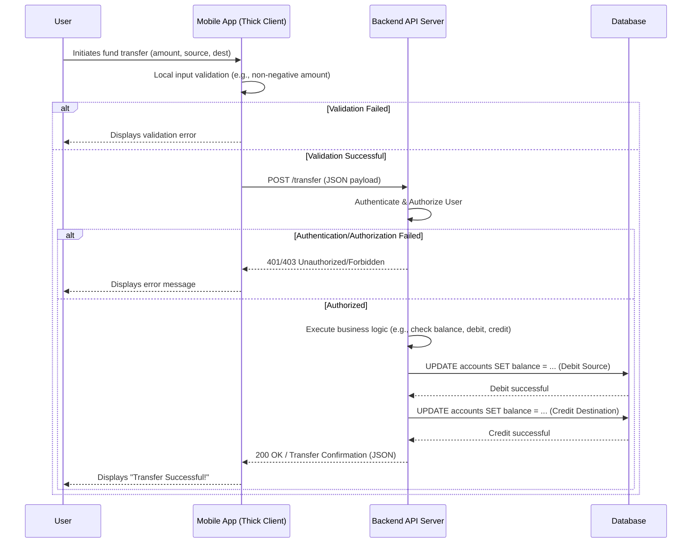
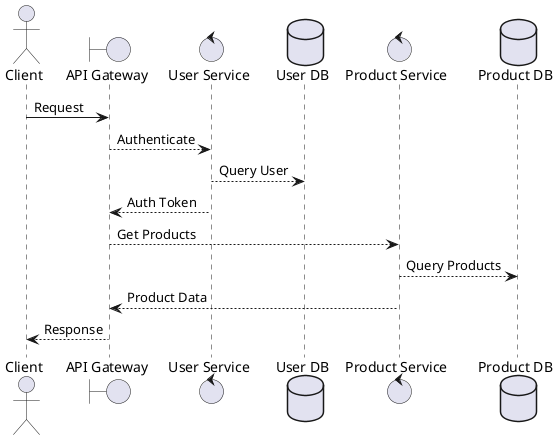
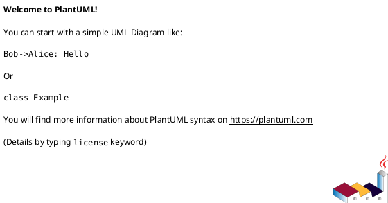

## Course Overview

Welcome to the Cohortia Software Design and Architecture Specialization! This comprehensive program is meticulously crafted for intermediate-level software engineers, developers, and aspiring architects who are ready to elevate their understanding and application of robust software design principles and architectural patterns. In today's complex software landscape, merely writing functional code is insufficient; building maintainable, scalable, secure, and performant systems requires a deep grasp of how to structure software effectively from the ground up. This specialization provides the essential knowledge and practical skills to design software that stands the test of time and evolving requirements.

Throughout this specialization, we will embark on a journey starting with the foundational principles of good software design, emphasizing object-oriented design (OOD) and its core tenets like SOLID and GRASP. We will then dive into the powerful world of design patterns, exploring how established solutions to recurring problems can significantly enhance code reusability, flexibility, and clarity. Learners will gain hands-on experience implementing various creational, structural, and behavioral patterns, understanding their trade-offs and appropriate contexts. This practical application is crucial for moving beyond theoretical knowledge to confident, real-world problem-solving.

As we progress, the specialization shifts its focus to the broader scope of software architecture. We will demystify what software architecture truly means, exploring common architectural styles such as layered, microservices, and event-driven architectures. Understanding how to choose the right architectural style, document it effectively, and evaluate its fitness for purpose against critical quality attributes like scalability, security, and reliability is paramount. The course will equip you with tools and techniques for architectural documentation, evaluation frameworks, and strategies for managing technical debt and evolving architectures in dynamic environments.

By the end of this specialization, you will not only be proficient in applying advanced design principles and patterns but also capable of making informed architectural decisions that impact an entire system's lifecycle. You will learn to communicate architectural choices clearly, anticipate future challenges, and build systems that are resilient and adaptable. This program is designed to transform you into a more thoughtful, strategic, and impactful contributor to any software development team, ready to tackle complex challenges with confidence and a strong architectural vision.

Upon successful completion of this specialization, you will be able to:

*   Apply fundamental software design principles, including cohesion, coupling, and the SOLID principles, to create maintainable and extensible codebases.
*   Identify and implement appropriate Object-Oriented Design (OOD) patterns, such as GRASP patterns, to solve common design problems.
*   Master the application of various Gang of Four design patterns (creational, structural, behavioral) to improve code flexibility, reusability, and clarity.
*   Understand and articulate the role of software architecture, distinguishing between design and architectural concerns.
*   Analyze and select suitable architectural styles (e.g., layered, microservices, event-driven) based on system requirements and quality attributes.
*   Employ architectural tactics to address specific quality attributes like performance, security, and availability.
*   Document software architectures effectively using standard models and notations, such as the C4 model and Architectural Decision Records (ADRs).
*   Evaluate existing and proposed architectures using systematic approaches like the Architecture Trade-off Analysis Method (ATAM).
*   Develop strategies for managing technical debt, refactoring, and evolving software architectures over time.
*   Communicate complex design and architectural concepts clearly to both technical and non-technical stakeholders.

## Syllabus Structure

| Module # | Theme | Chapters |
|----------|-------|----------|
| 1 | Foundations of Software Design | 4 |
| 2 | Object-Oriented Design Mastery | 5 |
| 3 | Creational and Structural Design Patterns | 5 |
| 4 | Behavioral and Concurrency Design Patterns | 6 |
| 5 | Fundamentals of Software Architecture | 6 |
| 6 | Architectural Patterns and Quality Attributes | 7 |
| 7 | Architectural Evaluation and Documentation | 7 |
| 8 | Architectural Evolution and Modern Trends | 9 |

Total chapters: 49
---

## Module 1: Foundations of Software Design
**Module Goal:** Establish a strong understanding of fundamental software design principles, object-oriented concepts, and the importance of good design in building robust, maintainable, and scalable software systems.

---

### Chapter 1.1 — The Essence of Software Design: Why It Matters

#### Learning objectives
*   Define software design and articulate its primary goals in the context of software development.
*   Explain the tangible impact of good versus poor design on the lifecycle and success of software projects.
*   Identify and describe key qualities and characteristics of well-designed software systems.
*   Recognize the concept of technical debt and its long-term implications for software projects.

#### Detailed lesson content
Software design is the intricate process of defining the architecture, components, interfaces, and other characteristics of a system or component. It's not just about writing code; it's about planning, structuring, and conceptualizing the solution before the first line of implementation. Think of it like an architect designing a building: they don't just start laying bricks. They create blueprints, consider the foundation, the layout of rooms, the plumbing, and electrical systems, all before construction begins. Similarly, in software, design ensures that the system is built on a solid foundation, capable of meeting current requirements and adapting to future changes.

The "why" of good software design is paramount. Without it, projects often devolve into a chaotic mess, leading to what's known as "technical debt." Technical debt is like financial debt: taking shortcuts now might save time in the short term, but it incurs interest in the form of increased complexity, slower development, and more bugs later on. A poorly designed system is difficult to understand, hard to modify, and prone to breaking when new features are added. This significantly impacts maintainability, making it costly and time-consuming to fix bugs or introduce updates. Imagine trying to fix a leaky pipe in a house where the plumbing was installed without any plan – it would be a nightmare.

Conversely, well-designed software offers numerous benefits. It is inherently more **maintainable**, meaning it's easier for developers to understand, debug, and fix issues. It promotes **scalability**, allowing the system to handle increased load or data volume without a complete overhaul. **Extensibility** is another crucial aspect; a good design anticipates future changes, making it straightforward to add new features or modify existing ones without disrupting the entire system. Furthermore, good design fosters **reusability**, enabling components or modules to be used in different parts of the same system or even in entirely new projects, saving development time and effort. Finally, it enhances **testability**, as well-defined, independent components are much easier to test in isolation, leading to more robust and reliable software. Good design is an ongoing activity, not a one-time event, requiring continuous refinement and adaptation throughout the software's lifecycle. It's an investment that pays dividends in reduced costs, faster development cycles, and higher quality software over the long run.

#### Key concepts
*   **Software Design:** The process of defining the architecture, components, interfaces, and other characteristics of a system or component.
*   **Technical Debt:** The implied cost of additional rework caused by choosing an easy solution now instead of using a better approach that would take longer.
*   **Maintainability:** The ease with which a software system or component can be modified to correct faults, improve performance or other attributes, or adapt to a changed environment.
*   **Scalability:** The capability of a system to handle a growing amount of work or its potential to be enlarged to accommodate that growth.
*   **Extensibility:** The ability to extend a system's functionality without modifying existing code.
*   **Reusability:** The degree to which a software component or system can be used in more than one system or for more than one purpose.
*   **Testability:** The ease with which a software system or component can be tested to determine if it meets its requirements.
*   **Reliability:** The probability that a system will perform its intended function without failure for a specified period under specified conditions.
*   **Performance:** The responsiveness of a system to the user and the amount of work it can accomplish in a given time period.
*   **Security:** The degree to which a system protects information and data from unauthorized access, use, disclosure, disruption, modification, or destruction.

#### Hands-on activity
Reflect on a past software project you've worked on, whether personal or professional.
1.  Identify at least one specific aspect of the project that you would consider **well-designed**. Describe why it was well-designed and what positive impact it had on the project (e.g., easy to add a new feature, simple to debug).
2.  Identify at least one specific aspect of the project that you would consider **poorly designed**. Describe why it was poorly designed and what negative impact it had (e.g., difficult to change, introduced many bugs, slowed down development).
3.  Based on your reflections, propose one concrete change you would make to improve the poorly designed aspect if you had the chance to revisit the project today.

#### Assessment idea
1.  **Question:** A software development team consistently misses deadlines, experiences frequent critical bugs after new releases, and spends a disproportionate amount of time fixing existing code rather than building new features. Which of the following is the MOST likely underlying cause of these issues?
    *   A) Insufficient developer experience.
    *   B) Lack of proper version control.
    *   C) Poor software design leading to high technical debt.
    *   D) Overly ambitious project scope.
    *   **Correct Answer:** C) Poor software design leading to high technical debt.
    *   **Explanation:** While other options might contribute, poor software design directly leads to complex, hard-to-maintain code (high technical debt). This makes it difficult to add features without introducing bugs, slows down development, and increases the time spent on maintenance, all of which manifest as missed deadlines and frequent bugs.

2.  **Question:** Explain why good software design is often considered an investment rather than an upfront cost, providing at least two specific benefits that justify this perspective.
    *   **Correct Answer:** Good software design is an investment because the effort put in upfront significantly reduces long-term costs and increases the system's value.
        *   **Benefit 1: Reduced Maintenance Costs:** Well-designed systems are easier to understand, debug, and modify. This means less time and resources are spent on fixing bugs and maintaining existing features, freeing up developers to work on new functionalities.
        *   **Benefit 2: Faster Feature Development and Adaptability:** With a clear, modular, and extensible design, adding new features or adapting to changing requirements becomes much quicker and less risky. The system can evolve gracefully, extending its useful lifespan and allowing the business to respond faster to market demands.

#### AI generation note
Create an 8-minute animated video. Start with a visual metaphor: contrast a "well-designed" city (organized, clear road networks, distinct districts for residential, commercial, industrial) with a "poorly designed" city (spaghetti roads, buildings haphazardly placed, no clear zoning). Transition this analogy to software. Use text overlays to highlight key terms like "Maintainability," "Scalability," and "Technical Debt." Include a short, professional voiceover explaining the concepts. Visually represent technical debt as a growing pile of "messy code" or "broken parts" that slows down a development team. End with a summary slide emphasizing design as an investment.

---

### Chapter 1.2 — Abstraction and Encapsulation: Core Design Principles

#### Learning objectives
*   Explain the concept of abstraction and its role in simplifying complex software systems.
*   Demonstrate how to apply abstraction using interfaces or abstract classes in practical code examples.
*   Articulate the principle of encapsulation and its importance in protecting data integrity and managing complexity.
*   Illustrate encapsulation through code examples, highlighting the benefits of information hiding and controlled access.

#### Detailed lesson content
At the heart of good software design are the principles of abstraction and encapsulation. These two concepts are fundamental to managing complexity, making systems easier to understand, and more robust against change. Let's start with **abstraction**. Abstraction is all about focusing on the essential features of an entity while hiding away the unnecessary details. Think about driving a car: you interact with the steering wheel, accelerator, and brake, but you don't need to understand the intricate mechanics of the engine, transmission, or fuel injection system to operate the vehicle. The car abstracts away those complexities, presenting a simpler interface for you to use.

In software, abstraction allows us to define what an object *does* without specifying *how* it does it. This is often achieved through interfaces or abstract classes. For instance, consider a system that handles various types of vehicles. We might define an `IVehicle` interface (in C# or Java) or an abstract `Vehicle` class (in Python) that declares common behaviors like `start()`, `stop()`, and `drive()`. Concrete classes like `Car`, `Bicycle`, or `Motorcycle` would then implement or extend this abstraction, each providing its own specific way of performing these actions. This means that any part of our system that needs to interact with a vehicle can do so through the `IVehicle` interface, without needing to know the specific type of vehicle it's dealing with. This significantly simplifies the code and makes it more flexible, as new vehicle types can be added without modifying existing code that uses the `IVehicle` interface.

```csharp
// C# Example: Abstraction with an Interface
public interface IVehicle
{
    void Start();
    void Stop();
    void Drive(double distance);
}

public class Car : IVehicle
{
    public void Start() { Console.WriteLine("Car engine started."); }
    public void Stop() { Console.WriteLine("Car engine stopped."); }
    public void Drive(double distance) { Console.WriteLine($"Car drove {distance} km."); }
}

public class Bicycle : IVehicle
{
    public void Start() { Console.WriteLine("Bicycle ride started."); }
    public void Stop() { Console.WriteLine("Bicycle ride stopped."); }
    public void Drive(double distance) { Console.WriteLine($"Bicycle rode {distance} km."); }
}

// Usage:
public class Driver
{
    public void Operate(IVehicle vehicle)
    {
        vehicle.Start();
        vehicle.Drive(10.5);
        vehicle.Stop();
    }
}
```

Next, let's delve into **encapsulation**. Encapsulation is the practice of bundling data (attributes) and methods (functions) that operate on that data within a single unit, typically a class, and restricting direct access to some of the object's components. This restriction is often referred to as **information hiding**. The core idea is to protect an object's internal state from external, unauthorized, or accidental modification. Instead of directly manipulating an object's data, other parts of the system interact with it through well-defined public methods.

Consider a `BankAccount` class. It has a `balance` attribute. If this `balance` were publicly accessible, any part of the code could directly change it, potentially leading to incorrect or negative balances without proper validation. Encapsulation dictates that `balance` should be private, and access should only be allowed through public methods like `Deposit()` and `Withdraw()`. These methods can then include validation logic (e.g., ensuring deposit amounts are positive, preventing withdrawals that exceed the balance). This ensures data integrity and makes the `BankAccount` object robust. A common mistake is exposing internal state directly (e.g., making all fields public), which leads to tight coupling and makes it difficult to maintain the object's invariants. By encapsulating internal details, we make the class easier to use, understand, and modify, as changes to the internal implementation won't affect external code as long as the public interface remains consistent.

```python
# Python Example: Encapsulation
class BankAccount:
    def __init__(self, initial_balance):
        if initial_balance < 0:
            raise ValueError("Initial balance cannot be negative.")
        self.__balance = initial_balance # Private attribute

    def deposit(self, amount):
        if amount > 0:
            self.__balance += amount
            print(f"Deposited {amount}. New balance: {self.__balance}")
        else:
            print("Deposit amount must be positive.")

    def withdraw(self, amount):
        if amount > 0 and self.__balance >= amount:
            self.__balance -= amount
            print(f"Withdrew {amount}. New balance: {self.__balance}")
            return True
        else:
            print("Invalid withdrawal amount or insufficient funds.")
            return False

    def get_balance(self): # Public method to access balance
        return self.__balance

# Usage:
account = BankAccount(100)
# account.__balance = -500 # This would cause an AttributeError, protecting the balance
account.deposit(50)
account.withdraw(75)
account.withdraw(200) # Fails due to insufficient funds
print(f"Current balance: {account.get_balance()}")
```

#### Key concepts
*   **Abstraction:** The process of simplifying complex reality by modeling classes based on their essential properties and behaviors, while hiding unnecessary details.
*   **Encapsulation:** The bundling of data with the methods that operate on that data, and restricting direct access to some of the object's components.
*   **Information Hiding:** The principle of concealing the internal implementation details of an object from the outside world, exposing only what is necessary through a public interface.
*   **Interface:** A contract that defines a set of methods that a class must implement, without providing any implementation details.
*   **Abstract Class:** A class that cannot be instantiated on its own and is designed to be inherited by subclasses, often containing abstract methods that must be implemented by concrete subclasses.
*   **Data Integrity:** The maintenance of, and the assurance of the accuracy and consistency of, data over its entire life-cycle.
*   **Coupling:** The degree of interdependence between software modules; encapsulation helps reduce coupling by limiting external dependencies on internal state.

#### Hands-on activity
Refactor a simple Python class to properly encapsulate its internal state and provide controlled access.

**Starter Code:**
```python
class UserProfile:
    def __init__(self, username, email, age, is_admin=False):
        self.username = username
        self.email = email
        self.age = age # Problem: age can be set to anything
        self.is_admin = is_admin # Problem: admin status can be changed directly

    def display_profile(self):
        print(f"Username: {self.username}")
        print(f"Email: {self.email}")
        print(f"Age: {self.age}")
        print(f"Admin: {self.is_admin}")

# How to improve encapsulation for 'age' and 'is_admin'?
# Add methods to safely update these properties with validation.
```

**Task:**
1.  Modify the `UserProfile` class to make `age` and `is_admin` private attributes (e.g., `self.__age`, `self.__is_admin`).
2.  Implement a `set_age(self, new_age)` method that validates `new_age` to ensure it's a positive integer (e.g., `new_age > 0` and `isinstance(new_age, int)`). If invalid, print an error message.
3.  Implement a `promote_to_admin(self)` method that allows setting `is_admin` to `True`.
4.  Implement a `demote_from_admin(self)` method that allows setting `is_admin` to `False`.
5.  Add `get_age()` and `is_admin_user()` methods to safely retrieve the private values.
6.  Test your refactored class by creating a `UserProfile` object and attempting to set invalid ages or directly modify `is_admin`.

#### Assessment idea
1.  **Question:** A `Product` class in a retail application has a public attribute `price`. A new requirement states that the price can never be negative. How would you apply encapsulation to enforce this rule, and why is it a better approach than simply documenting the rule?
    *   **Correct Answer:** To enforce the rule using encapsulation, the `price` attribute should be made private (e.g., `_price` in Python, `private price` in Java/C#). A public method, such as `set_price(new_price)`, should be introduced. This method would contain validation logic to check if `new_price` is non-negative before updating the internal `_price`. If `new_price` is negative, it would raise an error or simply not update the price. This is better than just documenting the rule because encapsulation provides compile-time or runtime enforcement, preventing accidental or intentional violations of the business rule. Documentation relies on developers remembering and adhering to the rule, which is error-prone.

2.  **Question:** Consider an `ImageProcessor` class that needs to apply various filters (e.g., grayscale, sepia, blur) to an image. Describe how you might use abstraction (e.g., an interface or abstract class) to design this system, and what benefits this approach offers.
    *   **Correct Answer:** You could define an `IFilter` interface (or an abstract `Filter` class) with a single method, `apply(image)`. Then, concrete filter classes like `GrayscaleFilter`, `SepiaFilter`, and `BlurFilter` would implement this interface, each providing its specific `apply` logic. The `ImageProcessor` would then accept an `IFilter` object (or a list of `IFilter` objects) and call its `apply` method, without needing to know the specific type of filter.
    *   **Benefits:**
        *   **Extensibility:** New filters can be added simply by creating a new class that implements `IFilter`, without modifying the `ImageProcessor` class.
        *   **Flexibility:** The `ImageProcessor` can apply any filter that adheres to the `IFilter` contract, making it highly adaptable.
        *   **Maintainability:** Each filter's logic is isolated within its own class, making it easier to understand, test, and debug individual filters.

#### AI generation note
Create a 12-minute interactive code demo. Begin with a Python class (`Product`) that has public attributes and no validation. Live-code the refactoring process: first, make the `price` attribute private, then introduce `set_price` and `get_price` methods with validation logic. Next, introduce the `IVehicle` interface (C# or Java) and show how `Car` and `Bicycle` implement it, demonstrating how a `Driver` can interact with different vehicles abstractly. Use a split-screen view: code editor on the left, console output on the right showing the effects of good/bad encapsulation. Include a pop-up quiz question after the `Product` refactoring about why private attributes are important.

---

### Chapter 1.3 — Modularity and Cohesion: Building Blocks of Good Design

#### Learning objectives
*   Define modularity and explain its fundamental benefits in the context of large-scale software development.
*   Differentiate between high and low cohesion, providing clear examples of each.
*   Apply principles to design modules with high cohesion, focusing on the Single Responsibility Principle.
*   Understand how the combination of modularity and high cohesion contributes to creating maintainable, understandable, and reusable software systems.

#### Detailed lesson content
As software systems grow in complexity, the ability to manage that complexity becomes paramount. This is where **modularity** comes into play. Modularity is the principle of breaking down a large, complex system into smaller, independent, and interchangeable parts, known as modules. Each module should ideally encapsulate a specific piece of functionality and have a clear, well-defined interface for interacting with other modules. Think of a modern car: it's composed of many modules – the engine, the transmission, the braking system, the infotainment system – each a distinct unit with a specific purpose. These modules can often be developed, tested, and even replaced independently, making the overall system much easier to manage.

The benefits of modularity are extensive. Firstly, it makes a system much **easier to understand** because developers can focus on one small, manageable part at a time. Secondly, it facilitates **parallel development**, as different teams or individuals can work on separate modules concurrently. Thirdly, it significantly improves **testability** and **debuggability**; if an issue arises, it's often isolated to a specific module, making it quicker to pinpoint and fix. Finally, modularity enhances **reusability**, as well-designed modules can be easily extracted and used in other parts of the system or even in entirely different projects, reducing redundant code and accelerating development.

Closely related to modularity is the concept of **cohesion**. Cohesion measures the degree to which the elements within a module belong together. In simpler terms, it's about how focused and single-minded a module is. We always strive for **high cohesion**, meaning that all the elements (functions, data, classes) within a module are strongly related and contribute to a single, well-defined purpose. A module with high cohesion performs one specific task, and it does it well. Conversely, **low cohesion** occurs when a module performs many unrelated or loosely related tasks. This often leads to what's colloquially known as a "God object" or "God class" – a single class that tries to do too much, becoming a central point of failure and a nightmare to maintain.

Imagine a toolbox versus a junk drawer. A toolbox, organized with specific tools for specific tasks (e.g., a wrench set, a screwdriver set), exhibits high cohesion. Each tool has a clear purpose. A junk drawer, on the other hand, filled with random items like batteries, old keys, rubber bands, and paper clips, represents low cohesion. If you need a specific item, you have to rummage through everything. In software, a highly cohesive module might be a `UserAuthenticator` that solely focuses on verifying user credentials, or a `ReportFormatter` that's only responsible for structuring report data. A low-cohesion module might be a `Utility` class that handles database connections, parses XML, sends emails, and performs complex calculations – all in one place. This violates the **Single Responsibility Principle (SRP)**, a key design principle stating that a module should have one, and only one, reason to change.

Let's look at a concrete example in Java. Consider a `ReportGenerator` class that not only generates the report content but also prints it, emails it, and archives it. This class has low cohesion because it's responsible for four distinct concerns.

```java
// Low Cohesion Example
public class ReportGenerator {
    public void generateReport(String data) {
        System.out.println("Generating report from data: " + data);
        // ... complex report generation logic ...
    }

    public void printReport(String reportContent) {
        System.out.println("Printing report: " + reportContent);
        // ... printing logic ...
    }

    public void emailReport(String reportContent, String recipient) {
        System.out.println("Emailing report to " + recipient + ": " + reportContent);
        // ... email sending logic ...
    }

    public void archiveReport(String reportContent) {
        System.out.println("Archiving report: " + reportContent);
        // ... archiving logic ...
    }
}
```

To improve cohesion, we would refactor this into separate, focused modules, each with a single responsibility:

```java
// High Cohesion Example (Refactored)
public class ReportFormatter {
    public String formatReport(String data) {
        System.out.println("Formatting report from data: " + data);
        // ... complex report generation logic, now focused on formatting ...
        return "Formatted Report: " + data;
    }
}

public class ReportPrinter {
    public void print(String reportContent) {
        System.out.println("Printing report: " + reportContent);
        // ... printing logic ...
    }
}

public class EmailSender {
    public void send(String reportContent, String recipient) {
        System.out.println("Emailing report to " + recipient + ": " + reportContent);
        // ... email sending logic ...
    }
}

public class ReportArchiver {
    public void archive(String reportContent) {
        System.out.println("Archiving report: " + reportContent);
        // ... archiving logic ...
    }
}

// Now, a ReportWorkflow orchestrates these highly cohesive modules
public class ReportWorkflow {
    private ReportFormatter formatter = new ReportFormatter();
    private ReportPrinter printer = new ReportPrinter();
    private EmailSender emailSender = new EmailSender();
    private ReportArchiver archiver = new ReportArchiver();

    public void processReport(String rawData, String recipient) {
        String formattedReport = formatter.formatReport(rawData);
        printer.print(formattedReport);
        emailSender.send(formattedReport, recipient);
        archiver.archive(formattedReport);
    }
}
```

This refactored design demonstrates high cohesion. Each class now has a single, clear responsibility. If the printing mechanism changes, only `ReportPrinter` needs modification. If the email sending logic changes, only `EmailSender` is affected. This makes the system much more robust, easier to test, and simpler to maintain. The `ReportWorkflow` class orchestrates these highly cohesive components, demonstrating how modularity and cohesion work together to build robust systems.

#### Key concepts
*   **Modularity:** The property of a system that has been decomposed into a set of cohesive and loosely coupled modules.
*   **Cohesion:** The degree to which the elements within a module belong together; a measure of the strength of functional relatedness of elements within a module.
*   **High Cohesion:** A desirable characteristic where a module performs a single, well-defined task or represents a single logical entity.
*   **Low Cohesion:** An undesirable characteristic where a module performs many unrelated or loosely related tasks.
*   **Single Responsibility Principle (SRP):** A design principle stating that a module (class, function, etc.) should have one, and only one, reason to change.
*   **God Object/Class:** An anti-pattern where a single object knows or does too much, accumulating too many responsibilities and becoming overly complex.

#### Hands-on activity
Given a Java method that handles multiple responsibilities related to user management, refactor it into separate, highly cohesive methods or classes following the Single Responsibility Principle.

**Starter Code (Java - pseudocode for brevity, assume `User` and `Logger` classes exist):**
```java
public class UserManager {
    public boolean processUserRequest(User user, String password, String resource) {
        // 1. Authenticate user
        if (!authenticate(user, password)) {
            Logger.logFailure("Authentication failed for " + user.getUsername());
            return false;
        }

        // 2. Authorize user for resource
        if (!authorize(user, resource)) {
            Logger.logFailure("Authorization failed for " + user.getUsername() + " on " + resource);
            return false;
        }

        // 3. Log success
        Logger.logSuccess("User " + user.getUsername() + " successfully accessed " + resource);

        // 4. Update user's last login timestamp
        updateLastLogin(user);

        return true;
    }

    private boolean authenticate(User user, String password) {
        // ... complex authentication logic ...
        return true; // Placeholder
    }

    private boolean authorize(User user, String resource) {
        // ... complex authorization logic ...
        return true; // Placeholder
    }

    private void updateLastLogin(User user) {
        // ... database update for last login ...
    }
}
```

**Task:**
1.  Identify the distinct responsibilities within the `processUserRequest` method.
2.  Refactor the `UserManager` class by creating new, more cohesive classes or methods. For example, you might introduce `Authenticator`, `Authorizer`, and `UserActivityLogger` classes, or at least separate methods within `UserManager` that each have a single responsibility.
3.  Rewrite `processUserRequest` to orchestrate these new, highly cohesive components.
4.  Explain how your refactoring improves the cohesion of the system.

#### Assessment idea
1.  **Question:** A `DataProcessor` class contains methods for reading data from a file, validating the data, transforming it, and then storing it in a database. What kind of cohesion does this class primarily exhibit, and why is it problematic for maintenance and testing?
    *   **Correct Answer:** This class exhibits low cohesion (likely logical or procedural cohesion, as the methods are related by being part of a data processing workflow but perform distinct operations). It's problematic because:
        *   **Maintenance:** If the file reading mechanism changes, or the validation rules are updated, or the database schema is modified, all these changes might require modifying the single `DataProcessor` class, increasing the risk of introducing bugs in unrelated functionalities.
        *   **Testing:** Testing this class becomes difficult because it has many dependencies (file system, validation rules, database). It's hard to test just the data transformation logic without involving file I/O or database interactions. Unit tests would become complex and less focused.

2.  **Question:** Describe the relationship between modularity and cohesion in building robust software systems. How do they complement each other?
    *   **Correct Answer:** Modularity and cohesion are complementary principles that together lead to robust software.
        *   **Modularity** is about dividing a system into independent, manageable parts (modules). It's the "what" – breaking down the system.
        *   **Cohesion** is about ensuring that each of these individual modules is focused on a single, well-defined responsibility. It's the "how well" – ensuring each part is well-formed.
    *   They complement each other by ensuring that not only is the system broken into pieces, but that those pieces are also internally consistent and focused. A system that is highly modular but has low cohesion within its modules would still be difficult to manage. Conversely, a system with highly cohesive components but no clear modular structure would still be a monolithic mess. The ideal is to have a system composed of many highly cohesive modules that are also loosely coupled (a concept we'll explore next). This combination makes the system easier to understand, develop, test, and maintain.

#### AI generation note
Create a 10-minute slide deck with animated diagrams. Start by visually representing a monolithic "blob" of code and then animate its decomposition into distinct modules to explain modularity. Use a "single-purpose tool" vs. "Swiss Army knife" analogy to visually differentiate high vs. low cohesion. Show the Java `ReportGenerator` example, first as low cohesion, then animate its refactoring into separate, high-cohesion classes, highlighting the SRP. Include a reflection prompt: "Think of a time you encountered a 'God object' in code. How did it impact development or debugging?"

---

### Chapter 1.4 — Coupling: Managing Dependencies Between Modules

#### Learning objectives
*   Define coupling and explain its significance in determining the maintainability and flexibility of a software system.
*   Differentiate between high and low coupling, and identify various types of coupling with practical examples.
*   Apply strategies and design patterns to reduce coupling between modules.
*   Understand how achieving low coupling contributes to more independent module development, easier testing, and greater system resilience to change.

#### Detailed lesson content
While cohesion focuses on the internal strength of a module, **coupling** addresses the relationships and dependencies *between* modules. Coupling is the degree of interdependence between software modules. In essence, it measures how much one module relies on another. Our goal in software design is almost always to achieve **low coupling**, meaning that modules are largely independent of each other. When modules are loosely coupled, a change in one module has minimal impact on others, making the system easier to maintain, test, and scale. Conversely, **high coupling** means modules are tightly bound; a change in one can have a ripple effect, requiring modifications across many other modules, leading to fragile and hard-to-change systems.

To illustrate, imagine a car where the steering wheel is directly welded to the tires (high coupling). If you want to change the steering wheel, you might have to replace the tires too. Now imagine a car where the steering wheel connects to the tires via a well-defined steering column and mechanism (low coupling). You can change the steering wheel or the tires independently, as long as the interface (the connection points) remains consistent.

There are various types of coupling, ranging from the worst (highest interdependence) to the best (lowest interdependence):

1.  **Content Coupling (Worst):** One module directly modifies the internal data or code of another module. This is extremely fragile and should be avoided at all costs.
2.  **Common Coupling:** Modules share global data (e.g., global variables, singletons). Changes to the shared data structure affect all modules using it, making it hard to track dependencies.
3.  **External Coupling:** Modules depend on external entities (e.g., operating system, hardware, external files). While often unavoidable, it ties modules to a specific environment.
4.  **Control Coupling:** One module passes flags or control information to another module to dictate its logic. This means the calling module needs to know too much about the called module's internal workings.
5.  **Stamp Coupling:** Modules exchange entire data structures (e.g., passing a whole `User` object when only the `username` is needed). This is better than common coupling but still exposes more data than necessary.
6.  **Data Coupling (Best):** Modules exchange only the necessary data through parameters. Each module operates on its own data and provides clear inputs/outputs. This is the ideal form of coupling.

Our aim is to move towards data coupling or, even better, to decouple modules using abstract interfaces.

Let's consider a practical example in C# or Java. Suppose we have an `OrderProcessor` that directly instantiates and uses a concrete `PaymentGateway` implementation. This creates high coupling:

```csharp
// High Coupling Example (C#)
public class PaymentGateway
{
    public bool ProcessPayment(decimal amount)
    {
        Console.WriteLine($"Processing payment of {amount:C} via concrete PaymentGateway.");
        // ... actual payment processing logic ...
        return true;
    }
}

public class OrderProcessor
{
    private PaymentGateway _gateway; // Direct dependency on concrete class

    public OrderProcessor()
    {
        _gateway = new PaymentGateway(); // Tightly coupled: OrderProcessor creates its dependency
    }

    public void PlaceOrder(decimal amount)
    {
        Console.WriteLine("Order placed. Initiating payment...");
        if (_gateway.ProcessPayment(amount))
        {
            Console.WriteLine("Payment successful. Order confirmed.");
        }
        else
        {
            Console.WriteLine("Payment failed. Order cancelled.");
        }
    }
}
```

In this example, `OrderProcessor` is tightly coupled to `PaymentGateway`. If we want to switch to a different payment provider (e.g., `PayPalGateway`, `StripeGateway`), we would need to modify `OrderProcessor`'s constructor. This violates the Open/Closed Principle (Open for extension, closed for modification), which we'll cover later.

To reduce coupling, we can introduce an interface and use **Dependency Injection**. Instead of `OrderProcessor` creating its `PaymentGateway`, it *receives* an `IPaymentGateway` through its constructor.

```csharp
// Low Coupling Example with Interface and Dependency Injection (C#)
public interface IPaymentGateway
{
    bool ProcessPayment(decimal amount);
}

public class CreditCardGateway : IPaymentGateway
{
    public bool ProcessPayment(decimal amount)
    {
        Console.WriteLine($"Processing payment of {amount:C} via CreditCardGateway.");
        // ... specific credit card processing logic ...
        return true;
    }
}

public class PayPalGateway : IPaymentGateway
{
    public bool ProcessPayment(decimal amount)
    {
        Console.WriteLine($"Processing payment of {amount:C} via PayPalGateway.");
        // ... specific PayPal processing logic ...
        return true;
    }
}

public class OrderProcessor
{
    private IPaymentGateway _gateway; // Dependency on interface, not concrete class

    // Dependency Injection via constructor
    public OrderProcessor(IPaymentGateway gateway)
    {
        _gateway = gateway;
    }

    public void PlaceOrder(decimal amount)
    {
        Console.WriteLine("Order placed. Initiating payment...");
        if (_gateway.ProcessPayment(amount))
        {
            Console.WriteLine("Payment successful. Order confirmed.");
        }
        else
        {
            Console.WriteLine("Payment failed. Order cancelled.");
        }
    }
}

// Usage in main application:
// var creditCardProcessor = new OrderProcessor(new CreditCardGateway());
// creditCardProcessor.PlaceOrder(99.99m);

// var payPalProcessor = new OrderProcessor(new PayPalGateway());
// payPalProcessor.PlaceOrder(49.50m);
```

Now, `OrderProcessor` depends only on the `IPaymentGateway` interface, not a specific implementation. The choice of which payment gateway to use is made *outside* the `OrderProcessor` (e.g., in the application's startup code). This significantly reduces coupling, making `OrderProcessor` more flexible, testable (we can easily mock `IPaymentGateway`), and resilient to changes in payment gateway implementations. Other strategies to reduce coupling include event-driven architectures, message queues, and service-oriented architectures, all aiming to minimize direct, tight dependencies between components.

**Safety Note:** While low coupling is generally desirable, excessive decoupling can sometimes introduce its own form of complexity, such as an explosion of interfaces or an overly complex dependency injection setup. The key is to find the right balance for your specific system and context, ensuring that the benefits of reduced coupling outweigh any added overhead.

#### Key concepts
*   **Coupling:** The degree of interdependence between software modules; a measure of how closely connected two modules are.
*   **High Coupling (Tight Coupling):** An undesirable characteristic where modules are highly dependent on each other, leading to ripple effects when changes occur.
*   **Low Coupling (Loose Coupling):** A desirable characteristic where modules have minimal dependencies on each other, promoting independence and easier maintenance.
*   **Content Coupling:** One module directly modifies the internal data or code of another.
*   **Common Coupling:** Modules share global data.
*   **External Coupling:** Modules depend on external entities like OS or hardware.
*   **Control Coupling:** One module passes control flags to another.
*   **Stamp Coupling:** Modules exchange entire data structures.
*   **Data Coupling:** Modules exchange only necessary data through parameters (most desirable).
*   **Dependency Injection (DI):** A technique where an object receives its dependencies from an external source rather than creating them itself.
*   **Interface:** A contract used to define behavior, allowing for interchangeable implementations and reducing coupling.

#### Hands-on activity
Refactor a simple C# or Java application where a `NotificationService` class directly creates and manages a `EmailSender` object. Introduce an interface for `IEmailSender` and use constructor dependency injection to reduce coupling.

**Starter Code (C#):**
```csharp
// High coupling example
public class EmailSender
{
    public void SendEmail(string recipient, string subject, string body)
    {
        Console.WriteLine($"Sending email to {recipient} with subject '{subject}' via concrete EmailSender.");
        // ... actual email sending logic ...
    }
}

public class NotificationService
{
    private EmailSender _emailSender; // Direct dependency on concrete class

    public NotificationService()
    {
        _emailSender = new EmailSender(); // Tightly coupled
    }

    public void SendWelcomeNotification(string userEmail, string userName)
    {
        string subject = "Welcome to Cohortia!";
        string body = $"Hello {userName},\n\nWelcome to our platform!";
        _emailSender.SendEmail(userEmail, subject, body);
    }
}

// How to reduce coupling using an interface and DI?
```

**Task:**
1.  Define an interface `IEmailSender` with a `SendEmail` method.
2.  Modify the existing `EmailSender` class to implement `IEmailSender`.
3.  Create a new class, `SmsSender`, that also implements `IEmailSender` (even though it's SMS, for demonstration purposes, it fulfills the `IEmailSender` contract for sending a message). Its `SendEmail` method should print "Sending SMS..." instead of "Sending email...".
4.  Refactor `NotificationService` to depend on the `IEmailSender` interface instead of the concrete `EmailSender` class, using constructor dependency injection.
5.  Demonstrate how you can now easily switch between `EmailSender` and `SmsSender` in your application's main method without modifying `NotificationService`.

#### Assessment idea
1.  **Question:** A `ReportProcessor` module directly calls a static method `DatabaseHelper.getConnection()` to establish a database connection. What type of coupling does this illustrate, and what are the primary disadvantages of this approach?
    *   **Correct Answer:** This illustrates **common coupling** (if `DatabaseHelper` manages a global connection pool or state) or **external coupling** (if `DatabaseHelper` is a utility that hides external resource dependency). The primary disadvantages are:
        *   **Reduced Testability:** It's difficult to test `ReportProcessor` in isolation without a real database connection, or to mock the `DatabaseHelper`'s behavior.
        *   **Lack of Flexibility:** `ReportProcessor` is tied to a specific `DatabaseHelper` implementation. Changing the database technology or connection strategy would require modifying `ReportProcessor`.
        *   **Hidden Dependencies:** The dependency on the database is not explicit in the `ReportProcessor`'s constructor or method signatures, making the code harder to understand and manage.

2.  **Question:** Explain how using interfaces and dependency injection can help reduce coupling between modules, using the `OrderProcessor` and `PaymentGateway` example discussed in the lesson.
    *   **Correct Answer:** In the high-coupling `OrderProcessor` example, `OrderProcessor` directly created an instance of `PaymentGateway`. This meant `OrderProcessor` was tightly bound to that specific concrete `PaymentGateway` implementation.
    *   By introducing an `IPaymentGateway` interface, `OrderProcessor` can now depend on the *interface* rather than a concrete class.
    *   **Dependency Injection** then allows an external entity (e.g., the application's main method or an IoC container) to *inject* a specific implementation of `IPaymentGateway` (like `CreditCardGateway` or `PayPalGateway`) into the `OrderProcessor`'s constructor.
    *   This reduces coupling because `OrderProcessor` no longer knows or cares about the specific type of payment gateway it's using; it only knows it has an object that fulfills the `IPaymentGateway` contract. This makes `OrderProcessor` more flexible (can easily swap payment providers), more testable (can inject mock `IPaymentGateway` for testing), and more resilient to changes in payment gateway implementations.

#### AI generation note
Create a 15-minute live coding video. Use a C# or Java project in an IDE. Start with the tightly coupled `NotificationService` and `EmailSender` example code. Live-code the refactoring: first, extract an `IEmailSender` interface. Then, modify `EmailSender` to implement it. Create a new `SmsSender` class implementing the same interface. Finally, refactor `NotificationService` to use constructor injection for `IEmailSender`. Demonstrate the flexibility by instantiating `NotificationService` with both `EmailSender` and `SmsSender` in the `Main` method. Include "common mistake" overlays when showing direct instantiation. Use clear console output to show the different behaviors.

---

## Module 2: Object-Oriented Design Mastery

Welcome to Module 2, where we'll elevate our understanding of software design from foundational concepts to mastering Object-Oriented Design (OOD) principles. This module is crucial for any aspiring software architect or engineer, as it lays the groundwork for creating robust, maintainable, and scalable systems. We'll revisit core OOP principles and then dive deep into the SOLID principles, which are the bedrock of good OOD. Finally, we'll explore Design by Contract and Defensive Programming, equipping you with powerful tools to build reliable software. By the end of this module, you'll not only understand these concepts but also be able to apply them practically to improve your designs.

### Chapter 2.1 — Reviewing Core OOP Principles

#### Learning objectives
*   Articulate the four fundamental principles of Object-Oriented Programming (OOP): Encapsulation, Inheritance, Polymorphism, and Abstraction.
*   Explain how each OOP principle contributes to building modular, flexible, and maintainable software systems.
*   Identify common pitfalls and anti-patterns related to misapplying OOP principles in design.
*   Apply basic OOP principles to structure a simple Python application.

#### Detailed lesson content
Object-Oriented Programming (OOP) forms the bedrock of modern software development, providing a powerful paradigm for structuring complex systems. Before we delve into advanced design principles, it's essential to have a solid grasp of its four core tenets: Encapsulation, Inheritance, Polymorphism, and Abstraction. These aren't just theoretical concepts; they are practical tools that, when applied correctly, lead to more robust, understandable, and scalable codebases.

**Encapsulation** is the bundling of data (attributes) and methods (functions) that operate on the data into a single unit, known as an object. Crucially, it also involves restricting direct access to some of an object's components, meaning the internal state of an object is hidden from the outside world. This is often achieved through access modifiers (like `private` or `protected` in languages like Java or C++, or by convention with leading underscores in Python). The primary benefit of encapsulation is data protection and reduced complexity. By exposing only a well-defined public interface, an object can manage its own state consistency. For instance, a `BankAccount` object might have a `_balance` attribute and `deposit()` and `withdraw()` methods. The `_balance` is internal, and external code interacts only through the methods, which can enforce rules like preventing negative withdrawals. A common mistake is to expose all internal attributes directly, which breaks encapsulation and makes the object's state vulnerable to invalid modifications from external code, leading to bugs that are hard to trace. Always ask: "Does external code *need* to know how this object stores its data, or just what it *does*?"

**Inheritance** allows a new class (subclass or derived class) to inherit properties and behaviors from an existing class (superclass or base class). This promotes code reusability and establishes a natural "is-a" relationship between classes. For example, a `Car` class and a `Motorcycle` class might both inherit from a `Vehicle` class, sharing common attributes like `speed` and `num_wheels` and methods like `start_engine()`. This avoids duplicating code and creates a hierarchical structure that mirrors real-world relationships. However, inheritance can be overused or misused, leading to tight coupling and rigid designs. Deep inheritance hierarchies can become difficult to manage, and changes in a base class can unexpectedly affect many subclasses. A common anti-pattern is using inheritance purely for code reuse when a "has-a" relationship (composition) would be more appropriate. For instance, a `Dog` "has a" `Tail`, it doesn't "is a" `Tail`. Safety note: Be cautious with multiple inheritance, as it can introduce complexity and ambiguity (the "diamond problem") in languages that support it.

**Polymorphism**, meaning "many forms," allows objects of different classes to be treated as objects of a common base class. It's often realized through method overriding (where a subclass provides a specific implementation for a method already defined in its superclass) or method overloading (where multiple methods with the same name but different parameters exist within the same class). In Python, polymorphism is largely achieved through duck typing: "If it walks like a duck and quacks like a duck, then it must be a duck." This means if two different objects have a method with the same name, they can be used interchangeably in contexts expecting that method, regardless of their actual class. Consider a `Shape` base class with a `calculate_area()` method. `Circle` and `Rectangle` subclasses would each implement `calculate_area()` in their own way. A function that takes a `Shape` object can then call `calculate_area()` without knowing the specific type of shape, achieving flexible and extensible code. The benefit here is that you can write generic code that operates on a variety of objects, as long as they adhere to a common interface or behavior.

Finally, **Abstraction** focuses on exposing only the essential features of an object while hiding the complex implementation details. It allows us to manage complexity by providing a simplified, high-level view of a system. Abstract classes and interfaces are common mechanisms for achieving abstraction in many languages. An `AbstractVehicle` class might define an `abstract start_engine()` method, forcing any concrete subclass (like `Car` or `Motorcycle`) to provide its own implementation. Users of the `AbstractVehicle` only need to know that it can `start_engine()`, not *how* it does it. This separation of concerns simplifies the client code and makes the system easier to modify and extend. If the internal mechanism of `start_engine()` changes for `Car`, the code using `AbstractVehicle` doesn't need to be updated. A common mistake is to expose too much detail, which defeats the purpose of abstraction and makes the system harder to understand and maintain.

Together, these principles enable us to design software that is not only functional but also adaptable to change, easier to debug, and more collaborative to develop. Understanding their interplay is fundamental to mastering OOD.

#### Key concepts
*   **Encapsulation:** The bundling of data and methods that operate on the data into a single unit (an object), and restricting direct access to some of an object's components.
*   **Inheritance:** A mechanism where a new class (subclass) derives properties and behaviors from an existing class (superclass), promoting code reuse and establishing an "is-a" relationship.
*   **Polymorphism:** The ability of objects of different classes to be treated as objects of a common base class or interface, allowing methods to behave differently based on the object's type.
*   **Abstraction:** The process of simplifying complex reality by modeling classes based on essential properties and behaviors, hiding implementation details and exposing only necessary information.
*   **Duck Typing:** A concept in dynamically typed languages (like Python) where the validity of an object for a particular operation is determined by the presence of certain methods or attributes, rather than by its explicit type or inheritance.

#### Hands-on activity
**Activity: Designing a Simple Payment Processor**

You need to design a basic payment processing system that can handle different payment methods.

1.  **Create a base `PaymentMethod` class:** This class should have an `abstract` or `placeholder` method called `process_payment(amount)`.
2.  **Implement `CreditCardPayment` and `PayPalPayment` subclasses:**
    *   `CreditCardPayment` should have attributes for `card_number`, `expiration_date`, and `cvv`. Its `process_payment` method should simulate processing a credit card.
    *   `PayPalPayment` should have an attribute for `email`. Its `process_payment` method should simulate processing a PayPal transaction.
3.  **Demonstrate Polymorphism:** Create a list of different payment method objects and iterate through them, calling `process_payment` on each.
4.  **Demonstrate Encapsulation:** Ensure that sensitive details like card numbers or emails are handled internally and not directly exposed or easily modified externally after initialization.

**Starter Code (Python):**

```python
from abc import ABC, abstractmethod

class PaymentMethod(ABC):
    """Abstract base class for all payment methods."""
    @abstractmethod
    def process_payment(self, amount: float) -> bool:
        """Processes a payment of the given amount.
        Returns True if successful, False otherwise.
        """
        pass

class CreditCardPayment(PaymentMethod):
    def __init__(self, card_number: str, expiration_date: str, cvv: str):
        # TODO: Implement secure storage/validation for real-world scenarios
        self.__card_number = card_number # Encapsulated
        self.__expiration_date = expiration_date
        self.__cvv = cvv
        print(f"Credit Card initialized for card ending in {card_number[-4:]}")

    def process_payment(self, amount: float) -> bool:
        print(f"Processing ${amount:.2f} via Credit Card {self.__card_number[-4:]}...")
        # Simulate payment gateway interaction
        if amount > 0:
            print("Credit Card payment successful.")
            return True
        print("Credit Card payment failed.")
        return False

class PayPalPayment(PaymentMethod):
    def __init__(self, email: str):
        self.__email = email # Encapsulated
        print(f"PayPal initialized for account {email}")

    def process_payment(self, amount: float) -> bool:
        print(f"Processing ${amount:.2f} via PayPal account {self.__email}...")
        # Simulate payment gateway interaction
        if amount > 0 and "@" in self.__email: # Basic validation
            print("PayPal payment successful.")
            return True
        print("PayPal payment failed.")
        return False

# --- Your code to demonstrate polymorphism goes here ---
# Example:
# payments = [
#     CreditCardPayment("1234-5678-9012-3456", "12/25", "123"),
#     PayPalPayment("user@example.com")
# ]
#
# for method in payments:
#     method.process_payment(100.50)
```

#### Assessment idea
1.  **Question:** You are designing a system for a library. You have a `Book` class and a `Magazine` class. Both have a `title` and `publication_date`. The `Book` class also has an `author` and `isbn`, while `Magazine` has an `issue_number`. Which OOP principle would you use to create a common interface for displaying information about both `Book` and `Magazine` objects, allowing you to treat them uniformly in a list?
    *   **Correct Answer:** Polymorphism, specifically through a common base class or interface (e.g., `LibraryItem`) that defines a method like `display_info()`. Both `Book` and `Magazine` would inherit from `LibraryItem` and implement their own `display_info()` method. This allows a list of `LibraryItem` objects to call `display_info()` on each item without needing to know its specific type.
2.  **Question:** Consider a `User` class with attributes `username` and `password`. To ensure the `password` is always stored securely (e.g., hashed) and never directly exposed or modified after creation, which OOP principle should be primarily applied? Explain how you would implement this.
    *   **Correct Answer:** Encapsulation. You would make the `password` attribute private (e.g., `_password` or `__password` in Python, or `private` in Java/C#) and provide a method (e.g., `set_password(new_password)`) that handles hashing the new password before storing it. There would typically be no public "get password" method, only methods for authentication (e.g., `authenticate(provided_password)`) that compare the hashed provided password with the stored hashed password. This prevents external code from directly accessing or setting the plain-text password.

#### AI generation note
Create a 12-minute mixed-media lesson. Start with a 3-minute animated overview explaining Encapsulation, Inheritance, Polymorphism, and Abstraction with simple, relatable analogies (e.g., a car for encapsulation, family tree for inheritance, different remotes for polymorphism, car dashboard for abstraction). Follow with 7 minutes of live coding in Python, demonstrating each principle using the `PaymentMethod` example from the hands-on activity, showing how `__` prefix achieves encapsulation and how iterating through a list of different payment types showcases polymorphism. Include a split-screen view of code and terminal output. Conclude with a 2-minute interactive quiz asking learners to identify the OOP principle being applied in short code snippets. Ensure captions and alt text for diagrams.

### Chapter 2.2 — SOLID Principles - Single Responsibility and Open/Closed

#### Learning objectives
*   Define the Single Responsibility Principle (SRP) and explain its importance in creating cohesive and maintainable classes.
*   Identify violations of SRP in existing code and refactor them to adhere to the principle.
*   Articulate the Open/Closed Principle (OCP) and its role in building extensible software systems.
*   Apply OCP using techniques like abstraction and polymorphism to allow for new functionality without modifying existing code.

#### Detailed lesson content
As we move beyond the core OOP principles, we encounter the SOLID principles – a set of five design guidelines that significantly improve the maintainability, flexibility, and extensibility of object-oriented software. We'll start with the first two: the Single Responsibility Principle (SRP) and the Open/Closed Principle (OCP). These principles are foundational for writing clean, robust, and adaptable code.

The **Single Responsibility Principle (SRP)** states that a class should have only one reason to change. This means that a class should have only one primary responsibility, or put another way, it should have only one axis of change. If a class has multiple responsibilities, changes to one responsibility might inadvertently affect another, leading to unexpected bugs and making the code harder to maintain. For example, consider a `ReportGenerator` class that is responsible for:
1.  Fetching data from a database.
2.  Formatting the data into a report (e.g., PDF, CSV).
3.  Sending the report via email.

If the database schema changes, the `ReportGenerator` needs to change. If the report format changes, it needs to change. If the email delivery mechanism changes, it needs to change. This class has three reasons to change, violating SRP. A better design would involve separating these responsibilities into distinct classes: `ReportDataFetcher`, `ReportFormatter`, and `ReportSender`. Each of these new classes would have only one reason to change, making the system more modular and easier to manage.

A common mistake is creating "God objects" – classes that try to do too much. These classes become central points of failure and complexity. When adhering to SRP, classes tend to be smaller, more focused, and easier to test. This also improves readability, as each class's purpose is clear. Safety note: While striving for single responsibility, avoid over-fragmentation. Sometimes, closely related responsibilities can reside in the same class if they always change together. The key is to identify independent axes of change.

Let's look at a Python example of violating and adhering to SRP:

**SRP Violation:**

```python
class Order:
    def __init__(self, items, customer_email):
        self.items = items
        self.customer_email = customer_email

    def calculate_total(self):
        return sum(item.price * item.quantity for item in self.items)

    def save_to_database(self):
        print(f"Saving order for {self.customer_email} to database...")
        # Logic to interact with a database
        return True

    def send_confirmation_email(self):
        print(f"Sending confirmation email to {self.customer_email}...")
        # Logic to send email
        return True
```
Here, the `Order` class is responsible for calculating totals, persisting itself, and sending emails. This violates SRP.

**SRP Adherence:**

```python
class Order:
    def __init__(self, items, customer_email):
        self.items = items
        self.customer_email = customer_email

    def calculate_total(self):
        return sum(item.price * item.quantity for item in self.items)

class OrderRepository:
    def save(self, order: Order):
        print(f"Saving order for {order.customer_email} to database...")
        # Database interaction logic here
        return True

class EmailService:
    def send_confirmation(self, order: Order):
        print(f"Sending confirmation email for order total ${order.calculate_total():.2f} to {order.customer_email}...")
        # Email sending logic here
        return True

# Usage:
# order = Order(items=[...], customer_email="test@example.com")
# repository = OrderRepository()
# email_service = EmailService()
#
# repository.save(order)
# email_service.send_confirmation(order)
```
Now, `Order` focuses on its data and business logic, `OrderRepository` handles persistence, and `EmailService` handles notifications. Each has one reason to change.

The **Open/Closed Principle (OCP)** states that software entities (classes, modules, functions, etc.) should be open for extension, but closed for modification. This means you should be able to add new functionality to a system without altering existing, working code. The primary way to achieve OCP is through abstraction and polymorphism. Instead of modifying a class directly when new behavior is required, you extend it by creating new classes that implement the same interface or inherit from the same abstract base class.

Consider a `DiscountCalculator` that applies discounts based on customer type. If you initially have `StandardCustomer` and `PremiumCustomer`, and later introduce `VIPCustomer`, a violation of OCP would be to add an `if/else if/else` block inside the `DiscountCalculator` to handle the new `VIPCustomer` type. This requires modifying existing code.

**OCP Violation:**

```python
class Customer:
    def __init__(self, type):
        self.type = type

class DiscountCalculator:
    def calculate_discount(self, customer: Customer, amount: float):
        if customer.type == "Standard":
            return amount * 0.05
        elif customer.type == "Premium":
            return amount * 0.10
        elif customer.type == "VIP": # New type requires modification
            return amount * 0.15
        else:
            return 0
```
Every time a new customer type is added, the `calculate_discount` method must be modified.

**OCP Adherence:**

```python
from abc import ABC, abstractmethod

class Customer(ABC): # Make Customer an abstract base for polymorphic behavior
    @abstractmethod
    def get_discount_rate(self) -> float:
        pass

class StandardCustomer(Customer):
    def get_discount_rate(self) -> float:
        return 0.05

class PremiumCustomer(Customer):
    def get_discount_rate(self) -> float:
        return 0.10

class VIPCustomer(Customer): # New customer type, no modification to DiscountCalculator needed
    def get_discount_rate(self) -> float:
        return 0.15

class DiscountCalculator:
    def calculate_discount(self, customer: Customer, amount: float):
        return amount * customer.get_discount_rate()

# Usage:
# standard_cust = StandardCustomer()
# premium_cust = PremiumCustomer()
# vip_cust = VIPCustomer()
#
# calculator = DiscountCalculator()
# print(f"Standard discount: {calculator.calculate_discount(standard_cust, 100)}")
# print(f"Premium discount: {calculator.calculate_discount(premium_cust, 100)}")
# print(f"VIP discount: {calculator.calculate_discount(vip_cust, 100)}")
```
Now, if a `WholesaleCustomer` is introduced, you simply create a new `WholesaleCustomer` class inheriting from `Customer` and implement its `get_discount_rate()` method. The `DiscountCalculator` remains unchanged, adhering to OCP. This makes the system much more resilient to change and easier to extend with new features. Common mistake: Hardcoding specific implementations instead of relying on abstractions. Safety note: While OCP is powerful, don't over-engineer for every conceivable future change. Apply it where changes are likely and impactful.

#### Key concepts
*   **Single Responsibility Principle (SRP):** A class should have only one reason to change, meaning it should have only one primary responsibility.
*   **Open/Closed Principle (OCP):** Software entities should be open for extension but closed for modification, allowing new functionality to be added without altering existing code.
*   **God Object:** An anti-pattern where a single class takes on too many responsibilities, violating SRP and leading to a complex, tightly coupled, and hard-to-maintain system.
*   **Abstraction:** (Revisited) The concept of defining a common interface or base class that hides implementation details, crucial for applying OCP.
*   **Polymorphism:** (Revisited) The ability of objects of different types to respond to the same method call in their own specific ways, enabling OCP by allowing new implementations without changing calling code.

#### Hands-on activity
**Activity: Refactoring a Logging System**

You have a simple logging class that currently handles both formatting log messages and writing them to a file. Your task is to refactor it to adhere to SRP and OCP.

1.  **Identify SRP Violation:** In the initial `Logger` class, identify the two distinct responsibilities.
2.  **Refactor for SRP:** Create separate classes for each responsibility. For example, a `LogFormatter` and a `LogWriter` (or `FileLogger`).
3.  **Refactor for OCP:** Design your `LogWriter` (or a base `LogDestination`) such that you can easily add new logging destinations (e.g., `ConsoleLogger`, `DatabaseLogger`) without modifying the core `Logger` class. Use an abstract base class and polymorphism.

**Starter Code (Python - SRP Violation):**

```python
class Logger:
    def __init__(self, filename="app.log"):
        self.filename = filename

    def _format_message(self, level, message):
        import datetime
        timestamp = datetime.datetime.now().strftime("%Y-%m-%d %H:%M:%S")
        return f"[{timestamp}] [{level.upper()}] {message}"

    def log_info(self, message):
        formatted_message = self._format_message("info", message)
        self._write_to_file(formatted_message)

    def log_error(self, message):
        formatted_message = self._format_message("error", message)
        self._write_to_file(formatted_message)

    def _write_to_file(self, message):
        with open(self.filename, "a") as f:
            f.write(message + "\n")

# Initial usage:
# logger = Logger()
# logger.log_info("Application started.")
# logger.log_error("Failed to connect to database.")
```

#### Assessment idea
1.  **Question:** You are building a system for processing online orders. Currently, you have a `OrderProcessor` class with a method `process_order(order)` that performs the following steps:
    *   Validates the order details.
    *   Calculates the total price.
    *   Saves the order to the database.
    *   Sends a confirmation email to the customer.
    Which SOLID principle is being violated, and how would you refactor the `OrderProcessor` to adhere to it?
    *   **Correct Answer:** The Single Responsibility Principle (SRP) is being violated. The `OrderProcessor` has multiple reasons to change (validation logic changes, pricing logic changes, database interaction changes, email sending logic changes). To refactor, you would extract each distinct responsibility into its own class or module:
        *   `OrderValidator` (for validating order details)
        *   `PriceCalculator` (for calculating total price)
        *   `OrderRepository` (for saving/loading orders to/from the database)
        *   `EmailService` (for sending confirmation emails)
        The `OrderProcessor` would then orchestrate these separate components, delegating each specific task to the appropriate specialized class, thus having only one responsibility: coordinating the order processing workflow.
2.  **Question:** A reporting module currently generates reports in PDF format. The `ReportGenerator` class has a `generate_pdf_report(data)` method. The client now requests the ability to generate reports in CSV format as well, and potentially other formats in the future. How can you modify the system to accommodate this new requirement while adhering to the Open/Closed Principle (OCP)? Provide a conceptual code snippet.
    *   **Correct Answer:** To adhere to OCP, we should avoid modifying the existing `ReportGenerator` class directly. Instead, we should introduce an abstraction for report generation.
        *   Define an abstract base class or interface, e.g., `ReportExporter`, with an abstract method like `export(data)`.
        *   Create concrete implementations for each format: `PdfReportExporter` and `CsvReportExporter`, both inheriting from `ReportExporter` and implementing the `export` method.
        *   The `ReportGenerator` class would then accept an instance of `ReportExporter` (via dependency injection) and delegate the actual export task to it.
        This way, adding a new format (e.g., `ExcelReportExporter`) only requires creating a new class without touching `ReportGenerator` or the existing exporters.

        **Conceptual Code Snippet:**
        ```python
        from abc import ABC, abstractmethod

        class ReportExporter(ABC):
            @abstractmethod
            def export(self, data):
                pass

        class PdfReportExporter(ReportExporter):
            def export(self, data):
                print("Generating PDF report...")
                # PDF generation logic
                return "PDF Report Content"

        class CsvReportExporter(ReportExporter):
            def export(self, data):
                print("Generating CSV report...")
                # CSV generation logic
                return "CSV Report Content"

        class ReportGenerator:
            def __init__(self, exporter: ReportExporter):
                self.exporter = exporter

            def generate_report(self, data):
                return self.exporter.export(data)

        # Usage:
        # data = {"header": ["Name", "Value"], "rows": [["Item A", 10], ["Item B", 20]]}
        #
        # pdf_generator = ReportGenerator(PdfReportExporter())
        # pdf_generator.generate_report(data)
        #
        # csv_generator = ReportGenerator(CsvReportExporter())
        # csv_generator.generate_report(data)
        ```

#### AI generation note
Produce a 10-minute live coding video. Begin by showing the `Order` class violating SRP, explaining why it's problematic. Then, refactor the `Order` class into `Order`, `OrderRepository`, and `EmailService` classes, demonstrating the improved modularity. Next, present the `DiscountCalculator` violating OCP with `if/elif` statements. Live code the refactoring using an abstract `Customer` base class and concrete customer types, showing how new customer types can be added without modifying the `DiscountCalculator`. Use Python for all code examples. Include a split-screen view of the code editor and console output. End with a 2-question interactive quiz focused on identifying SRP and OCP violations in provided code snippets.

### Chapter 2.3 — SOLID Principles - Liskov Substitution and Interface Segregation

#### Learning objectives
*   Understand the Liskov Substitution Principle (LSP) and its implications for correct inheritance hierarchies and subtype behavior.
*   Identify common violations of LSP, such as methods throwing unexpected exceptions or changing behavior in a way that breaks client expectations.
*   Define the Interface Segregation Principle (ISP) and explain how it prevents "fat" interfaces and promotes focused abstractions.
*   Apply ISP to design smaller, client-specific interfaces that improve modularity and reduce unnecessary dependencies.

#### Detailed lesson content
Continuing our exploration of the SOLID principles, we now turn our attention to the Liskov Substitution Principle (LSP) and the Interface Segregation Principle (ISP). These principles guide us in creating robust inheritance hierarchies and lean, focused interfaces, respectively, which are critical for building flexible and maintainable systems.

The **Liskov Substitution Principle (LSP)**, formulated by Barbara Liskov, states that objects of a superclass should be replaceable with objects of its subclasses without breaking the application. More formally, if `S` is a subtype of `T`, then objects of type `T` may be replaced with objects of type `S` without altering any of the desirable properties of the program. This principle is fundamental to correct inheritance and polymorphism. It implies that a subclass should not only conform to the superclass's interface but also to its *behavioral contract*. If a subclass changes the fundamental behavior expected by clients of the superclass, it violates LSP.

A classic example of an LSP violation is the "Square is a Rectangle" problem. Mathematically, a square is a rectangle. However, in an object-oriented context, if a `Square` class inherits from a `Rectangle` class, problems can arise. A `Rectangle` typically has independent `set_width()` and `set_height()` methods. If you set the width of a `Rectangle` to 10 and height to 5, its area is 50. If `Square` inherits from `Rectangle` and overrides `set_width()` and `set_height()` to ensure `width == height` (e.g., setting both to the same value when one is changed), then substituting a `Square` where a `Rectangle` is expected can lead to unexpected behavior. For instance, if a client expects to be able to set width and height independently, a `Square` object would break that expectation. The client code that works perfectly with a `Rectangle` might fail or produce incorrect results when given a `Square`.

**LSP Violation Example (Conceptual Python):**

```python
class Rectangle:
    def __init__(self, width, height):
        self._width = width
        self._height = height

    def set_width(self, width):
        self._width = width

    def set_height(self, height):
        self._height = height

    def get_area(self):
        return self._width * self._height

class Square(Rectangle):
    def __init__(self, side):
        super().__init__(side, side)

    def set_width(self, width):
        self._width = width
        self._height = width # Square-specific behavior
    
    def set_height(self, height):
        self._width = height # Square-specific behavior
        self._height = height

def test_area(rectangle: Rectangle):
    rectangle.set_width(5)
    rectangle.set_height(10)
    print(f"Expected area: 50, Actual area: {rectangle.get_area()}")

# Usage:
# rect = Rectangle(2, 3)
# test_area(rect) # Works as expected: Expected area: 50, Actual area: 50
#
# square = Square(3)
# test_area(square) # Violates LSP: Expected area: 50, Actual area: 100 (because set_height also changed width)
```
The `test_area` function expects `set_width` and `set_height` to behave independently. `Square` changes this behavior, breaking the contract. A better approach might be to have a common `Shape` interface and separate `Rectangle` and `Square` classes, or use composition. Common mistakes include a subclass throwing exceptions that the base class method doesn't, or returning `None` when the base class guarantees a non-null return. Safety note: Always ensure that preconditions are not strengthened and postconditions are not weakened in subclasses.

The **Interface Segregation Principle (ISP)** states that clients should not be forced to depend on interfaces they do not use. In simpler terms, it's better to have many small, client-specific interfaces than one large, general-purpose (or "fat") interface. When a class implements a fat interface, it might be forced to implement methods that are irrelevant to its specific purpose, leading to empty or dummy implementations, which is a code smell. This also creates unnecessary coupling: if a method in the fat interface changes, all implementing classes might need to be recompiled or retested, even if they don't use that specific method.

Consider a `Worker` interface with methods like `work()`, `eat()`, `sleep()`, `manage_team()`, `take_break()`. A `HumanWorker` might implement all of these, but a `RobotWorker` might only `work()` and `take_break()`, having no `eat()`, `sleep()`, or `manage_team()` methods. Forcing `RobotWorker` to implement these irrelevant methods violates ISP.

**ISP Violation Example (Conceptual Python):**

```python
from abc import ABC, abstractmethod

class IWorker(ABC): # A "fat" interface
    @abstractmethod
    def work(self): pass
    @abstractmethod
    def eat(self): pass
    @abstractmethod
    def sleep(self): pass
    @abstractmethod
    def manage_team(self): pass

class HumanWorker(IWorker):
    def work(self): print("Human working...")
    def eat(self): print("Human eating...")
    def sleep(self): print("Human sleeping...")
    def manage_team(self): print("Human managing team...")

class RobotWorker(IWorker):
    def work(self): print("Robot working...")
    def eat(self): pass # Irrelevant, forced implementation
    def sleep(self): pass # Irrelevant, forced implementation
    def manage_team(self): pass # Irrelevant, forced implementation
```
Here, `RobotWorker` is forced to implement methods it doesn't use.

**ISP Adherence:**

```python
class IWorkable(ABC):
    @abstractmethod
    def work(self): pass

class IEatable(ABC):
    @abstractmethod
    def eat(self): pass

class ISleepable(ABC):
    @abstractmethod
    def sleep(self): pass

class IManageable(ABC):
    @abstractmethod
    def manage_team(self): pass

class HumanWorker(IWorkable, IEatable, ISleepable, IManageable):
    def work(self): print("Human working...")
    def eat(self): print("Human eating...")
    def sleep(self): print("Human sleeping...")
    def manage_team(self): print("Human managing team...")

class RobotWorker(IWorkable): # Only implements what it needs
    def work(self): print("Robot working...")

# Usage:
# human = HumanWorker()
# robot = RobotWorker()
#
# human.work()
# human.eat()
# robot.work()
# # robot.eat() would be an error, as expected
```
By breaking down the large `IWorker` interface into smaller, role-specific interfaces (`IWorkable`, `IEatable`, etc.), `RobotWorker` only needs to implement `IWorkable`. This reduces the burden on implementing classes and makes the design more flexible. Clients that only need a worker to `work()` can depend solely on `IWorkable`, reducing their coupling to other irrelevant functionalities. Common mistake: Creating one large interface for all possible operations. Safety note: While segregating interfaces, ensure that the resulting small interfaces still make sense as cohesive units of behavior.

#### Key concepts
*   **Liskov Substitution Principle (LSP):** Objects of a superclass should be replaceable with objects of its subclasses without altering the correctness of the program. Subtypes must be substitutable for their base types.
*   **Behavioral Contract:** The expected behavior of a method or class, including its preconditions, postconditions, and invariants, which subclasses must adhere to.
*   **Interface Segregation Principle (ISP):** Clients should not be forced to depend on interfaces they do not use. It's better to have many small, client-specific interfaces than one large, general-purpose interface.
*   **Fat Interface:** A large interface that contains many methods, some of which may not be relevant to all classes that implement the interface.
*   **Duck Typing (revisited):** In Python, LSP is often implicitly followed if duck typing is used correctly, meaning if a subtype "walks and quacks" like the supertype in all relevant contexts, it's substitutable.

#### Hands-on activity
**Activity: Designing a Multi-functional Printer System**

You are tasked with designing a system for managing different types of office machines.

1.  **LSP Violation Scenario:**
    *   Create a base class `Printer` with a method `print_document(document)`.
    *   Create a subclass `PhotoPrinter` that inherits from `Printer`.
    *   Introduce a method `print_photo(photo)` in `PhotoPrinter`.
    *   Now, imagine a scenario where a client function expects a `Printer` object and calls `print_document`. If `PhotoPrinter` *overrides* `print_document` to only accept `photo` formats or throws an error for `document` formats, it violates LSP.
    *   **Your task:** Implement `Printer` and `PhotoPrinter` such that `PhotoPrinter` *does not* violate LSP when a client expects a generic `Printer`. How would you ensure `print_document` works for `PhotoPrinter` too, perhaps by converting the document or simply printing it as a generic image?

2.  **ISP Adherence Scenario:**
    *   Consider a `MultiFunctionDevice` that can `print()`, `scan()`, and `fax()`.
    *   Instead of one `IMultiFunctionDevice` interface with all three methods, create separate, specific interfaces: `IPrinter`, `IScanner`, `IFaxMachine`.
    *   Implement a `SimplePrinter` class that only implements `IPrinter`.
    *   Implement a `AdvancedMultiFunctionDevice` class that implements `IPrinter`, `IScanner`, and `IFaxMachine`.
    *   Show how a client that only needs printing functionality can depend solely on `IPrinter`, adhering to ISP.

**Starter Code (Python):**

```python
from abc import ABC, abstractmethod

# --- LSP Scenario ---
class Printer(ABC):
    @abstractmethod
    def print_document(self, document: str):
        pass

class BasicPrinter(Printer):
    def print_document(self, document: str):
        print(f"Basic Printer: Printing document: '{document}'")

class PhotoPrinter(Printer):
    # TODO: Implement print_document here to NOT violate LSP
    # It should still be able to print a generic document
    # while also having its specific print_photo method.
    def print_document(self, document: str):
        print(f"Photo Printer: Printing document as a generic image: '{document}'")

    def print_photo(self, photo_path: str):
        print(f"Photo Printer: Printing high-resolution photo from: '{photo_path}'")

def client_print_job(printer: Printer, doc_content: str):
    print("\nClient initiating generic print job...")
    printer.print_document(doc_content)

# --- ISP Scenario ---
class IPrinter(ABC):
    @abstractmethod
    def print(self, content: str):
        pass

class IScanner(ABC):
    @abstractmethod
    def scan(self, document_id: str):
        pass

class IFaxMachine(ABC):
    @abstractmethod
    def fax(self, document_id: str, recipient_number: str):
        pass

class SimplePrinter(IPrinter):
    def print(self, content: str):
        print(f"Simple Printer: Printing '{content}'")

class AdvancedMultiFunctionDevice(IPrinter, IScanner, IFaxMachine):
    def print(self, content: str):
        print(f"MFD: Printing '{content}'")
    def scan(self, document_id: str):
        print(f"MFD: Scanning document '{document_id}'")
    def fax(self, document_id: str, recipient_number: str):
        print(f"MFD: Faxing document '{document_id}' to {recipient_number}")

# TODO: Demonstrate ISP adherence by showing clients only depending on specific interfaces.
# Example:
# printer_client = SimplePrinter()
# printer_client.print("My report")
#
# mfd_for_printing = AdvancedMultiFunctionDevice()
# mfd_for_printing.print("Another report")
#
# mfd_for_scanning = AdvancedMultiFunctionDevice()
# mfd_for_scanning.scan("Invoice_123")
```

#### Assessment idea
1.  **Question:** You have a base class `Bird` with a method `fly()`. You then create a subclass `Penguin` that inherits from `Bird`. If `Penguin`'s `fly()` method raises an `UnsupportedOperationException` or simply does nothing, which SOLID principle is being violated? Explain why this is a violation and suggest a better design.
    *   **Correct Answer:** The Liskov Substitution Principle (LSP) is being violated. If a client expects any `Bird` object to be able to `fly()` (as implied by the `Bird` base class), then substituting a `Penguin` object that cannot fly (or throws an exception when `fly()` is called) breaks the client's expectation and the behavioral contract of the `Bird` class.
        A better design would be to introduce a more granular abstraction. Instead of all `Bird`s being able to `fly()`, you could have an `IFlyable` interface (or abstract class with a `fly()` method) that only birds capable of flight implement. `Bird` could be a more general base class, and `Penguin` would inherit from `Bird` but *not* implement `IFlyable`. Alternatively, `Bird` could have a `can_fly` property, and `fly()` could check this, but that still pushes the burden to the client to check, which can be less ideal than type-based separation.
2.  **Question:** A `DataProcessor` class needs to perform three distinct operations: `read_data()`, `transform_data()`, and `write_data()`. If you create a single interface `IDataProcessor` with all three methods, and then have a `DataReader` class that only needs to `read_data()` but is forced to implement dummy `transform_data()` and `write_data()` methods, which SOLID principle is violated? How would you refactor the interfaces to resolve this?
    *   **Correct Answer:** The Interface Segregation Principle (ISP) is violated. The `DataReader` client is forced to depend on methods (`transform_data()`, `write_data()`) it does not use, because `IDataProcessor` is a "fat" interface.
        To resolve this, you would segregate the `IDataProcessor` into three smaller, client-specific interfaces:
        *   `IDataReader` with `read_data()`
        *   `IDataTransformer` with `transform_data()`
        *   `IDataWriter` with `write_data()`
        The `DataReader` class would then only implement `IDataReader`. Other classes could implement combinations of these interfaces as needed (e.g., a `FullProcessor` class could implement all three). This ensures clients only depend on the interfaces relevant to their specific needs.

#### AI generation note
Create an 11-minute mixed-media lesson. Start with a 4-minute animated explanation of LSP, using the "Square is a Rectangle" problem as a primary example, showing how `set_width` and `set_height` in `Square` break the expected behavior of `Rectangle`. Then, transition to a 4-minute live coding demo in Python, illustrating ISP by refactoring a `MultiFunctionDevice` interface into `IPrinter`, `IScanner`, and `IFaxMachine`, showing how `SimplePrinter` only implements `IPrinter`. Use side-by-side code and console output. Conclude with a 3-minute interactive segment featuring two multiple-choice questions where learners identify LSP and ISP violations in given code snippets, providing detailed feedback for each choice.

### Chapter 2.4 — SOLID Principles - Dependency Inversion

#### Learning objectives
*   Explain the Dependency Inversion Principle (DIP) and its role in decoupling high-level and low-level modules.
*   Distinguish between high-level and low-level modules and understand why high-level modules should not depend on low-level modules.
*   Apply dependency inversion using abstractions (interfaces or abstract classes) to achieve loose coupling.
*   Understand the concept of Inversion of Control (IoC) and how Dependency Injection (DI) is a mechanism to achieve it.

#### Detailed lesson content
The final principle in the SOLID set is the **Dependency Inversion Principle (DIP)**. Often misunderstood, DIP is arguably one of the most powerful principles for building flexible, testable, and maintainable architectures. It states two key things:
1.  High-level modules should not depend on low-level modules. Both should depend on abstractions.
2.  Abstractions should not depend on details. Details should depend on abstractions.

Let's break this down. A **high-level module** represents the core business logic or policy of an application. It defines *what* the application does. A **low-level module** represents the implementation details or utilities, such as database access, file I/O, or network communication. It defines *how* the application does something.

Traditionally, high-level modules often directly depend on low-level modules. For example, a `SalesReportGenerator` (high-level) might directly instantiate and use a `MySQLDatabase` class (low-level) to fetch data. This creates a tight coupling: if you decide to switch from MySQL to PostgreSQL, or even to a file-based system, you would have to modify the `SalesReportGenerator` class, which is a high-level module. This violates the "high-level modules should not depend on low-level modules" part of DIP.

The solution, according to DIP, is to "invert" this dependency. Instead of the high-level module depending on the concrete low-level module, both should depend on an **abstraction**. This abstraction could be an interface or an abstract class. The high-level module defines the interface it needs from its dependencies, and the low-level module implements that interface.

Consider our `SalesReportGenerator`. Instead of depending on `MySQLDatabase`, it should depend on an `IDataSource` interface. The `MySQLDatabase` (and `PostgreSQLDatabase`, `FileDataSource`, etc.) would then implement `IDataSource`. The `SalesReportGenerator` doesn't care *how* the data is fetched, only that it can `fetch_sales_data()`. This way, the high-level module remains independent of the low-level implementation details.

**DIP Violation Example (Conceptual Python):**

```python
class MySQLDatabase: # Low-level module
    def connect(self):
        print("Connecting to MySQL...")
    def get_data(self, query):
        print(f"Fetching data from MySQL with query: {query}")
        return ["MySQL Data 1", "MySQL Data 2"]

class SalesReportGenerator: # High-level module
    def __init__(self):
        self.db = MySQLDatabase() # Direct dependency on concrete low-level module

    def generate_report(self):
        self.db.connect()
        data = self.db.get_data("SELECT * FROM sales")
        print("Generating sales report from:", data)

# Usage:
# generator = SalesReportGenerator()
# generator.generate_report()
```
Here, `SalesReportGenerator` is tightly coupled to `MySQLDatabase`. Changing the database requires changing `SalesReportGenerator`.

**DIP Adherence Example (Conceptual Python):**

```python
from abc import ABC, abstractmethod

class IDataSource(ABC): # Abstraction
    @abstractmethod
    def get_data(self, query: str):
        pass

class MySQLDatabase(IDataSource): # Low-level module depends on abstraction
    def get_data(self, query: str):
        print(f"Fetching data from MySQL with query: {query}")
        return ["MySQL Data 1", "MySQL Data 2"]

class PostgreSQLDatabase(IDataSource): # Another low-level module depends on abstraction
    def get_data(self, query: str):
        print(f"Fetching data from PostgreSQL with query: {query}")
        return ["PostgreSQL Data A", "PostgreSQL Data B"]

class SalesReportGenerator: # High-level module depends on abstraction
    def __init__(self, data_source: IDataSource): # Dependency Injected
        self.data_source = data_source

    def generate_report(self):
        data = self.data_source.get_data("SELECT * FROM sales")
        print("Generating sales report from:", data)

# Usage:
# mysql_source = MySQLDatabase()
# generator_mysql = SalesReportGenerator(mysql_source) # Inject MySQL
# generator_mysql.generate_report()
#
# pg_source = PostgreSQLDatabase()
# generator_pg = SalesReportGenerator(pg_source) # Inject PostgreSQL
# generator_pg.generate_report()
```
Now, `SalesReportGenerator` depends on `IDataSource` (an abstraction), not on `MySQLDatabase` (a concrete detail). This is **Inversion of Control (IoC)** – the control of creating and managing dependencies is inverted from the high-level module to an external entity (often a framework or a simple factory). **Dependency Injection (DI)** is a specific technique for achieving IoC, where dependencies are "injected" into an object, typically through its constructor, setter methods, or interface injection.

Benefits of DIP/DI:
*   **Loose Coupling:** Modules are less dependent on specific implementations, making the system more flexible.
*   **Testability:** High-level modules can be easily tested with mock or stub implementations of their dependencies.
*   **Extensibility:** New low-level implementations can be added without modifying high-level code.

Common mistakes: Direct instantiation of dependencies within a class's constructor or methods. Forgetting to define the abstraction (interface) and directly injecting concrete classes. Safety note: While DI is powerful, avoid over-engineering by injecting every single object. Use it strategically for dependencies that are likely to change or need to be swapped for testing (e.g., external services, databases, complex algorithms).

#### Key concepts
*   **Dependency Inversion Principle (DIP):** A SOLID principle stating that high-level modules should not depend on low-level modules; both should depend on abstractions. Also, abstractions should not depend on details; details should depend on abstractions.
*   **High-level Module:** Contains the core business logic or policy of an application.
*   **Low-level Module:** Contains the implementation details or utilities, such as database access or file I/O.
*   **Abstraction:** An interface or abstract class that defines a contract for behavior, allowing modules to depend on the contract rather than concrete implementations.
*   **Inversion of Control (IoC):** A design principle where the control of object creation and lifecycle management is inverted from the application code to a framework or container.
*   **Dependency Injection (DI):** A specific technique to achieve Inversion of Control, where dependencies are provided to a class from an external source, typically through constructor arguments, setter methods, or interface injection.

#### Hands-on activity
**Activity: Building a Notification Service**

You need to create a notification service that can send messages via different channels (e.g., Email, SMS).

1.  **Identify DIP Violation:** Start with a `NotificationService` that directly instantiates and uses a `EmailSender` concrete class.
2.  **Refactor for DIP:**
    *   Define an `INotificationSender` abstract base class (or interface) with a `send(message)` method.
    *   Create `EmailSender` and `SMSSender` concrete classes that implement `INotificationSender`.
    *   Modify `NotificationService` to depend on `INotificationSender` (the abstraction) instead of a concrete sender.
    *   Use **constructor injection** to provide the desired sender to the `NotificationService`.
3.  **Demonstrate Flexibility:** Show how you can easily switch between sending emails and SMS messages by simply injecting a different concrete sender into the `NotificationService` without modifying its core logic.

**Starter Code (Python - DIP Violation):**

```python
class EmailSender: # Low-level concrete module
    def send_email(self, message: str):
        print(f"Sending email: '{message}'")

class NotificationService: # High-level module
    def __init__(self):
        self.sender = EmailSender() # Direct dependency

    def notify(self, message: str):
        self.sender.send_email(message)

# Initial usage:
# service = NotificationService()
# service.notify("Your order has been shipped!")
```

#### Assessment idea
1.  **Question:** You are building a `PaymentProcessor` that needs to interact with various payment gateways (e.g., Stripe, PayPal). Initially, your `PaymentProcessor` directly instantiates `StripeGateway` to process payments. Explain how this design violates the Dependency Inversion Principle and how you would refactor it to adhere to DIP.
    *   **Correct Answer:** This design violates DIP because the high-level `PaymentProcessor` module is directly dependent on a low-level concrete module (`StripeGateway`). If you wanted to switch to PayPal or add another gateway, you would have to modify the `PaymentProcessor` itself.
        To adhere to DIP, you would:
        1.  Define an abstraction: an `IPaymentGateway` interface (or abstract class) with a method like `process_payment(amount)`.
        2.  Make `StripeGateway` and `PayPalGateway` (and any other gateways) implement this `IPaymentGateway` interface.
        3.  Modify `PaymentProcessor` to depend on `IPaymentGateway` (the abstraction) instead of a concrete gateway. The specific `IPaymentGateway` implementation would be injected into the `PaymentProcessor` (e.g., via its constructor). This way, `PaymentProcessor` is decoupled from the specific gateway implementation.
2.  **Question:** What is the relationship between Inversion of Control (IoC) and Dependency Injection (DI)? Is one a prerequisite for the other, or are they different concepts entirely?
    *   **Correct Answer:** Inversion of Control (IoC) is a broader design principle, while Dependency Injection (DI) is a specific design pattern used to achieve IoC.
        *   **IoC** means that the flow of control of a program is inverted; instead of the application calling a library, a framework calls the application's code. In the context of dependencies, it means that an object does not create its own dependencies but receives them from an external source.
        *   **DI** is the mechanism by which IoC is implemented for dependencies. It's the practice of passing dependencies into an object rather than having the object create them itself. This can be done through constructor injection, setter injection, or interface injection.
        So, DI is a concrete technique that enables IoC. You can have IoC without DI (e.g., using a Service Locator pattern), but DI is the most common and generally preferred way to implement IoC for dependency management in modern object-oriented systems.

#### AI generation note
Create a 12-minute live coding video. Start by presenting the `NotificationService` violating DIP, showing the tight coupling to `EmailSender`. Spend 8 minutes refactoring the code: first, define the `INotificationSender` abstract base class, then implement `EmailSender` and `SMSSender` concrete classes, and finally, modify `NotificationService` to accept `INotificationSender` via constructor injection. Demonstrate switching between email and SMS notifications by injecting different sender objects. Use Python with clear code comments and print statements to show execution flow. Include a split-screen view of the code editor and console output. Conclude with a 4-question interactive quiz covering the definitions of DIP, IoC, and DI, and identifying DIP violations.

### Chapter 2.5 — Design by Contract and Defensive Programming

#### Learning objectives
*   Explain the principles of Design by Contract (DbC), including preconditions, postconditions, and invariants.
*   Apply DbC using assertions or similar mechanisms to define clear contracts for class methods.
*   Understand the concept of Defensive Programming and its techniques, such as input validation and robust error handling.
*   Compare and contrast DbC and Defensive Programming, identifying scenarios where each approach is most appropriate.

#### Detailed lesson content
Having explored the foundational OOP principles and the SOLID principles for robust design, we now turn to two complementary approaches that enhance software reliability and correctness: Design by Contract (DbC) and Defensive Programming. While both aim to prevent errors, they operate with different philosophies and are best applied in different contexts.

**Design by Contract (DbC)** is a software design methodology that specifies the formal, precise, and verifiable interfaces for software components. It extends the concept of abstract data types with formal assertions. The "contract" defines the obligations and benefits for both the client (caller) and the supplier (callee) of a method. This contract typically includes three elements:
1.  **Preconditions:** Conditions that must be true *before* a method is executed. The client is responsible for ensuring these are met. If a precondition is violated, it indicates a bug in the client code.
2.  **Postconditions:** Conditions that must be true *after* a method has finished executing. The supplier (the method itself) is responsible for ensuring these are met. If a postcondition is violated, it indicates a bug in the supplier's implementation.
3.  **Invariants:** Conditions that must always be true for an object's state, both before and after any public method execution (though they might be temporarily violated *during* a method's execution). They define the consistency of an object.

DbC promotes fail-fast behavior. If a contract is violated, the system should ideally halt immediately, making it easier to pinpoint the source of the error (client or supplier). This is often implemented using assertions. For example, a `deposit(amount)` method on a `BankAccount` might have a precondition that `amount` must be positive. A postcondition might be that the `balance` has increased by `amount`. An invariant might be that `balance` is never negative.

**Example of DbC (Python with `assert`):**

```python
class BankAccount:
    def __init__(self, initial_balance: float):
        assert initial_balance >= 0, "Invariant violation: Initial balance cannot be negative."
        self._balance = initial_balance

    def deposit(self, amount: float):
        # Precondition
        assert amount > 0, "Precondition violation: Deposit amount must be positive."
        
        old_balance = self._balance
        self._balance += amount
        
        # Postcondition
        assert self._balance == old_balance + amount, "Postcondition violation: Balance not updated correctly."
        # Invariant check (implicitly checked after method execution)
        assert self._balance >= 0, "Invariant violation: Balance became negative after deposit."
        print(f"Deposited {amount:.2f}. New balance: {self._balance:.2f}")

    def withdraw(self, amount: float):
        # Preconditions
        assert amount > 0, "Precondition violation: Withdrawal amount must be positive."
        assert self._balance >= amount, "Precondition violation: Insufficient funds."
        
        old_balance = self._balance
        self._balance -= amount
        
        # Postcondition
        assert self._balance == old_balance - amount, "Postcondition violation: Balance not updated correctly."
        # Invariant check
        assert self._balance >= 0, "Invariant violation: Balance became negative after withdrawal."
        print(f"Withdrew {amount:.2f}. New balance: {self._balance:.2f}")

# Usage:
# account = BankAccount(100)
# account.deposit(50)
# account.withdraw(30)
# # account.withdraw(200) # This would raise an AssertionError (Precondition violation)
# # account.deposit(-10) # This would raise an AssertionError (Precondition violation)
```
DbC is particularly effective in internal modules and libraries where the client code is also under the same development team's control. It helps in debugging by catching errors early and precisely. Common mistake: Using DbC for external input validation, which is better handled by defensive programming. Safety note: Assertions are typically removed or disabled in production environments for performance and security reasons, so they should not be relied upon for handling expected runtime errors or malicious input.

**Defensive Programming** is a programming paradigm aimed at ensuring the continued functioning of software in the face of invalid inputs or unexpected conditions. Unlike DbC, which assumes correct client behavior, defensive programming anticipates and handles potential errors from any source, especially external ones. It's about building "bulletproof" code that can gracefully degrade or recover from problems. Key techniques include:
*   **Input Validation:** Thoroughly checking all external inputs (user input, API responses, file contents) to ensure they meet expectations before processing. This often involves explicit `if` statements, `try-except` blocks, and data type checks.
*   **Error Handling:** Implementing robust mechanisms to catch, log, and recover from errors or exceptions. This might involve retries, fallback mechanisms, or providing informative error messages to the user.
*   **Graceful Degradation:** Designing systems to continue operating, possibly with reduced functionality, even when critical components fail.
*   **Fail-Safe Defaults:** Ensuring that if an error occurs and a default value must be used, that default is the safest option.

**Example of Defensive Programming (Python):**

```python
def process_user_input(user_age_str: str):
    try:
        age = int(user_age_str)
        if not (0 < age < 120): # Explicit validation for reasonable range
            print(f"Warning: Age '{user_age_str}' is out of typical range. Using default.")
            age = 30 # Fail-safe default
    except ValueError:
        print(f"Error: Invalid age input '{user_age_str}'. Must be an integer. Using default.")
        age = 30 # Fail-safe default
    except TypeError:
        print(f"Error: Age input '{user_age_str}' has wrong type. Using default.")
        age = 30 # Fail-safe default
    
    print(f"Processing user with age: {age}")
    return age

# Usage:
# process_user_input("25")
# process_user_input("abc")
# process_user_input("-5")
# process_user_input("200")
```
Defensive programming is crucial when dealing with external systems, user input, or unreliable network connections. It prioritizes robustness and user experience over immediate error detection for internal bugs. Common mistake: Over-validating internal data that is already guaranteed by DbC, leading to redundant checks. Safety note: Excessive defensive checks can make code verbose and harder to read. Balance it with trust in well-designed components.

**Comparison:**
*   **DbC:** Focuses on correctness and internal consistency. Assumes client correctness. Catches developer errors. Fail-fast. Best for internal component interaction.
*   **Defensive Programming:** Focuses on robustness and resilience. Anticipates external errors/invalid inputs. Handles runtime errors gracefully. Best for external interfaces and user interaction.

Ideally, a well-designed system uses both. DbC for internal component contracts and defensive programming at the boundaries of the system (e.g., API entry points, user interfaces) to handle external uncertainties.

#### Key concepts
*   **Design by Contract (DbC):** A software design methodology that uses formal, precise, and verifiable interfaces (contracts) for software components, defining obligations and benefits for clients and suppliers.
*   **Precondition:** A condition that must be true before a method is executed; the client's responsibility.
*   **Postcondition:** A condition that must be true after a method has finished executing; the supplier's responsibility.
*   **Invariant:** A condition that must always be true for an object's state, before and after any public method execution.
*   **Assertions:** Statements used in programming to assert that a condition must be true at a specific point in the program's execution, often used to implement DbC.
*   **Defensive Programming:** A programming paradigm aimed at ensuring the continued functioning of software in the face of invalid inputs or unexpected conditions, often involving input validation and robust error handling.
*   **Input Validation:** The process of checking that user input or external data meets specified criteria before it is processed.
*   **Error Handling:** Mechanisms for detecting, reporting, and responding to errors or exceptions during program execution.

#### Hands-on activity
**Activity: Implementing a User Registration Module**

You are building a user registration module. You'll apply both DbC and Defensive Programming.

1.  **Defensive Programming for Input:**
    *   Create a function `register_user(username: str, password: str, email: str)`.
    *   Implement robust input validation for `username`, `password`, and `email`.
        *   `username`: Must be alphanumeric, 3-20 characters long.
        *   `password`: Must be at least 8 characters, contain at least one uppercase, one lowercase, one digit, and one special character.
        *   `email`: Must be a valid email format (simple regex check is fine).
    *   If validation fails, return an error message or raise a specific exception (e.g., `ValueError`).

2.  **Design by Contract for User Object:**
    *   Create a `User` class.
    *   In the `User` class's `__init__` method, use assertions to enforce invariants:
        *   `username` is not empty.
        *   `password` (after hashing, conceptually) is not empty.
        *   `email` is not empty.
    *   Add a method `change_password(new_password: str)` to the `User` class.
    *   Implement preconditions for `change_password`: `new_password` must meet the same complexity requirements as initial registration.
    *   Implement a postcondition for `change_password`: The user's stored password (hashed) has actually changed.

**Starter Code (Python):**

```python
import re

class User:
    def __init__(self, username: str, hashed_password: str, email: str):
        # Invariants (DbC)
        assert username, "Invariant violation: Username cannot be empty."
        assert hashed_password, "Invariant violation: Hashed password cannot be empty."
        assert email, "Invariant violation: Email cannot be empty."
        
        self._username = username
        self._hashed_password = hashed_password
        self._email = email
        print(f"User '{self._username}' created.")

    def change_password(self, new_password: str):
        # Preconditions (DbC) - Re-use validation logic or assume it's done externally
        # For simplicity, we'll just check length here, but in a real app,
        # you'd re-validate complexity.
        assert len(new_password) >= 8, "Precondition violation: New password too short."
        
        old_hashed_password = self._hashed_password
        # Simulate hashing the new password
        new_hashed_password = f"HASH_{new_password}" 
        self._hashed_password = new_hashed_password
        
        # Postcondition (DbC)
        assert self._hashed_password != old_hashed_password, "Postcondition violation: Password did not change."
        print(f"Password for '{self._username}' changed.")

# --- Defensive Programming for registration input ---
def validate_username(username: str) -> bool:
    return bool(re.fullmatch(r"^[a-zA-Z0-9]{3,20}$", username))

def validate_password_complexity(password: str) -> bool:
    return (len(password) >= 8 and
            bool(re.search(r"[A-Z]", password)) and
            bool(re.search(r"[a-z]", password)) and
            bool(re.search(r"\d", password)) and
            bool(re.search(r"[!@#$%^&*(),.?\":{}|<>]", password)))

def validate_email(email: str) -> bool:
    return bool(re.fullmatch(r"^[a-zA-Z0-9._%+-]+@[a-zA-Z0-9.-]+\.[a-zA-Z]{2,}$", email))

def register_user_defensively(username: str, password: str, email: str):
    if not validate_username(username):
        print("Registration failed: Invalid username.")
        return None
    if not validate_password_complexity(password):
        print("Registration failed: Password does not meet complexity requirements.")
        return None
    if not validate_email(email):
        print("Registration failed: Invalid email format.")
        return None
    
    # Simulate password hashing before creating User object
    hashed_password = f"HASH_{password}"
    
    try:
        new_user = User(username, hashed_password, email)
        print(f"User '{username}' successfully registered.")
        return new_user
    except AssertionError as e:
        print(f"Internal error during user creation (DbC violation): {e}")
        return None

# TODO: Test register_user_defensively with valid and invalid inputs
# TODO: Test User.change_password with valid and invalid new passwords
```

#### Assessment idea
1.  **Question:** You are developing a function `calculate_discount(price, percentage)` for an e-commerce application. According to Design by Contract, what would be appropriate preconditions and postconditions for this function?
    *   **Correct Answer:**
        *   **Preconditions:**
            *   `price` must be a non-negative number (e.g., `price >= 0`).
            *   `percentage` must be a number between 0 and 100 (inclusive) (e.g., `0 <= percentage <= 100`).
            *   (Optional but good) `price` and `percentage` should be of numeric types (e.g., `isinstance(price, (int, float))`).
        *   **Postconditions:**
            *   The returned discount amount must be non-negative (e.g., `discount >= 0`).
            *   The returned discount amount must be less than or equal to the original price (e.g., `discount <= price`).
            *   The returned discount amount should be mathematically correct based on the inputs (e.g., `discount == price * (percentage / 100)`).
2.  **Question:** A web API endpoint receives JSON data from external clients. If the JSON data might be malformed or missing critical fields, which programming approach – Design by Contract or Defensive Programming – would be more suitable for handling these issues at the API's entry point? Explain your choice.
    *   **Correct Answer:** Defensive Programming would be more suitable for handling malformed or incomplete JSON data from external clients at the API's entry point.
        *   **Explanation:** Design by Contract assumes that the client (in this case, the external system calling the API) will uphold its part of the contract by providing valid input. If the client fails to do so, DbC's assertions would typically cause the program to fail fast, which might not be desirable for an external API that needs to be resilient to varied inputs.
        *   Defensive Programming, on the other hand, explicitly anticipates and handles such invalid or unexpected external inputs. At the API entry point, you would implement robust input validation (e.g., checking for required fields, data types, format), use `try-except` blocks to parse JSON safely, and return meaningful error messages to the client without crashing the server. This allows the API to gracefully handle errors and continue operating.

#### AI generation note
Create a 13-minute live coding video. Dedicate 6 minutes to Design by Contract: explain preconditions, postconditions, and invariants using the `BankAccount` example. Live code the `deposit` and `withdraw` methods, adding Python `assert` statements for each contract element, and demonstrate how violating them causes the program to fail. Then, dedicate 6 minutes to Defensive Programming: explain input validation and error handling using the `register_user_defensively` function. Live code the validation logic for username, password, and email, showing `if/else` checks and `try-except` blocks for graceful error handling. Use a split-screen view of the code editor and terminal output. Conclude with a 1-minute reflection prompt asking learners to consider when to use DbC versus Defensive Programming in their own projects.

---

## Module 3: Creational and Structural Design Patterns

### Chapter 3.1 — Unlocking Flexibility: Introduction to Design Patterns and the Singleton Pattern

#### Learning objectives
*   Explain the fundamental purpose and benefits of using design patterns in software development.
*   Differentiate between creational, structural, and behavioral design patterns.
*   Understand the intent, structure, and applicability of the Singleton design pattern.
*   Implement the Singleton pattern correctly in a multi-threaded environment, avoiding common pitfalls.
*   Evaluate scenarios where the Singleton pattern is an appropriate or inappropriate solution.

#### Detailed lesson content
Welcome to Module 3, where we embark on a fascinating journey into the world of design patterns! As software architects and designers, our goal isn't just to write working code, but to craft elegant, maintainable, and extensible systems. Design patterns are precisely the tools that empower us to achieve this. Think of them as proven solutions to common problems that arise during software design. They are not finished designs that can be directly transformed into code; rather, they are templates or descriptions for how to solve a problem that can be used in many different situations. They provide a common vocabulary for developers, making it easier to discuss and understand architectural decisions. When you say "I'm using a Factory Method here," another experienced developer immediately understands the intent and structure of that part of your system, reducing ambiguity and improving collaboration.

The Gang of Four (GoF) book, "Design Patterns: Elements of Reusable Object-Oriented Software," categorized these patterns into three main types: Creational, Structural, and Behavioral. Creational patterns deal with object creation mechanisms, trying to create objects in a manner suitable for the situation while increasing flexibility and reuse. Structural patterns concern the composition of classes and objects, forming larger structures while keeping these structures flexible and efficient. Behavioral patterns are all about communication between objects and how responsibilities are assigned. Throughout this module, we'll dive deep into several key patterns from the Creational and Structural categories, exploring their intent, structure, and practical applications.

Our first deep dive is into a foundational creational pattern: the **Singleton pattern**. The Singleton pattern ensures that a class has only one instance and provides a global point of access to that instance. This is incredibly useful for resources that are inherently unique, such as a database connection pool, a configuration manager, a logging service, or a print spooler. Imagine a scenario where multiple parts of your application independently try to create their own configuration manager. If each manager loads the configuration from a file, you'd end up with redundant file I/O, potentially inconsistent settings if one manager modifies its copy, and increased memory usage. The Singleton pattern elegantly solves this by guaranteeing a single, shared instance.

Implementing a Singleton correctly requires careful consideration, especially in concurrent environments. A common approach involves a private constructor to prevent direct instantiation, a private static instance of the class, and a public static method that returns this single instance. Let's look at a basic implementation in Python, a language where the concept of a "class" is slightly different from C++ or Java, but the pattern intent remains the same:

```python
class ConfigurationManager:
    _instance = None
    _initialized = False

    def __new__(cls):
        if cls._instance is None:
            print("Creating ConfigurationManager instance...")
            cls._instance = super(ConfigurationManager, cls).__new__(cls)
            # Initialization logic will go into __init__
        return cls._instance

    def __init__(self):
        if not ConfigurationManager._initialized:
            print("Initializing ConfigurationManager data...")
            self.settings = {}
            # In a real app, load settings from a file or environment variables
            self.settings['log_level'] = 'INFO'
            self.settings['database_url'] = 'sqlite:///app.db'
            ConfigurationManager._initialized = True
        else:
            print("ConfigurationManager already initialized.")

    def get_setting(self, key):
        return self.settings.get(key)

    def set_setting(self, key, value):
        self.settings[key] = value

# Usage
manager1 = ConfigurationManager()
manager2 = ConfigurationManager()

print(f"Are manager1 and manager2 the same instance? {manager1 is manager2}")
print(f"Log Level: {manager1.get_setting('log_level')}")

manager2.set_setting('log_level', 'DEBUG')
print(f"Updated Log Level (via manager2): {manager1.get_setting('log_level')}")
```

In this Python example, `__new__` is used to control instance creation, ensuring only one instance is ever created. The `_initialized` flag prevents the `__init__` method from re-initializing the settings every time `ConfigurationManager()` is called on the existing instance. This is a crucial detail for ensuring the Singleton's state isn't reset.

A common mistake with the Singleton pattern, particularly in multi-threaded applications, is the "race condition" during instance creation. If two threads simultaneously check `if cls._instance is None` and both find it `None`, they might both proceed to create new instances, violating the Singleton principle. To prevent this, a "double-checked locking" mechanism or a thread-safe initialization strategy is required. In Python, the Global Interpreter Lock (GIL) often simplifies this for many common cases, but for truly robust, cross-platform, or C-extension-heavy applications, explicit locking mechanisms (like `threading.Lock`) are necessary. A simpler, often preferred way in Python is to use a module-level instance or a decorator, but understanding the underlying mechanics is vital.

```python
import threading

class ThreadSafeConfigurationManager:
    _instance = None
    _lock = threading.Lock()
    _initialized = False

    def __new__(cls):
        with cls._lock: # Acquire a lock before checking/creating the instance
            if cls._instance is None:
                print("Creating ThreadSafeConfigurationManager instance...")
                cls._instance = super(ThreadSafeConfigurationManager, cls).__new__(cls)
            return cls._instance

    def __init__(self):
        with ThreadSafeConfigurationManager._lock: # Lock for initialization as well
            if not ThreadSafeConfigurationManager._initialized:
                print("Initializing ThreadSafeConfigurationManager data...")
                self.settings = {}
                self.settings['log_level'] = 'INFO'
                self.settings['database_url'] = 'sqlite:///app.db'
                ThreadSafeConfigurationManager._initialized = True
            else:
                print("ThreadSafeConfigurationManager already initialized.")

    def get_setting(self, key):
        return self.settings.get(key)

    def set_setting(self, key, value):
        self.settings[key] = value

# Example of potential multi-threaded access (simplified)
def get_and_set_config(thread_id):
    manager = ThreadSafeConfigurationManager()
    print(f"Thread {thread_id}: Manager instance ID = {id(manager)}")
    if thread_id % 2 == 0:
        manager.set_setting(f'thread_{thread_id}_setting', f'value_{thread_id}')
    print(f"Thread {thread_id}: Log Level = {manager.get_setting('log_level')}")

threads = []
for i in range(5):
    thread = threading.Thread(target=get_and_set_config, args=(i,))
    threads.append(thread)
    thread.start()

for thread in threads:
    thread.join()

final_manager = ThreadSafeConfigurationManager()
print(f"Final Manager Settings: {final_manager.settings}")
```
This thread-safe version uses a `threading.Lock` to ensure that only one thread can execute the instance creation logic at any given time, preventing race conditions. While powerful, the Singleton pattern should be used judiciously. It can introduce tight coupling, making testing more difficult (as you can't easily swap out the single instance for a mock), and can hide dependencies. Overuse of Singletons can lead to a system that is hard to reason about and maintain, often referred to as "global state" which is generally discouraged in modern software design. Always consider if a dependency injection framework or passing dependencies explicitly might be a more flexible alternative before reaching for a Singleton.

#### Key concepts
*   **Design Patterns:** Reusable solutions to common problems in software design, categorized into Creational, Structural, and Behavioral.
*   **Creational Patterns:** Design patterns that deal with object creation mechanisms, aiming to create objects in a flexible and reusable manner.
*   **Singleton Pattern:** A creational design pattern that ensures a class has only one instance and provides a global point of access to that instance.
*   **Private Constructor:** A constructor that can only be called from within the class itself, preventing external instantiation.
*   **Global Access Point:** A static method or property that allows any part of the application to retrieve the single instance of the Singleton class.
*   **Thread Safety:** The ability of a program or method to operate correctly even when accessed by multiple threads concurrently, preventing race conditions.
*   **Race Condition:** A situation where the outcome of a program depends on the relative timing or interleaving of operations by multiple threads.

#### Hands-on activity
**Activity: Implement a Logger Singleton**

Your task is to implement a thread-safe `Logger` class using the Singleton pattern. This logger should write messages to a specified log file. Ensure that only one instance of the logger exists throughout the application, and that multiple threads can safely write messages without corrupting the log file.

**Starter Code (Python):**

```python
import threading
import os
import datetime

class Logger:
    _instance = None
    _lock = threading.Lock()
    _file_lock = threading.Lock() # Separate lock for file operations
    _initialized = False

    def __new__(cls, log_file="application.log"):
        # TODO: Implement thread-safe instance creation
        pass # Replace this with your implementation

    def __init__(self, log_file="application.log"):
        # TODO: Implement thread-safe initialization of the logger
        # Ensure the log file is opened only once.
        pass # Replace this with your implementation

    def log(self, message):
        # TODO: Implement thread-safe logging to the file
        # Format: [TIMESTAMP] [THREAD_ID] MESSAGE
        pass # Replace this with your implementation

# --- Test your Logger ---
def worker_function(thread_id):
    logger = Logger("my_app.log")
    logger.log(f"Worker {thread_id} started.")
    # Simulate some work
    import time
    time.sleep(0.01)
    logger.log(f"Worker {thread_id} finished.")

if __name__ == "__main__":
    # Clean up previous log file if it exists
    if os.path.exists("my_app.log"):
        os.remove("my_app.log")

    threads = []
    for i in range(5):
        thread = threading.Thread(target=worker_function, args=(i,))
        threads.append(thread)
        thread.start()

    for thread in threads:
        thread.join()

    print("\nLog file 'my_app.log' content:")
    with open("my_app.log", "r") as f:
        print(f.read())

    # Verify it's a singleton
    logger1 = Logger("my_app.log")
    logger2 = Logger("my_app.log")
    print(f"\nAre logger1 and logger2 the same instance? {logger1 is logger2}")
```

#### Assessment idea
1.  **Question:** Which of the following is a primary benefit of using the Singleton design pattern?
    A) It allows for easy creation of multiple instances of a class.
    B) It ensures that a class has only one instance and provides a global access point to it.
    C) It promotes loose coupling between objects by injecting dependencies.
    D) It simplifies the creation of complex objects with many optional parameters.

    **Correct Answer:** B) It ensures that a class has only one instance and provides a global access point to it.
    **Explanation:** The core purpose of the Singleton pattern is to guarantee a single instance of a class and offer a well-known method to retrieve that instance. Options A, C, and D describe other patterns or general good practices, not the Singleton's primary intent.

2.  **Question:** Consider a multi-threaded application where a `DatabaseConnection` class is implemented as a Singleton. What is a critical concern during its implementation to prevent issues?
    A) Ensuring the `__init__` method is called multiple times for each thread.
    B) Using a public constructor to allow threads to create their own connections.
    C) Implementing thread-safe instance creation and initialization to prevent race conditions.
    D) Allowing the garbage collector to destroy the instance when a thread finishes.

    **Correct Answer:** C) Implementing thread-safe instance creation and initialization to prevent race conditions.
    **Explanation:** In a multi-threaded environment, without proper synchronization (like locks), multiple threads could simultaneously try to create the Singleton instance, leading to multiple instances being created or an inconsistent state. The `__init__` method should generally be called only once for a Singleton. A public constructor defeats the purpose of a Singleton. The garbage collector's behavior is separate from ensuring a single instance.

#### AI generation note
Create a 12-minute mixed-media lesson. Start with an animated diagram illustrating the core concept of a Singleton (one instance, global access). Transition to a live coding demo in Python showing the basic Singleton implementation, then immediately refactor it to be thread-safe using `threading.Lock`, demonstrating a race condition without the lock and its resolution with the lock. Use a split-screen view for code and terminal output showing the difference. Conclude with a visual summary of Singleton pros and cons. Include a reflection prompt asking learners to identify a real-world scenario where a Singleton might be appropriate in their own experience.
---
### Chapter 3.2 — Crafting Objects Flexibly: Factory Method and Abstract Factory Patterns

#### Learning objectives
*   Understand the problem that Creational Design Patterns solve by decoupling object creation from client code.
*   Explain the intent, structure, and application of the Factory Method pattern.
*   Implement the Factory Method pattern to create objects based on specific criteria or subclasses.
*   Differentiate the Factory Method pattern from a simple factory and its benefits in terms of extensibility.
*   Understand the intent, structure, and application of the Abstract Factory pattern for creating families of related objects.
*   Implement the Abstract Factory pattern to support multiple product families, ensuring consistency.

#### Detailed lesson content
As we continue our exploration of Creational Design Patterns, we shift our focus from ensuring a single instance to providing flexible ways to create objects without exposing the complex instantiation logic to the client. This is where the **Factory Method** and **Abstract Factory** patterns shine. The core idea behind these patterns is to "encapsulate object creation." Why is this important? Imagine you're building a cross-platform application that needs to render different UI elements (buttons, text fields, etc.) depending on whether it's running on Windows, macOS, or Linux. If your client code directly instantiates `WindowsButton`, `MacButton`, or `LinuxButton` based on an `if-else` chain, every time you add a new platform or change how a button is created, you'd have to modify all client code that creates buttons. This violates the Open/Closed Principle (software entities should be open for extension, but closed for modification).

The **Factory Method pattern** addresses this by defining an interface for creating an object, but letting subclasses decide which class to instantiate. It defers instantiation to subclasses. This means your client code interacts with a common interface for creating products, and the actual concrete product created is determined by a concrete factory (which is often a subclass of an abstract creator). Let's consider our cross-platform UI example. We could have an abstract `UIFactory` with a `create_button()` method. Then, `WindowsUIFactory`, `MacUIFactory`, and `LinuxUIFactory` would each implement `create_button()` to return their respective platform-specific button.

```python
# Product Interface (or Abstract Product)
class Button:
    def render(self):
        raise NotImplementedError

# Concrete Products
class WindowsButton(Button):
    def render(self):
        return "Rendering a Windows button."

class MacButton(Button):
    def render(self):
        return "Rendering a Mac button."

# Creator Interface (or Abstract Creator)
class UIFactory:
    def create_button(self):
        raise NotImplementedError

    def display_dialog(self): # An operation that uses the factory method
        button = self.create_button()
        return f"Dialog with: {button.render()}"

# Concrete Creators
class WindowsUIFactory(UIFactory):
    def create_button(self):
        return WindowsButton()

class MacUIFactory(UIFactory):
    def create_button(self):
        return MacButton()

# Client Code
def application(factory: UIFactory):
    print(factory.display_dialog())

# Usage
windows_factory = WindowsUIFactory()
application(windows_factory) # Output: Dialog with: Rendering a Windows button.

mac_factory = MacUIFactory()
application(mac_factory) # Output: Dialog with: Rendering a Mac button.
```

Notice how the `application` function doesn't care *which* factory it receives, only that it can call `display_dialog()` on it. The specific button type is handled internally by the factory. This makes the client code independent of the concrete product classes. A common mistake is to confuse the Factory Method with a simple factory (a static method that returns different objects based on an input parameter). The key difference is that Factory Method involves inheritance: the *creation logic itself* is delegated to subclasses. This provides a much higher degree of extensibility, as you can introduce new product types and factories without modifying existing client code or factories.

While the Factory Method handles creating *one type* of product, what if you need to create *families* of related objects? For instance, a Windows UI might need a `WindowsButton` and a `WindowsCheckbox`, while a Mac UI needs a `MacButton` and a `MacCheckbox`. These elements are related by their platform. This is precisely the problem the **Abstract Factory pattern** solves. It provides an interface for creating families of related or dependent objects without specifying their concrete classes. An Abstract Factory defines methods for creating each type of product in the family, and concrete factories implement these methods to return specific product variants.

Let's extend our UI example to incorporate checkboxes:

```python
# Abstract Product A
class Button:
    def render(self):
        raise NotImplementedError

# Concrete Products A
class WindowsButton(Button):
    def render(self):
        return "Rendering a Windows button."

class MacButton(Button):
    def render(self):
        return "Rendering a Mac button."

# Abstract Product B
class Checkbox:
    def paint(self):
        raise NotImplementedError

# Concrete Products B
class WindowsCheckbox(Checkbox):
    def paint(self):
        return "Painting a Windows checkbox."

class MacCheckbox(Checkbox):
    def paint(self):
        return "Painting a Mac checkbox."

# Abstract Factory
class GUIFactory:
    def create_button(self) -> Button:
        raise NotImplementedError
    def create_checkbox(self) -> Checkbox:
        raise NotImplementedError

# Concrete Factories
class WindowsGUIFactory(GUIFactory):
    def create_button(self) -> Button:
        return WindowsButton()
    def create_checkbox(self) -> Checkbox:
        return WindowsCheckbox()

class MacGUIFactory(GUIFactory):
    def create_button(self) -> Button:
        return MacButton()
    def create_checkbox(self) -> Checkbox:
        return MacCheckbox()

# Client Code
def client_application(factory: GUIFactory):
    button = factory.create_button()
    checkbox = factory.create_checkbox()
    print(f"Client app using: {button.render()} and {checkbox.paint()}")

# Usage
print("Using Windows UI:")
windows_factory = WindowsGUIFactory()
client_application(windows_factory) # Output: Client app using: Rendering a Windows button. and Painting a Windows checkbox.

print("\nUsing Mac UI:")
mac_factory = MacGUIFactory()
client_application(mac_factory) # Output: Client app using: Rendering a Mac button. and Painting a Mac checkbox.
```
In this Abstract Factory example, `GUIFactory` is the abstract factory, defining methods for creating a family of UI components (`create_button`, `create_checkbox`). `WindowsGUIFactory` and `MacGUIFactory` are concrete factories, each responsible for producing a consistent set of platform-specific products. The `client_application` remains oblivious to the concrete types it's working with; it only interacts with the abstract factory and abstract products. This pattern guarantees that the products created by a concrete factory are compatible with each other. A common mistake here is to add new product types to the abstract factory interface, which then requires modifying *all* concrete factories. This is a trade-off: Abstract Factory makes it easy to add new product *families*, but harder to add new product *types* within existing families. When choosing between Factory Method and Abstract Factory, consider if you need to create single products (Factory Method) or entire families of related products (Abstract Factory). Both patterns are powerful tools for managing object creation complexity and promoting a highly extensible and maintainable codebase.

#### Key concepts
*   **Factory Method Pattern:** A creational design pattern that defines an interface for creating an object, but lets subclasses decide which class to instantiate. It defers instantiation to subclasses.
*   **Abstract Product:** An interface or abstract class for a type of object that the factory method produces.
*   **Concrete Product:** A specific implementation of an Abstract Product.
*   **Abstract Creator:** An interface or abstract class that declares the factory method.
*   **Concrete Creator:** A class that implements the Abstract Creator and overrides the factory method to return a specific Concrete Product.
*   **Abstract Factory Pattern:** A creational design pattern that provides an interface for creating families of related or dependent objects without specifying their concrete classes.
*   **Abstract Factory:** An interface or abstract class that declares methods for creating each type of abstract product.
*   **Concrete Factory:** A class that implements the Abstract Factory and produces a family of related concrete products.
*   **Product Family:** A set of related objects (e.g., Windows UI components, Mac UI components) that are designed to work together.
*   **Open/Closed Principle:** A software design principle stating that software entities should be open for extension, but closed for modification.

#### Hands-on activity
**Activity: Building a Document Converter with Factory Method**

Imagine you're building a document conversion service that needs to convert documents into different formats (e.g., PDF, HTML). Use the Factory Method pattern to allow different document types (e.g., `TextDocument`, `ImageDocument`) to produce their specific `Converter` objects.

**Starter Code (Python):**

```python
# Product Interface
class Converter:
    def convert(self, content):
        raise NotImplementedError

# Concrete Products
class PdfConverter(Converter):
    def convert(self, content):
        return f"Converting '{content}' to PDF format."

class HtmlConverter(Converter):
    def convert(self, content):
        return f"Converting '{content}' to HTML format."

# Abstract Creator
class Document:
    def create_converter(self) -> Converter:
        raise NotImplementedError

    def process_document(self, content):
        converter = self.create_converter()
        return converter.convert(content)

# TODO: Implement Concrete Creators for TextDocument and ImageDocument
# TextDocument should use PdfConverter
# ImageDocument should use HtmlConverter (for simplicity, imagine converting image metadata to HTML)

class TextDocument(Document):
    # Your implementation here
    pass

class ImageDocument(Document):
    # Your implementation here
    pass

# --- Test your Document Converter ---
if __name__ == "__main__":
    text_doc = TextDocument()
    print(text_doc.process_document("My important report"))

    image_doc = ImageDocument()
    print(image_doc.process_document("Vacation photo metadata"))

    # Expected output:
    # Converting 'My important report' to PDF format.
    # Converting 'Vacation photo metadata' to HTML format.
```

#### Assessment idea
1.  **Question:** You are designing a game where different types of enemies (e.g., `Warrior`, `Mage`, `Archer`) need to be created based on the current game level. Which design pattern is most appropriate for creating these enemy objects without tightly coupling the game logic to specific enemy classes?
    A) Singleton
    B) Factory Method
    C) Abstract Factory
    D) Decorator

    **Correct Answer:** B) Factory Method
    **Explanation:** The Factory Method pattern is ideal here because you need to create different *types* of a single product (enemies) based on some criteria (game level). Each game level (or a specialized factory for that level) could implement the factory method to produce the appropriate enemy type. Singleton is for a single instance, Abstract Factory for families of related objects, and Decorator for adding responsibilities dynamically.

2.  **Question:** When would you prefer the Abstract Factory pattern over the Factory Method pattern?
    A) When you need to ensure only one instance of a class exists.
    B) When you need to create a single type of product, but let subclasses decide which concrete product to instantiate.
    C) When you need to create families of related or dependent objects without specifying their concrete classes.
    D) When you want to add new functionalities to an object dynamically.

    **Correct Answer:** C) When you need to create families of related or dependent objects without specifying their concrete classes.
    **Explanation:** The Abstract Factory pattern's primary purpose is to manage the creation of *families* of related products, ensuring that all products from a given factory are compatible (e.g., all Windows UI components from a Windows factory). Factory Method is for individual product creation, Singleton for single instances, and Decorator for dynamic functionality.

#### AI generation note
Create a 15-minute interactive code demo. Begin by explaining the problem of tightly coupled object creation using a simple `if-else` example for creating different `Car` types. Then, refactor this into a Factory Method pattern, showing how a `CarFactory` can be subclassed to produce `Sedan`, `SUV`, or `SportsCar` objects. Next, introduce the Abstract Factory by extending the example to create `Engine` and `Tire` families for `LuxuryCarFactory` and `EconomyCarFactory`, demonstrating how they ensure consistent product families. Include live coding, step-by-step explanations, and visual highlighting of interfaces and concrete implementations. End with a mini-quiz comparing the applicability of Factory Method vs. Abstract Factory.
---
### Chapter 3.3 — Constructing Complexity: The Builder Pattern

#### Learning objectives
*   Identify scenarios where object construction becomes overly complex due to many optional parameters or variations.
*   Understand the intent, structure, and benefits of the Builder design pattern.
*   Implement the Builder pattern to construct complex objects step-by-step, separating construction from representation.
*   Differentiate the Builder pattern from other creational patterns like Factory Method and Abstract Factory.
*   Recognize common mistakes when applying the Builder pattern and how to avoid them.

#### Detailed lesson content
Continuing our journey through Creational Design Patterns, we now turn our attention to the **Builder pattern**. While Factory Method and Abstract Factory are excellent for creating objects where the *type* of object varies, the Builder pattern addresses a different kind of complexity: when constructing a *single type* of object requires many steps, has numerous optional parameters, or involves different configurations that lead to vastly different representations of the *same* object type.

Imagine you're building a system for generating complex reports. A report might have a title, header, footer, multiple sections, tables, charts, and different formatting options (PDF, HTML, plaintext). Directly constructing such a `Report` object with a single, massive constructor or a series of setter methods quickly becomes unwieldy. A constructor with 10+ parameters is hard to read, hard to maintain, and prone to errors (e.g., accidentally swapping two boolean flags). Using setters after construction can lead to an inconsistent state if the object isn't fully configured before use. The Builder pattern offers an elegant solution by separating the construction of a complex object from its representation. It allows you to construct objects step-by-step, using the same construction process to create different representations.

The Builder pattern involves four main components:
1.  **Product:** The complex object being built (e.g., `Report`).
2.  **Builder:** An abstract interface or class that specifies the methods for creating the parts of the Product.
3.  **Concrete Builder:** Implements the Builder interface to construct and assemble parts of the Product, providing a specific representation. It also provides a method to retrieve the final Product.
4.  **Director (Optional):** Orchestrates the construction process using a Builder. It defines the order in which to call the building steps, making it easy to create common configurations.

Let's illustrate this with our report example. We want to build different types of reports (e.g., a "Standard PDF Report" and a "Detailed HTML Report") using the same underlying `Report` object, but with different parts and formatting.

```python
# Product: The complex object we want to build
class Report:
    def __init__(self):
        self.title = ""
        self.header = ""
        self.sections = []
        self.tables = []
        self.charts = []
        self.footer = ""
        self.format = "plaintext"

    def __str__(self):
        parts = [f"--- {self.title} ---"]
        if self.header:
            parts.append(f"Header: {self.header}")
        for i, section in enumerate(self.sections):
            parts.append(f"Section {i+1}: {section}")
        for i, table in enumerate(self.tables):
            parts.append(f"Table {i+1}: {table}")
        for i, chart in enumerate(self.charts):
            parts.append(f"Chart {i+1}: {chart}")
        if self.footer:
            parts.append(f"Footer: {self.footer}")
        parts.append(f"Format: {self.format}")
        return "\n".join(parts)

# Abstract Builder
class ReportBuilder:
    def __init__(self):
        self.report = Report()

    def set_title(self, title):
        raise NotImplementedError
    def set_header(self, header):
        raise NotImplementedError
    def add_section(self, section_content):
        raise NotImplementedError
    def add_table(self, table_data):
        raise NotImplementedError
    def add_chart(self, chart_data):
        raise NotImplementedError
    def set_footer(self, footer):
        raise NotImplementedError
    def set_format(self, report_format):
        raise NotImplementedError
    def get_report(self) -> Report:
        return self.report

# Concrete Builder for a PDF-like report
class PdfReportBuilder(ReportBuilder):
    def set_title(self, title):
        self.report.title = f"PDF Report: {title.upper()}"
        return self # For method chaining
    def set_header(self, header):
        self.report.header = f"[PDF Header] {header}"
        return self
    def add_section(self, section_content):
        self.report.sections.append(f"PDF Section: {section_content}")
        return self
    def add_table(self, table_data):
        self.report.tables.append(f"PDF Table: {table_data}")
        return self
    def add_chart(self, chart_data):
        self.report.charts.append(f"PDF Chart: {chart_data}")
        return self
    def set_footer(self, footer):
        self.report.footer = f"[PDF Footer] {footer}"
        return self
    def set_format(self, report_format="PDF"):
        self.report.format = report_format
        return self

# Director (Optional, to encapsulate common construction logic)
class ReportDirector:
    def construct_standard_report(self, builder: ReportBuilder):
        builder.set_title("Standard Business Report") \
               .set_header("Confidential") \
               .add_section("Introduction to Q3 performance.") \
               .add_table("Sales Data Summary") \
               .set_footer("Generated on 2023-10-27") \
               .set_format("PDF") # Or whatever default format this builder implies

    def construct_detailed_report(self, builder: ReportBuilder):
        builder.set_title("Detailed Technical Analysis") \
               .set_header("Proprietary Information") \
               .add_section("System Architecture Overview.") \
               .add_section("Performance Metrics and Benchmarks.") \
               .add_chart("CPU Utilization Graph") \
               .add_table("Database Schema Details") \
               .set_footer("Version 1.2 - Internal Use Only") \
               .set_format("HTML") # Or whatever default format this builder implies

# Client Code
director = ReportDirector()

pdf_builder = PdfReportBuilder()
director.construct_standard_report(pdf_builder)
standard_pdf_report = pdf_builder.get_report()
print("--- Standard PDF Report ---")
print(standard_pdf_report)

print("\n")

# Another builder for HTML (not implemented here for brevity, but would be similar)
# html_builder = HtmlReportBuilder()
# director.construct_detailed_report(html_builder)
# detailed_html_report = html_builder.get_report()
# print("--- Detailed HTML Report ---")
# print(detailed_html_report)

# Or construct directly without a director for custom reports
custom_report_builder = PdfReportBuilder()
custom_report = custom_report_builder.set_title("Custom Ad-Hoc Report") \
                                     .add_section("This is a special section.") \
                                     .set_format("PDF") \
                                     .get_report()
print("\n--- Custom Ad-Hoc Report ---")
print(custom_report)
```

In this example, `Report` is our product. `ReportBuilder` is the abstract builder, and `PdfReportBuilder` is a concrete builder. The `ReportDirector` is optional but helpful for defining common report configurations. Notice the method chaining (`.set_title().set_header()...`) which is a common and highly readable idiom with the Builder pattern.

A key benefit of the Builder pattern is that it allows you to construct an object in stages, and the client code doesn't need to know the internal details of how the product is assembled. You can change the internal representation of the product without affecting the client code, as long as the builder interface remains consistent. Furthermore, you can have multiple concrete builders that produce different representations of the *same* product type. For instance, an `HtmlReportBuilder` would assemble the same `Report` object but might format the sections as `<h1>` tags and tables as `<table>` elements, providing an HTML-specific representation.

Common mistakes include:
1.  **Forgetting `return self` in builder methods:** This breaks method chaining, making the builder less fluent and harder to use.
2.  **Not providing a `get_product()` method:** The client needs a way to retrieve the fully constructed object.
3.  **Overusing the pattern:** For simple objects with few parameters, a constructor or a simple factory might be sufficient. The Builder pattern introduces more classes and complexity, so it should be reserved for genuinely complex construction scenarios.
4.  **Not making the builder methods return the builder instance:** This prevents the fluent API style.

The Builder pattern differs from Factory Method and Abstract Factory in its focus. Factories are about *what* object to create (its type), while Builder is about *how* to construct a complex instance of a single type, step-by-step. Factories return the product immediately; Builders return the product only after all construction steps are complete. It's a powerful pattern for managing the complexity of object creation, especially when dealing with objects that have a large number of configuration options or require a specific assembly sequence.

#### Key concepts
*   **Builder Pattern:** A creational design pattern that separates the construction of a complex object from its representation, allowing the same construction process to create different representations.
*   **Product:** The complex object that is being built.
*   **Builder:** An abstract interface or class that declares the step-by-step methods for building parts of the Product.
*   **Concrete Builder:** Implements the Builder interface, constructs and assembles parts to create a specific representation of the Product, and provides a method to retrieve the final Product.
*   **Director:** An optional component that defines the order of construction steps, encapsulating common construction algorithms.
*   **Fluent API (Method Chaining):** A programming style where multiple method calls are chained together on the same object, often used with the Builder pattern for readability.
*   **Separation of Concerns:** The principle of separating different responsibilities into distinct parts of a program, here applied to separating construction logic from the product's representation.

#### Hands-on activity
**Activity: Building a Custom Pizza with the Builder Pattern**

You are tasked with designing a `Pizza` object that can have various toppings, crust types, and sizes. Implement the Builder pattern to allow customers to construct their custom pizzas step-by-step.

**Starter Code (Python):**

```python
# Product: The Pizza object
class Pizza:
    def __init__(self, size="medium", crust="thin"):
        self.size = size
        self.crust = crust
        self.toppings = []
        self.sauce = "tomato"
        self.cheese = "mozzarella"

    def add_topping(self, topping):
        self.toppings.append(topping)

    def __str__(self):
        return (f"Custom Pizza:\n"
                f"  Size: {self.size}\n"
                f"  Crust: {self.crust}\n"
                f"  Sauce: {self.sauce}\n"
                f"  Cheese: {self.cheese}\n"
                f"  Toppings: {', '.join(self.toppings) if self.toppings else 'None'}")

# Abstract Builder
class PizzaBuilder:
    def __init__(self):
        self.pizza = Pizza()

    def set_size(self, size):
        raise NotImplementedError
    def set_crust(self, crust):
        raise NotImplementedError
    def add_topping(self, topping):
        raise NotImplementedError
    def set_sauce(self, sauce):
        raise NotImplementedError
    def set_cheese(self, cheese):
        raise NotImplementedError
    def get_pizza(self) -> Pizza:
        return self.pizza

# TODO: Implement a Concrete Builder for a "DeliciousPizzaBuilder"
# This builder should allow setting all pizza attributes and adding toppings.
# Remember to return `self` from each building method to enable method chaining.

class DeliciousPizzaBuilder(PizzaBuilder):
    # Your implementation here
    pass

# --- Test your Pizza Builder ---
if __name__ == "__main__":
    # Build a custom pizza
    my_pizza = DeliciousPizzaBuilder() \
        .set_size("large") \
        .set_crust("thick") \
        .set_sauce("pesto") \
        .set_cheese("feta") \
        .add_topping("pepperoni") \
        .add_topping("mushrooms") \
        .get_pizza()

    print(my_pizza)

    # Build another pizza with different options
    veg_pizza = DeliciousPizzaBuilder() \
        .set_size("medium") \
        .set_crust("thin") \
        .add_topping("olives") \
        .add_topping("onions") \
        .get_pizza()

    print("\n" + str(veg_pizza))

    # Expected output will vary based on your implementation, but should reflect the chosen options.
```

#### Assessment idea
1.  **Question:** You are developing a system to configure different types of virtual machines (VMs). Each VM can have varying CPU cores, RAM, disk sizes, operating systems, and network interfaces. Which design pattern would be most suitable for constructing these highly configurable VM objects?
    A) Singleton
    B) Factory Method
    C) Abstract Factory
    D) Builder

    **Correct Answer:** D) Builder
    **Explanation:** The Builder pattern is ideal for constructing complex objects step-by-step, especially when they have many optional parameters and different configurations. VMs fit this description perfectly, as you might need to build a "development VM" or a "production VM" with different sets of resources using the same underlying VM object.

2.  **Question:** What is a key advantage of using the Builder pattern compared to a constructor with many parameters or a series of public setter methods?
    A) It guarantees that only one instance of the object is ever created.
    B) It allows for the creation of families of related objects.
    C) It avoids "telescoping constructors" and ensures the object is in a consistent state upon retrieval, separating construction logic.
    D) It defers object instantiation to subclasses.

    **Correct Answer:** C) It avoids "telescoping constructors" and ensures the object is in a consistent state upon retrieval, separating construction logic.
    **Explanation:** The Builder pattern prevents the need for many overloaded constructors (telescoping constructors) and ensures that the object is fully and correctly configured before `get_product()` is called. It explicitly separates the complex construction logic from the product itself. Options A, B, and D describe benefits of Singleton, Abstract Factory, and Factory Method respectively.

#### AI generation note
Create a 10-minute live coding video. Start by demonstrating the pain points of building a complex `User` object with many optional fields using a "telescoping constructor" (multiple constructors with increasing parameters). Then, refactor this into the Builder pattern, showing the creation of `UserBuilder` and its fluent API. Walk through building a `StandardUser` and an `AdminUser` using the same builder with different steps. Highlight the separation of concerns and the readability benefits. Include a visual comparison of the "before" (telescoping constructor) and "after" (Builder pattern) code. End with a reflection prompt on when the Builder pattern's overhead is justified.
---
### Chapter 3.4 — Adapting and Enhancing: Adapter and Decorator Patterns

#### Learning objectives
*   Understand the problem of incompatible interfaces and how the Adapter pattern resolves it.
*   Implement the Adapter pattern to make existing classes work with new interfaces without modifying their source code.
*   Differentiate between class adapters and object adapters, understanding their trade-offs.
*   Understand the intent and application of the Decorator pattern for adding responsibilities to objects dynamically.
*   Implement the Decorator pattern to enhance an object's behavior without altering its class structure.
*   Compare and contrast the Decorator pattern with inheritance, identifying when to use each.

#### Detailed lesson content
Having explored Creational Patterns that focus on object instantiation, we now shift our attention to **Structural Patterns**. These patterns deal with the composition of classes and objects, helping us form larger structures while keeping them flexible and efficient. Our first two structural patterns are the **Adapter** and **Decorator** patterns, both of which are about making existing code work better in new contexts—either by making incompatible interfaces compatible or by dynamically adding new behaviors.

The **Adapter pattern** is all about making two incompatible interfaces work together. Think of it like a physical adapter you use for electronics: you have a device with a certain plug (interface) and an outlet with a different socket (interface), and the adapter bridges that gap. In software, this often happens when you want to use an existing class (the "adaptee") that has a useful functionality, but its interface doesn't match the interface your client code expects (the "target"). Instead of modifying the existing class (which might be third-party or used elsewhere), you create an adapter.

There are two main types of adapters:
1.  **Object Adapter:** Uses composition. The adapter holds an instance of the adaptee and translates calls from the target interface to the adaptee's interface. This is more common and flexible.
2.  **Class Adapter:** Uses inheritance. The adapter inherits from both the target interface and the adaptee class. This is less common in languages like Python that don't support multiple inheritance of concrete classes in the same way as C++, but conceptually, it means the adapter *is* both the target and the adaptee.

Let's consider an object adapter example. Suppose you have a legacy `OldPaymentGateway` with a method `process_payment_legacy(amount, currency_code)` and your new e-commerce system expects a `NewPaymentProcessor` interface with a method `make_payment(amount, currency)`.

```python
# Target Interface expected by client
class NewPaymentProcessor:
    def make_payment(self, amount: float, currency: str):
        raise NotImplementedError

# Adaptee: The existing, incompatible class
class OldPaymentGateway:
    def process_payment_legacy(self, amount: float, currency_code: str):
        print(f"Old Payment Gateway: Processing {amount} {currency_code} using legacy system.")
        return True

# Adapter: Makes OldPaymentGateway compatible with NewPaymentProcessor
class PaymentGatewayAdapter(NewPaymentProcessor):
    def __init__(self, old_gateway: OldPaymentGateway):
        self._old_gateway = old_gateway

    def make_payment(self, amount: float, currency: str):
        # Translate the new interface call to the old interface call
        print(f"Adapter: Converting new payment request to legacy format...")
        currency_code_map = {"USD": "840", "EUR": "978", "GBP": "826"} # Simplified mapping
        legacy_currency_code = currency_code_map.get(currency.upper(), "UNKNOWN")
        return self._old_gateway.process_payment_legacy(amount, legacy_currency_code)

# Client Code
def client_app(processor: NewPaymentProcessor):
    print(f"Client: Attempting to make a payment...")
    if processor.make_payment(100.0, "USD"):
        print("Client: Payment successful!")
    else:
        print("Client: Payment failed.")

# Usage
old_gateway_instance = OldPaymentGateway()
adapter = PaymentGatewayAdapter(old_gateway_instance)

client_app(adapter) # Client uses the adapter as if it were a NewPaymentProcessor

# What if we had a truly new processor?
class ModernPaymentProcessor(NewPaymentProcessor):
    def make_payment(self, amount: float, currency: str):
        print(f"Modern Processor: Securely processing {amount} {currency} via API.")
        return True

print("\n--- Using Modern Processor ---")
modern_processor_instance = ModernPaymentProcessor()
client_app(modern_processor_instance)
```
The Adapter pattern is invaluable when integrating with third-party libraries, legacy systems, or when refactoring an application where you want to introduce a new interface without immediately updating all existing components. A common mistake is to modify the adaptee directly; the whole point of the adapter is to avoid this.

Next, let's explore the **Decorator pattern**. This pattern allows you to attach new responsibilities to objects dynamically. It provides a flexible alternative to subclassing for extending functionality. Imagine you have a `Coffee` object, and you want to add "milk," "sugar," or "caramel" to it. You could create subclasses like `MilkCoffee`, `SugarMilkCoffee`, `CaramelSugarMilkCoffee`, but this quickly leads to a combinatorial explosion of classes (e.g., `2^N` subclasses for `N` options). The Decorator pattern solves this by wrapping the original object (the "component") with a "decorator" that adds new behavior, while still conforming to the original component's interface.

```python
# Component Interface
class Coffee:
    def get_cost(self) -> float:
        raise NotImplementedError
    def get_description(self) -> str:
        raise NotImplementedError

# Concrete Component
class SimpleCoffee(Coffee):
    def get_cost(self) -> float:
        return 5.0
    def get_description(self) -> str:
        return "Simple Coffee"

# Abstract Decorator
class CoffeeDecorator(Coffee):
    def __init__(self, decorated_coffee: Coffee):
        self._decorated_coffee = decorated_coffee

    def get_cost(self) -> float:
        return self._decorated_coffee.get_cost()
    def get_description(self) -> str:
        return self._decorated_coffee.get_description()

# Concrete Decorators
class MilkDecorator(CoffeeDecorator):
    def __init__(self, decorated_coffee: Coffee):
        super().__init__(decorated_coffee)
        self._cost = 1.5
        self._description = ", with Milk"

    def get_cost(self) -> float:
        return super().get_cost() + self._cost
    def get_description(self) -> str:
        return super().get_description() + self._description

class SugarDecorator(CoffeeDecorator):
    def __init__(self, decorated_coffee: Coffee):
        super().__init__(decorated_coffee)
        self._cost = 0.5
        self._description = ", with Sugar"

    def get_cost(self) -> float:
        return super().get_cost() + self._cost
    def get_description(self) -> str:
        return super().get_description() + self._description

# Client Code
my_coffee = SimpleCoffee()
print(f"Cost: {my_coffee.get_cost()}, Description: {my_coffee.get_description()}")

# Add milk
my_coffee = MilkDecorator(my_coffee)
print(f"Cost: {my_coffee.get_cost()}, Description: {my_coffee.get_description()}")

# Add sugar to the milk coffee
my_coffee = SugarDecorator(my_coffee)
print(f"Cost: {my_coffee.get_cost()}, Description: {my_coffee.get_description()}")

# Order a new coffee with just sugar
another_coffee = SimpleCoffee()
another_coffee = SugarDecorator(another_coffee)
print(f"Cost: {another_coffee.get_cost()}, Description: {another_coffee.get_description()}")
```
The Decorator pattern is a powerful alternative to inheritance for extending functionality. With inheritance, you add functionality at compile time; with Decorator, you add it at runtime. This offers much greater flexibility. A common mistake is to confuse Decorator with Proxy or Adapter. While they all involve wrapping objects, their intents differ: Adapter changes an interface, Proxy controls access to an object, and Decorator adds responsibilities. When deciding between inheritance and Decorator, ask yourself: do I need to add functionality to *all* instances of a class (inheritance), or to *specific* instances at runtime (Decorator)?

#### Key concepts
*   **Adapter Pattern:** A structural design pattern that converts the interface of a class into another interface the client expects, allowing classes with incompatible interfaces to work together.
*   **Target Interface:** The interface that the client code expects to work with.
*   **Adaptee:** The existing class with an incompatible interface that needs to be adapted.
*   **Adapter:** The class that implements the Target Interface and wraps the Adaptee, translating calls between them.
*   **Object Adapter:** An adapter that uses composition (holds an instance of the Adaptee).
*   **Class Adapter:** An adapter that uses multiple inheritance (inherits from both Target and Adaptee).
*   **Decorator Pattern:** A structural design pattern that allows adding new responsibilities to objects dynamically, providing a flexible alternative to subclassing for extending functionality.
*   **Component:** The interface or abstract class for objects that can have responsibilities added to them.
*   **Concrete Component:** The original object to which responsibilities can be added.
*   **Decorator:** An abstract class that maintains a reference to a Component object and conforms to the Component's interface.
*   **Concrete Decorator:** Implements the Decorator interface, adding specific new responsibilities or behaviors.
*   **Dynamic Responsibility Assignment:** The ability to add or remove features from an object at runtime, rather than at compile time through inheritance.

#### Hands-on activity
**Activity: Implementing a Data Compressor with Adapter and a Data Encryptor with Decorator**

**Part 1: Adapter for Legacy Data Source**
You have a legacy data source that provides data in a specific format (`get_legacy_data()`). Your new system expects data through a `DataSource` interface with a `get_data()` method. Implement an `LegacyDataAdapter` to bridge this gap.

**Part 2: Decorator for Data Encryption**
Extend the `DataSource` concept to add encryption functionality. Implement a `EncryptionDecorator` that encrypts the data retrieved from any `DataSource` before returning it.

**Starter Code (Python):**

```python
# Part 1: Adapter Pattern

# Target Interface
class DataSource:
    def get_data(self) -> str:
        raise NotImplementedError

# Adaptee
class LegacyDatabaseConnector:
    def get_legacy_data(self) -> dict:
        print("LegacyDB: Retrieving data in old dict format.")
        return {"id": 1, "name": "Alice", "status": "active"}

# TODO: Implement LegacyDataAdapter
# It should implement DataSource and wrap LegacyDatabaseConnector.
# Convert the dict data to a JSON string for the new system.
class LegacyDataAdapter(DataSource):
    # Your implementation here
    pass

# Part 2: Decorator Pattern

# Concrete Component for the Decorator example
class FileDataSource(DataSource):
    def __init__(self, filename="data.txt"):
        self.filename = filename
        with open(self.filename, 'w') as f: # Ensure file exists for demo
            f.write("This is some sensitive data.")

    def get_data(self) -> str:
        print(f"FileDataSource: Reading data from {self.filename}")
        with open(self.filename, 'r') as f:
            return f.read()

# Abstract Decorator for DataSource
class DataSourceDecorator(DataSource):
    def __init__(self, wrappee: DataSource):
        self._wrappee = wrappee

    def get_data(self) -> str:
        return self._wrappee.get_data()

# TODO: Implement EncryptionDecorator
# It should wrap a DataSource and encrypt its output (e.g., reverse the string for simplicity)
class EncryptionDecorator(DataSourceDecorator):
    # Your implementation here
    pass

# --- Test your implementations ---
if __name__ == "__main__":
    print("--- Testing Adapter ---")
    legacy_connector = LegacyDatabaseConnector()
    adapter = LegacyDataAdapter(legacy_connector)
    print(f"Client received adapted data: {adapter.get_data()}")

    print("\n--- Testing Decorator ---")
    file_source = FileDataSource()
    encrypted_source = EncryptionDecorator(file_source)
    print(f"Client received encrypted data: {encrypted_source.get_data()}")

    # You can even combine them!
    print("\n--- Testing Combined Adapter & Decorator ---")
    adapted_and_encrypted = EncryptionDecorator(LegacyDataAdapter(LegacyDatabaseConnector()))
    print(f"Client received adapted and encrypted data: {adapted_and_encrypted.get_data()}")
```

#### Assessment idea
1.  **Question:** You have a third-party library that processes images, but its `process_image(image_object, options_dict)` method doesn't match your application's `ImageProcessor` interface, which expects `apply_filter(image_data, filter_type)`. Which design pattern would you use to integrate the third-party library without modifying its source code?
    A) Decorator
    B) Adapter
    C) Singleton
    D) Builder

    **Correct Answer:** B) Adapter
    **Explanation:** The Adapter pattern is specifically designed to make two incompatible interfaces work together. You would create an `ImageProcessorAdapter` that implements your `ImageProcessor` interface and internally translates calls to the third-party library's `process_image` method.

2.  **Question:** What is the primary advantage of using the Decorator pattern over inheritance for adding new features to an object?
    A) Decorators allow adding features at compile time, making code more predictable.
    B) Decorators ensure that only one instance of an object exists.
    C) Decorators provide a flexible way to add or remove responsibilities from objects dynamically at runtime.
    D) Decorators simplify the construction of complex objects with many optional parts.

    **Correct Answer:** C) Decorators provide a flexible way to add or remove responsibilities from objects dynamically at runtime.
    **Explanation:** The Decorator pattern's key strength is its ability to extend an object's functionality dynamically and transparently, avoiding the rigid class hierarchy explosion that can occur with inheritance when many combinations of features are possible.

#### AI generation note
Create a 15-minute interactive code demo. Start with a scenario: a `LegacyLogger` with a non-standard `write_log_entry` method, and a `StandardLogger` interface with a `log_message` method. Live-code the creation of an `LoggerAdapter` to make `LegacyLogger` compatible. Then, transition to the Decorator pattern using a `TextProcessor` interface. Show a `BasicTextProcessor` and then wrap it with `CompressionDecorator` and `EncryptionDecorator` (using simple string reversal for encryption/compression). Demonstrate layering decorators. Use split-screen for code and console output, showing how the output changes with each decorator. Include a drag-and-drop exercise where learners match a problem scenario to either Adapter or Decorator.
---
### Chapter 3.5 — Organizing Complexity: Composite and Facade Patterns

#### Learning objectives
*   Understand the challenge of treating individual objects and compositions of objects uniformly.
*   Implement the Composite pattern to compose objects into tree structures and allow clients to treat individual objects and compositions uniformly.
*   Identify scenarios where the Composite pattern is beneficial and its potential pitfalls.
*   Understand the problem of complex subsystems and how the Facade pattern simplifies their interaction.
*   Implement the Facade pattern to provide a unified, higher-level interface to a set of interfaces in a subsystem.
*   Differentiate the Facade pattern from other structural patterns like Adapter and Decorator.

#### Detailed lesson content
We conclude our exploration of Structural Design Patterns with two powerful patterns for organizing complexity: the **Composite** and **Facade** patterns. Both patterns help manage complexity, but they do so in fundamentally different ways. Composite is about treating individual objects and collections of objects uniformly, while Facade is about simplifying interaction with a complex subsystem.

The **Composite pattern** allows you to compose objects into tree structures to represent part-whole hierarchies. It enables clients to treat individual objects and compositions of objects uniformly. Imagine a file system: a file is an individual object, and a directory is a composite object that can contain both files and other directories. When you perform an operation like "list contents" on a directory, it applies to all its children, whether they are files or subdirectories. The beauty of the Composite pattern is that the client code doesn't need to differentiate between a single file and a directory containing many files; it interacts with a common interface.

The Composite pattern typically involves:
1.  **Component:** An abstract base class or interface that declares the interface for objects in the composition. This interface includes methods common to both individual objects (leaves) and composite objects.
2.  **Leaf:** Represents individual objects in the composition. They implement the Component interface.
3.  **Composite:** Represents objects that can contain other Components. It implements the Component interface and also provides methods for managing child components (e.g., `add`, `remove`, `get_child`).

Let's illustrate this with our file system example:

```python
# Component: Abstract base class for file system entries
class FileSystemComponent:
    def __init__(self, name):
        self.name = name

    def display(self, indent=""):
        raise NotImplementedError

    def get_size(self):
        raise NotImplementedError

# Leaf: Represents individual files
class File(FileSystemComponent):
    def __init__(self, name, size):
        super().__init__(name)
        self._size = size

    def display(self, indent=""):
        print(f"{indent}- File: {self.name} ({self._size}KB)")

    def get_size(self):
        return self._size

# Composite: Represents directories (can contain files or other directories)
class Directory(FileSystemComponent):
    def __init__(self, name):
        super().__init__(name)
        self._children = []

    def add(self, component: FileSystemComponent):
        self._children.append(component)

    def remove(self, component: FileSystemComponent):
        self._children.remove(component)

    def display(self, indent=""):
        print(f"{indent}+ Directory: {self.name}/")
        for child in self._children:
            child.display(indent + "  ")

    def get_size(self):
        total_size = 0
        for child in self._children:
            total_size += child.get_size()
        return total_size

# Client Code
root = Directory("root")

# Create files
file1 = File("document.txt", 10)
file2 = File("image.jpg", 250)

# Create subdirectories
src_dir = Directory("src")
app_dir = Directory("app")

# Add files to src_dir
src_dir.add(File("main.py", 50))
src_dir.add(File("utils.py", 30))

# Add files to app_dir
app_dir.add(File("config.json", 5))
app_dir.add(File("data.db", 1000))

# Build the tree structure
root.add(file1)
root.add(file2)
root.add(src_dir)
src_dir.add(app_dir) # app_dir is nested inside src_dir

print("--- File System Structure ---")
root.display()

print(f"\nTotal size of 'root': {root.get_size()}KB")
print(f"Total size of 'src': {src_size_check := src_dir.get_size()}KB") # Python 3.8+ walrus operator for demo
print(f"Total size of 'app': {app_dir.get_size()}KB")
```
The power of Composite lies in its recursive nature. Operations like `display()` or `get_size()` can be called on any component (leaf or composite), and the composite components automatically delegate these operations to their children. A common mistake is to put methods in the `Component` interface that only make sense for `Leaf` or `Composite` objects, violating the Interface Segregation Principle. Only methods truly common to both should be in the `Component`.

Now, let's look at the **Facade pattern**. This pattern provides a unified interface to a set of interfaces in a subsystem. A facade defines a higher-level interface that makes the subsystem easier to use. Imagine a complex home theater system with a projector, amplifier, speakers, Blu-ray player, and streaming device. To watch a movie, you might need to turn on the projector, switch the amplifier input, power on the Blu-ray, and start the movie. This is a lot of steps. A `HomeTheaterFacade` could provide a single method, `watch_movie(movie_title)`, that handles all these complex interactions behind the scenes.

The Facade pattern involves:
1.  **Facade:** A single class that provides a simplified, unified interface to a complex subsystem. It delegates client requests to the appropriate objects within the subsystem.
2.  **Subsystem Classes:** The individual classes within the complex subsystem that the Facade interacts with. The client typically doesn't interact with these directly when using the Facade.

```python
# Subsystem Classes
class Projector:
    def on(self): print("Projector: ON")
    def off(self): print("Projector: OFF")
    def wide_screen_mode(self): print("Projector: Wide screen mode enabled")

class Amplifier:
    def on(self): print("Amplifier: ON")
    def off(self): print("Amplifier: OFF")
    def set_volume(self, level): print(f"Amplifier: Volume set to {level}")
    def set_source(self, source): print(f"Amplifier: Source set to {source}")

class BluRayPlayer:
    def on(self): print("BluRayPlayer: ON")
    def off(self): print("BluRayPlayer: OFF")
    def play(self, movie): print(f"BluRayPlayer: Playing '{movie}'")
    def stop(self): print("BluRayPlayer: STOP")

class Lights:
    def dim(self, level): print(f"Lights: Dimming to {level}%")
    def brighten(self): print("Lights: Brightening")

# Facade
class HomeTheaterFacade:
    def __init__(self, projector, amplifier, bluray, lights):
        self._projector = projector
        self._amplifier = amplifier
        self._bluray = bluray
        self._lights = lights

    def watch_movie(self, movie_title):
        print("\n--- Get ready to watch a movie ---")
        self._lights.dim(10)
        self._projector.on()
        self._projector.wide_screen_mode()
        self._amplifier.on()
        self._amplifier.set_source("BluRay")
        self._amplifier.set_volume(5)
        self._bluray.on()
        self._bluray.play(movie_title)

    def end_movie(self):
        print("\n--- Shutting down home theater ---")
        self._bluray.stop()
        self._bluray.off()
        self._amplifier.off()
        self._projector.off()
        self._lights.brighten()

# Client Code
projector = Projector()
amplifier = Amplifier()
bluray = BluRayPlayer()
lights = Lights()

home_theater = HomeTheaterFacade(projector, amplifier, bluray, lights)

home_theater.watch_movie("The Matrix")
home_theater.end_movie()
```
The Facade pattern simplifies the client's interaction with a complex subsystem, making it easier to use and reducing dependencies. It doesn't hide the subsystem classes entirely; clients can still interact with them directly if they need more fine-grained control. The Facade merely provides a convenient, higher-level entry point. It differs from Adapter because Adapter changes an interface, while Facade provides a *new*, simplified interface to an *entire subsystem*. It differs from Decorator because Decorator adds responsibilities to a single object, while Facade simplifies interaction with a collection of objects. Both Composite and Facade are vital tools for building robust, scalable, and maintainable software architectures by effectively managing complexity.

#### Key concepts
*   **Composite Pattern:** A structural design pattern that composes objects into tree structures to represent part-whole hierarchies, allowing clients to treat individual objects and compositions of objects uniformly.
*   **Component:** The abstract interface or base class for all objects in the composition (both leaves and composites).
*   **Leaf:** Represents individual objects that have no children in the composition.
*   **Composite:** Represents objects that can have children (other components) and delegates operations to them.
*   **Part-Whole Hierarchy:** A structure where objects are composed of other objects, which themselves can be composed of still more objects, forming a hierarchical relationship.
*   **Uniformity:** The ability to treat individual objects and collections of objects in the same way through a common interface.
*   **Facade Pattern:** A structural design pattern that provides a unified, higher-level interface to a set of interfaces in a subsystem, making the subsystem easier to use.
*   **Facade:** The class that encapsulates the complex interactions with a subsystem and provides a simplified interface to the client.
*   **Subsystem Classes:** The individual classes that make up the complex subsystem, which the Facade interacts with.
*   **Simplification:** Reducing the complexity of interacting with a large or intricate system by providing a single, coherent entry point.

#### Hands-on activity
**Activity: Building an Organizational Chart with Composite and a DevOps Pipeline with Facade**

**Part 1: Organizational Chart with Composite**
Implement an organizational chart using the Composite pattern. You'll have `Employee` (leaf) and `Department` (composite) components. Both should have a `display()` method to show their structure.

**Part 2: DevOps Pipeline with Facade**
Create a simplified interface for a complex DevOps pipeline. The pipeline involves `CodeRepository`, `BuildServer`, `TestRunner`, and `DeploymentManager` classes. Implement a `DevOpsFacade` with a `run_pipeline()` method that orchestrates these components.

**Starter Code (Python):**

```python
# Part 1: Composite Pattern

# Component
class OrgComponent:
    def __init__(self, name):
        self.name = name

    def display(self, indent=""):
        raise NotImplementedError

# TODO: Implement Leaf: Employee
class Employee(OrgComponent):
    # Your implementation here
    pass

# TODO: Implement Composite: Department
class Department(OrgComponent):
    # Your implementation here
    pass

# Part 2: Facade Pattern

# Subsystem Classes
class CodeRepository:
    def clone(self, project_name): print(f"Repo: Cloning {project_name}...")
    def pull(self): print("Repo: Pulling latest changes.")

class BuildServer:
    def build(self, project_name): print(f"Build: Building {project_name}...")
    def deploy_artifacts(self): print("Build: Deploying build artifacts.")

class TestRunner:
    def run_unit_tests(self): print("Tests: Running unit tests.")
    def run_integration_tests(self): print("Tests: Running integration tests.")

class DeploymentManager:
    def deploy_to_staging(self): print("Deploy: Deploying to staging environment.")
    def deploy_to_production(self): print("Deploy: Deploying to production environment.")

# TODO: Implement DevOpsFacade
class DevOpsFacade:
    def __init__(self, repo, build_server, test_runner, deploy_manager):
        # Your initialization here
        pass

    def run_pipeline(self, project_name, deploy_to_prod=False):
        # Your orchestration logic here
        pass

# --- Test your implementations ---
if __name__ == "__main__":
    print("--- Testing Composite (Org Chart) ---")
    ceo = Department("CEO Office")
    sales_dept = Department("Sales")
    dev_dept = Department("Development")

    sales_dept.add(Employee("Alice", "Sales Manager"))
    sales_dept.add(Employee("Bob", "Sales Rep"))

    dev_dept.add(Employee("Charlie", "Lead Dev"))
    dev_dept.add(Employee("David", "Junior Dev"))
    dev_dept.add(Department("QA")) # Nested department
    dev_dept.get_children()[2].add(Employee("Eve", "QA Engineer"))

    ceo.add(sales_dept)
    ceo.add(dev_dept)

    ceo.display()

    print("\n--- Testing Facade (DevOps Pipeline) ---")
    repo = CodeRepository()
    build = BuildServer()
    test = TestRunner()
    deploy = DeploymentManager()

    devops_pipeline = DevOpsFacade(repo, build, test, deploy)
    devops_pipeline.run_pipeline("MyWebApp", deploy_to_prod=True)
```

#### Assessment idea
1.  **Question:** In a graphical user interface (GUI) framework, you want to treat individual UI elements (like a `Button` or `TextBox`) and containers of UI elements (like a `Panel` or `Window`) uniformly when performing operations such as `draw()` or `handle_event()`. Which design pattern is best suited for this requirement?
    A) Facade
    B) Adapter
    C) Composite
    D) Decorator

    **Correct Answer:** C) Composite
    **Explanation:** The Composite pattern is designed for exactly this scenario: treating individual objects (leaves like `Button`) and compositions of objects (composites like `Panel`) uniformly through a common interface. This allows for recursive operations on the entire structure.

2.  **Question:** A client application needs to interact with a complex analytics subsystem that involves multiple components for data ingestion, processing, and visualization. The client only needs to trigger a full analytics report generation. Which design pattern would simplify the client's interaction with this subsystem?
    A) Composite
    B) Facade
    C) Builder
    D) Factory Method

    **Correct Answer:** B) Facade
    **Explanation:** The Facade pattern provides a simplified, high-level interface to a complex subsystem. In this case, a `AnalyticsFacade` could expose a single `generate_report()` method, which internally orchestrates the various data ingestion, processing, and visualization components of the analytics subsystem, shielding the client from its complexity.

#### AI generation note
Create a 12-minute mixed-media lesson. Begin with an animated diagram illustrating a tree structure (e.g., a company hierarchy or a folder structure) to introduce the Composite pattern, showing how operations propagate. Transition to a live coding demo in Python implementing the `FileSystemComponent` example (Files and Directories). Demonstrate adding and removing components and calling methods like `get_size()` on both leaves and composites. Then, switch to explaining the Facade pattern with an animation of a complex "Smart Home System" (lights, thermostat, music) being controlled by a single "Good Morning" button. Follow with a live coding demo of the `HomeTheaterFacade` example, showing how the facade simplifies client code. Conclude with a visual comparison table of Composite vs. Facade vs. Adapter. Include a reflection prompt asking learners to identify a complex system they've used that could benefit from a Facade.
---

## Module 4: Behavioral and Concurrency Design Patterns

This module delves into the intricate world of behavioral and concurrency design patterns, equipping you with the tools to manage complex object interactions and build robust, scalable concurrent systems. We'll explore how objects communicate, how responsibilities are distributed, and how to safely and efficiently execute tasks in parallel, moving beyond basic object-oriented principles to tackle real-world architectural challenges.

---

### Chapter 4.1 — Introduction to Behavioral Patterns and the Strategy Pattern

#### Learning objectives
*   Define the purpose and characteristics of behavioral design patterns in software architecture.
*   Explain the core problem addressed by the Strategy pattern and its architectural benefits.
*   Implement the Strategy pattern using interfaces and concrete strategy classes in Java.
*   Identify appropriate scenarios for applying the Strategy pattern to achieve flexible algorithm selection.
*   Recognize common pitfalls and anti-patterns associated with misusing the Strategy pattern.

#### Detailed lesson content
Welcome to the realm of behavioral design patterns, where our focus shifts from how objects are created (creational patterns) or how they are composed (structural patterns) to how they interact and distribute responsibilities. Behavioral patterns are all about communication and collaboration among objects. They help us define algorithms, encapsulate behaviors, and manage complex control flows, leading to systems that are more flexible, maintainable, and understandable. Think of them as blueprints for object conversations, ensuring that components can talk to each other effectively without being tightly coupled. These patterns are crucial for building adaptable systems that can evolve with changing requirements, as they often isolate varying behaviors into separate, interchangeable components.

One of the most fundamental and widely applicable behavioral patterns is the Strategy pattern. At its heart, the Strategy pattern allows you to define a family of algorithms, encapsulate each one, and make them interchangeable. The pattern lets the algorithm vary independently from clients that use it. Imagine a scenario where your application needs to perform a specific operation, but the exact implementation of that operation might change based on context, user preference, or system configuration. For instance, a payment processing system might need to support various payment methods like credit card, PayPal, or cryptocurrency. Without the Strategy pattern, you might end up with a large conditional statement (if-else or switch) that checks the payment type and then executes the corresponding logic. This approach quickly becomes unwieldy, hard to extend when new payment methods are added, and violates the Open/Closed Principle (OCP), which states that software entities should be open for extension but closed for modification.

The Strategy pattern elegantly solves this problem by abstracting the algorithm. It introduces three key components:
1.  **Strategy Interface:** This defines a common interface for all supported algorithms. Clients interact with this interface.
2.  **Concrete Strategy Classes:** These implement the Strategy interface, providing specific implementations for each algorithm.
3.  **Context Class:** This class holds a reference to a Concrete Strategy object and delegates the execution of the algorithm to it. The Context itself doesn't know which specific algorithm it's using; it only knows it needs to call a method defined by the Strategy interface.

Let's consider a practical example: a simple text formatter. We want to be able to format text in different ways, such as plain text, uppercase, or lowercase, without modifying the core `TextEditor` class every time we add a new formatting option.

First, we define the `TextFormatter` strategy interface:
```java
public interface TextFormatter {
    String format(String text);
}
```

Next, we create concrete strategy implementations:
```java
public class PlainTextFormatter implements TextFormatter {
    @Override
    public String format(String text) {
        return text; // No change
    }
}

public class UpperCaseFormatter implements TextFormatter {
    @Override
    public String format(String text) {
        return text.toUpperCase();
    }
}

public class LowerCaseFormatter implements TextFormatter {
    @Override
    public String format(String text) {
        return text.toLowerCase();
    }
}
```

Finally, we have our `TextEditor` context class:
```java
public class TextEditor {
    private TextFormatter formatter;

    public TextEditor(TextFormatter formatter) {
        this.formatter = formatter;
    }

    public void setFormatter(TextFormatter formatter) {
        this.formatter = formatter; // Allows changing strategy at runtime
    }

    public void publishText(String text) {
        String formattedText = formatter.format(text);
        System.out.println("Formatted Text: " + formattedText);
    }

    public static void main(String[] args) {
        // Initial strategy: Plain Text
        TextEditor editor = new TextEditor(new PlainTextFormatter());
        editor.publishText("Hello World"); // Output: Formatted Text: Hello World

        // Change strategy at runtime: Upper Case
        editor.setFormatter(new UpperCaseFormatter());
        editor.publishText("Hello World"); // Output: Formatted Text: HELLO WORLD

        // Change strategy at runtime: Lower Case
        editor.setFormatter(new LowerCaseFormatter());
        editor.publishText("Hello World"); // Output: Formatted Text: hello world
    }
}
```
In this example, the `TextEditor` class is decoupled from the specific formatting algorithms. It simply holds a reference to a `TextFormatter` and calls its `format` method. We can change the formatting strategy at runtime by simply injecting a different `TextFormatter` implementation. This makes our `TextEditor` highly flexible and easy to extend. If we need a new formatting style, say "Reverse Text Formatter," we just create a new class implementing `TextFormatter` and plug it in, without touching the `TextEditor` class.

A common mistake when using the Strategy pattern is over-engineering. Not every varying piece of logic needs to be a strategy. If an algorithm is simple, unlikely to change, and has no alternative implementations, introducing the full Strategy pattern might add unnecessary complexity. Another pitfall is creating strategies that are too broad or too narrow. A strategy should ideally encapsulate a single, well-defined algorithm. If a strategy's interface has too many methods, it might indicate that it's trying to do too much. Conversely, if strategies are too fine-grained, you might end up with a proliferation of tiny classes that don't add much value. Always consider the balance between flexibility and complexity. The Strategy pattern is best applied when you have multiple algorithms for a specific task, and you want to switch between them dynamically, or when you want to avoid conditional logic that selects between related behaviors.

#### Key concepts
*   **Behavioral Design Patterns:** Patterns that describe how objects and classes interact and distribute responsibilities.
*   **Strategy Pattern:** A behavioral design pattern that defines a family of algorithms, encapsulates each algorithm, and makes them interchangeable. It lets the algorithm vary independently from clients that use it.
*   **Strategy Interface:** An interface (or abstract class) that declares a common method for all concrete strategies.
*   **Concrete Strategy:** A class that implements the Strategy interface, providing a specific implementation of an algorithm.
*   **Context:** The class that holds a reference to a Concrete Strategy object and delegates the execution of the algorithm to it. It uses the strategy without knowing its specific implementation.
*   **Open/Closed Principle (OCP):** A software design principle stating that software entities (classes, modules, functions, etc.) should be open for extension, but closed for modification.

#### Hands-on activity
**Scenario:** You are developing a simple e-commerce application that needs to calculate shipping costs. The shipping cost calculation varies based on different carriers (e.g., FedEx, UPS, DHL), each having its own pricing logic.

**Task:** Implement the Strategy pattern to handle different shipping cost calculations.

**Instructions:**
1.  Define a `ShippingStrategy` interface with a method `calculateCost(double weight, double distance)`.
2.  Create at least two concrete strategy classes:
    *   `FedExShippingStrategy`: Calculates cost as `5.0 + (weight * 1.5) + (distance * 0.2)`.
    *   `UPSShippingStrategy`: Calculates cost as `3.0 + (weight * 2.0) + (distance * 0.15)`.
3.  Create a `ShoppingCart` context class that holds a `ShippingStrategy` and has a method `setShippingStrategy` and `checkout(double totalWeight, double totalDistance)` which uses the current strategy to calculate shipping.
4.  Demonstrate how to switch between different shipping strategies at runtime.

**Code Template:**
```java
// 1. Define the Strategy Interface
public interface ShippingStrategy {
    double calculateCost(double weight, double distance);
}

// 2. Implement Concrete Strategy Classes
public class FedExShippingStrategy implements ShippingStrategy {
    @Override
    public double calculateCost(double weight, double distance) {
        // Implement FedEx specific calculation
        return 5.0 + (weight * 1.5) + (distance * 0.2);
    }
}

public class UPSShippingStrategy implements ShippingStrategy {
    @Override
    public double calculateCost(double weight, double distance) {
        // Implement UPS specific calculation
        return 3.0 + (weight * 2.0) + (distance * 0.15);
    }
}

// TODO: Add a DHLShippingStrategy here for extra practice

// 3. Create the Context Class
public class ShoppingCart {
    private ShippingStrategy shippingStrategy;

    public ShoppingCart(ShippingStrategy strategy) {
        this.shippingStrategy = strategy;
    }

    public void setShippingStrategy(ShippingStrategy strategy) {
        this.shippingStrategy = strategy;
    }

    public double checkout(double totalWeight, double totalDistance) {
        // Assume some base product cost for the total
        double productCost = 100.0; 
        double shippingCost = shippingStrategy.calculateCost(totalWeight, totalDistance);
        System.out.println("Calculating shipping cost for weight " + totalWeight + " kg and distance " + totalDistance + " km.");
        System.out.println("Shipping cost using " + shippingStrategy.getClass().getSimpleName() + ": $" + String.format("%.2f", shippingCost));
        return productCost + shippingCost;
    }

    public static void main(String[] args) {
        // Demonstrate usage
        ShoppingCart cart = new ShoppingCart(new FedExShippingStrategy());
        cart.checkout(10.0, 50.0); // Calculate with FedEx

        cart.setShippingStrategy(new UPSShippingStrategy());
        cart.checkout(10.0, 50.0); // Calculate with UPS

        // TODO: Test with DHLShippingStrategy once implemented
    }
}
```

#### Assessment idea
1.  **Question:** You are designing a game where characters can perform different attack moves (e.g., `SwordAttack`, `MagicAttack`, `BowAttack`). Which behavioral design pattern would you use to allow a character's attack behavior to change dynamically at runtime, and why? Provide a brief code snippet illustrating the key components.
    *   **Correct Answer:** The Strategy pattern is the most suitable behavioral design pattern for this scenario. It allows you to define a family of algorithms (the different attack moves), encapsulate each one in a separate class, and make them interchangeable. This means a character can switch its attack strategy dynamically without modifying the `Character` class itself.
        *   **Why:** It decouples the `Character` (context) from the specific attack implementation (strategy). New attack types can be added without changing existing code (adhering to OCP).
        *   **Snippet:**
            ```java
            // Strategy Interface
            interface AttackStrategy {
                void attack();
            }

            // Concrete Strategies
            class SwordAttack implements AttackStrategy {
                @Override public void attack() { System.out.println("Swings sword!"); }
            }
            class MagicAttack implements AttackStrategy {
                @Override public void attack() { System.out.println("Casts a spell!"); }
            }

            // Context
            class Character {
                private AttackStrategy attackStrategy;
                public void setAttackStrategy(AttackStrategy strategy) { this.attackStrategy = strategy; }
                public void performAttack() { attackStrategy.attack(); }
            }
            ```

2.  **Question:** Consider a scenario where you have a `ReportGenerator` class that needs to generate reports in various formats (PDF, CSV, HTML). You've implemented this using a large `if-else if` block inside the `generateReport` method, checking a `reportType` enum. Explain two problems with this approach and how the Strategy pattern addresses them.
    *   **Correct Answer:**
        1.  **Violation of Open/Closed Principle (OCP):** Every time a new report format (e.g., XML) is introduced, the `ReportGenerator` class's `generateReport` method must be modified to add another `else if` branch. This makes the class unstable and prone to bugs with each modification. The Strategy pattern addresses this by allowing new report formats (concrete strategies) to be added without modifying the `ReportGenerator` (context) class.
        2.  **Increased Complexity and Reduced Readability:** A large `if-else if` block becomes difficult to read, understand, and maintain as the number of report formats grows. Each block contains distinct logic, making the method lengthy and convoluted. The Strategy pattern improves this by encapsulating each report generation logic into its own dedicated class, making each component simpler and more focused, and the `ReportGenerator`'s `generateReport` method simply delegates to the current strategy.

#### AI generation note
Create a 12-minute mixed-media lesson. Start with a 3-minute animated diagram explaining the concept of behavioral patterns and the problem Strategy solves (e.g., showing a `switch` statement evolving into a decoupled structure). Then, transition to a 7-minute live coding demo in Java, implementing the `TextEditor` and `TextFormatter` example exactly as provided in the lesson content, showing how to switch strategies at runtime. Use a split-screen view for code and console output. Conclude with a 2-minute interactive quiz with two multiple-choice questions about identifying appropriate use cases for the Strategy pattern. Ensure all code is clearly visible and explained step-by-step.

---

### Chapter 4.2 — Observer and Command Patterns

#### Learning objectives
*   Explain the publish-subscribe mechanism of the Observer pattern and its role in event handling.
*   Implement the Observer pattern in Java for decoupling subjects from their observers.
*   Understand how the Command pattern encapsulates a request as an object, enabling undo/redo functionality and request queuing.
*   Apply the Command pattern to design flexible and extensible systems for operations.
*   Identify the trade-offs and potential pitfalls when using the Observer and Command patterns.

#### Detailed lesson content
Continuing our exploration of behavioral patterns, we now turn our attention to two powerful patterns that address different but equally important aspects of object interaction: the Observer pattern and the Command pattern. Both patterns are instrumental in achieving loose coupling between components, making systems more flexible and easier to maintain and extend.

The **Observer pattern** is a behavioral design pattern that defines a one-to-many dependency between objects so that when one object changes state, all its dependents are notified and updated automatically. This pattern is often referred to as the "publish-subscribe" model. Imagine a scenario where you have a stock market application. When the price of a particular stock changes (the "subject"), multiple components (e.g., a chart display, a trading algorithm, a user notification service – the "observers") need to be updated. Without the Observer pattern, the stock object would need to know about and directly call methods on all these dependent components, leading to tight coupling and making it difficult to add or remove new dependents.

The Observer pattern solves this by introducing an abstract mechanism for subjects to notify observers without knowing their concrete classes. It typically involves:
1.  **Subject (or Observable):** An object that maintains a list of its dependents (observers) and notifies them of any state changes, usually by calling one of their methods.
2.  **Observer:** An interface that defines the update method that subjects will call to notify their dependents.
3.  **Concrete Subject:** Implements the Subject interface, managing observers (adding, removing) and notifying them when its state changes.
4.  **Concrete Observer:** Implements the Observer interface and registers with a Concrete Subject. It defines what to do when it receives an update notification.

Here's a simplified Java example for a stock price observer:
```java
// Observer Interface
interface StockObserver {
    void update(String stockSymbol, double price);
}

// Concrete Observer: Display
class StockDisplay implements StockObserver {
    private String name;
    public StockDisplay(String name) { this.name = name; }

    @Override
    public void update(String stockSymbol, double price) {
        System.out.println(name + " received update: " + stockSymbol + " is now $" + price);
    }
}

// Subject Interface
interface StockSubject {
    void registerObserver(StockObserver observer);
    void removeObserver(StockObserver observer);
    void notifyObservers();
}

// Concrete Subject: StockMarket
import java.util.ArrayList;
import java.util.List;

class StockMarket implements StockSubject {
    private List<StockObserver> observers = new ArrayList<>();
    private String stockSymbol;
    private double price;

    public StockMarket(String stockSymbol, double initialPrice) {
        this.stockSymbol = stockSymbol;
        this.price = initialPrice;
    }

    public void setPrice(double newPrice) {
        if (this.price != newPrice) {
            this.price = newPrice;
            notifyObservers(); // Notify all registered observers
        }
    }

    @Override
    public void registerObserver(StockObserver observer) {
        observers.add(observer);
        System.out.println(observer.getClass().getSimpleName() + " registered for " + stockSymbol);
    }

    @Override
    public void removeObserver(StockObserver observer) {
        observers.remove(observer);
        System.out.println(observer.getClass().getSimpleName() + " unregistered from " + stockSymbol);
    }

    @Override
    public void notifyObservers() {
        for (StockObserver observer : observers) {
            observer.update(stockSymbol, price);
        }
    }

    public static void main(String[] args) {
        StockMarket googleStock = new StockMarket("GOOG", 1500.00);

        StockDisplay display1 = new StockDisplay("Trader's Watchlist");
        StockDisplay display2 = new StockDisplay("News Feed");

        googleStock.registerObserver(display1);
        googleStock.registerObserver(display2);

        System.out.println("\n--- Price Change 1 ---");
        googleStock.setPrice(1505.50); // Both displays get updated

        System.out.println("\n--- Price Change 2 ---");
        googleStock.setPrice(1510.00);

        googleStock.removeObserver(display1);
        System.out.println("\n--- Price Change 3 (display1 removed) ---");
        googleStock.setPrice(1512.75); // Only display2 gets updated
    }
}
```
A common mistake with the Observer pattern is not properly handling observer lifecycle, leading to memory leaks if observers are not unregistered when they are no longer needed. Another pitfall is the "update storm" where a single subject change triggers cascading updates in a complex dependency graph, potentially leading to performance issues or unexpected behavior.

The **Command pattern**, on the other hand, is a behavioral design pattern that encapsulates a request as an object, thereby letting you parameterize clients with different requests, queue or log requests, and support undoable operations. Think of it like a remote control. Each button on the remote is a "command" that encapsulates an action (e.g., turn on the TV, change channel, adjust volume) without the remote needing to know the specifics of how the TV (the "receiver") performs these actions.

The Command pattern typically involves:
1.  **Command Interface:** Declares an interface for executing an operation.
2.  **Concrete Command:** Implements the Command interface and binds a receiver object with an action. It knows how to perform the operation by calling the appropriate method(s) on the receiver.
3.  **Receiver:** The object that performs the actual operation. The Command object delegates to the Receiver.
4.  **Invoker:** The object that asks the command to carry out the request. It holds a reference to a Command object but doesn't know how the request is handled.
5.  **Client:** Creates a Concrete Command object and sets its receiver.

Consider a simple text editor with operations like `Open`, `Save`, `Copy`, `Paste`.
```java
// Receiver: The object that performs the actual actions
class TextEditorReceiver {
    private String content = "";

    public void open() {
        System.out.println("Opening document...");
        this.content = "New document content.";
    }
    public void save() {
        System.out.println("Saving document with content: '" + content + "'");
    }
    public void copy(String text) {
        System.out.println("Copying: '" + text + "'");
        // In a real app, this would copy to clipboard
    }
    public void paste(String text) {
        System.out.println("Pasting: '" + text + "'");
        this.content += text;
    }
}

// Command Interface
interface EditorCommand {
    void execute();
    void undo(); // For undoable commands
}

// Concrete Command: Open
class OpenCommand implements EditorCommand {
    private TextEditorReceiver editor;
    private String previousContent; // For undo

    public OpenCommand(TextEditorReceiver editor) {
        this.editor = editor;
    }

    @Override
    public void execute() {
        previousContent = editor.content; // Save state for undo
        editor.open();
    }

    @Override
    public void undo() {
        System.out.println("Undoing Open command. Restoring previous content.");
        editor.content = previousContent;
    }
}

// Concrete Command: Save
class SaveCommand implements EditorCommand {
    private TextEditorReceiver editor;

    public SaveCommand(TextEditorReceiver editor) {
        this.editor = editor;
    }

    @Override
    public void execute() {
        editor.save();
    }

    @Override
    public void undo() {
        System.out.println("Save cannot be undone directly in this simple example.");
    }
}

// Invoker: The object that triggers commands (e.g., a menu, a button)
class Menu {
    private EditorCommand command;

    public void setCommand(EditorCommand command) {
        this.command = command;
    }

    public void click() {
        if (command != null) {
            command.execute();
        }
    }

    public void undoLastCommand() {
        if (command != null) { // In a real app, this would be a stack of commands
            command.undo();
        }
    }
}

class CommandPatternDemo {
    public static void main(String[] args) {
        TextEditorReceiver editor = new TextEditorReceiver();
        Menu menu = new Menu();

        // Open command
        EditorCommand openCmd = new OpenCommand(editor);
        menu.setCommand(openCmd);
        menu.click(); // Executes openCmd
        System.out.println("Editor content after open: " + editor.content);

        // Save command
        EditorCommand saveCmd = new SaveCommand(editor);
        menu.setCommand(saveCmd);
        menu.click(); // Executes saveCmd

        // Demonstrate undo (for the Open command)
        menu.setCommand(openCmd); // Set back to openCmd to show its undo
        menu.undoLastCommand();
        System.out.println("Editor content after undoing open: " + editor.content);
    }
}
```
The Command pattern is incredibly useful for implementing undo/redo functionality, transaction logging, and queuing requests. A common mistake is to make the `execute` method too complex, blurring the line between command and business logic. Commands should ideally be thin wrappers around receiver operations. Another pitfall is not designing the `undo` mechanism carefully, especially for commands that involve external systems or irreversible actions.

Both Observer and Command patterns significantly enhance the flexibility and extensibility of your applications by decoupling components. Observer excels in event-driven architectures, while Command is ideal for encapsulating actions and building robust operation management systems.

#### Key concepts
*   **Observer Pattern:** A behavioral pattern defining a one-to-many dependency where subjects notify multiple observers of state changes. Also known as publish-subscribe.
*   **Subject (Observable):** The object whose state is being observed. It maintains a list of observers and notifies them.
*   **Observer:** An object that wishes to be informed of changes in the subject's state. It implements an update method.
*   **Command Pattern:** A behavioral pattern that encapsulates a request as an object, allowing for parameterization of clients with different requests, queuing of requests, and support for undoable operations.
*   **Command Interface:** Defines the method for executing an operation (e.g., `execute()`).
*   **Concrete Command:** Implements the Command interface, binding a receiver object with an action.
*   **Receiver:** The object that performs the actual work when a command is executed.
*   **Invoker:** The object that asks the command to carry out the request. It doesn't know the specifics of the command.

#### Hands-on activity
**Scenario:** You are building a simple home automation system where a `RemoteControl` can turn various `Devices` (like a `Light` or a `Stereo`) on or off.

**Task:** Implement the Command pattern to control these devices using the `RemoteControl`.

**Instructions:**
1.  Define a `Command` interface with an `execute()` method.
2.  Create receiver classes: `Light` (with `on()` and `off()` methods) and `Stereo` (with `on()`, `off()`, `setVolume()` methods).
3.  Create concrete command classes for turning devices on and off (e.g., `LightOnCommand`, `LightOffCommand`, `StereoOnCommand`, `StereoOffCommand`). Each command should take a receiver object in its constructor.
4.  Create an `RemoteControl` invoker class that can be configured with different commands (e.g., `setCommand(int slot, Command command)`). It should have a method `pressButton(int slot)` to execute the command.
5.  Demonstrate how to use the `RemoteControl` to operate different devices.

**Code Template:**
```java
// 1. Command Interface
interface Command {
    void execute();
}

// 2. Receiver Classes
class Light {
    public void on() {
        System.out.println("Light is ON");
    }
    public void off() {
        System.out.println("Light is OFF");
    }
}

class Stereo {
    private int volume = 0;
    public void on() {
        System.out.println("Stereo is ON");
    }
    public void off() {
        System.out.println("Stereo is OFF");
    }
    public void setVolume(int volume) {
        this.volume = volume;
        System.out.println("Stereo volume set to " + volume);
    }
}

// 3. Concrete Command Classes
class LightOnCommand implements Command {
    private Light light;
    public LightOnCommand(Light light) { this.light = light; }
    @Override
    public void execute() { light.on(); }
}

class LightOffCommand implements Command {
    private Light light;
    public LightOffCommand(Light light) { this.light = light; }
    @Override
    public void execute() { light.off(); }
}

class StereoOnCommand implements Command {
    private Stereo stereo;
    public StereoOnCommand(Stereo stereo) { this.stereo = stereo; }
    @Override
    public void execute() { stereo.on(); }
}

class StereoOffCommand implements Command {
    private Stereo stereo;
    public StereoOffCommand(Stereo stereo) { this.stereo = stereo; }
    @Override
    public void execute() { stereo.off(); }
}

class StereoVolumeUpCommand implements Command {
    private Stereo stereo;
    private int volumeIncrement;

    public StereoVolumeUpCommand(Stereo stereo, int increment) {
        this.stereo = stereo;
        this.volumeIncrement = increment;
    }

    @Override
    public void execute() {
        // In a real scenario, you'd get current volume and add increment
        stereo.setVolume(stereo.volume + volumeIncrement);
    }
}

// 4. Invoker Class
class RemoteControl {
    private Command[] onCommands;
    private Command[] offCommands;
    private Command undoCommand; // For a simple undo

    public RemoteControl() {
        onCommands = new Command[7]; // 7 slots for buttons
        offCommands = new Command[7];

        // Initialize with NoCommand to avoid null checks
        Command noCommand = () -> {}; // Lambda for a do-nothing command
        for (int i = 0; i < 7; i++) {
            onCommands[i] = noCommand;
            offCommands[i] = noCommand;
        }
        undoCommand = noCommand;
    }

    public void setCommand(int slot, Command onCommand, Command offCommand) {
        onCommands[slot] = onCommand;
        offCommands[slot] = offCommand;
    }

    public void pressOnButton(int slot) {
        onCommands[slot].execute();
        undoCommand = onCommands[slot]; // Store for undo
    }

    public void pressOffButton(int slot) {
        offCommands[slot].execute();
        undoCommand = offCommands[slot]; // Store for undo
    }

    public void pressUndoButton() {
        // In a real system, this would pop from a stack of executed commands
        System.out.println("Attempting undo...");
        // For simplicity, we assume commands have an undo method for this activity
        // For this template, we'll just print a message.
        // If you extend Command with undo(), you'd call undoCommand.undo();
        System.out.println("Undo not fully implemented in this template.");
    }
}

// 5. Demonstrate Usage
class HomeAutomationDemo {
    public static void main(String[] args) {
        RemoteControl remote = new RemoteControl();

        Light livingRoomLight = new Light();
        Stereo livingRoomStereo = new Stereo();

        // Create commands
        LightOnCommand livingRoomLightOn = new LightOnCommand(livingRoomLight);
        LightOffCommand livingRoomLightOff = new LightOffCommand(livingRoomLight);
        StereoOnCommand livingRoomStereoOn = new StereoOnCommand(livingRoomStereo);
        StereoOffCommand livingRoomStereoOff = new StereoOffCommand(livingRoomStereo);
        StereoVolumeUpCommand stereoVolumeUp = new StereoVolumeUpCommand(livingRoomStereo, 5);

        // Assign commands to remote slots
        remote.setCommand(0, livingRoomLightOn, livingRoomLightOff);
        remote.setCommand(1, livingRoomStereoOn, livingRoomStereoOff);
        remote.setCommand(2, stereoVolumeUp, livingRoomStereoOff); // Use off for simplicity

        // Press buttons
        System.out.println("\n--- Pressing On/Off Buttons ---");
        remote.pressOnButton(0); // Light on
        remote.pressOffButton(0); // Light off

        remote.pressOnButton(1); // Stereo on
        remote.pressOnButton(2); // Stereo volume up
        remote.pressOffButton(1); // Stereo off

        // Demonstrate undo (simple version)
        System.out.println("\n--- Pressing Undo ---");
        remote.pressUndoButton(); // Will print a message as undo is not fully implemented in template
    }
}
```

#### Assessment idea
1.  **Question:** You are building a notification system where multiple users need to be informed when a new article is published on a blog. Which design pattern (Observer or Command) is most appropriate for this scenario, and why? Describe the roles of the key components in your chosen pattern for this specific use case.
    *   **Correct Answer:** The **Observer pattern** is most appropriate.
        *   **Why:** It perfectly fits the "one-to-many dependency" requirement. The blog (subject) needs to notify multiple users (observers) when its state (new article published) changes, without knowing the concrete details of each user's notification preference (e.g., email, push notification, in-app alert).
        *   **Key Components:**
            *   **Subject (Blog):** The blog itself, which maintains a list of registered users/subscribers. It has methods to `subscribeUser(User user)` and `unsubscribeUser(User user)`. When a new article is published, it calls `notifySubscribers()`.
            *   **Observer (User/Subscriber Interface):** An interface that defines an `update(Article newArticle)` method.
            *   **Concrete Observer (EmailSubscriber, PushNotificationSubscriber):** Classes that implement the `User/Subscriber` interface. An `EmailSubscriber` would send an email when `update` is called, while a `PushNotificationSubscriber` would send a push notification. Each registers with the `Blog` subject.

2.  **Question:** In a graphical user interface (GUI) application, you want to implement an "undo" feature for various actions like `Cut`, `Copy`, and `Paste`. Explain how the Command pattern facilitates this functionality. What would be the primary challenge if you tried to implement "undo" without using the Command pattern?
    *   **Correct Answer:** The Command pattern facilitates the "undo" feature by encapsulating each action (e.g., `Cut`, `Copy`, `Paste`) as a distinct object. Each `Command` object can store the necessary state to reverse its operation. When an action is performed, its corresponding `Command` object is executed and typically pushed onto an "undo stack." To undo, the last `Command` from the stack is popped, and its `undo()` method is called, which reverses the changes made by its `execute()` method.
    *   **Primary Challenge without Command Pattern:** Without the Command pattern, implementing "undo" would be significantly more difficult because the application's logic for performing actions would be directly embedded within event handlers or business logic methods. There would be no standardized way to:
        1.  **Store state for reversal:** Each action would need custom logic to save its "before" state, leading to scattered and inconsistent state management.
        2.  **Decouple actions from their execution:** The "undo" mechanism would need to directly know how to reverse every possible action, leading to tight coupling and a monolithic undo manager that violates the OCP. Adding a new undoable action would require modifying the central undo logic. The Command pattern centralizes the undo logic within each command, making the system extensible.

#### AI generation note
Create a 15-minute mixed-media lesson. Begin with a 5-minute animated sequence diagram illustrating the Observer pattern's publish-subscribe flow, showing a stock market subject notifying multiple diverse observers. Then, transition to a 5-minute live coding demo in Java for the `StockMarket` and `StockObserver` example. Next, introduce the Command pattern with a 2-minute animation showing a remote control interacting with different devices via command objects. Conclude with a 3-minute live coding demo of the `TextEditorReceiver` and `EditorCommand` example, focusing on the `execute` and `undo` methods. Use clear visual cues for object interactions and state changes throughout.

---

### Chapter 4.3 — Iterator and Template Method Patterns

#### Learning objectives
*   Explain the purpose of the Iterator pattern in providing a standard way to traverse elements of a collection without exposing its underlying structure.
*   Implement a custom Iterator for a simple collection in Java.
*   Understand the core concept of the Template Method pattern for defining the skeleton of an algorithm in a base class.
*   Apply the Template Method pattern to allow subclasses to redefine specific steps of an algorithm.
*   Identify scenarios where Iterator and Template Method patterns enhance flexibility and maintainability.

#### Detailed lesson content
As we continue to build our architectural toolkit, we encounter patterns that help us manage collections of objects and define algorithmic structures. The Iterator pattern provides a standardized way to access elements within a collection, while the Template Method pattern offers a robust approach to defining algorithmic skeletons, allowing subclasses to fill in the details. Both patterns contribute significantly to code reusability and maintainability by promoting abstraction and adhering to the Open/Closed Principle.

The **Iterator pattern** is a behavioral design pattern that provides a way to access the elements of an aggregate object sequentially without exposing its underlying representation. Think about how you typically loop through a `List` or `Set` in Java using a `for-each` loop or the `Iterator` interface. This is the Iterator pattern in action. Without it, every time you wanted to traverse a new type of collection (e.g., a custom `MyArrayList` or `MyLinkedList`), you would need to write specific traversal logic, which would be tightly coupled to the collection's internal data structure (arrays, linked nodes, etc.). This leads to duplicated code and makes it harder to change the collection's internal representation without impacting client code.

The Iterator pattern introduces a common interface for traversal, decoupling the client code from the collection's internal structure. It typically involves:
1.  **Iterator Interface:** Declares methods for accessing and traversing elements (e.g., `hasNext()`, `next()`).
2.  **Concrete Iterator:** Implements the Iterator interface and keeps track of the current position in the traversal of the aggregate.
3.  **Aggregate Interface:** Declares a method for creating an Iterator object (e.g., `createIterator()`).
4.  **Concrete Aggregate:** Implements the Aggregate interface and returns an instance of the appropriate Concrete Iterator.

Let's illustrate with a simple custom `BookShelf` collection and its `BookShelfIterator`:
```java
// 1. Iterator Interface (Java's built-in Iterator is often used)
// For demonstration, let's create a simplified custom one
interface CustomIterator<T> {
    boolean hasNext();
    T next();
}

// 2. Concrete Iterator
class BookShelfIterator implements CustomIterator<String> {
    private String[] books;
    private int position = 0;

    public BookShelfIterator(String[] books) {
        this.books = books;
    }

    @Override
    public boolean hasNext() {
        return position < books.length;
    }

    @Override
    public String next() {
        if (!hasNext()) {
            throw new java.util.NoSuchElementException();
        }
        String book = books[position];
        position++;
        return book;
    }
}

// 3. Aggregate Interface
interface CustomAggregate<T> {
    CustomIterator<T> createIterator();
}

// 4. Concrete Aggregate
class BookShelf implements CustomAggregate<String> {
    private String[] books;
    private int last = 0;

    public BookShelf(int maxSize) {
        this.books = new String[maxSize];
    }

    public void addBook(String bookName) {
        if (last < books.length) {
            this.books[last] = bookName;
            last++;
        } else {
            System.err.println("BookShelf is full!");
        }
    }

    public String getBookAt(int index) {
        return books[index];
    }

    public int getLength() {
        return last;
    }

    @Override
    public CustomIterator<String> createIterator() {
        return new BookShelfIterator(this.books); // Pass the internal array
    }

    public static void main(String[] args) {
        BookShelf bookShelf = new BookShelf(4);
        bookShelf.addBook("The Lord of the Rings");
        bookShelf.addBook("Pride and Prejudice");
        bookShelf.addBook("1984");
        bookShelf.addBook("To Kill a Mockingbird");

        // Using the custom iterator
        CustomIterator<String> it = bookShelf.createIterator();
        while (it.hasNext()) {
            String book = it.next();
            System.out.println("Book: " + book);
        }

        // Common mistake: Modifying the collection while iterating without proper synchronization
        // If addBook() was called here, the iterator might throw ConcurrentModificationException
        // or miss elements if not designed carefully.
    }
}
```
A common mistake with Iterators, especially in multi-threaded environments, is modifying the underlying collection while an iteration is in progress. This can lead to `ConcurrentModificationException` or inconsistent results. Java's `fail-fast` iterators are designed to detect this, but it's a safety note to always be aware of.

The **Template Method pattern** is another behavioral design pattern that defines the skeleton of an algorithm in the superclass but lets subclasses override specific steps of the algorithm without changing its structure. It's about "don't call us, we'll call you." The base class dictates the overall flow, while subclasses provide the concrete implementations for certain steps. Imagine a process like building a house. The overall steps are always the same: lay foundation, build walls, add roof, finish interior. However, the specifics of "build walls" might differ for a brick house versus a wooden house.

The Template Method pattern typically involves:
1.  **Abstract Class:** Defines the template method, which is a final method that calls a series of abstract or hook methods. It also defines the abstract methods that subclasses must implement.
2.  **Concrete Class:** Implements the abstract methods (or overrides hook methods) to provide specific behavior for certain steps of the algorithm.

Let's look at a `BeverageMaker` example:
```java
// Abstract Class: Defines the template method
abstract class BeverageMaker {
    // The template method - final to prevent subclasses from changing the algorithm's structure
    public final void prepareBeverage() {
        boilWater();
        brew();
        pourInCup();
        addCondiments(); // This is a hook method
    }

    // Abstract methods - must be implemented by subclasses
    protected abstract void brew();
    protected abstract void addCondiments();

    // Concrete methods - implemented in the base class
    private void boilWater() {
        System.out.println("Boiling water");
    }

    private void pourInCup() {
        System.out.println("Pouring into cup");
    }

    // Hook method - subclasses can override but don't have to
    // protected boolean customerWantsCondiments() { return true; }
}

// Concrete Class: CoffeeMaker
class CoffeeMaker extends BeverageMaker {
    @Override
    protected void brew() {
        System.out.println("Dripping coffee through filter");
    }

    @Override
    protected void addCondiments() {
        System.out.println("Adding sugar and milk");
    }
}

// Concrete Class: TeaMaker
class TeaMaker extends BeverageMaker {
    @Override
    protected void brew() {
        System.out.println("Steeping the tea bag");
    }

    @Override
    protected void addCondiments() {
        System.out.println("Adding lemon");
    }
}

class TemplateMethodDemo {
    public static void main(String[] args) {
        System.out.println("--- Preparing Coffee ---");
        BeverageMaker coffeeMaker = new CoffeeMaker();
        coffeeMaker.prepareBeverage();

        System.out.println("\n--- Preparing Tea ---");
        BeverageMaker teaMaker = new TeaMaker();
        teaMaker.prepareBeverage();
    }
}
```
The `prepareBeverage()` method is the template method, ensuring that the steps `boilWater`, `brew`, `pourInCup`, and `addCondiments` are always executed in that order. Subclasses `CoffeeMaker` and `TeaMaker` provide their specific implementations for `brew()` and `addCondiments()`. This pattern ensures consistency in the overall process while allowing for variation in specific steps. A common mistake is making the template method itself non-final, allowing subclasses to inadvertently alter the fundamental algorithm structure. Another pitfall is having too many abstract methods, making the abstract class less useful as a template, or having hook methods that are too complex, which defeats the purpose of delegating specific steps.

Both Iterator and Template Method patterns are powerful tools for structuring your code. Iterator provides a clean way to navigate collections, while Template Method offers a robust framework for defining algorithms with customizable steps.

#### Key concepts
*   **Iterator Pattern:** A behavioral pattern that provides a way to access the elements of an aggregate object sequentially without exposing its underlying representation.
*   **Aggregate:** An object that contains a collection of other objects. It provides a method to create an iterator.
*   **Iterator:** An object that knows how to traverse an aggregate and access its elements.
*   **Template Method Pattern:** A behavioral pattern that defines the skeleton of an algorithm in the superclass but lets subclasses override specific steps of the algorithm without changing its structure.
*   **Abstract Class (Template Class):** The base class that defines the template method and the abstract or hook methods.
*   **Template Method:** A final method in the abstract class that defines the overall algorithm structure by calling a sequence of other methods (some abstract, some concrete, some hooks).
*   **Hook Method:** A method in the abstract class that does nothing by default or provides a default implementation, but can be overridden by subclasses to inject specific behavior.

#### Hands-on activity
**Scenario:** You are developing a system for generating various types of reports (e.g., HTML, PDF, CSV). While the specific output format differs, the overall process of fetching data, processing it, and then formatting it remains the same.

**Task:** Implement the Template Method pattern to structure this report generation process.

**Instructions:**
1.  Create an abstract class `ReportGenerator` that defines a `generateReport()` template method. This method should call a sequence of abstract methods: `fetchData()`, `processData()`, and `formatOutput()`.
2.  Implement concrete methods in `ReportGenerator` for common steps if any (e.g., a `saveReport(String content)` method).
3.  Create two concrete subclasses: `HtmlReportGenerator` and `PdfReportGenerator`.
4.  Each subclass must implement `fetchData()`, `processData()`, and `formatOutput()` to produce their specific report parts. For `PdfReportGenerator`, `formatOutput()` can just simulate PDF generation.
5.  Demonstrate how to use these concrete generators to produce different reports.

**Code Template:**
```java
// 1. Abstract Class: ReportGenerator
abstract class ReportGenerator {

    // The template method - defines the algorithm's skeleton
    public final void generateReport() {
        System.out.println("--- Starting Report Generation ---");
        Object rawData = fetchData();
        Object processedData = processData(rawData);
        String formattedReport = formatOutput(processedData);
        saveReport(formattedReport);
        System.out.println("--- Report Generation Finished ---\n");
    }

    // Abstract methods to be implemented by subclasses
    protected abstract Object fetchData();
    protected abstract Object processData(Object rawData);
    protected abstract String formatOutput(Object processedData);

    // Concrete method - common to all report types
    protected void saveReport(String content) {
        System.out.println("Saving report content (first 50 chars): " + content.substring(0, Math.min(content.length(), 50)) + "...");
        // In a real application, this would write to a file or database
    }
}

// 2. Concrete Subclass: HtmlReportGenerator
class HtmlReportGenerator extends ReportGenerator {
    @Override
    protected Object fetchData() {
        System.out.println("HTML Generator: Fetching data from database...");
        return "Data for HTML Report"; // Simulate data
    }

    @Override
    protected Object processData(Object rawData) {
        System.out.println("HTML Generator: Processing data for HTML...");
        return "Processed " + rawData;
    }

    @Override
    protected String formatOutput(Object processedData) {
        System.out.println("HTML Generator: Formatting data into HTML...");
        return "<html><body><h1>" + processedData + "</h1></body></html>";
    }
}

// 3. Concrete Subclass: PdfReportGenerator
class PdfReportGenerator extends ReportGenerator {
    @Override
    protected Object fetchData() {
        System.out.println("PDF Generator: Fetching data from external API...");
        return "Data for PDF Report"; // Simulate data
    }

    @Override
    protected Object processData(Object rawData) {
        System.out.println("PDF Generator: Aggregating data for PDF...");
        return "Aggregated " + rawData;
    }

    @Override
    protected String formatOutput(Object processedData) {
        System.out.println("PDF Generator: Rendering data into PDF format...");
        return "%PDF-1.4\n... (simulated PDF content for: " + processedData + " ) ...";
    }
}

// 4. Demonstrate Usage
class ReportDemo {
    public static void main(String[] args) {
        ReportGenerator htmlGenerator = new HtmlReportGenerator();
        htmlGenerator.generateReport();

        ReportGenerator pdfGenerator = new PdfReportGenerator();
        pdfGenerator.generateReport();
    }
}
```

#### Assessment idea
1.  **Question:** You have a custom `LinkedList` implementation in Java. You want to allow clients to traverse this list without exposing the internal `Node` structure (e.g., `head`, `next` pointers). Which design pattern would you use, and why? Briefly describe how the `hasNext()` and `next()` methods of this pattern would function in your `LinkedList` context.
    *   **Correct Answer:** The **Iterator pattern** is the appropriate choice.
        *   **Why:** It provides a standard way to traverse the elements of a collection (your `LinkedList`) sequentially without exposing its internal data representation (the `Node` objects and their links). This decouples the traversal logic from the collection's structure, making the `LinkedList` easier to maintain and allowing its internal implementation to change without affecting client code that iterates over it.
        *   **`hasNext()` and `next()` function:**
            *   `hasNext()`: This method would check if the current `Node` (or the `Node` pointed to by the internal `current` pointer of the iterator) has a `next` reference that is not `null`. If it's `null`, it means we've reached the end of the list, so `hasNext()` would return `false`.
            *   `next()`: This method would return the data held by the `current` `Node`, and then advance the internal `current` pointer to the `next` `Node` in the `LinkedList`. It would typically throw a `NoSuchElementException` if `hasNext()` returns `false`.

2.  **Question:** Consider a software build process that always involves the steps: `compile`, `test`, `package`, `deploy`. However, the specific commands or tools used for `compile` and `deploy` might differ between a `JavaBuild` and a `PythonBuild`. Which design pattern would be ideal to model this build process, ensuring the overall sequence of steps remains constant while allowing for language-specific implementations of certain steps? What is the key advantage of using this pattern here?
    *   **Correct Answer:** The **Template Method pattern** is ideal for this scenario.
        *   **Why:** It allows you to define the fixed sequence of steps (`compile`, `test`, `package`, `deploy`) in an abstract base `BuildProcess` class (the template method), while deferring the implementation details of `compile` and `deploy` to concrete subclasses like `JavaBuild` and `PythonBuild`. The `test` and `package` steps could be implemented as concrete methods in the base class if they are universal, or as abstract methods if they also vary.
        *   **Key Advantage:** The primary advantage is **enforced consistency in the algorithm's structure** combined with **flexibility in specific step implementations**. The overall build process (the template method) is guaranteed to execute in the defined order, preventing developers from accidentally omitting or reordering critical steps. At the same time, it adheres to the OCP by allowing new build types (e.g., `NodeJsBuild`) to be added by simply creating new subclasses that implement the abstract steps, without modifying the core `BuildProcess` logic.

#### AI generation note
Create a 13-minute mixed-media lesson. Start with a 4-minute animated diagram illustrating the Iterator pattern, showing how a client can traverse different collection types (array, linked list) using a unified interface, without knowing their internal structure. Then, transition to a 4-minute live coding demo in Java for the `BookShelf` and `BookShelfIterator` example. Next, introduce the Template Method pattern with a 2-minute animation showing a "build process" or "recipe" flow, highlighting fixed steps and customizable steps. Conclude with a 3-minute live coding demo of the `BeverageMaker` example, focusing on the `prepareBeverage` template method and subclass implementations. Use clear step-by-step explanations and split-screen views for code and output.

---

### Chapter 4.4 — State and Chain of Responsibility Patterns

#### Learning objectives
*   Explain how the State pattern allows an object to alter its behavior when its internal state changes.
*   Implement the State pattern to manage complex, state-dependent object behaviors in Java.
*   Understand the Chain of Responsibility pattern for decoupling senders and receivers of requests.
*   Apply the Chain of Responsibility pattern to build flexible request processing pipelines.
*   Identify the benefits and potential drawbacks of using State and Chain of Responsibility patterns in architectural design.

#### Detailed lesson content
Our journey through behavioral patterns continues with two more powerful tools for managing object behavior and request processing: the State pattern and the Chain of Responsibility pattern. These patterns offer elegant solutions to problems that often lead to complex conditional logic and tight coupling, promoting more maintainable and extensible designs.

The **State pattern** is a behavioral design pattern that allows an object to alter its behavior when its internal state changes. The object will appear to change its class. Imagine a traffic light. Its behavior (what color it shows, what the next color will be) depends entirely on its current state (Red, Yellow, Green). Without the State pattern, you might implement this with large `if-else if` or `switch` statements within the `TrafficLight` class, checking the current state and executing different logic. This approach becomes unwieldy as more states or state-dependent behaviors are added, violating the Open/Closed Principle and making the code hard to read and modify.

The State pattern solves this by encapsulating each state's behavior into a separate class. The context object (e.g., `TrafficLight`) delegates state-specific behavior to the current state object. This typically involves:
1.  **Context:** The class whose behavior changes depending on its state. It holds a reference to a `State` object and delegates state-specific requests to it.
2.  **State Interface:** Defines a common interface for all concrete states. This interface declares methods that represent state-dependent behaviors.
3.  **Concrete State Classes:** Each class implements the `State` interface and provides the behavior associated with a particular state of the context. They often handle state transitions by setting the context's current state to another concrete state.

Let's model a simple `MediaPlayer` with states like `Playing`, `Paused`, `Stopped`:
```java
// 1. State Interface
interface PlayerState {
    void play(MediaPlayer player);
    void pause(MediaPlayer player);
    void stop(MediaPlayer player);
}

// 2. Concrete State: PlayingState
class PlayingState implements PlayerState {
    @Override
    public void play(MediaPlayer player) {
        System.out.println("Already playing.");
    }

    @Override
    public void pause(MediaPlayer player) {
        System.out.println("Pausing media.");
        player.setState(new PausedState());
    }

    @Override
    public void stop(MediaPlayer player) {
        System.out.println("Stopping media.");
        player.setState(new StoppedState());
    }
}

// 2. Concrete State: PausedState
class PausedState implements PlayerState {
    @Override
    public void play(MediaPlayer player) {
        System.out.println("Resuming media.");
        player.setState(new PlayingState());
    }

    @Override
    public void pause(MediaPlayer player) {
        System.out.println("Already paused.");
    }

    @Override
    public void stop(MediaPlayer player) {
        System.out.println("Stopping media from paused state.");
        player.setState(new StoppedState());
    }
}

// 2. Concrete State: StoppedState
class StoppedState implements PlayerState {
    @Override
    public void play(MediaPlayer player) {
        System.out.println("Starting media from beginning.");
        player.setState(new PlayingState());
    }

    @Override
    public void pause(MediaPlayer player) {
        System.out.println("Cannot pause from stopped state.");
    }

    @Override
    public void stop(MediaPlayer player) {
        System.out.println("Already stopped.");
    }
}

// 3. Context: MediaPlayer
class MediaPlayer {
    private PlayerState state;

    public MediaPlayer() {
        this.state = new StoppedState(); // Initial state
    }

    public void setState(PlayerState state) {
        this.state = state;
        System.out.println("Media Player state changed to: " + state.getClass().getSimpleName());
    }

    public void clickPlay() {
        state.play(this);
    }

    public void clickPause() {
        state.pause(this);
    }

    public void clickStop() {
        state.stop(this);
    }

    public static void main(String[] args) {
        MediaPlayer player = new MediaPlayer(); // Starts in StoppedState

        player.clickPlay();   // Output: Starting media from beginning. Media Player state changed to: PlayingState
        player.clickPause();  // Output: Pausing media. Media Player state changed to: PausedState
        player.clickPlay();   // Output: Resuming media. Media Player state changed to: PlayingState
        player.clickStop();   // Output: Stopping media. Media Player state changed to: StoppedState
        player.clickPause();  // Output: Cannot pause from stopped state.
        player.clickStop();   // Output: Already stopped.
    }
}
```
The State pattern effectively removes conditional logic from the `MediaPlayer` class, making it cleaner and easier to extend with new states. Each state class is responsible for its own behavior and transitions. A common mistake is to make the state objects mutable, which can lead to unexpected behavior if multiple context objects share the same state instance. State objects should ideally be immutable or managed carefully. Another pitfall is creating too many state objects for trivial variations, leading to unnecessary complexity.

The **Chain of Responsibility pattern** is a behavioral design pattern that avoids coupling the sender of a request to its receiver by giving more than one object a chance to handle the request. It chains the receiving objects and passes the request along the chain until an object handles it. Imagine a customer support system. A request might first go to a Tier 1 support agent. If they can't handle it, it goes to Tier 2, then Tier 3, and so on.

The Chain of Responsibility pattern typically involves:
1.  **Handler Interface:** Declares an interface for handling requests and optionally defines a method for setting the next handler in the chain.
2.  **Concrete Handlers:** Implement the `Handler` interface. Each concrete handler decides whether to handle the request or pass it to the next handler in the chain.
3.  **Client:** Initiates the request to the first handler in the chain.

Let's model a simple logging system with different log levels:
```java
// 1. Handler Interface
abstract class Logger {
    protected LogLevel level;
    protected Logger nextLogger; // The next handler in the chain

    public Logger(LogLevel level) {
        this.level = level;
    }

    public void setNextLogger(Logger nextLogger) {
        this.nextLogger = nextLogger;
    }

    public void logMessage(LogLevel level, String message) {
        if (this.level.ordinal() <= level.ordinal()) {
            write(message); // This logger can handle the message
        }
        if (nextLogger != null) {
            nextLogger.logMessage(level, message); // Pass to next in chain
        }
    }

    protected abstract void write(String message);
}

enum LogLevel {
    INFO, DEBUG, WARNING, ERROR, FATAL
}

// 2. Concrete Handlers
class ConsoleLogger extends Logger {
    public ConsoleLogger(LogLevel level) {
        super(level);
    }

    @Override
    protected void write(String message) {
        System.out.println("Console Log: " + message);
    }
}

class FileLogger extends Logger {
    public FileLogger(LogLevel level) {
        super(level);
    }

    @Override
    protected void write(String message) {
        System.out.println("File Log: " + message);
        // In a real app, write to a file
    }
}

class EmailLogger extends Logger {
    public EmailLogger(LogLevel level) {
        super(level);
    }

    @Override
    protected void write(String message) {
        System.out.println("Email Alert: " + message);
        // In a real app, send an email
    }
}

class ChainOfResponsibilityDemo {
    private static Logger getChainOfLoggers() {
        // Build the chain: INFO -> DEBUG -> WARNING -> ERROR -> FATAL
        // Console handles INFO and above
        // File handles DEBUG and above
        // Email handles ERROR and above
        Logger consoleLogger = new ConsoleLogger(LogLevel.INFO);
        Logger fileLogger = new FileLogger(LogLevel.DEBUG);
        Logger emailLogger = new EmailLogger(LogLevel.ERROR);

        consoleLogger.setNextLogger(fileLogger);
        fileLogger.setNextLogger(emailLogger);
        // emailLogger has no next logger, so it's the end of the chain

        return consoleLogger; // Return the first logger in the chain
    }

    public static void main(String[] args) {
        Logger loggerChain = getChainOfLoggers();

        loggerChain.logMessage(LogLevel.INFO, "This is an information.");
        // Output: Console Log: This is an information.

        loggerChain.logMessage(LogLevel.DEBUG, "This is a debug level information.");
        // Output: Console Log: This is a debug level information.
        //         File Log: This is a debug level information.

        loggerChain.logMessage(LogLevel.WARNING, "This is a warning level information.");
        // Output: Console Log: This is a warning level information.
        //         File Log: This is a warning level information.

        loggerChain.logMessage(LogLevel.ERROR, "This is an error level information.");
        // Output: Console Log: This is an error level information.
        //         File Log: This is an error level information.
        //         Email Alert: This is an error level information.

        loggerChain.logMessage(LogLevel.FATAL, "This is a fatal error message.");
        // Output: Console Log: This is a fatal error message.
        //         File Log: This is a fatal error message.
        //         Email Alert: This is a fatal error message.
    }
}
```
The Chain of Responsibility pattern provides great flexibility. You can add new handlers or reconfigure the chain dynamically without affecting existing client code. A common mistake is not ensuring that requests are eventually handled, potentially leading to requests falling off the end of the chain without being processed. Another pitfall is creating a very long chain, which can impact performance or make debugging difficult. Careful design of handler responsibilities is key.

Both State and Chain of Responsibility patterns offer powerful ways to manage complexity in your applications. State helps manage behavior that varies with internal conditions, while Chain of Responsibility provides a flexible mechanism for processing requests through a series of potential handlers.

#### Key concepts
*   **State Pattern:** A behavioral pattern that allows an object to alter its behavior when its internal state changes. The object appears to change its class.
*   **Context (State Pattern):** The object whose behavior changes depending on its state. It delegates state-specific requests to its current state object.
*   **State Interface:** Defines a common interface for all concrete states.
*   **Concrete State:** Implements the State interface, providing behavior for a particular state and handling transitions to other states.
*   **Chain of Responsibility Pattern:** A behavioral pattern that avoids coupling the sender of a request to its receiver by giving more than one object a chance to handle the request.
*   **Handler Interface:** Declares an interface for handling requests and for setting the next handler in the chain.
*   **Concrete Handler:** Implements the Handler interface, deciding whether to handle the request or pass it to its successor.
*   **Client (Chain of Responsibility):** Initiates the request to the first handler in the chain.

#### Hands-on activity
**Scenario:** You are building an approval workflow system for purchase requests. A request needs to be approved by different levels of management based on the request amount.
*   Requests < $1000: Approved by Team Lead
*   Requests $1000 - $5000: Approved by Department Manager
*   Requests > $5000: Approved by CEO

**Task:** Implement the Chain of Responsibility pattern to model this approval process.

**Instructions:**
1.  Define an `ApprovalHandler` interface with a method `processRequest(PurchaseRequest request)` and `setNextHandler(ApprovalHandler handler)`.
2.  Create a `PurchaseRequest` class with attributes like `amount`, `description`, and `status`.
3.  Create concrete handler classes: `TeamLead`, `DepartmentManager`, `CEO`. Each handler should check if it can approve the request based on the amount. If it can, it sets the request status to "Approved" and prints a message. If not, it passes the request to the next handler.
4.  Construct a chain of handlers and send various `PurchaseRequest` objects through it to demonstrate the workflow.

**Code Template:**
```java
// 1. PurchaseRequest Class
class PurchaseRequest {
    private double amount;
    private String description;
    private String status; // e.g., "Pending", "Approved by Team Lead", "Approved by Dept Manager", "Approved by CEO", "Rejected"

    public PurchaseRequest(double amount, String description) {
        this.amount = amount;
        this.description = description;
        this.status = "Pending";
    }

    public double getAmount() { return amount; }
    public String getDescription() { return description; }
    public String getStatus() { return status; }
    public void setStatus(String status) { this.status = status; }

    @Override
    public String toString() {
        return "Request [Amount: $" + String.format("%.2f", amount) + ", Description: '" + description + "', Status: " + status + "]";
    }
}

// 2. ApprovalHandler Interface
interface ApprovalHandler {
    void setNextHandler(ApprovalHandler handler);
    void processRequest(PurchaseRequest request);
}

// 3. Concrete Handler: TeamLead
class TeamLead implements ApprovalHandler {
    private ApprovalHandler nextHandler;

    @Override
    public void setNextHandler(ApprovalHandler handler) {
        this.nextHandler = handler;
    }

    @Override
    public void processRequest(PurchaseRequest request) {
        if (request.getAmount() < 1000) {
            request.setStatus("Approved by Team Lead");
            System.out.println("Team Lead approved request: " + request.getDescription());
        } else if (nextHandler != null) {
            System.out.println("Team Lead cannot approve $" + String.format("%.2f", request.getAmount()) + ". Passing to Department Manager.");
            nextHandler.processRequest(request);
        } else {
            request.setStatus("Rejected - No handler");
            System.out.println("Request rejected: No handler could approve " + request.getDescription());
        }
    }
}

// 3. Concrete Handler: DepartmentManager
class DepartmentManager implements ApprovalHandler {
    private ApprovalHandler nextHandler;

    @Override
    public void setNextHandler(ApprovalHandler handler) {
        this.nextHandler = handler;
    }

    @Override
    public void processRequest(PurchaseRequest request) {
        if (request.getAmount() >= 1000 && request.getAmount() <= 5000) {
            request.setStatus("Approved by Department Manager");
            System.out.println("Department Manager approved request: " + request.getDescription());
        } else if (nextHandler != null) {
            System.out.println("Department Manager cannot approve $" + String.format("%.2f", request.getAmount()) + ". Passing to CEO.");
            nextHandler.processRequest(request);
        } else {
            request.setStatus("Rejected - No handler");
            System.out.println("Request rejected: No handler could approve " + request.getDescription());
        }
    }
}

// 3. Concrete Handler: CEO
class CEO implements ApprovalHandler {
    private ApprovalHandler nextHandler; // CEO is usually the last, but can have a next for extreme cases

    @Override
    public void setNextHandler(ApprovalHandler handler) {
        this.nextHandler = handler;
    }

    @Override
    public void processRequest(PurchaseRequest request) {
        if (request.getAmount() > 5000) {
            request.setStatus("Approved by CEO");
            System.out.println("CEO approved request: " + request.getDescription());
        } else if (nextHandler != null) {
            // This case should ideally not be reached if the chain is set up correctly
            System.out.println("CEO cannot approve $" + String.format("%.2f", request.getAmount()) + ". Passing to next (unlikely).");
            nextHandler.processRequest(request);
        } else {
            request.setStatus("Rejected - Exceeds CEO limit or misconfigured");
            System.out.println("Request rejected by CEO: " + request.getDescription());
        }
    }
}

// 4. Demonstrate Usage
class ApprovalWorkflowDemo {
    public static void main(String[] args) {
        // Build the chain of responsibility
        ApprovalHandler teamLead = new TeamLead();
        ApprovalHandler departmentManager = new DepartmentManager();
        ApprovalHandler ceo = new CEO();

        teamLead.setNextHandler(departmentManager);
        departmentManager.setNextHandler(ceo);
        // CEO has no next handler in this example

        // Create and process requests
        PurchaseRequest req1 = new PurchaseRequest(750, "Office Supplies");
        System.out.println(req1);
        teamLead.processRequest(req1);
        System.out.println(req1 + "\n");

        PurchaseRequest req2 = new PurchaseRequest(3500, "New Software License");
        System.out.println(req2);
        teamLead.processRequest(req2);
        System.out.println(req2 + "\n");

        PurchaseRequest req3 = new PurchaseRequest(12000, "Server Upgrade Project");
        System.out.println(req3);
        teamLead.processRequest(req3);
        System.out.println(req3 + "\n");

        PurchaseRequest req4 = new PurchaseRequest(500, "Coffee Machine Repair");
        System.out.println(req4);
        teamLead.processRequest(req4);
        System.out.println(req4 + "\n");
    }
}
```

#### Assessment idea
1.  **Question:** You are developing a user interface for a drawing application where a `Tool` object (e.g., `SelectionTool`, `BrushTool`, `EraserTool`) needs to behave differently when the user clicks the mouse. Instead of using a large `switch` statement in the `DrawingApp` to check the current tool and call its specific click logic, which design pattern would you use? Explain how this pattern simplifies adding new tools and managing tool-specific behaviors.
    *   **Correct Answer:** The **State pattern** is the most suitable for this scenario.
        *   **Explanation:** The `DrawingApp` (Context) would hold a reference to the current `Tool` (State interface). When the user clicks, `DrawingApp` would simply delegate the `handleClick()` call to its current `Tool` object. Each `ConcreteTool` (e.g., `SelectionToolState`, `BrushToolState`) would implement the `handleClick()` method with its specific behavior.
        *   **Simplification:**
            *   **Adding New Tools:** To add a new tool (e.g., `ShapeTool`), you simply create a new `ShapeToolState` class implementing the `ToolState` interface. No modifications are needed in the `DrawingApp`'s core logic, adhering to the Open/Closed Principle.
            *   **Managing Behaviors:** All behavior specific to a particular tool is encapsulated within its respective `ToolState` class. This makes the code more modular, easier to understand, and prevents the `DrawingApp` from becoming a monolithic class with complex conditional logic.

2.  **Question:** In an email processing system, an incoming email might need to go through several checks: spam filter, virus scanner, content analysis, and then finally be delivered to the inbox. Each check is independent, and an email might be stopped at any point (e.g., if it's spam). Which design pattern is best suited for building this email processing pipeline, and what is its primary advantage over a sequential series of `if` statements?
    *   **Correct Answer:** The **Chain of Responsibility pattern** is best suited for this email processing pipeline.
        *   **Primary Advantage over `if` statements:**
            *   **Decoupling:** The primary advantage is the **decoupling of the sender (the email processing system) from the receivers (the individual checks)**. The system doesn't need to know which specific checks are in place or in what order; it just sends the email to the first handler in the chain. With `if` statements, the processing system would be tightly coupled to each check's implementation and order.
            *   **Flexibility and Extensibility:** The chain can be configured dynamically at runtime. New checks (handlers) can be added, removed, or reordered without modifying the existing handler classes or the client code that initiates the processing. This is much harder to achieve with a fixed series of `if` statements, which would require direct code modification for any change in the pipeline. Each handler is focused on a single responsibility, making the system more modular and maintainable.

#### AI generation note
Create a 14-minute mixed-media lesson. Start with a 4-minute animated diagram illustrating the State pattern, showing a `MediaPlayer` transitioning between `Playing`, `Paused`, `Stopped` states, with different actions in each state. Then, transition to a 5-minute live coding demo in Java for the `MediaPlayer` and `PlayerState` example. Next, introduce the Chain of Responsibility pattern with a 2-minute animation showing a "request" (e.g., a customer support ticket) being passed along a series of handlers until one processes it. Conclude with a 3-minute live coding demo of the `Logger` chain example, demonstrating how different log levels are handled by different loggers in the chain. Ensure clear visual transitions and step-by-step code explanations.

---

### Chapter 4.5 — Introduction to Concurrency Patterns and the Producer-Consumer Pattern

#### Learning objectives
*   Understand the fundamental challenges and benefits of concurrent programming in modern software systems.
*   Identify common concurrency issues such as race conditions, deadlocks, and starvation.
*   Explain the core concept and purpose of the Producer-Consumer pattern for safe data exchange between concurrent tasks.
*   Implement the Producer-Consumer pattern in Java using thread-safe queues and synchronization primitives.
*   Recognize safety notes and best practices for managing shared mutable state in concurrent applications.

#### Detailed lesson content
Having explored behavioral patterns that manage object interactions, we now shift our focus to a critical area of modern software architecture: concurrency. Concurrent programming involves executing multiple computations at the same time, often simultaneously. This is essential for building responsive user interfaces, maximizing resource utilization on multi-core processors, and handling high-throughput operations in distributed systems. However, concurrency introduces its own set of complex challenges that, if not addressed carefully, can lead to subtle and hard-to-debug issues.

The primary benefits of concurrency include improved performance (by leveraging multiple CPU cores or overlapping I/O operations), enhanced responsiveness (preventing the UI from freezing during long-running tasks), and better resource utilization. However, these benefits come with significant challenges. When multiple threads or processes access shared resources (like variables, data structures, or files) without proper synchronization, several problems can arise:
*   **Race Conditions:** Occur when the correctness of a computation depends on the relative timing or interleaving of multiple threads. For example, two threads trying to increment a shared counter simultaneously might lead to an incorrect final value if the operations are not atomic.
*   **Deadlocks:** A situation where two or more competing actions are waiting for each other to finish, and thus neither ever finishes. This happens when threads acquire resources in different orders and each holds a resource that another thread needs.
*   **Starvation:** Occurs when a thread is perpetually denied access to a shared resource or CPU time, even though the resource is available. This can happen due to unfair scheduling or greedy resource acquisition by other threads.
*   **Liveness Issues:** Broader category encompassing deadlocks and starvation, referring to situations where a concurrent program fails to make progress.

To mitigate these issues, we employ **concurrency patterns**, which are proven solutions for managing shared resources and coordinating concurrent activities. One of the most fundamental and widely used concurrency patterns is the **Producer-Consumer pattern**.

The **Producer-Consumer pattern** solves the problem of coordinating data exchange between two types of concurrent entities: **producers** that generate data and **consumers** that process it. The core idea is to use a shared buffer (typically a queue) to temporarily store the data. Producers add items to the buffer, and consumers remove items from it. This pattern decouples producers from consumers, allowing them to operate at different rates without blocking each other unnecessarily. For example, a web server might have "request producer" threads that parse incoming HTTP requests and place them into a queue, while "worker consumer" threads pick up these requests from the queue and process them.

The key to implementing the Producer-Consumer pattern safely lies in proper synchronization of access to the shared buffer. Without synchronization, you could face race conditions where producers try to add to a full buffer or consumers try to remove from an empty buffer, leading to data corruption or crashes. Java provides excellent tools for this, such as `java.util.concurrent.BlockingQueue` implementations (like `ArrayBlockingQueue` or `LinkedBlockingQueue`), which inherently handle the synchronization aspects of blocking producers when the queue is full and blocking consumers when it's empty.

Let's implement a basic Producer-Consumer example using `ArrayBlockingQueue`:
```java
import java.util.concurrent.ArrayBlockingQueue;
import java.util.concurrent.BlockingQueue;
import java.util.Random;

// Producer Thread
class Producer implements Runnable {
    private BlockingQueue<Integer> queue;
    private Random random = new Random();

    public Producer(BlockingQueue<Integer> queue) {
        this.queue = queue;
    }

    @Override
    public void run() {
        try {
            for (int i = 0; i < 5; i++) {
                int item = random.nextInt(100); // Produce a random integer
                System.out.println("Producer produced: " + item);
                queue.put(item); // Blocks if queue is full
                Thread.sleep(random.nextInt(500)); // Simulate work
            }
        } catch (InterruptedException e) {
            Thread.currentThread().interrupt();
            System.out.println("Producer interrupted.");
        }
    }
}

// Consumer Thread
class Consumer implements Runnable {
    private BlockingQueue<Integer> queue;

    public Consumer(BlockingQueue<Integer> queue) {
        this.queue = queue;
    }

    @Override
    public void run() {
        try {
            for (int i = 0; i < 5; i++) {
                Integer item = queue.take(); // Blocks if queue is empty
                System.out.println("Consumer consumed: " + item);
                Thread.sleep(random.nextInt(1000)); // Simulate work
            }
        } catch (InterruptedException e) {
            Thread.currentThread().interrupt();
            System.out.println("Consumer interrupted.");
        }
    }
}

public class ProducerConsumerDemo {
    public static void main(String[] args) {
        // Create a shared buffer (BlockingQueue) with a capacity of 5
        BlockingQueue<Integer> sharedQueue = new ArrayBlockingQueue<>(5);

        // Create and start producer and consumer threads
        Thread producerThread = new Thread(new Producer(sharedQueue), "ProducerThread");
        Thread consumerThread = new Thread(new Consumer(sharedQueue), "ConsumerThread");

        producerThread.start();
        consumerThread.start();

        // Wait for threads to finish (optional, for demo purposes)
        try {
            producerThread.join();
            consumerThread.join();
        } catch (InterruptedException e) {
            Thread.currentThread().interrupt();
            System.out.println("Main thread interrupted.");
        }
        System.out.println("\nProducer-Consumer Demo Finished.");
    }
}
```
In this example, `queue.put(item)` will block the producer if the queue is full, and `queue.take()` will block the consumer if the queue is empty. This built-in blocking behavior is crucial for safe and efficient coordination.

**Safety Notes for Concurrency:**
*   **Shared Mutable State:** Always be extremely cautious when multiple threads access and modify the same data. This is the root cause of most concurrency issues.
*   **Synchronization:** Use appropriate synchronization mechanisms (locks, semaphores, `synchronized` blocks/methods, `volatile` keyword, atomic variables) to ensure that shared resources are accessed in a thread-safe manner.
*   **Atomicity:** Operations that must complete entirely without interruption by other threads are atomic. Ensure critical sections of code are atomic.
*   **Visibility:** Changes made by one thread to shared variables must be visible to other threads. `volatile` and `synchronized` help ensure visibility.
*   **Ordering:** Compilers and CPUs can reorder instructions for performance. Synchronization primitives also help enforce memory ordering.
*   **Avoid Deadlocks:** Establish a consistent order for acquiring multiple locks. Use timeouts when acquiring locks.
*   **Immutability:** Whenever possible, use immutable objects. Immutable objects are inherently thread-safe because their state cannot change after creation.

The Producer-Consumer pattern is a cornerstone of many high-performance and scalable systems, from message queues to data processing pipelines. Understanding its principles and the underlying concurrency challenges is vital for any software architect.

#### Key concepts
*   **Concurrency:** The ability of different parts of a program or multiple programs to execute independently or in parallel.
*   **Race Condition:** A situation where the outcome of an operation depends on the unpredictable relative timing of multiple threads.
*   **Deadlock:** A state where two or more threads are blocked indefinitely, waiting for each other to release the resources that they need.
*   **Starvation:** A situation where a thread repeatedly loses the race for a resource and is never able to make progress.
*   **Liveness Issues:** A general category of problems (including deadlocks and starvation) where a concurrent program fails to make progress.
*   **Producer-Consumer Pattern:** A concurrency pattern that separates the concerns of producing data from consuming data using a shared, thread-safe buffer (queue).
*   **Producer:** A thread or process that generates data and adds it to a shared buffer.
*   **Consumer:** A thread or process that retrieves data from a shared buffer and processes it.
*   **Shared Buffer (Queue):** A thread-safe data structure (e.g., `BlockingQueue` in Java) used to store items exchanged between producers and consumers.
*   **Synchronization:** Mechanisms (like locks or semaphores) used to control access to shared resources and prevent race conditions.

#### Hands-on activity
**Scenario:** You are building a simple image processing service. Images are uploaded (produced) and then need to be processed (consumed) by a background worker.

**Task:** Implement the Producer-Consumer pattern using Java's `BlockingQueue` to handle image processing requests.

**Instructions:**
1.  Create a simple `ImageRequest` class (e.g., with `imageId` and `operation` fields).
2.  Create a `Producer` class that simulates uploading images by creating `ImageRequest` objects and putting them into a `BlockingQueue`.
3.  Create a `Consumer` class that simulates image processing by taking `ImageRequest` objects from the queue and "processing" them (e.g., printing a message).
4.  Set up a `main` method to start one producer thread and one consumer thread, using an `ArrayBlockingQueue` of a small capacity (e.g., 3).
5.  Observe how the producer blocks when the queue is full and the consumer blocks when the queue is empty.

**Code Template:**
```java
import java.util.concurrent.ArrayBlockingQueue;
import java.util.concurrent.BlockingQueue;
import java.util.Random;

// 1. ImageRequest Class
class ImageRequest {
    private int imageId;
    private String operation; // e.g., "resize", "grayscale", "thumbnail"

    public ImageRequest(int imageId, String operation) {
        this.imageId = imageId;
        this.operation = operation;
    }

    public int getImageId() { return imageId; }
    public String getOperation() { return operation; }

    @Override
    public String toString() {
        return "ImageRequest [ID: " + imageId + ", Operation: " + operation + "]";
    }
}

// 2. Producer Class
class ImageUploader implements Runnable {
    private BlockingQueue<ImageRequest> queue;
    private Random random = new Random();
    private int requestCounter = 0;

    public ImageUploader(BlockingQueue<ImageRequest> queue) {
        this.queue = queue;
    }

    @Override
    public void run() {
        try {
            for (int i = 0; i < 10; i++) { // Upload 10 images
                requestCounter++;
                String operation = (random.nextBoolean() ? "resize" : "grayscale");
                ImageRequest request = new ImageRequest(requestCounter, operation);
                System.out.println(Thread.currentThread().getName() + " uploaded: " + request);
                queue.put(request); // Blocks if queue is full
                Thread.sleep(random.nextInt(300)); // Simulate upload time
            }
        } catch (InterruptedException e) {
            Thread.currentThread().interrupt();
            System.out.println(Thread.currentThread().getName() + " interrupted.");
        }
    }
}

// 3. Consumer Class
class ImageProcessor implements Runnable {
    private BlockingQueue<ImageRequest> queue;
    private Random random = new Random();

    public ImageProcessor(BlockingQueue<ImageRequest> queue) {
        this.queue = queue;
    }

    @Override
    public void run() {
        try {
            for (int i = 0; i < 10; i++) { // Process 10 images
                ImageRequest request = queue.take(); // Blocks if queue is empty
                System.out.println(Thread.currentThread().getName() + " processing: " + request);
                Thread.sleep(random.nextInt(700)); // Simulate processing time
            }
        } catch (InterruptedException e) {
            Thread.currentThread().interrupt();
            System.out.println(Thread.currentThread().getName() + " interrupted.");
        }
    }
}

// 4. Main method to run the demo
public class ImageProcessingService {
    public static void main(String[] args) {
        // Shared queue with a small capacity
        BlockingQueue<ImageRequest> imageQueue = new ArrayBlockingQueue<>(3);

        Thread uploaderThread = new Thread(new ImageUploader(imageQueue), "ImageUploader");
        Thread processorThread = new Thread(new ImageProcessor(imageQueue), "ImageProcessor");

        uploaderThread.start();
        processorThread.start();

        try {
            uploaderThread.join();
            processorThread.join();
        } catch (InterruptedException e) {
            Thread.currentThread().interrupt();
            System.out.println("Main thread interrupted.");
        }
        System.out.println("\nImage Processing Service Demo Finished.");
    }
}
```

#### Assessment idea
1.  **Question:** You are designing a system where data is continuously ingested from a high-volume stream (e.g., IoT sensor readings) and needs to be stored in a database. Writing to the database is a relatively slow operation. Which concurrency pattern would you use to efficiently handle this scenario, ensuring that data ingestion is not blocked by slow database writes, and why? Describe the roles of the key components in your chosen pattern.
    *   **Correct Answer:** The **Producer-Consumer pattern** is the most appropriate.
        *   **Why:** It decouples the fast-paced data ingestion (producer) from the slower database write operations (consumer). The shared buffer (a `BlockingQueue`) acts as an intermediary, allowing the producer to quickly add data without waiting for the database, and the consumer to process data at its own pace. This prevents back pressure from the database from slowing down data ingestion and smooths out bursts in data arrival.
        *   **Key Components:**
            *   **Producer (Data Ingester):** This component reads data from the IoT sensor stream, creates data objects (e.g., `SensorReading`), and places them into the `BlockingQueue`. It operates quickly, only blocking if the queue is full (which indicates the consumers are falling too far behind).
            *   **Consumer (Database Writer):** This component continuously takes `SensorReading` objects from the `BlockingQueue` and writes them to the database. It operates at the speed of the database, blocking if the queue is empty.
            *   **Shared Buffer (`BlockingQueue`):** A thread-safe queue (e.g., `LinkedBlockingQueue` for potentially unbounded capacity, or `ArrayBlockingQueue` for bounded) that temporarily stores `SensorReading` objects. It handles all necessary synchronization to ensure safe access by producers and consumers.

2.  **Question:** Explain what a "race condition" is in the context of concurrent programming. Provide a simple Java code snippet (or pseudocode) that demonstrates a potential race condition when incrementing a shared integer, and suggest one way to fix it.
    *   **Correct Answer:** A **race condition** occurs in concurrent programming when the correctness of a computation depends on the relative timing or interleaving of multiple threads. If threads access shared data and at least one of them modifies it, and the order of access is not controlled, the final outcome can be unpredictable and incorrect.
    *   **Demonstration (Java Snippet):**
        ```java
        public class RaceConditionDemo {
            private static int counter = 0; // Shared mutable state

            public static void main(String[] args) throws InterruptedException {
                Runnable incrementTask = () -> {
                    for (int i = 0; i < 10000; i++) {
                        counter++; // This is not an atomic operation
                    }
                };

                Thread t1 = new Thread(incrementTask);
                Thread t2 = new Thread(incrementTask);

                t1.start();
                t2.start();

                t1.join(); // Wait for t1 to finish
                t2.join(); // Wait for t2 to finish

                System.out.println("Final counter value: " + counter); // Expected: 20000, Actual: often less
            }
        }
        ```
        **Explanation of Race:** The `counter++` operation is not atomic. It typically involves three CPU instructions: 1) Read `counter`'s value, 2) Increment the value, 3) Write the new value back to `counter`. If Thread A reads `counter` (e.g., 5), then Thread B reads `counter` (also 5) before Thread A writes back 6, both threads will then write 6, effectively losing one increment.

    *   **One way to fix it (using `synchronized`):**
        ```java
        public class FixedRaceConditionDemo {
            private static int counter = 0;
            private static final Object lock = new Object(); // A lock object

            public static void main(String[] args) throws InterruptedException {
                Runnable incrementTask = () -> {
                    for (int i = 0; i < 10000; i++) {
                        synchronized (lock) { // Synchronize access to the critical section
                            counter++;
                        }
                    }
                };

                Thread t1 = new Thread(incrementTask);
                Thread t2 = new Thread(incrementTask);

                t1.start();
                t2.start();

                t1.join();
                t2.join();

                System.out.println("Final counter value: " + counter); // Always 20000
            }
        }
        ```
        Alternatively, using `java.util.concurrent.atomic.AtomicInteger` would be even cleaner:
        ```java
        import java.util.concurrent.atomic.AtomicInteger;
        public class AtomicFixedRaceConditionDemo {
            private static AtomicInteger counter = new AtomicInteger(0);
            public static void main(String[] args) throws InterruptedException {
                Runnable incrementTask = () -> {
                    for (int i = 0; i < 10000; i++) {
                        counter.incrementAndGet(); // Atomic operation
                    }
                };
                Thread t1 = new Thread(incrementTask); Thread t2 = new Thread(incrementTask);
                t1.start(); t2.start(); t1.join(); t2.join();
                System.out.println("Final counter value: " + counter.get()); // Always 20000
            }
        }
        ```

#### AI generation note
Create a 15-minute mixed-media lesson. Start with a 4-minute animated diagram explaining concurrency challenges: visualize threads competing for a shared counter to demonstrate a race condition, then illustrate how locks prevent it. Show a simple deadlock scenario. Transition to a 5-minute explanation of the Producer-Consumer pattern using an animated sequence diagram that shows data flowing through a `BlockingQueue`, with producers and consumers blocking. Conclude with a 6-minute live coding demo in Java for the `ProducerConsumerDemo` example, highlighting `queue.put()` and `queue.take()` blocking behavior and the role of `ArrayBlockingQueue`. Use `Thread.sleep()` to exaggerate timing differences and make the blocking visible.

---

### Chapter 4.6 — Reader-Writer Lock and Thread Pool Patterns

#### Learning objectives
*   Understand the limitations of basic locks (`synchronized`) for read-heavy shared data access.
*   Explain the benefits of the Reader-Writer Lock pattern for improving concurrency in read-intensive scenarios.
*   Implement the Reader-Writer Lock pattern in Java using `ReentrantReadWriteLock`.
*   Comprehend the purpose and advantages of the Thread Pool pattern for managing thread lifecycle and resource utilization.
*   Apply the Thread Pool pattern in Java using `ExecutorService` and `Executors` to execute tasks efficiently.
*   Identify common mistakes and safety considerations when working with advanced concurrency patterns.

#### Detailed lesson content
Building upon our understanding of fundamental concurrency challenges and the Producer-Consumer pattern, we now delve into more specialized concurrency patterns that address specific performance and resource management concerns. The Reader-Writer Lock pattern offers a refined approach to synchronizing access to shared data, while the Thread Pool pattern provides an efficient way to manage and reuse threads, both critical for building high-performance, scalable applications.

When multiple threads need to access a shared resource, basic synchronization mechanisms like the `synchronized` keyword in Java provide mutual exclusion: only one thread can access the critical section at a time. While this prevents race conditions, it can be overly restrictive, especially for resources that are read much more frequently than they are written. If a resource is being read, it's generally safe for multiple readers to access it concurrently, as long as no writer is modifying it. However, a `synchronized` block would prevent even concurrent reads, leading to unnecessary serialization and reduced performance.

The **Reader-Writer Lock pattern** addresses this by allowing multiple "reader" threads to acquire a read lock simultaneously, while only allowing a single "writer" thread to acquire a write lock at any given time. If a writer holds the lock, no readers or other writers can access the resource. If any reader holds the lock, no writer can acquire the write lock. This pattern significantly improves concurrency for read-heavy data structures. Java provides the `java.util.concurrent.locks.ReentrantReadWriteLock` class, which implements this pattern.

Here's a simple example using `ReentrantReadWriteLock` for a shared data cache:
```java
import java.util.HashMap;
import java.util.Map;
import java.util.concurrent.locks.ReentrantReadWriteLock;
import java.util.concurrent.locks.Lock;

class SharedDataCache {
    private final Map<String, String> cache = new HashMap<>();
    private final ReentrantReadWriteLock rwLock = new ReentrantReadWriteLock();
    private final Lock readLock = rwLock.readLock();
    private final Lock writeLock = rwLock.writeLock();

    public String get(String key) {
        readLock.lock(); // Acquire read lock
        try {
            System.out.println(Thread.currentThread().getName() + " is reading " + key);
            Thread.sleep(50); // Simulate read operation
            return cache.get(key);
        } catch (InterruptedException e) {
            Thread.currentThread().interrupt();
            return null;
        } finally {
            readLock.unlock(); // Release read lock
        }
    }

    public void put(String key, String value) {
        writeLock.lock(); // Acquire write lock
        try {
            System.out.println(Thread.currentThread().getName() + " is writing " + key + "=" + value);
            Thread.sleep(200); // Simulate write operation (longer than read)
            cache.put(key, value);
        } catch (InterruptedException e) {
            Thread.currentThread().interrupt();
        } finally {
            writeLock.unlock(); // Release write lock
        }
    }
}

public class ReaderWriterLockDemo {
    public static void main(String[] args) throws InterruptedException {
        SharedDataCache cache = new SharedDataCache();

        // Initial data
        cache.put("key1", "value1");
        cache.put("key2", "value2");

        // Create multiple reader threads
        Runnable readerTask = () -> {
            for (int i = 0; i < 3; i++) {
                System.out.println(Thread.currentThread().getName() + " got: " + cache.get("key1"));
                try { Thread.sleep(new Random().nextInt(100)); } catch (InterruptedException e) { Thread.currentThread().interrupt(); }
            }
        };

        // Create a writer thread
        Runnable writerTask = () -> {
            cache.put("key1", "newValue1");
            cache.put("key3", "value3");
        };

        Thread writer = new Thread(writerTask, "Writer-Thread");
        Thread reader1 = new Thread(readerTask, "Reader-1");
        Thread reader2 = new Thread(readerTask, "Reader-2");
        Thread reader3 = new Thread(readerTask, "Reader-3");

        reader1.start();
        reader2.start();
        Thread.sleep(10); // Give readers a head start
        writer.start();
        reader3.start();

        reader1.join();
        reader2.join();
        reader3.join();
        writer.join();

        System.out.println("\nFinal cache state: " + cache.get("key1") + ", " + cache.get("key2") + ", " + cache.get("key3"));
    }
}
```
A common mistake with `ReentrantReadWriteLock` is forgetting to release the locks in a `finally` block, which can lead to deadlocks. Another pitfall is **writer starvation**, where a continuous stream of readers can prevent a waiting writer from ever acquiring the write lock. `ReentrantReadWriteLock` has a fairness policy option in its constructor (`new ReentrantReadWriteLock(true)`) to mitigate this, though it might come with a performance cost.

The **Thread Pool pattern** is another essential concurrency pattern that addresses the overhead of creating and destroying threads. Creating a new thread for every task can be expensive in terms of CPU and memory. If tasks are short-lived or arrive frequently, the overhead of thread creation and destruction can outweigh the benefits of concurrency. A thread pool maintains a collection of worker threads that are kept alive to execute incoming tasks. When a task arrives, a thread from the pool is assigned to it. Once the task is complete, the thread returns to the pool, ready for the next task.

The benefits of thread pools include:
*   **Reduced Overhead:** Reuses existing threads, avoiding the cost of thread creation/destruction.
*   **Improved Performance:** Threads are immediately available to execute tasks.
*   **Resource Management:** Limits the number of concurrent threads, preventing resource exhaustion.
*   **Enhanced Stability:** Provides a structured way to manage thread lifecycle.

In Java, the `java.util.concurrent.ExecutorService` interface and the `java.util.concurrent.Executors` utility class are the primary tools for implementing thread pools.

```java
import java.util.concurrent.ExecutorService;
import java.util.concurrent.Executors;
import java.util.concurrent.TimeUnit;
import java.util.Random;

class Task implements Runnable {
    private String name;
    private Random random = new Random();

    public Task(String name) {
        this.name = name;
    }

    @Override
    public void run() {
        System.out.println(Thread.currentThread().getName() + " executing task: " + name);
        try {
            Thread.sleep(random.nextInt(1000) + 500); // Simulate work
        } catch (InterruptedException e) {
            Thread.currentThread().interrupt();
            System.out.println(Thread.currentThread().getName() + " interrupted during task: " + name);
        }
        System.out.println(Thread.currentThread().getName() + " finished task: " + name);
    }
}

public class ThreadPoolDemo {
    public static void main(String[] args) {
        // Create a fixed-size thread pool with 3 worker threads
        ExecutorService executor = Executors.newFixedThreadPool(3);

        // Submit 10 tasks to the thread pool
        for (int i = 1; i <= 10; i++) {
            executor.submit(new Task("Task-" + i));
        }

        // Initiate an orderly shutdown. Previously submitted tasks are executed, but no new tasks will be accepted.
        executor.shutdown();
        System.out.println("ExecutorService shutdown initiated.");

        try {
            // Wait for all tasks to complete or for a timeout
            if (!executor.awaitTermination(5, TimeUnit.SECONDS)) {
                System.err.println("ThreadPool did not terminate in time. Forcing shutdown.");
                executor.shutdownNow(); // Cancel currently executing tasks and return a list of tasks that were awaiting execution.
            }
        } catch (InterruptedException e) {
            executor.shutdownNow();
            Thread.currentThread().interrupt();
            System.err.println("Main thread interrupted while waiting for ThreadPool termination.");
        }
        System.out.println("All tasks completed and ThreadPool terminated.");
    }
}
```
In this example, `Executors.newFixedThreadPool(3)` creates a pool of three threads. When 10 tasks are submitted, the pool will execute up to three tasks concurrently, queueing the rest until a thread becomes available. The `shutdown()` and `awaitTermination()` methods are crucial for graceful termination of the pool, ensuring all submitted tasks are completed before the application exits. A common mistake is forgetting to call `shutdown()` on the `ExecutorService`, which can prevent the application from terminating as the worker threads remain alive. Another pitfall is using an unbounded queue with a fixed thread pool, which can lead to `OutOfMemoryError` if tasks are submitted faster than they can be processed.

Both Reader-Writer Locks and Thread Pools are advanced but indispensable tools for building high-performance, resilient concurrent applications. Mastering them is a significant step towards becoming a proficient software architect.

#### Key concepts
*   **Reader-Writer Lock Pattern:** A concurrency pattern that allows multiple readers to access a shared resource concurrently, but requires exclusive access for writers.
*   **`ReentrantReadWriteLock`:** Java's implementation of the Reader-Writer Lock, providing separate `readLock()` and `writeLock()` methods.
*   **Read Lock:** Can be acquired by multiple threads simultaneously, as long as no writer holds the write lock.
*   **Write Lock:** Can only be acquired by one thread at a time, and only when no other threads (readers or writers) hold any part of the lock.
*   **Writer Starvation:** A potential issue in Reader-Writer Locks where a continuous stream of readers can prevent a waiting writer from ever acquiring the write lock.
*   **Thread Pool Pattern:** A concurrency pattern that manages a collection of reusable worker threads to execute tasks, reducing the overhead of thread creation and destruction.
*   **`ExecutorService`:** Java interface representing an object that executes submitted `Runnable` or `Callable` tasks.
*   **`Executors`:** A utility class in Java that provides factory methods for creating various types of `ExecutorService` (e.g., `newFixedThreadPool`, `newCachedThreadPool`).
*   **Task Submission:** The process of handing a `Runnable` or `Callable` to an `ExecutorService` for execution.
*   **Graceful Shutdown:** The process of orderly shutting down an `ExecutorService`, allowing already submitted tasks to complete while rejecting new ones.

#### Hands-on activity
**Scenario:** You are building a web server that handles incoming requests. Each request is a short-lived task. Creating a new thread for every request is inefficient.

**Task:** Implement a simple web server task handler using the Thread Pool pattern.

**Instructions:**
1.  Create a `HttpRequestHandler` class that implements `Runnable`. Its `run()` method should simulate handling an HTTP request (e.g., print the request ID and simulate work with `Thread.sleep()`).
2.  In your `main` method, create a fixed-size `ExecutorService` (e.g., with 5 threads) using `Executors.newFixedThreadPool()`.
3.  Simulate 20 incoming HTTP requests by submitting 20 `HttpRequestHandler` instances to the `ExecutorService`.
4.  Implement a graceful shutdown of the `ExecutorService` after all tasks have been submitted.

**Code Template:**
```java
import java.util.concurrent.ExecutorService;
import java.util.concurrent.Executors;
import java.util.concurrent.TimeUnit;
import java.util.Random;

// 1. HttpRequestHandler Class
class HttpRequestHandler implements Runnable {
    private int requestId;
    private Random random = new Random();

    public HttpRequestHandler(int requestId) {
        this.requestId = requestId;
    }

    @Override
    public void run() {
        System.out.println(Thread.currentThread().getName() + " handling request ID: " + requestId + " - START");
        try {
            Thread.sleep(random.nextInt(800) + 200); // Simulate network I/O and processing
        } catch (InterruptedException e) {
            Thread.currentThread().interrupt();
            System.out.println(Thread.currentThread().getName() + " interrupted while handling request ID: " + requestId);
        }
        System.out.println(Thread.currentThread().getName() + " handling request ID: " + requestId + " - END");
    }
}

public class WebServerThreadPoolDemo {
    public static void main(String[] args) {
        // 2. Create a fixed-size thread pool with 5 worker threads
        System.out.println("Creating a thread pool with 5 worker threads.");
        ExecutorService executor = Executors.newFixedThreadPool(5);

        // 3. Simulate 20 incoming HTTP requests
        System.out.println("Submitting 20 HTTP requests to the thread pool.");
        for (int i = 1; i <= 20; i++) {
            executor.submit(new HttpRequestHandler(i));
            try {
                Thread.sleep(50); // Simulate requests arriving over time
            } catch (InterruptedException e) {
                Thread.currentThread().interrupt();
            }
        }

        // 4. Implement a graceful shutdown
        System.out.println("\nAll requests submitted. Initiating graceful shutdown of the thread pool.");
        executor.shutdown(); // No new tasks accepted, but existing tasks complete

        try {
            // Wait for all tasks to complete or for a timeout
            if (!executor.awaitTermination(10, TimeUnit.SECONDS)) {
                System.err.println("Thread pool did not terminate in time. Forcing shutdown.");
                executor.shutdownNow(); // Attempt to stop all actively executing tasks
            }
        } catch (InterruptedException e) {
            executor.shutdownNow();
            Thread.currentThread().interrupt();
            System.err.println("Main thread interrupted while waiting for thread pool termination.");
        }
        System.out.println("Thread pool shutdown complete. All tasks processed.");
    }
}
```

#### Assessment idea
1.  **Question:** You are developing a high-performance analytics dashboard that displays real-time data. The underlying data structure is a large map that is frequently read by many concurrent display components, but only occasionally updated by a background data ingestion process. Explain why using a `synchronized` block for all access to this map would be suboptimal, and how the Reader-Writer Lock pattern (specifically `ReentrantReadWriteLock` in Java) offers a better solution.
    *   **Correct Answer:**
        *   **Suboptimal `synchronized`:** A `synchronized` block provides mutual exclusion, meaning only one thread (reader or writer) can access the shared map at any given time. In a read-heavy scenario, this is suboptimal because multiple readers could safely access the map concurrently without causing data corruption. Forcing readers to wait for each other, even when no writing is occurring, introduces unnecessary serialization, reduces parallelism, and significantly degrades the performance and responsiveness of the analytics dashboard.
        *   **Better with Reader-Writer Lock:** The Reader-Writer Lock pattern, implemented by `ReentrantReadWriteLock`, provides a superior solution by differentiating between read and write operations. It allows:
            *   **Multiple Concurrent Readers:** Many display components can acquire the read lock simultaneously, vastly increasing parallelism for read operations.
            *   **Exclusive Writer:** The background data ingestion process can acquire the write lock, but only when no readers or other writers hold any part of the lock, ensuring data consistency during updates.
            This approach maximizes concurrency for the common read operations while still guaranteeing data integrity during infrequent write operations, leading to a much more performant and responsive dashboard.

2.  **Question:** You have a batch processing application that needs to execute thousands of small, independent tasks. If you create a new thread for each task, what are two significant problems you might encounter? How does the Thread Pool pattern address these problems, and what Java class/interface would you primarily use to implement it?
    *   **Correct Answer:**
        *   **Two Significant Problems:**
            1.  **High Overhead of Thread Creation/Destruction:** Creating and destroying threads is a relatively expensive operation in terms of CPU cycles and memory. For thousands of short-lived tasks, this overhead can dominate the actual task execution time, making the application slow and inefficient.
            2.  **Resource Exhaustion (Too Many Threads):** Each thread consumes system resources (memory for stack, CPU time for context switching). Creating thousands of threads simultaneously can quickly exhaust system memory, lead to excessive context switching (thrashing), and ultimately degrade overall system performance or even cause the application to crash with `OutOfMemoryError`.
        *   **How Thread Pool Addresses Them:** The Thread Pool pattern addresses these problems by maintaining a fixed (or bounded) number of worker threads that are created once and then reused for executing multiple tasks.
            *   **Reduced Overhead:** Threads are created only once when the pool is initialized and then reused. This eliminates the overhead of creating and destroying threads for each task.
            *   **Resource Management:** The thread pool limits the maximum number of concurrent threads, preventing the system from being overwhelmed by too many active threads. Tasks are queued and executed when a thread becomes available, ensuring controlled resource utilization.
        *   **Primary Java Class/Interface:** You would primarily use the `java.util.concurrent.ExecutorService` interface, typically instantiated via factory methods in the `java.util.concurrent.Executors` class (e.g., `Executors.newFixedThreadPool(int nThreads)`).

#### AI generation note
Create a 15-minute mixed-media lesson. Start with a 4-minute animated diagram comparing `synchronized` vs. Reader-Writer Lock for a shared data structure, visually demonstrating how multiple readers can proceed concurrently with the latter, while writers block everyone. Then, transition to a 5-minute live coding demo in Java for the `SharedDataCache` and `ReentrantReadWriteLock` example, showing concurrent reads and exclusive writes. Next, introduce the Thread Pool pattern with a 2-minute animation illustrating how tasks are submitted to a pool of reusable threads, rather than creating new threads for each. Conclude with a 4-minute live coding demo of the `ThreadPoolDemo` example, highlighting `ExecutorService.submit()` and the graceful shutdown process. Use side-by-side code and console output to show thread activity.

---

## Module 5: Fundamentals of Software Architecture

Welcome to Module 5, where we transition from the intricacies of individual software design to the grander scope of software architecture. In this module, we will explore the fundamental concepts that underpin robust, scalable, and maintainable software systems. You'll learn what constitutes software architecture, delve into various architectural styles and patterns, understand critical quality attributes, and master the art of documenting and evaluating architectural decisions. By the end of this module, you'll possess a solid foundation for making informed architectural choices that shape the success of complex software projects.

---

### Chapter 5.1 — Introduction to Software Architecture

#### Learning objectives
*   Define software architecture and articulate its significance in software development.
*   Distinguish between software architecture and software design, identifying their respective scopes.
*   Understand the critical role and responsibilities of a software architect within a development team.
*   Recognize the impact of architectural decisions on system qualities and project success.

#### Detailed lesson content
Software architecture is the high-level structure of a software system, encompassing the components, their external properties, and the relationships among them. It's not merely a diagram; it's a set of fundamental decisions about how a system is built, how it evolves, and how it performs. Think of it like the blueprint for a building: it defines the major structural elements, their layout, and how they connect, ensuring the building is stable, functional, and meets its purpose. Without a clear architectural vision, a software project can quickly become a tangled mess, difficult to maintain, scale, or even understand. The architecture sets the stage for all subsequent design and implementation efforts, making it a critical phase in the software development lifecycle.

The importance of software architecture cannot be overstated. It addresses the "ilities" – scalability, reliability, maintainability, security, performance, and more. A well-defined architecture provides a shared understanding among stakeholders, facilitating communication and collaboration. It enables early analysis of a system's properties, allowing potential problems to be identified and mitigated before significant investment in development. Furthermore, architecture guides the division of labor among development teams, provides a basis for managing complexity, and supports system evolution over time. For instance, deciding on a microservices architecture versus a monolith has profound implications for deployment, team structure, and how you handle data consistency, all of which are architectural concerns.

It's crucial to differentiate between software architecture and software design. While often used interchangeably, they represent different levels of abstraction. Architecture deals with the big picture: the major components, their interactions, and the overall structure that addresses the system's non-functional requirements (like performance or security). It's about *what* the system is made of at a high level and *why* those choices were made. Design, on the other hand, focuses on the details *within* those architectural components. It's about *how* a specific component is implemented, including class structures, module interfaces, algorithms, and data structures. For example, an architect might decide on a layered architecture (an architectural decision), while a designer would then detail the classes and methods within the "business logic" layer (a design decision). An analogy might be an urban planner (architect) deciding where major roads and districts go, versus a civil engineer (designer) detailing the specific construction of a bridge within that district.

The role of a software architect is multifaceted and demanding. An architect is not just a senior developer; they are a visionary, a communicator, and a problem-solver who bridges the gap between business requirements and technical implementation. Their responsibilities include: understanding business goals and translating them into technical requirements; defining the overall system structure; making critical technology choices (e.g., programming languages, databases, cloud providers); ensuring the architecture meets non-functional requirements; guiding and mentoring development teams; and documenting architectural decisions. Architects often act as technical leaders, resolving conflicts, performing trade-off analyses, and advocating for best practices. A common mistake for new architects is to get too bogged down in low-level code details, losing sight of the high-level structural integrity. While coding experience is vital, the architect's primary focus shifts to strategic technical leadership and ensuring the system's foundational soundness. Safety notes here would involve recognizing that architectural decisions have long-lasting consequences and are expensive to change later, thus requiring careful consideration and validation.

#### Key concepts
*   **Software Architecture:** The fundamental organization of a system embodied in its components, their relationships to each other and to the environment, and the principles governing its design and evolution.
*   **Architectural Decisions:** High-level choices about the structure, behavior, and properties of a software system, impacting its non-functional requirements.
*   **Non-Functional Requirements (NFRs):** Qualities of a system such as performance, scalability, security, maintainability, reliability, and usability, which are critical drivers of architectural choices.
*   **Software Design:** The process of detailing the internal structure and behavior of individual components within an architectural framework, focusing on how they will be implemented.
*   **Software Architect:** The individual responsible for defining the overall structure of a software system, making key technical decisions, and ensuring the system meets its functional and non-functional requirements.

#### Hands-on activity
**Activity: Architectural Decision Brainstorm**

Imagine you are tasked with building a new online learning platform (similar to Cohortia). Before writing any code, you need to make some fundamental architectural decisions.

**Instructions:**
1.  **Identify 3-5 key non-functional requirements (NFRs)** for this online learning platform. Think about what would be crucial for its success (e.g., how many users, how fast should it be, how easy to update?).
2.  For each NFR, **propose one high-level architectural decision** that would address it. This decision should be about the overall structure or major technologies, not specific code details.
3.  **Briefly explain the rationale** behind each decision and how it helps meet the NFR.

**Example NFR & Decision:**
*   **NFR:** Scalability to support 100,000 concurrent users.
*   **Architectural Decision:** Adopt a microservices architecture deployed on a cloud platform (e.g., AWS, Azure) with auto-scaling capabilities.
*   **Rationale:** Microservices allow individual components (e.g., user authentication, course management, video streaming) to be scaled independently based on demand, preventing a single bottleneck. Cloud auto-scaling dynamically adjusts resources, ensuring performance under varying load.

#### Assessment idea
1.  **Question:** A development team is debating whether to use a monolithic or microservices architecture for a new e-commerce platform. Which of the following concerns is primarily an *architectural* concern that would strongly influence this decision, rather than a detailed *design* concern?
    A) The choice of specific data structures for the shopping cart object.
    B) The algorithm used to calculate shipping costs within a single service.
    C) The strategy for ensuring high availability and fault tolerance across the entire system.
    D) The naming conventions for variables within a product catalog module.

    **Correct Answer:** C) The strategy for ensuring high availability and fault tolerance across the entire system.
    **Explanation:** High availability and fault tolerance are critical non-functional requirements that dictate the overall structure and deployment model of a system. Deciding between monoliths (often simpler to deploy but harder to scale independently for fault tolerance) and microservices (complex deployment but better isolation for fault tolerance) is a fundamental architectural choice. Options A, B, and D are all detailed design or implementation concerns within a specific component or module.

2.  **Question:** You are a software architect for a new financial trading platform. A key business requirement is that the system must process millions of transactions per second with extremely low latency. Which of the following is the most appropriate *first step* you should take to address this requirement?
    A) Immediately start coding a high-performance database query optimizer.
    B) Define the overall system structure, identify major components, and select core technologies (e.g., message queues, in-memory databases) that support high throughput and low latency.
    C) Design the user interface for displaying real-time stock prices.
    D) Write detailed unit tests for the transaction processing module.

    **Correct Answer:** B) Define the overall system structure, identify major components, and select core technologies (e.g., message queues, in-memory databases) that support high throughput and low latency.
    **Explanation:** As an architect, your primary role is to address high-level non-functional requirements like extreme performance and low latency by making foundational structural and technology choices. Coding a query optimizer (A) or writing unit tests (D) are design/implementation tasks that come later. Designing the UI (C) is also a later-stage design task, though it might have architectural implications for frontend-backend communication. The first step is to establish an architecture capable of meeting the stringent performance demands.

#### AI generation note
Create a 12-minute animated video explaining the core concepts of software architecture. Use a clear analogy of building architecture (blueprint vs. interior design) to differentiate architecture and design. Visually highlight the "ilities" (scalability, security, etc.) as key architectural drivers. Include a segment showing a software architect interacting with stakeholders and a development team, making high-level decisions. Use diagrams to illustrate the scope difference between architecture and design. Conclude with a reflection prompt: "Consider a complex application you use daily. What architectural decisions do you think were made to support its key features and performance?"

---

### Chapter 5.2 — Architectural Styles and Patterns (Part 1)

#### Learning objectives
*   Identify the characteristics, advantages, and disadvantages of the monolithic architectural style.
*   Understand the structure and benefits of the layered (N-tier) architectural style.
*   Explain the principles and common applications of the client-server architectural style.
*   Apply knowledge of these styles to choose appropriate architectures for different project contexts.

#### Detailed lesson content
As software systems grow in complexity, certain recurring structural solutions emerge to address common problems. These are known as architectural styles or patterns. They provide a blueprint for organizing the system's components and their interactions. We'll begin by exploring three foundational styles: Monolithic, Layered, and Client-Server. Understanding these will equip you with a vocabulary to discuss and reason about the fundamental structures of many software applications.

The **Monolithic Architecture** is perhaps the most traditional and straightforward approach. In a monolithic application, all components—user interface, business logic, data access layer, and external integrations—are packaged into a single, indivisible unit. Imagine a single large executable file or a single web application archive (WAR file in Java, or a single Flask/Django project in Python) that contains everything. This means that if you need to update a small part of the application, you typically have to rebuild and redeploy the entire application.

Monoliths have distinct advantages, especially for smaller or simpler applications. They are generally easier to develop initially, as there's less overhead in terms of deployment, testing, and managing distributed systems. All components can communicate directly, often through in-memory function calls, leading to higher performance for internal communication. Debugging can also be simpler because you're dealing with a single codebase and process. However, the downsides become apparent as the application scales. A large monolithic codebase can become difficult to understand and maintain, leading to the infamous "big ball of mud" anti-pattern. Scaling becomes challenging because you have to scale the entire application even if only a small part is under heavy load. Technology choices are often locked in, and adopting new frameworks or languages is difficult. Furthermore, a single point of failure can bring down the entire system.

Next, we have the **Layered Architecture**, also known as N-tier architecture. This style organizes the application into distinct horizontal layers, each with a specific responsibility. The most common layers are Presentation (UI), Application/Business Logic, Data Access, and Database. Communication typically flows downwards, meaning a higher layer can access services from the layer directly below it, but lower layers should not directly access higher layers. This strict separation of concerns is a core principle. For example, the Presentation layer handles user interactions, the Business Logic layer contains the core rules and operations, and the Data Access layer manages interactions with the database.

Here's a simplified Python example demonstrating the concept of layers:

```python
# data_access_layer.py
class UserRepository:
    def __init__(self, db_connection):
        self.db = db_connection

    def get_user_by_id(self, user_id):
        # Simulate database query
        print(f"DAL: Fetching user {user_id} from database.")
        if user_id == 1:
            return {"id": 1, "name": "Alice", "email": "alice@example.com"}
        return None

    def save_user(self, user_data):
        print(f"DAL: Saving user {user_data['name']} to database.")
        # Simulate database insert/update
        return True

# business_logic_layer.py
from data_access_layer import UserRepository

class UserService:
    def __init__(self, user_repo):
        self.user_repo = user_repo

    def get_user_profile(self, user_id):
        print(f"BLL: Retrieving user profile for {user_id}.")
        user = self.user_repo.get_user_by_id(user_id)
        if user:
            # Add some business logic, e.g., format data
            user["display_name"] = user["name"].upper()
            return user
        return None

    def create_new_user(self, name, email):
        print(f"BLL: Creating new user {name}.")
        # Validate data, apply business rules
        if not name or not email:
            raise ValueError("Name and email are required.")
        user_data = {"name": name, "email": email}
        self.user_repo.save_user(user_data)
        return {"status": "success", "message": "User created."}

# presentation_layer.py (e.g., a simple Flask app)
from flask import Flask, jsonify, request
from business_logic_layer import UserService
from data_access_layer import UserRepository

app = Flask(__name__)

# In a real app, db_connection would be managed properly
# For this example, we'll just pass a dummy object
dummy_db_connection = object() 
user_repository = UserRepository(dummy_db_connection)
user_service = UserService(user_repository)

@app.route('/users/<int:user_id>', methods=['GET'])
def get_user(user_id):
    print(f"PL: Request for user {user_id}.")
    user_profile = user_service.get_user_profile(user_id)
    if user_profile:
        return jsonify(user_profile)
    return jsonify({"message": "User not found"}), 404

@app.route('/users', methods=['POST'])
def create_user():
    data = request.get_json()
    name = data.get('name')
    email = data.get('email')
    try:
        result = user_service.create_new_user(name, email)
        return jsonify(result), 201
    except ValueError as e:
        return jsonify({"message": str(e)}), 400

if __name__ == '__main__':
    # To run this:
    # 1. Save the code as app.py
    # 2. pip install Flask
    # 3. python app.py
    # Then access via browser/curl:
    # GET http://127.0.0.1:5000/users/1
    # POST http://127.0.0.1:5000/users with JSON: {"name": "Bob", "email": "bob@example.com"}
    app.run(debug=True)
```

The advantages of layered architecture include better separation of concerns, which improves maintainability, testability, and allows for easier technology upgrades within a single layer (e.g., swapping out a database without affecting the business logic). It also provides a clear structure for development teams. However, it can introduce performance overhead due to multiple layers of abstraction and can still suffer from the "monolithic" problem if all layers are tightly coupled within a single deployment unit. A common mistake is allowing layers to "leak" abstractions, where a higher layer knows too much about the internal workings of a lower layer, violating the principle of strict layering.

Finally, the **Client-Server Architecture** is a distributed application structure that partitions tasks or workloads between the providers of a resource or service, called servers, and service requesters, called clients. Clients typically interact with the user, sending requests to the server, which then processes the requests and sends back responses. This is the foundation of the internet as we know it: your web browser (client) sends requests to a web server, which then serves web pages, images, and other content.

The benefits of client-server architecture include centralized control and data management on the server, allowing for easier security, backup, and resource sharing. Clients can be thin (minimal processing) or thick (significant processing), offering flexibility. It also enables heterogeneity, where clients and servers can be implemented using different technologies and platforms, as long as they adhere to a common communication protocol (like HTTP). The main disadvantage is that the server can become a bottleneck if not properly scaled, and network latency can affect performance. Security is also a significant concern, as communication between client and server often occurs over potentially insecure networks. Common mistakes include neglecting proper authentication and authorization mechanisms, or not handling network failures gracefully on the client side.

#### Key concepts
*   **Architectural Style/Pattern:** A general, reusable solution to a commonly occurring problem within a given context in software architecture.
*   **Monolithic Architecture:** An architectural style where all components of an application are tightly coupled and deployed as a single, indivisible unit.
*   **Layered Architecture (N-tier):** An architectural style that organizes an application into distinct horizontal layers, each with specific responsibilities and restricted communication flow (typically downwards).
*   **Client-Server Architecture:** A distributed architectural style where clients request services or resources from servers, which provide those services.
*   **Separation of Concerns:** A design principle that dictates that a computer program should be separated into distinct sections, such that each section addresses a separate concern.

#### Hands-on activity
**Activity: Identify Architectural Styles**

Consider the following scenarios. For each scenario, identify which of the three architectural styles (Monolithic, Layered, Client-Server) would be most appropriate and explain why.

**Scenario 1:** A small internal tool for a team of 5 people to manage their project tasks, with no expectation of external users or significant growth. It needs to be quick to develop and deploy.

**Scenario 2:** A new online banking application that requires strict separation of user interface, business logic (e.g., transaction processing, account management), and database interactions for security and maintainability.

**Scenario 3:** A mobile application that allows users to browse products, add them to a cart, and place orders, where the product data and order processing are handled by a backend system accessible over the internet.

**Template for your answer:**
*   **Scenario 1:**
    *   **Style:** [Your choice]
    *   **Reasoning:** [Explain why this style is suitable, referencing its pros/cons]
*   **Scenario 2:**
    *   **Style:** [Your choice]
    *   **Reasoning:** [Explain why this style is suitable, referencing its pros/cons]
*   **Scenario 3:**
    *   **Style:** [Your choice]
    *   **Reasoning:** [Explain why this style is suitable, referencing its pros/cons]

#### Assessment idea
1.  **Question:** A startup is developing a new social media platform. They initially chose a monolithic architecture for rapid development. As their user base grows rapidly, they encounter issues with scaling specific features (e.g., image uploads) without affecting the performance of other parts of the application. Which of the following is a primary disadvantage of monolithic architecture that explains this problem?
    A) Difficulty in debugging due to tightly coupled components.
    B) Inability to use a relational database for data storage.
    C) The requirement to scale the entire application even if only a small part is under heavy load.
    D) Increased network latency between different application layers.

    **Correct Answer:** C) The requirement to scale the entire application even if only a small part is under heavy load.
    **Explanation:** In a monolithic architecture, the entire application is deployed as a single unit. If one component (like image uploads) experiences high demand, the only way to scale it is to deploy more instances of the entire monolith, which is inefficient and costly if other components don't need the same scaling. This is a core scaling challenge for monoliths. Options A and B are not universally true disadvantages, and D is more relevant to distributed systems.

2.  **Question:** Consider a web application built with a strict layered architecture (Presentation, Business Logic, Data Access). A new requirement comes in: the business logic needs to be updated to incorporate a new tax calculation rule. Which layer(s) would primarily be affected by this change, assuming the user interface and database schema remain unchanged?
    A) Only the Presentation Layer.
    B) Only the Data Access Layer.
    C) Primarily the Business Logic Layer, potentially with minor impacts on the Presentation Layer if new data needs to be displayed.
    D) All three layers equally.

    **Correct Answer:** C) Primarily the Business Logic Layer, potentially with minor impacts on the Presentation Layer if new data needs to be displayed.
    **Explanation:** The Business Logic Layer is specifically responsible for implementing the core rules and operations of the application, such as tax calculations. Therefore, changes to these rules would primarily reside in this layer. While the Presentation Layer might need minor adjustments if the new tax rule results in new data needing to be displayed to the user, the core change is isolated to the Business Logic Layer, demonstrating the benefit of separation of concerns in layered architecture. The Data Access Layer would not be affected unless the tax calculation required new data to be fetched or stored.

#### AI generation note
Create a 15-minute interactive slide deck with integrated code examples. Dedicate 5 minutes to Monolithic, 5 minutes to Layered, and 5 minutes to Client-Server. For Monolithic, use a visual metaphor of a single, large, interconnected machine. For Layered, use a diagram with distinct horizontal layers, explaining the flow of control and data, and walk through the Python code example provided, highlighting how `presentation_layer.py` calls `business_logic_layer.py`, which in turn calls `data_access_layer.py`. For Client-Server, use a network diagram showing a browser client requesting data from a web server. Include a drag-and-drop exercise where learners match application scenarios to the most suitable architectural style.

---

### Chapter 5.3 — Architectural Styles and Patterns (Part 2)

#### Learning objectives
*   Analyze the characteristics, benefits, and challenges of the Microservices architectural style.
*   Understand the components and communication patterns of Event-Driven Architecture (EDA).
*   Compare and contrast Microservices with Service-Oriented Architecture (SOA).
*   Identify appropriate use cases for Microservices and Event-Driven architectures.

#### Detailed lesson content
Building upon our understanding of foundational architectural styles, we now delve into more modern and distributed patterns that address the complexities of large-scale, evolving systems. Microservices and Event-Driven Architecture (EDA) are prominent examples that have gained significant traction in recent years, particularly with the rise of cloud computing and DevOps practices.

The **Microservices Architecture** is a distinct approach to developing software applications as a suite of small, independently deployable services, each running in its own process and communicating with lightweight mechanisms, often an HTTP resource API. Unlike a monolith, where all functionality resides in one application, a microservices system breaks down the application into many smaller, focused services. Each service typically owns its data and is responsible for a single business capability (e.g., user management, product catalog, order processing).

The advantages of microservices are compelling for large, complex systems. They enable independent development, deployment, and scaling, meaning teams can work on services concurrently, deploy updates without affecting the entire system, and scale only the services that need it. This leads to greater agility and resilience. For example, if your "Order Processing" service experiences a bug, only that service needs to be redeployed, and if it fails, other services like "User Authentication" can continue functioning. Microservices also allow for technology diversity, where different services can be built using different programming languages, frameworks, and databases best suited for their specific task. However, this flexibility comes with significant challenges. The complexity of managing a distributed system increases dramatically: inter-service communication, data consistency across services, distributed tracing, monitoring, and deployment orchestration become much harder. A common mistake is adopting microservices without adequate DevOps maturity or a clear understanding of the business domain, leading to a "distributed monolith" where services are too tightly coupled or too granular.

Here's a conceptual Python example of how two microservices might communicate using a simple HTTP request:

```python
# --- User Service (e.g., running on port 5001) ---
from flask import Flask, jsonify, request

user_app = Flask(__name__)
users_db = {
    "1": {"name": "Alice", "email": "alice@example.com"},
    "2": {"name": "Bob", "email": "bob@example.com"}
}

@user_app.route('/users/<user_id>', methods=['GET'])
def get_user(user_id):
    user = users_db.get(user_id)
    if user:
        print(f"User Service: Fetched user {user_id}")
        return jsonify(user)
    return jsonify({"message": "User not found"}), 404

if __name__ == '__main__':
    # To run: python user_service.py
    user_app.run(port=5001, debug=True)

# --- Order Service (e.g., running on port 5002) ---
from flask import Flask, jsonify, request
import requests # For making HTTP requests to other services

order_app = Flask(__name__)
orders_db = {} # Simulate order storage

@order_app.route('/orders', methods=['POST'])
def create_order():
    data = request.get_json()
    user_id = data.get('user_id')
    product_id = data.get('product_id')
    quantity = data.get('quantity')

    if not user_id or not product_id or not quantity:
        return jsonify({"message": "Missing order details"}), 400

    # Simulate calling the User Service to validate user
    try:
        user_response = requests.get(f'http://127.0.0.1:5001/users/{user_id}')
        if user_response.status_code != 200:
            return jsonify({"message": "Invalid user_id"}), 400
        user_data = user_response.json()
        print(f"Order Service: Validated user {user_data['name']}")
    except requests.exceptions.ConnectionError:
        return jsonify({"message": "User service unavailable"}), 503

    # Simulate saving the order
    order_id = str(len(orders_db) + 1)
    orders_db[order_id] = {
        "user_id": user_id,
        "product_id": product_id,
        "quantity": quantity,
        "status": "pending"
    }
    print(f"Order Service: Created order {order_id}")
    return jsonify({"order_id": order_id, "status": "pending"}), 201

if __name__ == '__main__':
    # To run: python order_service.py
    order_app.run(port=5002, debug=True)

# Example usage (after running both services):
# curl -X POST -H "Content-Type: application/json" -d '{"user_id": "1", "product_id": "P101", "quantity": 2}' http://127.0.0.1:5002/orders
```
This example shows `Order Service` making an HTTP call to `User Service`. In a real-world scenario, you'd use more robust communication mechanisms, service discovery, and error handling.

**Event-Driven Architecture (EDA)** is another powerful style, often used in conjunction with microservices, where components communicate by emitting and reacting to events. Instead of direct requests, services publish events when something significant happens (e.g., "OrderCreated," "PaymentProcessed"), and other services interested in these events subscribe to them and react accordingly. A central component, often a message broker (like Apache Kafka, RabbitMQ, or AWS SQS/SNS), facilitates this communication by receiving events from producers and delivering them to consumers.

EDA promotes loose coupling, as services don't need to know about each other's existence, only about the events they produce or consume. This enhances scalability, resilience, and extensibility. For instance, if a new service needs to react to "OrderCreated" events (e.g., to send a notification), it simply subscribes to that event without requiring changes to the existing order service. However, EDA introduces challenges related to event ordering, idempotency (handling duplicate events), distributed transaction management (saga patterns), and debugging asynchronous flows. A common mistake is over-engineering simple scenarios with EDA, where direct communication might be more straightforward. Safety notes for EDA include ensuring robust error handling for message delivery failures and designing for eventual consistency, as data updates are not instantaneous across all services.

Here's a conceptual Python example using a simplified message queue for EDA:

```python
# --- Simplified Message Broker (in-memory for demo) ---
class MessageBroker:
    def __init__(self):
        self.subscribers = {}

    def publish(self, event_type, payload):
        print(f"Broker: Publishing event '{event_type}' with payload: {payload}")
        if event_type in self.subscribers:
            for callback in self.subscribers[event_type]:
                callback(payload)

    def subscribe(self, event_type, callback):
        if event_type not in self.subscribers:
            self.subscribers[event_type] = []
        self.subscribers[event_type].append(callback)
        print(f"Broker: Subscribed to '{event_type}'")

# --- Order Service (Producer) ---
class OrderService:
    def __init__(self, broker):
        self.broker = broker

    def create_order(self, order_details):
        order_id = f"ORD-{len(order_details)}" # Simple ID generation
        print(f"Order Service: Creating order {order_id}")
        # ... actual order saving logic ...
        event_payload = {"order_id": order_id, "details": order_details}
        self.broker.publish("OrderCreated", event_payload)
        return order_id

# --- Notification Service (Consumer) ---
class NotificationService:
    def __init__(self, broker):
        self.broker = broker
        self.broker.subscribe("OrderCreated", self.handle_order_created)

    def handle_order_created(self, event_payload):
        order_id = event_payload["order_id"]
        user_id = event_payload["details"].get("user_id", "unknown")
        print(f"Notification Service: Sending email to user {user_id} for order {order_id}")
        # ... actual email sending logic ...

# --- Inventory Service (Consumer) ---
class InventoryService:
    def __init__(self, broker):
        self.broker = broker
        self.broker.subscribe("OrderCreated", self.handle_order_created)

    def handle_order_created(self, event_payload):
        order_id = event_payload["order_id"]
        product_id = event_payload["details"].get("product_id", "unknown")
        quantity = event_payload["details"].get("quantity", 0)
        print(f"Inventory Service: Decrementing stock for product {product_id} by {quantity} for order {order_id}")
        # ... actual inventory update logic ...

# --- Main Application ---
if __name__ == '__main__':
    broker = MessageBroker()

    order_svc = OrderService(broker)
    notification_svc = NotificationService(broker) # Subscribes on init
    inventory_svc = InventoryService(broker)       # Subscribes on init

    # Simulate an order being created
    print("\n--- Simulating Order 1 ---")
    order_svc.create_order({"user_id": "U1", "product_id": "P101", "quantity": 2})

    print("\n--- Simulating Order 2 ---")
    order_svc.create_order({"user_id": "U2", "product_id": "P102", "quantity": 1})
```
In this example, `OrderService` publishes an `OrderCreated` event, and `NotificationService` and `InventoryService` react to it without direct knowledge of each other.

Finally, it's worth briefly touching upon **Service-Oriented Architecture (SOA)**, which predates microservices but shares some common principles. SOA also involves building applications from loosely coupled, reusable services. However, SOA services tend to be larger, more coarse-grained, and often rely on a central Enterprise Service Bus (ESB) for communication and orchestration. Microservices, in contrast, emphasize fine-grained services, decentralized governance, and lightweight communication mechanisms. While SOA aimed for enterprise-wide service reuse, microservices focus more on independent deployability and rapid evolution of individual business capabilities. Many organizations have evolved from SOA principles to microservices, realizing the benefits of greater autonomy and reduced coupling.

#### Key concepts
*   **Microservices Architecture:** An architectural style that structures an application as a collection of loosely coupled, independently deployable services, each responsible for a specific business capability.
*   **Event-Driven Architecture (EDA):** An architectural style where components communicate by producing, detecting, consuming, and reacting to events, typically facilitated by a message broker.
*   **Service-Oriented Architecture (SOA):** An architectural style that promotes building applications from loosely coupled, reusable services, often with a centralized Enterprise Service Bus (ESB) for communication.
*   **Message Broker:** A software component that enables communication between different applications by translating messages between formal messaging protocols.
*   **Loose Coupling:** A characteristic of a system where components have minimal dependencies on each other, allowing them to be developed, deployed, and changed independently.

#### Hands-on activity
**Activity: Designing an Event Flow**

You are designing a new feature for an e-commerce platform: "Order Fulfillment Tracking." When an order is created, several downstream systems need to react.

**Instructions:**
1.  **Identify at least three different services** that would need to react to an `OrderCreated` event. (e.g., Inventory, Payment, Shipping, Notification, Analytics).
2.  For each service, **describe what action it would take** upon receiving the `OrderCreated` event.
3.  **Draw a simple diagram** (you can use text-based ASCII art or describe it) showing the `Order Service` publishing an `OrderCreated` event to a `Message Broker`, and your identified services subscribing to and reacting to this event.

**Example for one service:**
*   **Service:** Inventory Service
*   **Action:** Decrement stock for the ordered products. If stock is insufficient, publish an `OrderFailed` event.

#### Assessment idea
1.  **Question:** A company decides to refactor its monolithic e-commerce application into a microservices architecture. Which of the following is a *primary benefit* they would expect to gain from this transition, particularly concerning developer productivity and deployment?
    A) Elimination of all database synchronization issues.
    B) Simplified debugging across the entire system.
    C) The ability for different teams to independently develop, deploy, and scale individual services.
    D) Reduced need for robust monitoring and logging tools.

    **Correct Answer:** C) The ability for different teams to independently develop, deploy, and scale individual services.
    **Explanation:** A core advantage of microservices is the autonomy they provide to development teams. Each service can be developed, deployed, and scaled independently, leading to faster release cycles and better resource utilization. Options A, B, and D are incorrect; microservices introduce new challenges in database consistency, debugging distributed systems, and require *more* sophisticated monitoring.

2.  **Question:** In an Event-Driven Architecture, a `PaymentProcessed` event is published to a message broker. Which of the following characteristics best describes the relationship between the service that published the `PaymentProcessed` event (the producer) and the services that consume it (e.g., an Order Fulfillment service)?
    A) Tightly coupled, with direct synchronous calls between them.
    B) Loosely coupled, communicating asynchronously without direct knowledge of each other's existence.
    C) Hierarchical, with the producer service acting as a master to the consumer services.
    D) Dependent on a shared, centralized database for all communication.

    **Correct Answer:** B) Loosely coupled, communicating asynchronously without direct knowledge of each other's existence.
    **Explanation:** EDA's fundamental principle is loose coupling. Producers publish events without knowing or caring who consumes them, and consumers react to events without knowing who produced them. Communication is asynchronous, typically via a message broker, which decouples the services in time and space. This is a key benefit for scalability and resilience.

#### AI generation note
Create a 15-minute live coding demonstration using Python. Start with the two Flask microservices (User and Order) communicating via HTTP. Then, refactor the `Order Service` and introduce a simplified `MessageBroker` (as provided in the content) to demonstrate event-driven communication, showing how `NotificationService` and `InventoryService` react to `OrderCreated` events. Use terminal windows side-by-side to show services running and logs appearing as events are processed. Emphasize the loose coupling and asynchronous nature. Include a visual overlay comparing microservices with SOA, highlighting key differences.

---

### Chapter 5.4 — Architectural Qualities (Non-Functional Requirements)

#### Learning objectives
*   Define and differentiate key architectural quality attributes such as performance, scalability, and security.
*   Understand the concepts of maintainability, reliability, and usability as architectural drivers.
*   Analyze the inherent trade-offs between different quality attributes in architectural decision-making.
*   Identify how specific architectural choices impact various non-functional requirements.

#### Detailed lesson content
Beyond simply making a system "work" (functional requirements), a successful software system must also exhibit certain qualities—how well it performs, how secure it is, how easy it is to change, and so on. These are known as **Architectural Qualities** or **Non-Functional Requirements (NFRs)**, and they are paramount in shaping the architecture. Architects spend a significant amount of time balancing these qualities, as they often conflict with each other. Ignoring NFRs leads to systems that are difficult to use, expensive to operate, or vulnerable to attacks.

Let's explore some of the most critical architectural qualities:

**Performance:** This refers to how quickly a system responds to user input or processes data. Key metrics include:
*   **Latency:** The time delay between a cause and effect (e.g., time from clicking a button to seeing a response).
*   **Throughput:** The number of operations or transactions a system can handle per unit of time (e.g., requests per second).
*   **Response Time:** The total time taken for a system to respond to a request.
Architectural decisions impacting performance include choice of algorithms, data structures, caching strategies, database indexing, and network topology. For instance, a system requiring extremely low latency might opt for in-memory databases and highly optimized, direct communication between services, potentially sacrificing some flexibility. Common mistakes include premature optimization without clear performance targets, or not considering the impact of network hops in distributed systems.

**Scalability:** The ability of a system to handle an increasing amount of work or users without degrading performance.
*   **Vertical Scaling (Scale Up):** Adding more resources (CPU, RAM) to an existing server. Limited by hardware capacity.
*   **Horizontal Scaling (Scale Out):** Adding more servers or instances to distribute the workload. This is often preferred for cloud-native applications.
Architectural patterns like microservices and event-driven architectures inherently support horizontal scalability. Load balancers, distributed databases, and message queues are common components in scalable systems. A system designed for high scalability might use stateless services, allowing any instance to handle any request, and employ a shared-nothing architecture for data. A common mistake is designing for vertical scaling when horizontal scaling is required, leading to bottlenecks at the single server limit.

**Security:** The ability of a system to protect itself against unauthorized access, use, disclosure, disruption, modification, or destruction. This is a vast and critical area.
*   **Authentication:** Verifying the identity of a user or system (e.g., username/password, OAuth).
*   **Authorization:** Determining what an authenticated user or system is allowed to do.
*   **Data Protection:** Encrypting data at rest and in transit, ensuring data integrity.
Architectural considerations include implementing robust authentication and authorization mechanisms (e.g., JWTs, OAuth 2.0), network segmentation, API gateways for security enforcement, and secure coding practices. Safety notes: Security must be baked into the architecture from the ground up, not added as an afterthought. Regular security audits and threat modeling are essential. A common mistake is relying solely on perimeter security without considering internal threats or vulnerabilities within individual components.

**Maintainability:** The ease with which a system can be modified, understood, and repaired.
*   **Modifiability:** How easily new features can be added or existing ones changed.
*   **Testability:** How easily components can be tested independently.
*   **Deployability:** How easily the system can be deployed and updated.
Architectures with clear separation of concerns (like layered or microservices) generally enhance maintainability. Good documentation, consistent coding standards, and automated testing are also crucial. A common mistake is building highly coupled systems where a change in one part ripples through many others, making maintenance a nightmare.

**Reliability:** The ability of a system to perform its required functions under stated conditions for a specified period of time.
*   **Availability:** The percentage of time a system is operational and accessible (e.g., "five nines" for 99.999% availability).
*   **Fault Tolerance:** The ability of a system to continue operating correctly even when some of its components fail.
*   **Recoverability:** The speed and ease with which a system can be restored after a failure.
Architectural patterns like redundancy (e.g., multiple instances of a service), failover mechanisms, circuit breakers, and robust error handling contribute to reliability. Distributed systems often employ strategies like eventual consistency to maintain availability even during temporary network partitions. Safety notes: Designing for failure is paramount in reliable systems. Assume components *will* fail, and build mechanisms to detect, isolate, and recover from those failures.

**Usability:** The ease with which users can learn to use a system, its efficiency, and user satisfaction. While often perceived as a UI/UX concern, architecture can significantly impact usability. For example, a slow, unresponsive system (poor performance) will have poor usability regardless of how beautiful its interface is. An architecture that supports rapid iteration and A/B testing can also improve usability over time.

**Trade-offs:** It's rare for an architecture to excel in all qualities simultaneously. Architects constantly make trade-offs. For example:
*   **Performance vs. Security:** Encrypting all data adds security but can introduce latency.
*   **Scalability vs. Consistency:** Highly scalable distributed systems often achieve this by relaxing strict data consistency (eventual consistency).
*   **Maintainability vs. Performance:** Over-abstracting for maintainability can sometimes introduce performance overhead.
*   **Cost vs. Reliability:** Achieving "five nines" availability requires significant investment in redundant infrastructure and complex failover mechanisms.

Understanding these trade-offs is central to the architect's role. It requires careful analysis of business priorities and an ability to articulate the implications of architectural decisions to stakeholders.

#### Key concepts
*   **Architectural Qualities (Non-Functional Requirements - NFRs):** Attributes of a system that describe how it performs, rather than what it does, such as performance, scalability, security, maintainability, reliability, and usability.
*   **Performance:** How quickly a system responds and processes data, measured by latency, throughput, and response time.
*   **Scalability:** The ability of a system to handle increasing workload or user demand, often achieved through vertical or horizontal scaling.
*   **Security:** The protection of a system from unauthorized access, use, disclosure, disruption, modification, or destruction, encompassing authentication, authorization, and data protection.
*   **Maintainability:** The ease with which a system can be modified, understood, and repaired, including modifiability, testability, and deployability.
*   **Reliability:** The ability of a system to perform its required functions under specified conditions for a period, including availability, fault tolerance, and recoverability.
*   **Trade-offs:** The inherent compromises and choices an architect must make when optimizing for one quality attribute at the expense of another.

#### Hands-on activity
**Activity: Analyzing Quality Attribute Trade-offs**

Consider a scenario where you are designing a new **real-time stock trading platform**. This platform needs to handle high volumes of trades and provide up-to-the-second market data.

**Instructions:**
1.  **Identify the top 3 most critical architectural qualities** for this platform. Justify your choices.
2.  For each of your chosen critical qualities, **identify one other quality that might be in tension or conflict** with it.
3.  **Explain the nature of this trade-off** in the context of the stock trading platform. How would optimizing for one potentially impact the other?

**Example for one trade-off:**
*   **Critical Quality:** Performance (low latency for trade execution)
*   **Conflicting Quality:** Security (robust encryption for all transactions)
*   **Trade-off Explanation:** Implementing strong encryption for every single trade message ensures high security but introduces computational overhead, which can increase latency. The architect must balance the need for speed with the absolute requirement for secure transactions, perhaps by selectively encrypting critical fields or offloading encryption to specialized hardware.

#### Assessment idea
1.  **Question:** A software architect is designing a new medical records system. A key requirement is that the system must remain operational and accessible even if one of its servers fails. Which architectural quality is being primarily addressed by this requirement?
    A) Performance
    B) Scalability
    C) Maintainability
    D) Reliability (specifically, Availability and Fault Tolerance)

    **Correct Answer:** D) Reliability (specifically, Availability and Fault Tolerance)
    **Explanation:** The ability of a system to continue operating despite component failures directly relates to its reliability, particularly its availability (being operational and accessible) and fault tolerance (handling failures gracefully). While other qualities are important, this specific requirement directly targets the system's resilience to failure.

2.  **Question:** You are tasked with designing a new social media platform that is expected to grow from thousands to millions of users within a year. You decide to adopt a microservices architecture with cloud-based auto-scaling. Which architectural quality is this decision primarily intended to optimize?
    A) Security
    B) Maintainability
    C) Scalability (specifically, Horizontal Scaling)
    D) Usability

    **Correct Answer:** C) Scalability (specifically, Horizontal Scaling)
    **Explanation:** Microservices, combined with cloud auto-scaling, are excellent choices for horizontal scalability. They allow individual services to be scaled out (adding more instances) independently to handle increasing user load, which is critical for a rapidly growing platform. While microservices can also improve maintainability, the primary driver for this decision in the context of rapid user growth is scalability.

#### AI generation note
Create a 10-minute animated explainer video. Start by visually defining each quality attribute (performance, scalability, security, maintainability, reliability, usability) with distinct icons and short, clear explanations. Then, dedicate the second half to illustrating trade-offs using a "balancing scales" metaphor. Show specific examples: encrypting data (security) adding processing time (impacting performance), or adding more servers (scalability) increasing operational complexity (impacting maintainability/cost). Include a visual of a system architect making a decision at a crossroads, weighing different NFRs. End with a mini-quiz asking to identify the primary NFR addressed by a given architectural choice.

---

### Chapter 5.5 — Documenting Software Architecture

#### Learning objectives
*   Understand the importance and benefits of thoroughly documenting software architecture.
*   Identify different architectural views (e.g., logical, process, deployment) and their purpose.
*   Learn about common architectural notation standards, including UML and the C4 model.
*   Practice creating Architecture Decision Records (ADRs) to capture critical architectural choices and their rationale.

#### Detailed lesson content
While the architecture itself is a conceptual structure, its effectiveness is greatly diminished without clear and comprehensive documentation. Architectural documentation serves as a critical communication tool, ensuring that all stakeholders—developers, project managers, business analysts, and even future architects—have a shared understanding of the system's structure, rationale, and evolution. Without it, architectural decisions can be lost, misunderstood, or inconsistently implemented, leading to costly mistakes and a gradual erosion of the system's integrity over time.

Good architectural documentation isn't about writing lengthy, static documents that quickly become outdated. Instead, it's about providing just enough information, in the right format, to answer key questions about the system. It should be concise, accurate, and easily accessible. A common mistake is to create documentation that is too detailed, mirroring code, which makes it hard to maintain and quickly obsolete. The goal is to capture the *why* behind decisions and the *what* at a high level, not the *how* of implementation details.

One of the most effective ways to document architecture is through **Architectural Views**. A view is a representation of a system from the perspective of a particular set of concerns. Different stakeholders need different views to understand the system relevant to their roles. Common views include:
*   **Logical View:** Focuses on the system's functional decomposition, showing the major components, their responsibilities, and how they interact to provide functionality. Often depicted using UML class, component, or package diagrams. This helps developers understand the codebase structure.
*   **Process View:** Illustrates the system's runtime behavior, concurrency, and how processes communicate. This is crucial for understanding performance, scalability, and reliability. UML activity or sequence diagrams can be used here.
*   **Deployment View:** Shows how the system's components are mapped to physical hardware or virtual environments (servers, containers, cloud instances). This is vital for operations teams and for understanding scalability and network topology. UML deployment diagrams are common.
*   **Physical View:** (Sometimes combined with Deployment) Describes the actual hardware and network infrastructure.
*   **Development View:** Organizes the system into modules and libraries, showing how developers manage the codebase.

For **Architectural Notation**, while UML (Unified Modeling Language) has been a long-standing standard, its comprehensive nature can sometimes be overwhelming. For architectural diagrams, specific UML diagram types like component diagrams, deployment diagrams, and sequence diagrams are particularly useful.

A more modern and increasingly popular approach for documenting software architecture is the **C4 model**. Developed by Simon Brown, the C4 model helps to describe and communicate software architecture at different levels of abstraction, progressively zooming in from high-level context to low-level code. The four levels are:
1.  **Context diagram:** Shows the system in scope and its relationships with users and other systems. It's the highest level, providing a bird's-eye view.
2.  **Container diagram:** Zooms into the system, showing the major "containers" (applications, data stores, microservices) that make up the system, and how they communicate. A container is anything that can host code or data and can be deployed independently.
3.  **Component diagram:** Zooms into a single container, showing the components within it and their interactions. A component is a grouping of related functionality encapsulated behind a well-defined interface.
4.  **Code diagram:** (Optional, often generated by tools) Zooms into a single component, showing the classes/objects that implement it.

The C4 model is effective because it uses simple, consistent notation and encourages a gradual exploration of the architecture, making it easier for diverse audiences to grasp.

Beyond diagrams, capturing the *why* behind architectural decisions is crucial. This is where **Architecture Decision Records (ADRs)** come in. An ADR is a short, concise document that records a specific architectural decision, its context, the options considered, the chosen solution, and the consequences. ADRs are typically stored in version control alongside the codebase, making them easily discoverable and maintainable. They serve as a historical log of critical choices, helping teams understand the evolution of the architecture and avoid revisiting old debates.

Here's a simple template for an ADR:

```markdown
# 1. Title: Use PostgreSQL for primary data storage

## Status
Accepted

## Context
Our new e-commerce platform requires a robust, ACID-compliant relational database for managing core business data such as orders, products, and user accounts. We anticipate moderate scaling needs initially, with potential for significant growth. Data integrity and transactional consistency are paramount.

## Decision
We will use PostgreSQL as the primary relational database for the core e-commerce platform.

## Alternatives Considered
*   **MySQL:** A strong contender, but PostgreSQL offers more advanced features like JSONB support, richer indexing options, and a more permissive license.
*   **MongoDB (NoSQL):** While good for flexible schemas and high write throughput, it does not provide the strong transactional consistency required for core e-commerce data like order processing. We may consider it for other use cases (e.g., logging, analytics).
*   **Oracle Database:** Enterprise-grade, but significantly higher licensing costs and operational complexity compared to PostgreSQL for our current scale.

## Consequences
### Positive
*   Provides strong transactional consistency and data integrity.
*   Excellent extensibility with rich features (e.g., PostGIS, full-text search, JSONB).
*   Strong community support and open-source nature reduces licensing costs.
*   Cloud provider support (AWS RDS, Azure Database for PostgreSQL, GCP Cloud SQL) simplifies operations and scaling.

### Negative
*   Requires careful schema design and migration management.
*   May become a scaling bottleneck for extremely high read/write volumes if not properly sharded or combined with caching layers.
*   Learning curve for developers less familiar with advanced SQL features.

## Date
2023-10-27

## Author
[Architect's Name]
```

By combining architectural views with ADRs, you create a powerful and living documentation system that supports effective communication, informed decision-making, and long-term maintainability of your software architecture. Safety notes: Outdated or inaccurate documentation is worse than no documentation, as it can mislead. Ensure a process for keeping documentation current.

#### Key concepts
*   **Architectural Documentation:** The collection of artifacts (diagrams, text, records) that describe a software system's architecture, its rationale, and its evolution.
*   **Architectural View:** A representation of a system from the perspective of a particular set of concerns, addressing specific stakeholders' needs.
*   **Logical View:** Describes the system's functional decomposition, components, and their interactions.
*   **Process View:** Illustrates the system's runtime behavior, concurrency, and communication.
*   **Deployment View:** Shows how software components are mapped to physical or virtual infrastructure.
*   **C4 Model:** A hierarchical approach to architectural documentation (Context, Container, Component, Code) that progressively zooms into details.
*   **Architecture Decision Record (ADR):** A concise document that captures a significant architectural decision, its context, options, chosen solution, and consequences.

#### Hands-on activity
**Activity: Creating a C4 Container Diagram (Text-based)**

Imagine you are designing the architecture for a simple "Photo Sharing Application." Users can upload photos, view their own photos, and view photos shared by friends.

**Instructions:**
1.  **Draw a C4 Context Diagram** (text-based) for this application. Identify the main system, external users, and any external systems it interacts with (e.g., email service, cloud storage).
2.  **Then, zoom in and create a C4 Container Diagram** (text-based) for your "Photo Sharing Application." Identify the major deployable units (containers) like web application, mobile app, API service, database, image storage. Show how they interact.

**Example for Context Diagram:**
```
+----------------+       +---------------------+
|   User         |------>| Photo Sharing App   |
| (Person)       |<------| (Software System)   |
+----------------+       +---------------------+
         |                      ^
         |                      |
         v                      |
+----------------+       +---------------------+
| Email Service  |<------>| Photo Sharing App   |
| (External System)      | (Software System)   |
+----------------+       +---------------------+
```

#### Assessment idea
1.  **Question:** A development team is struggling to understand why a particular database technology was chosen three years ago for their core application, leading to debates about switching to a new one. Which architectural documentation artifact, if properly maintained, would best address this problem by providing the historical context and rationale for the original decision?
    A) UML Class Diagram
    B) C4 Context Diagram
    C) Architecture Decision Record (ADR)
    D) User Manual

    **Correct Answer:** C) Architecture Decision Record (ADR)
    **Explanation:** An ADR is specifically designed to capture the context, alternatives considered, the chosen solution, and the consequences of significant architectural decisions. It provides the historical "why" behind choices, which is exactly what the team needs to resolve debates and understand the original rationale. UML Class Diagrams and C4 Context Diagrams describe the *structure* of the system, not the *reasoning* behind the choices, and a User Manual is for end-users, not architects.

2.  **Question:** An operations team needs to understand how a new microservices-based application will be deployed across cloud instances, how services communicate over the network, and where data stores reside. Which type of architectural view would be most relevant to their concerns?
    A) Logical View
    B) Process View
    C) Deployment View
    D) Code View (from C4 model)

    **Correct Answer:** C) Deployment View
    **Explanation:** The Deployment View specifically focuses on how software components are mapped to physical or virtual hardware, including network topology and the location of data stores. This information is crucial for operations teams responsible for deploying, monitoring, and managing the infrastructure of the application. The Logical View focuses on functional decomposition, the Process View on runtime behavior, and the Code View on internal component structure.

#### AI generation note
Create a 12-minute interactive lab walkthrough. Start by explaining the importance of documentation and the pitfalls of poor documentation. Then, introduce architectural views and the C4 model with clear, animated diagrams for Context, Container, and Component levels, using a hypothetical e-commerce system as an example. Dedicate 5 minutes to a step-by-step guide on writing an ADR, using the provided template. Learners should fill in a simplified ADR for a decision like "Choosing a message queue." Conclude with a prompt for learners to reflect on how ADRs could have helped in a past project.

---

### Chapter 5.6 — Evaluating Software Architecture

#### Learning objectives
*   Understand the critical importance of evaluating software architecture before significant implementation.
*   Learn about common architecture evaluation methods, including ATAM (Architecture Trade-off Analysis Method) and SAAM (Software Architecture Analysis Method).
*   Identify the key steps involved in conducting an architectural evaluation.
*   Practice performing basic trade-off analysis and scenario-based evaluation.

#### Detailed lesson content
Designing a software architecture is a complex endeavor, and even the most experienced architects can overlook potential issues or make suboptimal choices. This is why **evaluating software architecture** is a crucial step before committing significant resources to implementation. Architectural evaluation is the process of assessing an architecture's suitability for its intended purpose, particularly its ability to meet critical quality attributes (NFRs) and functional requirements. It's far cheaper to find and fix architectural flaws on paper or in a model than after millions of lines of code have been written.

The primary goal of architectural evaluation is to identify risks, uncover potential problems, and validate architectural decisions against the system's requirements and business goals. It provides an opportunity for stakeholders to gain confidence in the proposed architecture or to identify areas that need refinement. Without evaluation, you risk building a system that is fundamentally flawed, unable to scale, insecure, or simply too expensive to maintain. Safety note: Skipping architectural evaluation is a common cause of project failure and significant technical debt.

Several methods exist for evaluating software architecture, each with its strengths and focus. Two prominent methods are:

1.  **SAAM (Software Architecture Analysis Method):** This was one of the earliest structured methods for architecture evaluation. SAAM focuses on analyzing an architecture's modifiability and functionality by examining scenarios. It involves describing the architecture, eliciting scenarios (both direct use cases and potential changes), evaluating the architecture against these scenarios, and identifying architectural sensitivities and trade-offs. While foundational, SAAM is less focused on non-functional requirements beyond modifiability.

2.  **ATAM (Architecture Trade-off Analysis Method):** Developed by the Software Engineering Institute (SEI), ATAM is a more comprehensive and widely used method. It explicitly addresses the analysis of architectural trade-offs among multiple competing quality attributes (e.g., performance vs. security vs. cost). ATAM involves a structured process, typically facilitated by an independent evaluation team, and engages a broad range of stakeholders.

The **key steps in an ATAM evaluation** typically include:
*   **Presentation of ATAM:** The evaluation team explains the method to the stakeholders.
*   **Presentation of the Architecture:** The architect describes the system's business drivers, functional requirements, and the proposed architecture.
*   **Identification of Architectural Approaches:** The architect explains the key architectural decisions and patterns used.
*   **Elicitation of Quality Attribute Utility Tree:** Stakeholders collaboratively define the most important quality attributes (e.g., "high availability," "fast response time") and prioritize them, often breaking them down into specific scenarios.
*   **Analysis of Architectural Approaches:** The evaluation team and architect analyze how the chosen architectural approaches support or hinder the prioritized quality attribute scenarios. This often involves performing thought experiments or simulations.
*   **Identification of Trade-offs:** The core of ATAM. This step identifies where architectural decisions improve one quality attribute at the expense of another.
*   **Identification of Sensitivity Points:** Areas where a small change in an architectural decision has a significant impact on a quality attribute.
*   **Identification of Risks and Non-Risks:** Documenting potential problems and areas where the architecture is robust.
*   **Presentation of Results:** The evaluation team presents its findings to all stakeholders.

A critical aspect of both SAAM and ATAM is the use of **scenarios**. Scenarios are short descriptions of expected or desired interactions with the system, or potential changes to the system. They can be:
*   **Use Case Scenarios:** How users interact with the system (e.g., "A user logs in and views their dashboard").
*   **Growth Scenarios:** How the system needs to scale (e.g., "The system must support 10x more concurrent users next year").
*   **Change Scenarios:** How the system might evolve (e.g., "Add a new payment gateway without redeploying the entire system").
*   **Failure Scenarios:** How the system behaves under adverse conditions (e.g., "The database server fails").

By systematically walking through these scenarios, the evaluation team can uncover architectural weaknesses that might not be apparent from static diagrams alone. For example, if a "scale up to 100,000 concurrent users" scenario is presented, the evaluation might reveal that a single, centralized database in a monolithic architecture is a critical bottleneck, leading to a recommendation for a distributed database or microservices.

**Trade-off analysis** is central to architectural evaluation. It acknowledges that achieving perfection in all quality attributes simultaneously is impossible. For instance, optimizing for extreme performance might mean using specialized, less common technologies that are harder to maintain. Maximizing security often adds complexity and can impact user experience or performance. Architects must understand the business priorities and make conscious, documented decisions about which qualities to prioritize and where to accept compromises. This often involves discussions with stakeholders to ensure alignment on the acceptable levels of each quality attribute. A common mistake is to try to optimize for everything, leading to an over-engineered and overly complex architecture that delivers poorly on all fronts.

Architectural evaluation is an iterative process. It's not a one-time event but can be performed at different stages of a project's lifecycle, especially when significant changes are proposed. It requires a collaborative effort, open communication, and a willingness to critically examine and potentially revise initial architectural assumptions.

#### Key concepts
*   **Architectural Evaluation:** The systematic process of assessing a software architecture for its suitability, risks, and ability to meet functional and non-functional requirements.
*   **ATAM (Architecture Trade-off Analysis Method):** A structured method for evaluating software architectures, focusing on analyzing trade-offs among competing quality attributes.
*   **SAAM (Software Architecture Analysis Method):** An earlier method for architecture evaluation primarily focused on modifiability and functionality through scenario analysis.
*   **Scenarios:** Short descriptions of expected or desired interactions with a system, or potential changes/failures, used to drive architectural evaluation.
*   **Trade-off Analysis:** The process of identifying and understanding the compromises made when optimizing for one quality attribute at the expense of another.
*   **Utility Tree:** A hierarchical representation used in ATAM to break down and prioritize quality attributes into specific, measurable scenarios.

#### Hands-on activity
**Activity: Scenario-Based Risk Identification**

You are evaluating the architecture for a new **online video streaming service**. The proposed architecture uses a single, centralized video server for all content delivery.

**Instructions:**
1.  **Propose two distinct scenarios** (one growth scenario, one failure scenario) for this video streaming service.
2.  For each scenario, **identify a potential architectural risk** given the proposed architecture (single centralized video server).
3.  **Suggest a high-level architectural modification** that could mitigate each identified risk.

**Example for one scenario:**
*   **Scenario:** Growth - "The platform experiences a sudden surge in popularity, with 10x the expected concurrent viewers during a live event."
*   **Architectural Risk:** The single centralized video server will become a bottleneck, leading to buffering, poor video quality, or complete service outage for many users.
*   **Mitigation:** Implement a Content Delivery Network (CDN) to distribute video content globally and offload traffic from the central server.

#### Assessment idea
1.  **Question:** During an ATAM evaluation for a new banking application, stakeholders prioritize "high security" and "fast transaction processing" as critical quality attributes. The evaluation team identifies that implementing end-to-end encryption for every single transaction significantly increases processing time. This discovery represents which key output of the ATAM process?
    A) Identification of a non-risk.
    B) Elicitation of a quality attribute utility tree.
    C) Identification of a trade-off.
    D) Presentation of the architecture.

    **Correct Answer:** C) Identification of a trade-off.
    **Explanation:** A trade-off occurs when optimizing for one quality attribute (security, in this case) negatively impacts another (performance/transaction speed). ATAM is specifically designed to uncover and analyze these inherent conflicts, which are crucial for informed decision-making.

2.  **Question:** Why is it generally more cost-effective to identify and address architectural flaws during the evaluation phase rather than during the implementation or post-deployment phases?
    A) Architectural flaws are always minor and easy to fix at any stage.
    B) Developers prefer to work with a perfect architecture from the start, reducing complaints.
    C) Changes to fundamental structural decisions become exponentially more expensive and time-consuming as development progresses, potentially requiring major refactoring or even a complete rewrite.
    D) Evaluation phases are typically free, incurring no cost regardless of findings.

    **Correct Answer:** C) Changes to fundamental structural decisions become exponentially more expensive and time-consuming as development progresses, potentially requiring major refactoring or even a complete rewrite.
    **Explanation:** The cost of fixing a defect or making a change increases dramatically the later it is discovered in the software development lifecycle. Architectural flaws are foundational; correcting them after significant code has been written means undoing and redoing a large amount of work, which is extremely costly in terms of time, effort, and resources.

#### AI generation note
Create a 12-minute video combining animated diagrams and a simulated meeting walkthrough. Start with an animation illustrating the cost of fixing errors at different stages (evaluation vs. implementation vs. production). Then, walk through the ATAM steps using a simplified example (e.g., evaluating a social media app for scalability and security). Visually represent the "Utility Tree" and show how scenarios are used to identify risks. Conclude with a segment demonstrating a trade-off discussion between two "stakeholders" (e.g., a security expert and a performance engineer) and the architect, highlighting how compromises are made. Include a reflection prompt: "Describe a real-world software system where you suspect an architectural trade-off was made, and what the consequences were."

---

## Module 6: Architectural Patterns and Quality Attributes

## Module Goal
This module equips you with a comprehensive understanding of widely used architectural patterns and the critical quality attributes that shape robust, scalable, and maintainable software systems. You will learn how to select appropriate patterns to address specific system requirements and design for key non-functional concerns like performance, scalability, security, and reliability.

---

### Chapter 6.1 — Introduction to Architectural Patterns

#### Learning objectives
*   Define what architectural patterns are and distinguish them from design patterns.
*   Explain the primary benefits of applying architectural patterns in software development.
*   Identify common criteria for categorizing different architectural patterns.
*   Recognize the fundamental structure and purpose of the Layered Architecture pattern.

#### Detailed lesson content
Welcome to Module 6, where we embark on a fascinating journey into the world of architectural patterns and quality attributes. As software architects, our role extends far beyond merely writing code; it involves making high-level design decisions that dictate the structure, behavior, and overall characteristics of an entire system. Architectural patterns serve as invaluable blueprints for these decisions, offering proven solutions to recurring problems in software architecture. They represent generalized, reusable solutions to common challenges encountered during system design, providing a vocabulary for architects to discuss and communicate complex structural ideas effectively. Unlike design patterns, which focus on solving localized problems within a module or component, architectural patterns address system-wide structural concerns, defining the fundamental organization of a software system into subsystems and their relationships.

The primary benefit of leveraging architectural patterns is consistency and predictability. When you adopt a well-understood pattern, you're not reinventing the wheel; you're applying collective wisdom from years of software engineering experience. This leads to systems that are easier to understand, maintain, and evolve. Imagine a new team member joining a project. If the system is built using a recognizable pattern like Layered Architecture, they can quickly grasp the overall structure and where different functionalities reside, significantly reducing onboarding time. Patterns also provide a common language for architects and developers, facilitating clearer communication and reducing ambiguity in design discussions. Furthermore, they often come with known strengths and weaknesses, allowing architects to make informed trade-offs based on the specific context and requirements of their project. For instance, knowing that a particular pattern excels in scalability but might introduce latency helps in deciding if it's the right fit.

Architectural patterns can be categorized in various ways, often based on their primary focus or the problem they aim to solve. Some common categorizations include patterns for structuring systems (e.g., Layered, Client-Server), patterns for distributed systems (e.g., Microservices, Event-Driven), patterns for data management, or patterns for specific domains. Understanding these categories helps in navigating the vast landscape of available patterns and selecting the most appropriate one for a given scenario. For example, if you're building a highly interactive web application, you might lean towards patterns that optimize for user interface responsiveness and data flow. If you're constructing a complex enterprise system, patterns that promote modularity and maintainability would be higher on your priority list. The choice of pattern is rarely arbitrary; it's a strategic decision driven by functional requirements, non-functional requirements (quality attributes), and the operational context of the system.

Let's begin our exploration with one of the most fundamental and widely adopted architectural patterns: the Layered Architecture. This pattern organizes the system into distinct, horizontal layers, each with a specific responsibility. Typically, these layers are arranged in a hierarchy, where each layer can only communicate with the layer directly below it. A common four-layer structure includes:
1.  **Presentation Layer (UI Layer):** Handles user interaction, displaying information, and receiving input. This could be a web browser, a desktop application, or a mobile app.
2.  **Application Layer (Service Layer):** Orchestrates business processes, acts as a coordinator between the presentation and business layers, and contains application-specific logic. It often exposes APIs for the presentation layer.
3.  **Business Logic Layer (Domain Layer):** Encapsulates the core business rules, entities, and operations. This is where the heart of the application's intelligence resides, independent of presentation or data storage concerns.
4.  **Data Access Layer (Persistence Layer):** Responsible for interacting with the database or other persistent storage mechanisms, abstracting away the details of data storage and retrieval from the business logic.

Consider a simple e-commerce application. The presentation layer might be a React frontend. When a user clicks "Add to Cart," the React component sends a request to the application layer (e.g., a REST API endpoint). The application layer receives this request, validates it, and then delegates to the business logic layer to update the shopping cart. The business logic layer, in turn, uses the data access layer to persist the cart changes in a database. This strict separation of concerns is a major advantage, promoting modularity, testability, and maintainability. Changes in the UI technology, for example, would ideally only affect the presentation layer, leaving the core business logic untouched. However, a common mistake is for layers to "leak" abstractions or for higher layers to directly access lower layers, bypassing intermediate ones. This violates the pattern's intent and can lead to tight coupling and reduced flexibility. We will delve deeper into the nuances of Layered Architecture and other patterns in subsequent chapters.

#### Key concepts
*   **Architectural Pattern:** A generalized, reusable solution to a common problem in software architecture, defining the fundamental organization of a system into subsystems and their relationships.
*   **Design Pattern:** A reusable solution to a common problem within a specific context of software design, typically at a more localized, component-level scope than architectural patterns.
*   **Layered Architecture:** An architectural pattern that organizes a system into distinct, horizontal layers, each with specific responsibilities, where higher layers depend on lower layers.
*   **Separation of Concerns:** A design principle that dictates breaking down a system into distinct, non-overlapping sections, each addressing a specific concern, to improve modularity and maintainability.
*   **Modularity:** The degree to which a system's components can be separated and recombined, often achieved through clear interfaces and minimal dependencies.

#### Hands-on activity
**Activity: Identifying Layers in a Monolithic Application**

Imagine you are tasked with refactoring an existing monolithic Java application that manages customer orders. The application currently has a single `src` directory with many packages, and you suspect it's not well-layered. Your goal is to identify potential layers and propose a new package structure.

**Scenario:**
The application has classes like:
*   `OrderController.java` (handles HTTP requests)
*   `OrderService.java` (contains business logic for orders)
*   `CustomerRepository.java` (interacts with the database for customers)
*   `ProductValidator.java` (validates product details)
*   `EmailNotificationService.java` (sends email notifications)
*   `OrderDTO.java` (data transfer object for order details)
*   `OrderEntity.java` (JPA entity for orders)

**Task:**
Create a simple markdown file named `layered_refactoring_proposal.md`. In this file, propose a new package structure (e.g., `com.mycompany.app.presentation`, `com.mycompany.app.application`, etc.) for the given classes, clearly mapping each class to its appropriate layer. Also, briefly explain why you placed each class in that specific layer.

**Starter Template (for `layered_refactoring_proposal.md`):**

```markdown
# Layered Architecture Refactoring Proposal

## Current State (Implied)
A monolithic application with a flat package structure.

## Proposed Layered Structure

### 1. Presentation Layer (e.g., `com.mycompany.app.presentation`)
*   `OrderController.java`: Handles incoming web requests and orchestrates responses.

### 2. Application Layer (e.g., `com.mycompany.app.application`)
*   `OrderService.java`: Coordinates business operations, potentially calling multiple domain services.

### 3. Business Logic Layer (e.g., `com.mycompany.app.domain`)
*   `ProductValidator.java`: Contains core business rules for product validation.
*   ... (Add other classes here)

### 4. Data Access Layer (e.g., `com.mycompany.app.persistence`)
*   `CustomerRepository.java`: Manages persistence operations for customer data.
*   ... (Add other classes here)

### Cross-Cutting Concerns (e.g., `com.mycompany.app.shared`)
*   `EmailNotificationService.java`: A utility service that might be used across layers (e.g., by the application layer after a business operation).
*   `OrderDTO.java`: Data transfer objects, often used for communication between presentation and application layers.
*   `OrderEntity.java`: JPA entity, typically part of the domain model but managed by the persistence layer.

## Justification
Explain your reasoning for each placement, emphasizing separation of concerns and dependencies.
```

#### Assessment idea
1.  **Question:** Which of the following best describes the primary difference between an architectural pattern and a design pattern?
    *   A) Architectural patterns are specific to a programming language, while design patterns are language-agnostic.
    *   B) Architectural patterns focus on high-level system structure and organization, while design patterns address localized component-level problems.
    *   C) Design patterns are always more complex than architectural patterns.
    *   D) Architectural patterns are only applicable to distributed systems, whereas design patterns are for monolithic applications.

    **Correct Answer:** B) Architectural patterns focus on high-level system structure and organization, while design patterns address localized component-level problems.
    **Explanation:** Architectural patterns provide blueprints for the overall system structure, defining how major components interact. Design patterns, conversely, offer solutions for common problems within specific parts of the code, such as how to create objects or organize classes. Both are reusable solutions, but at different levels of abstraction and scope.

2.  **Question:** In a typical Layered Architecture, if the Presentation Layer needs to retrieve data from a database, which sequence of interactions is generally considered correct and adheres to the pattern's principles?
    *   A) Presentation Layer -> Data Access Layer -> Database
    *   B) Presentation Layer -> Business Logic Layer -> Data Access Layer -> Database
    *   C) Presentation Layer -> Application Layer -> Business Logic Layer -> Data Access Layer -> Database
    *   D) Presentation Layer -> Application Layer -> Database

    **Correct Answer:** C) Presentation Layer -> Application Layer -> Business Logic Layer -> Data Access Layer -> Database
    **Explanation:** The Layered Architecture pattern enforces strict dependencies, meaning a layer can only directly interact with the layer immediately below it. The Presentation Layer typically delegates to the Application Layer (which orchestrates the request), which then involves the Business Logic Layer (for core operations), and finally, the Data Access Layer handles the actual database interaction. Bypassing intermediate layers (as in A, B, and D) violates the principle of strict layering and can lead to tight coupling and reduced maintainability.

#### AI generation note
Create a 10-minute animated explainer video. Start with a visual analogy of building a house (architectural patterns are blueprints, design patterns are specific construction techniques). Then, use clear, interactive diagrams to illustrate the Layered Architecture, showing data flow and dependencies between Presentation, Application, Business Logic, and Data Access layers. Highlight common mistakes like "layer skipping" with a visual warning. Include a 2-question interactive quiz at the end to reinforce the distinction between architectural and design patterns. Ensure captions and alt text for diagrams are provided.

---

### Chapter 6.2 — Layered and Client-Server Architectures

#### Learning objectives
*   Analyze the strengths and weaknesses of the Layered Architecture pattern in various contexts.
*   Identify common pitfalls and anti-patterns associated with Layered Architecture.
*   Describe the fundamental components and interaction model of the Client-Server Architecture.
*   Compare and contrast thin-client and thick-client variations within Client-Server architectures.
*   Evaluate the suitability of Layered and Client-Server patterns for different application types.

#### Detailed lesson content
Building upon our introduction, let's delve deeper into two foundational architectural patterns: Layered Architecture and Client-Server Architecture. Understanding their nuances is crucial for making informed design decisions. The Layered Architecture, as discussed, structures a system into distinct horizontal layers, each with a specific role and strict dependency rules. This pattern is incredibly popular for enterprise applications due to its strong emphasis on separation of concerns. The benefits are substantial: enhanced maintainability because changes in one layer (e.g., UI updates) ideally don't ripple through others; improved testability as individual layers can be tested in isolation with mocked dependencies; and easier evolution, as technologies within a layer can be swapped out (e.g., changing database systems in the Data Access Layer) without impacting the core business logic.

However, the Layered Architecture is not without its challenges. One common criticism is the potential for performance overhead due to the increased number of hops a request must make through multiple layers. Each layer adds a certain level of abstraction and processing, which can introduce latency, especially in high-throughput or low-latency systems. A significant anti-pattern, often called a "leaky abstraction" or "layer skipping," occurs when a higher layer bypasses its immediate lower layer to directly access a much lower one. For instance, if the Presentation Layer directly calls the Data Access Layer, it tightly couples the UI to the database implementation, negating the benefits of layering and making the system brittle and harder to change. Another pitfall is the "god object" or "fat service" in the Application or Business Logic Layer, where a single service accumulates too much responsibility, becoming a bottleneck and violating the Single Responsibility Principle. This can lead to complex, hard-to-maintain code within that layer, even if the overall layering is correct. To mitigate these issues, architects must enforce strict layer boundaries, design clear interfaces between layers, and ensure that responsibilities are appropriately distributed. Code reviews and static analysis tools can help identify and prevent layer violations.

Moving on, the Client-Server Architecture is another fundamental pattern that defines how clients (requesters of services) and servers (providers of services) interact over a network. This pattern is ubiquitous, forming the basis for most internet applications, email systems, and database interactions. The core idea is simple: clients send requests to servers, and servers process these requests and send back responses. The server typically manages resources and performs computations, while the client focuses on user interaction and displaying data. This separation allows for centralized data management and security on the server side, making it easier to manage and secure critical resources. It also enables multiple clients to share the same server resources, promoting resource efficiency.

Within the Client-Server paradigm, we often distinguish between two main variations:
1.  **Thin-Client Architecture:** In this model, the client application is very lightweight, performing minimal processing and relying heavily on the server for most of the business logic, data storage, and even presentation logic. Web browsers accessing web applications are prime examples of thin clients. The server renders the HTML, CSS, and JavaScript, sending it to the browser for display. This approach offers easier deployment and maintenance (client updates are often just reloading a webpage), lower client hardware requirements, and centralized control over business logic. However, it can lead to higher network traffic and server load, and a less responsive user experience if network latency is high.
2.  **Thick-Client (or Fat-Client) Architecture:** Here, the client application carries a significant portion of the business logic, data processing, and user interface rendering. Examples include traditional desktop applications that connect to a backend database server, or rich internet applications that download substantial client-side code (e.g., using frameworks like Electron or even complex single-page applications with heavy client-side logic). Thick clients can offer a richer, more responsive user experience, reduced server load (as more processing happens client-side), and better offline capabilities. The trade-offs include more complex deployment and updates (clients need to be installed and updated), higher client hardware requirements, and potential inconsistencies if business logic is duplicated or not synchronized between client and server.

Consider a banking application. A mobile banking app (thick client) might cache account balances and perform some local validations before syncing with the server. An online banking website (thin client) would typically fetch all data and perform all validations on the server. The choice between thin and thick clients depends heavily on factors like network reliability, client device capabilities, security requirements, and the desired user experience. For instance, a highly interactive CAD application might demand a thick client, while a simple informational website is perfectly suited for a thin client. Architects must carefully weigh these factors to select the most appropriate client-server variant. Security is a paramount concern in client-server systems; proper authentication, authorization, data encryption (both in transit and at rest), and input validation are critical to protect sensitive information and prevent attacks.

#### Key concepts
*   **Layer Skipping (Anti-pattern):** A violation of Layered Architecture principles where a higher layer directly accesses a much lower layer, bypassing intermediate layers.
*   **Leaky Abstraction (Anti-pattern):** When the details of a lower layer are exposed through the interface of a higher layer, undermining the benefits of abstraction.
*   **Client-Server Architecture:** An architectural pattern where client applications request services from server applications over a network.
*   **Thin-Client:** A client application that performs minimal processing and relies heavily on the server for business logic, data storage, and often presentation.
*   **Thick-Client (Fat-Client):** A client application that carries a significant portion of the business logic, data processing, and user interface rendering.
*   **Centralized Control:** A characteristic of Client-Server architecture where critical resources and logic are managed by the server.

#### Hands-on activity
**Activity: Designing a Client-Server Interaction Flow**

You are designing a new feature for a mobile banking application: "Transfer Funds." The application needs to interact with a backend server to perform the transfer.

**Task:**
Draw a simple sequence diagram (using PlantUML or Mermaid syntax, or just describing the steps in text) illustrating the interaction between the Mobile App (Thick Client), the Backend API Server, and the Database for a successful fund transfer. Consider the following steps:
1.  User initiates transfer on the mobile app.
2.  Mobile app validates input locally.
3.  Mobile app sends transfer request to the backend.
4.  Backend API server receives request, authenticates, and authorizes.
5.  Backend performs business logic (e.g., checks balance, debits source account, credits destination account).
6.  Backend updates database.
7.  Backend sends confirmation response to mobile app.
8.  Mobile app displays success message.

**Starter Template (using Mermaid syntax for `client_server_transfer.md`):**

```markdown
# Client-Server Fund Transfer Sequence Diagram



#### Assessment idea
1.  **Question:** A software system is designed where the user interface directly interacts with the database layer, bypassing the business logic and application layers. What common anti-pattern does this scenario represent in a Layered Architecture, and what are its potential consequences?
    *   A) It represents a "Fat Client" anti-pattern, leading to excessive client-side processing.
    *   B) It represents "Layer Skipping" or "Leaky Abstraction," leading to tight coupling, reduced maintainability, and difficulty in changing database technologies without impacting the UI.
    *   C) It represents an "Event-Driven" anti-pattern, causing asynchronous communication issues.
    *   D) It represents a "Monolithic" anti-pattern, making the system difficult to scale.

    **Correct Answer:** B) It represents "Layer Skipping" or "Leaky Abstraction," leading to tight coupling, reduced maintainability, and difficulty in changing database technologies without impacting the UI.
    **Explanation:** Directly accessing a lower layer from a higher one (like UI to database) bypasses the intended separation of concerns. This creates tight coupling, meaning changes in the database schema or technology would directly require changes in the UI. It also makes the business logic harder to enforce consistently and test independently, severely undermining the benefits of the Layered Architecture.

2.  **Question:** You are designing a web application for a public library catalog. Users should be able to search for books and view their availability. The application needs to be easily deployable, require minimal client-side setup, and centralize all complex business logic and data management. Which Client-Server variation would be most suitable for this scenario, and why?
    *   A) Thick-Client, because it offers a richer user experience and offline capabilities.
    *   B) Thick-Client, because it reduces server load significantly.
    *   C) Thin-Client, because it centralizes business logic, simplifies deployment, and requires only a web browser on the client side.
    *   D) Thin-Client, because it allows for complex client-side data processing.

    **Correct Answer:** C) Thin-Client, because it centralizes business logic, simplifies deployment, and requires only a web browser on the client side.
    **Explanation:** For a public library catalog, ease of access (just a browser), minimal client setup, and centralized management of the catalog data and search logic are key. A thin-client web application perfectly fits these requirements. While a thick client might offer a richer UI, the benefits of simplified deployment and maintenance for a public-facing application outweigh the need for advanced client-side features in this context.

#### AI generation note
Produce a 12-minute interactive slide deck with integrated code examples. Dedicate the first half to Layered Architecture, showing a Java Spring Boot example with `@Controller`, `@Service`, and `@Repository` annotations mapping to layers. Include a slide on "Layer Skipping" with a code snippet demonstrating the anti-pattern and its fix. The second half should compare Thin vs. Thick Client architectures with diagrams showing data flow and processing distribution. End with a reflection prompt asking learners to consider a real-world application and decide if it's thin or thick client and why. Ensure high-contrast visuals and keyboard navigation.

---

### Chapter 6.3 — Event-Driven and Microkernel Architectures

#### Learning objectives
*   Understand the core principles and components of Event-Driven Architecture (EDA).
*   Identify appropriate use cases and common challenges for EDA, including eventual consistency.
*   Describe the structure and interaction model of the Microkernel (Plugin) Architecture.
*   Explain the benefits and typical applications of the Microkernel pattern.
*   Compare and contrast EDA and Microkernel architectures, highlighting their distinct advantages.

#### Detailed lesson content
As we continue our exploration of architectural patterns, we encounter designs that move beyond the rigid, synchronous request-response models. Event-Driven Architecture (EDA) is a powerful paradigm that focuses on the production, detection, consumption, and reaction to events. Instead of direct method calls or tightly coupled service invocations, components communicate indirectly by publishing and subscribing to events. An "event" is essentially a significant change in state, such as "OrderCreated," "PaymentProcessed," or "UserRegistered." The core components of an EDA typically include:
1.  **Event Producers (Publishers):** Components that detect a state change and publish an event message to an event channel.
2.  **Event Channels (Brokers/Queues):** Infrastructure (like Apache Kafka, RabbitMQ, AWS SQS/SNS) that reliably transports event messages from producers to consumers.
3.  **Event Consumers (Subscribers):** Components that listen for specific event types on event channels and react to them by executing business logic.

The beauty of EDA lies in its loose coupling. Producers don't need to know who or how many consumers are interested in their events, and consumers don't need to know who produced the event. This decoupling significantly enhances flexibility, scalability, and resilience. For example, when an `OrderCreated` event is published, multiple independent services can react: a `BillingService` can process the payment, an `InventoryService` can reserve stock, a `ShippingService` can prepare for dispatch, and a `NotificationService` can send a confirmation email. All these reactions happen asynchronously and independently. If one service fails, it doesn't necessarily block others. EDA is particularly well-suited for highly distributed systems, real-time data processing, IoT applications, and scenarios requiring high scalability and responsiveness, where immediate consistency across all parts of the system is not strictly required.

However, EDA introduces its own set of complexities, most notably **eventual consistency**. Because events are processed asynchronously, there's a delay before all dependent systems reflect the latest state. For example, after an `OrderCreated` event, the inventory might not be updated instantaneously. This means that at any given moment, different parts of the system might have slightly different views of the data. Architects must design their systems to gracefully handle these temporary inconsistencies, often by using techniques like idempotency for event processing (ensuring that processing an event multiple times has the same effect as processing it once) and robust error handling for failed event deliveries. Debugging and tracing issues in an asynchronous, distributed event flow can also be challenging compared to synchronous request-response chains. It requires sophisticated monitoring and logging tools to track event journeys across services.

Next, let's explore the Microkernel Architecture, also known as the Plugin Architecture. This pattern is designed for systems that need to be highly adaptable and extensible, allowing new features or functionalities to be added or removed without modifying the core system. It separates a minimal functional core (the microkernel) from a set of plug-in components (extensions or plugins). The microkernel provides the fundamental services and a well-defined API (often called an extension point or plugin interface) through which plugins can integrate.

Key characteristics of Microkernel Architecture:
*   **Core System (Microkernel):** Contains the minimal functionality required to run the system. It handles basic operations, manages plugins, and provides the communication mechanism between plugins and the core.
*   **Plugins (Extensions):** Independent components that implement specific features or functionalities. They adhere to the microkernel's extension API and can be added, removed, or updated dynamically.
*   **Communication Mechanism:** The microkernel provides a way for plugins to interact with each other and with the core, often through messaging or shared data structures.

A classic example of Microkernel Architecture is an operating system kernel, which provides basic process management, memory management, and I/O, while device drivers and file systems are loaded as plugins. Integrated Development Environments (IDEs) like VS Code or Eclipse are another excellent example, where the core IDE provides basic text editing and project management, and a vast ecosystem of plugins extends its functionality for different languages, frameworks, and tools. This pattern promotes extensibility, flexibility, and maintainability. New features can be developed and deployed as independent plugins, reducing the risk to the core system. It also allows for customization, where users can choose which plugins to install based on their needs. The challenge lies in designing a robust and stable core API that can accommodate future extensions without frequent changes, and managing the complexity of plugin dependencies and versioning.

Comparing EDA and Microkernel, they address different primary concerns. EDA focuses on decoupling communication and enabling asynchronous, reactive processing, ideal for distributed and scalable systems with eventual consistency. Microkernel focuses on extensibility and customization, allowing a core system to be enhanced with dynamic, independent functionalities, often in a single application context. While both promote modularity, their mechanisms and typical use cases diverge significantly. EDA is about how components *talk*, Microkernel is about how a system *grows*.

#### Key concepts
*   **Event-Driven Architecture (EDA):** An architectural pattern where components communicate by publishing and subscribing to events, promoting loose coupling and asynchronous processing.
*   **Event:** A significant change in state or an occurrence within a system, often represented as a message.
*   **Event Producer (Publisher):** A component that generates and sends event messages.
*   **Event Consumer (Subscriber):** A component that receives and processes event messages.
*   **Eventual Consistency:** A consistency model in distributed systems where, after an update, the system will eventually reach a consistent state, but there might be temporary inconsistencies.
*   **Microkernel Architecture (Plugin Architecture):** An architectural pattern that separates a minimal functional core (microkernel) from a set of independent, pluggable components (plugins).
*   **Extension Point (Plugin Interface):** A well-defined API provided by the microkernel through which plugins can integrate and extend functionality.

#### Hands-on activity
**Activity: Designing an Event for an E-commerce System**

You are working on an e-commerce system that uses an Event-Driven Architecture. You need to define an event that signifies a new order has been placed.

**Task:**
Define the structure of an `OrderCreated` event using a simple JSON schema (or a Java/Python class definition). Then, describe in plain language (or pseudo-code) how an `InventoryService` and a `NotificationService` would subscribe to and react to this event.

**Starter Template (for `order_event_design.md`):**

```markdown
# OrderCreated Event Design

## 1. Event Structure (JSON Schema/Class Definition)

```json
{
  "eventId": "UUID_STRING",
  "eventType": "OrderCreated",
  "timestamp": "ISO_8601_DATETIME",
  "payload": {
    "orderId": "STRING_ID",
    "customerId": "STRING_ID",
    "items": [
      {
        "productId": "STRING_ID",
        "quantity": "INTEGER",
        "pricePerUnit": "DECIMAL"
      }
    ],
    "totalAmount": "DECIMAL",
    "shippingAddress": {
      "street": "STRING",
      "city": "STRING",
      "zip": "STRING"
    }
  },
  "source": "OrderService"
}
```

## 2. InventoryService Reaction

**Description:**
When the `InventoryService` receives an `OrderCreated` event, it needs to...

**Pseudo-code:**
```
function handleOrderCreatedEvent(event):
    for each item in event.payload.items:
        deduct item.quantity from inventory for item.productId
        if deduction fails (e.g., out of stock):
            publish "InventoryReservationFailed" event
        else:
            publish "InventoryReserved" event (with orderId, productId, quantity)
```

## 3. NotificationService Reaction

**Description:**
When the `NotificationService` receives an `OrderCreated` event, it needs to...

**Pseudo-code:**
```
function handleOrderCreatedEvent(event):
    fetch customer details using event.payload.customerId
    compose email message with order details from event.payload
    send email to customer.email
    if email sending fails:
        log error and retry
```
```

#### Assessment idea
1.  **Question:** In an Event-Driven Architecture, a `PaymentService` publishes a `PaymentProcessed` event. An `OrderService` and a `NotificationService` both subscribe to this event. What is a key benefit of this communication model compared to the `PaymentService` directly calling methods on the `OrderService` and `NotificationService`?
    *   A) It guarantees immediate consistency across all services.
    *   B) It introduces tight coupling, making services harder to change independently.
    *   C) It promotes loose coupling, allowing services to evolve independently and enhancing scalability and resilience.
    *   D) It eliminates the need for any error handling mechanisms.

    **Correct Answer:** C) It promotes loose coupling, allowing services to evolve independently and enhancing scalability and resilience.
    **Explanation:** The core advantage of EDA is decoupling. The `PaymentService` doesn't need to know about `OrderService` or `NotificationService`. It just publishes an event. This means new services can subscribe to `PaymentProcessed` events without modifying the `PaymentService`, and if one subscriber fails, the others are unaffected. This significantly improves flexibility, scalability, and resilience compared to direct, synchronous calls.

2.  **Question:** A company develops a popular image editing software. They want to allow third-party developers to create custom filters and effects that users can download and add to the software without requiring a full software update. Which architectural pattern would be most suitable for this requirement, and why?
    *   A) Layered Architecture, for its strong separation of concerns.
    *   B) Client-Server Architecture, for centralized control.
    *   C) Event-Driven Architecture, for asynchronous processing of effects.
    *   D) Microkernel Architecture, for its extensibility through plug-ins.

    **Correct Answer:** D) Microkernel Architecture, for its extensibility through plug-ins.
    **Explanation:** The Microkernel pattern is specifically designed for systems that need to be highly extensible and customizable. The core image editor would act as the microkernel, providing the necessary APIs (extension points) for third-party developers to build and integrate their custom filters and effects as plugins. This allows for dynamic addition of features without modifying the core system.

#### AI generation note
Create an 11-minute animated video illustrating EDA and Microkernel architectures. For EDA, use an e-commerce scenario showing `OrderCreated` event flowing from `Order Service` through a message broker (visualized as a queue) to `Inventory Service` and `Notification Service` concurrently. Emphasize asynchronous flow and eventual consistency. For Microkernel, use an IDE or web browser as an example, showing the core and various plugins (e.g., language support, debugger, extensions) integrating via well-defined APIs. Include a diagram comparing the primary focus of each pattern. Add a mini-quiz with a scenario-based question on choosing between the two patterns.

---

### Chapter 6.4 — Microservices Architecture

#### Learning objectives
*   Define Microservices Architecture and explain its core characteristics.
*   Articulate the key advantages that Microservices offer over monolithic architectures.
*   Identify the significant challenges and complexities introduced by Microservices.
*   Understand common strategies for managing data, communication, and deployment in a Microservices environment.
*   Determine when Microservices Architecture is an appropriate choice for a project.

#### Detailed lesson content
The Microservices Architecture has become one of the most talked-about and adopted architectural styles in modern software development, particularly for large, complex, and rapidly evolving systems. It represents an evolution from monolithic applications, where an entire system is built as a single, indivisible unit. In contrast, Microservices Architecture structures an application as a collection of small, autonomous services, each running in its own process and communicating with lightweight mechanisms, often an HTTP API. Each service is typically built around a business capability, owned by a small, dedicated team, and can be independently deployed, scaled, and developed.

Key characteristics that define Microservices:
*   **Small and Autonomous:** Services are small, focusing on a single business capability (e.g., `UserService`, `ProductService`, `OrderService`). They are independently deployable and runnable.
*   **Bounded Contexts:** Each microservice typically aligns with a specific bounded context from Domain-Driven Design, encapsulating its own domain model and data.
*   **Decentralized Data Management:** Services manage their own data persistence, often using different database technologies optimized for their specific needs (e.g., a `ProductService` might use a NoSQL database for product catalogs, while an `OrderService` uses a relational database for transactional integrity). This avoids a single, shared database bottleneck.
*   **Independent Deployment:** Each service can be deployed and updated independently of other services, enabling continuous delivery and faster release cycles.
*   **Technology Heterogeneity:** Different services can be written in different programming languages, use different frameworks, and run on different infrastructure, allowing teams to choose the best tools for the job.
*   **Resilience:** Failure in one service ideally does not bring down the entire system. Services can be isolated and designed with fault tolerance in mind (e.g., circuit breakers).

The advantages of Microservices are compelling. They offer enhanced **scalability**, as individual services can be scaled up or down based on demand, rather than scaling the entire application. This leads to more efficient resource utilization. **Improved resilience** is another major benefit; if one service crashes, others can continue to function. **Faster development and deployment cycles** are possible because small teams can work on services independently, leading to quicker iterations and deployments. **Technology freedom** allows teams to choose the most suitable technology stack for each service. Finally, **better organization** for large teams, as each team owns a manageable set of services, reducing coordination overhead.

However, the shift to Microservices introduces significant operational and development complexities that must be carefully managed. This is not a silver bullet and often comes with a "microservice tax."
*   **Distributed System Complexity:** You are now dealing with a distributed system, which inherently brings challenges like network latency, distributed transactions (which are notoriously hard to implement correctly), service discovery, load balancing, and inter-service communication failures.
*   **Data Consistency:** With decentralized data, maintaining eventual consistency across services becomes a critical design concern. Traditional ACID transactions across multiple services are not feasible; instead, patterns like Saga are often employed.
*   **Operational Overhead:** Deploying, monitoring, and managing dozens or hundreds of independent services is far more complex than a single monolith. This requires robust CI/CD pipelines, containerization (e.g., Docker, Kubernetes), sophisticated logging, tracing, and monitoring tools.
*   **Inter-service Communication:** Choosing the right communication mechanism (REST, gRPC, message queues like Kafka) and handling versioning, authentication, and authorization between services adds complexity.
*   **Debugging and Testing:** Tracing a request through multiple services can be challenging, requiring distributed tracing tools. Integration testing across services also becomes more involved.

Consider an e-commerce platform. Instead of a single application handling everything, you might have separate microservices for `User Management`, `Product Catalog`, `Shopping Cart`, `Order Processing`, `Payment Gateway`, and `Notification`. When a user places an order, the `Order Processing` service might interact with `Shopping Cart` to retrieve items, `Payment Gateway` to process payment, and `Notification` to send a confirmation. Each interaction is an API call, and if the `Payment Gateway` is temporarily down, the `Order Processing` service might retry or use a circuit breaker to prevent cascading failures.

To manage these complexities, common strategies include:
*   **API Gateway:** A single entry point for all client requests, routing them to the appropriate microservice, and handling concerns like authentication, rate limiting, and caching.
*   **Service Discovery:** Mechanisms (e.g., Eureka, Consul, Kubernetes DNS) for services to find and communicate with each other dynamically.
*   **Containerization and Orchestration:** Using Docker for packaging services and Kubernetes for deploying, scaling, and managing them.
*   **Distributed Tracing:** Tools like Jaeger or Zipkin to track requests as they flow through multiple services.
*   **Saga Pattern:** For managing distributed transactions, where a sequence of local transactions is coordinated, with compensating actions for failures.

Microservices are best suited for organizations with mature DevOps practices, a need for high scalability and rapid evolution, and a willingness to invest in managing distributed system complexity. They are not a universal solution and can be overkill for smaller, simpler applications where a well-designed monolith might be more efficient. The decision to adopt Microservices should be a strategic one, driven by business needs and organizational capabilities, not just by hype.

#### Key concepts
*   **Microservices Architecture:** An architectural style that structures an application as a collection of small, autonomous, independently deployable services.
*   **Monolith:** A single, large, and tightly coupled application where all components are packaged and deployed together.
*   **Bounded Context:** A central concept from Domain-Driven Design, defining the explicit boundaries within which a domain model is applicable. In microservices, each service often corresponds to a bounded context.
*   **Decentralized Data Management:** Each microservice manages its own data store, promoting autonomy and avoiding shared database bottlenecks.
*   **API Gateway:** A pattern where a single entry point handles all client requests, routing them to the appropriate microservice and often handling cross-cutting concerns.
*   **Service Discovery:** The process by which services locate each other on a network.
*   **Distributed Transaction:** A transaction that involves multiple independent services or data stores, presenting significant challenges for consistency.
*   **Saga Pattern:** A pattern for managing distributed transactions, coordinating a sequence of local transactions with compensating actions for failures.

#### Hands-on activity
**Activity: Decomposing a Monolith into Microservices**

You have a monolithic application that manages an online bookstore. It currently handles user authentication, book catalog, shopping cart, order processing, and payment processing all within a single codebase.

**Task:**
Propose a decomposition of this monolith into a set of microservices. For each proposed microservice, identify:
1.  Its primary business capability.
2.  Its likely data store type (e.g., relational DB, NoSQL document DB, key-value store).
3.  Key API endpoints it would expose.
4.  Potential communication patterns with other services (e.g., REST, message queue).

**Starter Template (for `bookstore_microservices.md`):**

```markdown
# Bookstore Monolith Decomposition Proposal

## Proposed Microservices

### 1. User Service
*   **Primary Business Capability:** Managing user accounts, authentication, and authorization.
*   **Likely Data Store:** Relational Database (e.g., PostgreSQL) for user profiles, roles, and credentials.
*   **Key API Endpoints:**
    *   `POST /users/register` (Create new user)
    *   `POST /users/login` (Authenticate user, return JWT)
    *   `GET /users/{userId}` (Retrieve user profile)
    *   `PUT /users/{userId}` (Update user profile)
*   **Communication Patterns:** REST API for authentication/authorization by other services, potentially publishing `UserRegistered` events.

### 2. Catalog Service
*   **Primary Business Capability:** Managing book information (titles, authors, descriptions, prices, stock levels).
*   **Likely Data Store:** NoSQL Document Database (e.g., MongoDB) or Relational DB for flexible schema.
*   **Key API Endpoints:**
    *   `GET /books` (Search/list books)
    *   `GET /books/{bookId}` (Retrieve single book details)
    *   `POST /books` (Add new book - admin only)
    *   `PUT /books/{bookId}/stock` (Update stock level - internal for Order Service)
*   **Communication Patterns:** REST API for book lookup, potentially consuming `OrderPlaced` events to update stock.

### 3. Shopping Cart Service
*   **Primary Business Capability:** Managing users' shopping carts.
*   **Likely Data Store:** Key-Value Store (e.g., Redis) for fast, temporary cart storage.
*   **Key API Endpoints:**
    *   `GET /carts/{userId}` (Retrieve user's cart)
    *   `POST /carts/{userId}/items` (Add item to cart)
    *   `DELETE /carts/{userId}/items/{itemId}` (Remove item from cart)
*   **Communication Patterns:** REST API from client (via API Gateway) or Order Service.

### 4. Order Service
*   **Primary Business Capability:** Processing and managing customer orders.
*   **Likely Data Store:** Relational Database (e.g., MySQL) for transactional integrity of orders.
*   **Key API Endpoints:**
    *   `POST /orders` (Place a new order)
    *   `GET /orders/{orderId}` (Retrieve order details)
    *   `GET /users/{userId}/orders` (Retrieve all orders for a user)
*   **Communication Patterns:** REST API to Cart Service, Payment Service. Publishes `OrderPlaced` and `OrderShipped` events.

### 5. Payment Service
*   **Primary Business Capability:** Handling payment processing.
*   **Likely Data Store:** Relational Database for payment transactions (or external payment gateway).
*   **Key API Endpoints:**
    *   `POST /payments/process` (Process a payment for an order)
*   **Communication Patterns:** REST API from Order Service. Publishes `PaymentProcessed` or `PaymentFailed` events.

## Justification
Explain why this decomposition makes sense, highlighting benefits like independent scaling, team autonomy, and technology diversity. Also, briefly mention potential challenges (e.g., distributed transactions for order processing).
```

#### Assessment idea
1.  **Question:** A company decides to refactor its monolithic e-commerce application into microservices. After the refactoring, the `OrderService` and `InventoryService` each have their own separate databases. When an order is placed, the `OrderService` records the order, and then sends a message to the `InventoryService` to deduct stock. If the `InventoryService` fails to deduct stock, the `OrderService` needs to be notified to mark the order as failed or pending. What challenge does this scenario primarily illustrate, and what pattern is often used to address it?
    *   A) Service Discovery; solved by using an API Gateway.
    *   B) Technology Heterogeneity; solved by using a common language.
    *   C) Distributed Transactions/Data Consistency; often addressed with the Saga pattern.
    *   D) Operational Overhead; solved by using serverless functions.

    **Correct Answer:** C) Distributed Transactions/Data Consistency; often addressed with the Saga pattern.
    **Explanation:** This scenario perfectly describes a distributed transaction where an operation spans multiple services with independent data stores. Maintaining consistency (either both services succeed or both roll back) is complex. The Saga pattern is a common solution, where a sequence of local transactions is coordinated, and if any local transaction fails, compensating transactions are executed to undo the effects of previous successful transactions.

2.  **Question:** Which of the following is NOT typically considered a primary advantage of adopting a Microservices Architecture?
    *   A) Increased organizational agility and faster time to market for new features.
    *   B) Enhanced scalability by allowing individual services to scale independently.
    *   C) Reduced operational complexity due to smaller, simpler deployments.
    *   D) Greater fault isolation, where a failure in one service is less likely to bring down the entire system.

    **Correct Answer:** C) Reduced operational complexity due to smaller, simpler deployments.
    **Explanation:** While individual microservices might be simpler, the overall operational complexity of managing a distributed system with many microservices is significantly *higher* than a monolith. This includes challenges like deployment, monitoring, logging, tracing, service discovery, and inter-service communication. Options A, B, and D are indeed key advantages of microservices.

#### AI generation note
Design a 15-minute mixed-media lesson. Start with a comparison diagram of Monolith vs. Microservices (single box vs. multiple small boxes with arrows). Use a live coding demo in Java/Spring Boot to build two simple microservices (`ProductService`, `InventoryService`) that communicate via REST. Show how to run them independently using Docker. Discuss the challenges of distributed transactions with a visual analogy (e.g., a multi-step workflow with potential failure points). Introduce the concept of an API Gateway with a high-level architecture diagram. Conclude with a hands-on lab step where learners set up a basic service discovery mechanism (e.g., using Eureka or a simple `hosts` file entry).

---

### Chapter 6.5 — Serverless and Space-Based Architectures

#### Learning objectives
*   Define Serverless Architecture and differentiate between Function-as-a-Service (FaaS) and Backend-as-a-Service (BaaS).
*   Evaluate the benefits and drawbacks of Serverless computing, including concepts like cold starts and vendor lock-in.
*   Understand the core principles and components of Space-Based Architecture (SBA).
*   Identify appropriate use cases for SBA, particularly in high-volume, low-latency scenarios.
*   Compare Serverless and Space-Based architectures in terms of scalability, cost model, and operational characteristics.

#### Detailed lesson content
As we push the boundaries of modern architecture, two patterns stand out for their innovative approaches to scalability and operational efficiency: Serverless and Space-Based Architectures. Serverless architecture, despite its name, does not mean there are no servers; rather, it means the developer no longer needs to provision, manage, or scale servers. The cloud provider dynamically manages the allocation and provisioning of servers. This paradigm is primarily driven by two models:
1.  **Function-as-a-Service (FaaS):** This is the most common interpretation of "serverless." Developers write individual functions (e.g., AWS Lambda, Azure Functions, Google Cloud Functions) that are triggered by events (HTTP requests, database changes, file uploads, message queue events). The cloud provider automatically scales these functions up or down to handle demand, and you only pay for the compute time consumed when your functions are running.
2.  **Backend-as-a-Service (BaaS):** This refers to leveraging third-party services for backend functionalities without managing any server-side logic yourself. Examples include authentication services (Auth0, AWS Cognito), database services (Firebase Firestore, AWS DynamoDB), or storage services (AWS S3).

The benefits of Serverless are compelling:
*   **Reduced Operational Overhead:** No server management, patching, or scaling concerns for developers.
*   **Automatic Scaling:** Functions scale automatically and almost infinitely in response to demand, handling sudden traffic spikes gracefully.
*   **Pay-per-Execution Cost Model:** You only pay for the actual compute time used, often leading to significant cost savings for applications with variable or infrequent traffic.
*   **Faster Time to Market:** Developers can focus purely on business logic, accelerating development.

However, Serverless also presents significant challenges:
*   **Cold Starts:** If a function hasn't been invoked recently, the cloud provider needs to initialize its execution environment, leading to a delay (a "cold start") for the first request. This can impact latency-sensitive applications.
*   **Vendor Lock-in:** Moving serverless functions between different cloud providers can be challenging due to proprietary APIs and services.
*   **Debugging and Monitoring:** Debugging distributed serverless applications across multiple functions and services can be complex, requiring specialized tooling.
*   **Resource Limits:** Functions often have limits on execution time, memory, and disk space, which might not suit long-running or resource-intensive tasks.
*   **Statelessness:** FaaS functions are typically stateless, meaning they don't retain memory between invocations. State must be managed externally (e.g., in a database or cache).

Serverless is ideal for event-driven APIs, data processing pipelines, chatbots, IoT backends, and batch jobs. For example, an image processing service could use a Lambda function triggered by an S3 upload event to resize images, storing the result back in S3. This scales automatically and is cost-effective.

Now, let's shift to Space-Based Architecture (SBA), a pattern designed for extreme scalability and low-latency data access, particularly for high-volume transactional systems. SBA achieves this by distributing application processing and data across multiple independent processing units (often called "spaces" or "nodes"), each containing a replica of the application's business logic and an in-memory data grid. The core idea is to eliminate the database as a bottleneck by keeping data "in the space" where it's processed.

Key components and principles of SBA:
*   **Processing Units (PUs):** Independent, self-contained units that combine business logic, an in-memory data grid, and often a messaging component.
*   **In-Memory Data Grid (IMDG):** A distributed, fault-tolerant, in-memory cache that stores application data. Data is replicated across PUs for high availability.
*   **Replication:** Data is replicated across multiple PUs to ensure fault tolerance and high availability. If one PU fails, others can take over seamlessly.
*   **Messaging Grid:** PUs communicate with each other and with external systems using a distributed messaging system.
*   **Load Balancer/Manager:** Distributes incoming requests across available PUs.

SBA is particularly effective for applications requiring very high throughput, predictable low latency, and continuous availability, such as financial trading platforms, online gaming, real-time analytics, and telecommunication systems. Imagine an online betting platform where millions of users might place bets simultaneously. An SBA could distribute these bets across many processing units, each holding a subset of the game state in memory, ensuring rapid processing without hitting a database bottleneck. The pattern ensures that data is always "local" to the processing unit handling the request, minimizing network hops to a central database.

The trade-offs for SBA include its complexity and cost. Implementing an in-memory data grid with robust replication and consistency mechanisms is not trivial. It also typically requires more memory resources due to keeping data in RAM. While it offers extreme scalability and performance, it's a specialized pattern for specific, demanding use cases, not a general-purpose solution.

Comparing Serverless and SBA:
*   **Scalability:** Both offer high scalability, but Serverless scales by spinning up more instances of functions on demand, while SBA scales by distributing processing and data across a pre-provisioned grid of PUs.
*   **Cost Model:** Serverless is pay-per-execution, ideal for variable workloads. SBA often involves higher upfront infrastructure costs for the in-memory grid but offers predictable performance for consistent high loads.
*   **Latency:** Serverless can suffer from cold starts. SBA is designed for ultra-low, predictable latency due to in-memory data access.
*   **Operational Focus:** Serverless offloads almost all operational burden to the cloud provider. SBA requires more sophisticated operational management for the distributed data grid.

Both patterns represent powerful options for modern architects, but their selection hinges on a deep understanding of the application's specific non-functional requirements and operational constraints.

#### Key concepts
*   **Serverless Architecture:** An architectural paradigm where the cloud provider dynamically manages server allocation and provisioning, allowing developers to focus on code.
*   **Function-as-a-Service (FaaS):** A serverless execution model where developers write and deploy individual functions that are triggered by events.
*   **Backend-as-a-Service (BaaS):** Leveraging third-party services for backend functionalities (e.g., authentication, database) without managing server-side logic.
*   **Cold Start:** The delay experienced when a serverless function is invoked for the first time or after a period of inactivity, as the execution environment needs to be initialized.
*   **Vendor Lock-in:** The dependency on a specific vendor's proprietary products or services, making it difficult to switch to another vendor.
*   **Space-Based Architecture (SBA):** An architectural pattern designed for extreme scalability and low-latency data access by distributing application processing and data across multiple independent processing units with in-memory data grids.
*   **In-Memory Data Grid (IMDG):** A distributed, fault-tolerant, in-memory cache that stores application data, often replicated across multiple nodes.
*   **Processing Unit (PU):** A self-contained component in SBA that combines business logic, an in-memory data grid, and messaging capabilities.

#### Hands-on activity
**Activity: Designing a Serverless Image Resizer**

You need to design a serverless solution for automatically resizing uploaded images to different formats (thumbnail, medium, large).

**Task:**
Describe the architecture using AWS services (or equivalent generic cloud services). Specifically, identify:
1.  The event source that triggers the resizing process.
2.  The FaaS component responsible for the resizing logic.
3.  Where the original and resized images would be stored.
4.  How potential errors (e.g., invalid image format) would be handled.

**Starter Template (for `serverless_image_resizer.md`):**

```markdown
# Serverless Image Resizer Architecture

## 1. Event Source
*   **Service:** AWS S3 (Simple Storage Service)
*   **Trigger:** An S3 `ObjectCreated` event, specifically when a new image file is uploaded to a designated "raw-images" S3 bucket.

## 2. FaaS Component
*   **Service:** AWS Lambda
*   **Function:** `ImageResizerFunction`
*   **Logic:**
    1.  Receives the S3 event, which contains details about the newly uploaded image (bucket name, object key).
    2.  Downloads the original image from the "raw-images" S3 bucket.
    3.  Uses an image processing library (e.g., Python's Pillow, Java's ImageIO) to create resized versions (e.g., 100x100 thumbnail, 500x500 medium, 1200x1200 large).
    4.  Uploads each resized image to separate, designated S3 buckets (e.g., "thumbnails", "medium-images", "large-images") or to subfolders within a single bucket, with appropriate naming conventions.

## 3. Storage
*   **Original Images:** `raw-images-bucket` (S3)
*   **Resized Images:** `thumbnails-bucket` (S3), `medium-images-bucket` (S3), `large-images-bucket` (S3)

## 4. Error Handling
*   **Invalid Image Format:**
    *   The `ImageResizerFunction` would include validation logic to check the image type.
    *   If an unsupported format is detected, the function logs an error to AWS CloudWatch Logs.
    *   Optionally, the event could be sent to an AWS SQS Dead-Letter Queue (DLQ) for manual inspection or retry.
    *   A notification (e.g., via AWS SNS) could be sent to administrators.
*   **Processing Failures (e.g., out of memory):**
    *   Lambda's built-in retry mechanisms can be configured.
    *   Errors are logged to CloudWatch.
    *   Events can be routed to a DLQ for failed invocations.
    *   Monitoring alarms can be set up for Lambda errors.
```

#### Assessment idea
1.  **Question:** A startup is developing a new mobile application that allows users to share short video clips. They anticipate highly unpredictable traffic patterns, with potential for massive spikes during viral events, but also long periods of low activity. The development team is small and wants to minimize operational overhead. Which architectural pattern would be most suitable, and what is its primary advantage for this scenario?
    *   A) Microservices Architecture, for its independent scalability.
    *   B) Layered Architecture, for its clear separation of concerns.
    *   C) Space-Based Architecture, for its low-latency data access.
    *   D) Serverless Architecture, for its automatic scaling and pay-per-execution cost model.

    **Correct Answer:** D) Serverless Architecture, for its automatic scaling and pay-per-execution cost model.
    **Explanation:** Serverless (specifically FaaS) excels in scenarios with unpredictable and spiky workloads because it automatically scales up and down, and the pay-per-execution model means the startup only pays for the compute resources actually consumed, making it highly cost-effective during periods of low activity. It also significantly reduces operational overhead, which is crucial for a small team.

2.  **Question:** A financial trading platform needs to process millions of transactions per second with extremely low and predictable latency. Data consistency is paramount, and the system must be highly available even if individual servers fail. Which architectural pattern is specifically designed to meet these stringent requirements, primarily by eliminating traditional database bottlenecks?
    *   A) Client-Server Architecture
    *   B) Event-Driven Architecture
    *   C) Space-Based Architecture
    *   D) Microservices Architecture

    **Correct Answer:** C) Space-Based Architecture
    **Explanation:** Space-Based Architecture is purpose-built for extreme scalability, high throughput, and ultra-low latency, particularly in transactional systems. It achieves this by keeping data in-memory within distributed processing units and replicating it for fault tolerance, effectively bypassing the bottlenecks associated with traditional disk-based databases.

#### AI generation note
Develop a 12-minute interactive lab walkthrough. For Serverless, demonstrate deploying a simple Python AWS Lambda function triggered by an API Gateway endpoint. Show the `serverless.yml` configuration and a basic `handler.py`. Explain cold starts and how to monitor them in CloudWatch. For Space-Based, use animated diagrams to explain the concept of processing units and in-memory data grids, using a simplified online gaming leaderboard as an example. Show how data is replicated and how requests are routed. Include a coding exercise where learners modify the Lambda function to log additional request details.

---

### Chapter 6.6 — Introduction to Quality Attributes (Non-Functional Requirements)

#### Learning objectives
*   Define Quality Attributes (QAs) and explain their importance in software architecture.
*   Distinguish between functional and non-functional requirements and understand their relationship.
*   Identify and categorize common quality attributes such as performance, scalability, security, and maintainability.
*   Explain how quality attributes influence architectural decisions and trade-offs.
*   Understand basic techniques for specifying and measuring quality attributes.

#### Detailed lesson content
Up to this point, we've focused heavily on *what* a system does – its functional requirements, like "the system shall allow users to place orders" or "the system shall display product information." However, *how well* a system performs these functions is equally, if not more, critical to its success. This "how well" is precisely what **Quality Attributes (QAs)**, also known as non-functional requirements (NFRs), address. QAs are the measurable properties of a system that describe its operational characteristics rather than specific functions. They define the system's fitness for use in terms of performance, reliability, security, usability, maintainability, and many other aspects. Ignoring QAs during architectural design is a common mistake that leads to systems that are technically functional but ultimately fail to meet user expectations or business needs. A system that works but is too slow, insecure, or impossible to maintain is not a successful system.

The distinction between functional and non-functional requirements is fundamental. Functional requirements describe the specific actions or behaviors a system must perform. They are typically captured in user stories or use cases. Non-functional requirements, or QAs, describe the qualities or constraints under which the system must operate. For example, "the system shall process payments" is a functional requirement. "The system shall process payments within 2 seconds for 99% of transactions" is a performance quality attribute. "The system shall encrypt all payment data at rest and in transit" is a security quality attribute. While functional requirements dictate the features, QAs dictate the system's overall architecture, influencing everything from technology stack choices to deployment strategies. They are often more challenging to define precisely and measure than functional requirements, yet they are paramount in shaping the architectural blueprint.

Let's categorize some of the most common and critical quality attributes:
*   **Performance:** How quickly the system responds to user input or processes data. Metrics include response time, throughput (transactions per second), and latency.
*   **Scalability:** The system's ability to handle an increasing amount of work or users by adding resources. This can be horizontal (adding more machines) or vertical (adding more power to existing machines).
*   **Security:** The system's ability to protect information and resources from unauthorized access, use, disclosure, disruption, modification, or destruction. Includes authentication, authorization, data encryption, and vulnerability management.
*   **Reliability:** The system's ability to perform its required functions under stated conditions for a specified period of time. Often measured by Mean Time Between Failures (MTBF) or availability (percentage of uptime).
*   **Availability:** The percentage of time a system is operational and accessible to users. High availability often involves redundancy and fault tolerance.
*   **Maintainability:** The ease with which a system can be modified, understood, and repaired. Includes aspects like modularity, testability, and code readability.
*   **Usability:** The ease with which users can learn and operate the system. Often measured by user satisfaction, error rates, and task completion time.
*   **Portability:** The ease with which a system can be transferred from one environment to another (e.g., different operating systems, cloud providers).
*   **Testability:** The ease with which software can be tested to ensure it meets its requirements.
*   **Recoverability:** The ability of a system to recover from failures and restore data to a consistent state.

These quality attributes are not independent; they often interact in complex ways, leading to **architectural trade-offs**. Improving one QA might negatively impact another. For instance, increasing security (e.g., adding more encryption layers) might decrease performance. Maximizing availability (e.g., through extensive replication) can increase cost and complexity. A core responsibility of a software architect is to understand these trade-offs and make informed decisions based on the project's priorities. There is no "perfect" architecture; there is only an architecture that is "good enough" for a given set of functional and non-functional requirements. For example, a banking application will prioritize security and reliability over extreme performance, while an online game might prioritize low latency and scalability over some aspects of maintainability.

Specifying and measuring QAs is crucial. Vague statements like "the system should be fast" are unhelpful. Instead, QAs should be SMART: Specific, Measurable, Achievable, Relevant, and Time-bound. For example, instead of "The system should be secure," specify "The system shall protect sensitive customer data using AES-256 encryption at rest and TLS 1.2+ in transit, and pass an annual penetration test with no critical vulnerabilities." For performance, "The system shall respond to user login requests within 500ms for 95% of requests under a load of 1000 concurrent users." Measuring QAs involves using metrics, benchmarks, load testing, security audits, and user experience studies. These measurements provide concrete data to validate whether the architectural decisions are meeting the desired quality standards. Architects use tools like Architectural Trade-off Analysis Method (ATAM) to systematically evaluate architectures against multiple QAs and identify risks.

#### Key concepts
*   **Quality Attributes (QAs):** Measurable properties of a system that describe its operational characteristics rather than specific functions (also known as Non-Functional Requirements).
*   **Functional Requirements:** Describe the specific actions or behaviors a system must perform.
*   **Non-Functional Requirements (NFRs):** Synonymous with Quality Attributes, defining how well a system performs its functions.
*   **Performance:** How quickly a system responds and processes data (e.g., response time, throughput).
*   **Scalability:** Ability of a system to handle increased load or users by adding resources (horizontal or vertical).
*   **Security:** Protection against unauthorized access, use, disclosure, disruption, modification, or destruction.
*   **Reliability:** Ability to perform required functions under stated conditions for a specified period (e.g., MTBF, availability).
*   **Availability:** The percentage of time a system is operational and accessible.
*   **Maintainability:** Ease of modification, understanding, and repair.
*   **Architectural Trade-offs:** The necessary compromises made between competing quality attributes during architectural design.
*   **SMART Criteria:** A framework for setting clear and measurable goals: Specific, Measurable, Achievable, Relevant, Time-bound.

#### Hands-on activity
**Activity: Specifying Quality Attributes for a New System**

You are tasked with designing a new online collaboration tool, similar to Google Docs, but specifically for legal teams. This tool will allow multiple users to edit documents concurrently, track changes, and securely store sensitive legal documents.

**Task:**
For this system, propose at least five crucial Quality Attributes. For each QA, provide a specific, measurable statement using the SMART criteria.

**Starter Template (for `legal_collab_qas.md`):**

```markdown
# Quality Attributes for Legal Collaboration Tool

## 1. Security
*   **SMART Statement:** All sensitive legal documents and user data shall be encrypted at rest using AES-256 and in transit using TLS 1.3. The system shall implement role-based access control (RBAC) to ensure that users can only access documents for which they have explicit permissions, verified at every access attempt. The system shall pass an annual third-party penetration test with zero critical or high-severity vulnerabilities.

## 2. Availability
*   **SMART Statement:** The system shall maintain an uptime of 99.99% (no more than 52.6 minutes of downtime per year), excluding scheduled maintenance windows, across all core functionalities (document editing, storage, access). Critical data shall be replicated across at least three geographically distinct availability zones.

## 3. Performance
*   **SMART Statement:** For documents with up to 10,000 words and 5 concurrent editors, changes made by one user shall be visible to other users within 200 milliseconds, 99% of the time. Document loading time shall not exceed 1.5 seconds for 95% of users.

## 4. Scalability
*   **SMART Statement:** The system shall be capable of supporting up to 10,000 concurrent active users and storing 100 million documents without degradation in performance (as defined above). It should be able to scale horizontally by adding new server instances within 10 minutes to handle a 50% increase in load.

## 5. Maintainability
*   **SMART Statement:** The codebase shall adhere to established coding standards (e.g., Google Java Style Guide) and maintain an average cyclomatic complexity below 10 for new methods. All major components shall have automated unit test coverage of at least 80%. New developers should be able to set up a local development environment and run all tests within 30 minutes.
```

#### Assessment idea
1.  **Question:** A development team is building a new social media platform. They have specified that "the platform must be able to handle 1 million concurrent users without significant slowdowns" and "all user data must be protected against unauthorized access." Which two quality attributes are primarily being addressed by these statements, respectively?
    *   A) Maintainability and Usability
    *   B) Scalability and Security
    *   C) Performance and Portability
    *   D) Reliability and Availability

    **Correct Answer:** B) Scalability and Security
    **Explanation:** "Handling 1 million concurrent users without significant slowdowns" directly relates to the system's ability to grow and manage increasing load, which is Scalability. "Protecting user data against unauthorized access" is the core concern of Security.

2.  **Question:** An architect is designing a system and is faced with a choice: implement extensive data encryption for maximum security, which will slightly increase processing time, or opt for less encryption to achieve faster response times. This situation best exemplifies what fundamental aspect of architectural design?
    *   A) The importance of functional requirements.
    *   B) The concept of architectural patterns.
    *   C) The necessity of architectural trade-offs between competing quality attributes.
    *   D) The principle of separation of concerns.

    **Correct Answer:** C) The necessity of architectural trade-offs between competing quality attributes.
    **Explanation:** This scenario highlights a classic trade-off between Security (more encryption) and Performance (faster response times). Architects constantly balance such competing quality attributes, making decisions based on the specific priorities and context of the project. There's rarely a solution that maximizes all QAs simultaneously.

#### AI generation note
Create a 10-minute slide deck with engaging visuals and real-world analogies. Start by contrasting functional vs. non-functional requirements using a car analogy (functional: "it drives," NFR: "it's fuel-efficient," "it's safe"). Introduce 5-7 key QAs (Performance, Scalability, Security, Maintainability, Availability) with icons and brief definitions. Dedicate a slide to "Architectural Trade-offs," showing a balancing scale visual where improving one QA (e.g., security) might pull down another (e.g., performance). Include examples of SMART QA statements. End with a reflection prompt for learners to identify a QA they find most challenging to design for and why.

---

### Chapter 6.7 — Designing for Key Quality Attributes

#### Learning objectives
*   Apply specific architectural tactics and patterns to design for high performance.
*   Implement strategies for achieving scalability, distinguishing between horizontal and vertical scaling.
*   Integrate security considerations throughout the architectural design process.
*   Design systems for improved maintainability, including modularity and testability.
*   Incorporate fault tolerance and redundancy mechanisms to enhance reliability and availability.
*   Understand the interplay and potential conflicts between different quality attributes when making design decisions.

#### Detailed lesson content
Having understood what Quality Attributes (QAs) are and why they are crucial, this chapter focuses on the practical aspect: *how* we design our software architectures to achieve these desired qualities. Designing for QAs is not an afterthought; it must be ingrained in every architectural decision, from selecting patterns to choosing technologies. Each QA demands specific tactics and design principles to be successfully implemented.

Let's begin with **Performance**. To ensure a system is responsive and efficient, architects employ several strategies. **Caching** is fundamental: storing frequently accessed data in faster memory locations (e.g., in-memory caches like Redis, CDN for static assets) to reduce database load and response times. **Load balancing** distributes incoming requests across multiple servers, preventing any single server from becoming a bottleneck and improving overall throughput. **Asynchronous processing** (e.g., using message queues for background tasks) allows the system to respond quickly to users while deferring long-running operations. **Database optimization** techniques, such as proper indexing, query tuning, and schema design, are also critical. For instance, instead of a synchronous call to generate a complex report, an architect might design a system where the request triggers a message to a queue, and a separate worker process generates the report in the background, notifying the user upon completion. This improves the perceived performance for the user. Common mistakes include premature optimization without profiling, or over-caching which leads to stale data issues.

Next, **Scalability** – the ability to handle increased load. The primary distinction here is between **vertical scaling** (scaling up) and **horizontal scaling** (scaling out). Vertical scaling means adding more resources (CPU, RAM) to an existing server. It's simpler but has limits. Horizontal scaling means adding more servers or instances. This is generally preferred for modern cloud-native applications. Tactics for horizontal scalability include designing **stateless services** (where no session data is stored on the server, allowing any instance to handle any request), using **sharding** or partitioning for databases (distributing data across multiple database instances), and employing **load balancers** to distribute traffic. For example, a `UserService` should not store user session data directly; instead, it might use a shared, distributed cache or JWTs (JSON Web Tokens) for session management, allowing any instance of the `UserService` to serve a user's request.

**Security** is paramount and must be woven into the fabric of the architecture, not bolted on later. Key architectural security considerations include:
*   **Authentication:** Verifying user identity (e.g., OAuth2, OpenID Connect, multi-factor authentication).
*   **Authorization:** Determining what an authenticated user is allowed to do (e.g., Role-Based Access Control - RBAC, Attribute-Based Access Control - ABAC).
*   **Encryption:** Protecting data both **in transit** (e.g., TLS/SSL for all network communication) and **at rest** (e.g., encrypting databases, file storage).
*   **Least Privilege:** Granting users and services only the minimum necessary permissions to perform their tasks.
*   **Input Validation:** Sanitize and validate all user inputs to prevent injection attacks (SQL injection, XSS).
*   **Security Monitoring:** Logging security-relevant events and having systems to detect and alert on suspicious activity.
*   **API Security:** Protecting APIs with authentication tokens, rate limiting, and proper access control.
A common mistake is assuming network perimeter security is sufficient, neglecting application-level security and internal service-to-service authentication.

**Maintainability** ensures the system can be easily understood, modified, and debugged over its lifecycle. This is heavily influenced by good design principles and patterns.
*   **Modularity:** Breaking down the system into well-defined, independent modules or services with clear interfaces (e.g., using microservices, layered architecture).
*   **Testability:** Designing components that can be easily tested in isolation (e.g., dependency injection, clear separation of concerns).
*   **Documentation:** Keeping architecture diagrams, API specifications, and design decisions up-to-date.
*   **Coding Standards and Code Reviews:** Enforcing consistent code quality and catching issues early.
*   **Observability:** Implementing comprehensive logging, metrics, and tracing to understand system behavior.
A system with high cohesion and low coupling is generally more maintainable.

Finally, **Reliability and Availability** are about ensuring the system remains operational and performs correctly despite failures.
*   **Redundancy:** Duplicating critical components (servers, databases, network paths) so that if one fails, another can take over (e.g., active-passive, active-active setups).
*   **Fault Tolerance:** Designing components to gracefully handle errors and continue operating (e.g., using `try-catch` blocks, robust error handling, retries with exponential backoff).
*   **Circuit Breakers:** A pattern that prevents a system from repeatedly trying to access a failing service, allowing it to recover and preventing cascading failures.
*   **Graceful Degradation:** Designing the system to offer reduced functionality rather than complete failure when under stress or experiencing partial outages.
*   **Disaster Recovery:** Planning for recovery from major outages (e.g., data backups, multi-region deployments).
A common safety note here is to regularly test your disaster recovery and failover mechanisms; an untested recovery plan is not a plan.

It's crucial to remember the **interplay and potential conflicts** between these QAs. For example, adding more logging for maintainability might slightly impact performance. Implementing strong security measures often introduces some overhead. The architect's role is to understand the business priorities, negotiate these trade-offs, and design an architecture that balances the competing demands to achieve the optimal "fit for purpose." This often involves using architectural patterns (like those discussed in previous chapters) as starting points, and then applying specific tactics to tune for the required quality attributes.

#### Key concepts
*   **Caching:** Storing copies of frequently accessed data in a faster storage location to reduce latency and load on primary data sources.
*   **Load Balancing:** Distributing network traffic across multiple servers to ensure no single server is overloaded, improving performance and availability.
*   **Asynchronous Processing:** Executing tasks independently and in the background, allowing the main process to continue without waiting for completion.
*   **Vertical Scaling (Scaling Up):** Increasing the resources (CPU, RAM) of an existing server.
*   **Horizontal Scaling (Scaling Out):** Adding more servers or instances to distribute the workload.
*   **Stateless Services:** Services that do not store any client-specific session data, allowing any instance to handle requests from any client.
*   **Sharding (Database Partitioning):** Dividing a large database into smaller, more manageable parts (shards) to distribute data and load.
*   **Authentication:** Verifying the identity of a user or service.
*   **Authorization:** Determining what an authenticated user or service is permitted to do.
*   **Encryption In Transit:** Protecting data as it moves across a network.
*   **Encryption At Rest:** Protecting data stored on disks or in databases.
*   **Least Privilege:** Granting minimum necessary permissions to users or services.
*   **Modularity:** Designing a system with loosely coupled, highly cohesive components.
*   **Testability:** The ease with which a system or component can be tested.
*   **Redundancy:** Duplicating critical components to provide backup in case of failure.
*   **Fault Tolerance:** The ability of a system to continue operating despite failures in some of its components.
*   **Circuit Breaker:** A design pattern to prevent a system from repeatedly invoking a failing service, allowing it to recover.
*   **Graceful Degradation:** A system's ability to maintain partial functionality when some components fail or resources are limited.

#### Hands-on activity
**Activity: Applying Architectural Tactics for a Payment Gateway**

You are designing a critical Payment Gateway service. This service must handle high transaction volumes, be extremely reliable, and maintain strong security.

**Task:**
For the `Payment Gateway` service, propose specific architectural tactics to address the following quality attributes:
1.  **Performance:** How would you ensure low latency and high throughput for payment processing?
2.  **Reliability/Availability:** How would you ensure the service remains operational and processes payments even if a component fails?
3.  **Security:** How would you protect sensitive payment information?

**Starter Template (for `payment_gateway_tactics.md`):**

```markdown
# Architectural Tactics for Payment Gateway Service

## 1. Performance Tactics
*   **Asynchronous Processing for Non-Critical Steps:** While the core payment authorization might be synchronous, post-processing steps like sending payment confirmation emails, updating ledger systems, or generating reports can be offloaded to message queues (e.g., Kafka, RabbitMQ) and processed by separate worker services. This allows the primary payment API to respond quickly.
*   **In-Memory Caching for Configuration:** Frequently accessed, static configuration data (e.g., payment processor credentials, routing rules) can be cached in-memory within the payment service instances to avoid repeated database lookups.
*   **Database Connection Pooling:** Optimize database access by using efficient connection pooling to reduce overhead for each transaction.
*   **Load Balancing:** Deploy multiple instances of the Payment Gateway service behind a load balancer to distribute incoming payment requests, ensuring high throughput and preventing single points of congestion.

## 2. Reliability/Availability Tactics
*   **Active-Active Redundancy:** Deploy the Payment Gateway across multiple geographically distinct regions or availability zones in an active-active configuration. If one region fails, traffic can be seamlessly routed to another.
*   **Circuit Breaker Pattern:** Implement circuit breakers when calling external payment processors. If a processor is consistently failing, the circuit breaker can "trip," preventing further calls and allowing the system to gracefully degrade (e.g., by routing to an alternative processor or returning a temporary error) rather than cascading failures.
*   **Idempotent Operations:** Design payment processing operations to be idempotent, meaning processing the same request multiple times has the same effect as processing it once. This is crucial for safe retries in case of transient network issues or partial failures.
*   **Automatic Failover for Data Stores:** Use highly available database solutions (e.g., AWS RDS Multi-AZ, PostgreSQL with replication) with automatic failover to ensure data persistence and availability.
*   **Health Checks and Monitoring:** Implement robust health check endpoints for the service and integrate with monitoring systems (e.g., Prometheus, Datadog) to detect and alert on service degradation or failures proactively.

## 3. Security Tactics
*   **End-to-End Encryption:** All communication (client to gateway, gateway to payment processor, gateway to internal services) must use strong TLS 1.2+ encryption. Sensitive data at rest (e.g., audit logs, tokenized card data if stored) must be encrypted using AES-256.
*   **Tokenization/PCI DSS Compliance:** Do not store raw credit card numbers. Implement tokenization where sensitive card data is replaced with a non-sensitive token. Ensure the entire service environment adheres to PCI DSS (Payment Card Industry Data Security Standard) requirements.
*   **Strong Authentication and Authorization:** Implement robust authentication for internal services calling the Payment Gateway (e.g., OAuth2 client credentials flow). Use fine-grained authorization to ensure only authorized services can perform specific payment operations.
*   **Input Validation and Sanitization:** Rigorously validate and sanitize all input to prevent common attacks like SQL injection, XSS, and buffer overflows.
*   **Security Auditing and Logging:** Implement comprehensive, immutable audit logging for all payment transactions and security-relevant events. Integrate with a Security Information and Event Management (SIEM) system for real-time threat detection.
*   **Network Segmentation:** Deploy the Payment Gateway in a highly isolated network segment with strict firewall rules, allowing only necessary inbound and outbound traffic.
```

#### Assessment idea
1.  **Question:** A critical microservice in an e-commerce platform is experiencing intermittent failures when trying to connect to a third-party shipping API. These failures sometimes cause the entire order processing workflow to hang. To prevent this microservice from repeatedly attempting to call the failing API and causing cascading failures, which architectural tactic would be most appropriate to implement?
    *   A) Horizontal scaling of the microservice.
    *   B) Implementing a Circuit Breaker pattern.
    *   C) Adding more caching layers.
    *   D) Designing for eventual consistency.

    **Correct Answer:** B) Implementing a Circuit Breaker pattern.
    **Explanation:** The Circuit Breaker pattern is specifically designed to prevent a system from repeatedly invoking a failing service. When a service fails consistently, the circuit "trips," and subsequent calls are immediately rejected, allowing the failing service to recover and preventing the calling service from wasting resources or causing further issues.

2.  **Question:** A development team needs to ensure that their new customer management system can handle a tenfold increase in user base over the next year without requiring a complete re-architecture. They decide to deploy multiple instances of their application server behind a load balancer and use a sharded database. Which quality attribute are they primarily addressing with these architectural choices?
    *   A) Maintainability
    *   B) Security
    *   C) Usability
    *   D) Scalability

    **Correct Answer:** D) Scalability
    **Explanation:** Deploying multiple instances behind a load balancer and using a sharded database are classic horizontal scaling tactics. These choices are made to enable the system to handle an increasing workload (more users, more data) by distributing it across more resources, which is the definition of scalability.

#### AI generation note
Create a 15-minute live coding and diagramming session. Start with a high-level architecture diagram of a simple web application. Then, for each QA (Performance, Scalability, Security, Reliability), demonstrate a specific tactic:
*   **Performance:** Show a simple Python Flask app, introduce a `time.sleep()` to simulate latency, then add a basic in-memory cache (`functools.lru_cache`) and explain its impact.
*   **Scalability:** Discuss horizontal scaling with a diagram showing multiple app instances behind a load balancer.
*   **Security:** Briefly show a code snippet for input validation (e.g., using `Flask-WTF` or a regex) and explain TLS.
*   **Reliability:** Explain the Circuit Breaker pattern with a simple pseudo-code example and a diagram illustrating its states (closed, open, half-open).
End with a challenge for learners to identify a trade-off they've observed in their own projects. Use a split-screen view for code/terminal and diagrams.
---

## Module 7: Architectural Evaluation and Documentation

This module equips you with the essential skills and methodologies to rigorously evaluate software architectures and to document them effectively, ensuring clarity, maintainability, and alignment with business objectives. You will learn how to identify potential risks, analyze trade-offs, and communicate complex architectural decisions to diverse stakeholders.

### Chapter 7.1 — Introduction to Architectural Evaluation

#### Learning objectives
*   Explain the fundamental importance and benefits of conducting architectural evaluations.
*   Identify the key stakeholders involved in an architectural evaluation process and their respective roles.
*   Recognize the common challenges and potential pitfalls encountered during architectural evaluation.
*   Differentiate between various types of architectural evaluation and their suitable contexts.
*   Understand the proactive nature of evaluation in mitigating risks and improving system quality.

#### Detailed lesson content
Embarking on the journey of software architecture is not merely about designing a system; it's also about ensuring that the design is sound, resilient, and capable of meeting its intended purpose and quality attributes. This is where architectural evaluation becomes indispensable. It's a systematic process of analyzing an architecture to determine how well it satisfies its requirements, particularly its quality attributes like performance, security, maintainability, and scalability, before significant development effort is expended. Think of it as a critical health check for your system's blueprint. Just as an engineer inspects bridge designs before construction begins, a software architect must scrutinize the software design to preempt costly rework and potential failures down the line. The cost of fixing architectural flaws increases exponentially the later they are discovered in the development lifecycle. A bug found in production can be orders of magnitude more expensive to resolve than one identified during design review.

The primary goal of architectural evaluation is to identify potential risks, sensitivities, and trade-offs inherent in a design. A risk is a design decision that could lead to an undesirable outcome, such as a security vulnerability or a performance bottleneck. A sensitivity point is a design decision that is crucial for achieving a specific quality attribute, meaning a small change could have a large impact. A trade-off is a situation where improving one quality attribute (e.g., performance) might degrade another (e.g., maintainability or cost). Understanding these aspects early allows architects and stakeholders to make informed decisions, refine the design, or even pivot to an entirely different approach if necessary. For instance, an evaluation might reveal that a chosen microservices architecture, while excellent for scalability, introduces significant complexity in terms of distributed transactions and operational overhead, which could impact maintainability and development speed. This insight allows the team to either accept the trade-off with eyes wide open, implement specific strategies to mitigate the complexity, or reconsider the architectural style.

Effective architectural evaluation is inherently a collaborative process involving a diverse group of stakeholders. The stakeholders typically include the architects themselves, senior developers who will implement the system, project managers concerned with timelines and budgets, quality assurance engineers focused on testing and defect prevention, operations teams responsible for deployment and maintenance, and crucially, business representatives who articulate the system's functional and non-functional requirements. Each stakeholder brings a unique perspective and set of concerns to the table. Business stakeholders might prioritize time-to-market and cost-effectiveness, while operations might focus on deployability and monitoring capabilities. Developers might be concerned with development efficiency and technology choices. The evaluation process must provide a structured forum for these diverse viewpoints to be heard, analyzed, and synthesized into a comprehensive understanding of the architecture's strengths and weaknesses. A common mistake is to conduct evaluations in isolation, relying solely on the architect's perspective, which often leads to overlooking critical operational or business concerns.

Architectural evaluations can take various forms, ranging from informal peer reviews and checklists to highly structured, formal methods like the Architecture Trade-off Analysis Method (ATAM), which we will explore in detail in later chapters. Informal reviews are quick and can be integrated into daily development practices, offering immediate feedback. They are excellent for catching obvious errors and fostering knowledge sharing. However, they might lack the rigor to uncover deep-seated architectural issues or complex trade-offs. Formal methods, on the other hand, are more resource-intensive but provide a much more comprehensive and objective assessment, particularly for mission-critical systems or those with stringent quality attribute requirements. Regardless of the method chosen, the underlying principle remains the same: to proactively identify and address architectural deficiencies before they manifest as costly problems in later stages of the project or, worse, in production. This proactive approach is a cornerstone of robust software engineering and a hallmark of mature architectural practices.

Consider a scenario where a new e-commerce platform is being designed. An early architectural evaluation might uncover that the proposed database schema, while optimized for transactional speed, could become a bottleneck for complex analytical queries required by the business intelligence team. This is a critical trade-off between operational performance and analytical capability. Without evaluation, this issue might only surface months later when the BI team tries to generate reports, leading to significant re-engineering efforts and delays. Another common pitfall is focusing solely on functional requirements during design, neglecting non-functional requirements like security or scalability. An evaluation ensures that these crucial quality attributes are explicitly considered and addressed in the architecture. For example, a system designed without considering denial-of-service (DoS) attack vectors might appear functionally complete but is inherently fragile. Architectural evaluation forces a structured examination of these vulnerabilities, guiding the design towards more resilient solutions.

#### Key concepts
*   **Architectural Evaluation:** A systematic process to analyze a software architecture to determine how well it satisfies its requirements, especially quality attributes, before significant development.
*   **Quality Attributes (Non-functional Requirements):** Characteristics of a system that define its quality, such as performance, security, maintainability, scalability, usability, and reliability.
*   **Architectural Risk:** A design decision that has the potential to lead to an undesirable outcome or failure to meet a requirement.
*   **Architectural Sensitivity Point:** A design decision that is critical for achieving a specific quality attribute, where a small change can have a significant impact.
*   **Architectural Trade-off:** A situation where improving one quality attribute or aspect of the design necessitates a compromise or degradation in another.
*   **Stakeholders:** Individuals or groups with an interest in or who are affected by the software system, including architects, developers, project managers, QA, operations, and business users.

#### Hands-on activity
**Activity: Stakeholder Identification and Concern Mapping**

**Objective:** To practice identifying key stakeholders for a given architectural scenario and mapping their primary concerns to potential architectural impacts.

**Scenario:** You are designing the architecture for a new "Smart Home Energy Management System." This system will collect data from various smart devices (thermostats, smart plugs, solar panels), analyze energy consumption patterns, provide recommendations for energy saving, and allow users to control devices remotely via a mobile app. It must be highly available, secure, and scalable to millions of homes.

**Instructions:**
1.  Identify at least 5 distinct stakeholder groups for this system.
2.  For each stakeholder group, list their top 2-3 primary concerns or interests regarding the system's architecture.
3.  For each concern, briefly describe how the architecture might need to address it (e.g., specific architectural styles, patterns, or technologies).

**Template:**

```markdown
**Smart Home Energy Management System - Stakeholder Analysis**

1.  **Stakeholder Group:** [e.g., End-Users/Homeowners]
    *   **Primary Concerns:**
        *   [e.g., Ease of use, responsiveness of mobile app]
        *   [e.g., Data privacy and security of energy consumption data]
    *   **Architectural Implications:**
        *   [e.g., Need for a robust API layer for mobile, reactive UI framework, low-latency communication protocols.]
        *   [e.g., Strong authentication/authorization mechanisms, data encryption at rest and in transit, compliance with privacy regulations (GDPR/CCPA).]

2.  **Stakeholder Group:** [Your choice]
    *   **Primary Concerns:**
        *   [Concern 1]
        *   [Concern 2]
    *   **Architectural Implications:**
        *   [Implication 1]
        *   [Implication 2]

3.  **Stakeholder Group:** [Your choice]
    *   **Primary Concerns:**
        *   [Concern 1]
        *   [Concern 2]
    *   **Architectural Implications:**
        *   [Implication 1]
        *   [Implication 2]

4.  **Stakeholder Group:** [Your choice]
    *   **Primary Concerns:**
        *   [Concern 1]
        *   [Concern 2]
    *   **Architectural Implications:**
        *   [Implication 1]
        *   [Implication 2]

5.  **Stakeholder Group:** [Your choice]
    *   **Primary Concerns:**
        *   [Concern 1]
        *   [Concern 2]
    *   **Architectural Implications:**
        *   [Implication 1]
        *   [Implication 2]
```

#### Assessment idea
1.  **Question:** A development team decides to use a NoSQL database for its new social media application, prioritizing rapid schema evolution and scalability over strict data consistency for certain features. During an architectural evaluation, a concern is raised about potential data inconsistencies affecting critical user statistics. Which architectural concept does this scenario primarily illustrate?
    A) Architectural Risk
    B) Architectural Sensitivity Point
    C) Architectural Trade-off
    D) Architectural Quality Attribute
    **Correct Answer:** C) Architectural Trade-off.
    **Explanation:** The scenario describes a situation where optimizing for one quality (rapid schema evolution/scalability) leads to a compromise in another (strict data consistency). This is a classic trade-off, where a design decision improves one aspect while potentially degrading another. While it also involves a risk (potential data inconsistencies), the core issue highlighted is the deliberate choice to prioritize one attribute over another, which defines a trade-off.

2.  **Question:** Why is it crucial to involve diverse stakeholders, including business representatives and operations teams, in the architectural evaluation process, rather than solely relying on the development team's assessment?
    **Correct Answer:** Involving diverse stakeholders is crucial because each group brings a unique perspective and set of concerns that the development team might overlook. Business representatives ensure the architecture aligns with strategic goals, market demands, and financial viability, focusing on aspects like time-to-market, cost, and revenue generation. Operations teams provide vital insights into deployability, monitoring, maintenance, disaster recovery, and overall operational efficiency, helping to identify potential issues that could lead to high operational costs or system downtime. Without these perspectives, an architecture might be technically sound but fail to meet critical business objectives or prove unmanageable in production, leading to costly rework, missed deadlines, or system failures.

#### AI generation note
Create a 7-minute animated explainer video. Start with a visual analogy of building a house (blueprint review vs. fixing structural issues post-construction). Illustrate the "cost of change" curve, showing how fixing issues becomes exponentially more expensive later. Use clear, concise text overlays for key terms like "risk," "sensitivity," and "trade-off." Visually represent different stakeholders (business person, developer, operations person) contributing to a central architectural diagram, showing their distinct concerns as thought bubbles. Conclude with a quick summary of evaluation benefits. Include captions and alt text for all visual elements.

### Chapter 7.2 — Quality Attribute Workshops (QAWs) and Scenarios

#### Learning objectives
*   Define and differentiate between various critical quality attributes relevant to software architecture.
*   Understand the purpose and structure of a Quality Attribute Workshop (QAW) in architectural evaluation.
*   Learn to effectively elicit and articulate architectural scenarios (use cases, growth cases, exploratory cases).
*   Practice writing well-formed quality attribute scenarios using a structured template.
*   Explain how scenarios drive architectural analysis and decision-making.

#### Detailed lesson content
At the heart of any meaningful architectural evaluation lies a deep understanding of the system's quality attributes. These are the non-functional requirements that dictate how well a system performs its functions, rather than what functions it performs. While functional requirements describe what the system *does*, quality attributes describe how well it *does* it. Common quality attributes include performance (response time, throughput), security (authentication, authorization, data privacy), availability (uptime, fault tolerance), scalability (handling increased load), maintainability (ease of modification, bug fixing), usability (ease of learning, efficiency of use), and deployability (ease of deployment, rollback). Without clearly defined and prioritized quality attributes, an architecture cannot be properly designed or evaluated, as there's no benchmark against which to measure its success. For instance, an e-commerce platform needs to be highly available, secure for transactions, and performant during peak sales. A medical device control system, however, might prioritize reliability and safety above all else, even if it means slightly reduced performance.

The Quality Attribute Workshop (QAW) is a structured, facilitated method for eliciting and prioritizing the critical quality attributes and their associated scenarios from a diverse group of stakeholders. It's a proactive approach, typically conducted early in the design phase, to ensure that the architecture addresses the most important non-functional concerns. A QAW brings together architects, developers, business owners, and other relevant parties to collaboratively define the system's quality attribute requirements. The workshop typically begins with an introduction to quality attributes and their importance, followed by a brainstorming session where stakeholders identify quality attributes that are critical to the system's success. This is not just a free-form discussion; it's a guided process to ensure comprehensive coverage and to surface implicit assumptions. A common mistake here is to allow stakeholders to simply list generic quality attributes without concrete examples or context, making them difficult to evaluate.

Once a set of important quality attributes is identified, the core activity of a QAW involves eliciting *scenarios*. Scenarios are short, concrete stories that describe how the system is expected to behave under specific conditions, particularly concerning a quality attribute. They provide the necessary context and specificity to make abstract quality attributes actionable and measurable. There are generally three types of scenarios:
1.  **Use Cases (or Operational Scenarios):** Describe how the system is expected to perform its functions under normal operating conditions. Example: "A registered user logs in and views their account dashboard within 2 seconds."
2.  **Growth Cases (or Evolutionary Scenarios):** Describe how the system is expected to adapt to changes or growth over time. Example: "The system must be able to support a 50% increase in concurrent users within 6 months without significant architectural changes."
3.  **Exploratory Cases (or Stress Cases):** Describe how the system should behave under extreme or unusual conditions, often focusing on failure or stress. Example: "If the primary database server fails, the system must automatically switch to a standby server within 30 seconds, with no data loss."

Each scenario should be structured to include a source (who or what initiates the action), a stimulus (the event that triggers the response), an artifact (the part of the system being stimulated), an environment (the conditions under which the stimulus occurs), a response (the system's reaction), and a response measure (a quantifiable way to assess the response). This structured approach ensures clarity and measurability.

Let's illustrate with an example for a "User Authentication Service" and the quality attribute of **Security**:

**Scenario Template:**
*   **Source:** An unauthorized external attacker
*   **Stimulus:** Attempts 100 login attempts within 10 seconds using various credentials.
*   **Artifact:** The User Authentication Service.
*   **Environment:** Production system, normal load.
*   **Response:** The service detects the brute-force attack and temporarily blocks the attacker's IP address for 5 minutes.
*   **Response Measure:** Less than 1% of legitimate users are affected by the IP block; attacker is prevented from further attempts for the duration.

This structured scenario is far more useful for architectural evaluation than simply stating "the system must be secure." It provides concrete, measurable expectations that the architecture must satisfy. Architects can then analyze whether the proposed design (e.g., rate limiting, intrusion detection systems, logging) adequately addresses this specific security threat.

During the QAW, after scenarios are generated, they are prioritized and refined. Prioritization helps focus the architectural design and evaluation efforts on the most critical concerns. Architects then use these scenarios to probe the architecture, asking questions like: "How does the current design handle this specific scenario?" or "What architectural elements are needed to satisfy this response measure?" This process often reveals architectural risks, sensitivities, and trade-offs. For instance, a scenario requiring extremely low latency might conflict with a scenario requiring high data consistency across geographically dispersed data centers, forcing a trade-off decision. The QAW, by systematically eliciting and structuring these scenarios, provides a solid foundation for more formal evaluation methods like ATAM, which builds directly upon these inputs. It ensures that the architectural design is not just technically elegant but also fit for purpose, meeting the real-world demands and expectations of its users and operators.

#### Key concepts
*   **Quality Attribute (QA):** A non-functional characteristic of a system that defines its quality, such as performance, security, availability, scalability, maintainability, usability, and deployability.
*   **Quality Attribute Workshop (QAW):** A facilitated, structured workshop designed to elicit and prioritize critical quality attributes and their associated scenarios from stakeholders.
*   **Architectural Scenario:** A short, concrete story describing how a system is expected to behave under specific conditions, focusing on a particular quality attribute.
*   **Operational Scenario (Use Case):** Describes normal system behavior under typical operating conditions.
*   **Growth Scenario (Evolutionary Case):** Describes how the system adapts to changes or growth over time (e.g., increased load, new features).
*   **Exploratory Scenario (Stress Case):** Describes system behavior under extreme or unusual conditions, often related to failures or attacks.
*   **Scenario Structure:** A standardized format for writing scenarios, including Source, Stimulus, Artifact, Environment, Response, and Response Measure.

#### Hands-on activity
**Activity: Crafting Quality Attribute Scenarios**

**Objective:** To practice creating well-structured quality attribute scenarios for a given system, focusing on different types of scenarios.

**Scenario:** You are designing the architecture for a "Real-time Stock Trading Platform." This platform allows users to view live stock prices, place buy/sell orders, and manage their portfolios.

**Instructions:**
1.  Choose two distinct quality attributes that are critical for this platform (e.g., Performance, Security, Availability, Scalability).
2.  For each chosen quality attribute, write one **Operational Scenario**, one **Growth Scenario**, and one **Exploratory Scenario** using the structured template provided. Ensure each scenario is specific and includes a measurable response.

**Template for each scenario:**

```markdown
**System:** Real-time Stock Trading Platform
**Quality Attribute:** [Your chosen QA, e.g., Performance]
**Scenario Type:** [Operational / Growth / Exploratory]

*   **Source:** [Who or what initiates the action?]
*   **Stimulus:** [What event triggers the response?]
*   **Artifact:** [Which part of the system is being stimulated?]
*   **Environment:** [Under what conditions does the stimulus occur?]
*   **Response:** [How does the system react?]
*   **Response Measure:** [How is the response quantified?]
```

**Example (for Performance - Operational Scenario):**

```markdown
**System:** Real-time Stock Trading Platform
**Quality Attribute:** Performance
**Scenario Type:** Operational

*   **Source:** A logged-in retail investor
*   **Stimulus:** Clicks the "Buy" button for 100 shares of AAPL.
*   **Artifact:** The Order Processing Service.
*   **Environment:** Normal trading hours, average market volatility.
*   **Response:** The order is validated, routed to the exchange, and a confirmation is displayed to the user.
*   **Response Measure:** Confirmation displayed within 500 milliseconds, and order acknowledged by exchange within 1 second.
```

#### Assessment idea
1.  **Question:** Which of the following best describes the primary purpose of eliciting "Growth Scenarios" during a Quality Attribute Workshop (QAW)?
    A) To identify how the system behaves under extreme failure conditions or attacks.
    B) To understand how the system performs its core functions under normal operating conditions.
    C) To determine the system's ability to adapt to increasing load, new features, or evolving requirements over time.
    D) To assess the system's compliance with regulatory standards and legal requirements.
    **Correct Answer:** C) To determine the system's ability to adapt to increasing load, new features, or evolving requirements over time.
    **Explanation:** Growth scenarios (or evolutionary scenarios) specifically focus on how the architecture will accommodate future changes, scaling, or expansion. Option A describes exploratory/stress scenarios, and Option B describes operational/use case scenarios. Option D is related to compliance, which is a specific type of quality attribute but not the primary focus of growth scenarios.

2.  **Question:** You are writing a scenario for a "Cloud Storage Service" related to the **Availability** quality attribute. Complete the following scenario by filling in appropriate details for the `Response` and `Response Measure` sections, ensuring they are specific and measurable.

    **Scenario:**
    *   **Source:** An internal operations engineer
    *   **Stimulus:** A single storage node in a cluster fails due to hardware malfunction.
    *   **Artifact:** The Cloud Storage Service.
    *   **Environment:** Production system, peak usage hours.
    *   **Response:** [Your answer here]
    *   **Response Measure:** [Your answer here]

    **Correct Answer (Example):**
    *   **Response:** The system automatically detects the node failure, initiates data replication from redundant copies, and re-routes client requests to healthy nodes.
    *   **Response Measure:** All client requests continue to be served without interruption, and data consistency is maintained. The failed node is isolated and replaced within 1 hour, with full data redundancy restored.
    **Explanation:** The response describes the automated actions the system takes to maintain availability (detection, re-routing, replication). The response measure quantifies the success of these actions, specifying "without interruption" for client requests, "data consistency maintained," and a specific recovery time objective (RTO) for node replacement and data redundancy restoration.

#### AI generation note
Create a 10-minute interactive slide deck with voiceover. Start by defining quality attributes with illustrative icons for each (e.g., stopwatch for performance, lock for security). Dedicate a slide to explaining QAWs, showing a diverse group of people collaborating. Then, introduce the three scenario types with distinct icons. Provide a detailed, step-by-step walkthrough of the scenario template, filling it out live for a specific example (e.g., "Online Banking System" and "Security"). Include a mini-quiz after the scenario template explanation, asking learners to identify parts of a given scenario. Ensure high-contrast visuals and keyboard navigation.

### Chapter 7.3 — The Architecture Trade-off Analysis Method (ATAM)

#### Learning objectives
*   Describe the purpose and benefits of the Architecture Trade-off Analysis Method (ATAM) as a formal evaluation technique.
*   Outline the key phases and steps involved in conducting an ATAM evaluation.
*   Explain how ATAM identifies architectural risks, sensitivity points, and trade-offs.
*   Understand the roles of the ATAM evaluation team and stakeholders during the process.
*   Apply the principles of ATAM to critically analyze an architectural design against its quality attribute requirements.

#### Detailed lesson content
Having understood the importance of quality attributes and how to articulate them through scenarios, we now turn to a powerful, formal method for architectural evaluation: the Architecture Trade-off Analysis Method (ATAM). Developed by the Software Engineering Institute (SEI) at Carnegie Mellon University, ATAM is a structured, stakeholder-centric evaluation method designed to identify risks, sensitivity points, and trade-offs in a software architecture relative to its quality attribute requirements. Unlike informal reviews, ATAM provides a systematic and repeatable process for assessing an architecture's fitness for purpose, particularly for complex, mission-critical systems where architectural flaws can have severe consequences. It's not just about finding problems; it's about understanding the architectural decisions that lead to those problems and the implications of those decisions.

The core idea behind ATAM is to expose the architectural decisions that impact quality attributes and to understand the trade-offs inherent in those decisions. It typically involves a small, impartial evaluation team and a large group of stakeholders. The process is divided into several phases, often spanning multiple days, to ensure thoroughness.

**Phase 1: Presentation and Understanding**
1.  **Present ATAM:** The ATAM lead introduces the method to the stakeholders, explaining its goals, process, and expected outcomes. This sets expectations and ensures everyone understands their role.
2.  **Present Business Drivers:** A project manager or business stakeholder describes the system's business context, goals, and primary functional and non-functional requirements. This provides the "why" behind the system.
3.  **Present Architecture:** The lead architect describes the proposed architecture, including its significant design decisions, architectural patterns used, key components, and how it addresses the business drivers and quality attributes. This is where the architecture is laid bare for scrutiny. A common mistake here is for the architect to get defensive; the goal is collaborative improvement, not personal critique.

**Phase 2: Investigation and Analysis**
4.  **Identify Architectural Approaches:** The evaluation team, based on the architect's presentation, identifies the key architectural approaches (e.g., microservices, event-driven, layered) and design patterns used.
5.  **Generate Quality Attribute Tree:** The stakeholders collaboratively brainstorm and prioritize the system's most important quality attributes (e.g., availability, security, performance). This often builds upon the QAW output if one was conducted earlier.
6.  **Brainstorm and Prioritize Scenarios:** Stakeholders generate specific quality attribute scenarios (as learned in Chapter 7.2) for the prioritized quality attributes. These scenarios are then ranked by importance. This step is critical as it provides concrete test cases for the architecture.
7.  **Analyze Architectural Approaches against Scenarios:** This is the heart of ATAM. For each high-priority scenario, the evaluation team and architect "walk through" the scenario, explaining how the architecture would respond. During this walkthrough, the evaluation team probes the architect with questions to uncover:
    *   **Architectural Risks:** Design decisions that could lead to a failure to meet a quality attribute goal. For example, "Using a single database instance for all critical data introduces a single point of failure, risking availability."
    *   **Architectural Sensitivity Points:** Architectural decisions that are crucial for achieving a specific quality attribute, where a small change could have a large impact. For example, "The choice of asynchronous messaging for inter-service communication is highly sensitive to message broker latency, directly impacting end-to-end performance."
    *   **Architectural Trade-offs:** Situations where one quality attribute is improved at the expense of another. For example, "Implementing strong encryption for all data increases security but introduces performance overhead due to cryptographic operations."

    The evaluation team uses a structured approach, often drawing diagrams or asking specific questions about component interactions, data flow, and error handling for each scenario. For instance, if a "high performance" scenario is being analyzed, the team might ask: "How does the caching layer work? What happens if the cache is missed? What's the expected latency for a database lookup?"

**Phase 3: Test and Report**
8.  **Brainstorm and Prioritize Risks, Sensitivity Points, and Trade-offs:** All identified risks, sensitivities, and trade-offs are documented and prioritized based on their severity and likelihood.
9.  **Present Results:** The ATAM evaluation team presents the findings to all stakeholders, including the identified risks, sensitivities, trade-offs, and any recommended actions or areas for further investigation. This presentation is crucial for transparency and for gaining consensus on the next steps.

The ATAM process, while intensive, yields significant benefits. It provides an early and objective assessment of an architecture's strengths and weaknesses, allowing for proactive mitigation of risks. It fosters communication among stakeholders, ensuring a shared understanding of the architecture and its implications. Furthermore, it helps validate architectural decisions against business goals and quality attribute requirements, leading to more robust and resilient systems. A common pitfall for organizations attempting ATAM is insufficient preparation, leading to rushed presentations or a lack of clear scenarios. Another is failing to have an impartial, experienced ATAM lead, which can derail the process into unproductive debates. The safety note here is that ATAM is a demanding process; it requires commitment from all participants and a willingness to critically examine and potentially challenge existing design assumptions.

#### Key concepts
*   **Architecture Trade-off Analysis Method (ATAM):** A formal, systematic, stakeholder-centric evaluation method for assessing a software architecture's fitness for purpose against its quality attribute requirements.
*   **Evaluation Team:** A small, impartial group (typically 3-5 people) trained in ATAM, responsible for facilitating the evaluation and identifying risks, sensitivities, and trade-offs.
*   **Architectural Risk:** A design decision that could lead to an undesirable outcome or failure to meet a quality attribute.
*   **Architectural Sensitivity Point:** A design decision that is crucial for achieving a specific quality attribute, where a small change can have a large impact.
*   **Architectural Trade-off:** A situation where improving one quality attribute necessitates a compromise in another.
*   **Scenario Walkthrough:** The process within ATAM where the evaluation team and architect analyze how the architecture responds to specific quality attribute scenarios.

#### Hands-on activity
**Activity: ATAM Scenario Walkthrough Simulation**

**Objective:** To simulate a key part of the ATAM process by analyzing an architectural decision against a specific quality attribute scenario and identifying a potential risk, sensitivity, or trade-off.

**Scenario:** You are evaluating an architecture for a "Global IoT Sensor Data Ingestion Platform." The platform receives millions of data points per second from various sensors worldwide. The architect has proposed using a **single, centralized message queue (e.g., Apache Kafka cluster)** for all incoming data, followed by a stream processing layer.

**Quality Attribute Scenario (Performance - Operational):**
*   **Source:** Millions of IoT sensors
*   **Stimulus:** Simultaneously send bursts of data (10x normal rate) during a global event.
*   **Artifact:** The centralized message queue and data ingestion layer.
*   **Environment:** Production system, global distribution, high network latency for some regions.
*   **Response:** All data points are successfully ingested and available for processing.
*   **Response Measure:** Less than 0.1% data loss; average end-to-end latency from sensor to processing layer remains below 5 seconds.

**Instructions:**
1.  **Analyze the Architectural Decision:** Consider the choice of a *single, centralized Kafka cluster* for global ingestion.
2.  **Walkthrough:** Mentally (or on paper) trace how the system would handle the "bursts of data" stimulus with this architecture, considering the "global distribution" and "high network latency for some regions."
3.  **Identify:** Based on your walkthrough, identify **one** clear architectural risk, sensitivity point, OR trade-off related to this specific architectural decision and scenario.
4.  **Explain:** Clearly explain why you identified it as such, linking it back to the architectural decision and the scenario's requirements.

**Template:**

```markdown
**System:** Global IoT Sensor Data Ingestion Platform
**Architectural Decision Under Scrutiny:** Single, centralized Apache Kafka cluster for global ingestion.
**Quality Attribute Scenario:** (as provided above)

**Identified Architectural Aspect (Risk, Sensitivity, or Trade-off):** [State which one you identified]

**Explanation:**
[Write a detailed explanation (2-3 paragraphs) of why this aspect is relevant to the architectural decision and the scenario. For example, if it's a risk, explain what could go wrong. If it's a sensitivity, explain what specific parameter is critical. If it's a trade-off, explain what is gained and what is lost.]
```

#### Assessment idea
1.  **Question:** During an ATAM evaluation, the architect presents a design for a financial trading system that uses a highly optimized, in-memory database for real-time transaction processing. The evaluation team identifies that while this approach offers extremely low latency (high performance), it introduces a significant challenge in ensuring data durability and recovery in case of a system crash. What architectural concept does this situation primarily highlight?
    A) Architectural Risk
    B) Architectural Sensitivity Point
    C) Architectural Trade-off
    D) Architectural Tactic
    **Correct Answer:** C) Architectural Trade-off.
    **Explanation:** The scenario explicitly states that achieving "extremely low latency" (performance) comes at the cost of "significant challenge in ensuring data durability and recovery." This is a classic trade-off where an improvement in one quality attribute (performance) directly impacts another (reliability/durability).

2.  **Question:** Describe the primary difference between an "Architectural Risk" and an "Architectural Sensitivity Point" as identified in the ATAM process, providing a brief example for each related to a "Customer Relationship Management (CRM) System."
    **Correct Answer:**
    *   **Architectural Risk:** An architectural risk is a design decision that, if not addressed, could lead to a failure to meet a quality attribute requirement or an undesirable outcome. It represents a potential problem or vulnerability.
        *   **Example (CRM System):** *Risk:* Storing all customer data in a single, monolithic database without proper access controls could lead to unauthorized data breaches, failing the security quality attribute.
    *   **Architectural Sensitivity Point:** An architectural sensitivity point is a design decision or parameter that is crucial for achieving a specific quality attribute, meaning a small change or variation in that decision/parameter could have a large impact on the attribute.
        *   **Example (CRM System):** *Sensitivity Point:* The choice of the database indexing strategy for customer search functionality is a sensitivity point for the performance quality attribute. A poorly chosen indexing strategy could dramatically increase search response times from milliseconds to seconds, significantly impacting usability.
    **Explanation:** The key difference lies in their nature: a risk is a potential problem or vulnerability, while a sensitivity point is a critical lever or parameter that, if not carefully managed, can significantly affect a quality attribute. A risk is about what *could go wrong*, whereas a sensitivity is about what *must go right* and how precisely it needs to be managed.

#### AI generation note
Create a 12-minute animated video explaining ATAM. Use a clear, sequential flow for the 9 steps, visually representing each phase. For Phase 2, specifically for "Analyze Architectural Approaches against Scenarios," use a split-screen animation: on one side, show a simplified architectural diagram (e.g., a web service with database and caching), and on the other, display a scenario. Animate arrows and highlights on the architecture as the scenario walkthrough is explained, pointing out where risks, sensitivities, or trade-offs might emerge. Use voiceover to explain the roles of the evaluation team and architect. Conclude with a summary graphic of ATAM's benefits. Ensure captions and clear audio.

### Chapter 7.4 — Other Architectural Evaluation Techniques

#### Learning objectives
*   Explore lightweight architectural evaluation methods like Architecture Review Boards (ARBs) and checklists.
*   Understand how simulations and prototypes contribute to architectural validation.
*   Learn about the role of static analysis tools in identifying architectural compliance issues.
*   Compare and contrast various evaluation techniques, identifying their strengths and weaknesses.
*   Select appropriate evaluation techniques based on project context, budget, and desired rigor.

#### Detailed lesson content
While ATAM offers a highly rigorous and comprehensive approach to architectural evaluation, it is also resource-intensive and may not be suitable for every project or organization. Fortunately, a spectrum of other valuable evaluation techniques exists, ranging from informal, lightweight methods to more technical, analytical approaches. Understanding these diverse techniques allows architects to choose the most appropriate method based on the project's size, complexity, criticality, available resources, and the specific concerns being addressed. The goal remains the same: to identify and mitigate architectural risks and ensure quality, but the path to achieve it can vary.

One of the most common and often integrated evaluation techniques is the **Architecture Review Board (ARB)**. An ARB is a standing committee or group of experienced architects and senior technical leaders within an organization. Its purpose is to review architectural designs, provide guidance, ensure adherence to organizational standards and best practices, and facilitate knowledge sharing. ARBs typically meet periodically to review proposed architectures or significant architectural changes. The review process is usually less formal than ATAM but still structured. The architect presents their design, discusses key decisions, and addresses concerns raised by the board. The ARB provides feedback, asks probing questions, and may approve, reject, or recommend modifications to the architecture. The strength of an ARB lies in leveraging collective organizational wisdom and ensuring consistency across projects. A common mistake is for ARBs to become gatekeepers that slow down innovation rather than enablers that guide it; their role should be advisory and collaborative.

Another lightweight but effective technique involves **checklists and questionnaires**. These are predefined sets of questions or criteria used to assess an architecture against a known set of best practices, standards, or common pitfalls. For example, a security checklist might include questions like: "Are all external interfaces authenticated?", "Is data encrypted at rest and in transit?", or "Are common web vulnerabilities (OWASP Top 10) considered in the design?" Checklists are excellent for ensuring baseline compliance, consistency, and for quickly identifying obvious gaps. They are easy to implement and require minimal training. However, their weakness is that they are reactive and cannot uncover novel or complex architectural issues that are not explicitly covered by the checklist items. They are best used as a first pass or in conjunction with other methods.

Moving towards more technical and analytical approaches, **simulations and prototypes** play a crucial role in validating architectural decisions, especially concerning performance, scalability, and resource utilization.
*   **Simulations** involve building a model of the system (or parts of it) and running experiments to predict its behavior under various loads or conditions. For example, a queuing network model could simulate user requests flowing through different layers of an application to predict latency and throughput. This is particularly useful when building the actual system is too costly or time-consuming for early validation.
*   **Prototypes** involve building a working, albeit often simplified, version of a critical architectural component or a vertical slice of the system. This allows for early testing of key architectural assumptions, technology choices, and integration points. For instance, building a prototype of a new message queue integration or a complex microservice interaction can quickly reveal performance bottlenecks or integration challenges that might be missed in design documents alone. Prototypes provide concrete evidence of feasibility and performance, but they require development effort and can sometimes be mistaken for the final product.

Finally, **static analysis for architectural compliance** is an increasingly important technique. This involves using automated tools to analyze the source code or build artifacts to ensure they adhere to predefined architectural rules and constraints. For example, a tool might check if certain layers of an application only call dependencies from allowed layers (e.g., presentation layer cannot directly access the data access layer, bypassing the business logic). It can enforce dependency rules, identify forbidden component interactions, or check for adherence to specific design patterns. Tools like SonarQube, ArchUnit (for Java), or similar custom linters can be configured to enforce these rules. This technique is highly effective for continuous monitoring of architectural integrity, preventing "architectural erosion" or "design drift" as the codebase evolves. It integrates well into CI/CD pipelines, providing immediate feedback to developers. The challenge lies in defining clear, enforceable architectural rules and configuring the tools correctly.

Each of these methods has its place. An ARB provides strategic oversight, checklists ensure basic hygiene, simulations and prototypes validate technical feasibility, and static analysis maintains ongoing compliance. Often, a combination of these techniques, tailored to the project's specific needs, provides the most robust evaluation strategy. For example, a critical system might undergo an ATAM, have its design reviewed by an ARB, use prototypes for high-risk components, and employ static analysis for continuous architectural enforcement.

#### Key concepts
*   **Architecture Review Board (ARB):** A standing committee of experienced architects and technical leaders that reviews architectural designs, provides guidance, and ensures adherence to organizational standards.
*   **Checklists and Questionnaires:** Predefined sets of criteria or questions used to assess an architecture against best practices, standards, or common pitfalls.
*   **Architectural Simulation:** Building a model of a system (or parts of it) to predict its behavior under various loads or conditions, often used for performance and scalability analysis.
*   **Architectural Prototype:** Building a working, simplified version of a critical architectural component or system slice to validate assumptions, technology choices, and integration points.
*   **Static Analysis for Architectural Compliance:** Using automated tools to analyze source code or build artifacts to ensure adherence to predefined architectural rules and constraints, preventing design drift.
*   **Architectural Erosion (Design Drift):** The gradual degradation of an architecture over time as new features are added or changes are made without adhering to the original design principles.

#### Hands-on activity
**Activity: Designing a Checklist for Microservice Architecture**

**Objective:** To design a basic architectural checklist specifically for evaluating a microservice-based system, focusing on common quality attributes and potential pitfalls.

**Scenario:** You are part of an ARB tasked with reviewing new microservice architectures proposed by development teams. You need a simple checklist to ensure basic architectural hygiene and identify common issues.

**Instructions:**
1.  Create a checklist with at least 8-10 items relevant to a microservice architecture.
2.  Categorize your checklist items by the quality attribute they primarily address (e.g., Scalability, Resilience, Maintainability, Security, Deployability).
3.  For each item, formulate it as a clear, actionable question that can be answered with a "Yes/No" or "N/A."

**Template:**

```markdown
**Microservice Architecture Review Checklist**

**Category: Resilience & Fault Tolerance**
*   [ ] Is each microservice designed with circuit breakers to prevent cascading failures? (Yes/No/N/A)
*   [ ] Does the architecture include mechanisms for service discovery and dynamic routing to healthy instances? (Yes/No/N/A)
*   [ ] ... (Add more items)

**Category: Scalability & Performance**
*   [ ] Are microservices designed to be stateless where possible to facilitate horizontal scaling? (Yes/No/N/A)
*   [ ] Is there a clear strategy for data partitioning and sharding across services? (Yes/No/N/A)
*   [ ] ... (Add more items)

**Category: Maintainability & Operability**
*   [ ] Is there a centralized logging and monitoring solution for all services? (Yes/No/N/A)
*   [ ] Are services independently deployable and versioned? (Yes/No/N/A)
*   [ ] ... (Add more items)

**Category: Security**
*   [ ] Is inter-service communication secured (e.g., mTLS)? (Yes/No/N/A)
*   [ ] Is there a centralized authentication and authorization mechanism (e.g., API Gateway with OAuth2/JWT)? (Yes/No/N/A)
*   [ ] ... (Add more items)

**Category: Data Management**
*   [ ] Does each microservice own its data store, or is there a clear data ownership model? (Yes/No/N/A)
*   [ ] ... (Add more items)
```

#### Assessment idea
1.  **Question:** A software team is developing a high-frequency trading platform where milliseconds matter. They decide to build a simplified, working prototype of their order matching engine using the chosen technologies (e.g., C++ with low-latency networking libraries) to measure actual end-to-end latency under simulated load. Which architectural evaluation technique are they primarily employing, and what is its main benefit in this context?
    A) Architecture Review Board (ARB); benefit is leveraging collective wisdom.
    B) Architectural Checklist; benefit is ensuring baseline compliance.
    C) Architectural Prototype; benefit is validating performance and technical feasibility with concrete evidence.
    D) Static Analysis; benefit is continuous architectural enforcement.
    **Correct Answer:** C) Architectural Prototype; benefit is validating performance and technical feasibility with concrete evidence.
    **Explanation:** Building a "simplified, working prototype" to "measure actual end-to-end latency under simulated load" directly aligns with the definition and benefits of architectural prototyping, especially for critical non-functional requirements like performance.

2.  **Question:** Explain how "static analysis for architectural compliance" can help prevent "architectural erosion" in a large, evolving codebase. Provide an example of a rule that could be enforced.
    **Correct Answer:** Static analysis for architectural compliance prevents architectural erosion by continuously and automatically verifying that the codebase adheres to predefined architectural rules and constraints. As new code is written or existing code is modified, static analysis tools (e.g., ArchUnit for Java) can be integrated into the CI/CD pipeline to scan the code for violations of these rules. If a violation is detected (e.g., a component from Layer A tries to directly access a component from Layer C, bypassing Layer B as per the layered architecture design), the build can be failed, or a warning can be issued. This immediate feedback loop ensures that developers are aware of and correct architectural deviations early, preventing the gradual degradation of the system's structure over time.
    **Example Rule:** "The Presentation Layer (e.g., `com.mycompany.app.presentation.*` package) must not directly depend on the Data Access Layer (e.g., `com.mycompany.app.data.*` package)." This rule enforces a clean separation of concerns in a layered architecture, ensuring that presentation logic interacts only with the business logic layer, which in turn interacts with the data layer.

#### AI generation note
Create an 8-minute mixed-media presentation. Start with a slide defining ARBs, showing a diverse group discussing a diagram. Transition to a quick demo of a digital checklist (e.g., a Trello board or Notion template) for microservices. Then, use an animated diagram to explain architectural simulation (e.g., queuing model for web requests) and a short video clip of a developer working on a proof-of-concept for prototyping. Conclude with a live coding snippet (e.g., a simple ArchUnit rule in Java) demonstrating static analysis, showing how it identifies a forbidden dependency. Emphasize the strengths and weaknesses of each technique with text overlays.

### Chapter 7.5 — Fundamentals of Architectural Documentation

#### Learning objectives
*   Articulate the crucial reasons for documenting software architecture and its target audiences.
*   Identify the essential elements that constitute comprehensive architectural documentation.
*   Understand the concept of architectural views and their role in communicating different aspects of a system.
*   Learn about common architectural documentation frameworks, such as the 4+1 View Model.
*   Recognize the importance of maintaining documentation and avoiding common pitfalls.

#### Detailed lesson content
Designing a robust software architecture is only half the battle; the other half is effectively communicating and preserving that design through comprehensive documentation. Architectural documentation is not merely an academic exercise; it's a vital tool for ensuring that all stakeholders—from developers to operations teams to business leaders—have a shared understanding of the system's structure, behavior, and rationale. Without clear documentation, architectural decisions can be lost, misunderstood, or misinterpreted, leading to design drift, costly rework, and a system that becomes increasingly difficult to maintain and evolve. Imagine inheriting a complex codebase with no architectural maps or guides; it would be like navigating a labyrinth blindfolded.

The primary purpose of architectural documentation is multifaceted. First and foremost, it serves as a **communication tool**. It allows architects to convey their vision, design choices, and the rationale behind those choices to development teams, ensuring consistent implementation. It helps operations teams understand deployment configurations, monitoring points, and disaster recovery procedures. For business stakeholders, it provides a high-level overview of how the system supports business goals and meets quality attributes. Secondly, documentation acts as a **knowledge repository**. It preserves critical design decisions and their justifications, preventing the loss of institutional knowledge when team members leave. This is especially important for long-lived systems that evolve over many years. Thirdly, it facilitates **architectural analysis and evaluation**. Well-documented architectures are easier to review, allowing for more effective identification of risks, sensitivities, and trade-offs, as discussed in previous chapters. Finally, it supports **onboarding new team members**, allowing them to quickly grasp the system's structure and design principles.

Effective architectural documentation is not a single, monolithic document; rather, it's a collection of **architectural views**, each tailored to a specific set of stakeholder concerns. Just as a building architect provides different blueprints (e.g., floor plans, electrical diagrams, plumbing schematics) for different audiences, a software architect provides different views of the system. Each view highlights a particular aspect of the architecture while suppressing irrelevant details. A common and widely adopted framework for organizing these views is the **4+1 View Model**, proposed by Philippe Kruchten. It suggests five concurrent views:

1.  **Logical View:** Focuses on the functional decomposition of the system, showing the system's key abstractions, classes, and their relationships. It helps understand the system's functionality and object-oriented design. (e.g., UML class diagrams, package diagrams).
2.  **Process View:** Focuses on the concurrency and distribution aspects of the system, showing how processes or threads communicate and synchronize. It addresses performance, availability, and concurrency concerns. (e.g., UML activity diagrams, sequence diagrams showing inter-process communication).
3.  **Development View (or Implementation View):** Focuses on the static organization of the software modules in the development environment. It describes how the software is structured into components, layers, and subsystems for development and build purposes. (e.g., module diagrams, component diagrams showing dependencies, build system configurations).
4.  **Physical View (or Deployment View):** Focuses on the mapping of software components onto hardware nodes and the network topology. It addresses distribution, deployment, and operational concerns like scalability and reliability. (e.g., UML deployment diagrams, network topology diagrams).
5.  **Scenarios View (+1):** This view ties all the other views together. It consists of a small number of important use cases or quality attribute scenarios (as learned in Chapter 7.2) that illustrate how the architectural elements interact to fulfill specific requirements. These scenarios help validate the architecture and demonstrate its consistency across the other views. (e.g., UML sequence diagrams, textual descriptions of critical user journeys).

Beyond these views, comprehensive documentation should also include:
*   **Architectural Goals and Constraints:** What problems is the architecture trying to solve? What are the non-negotiable limitations (e.g., budget, technology stack, regulatory compliance)?
*   **Key Architectural Decisions (ADRs):** The significant choices made during design and their rationale (covered in Chapter 7.6).
*   **Quality Attribute Requirements:** The prioritized quality attributes and their scenarios.
*   **Glossary:** Definitions of key terms and acronyms specific to the system.

The tools used for documentation can vary widely, from simple markdown files and wikis (e.g., Confluence) to dedicated architecture modeling tools (e.g., Sparx Enterprise Architect, Archi for ArchiMate). The choice of tool is less important than the content and clarity of the documentation itself. A critical safety note: documentation is only valuable if it is accurate and kept up-to-date. Outdated documentation is worse than no documentation, as it can mislead developers and lead to incorrect assumptions. Therefore, a strategy for maintaining and evolving documentation must be an integral part of the architectural process. Common mistakes include over-documenting (creating too much detail that becomes impossible to maintain) or under-documenting (leaving critical decisions unrecorded). The key is to find the right balance, focusing on documenting the *why* and the *what* of the architecture, rather than every minute *how*.

#### Key concepts
*   **Architectural Documentation:** A collection of artifacts that describe a software system's structure, behavior, and design rationale, serving as a communication and knowledge preservation tool.
*   **Architectural View:** A representation of a software architecture from a specific perspective, highlighting particular concerns while suppressing others, tailored for different stakeholders.
*   **4+1 View Model:** A widely used framework for organizing architectural documentation into five concurrent views: Logical, Process, Development, Physical, and Scenarios.
*   **Logical View:** Focuses on the functional decomposition, abstractions, and relationships (e.g., classes, packages).
*   **Process View:** Focuses on concurrency, distribution, and communication between processes/threads.
*   **Development View (Implementation View):** Focuses on the static organization of code modules for development and build.
*   **Physical View (Deployment View):** Focuses on mapping software components to hardware and network topology.
*   **Scenarios View (+1):** Illustrates how architectural elements interact to fulfill specific requirements, tying other views together.
*   **Architectural Decision Records (ADRs):** Specific documents detailing key architectural decisions, their context, and consequences.

#### Hands-on activity
**Activity: Sketching Architectural Views for a Social Media App**

**Objective:** To practice identifying and sketching the core elements of different architectural views for a given system.

**Scenario:** You are designing a new "Photo Sharing Social Media App" (similar to Instagram). Users can upload photos, add captions, follow other users, like posts, and comment. The app needs to handle millions of users and high traffic.

**Instructions:**
1.  For each of the three views below (Logical, Development, Physical), sketch a very high-level diagram or list the key components/elements that would belong in that view for the Photo Sharing Social Media App.
2.  Briefly explain what each view communicates to its primary audience.

**Template:**

```markdown
**System:** Photo Sharing Social Media App

**1. Logical View**
*   **Key Components/Abstractions:**
    *   [e.g., User Management Module]
    *   [e.g., Photo Upload Service]
    *   [e.g., Feed Generation Service]
    *   [List 3-5 more key logical components]
*   **What this view communicates:** [Explain in 1-2 sentences]
*   **Sketch Idea (textual description or simple ASCII art):**
    ```
    +-------------------+      +-------------------+
    | User Management   |----->| Photo Management  |
    | (User, Auth)      |      | (Photo, Album)    |
    +-------------------+      +-------------------+
             ^                          |
             |                          v
    +-------------------+      +-------------------+
    | Social Interaction|<-----| Feed Generation   |
    | (Likes, Comments) |      | (Timeline, Recs)  |
    +-------------------+      +-------------------+
    ```

**2. Development View**
*   **Key Modules/Packages/Repositories:**
    *   [e.g., `photo-service` (Spring Boot project)]
    *   [e.g., `user-auth-library` (shared library)]
    *   [e.g., `mobile-app-ios` (Swift project)]
    *   [List 3-5 more key development modules]
*   **What this view communicates:** [Explain in 1-2 sentences]
*   **Sketch Idea (textual description or simple ASCII art):**
    ```
    [Git Repo: photo-service]
    [Git Repo: user-service]
    [Git Repo: feed-service]
    [Git Repo: mobile-app-android]
    ```

**3. Physical View (Deployment View)**
*   **Key Hardware/Cloud Resources/Nodes:**
    *   [e.g., AWS EC2 instances for web servers]
    *   [e.g., AWS S3 for photo storage]
    *   [e.g., RDS PostgreSQL for relational data]
    *   [List 3-5 more key physical components]
*   **What this view communicates:** [Explain in 1-2 sentences]
*   **Sketch Idea (textual description or simple ASCII art):**
    ```
    [Load Balancer] --> [Web Servers (EC2)] --> [App Servers (EC2)]
                                                  |
                                                  v
                                                [Database (RDS)]
                                                  |
                                                  v
                                                [Object Storage (S3)]
    ```
```

#### Assessment idea
1.  **Question:** An architectural document for a new microservices system includes detailed UML component diagrams showing how services are grouped into deployable units and their dependencies, along with information about the build process and source code repositories. Which of the 4+1 View Model views does this primarily represent?
    A) Logical View
    B) Process View
    C) Development View
    D) Physical View
    **Correct Answer:** C) Development View.
    **Explanation:** The Development View (or Implementation View) focuses on the static organization of the software modules, components, and their dependencies for development, build, and source code management. Component diagrams showing deployable units and information about the build process directly align with this view.

2.  **Question:** Explain two distinct reasons why maintaining accurate and up-to-date architectural documentation is crucial for the long-term success and evolution of a software system. What is a common pitfall if documentation becomes outdated?
    **Correct Answer:**
    1.  **Knowledge Preservation and Onboarding:** Accurate documentation serves as a critical knowledge repository, preserving the rationale behind key architectural decisions. This is invaluable when original team members leave or new members join, allowing them to quickly understand the system's design principles, constraints, and trade-offs without needing to reverse-engineer the entire system.
    2.  **Facilitating Evolution and Maintenance:** Up-to-date documentation helps development teams make informed decisions when adding new features, fixing bugs, or refactoring existing components. It clarifies dependencies, interfaces, and responsibilities, reducing the risk of introducing new architectural flaws or breaking existing functionality during changes.
    **Common Pitfall of Outdated Documentation:** The most significant pitfall is that outdated documentation can be worse than no documentation at all. It can mislead developers, causing them to make incorrect assumptions about the system's current state, leading to faulty implementations, wasted effort, and the introduction of new bugs or architectural debt. This can erode trust in the documentation and lead to it being ignored entirely.

#### AI generation note
Create a 9-minute animated explainer video. Start by visually illustrating the problem of undocumented architecture (e.g., a maze with no map). Then, present the "why document" reasons with clear icons (communication, knowledge, analysis). Introduce the 4+1 View Model with a central system icon and four radiating views, each represented by a distinct visual (e.g., puzzle pieces for Logical, gears for Process, code files for Development, server racks for Physical). For each view, briefly show a simple, illustrative UML diagram example (e.g., class diagram for Logical, deployment diagram for Physical). Conclude with a "maintenance" graphic, emphasizing the need for continuous updates. Include captions and alt text for all diagrams.

### Chapter 7.6 — Documenting Architectural Decisions (ADRs)

#### Learning objectives
*   Explain the critical role and benefits of Architectural Decision Records (ADRs) in software development.
*   Describe the typical structure and essential components of an effective ADR.
*   Identify scenarios where creating an ADR is particularly valuable and necessary.
*   Learn how to write clear, concise, and actionable ADRs.
*   Understand best practices for managing and integrating ADRs into a project's workflow.

#### Detailed lesson content
While architectural views provide a snapshot of the system's structure, they often don't explicitly capture *why* certain design choices were made. This "why" is crucial for understanding the architecture's evolution and for making future decisions. This is where Architectural Decision Records (ADRs) come into play. An ADR is a document that captures a significant architectural decision, its context, the options considered, the rationale for the chosen option, and its consequences. Think of ADRs as a historical log of your architectural journey, explaining the reasoning behind the major turns you took. They are lightweight, focused documents, typically stored in version control alongside the code, making them easily discoverable and accessible.

The primary benefit of ADRs is **preserving architectural knowledge**. Over time, team members change, and the original context for a decision can be lost. ADRs ensure that future architects and developers understand the historical forces (e.g., performance requirements, technology constraints, team skill sets) that shaped the current architecture. This prevents "reinventing the wheel" or, worse, reversing a well-considered decision without understanding its original justification. Secondly, ADRs foster **transparency and alignment**. By clearly documenting decisions, they provide a shared understanding among stakeholders, reducing ambiguity and promoting consensus. They can be used to communicate decisions to new team members or to justify choices to management. Thirdly, ADRs facilitate **architectural evaluation and refactoring**. When considering a change, an ADR provides the context needed to assess the potential impact of altering a past decision. It helps determine if the original assumptions still hold or if a different trade-off is now more appropriate.

A typical ADR follows a simple, yet powerful, structure. While variations exist, the core components usually include:

1.  **Title:** A concise, descriptive name for the decision (e.g., "Use PostgreSQL for Primary Data Store").
2.  **Status:** The current state of the decision (e.g., Proposed, Accepted, Superseded, Deprecated).
3.  **Context:** The forces, problem statement, or background that led to the decision. What problem are we trying to solve? What are the relevant constraints and requirements? (e.g., "Our existing MySQL database is struggling with high write loads and complex geospatial queries. We need a more performant and feature-rich relational database for our new mapping service.")
4.  **Decision:** The specific architectural choice made. This should be clear and unambiguous. (e.g., "We will adopt PostgreSQL as the primary relational database for the new mapping service.")
5.  **Options Considered:** A brief list of alternative solutions that were evaluated, even if only informally. This demonstrates due diligence. (e.g., "MySQL (existing, but limited geospatial support), MongoDB (non-relational, not suitable for complex joins), CockroachDB (too complex for current team skill set).")
6.  **Rationale:** The justification for choosing the selected option over the alternatives. Why this decision? What are its benefits and drawbacks? How does it address the context? (e.g., "PostgreSQL offers superior geospatial capabilities with PostGIS, better performance under high write loads through advanced indexing, and strong community support. While it introduces a new database technology to the stack, the benefits outweigh the learning curve.")
7.  **Consequences:** The positive and negative impacts of the decision on the system, development process, and operations. This includes both short-term and long-term effects. (e.g., "Positive: Improved geospatial query performance, better scalability for writes, richer feature set for future mapping capabilities. Negative: Requires team training in PostgreSQL, increased operational complexity with a new database type, potential migration effort for existing data if integrated later.")

ADRs are particularly valuable for documenting significant decisions that have a broad impact, are difficult to reverse, or involve significant trade-offs. Examples include choosing a major architectural style (e.g., microservices vs. monolith), selecting a core technology stack (e.g., Kafka vs. RabbitMQ for messaging), defining cross-cutting concerns (e.g., authentication strategy), or deciding on data storage mechanisms. They should not be used for every minor design choice; the overhead would be prohibitive. The key is to capture decisions that "matter."

To manage ADRs effectively, they should be stored in a discoverable location, ideally in a `docs/arch/decisions` folder within the project's version control system (e.g., Git). This makes them co-located with the code, ensuring they are versioned and accessible to everyone working on the project. Tools like `adr-tools` can automate the creation and management of ADR files. Integrating ADR writing into the development workflow means that when a significant architectural decision is made, the team commits to writing an ADR as part of the task completion. This ensures that documentation doesn't become an afterthought. A common mistake is to write ADRs that are too verbose or too vague; they should be concise, focused, and provide just enough information to understand the decision and its rationale. Another safety note: ADRs are living documents. If a decision is superseded or proven incorrect, the ADR should be updated with a new status and potentially a link to a new ADR that explains the revised decision.

#### Key concepts
*   **Architectural Decision Record (ADR):** A document that captures a significant architectural decision, its context, options considered, rationale, and consequences.
*   **Knowledge Preservation:** The act of documenting architectural decisions to retain institutional knowledge and context over time.
*   **Transparency and Alignment:** How ADRs foster a shared understanding of architectural choices among all stakeholders.
*   **ADR Structure:** The common components of an ADR, including Title, Status, Context, Decision, Options Considered, Rationale, and Consequences.
*   **Version Control Integration:** Storing ADRs in a version control system (e.g., Git) alongside the codebase for discoverability and historical tracking.
*   **`adr-tools`:** Command-line tools designed to simplify the creation and management of ADRs.

#### Hands-on activity
**Activity: Writing an Architectural Decision Record (ADR)**

**Objective:** To practice writing a structured ADR for a common architectural decision.

**Scenario:** Your team is developing a new "User Notification Service" that needs to send real-time notifications (email, SMS, push notifications) to users. You need to decide on a messaging technology to handle the asynchronous processing of these notifications.

**Instructions:**
1.  Fill out the ADR template below for the decision of choosing a messaging technology.
2.  Consider at least two viable options (e.g., RabbitMQ, Apache Kafka, AWS SQS/SNS).
3.  Provide a clear rationale for your chosen decision and list both positive and negative consequences.

**ADR Template:**

```markdown
# 1. Use [Chosen Messaging Technology] for Asynchronous Notifications

## Status
Accepted

## Context
Our new User Notification Service needs to handle a high volume of diverse notifications (email, SMS, push) asynchronously to ensure responsiveness and resilience. Notifications should be processed reliably, even if downstream services are temporarily unavailable. We need a robust messaging solution that supports publish-subscribe patterns and can scale with our user base.

## Decision
We will use [Your Chosen Messaging Technology, e.g., Apache Kafka] as the core messaging backbone for the User Notification Service.

## Options Considered
*   **Option 1:** [e.g., RabbitMQ] - [Brief pros/cons]
*   **Option 2:** [e.g., AWS SQS/SNS] - [Brief pros/cons]
*   **Option 3:** [Your Chosen Messaging Technology] - [Brief pros/cons]

## Rationale
[Explain why you chose this technology over others. Focus on how it addresses the context and its key benefits. At least 2-3 paragraphs.]

## Consequences
### Positive
*   [List 2-3 positive impacts, e.g., improved scalability, better fault tolerance]
### Negative
*   [List 2-3 negative impacts, e.g., increased operational complexity, learning curve for team]
```

#### Assessment idea
1.  **Question:** A development team is considering migrating their monolithic application to a microservices architecture. They spend weeks researching, prototyping, and discussing the pros and cons of this significant shift. Which section of an Architectural Decision Record (ADR) would be most critical for capturing the detailed analysis and justification for their eventual choice (or rejection) of microservices?
    A) Status
    B) Context
    C) Decision
    D) Rationale
    **Correct Answer:** D) Rationale.
    **Explanation:** The "Rationale" section is specifically designed to capture the detailed analysis, justification, and reasoning behind the chosen architectural decision, including the benefits and drawbacks considered, and why one option was preferred over others. While "Context" sets the stage and "Decision" states the outcome, "Rationale" provides the crucial "why."

2.  **Question:** Your team has decided to use a specific cloud provider's serverless functions (e.g., AWS Lambda) for a new backend service. Describe two distinct benefits of documenting this decision as an ADR. What is a common pitfall if this decision is *not* documented?
    **Correct Answer:**
    **Benefits of documenting as an ADR:**
    1.  **Historical Context and Future Auditing:** An ADR clearly records *why* serverless functions were chosen (e.g., cost efficiency for infrequent invocations, reduced operational overhead, rapid scaling). This context is invaluable years later when new team members question the choice or when an audit requires understanding past architectural drivers. It prevents the need to guess or re-evaluate the same options.
    2.  **Communication of Consequences and Trade-offs:** The ADR would detail the positive consequences (e.g., auto-scaling, pay-per-use billing) and negative consequences (e.g., cold start issues, vendor lock-in, debugging complexity across distributed functions). This transparent communication ensures all stakeholders understand the trade-offs and implications, promoting alignment and avoiding surprises down the line.
    **Common Pitfall if not documented:** If this decision is not documented, future teams might not understand the original drivers. They might incorrectly assume serverless was chosen for high-performance, low-latency scenarios (where it might not be ideal) or struggle with the operational nuances without the documented rationale. This can lead to inefficient use of the technology, attempts to "fix" perceived problems that were accepted trade-offs, or a complete re-evaluation of the technology stack, wasting time and resources.

#### AI generation note
Create an 8-minute interactive code demo/walkthrough. Start with a brief explanation of ADRs and their importance. Then, switch to a terminal showing the `adr-tools` being used to create a new ADR. Walk through the process of filling out each section (Context, Decision, Options, Rationale, Consequences) for a real-world example (e.g., "Choosing a database for a new microservice"). Show how the ADR is saved as a Markdown file in a `docs/arch/decisions` directory within a Git repository. Include a prompt for learners to reflect on a recent architectural decision they've made and how an ADR could have helped. Use split-screen view: terminal on left, rendered Markdown ADR on right.

### Chapter 7.7 — Communicating and Evolving Architectural Documentation

#### Learning objectives
*   Develop strategies for effectively communicating architectural documentation to diverse audiences.
*   Understand the challenges of keeping architectural documentation current and aligned with the evolving system.
*   Explore the concept of "documentation as code" and its benefits for maintainability.
*   Identify tools and practices that support the continuous evolution of architectural documentation.
*   Recognize the architect's role in fostering a culture of documentation within a team or organization.

#### Detailed lesson content
Creating comprehensive architectural documentation is a significant achievement, but its value is only realized if it is effectively communicated and continuously evolved. Documentation that sits unread in a dusty corner or quickly becomes outdated is essentially useless. The architect's role extends beyond design and initial documentation; it encompasses ensuring that the architectural knowledge is shared, understood, and remains relevant throughout the system's lifecycle. This involves strategic communication, proactive maintenance, and fostering a culture where documentation is seen as an integral part of the development process, not an afterthought.

Effective communication of architectural documentation requires tailoring the message to the audience. A detailed UML diagram might be perfect for a developer, but a business stakeholder needs a high-level overview focusing on business value and strategic alignment.
*   For **development teams**, detailed architectural views (logical, development, process) and ADRs are crucial. These can be communicated through dedicated workshops, walk-throughs, and by making them easily accessible in version control or internal wikis. Live coding sessions that demonstrate how the architecture translates into code can be highly effective.
*   For **operations teams**, the physical (deployment) view, along with operational runbooks and monitoring strategies, is paramount. Communication often involves joint sessions where deployment procedures, scaling strategies, and disaster recovery plans are reviewed.
*   For **business stakeholders and management**, high-level conceptual diagrams, architectural roadmaps, and summaries of key decisions (often derived from ADRs) are more appropriate. These should focus on how the architecture supports business goals, manages risk, and enables future growth. Presentations and executive summaries are common formats.

A critical challenge is keeping documentation current with an evolving codebase. Software systems are rarely static; new features are added, bugs are fixed, and refactoring occurs constantly. Outdated documentation can lead to confusion, incorrect assumptions, and ultimately, architectural erosion. To combat this, architects must embrace strategies for continuous documentation. One powerful approach is **"documentation as code."** This paradigm treats documentation artifacts (like ADRs, architectural diagrams, and system descriptions) as code.
*   **Version Control:** Store documentation in the same version control system (e.g., Git) as the source code. This ensures that documentation changes are tracked, reviewed, and linked to specific code changes.
*   **Plain Text/Markdown:** Write documentation in plain text formats like Markdown, AsciiDoc, or reStructuredText. These are easy to read, diff, and integrate into automated workflows.
*   **Automated Generation:** Use tools to generate diagrams (e.g., PlantUML, Mermaid.js, Structurizr) or documentation sites (e.g., MkDocs, Sphinx) directly from code or configuration files. This reduces manual effort and ensures consistency. For instance, a PlantUML diagram can be defined in a `.puml` file, versioned, and automatically rendered into an image as part of the CI/CD pipeline. If the underlying code structure changes, the diagram definition can be updated in the same pull request.


This PlantUML snippet, when rendered, produces a sequence diagram. Storing this in Git and rendering it automatically means the diagram is always up-to-date with its definition.

Tools like **Arc42** (a lightweight documentation template) and **C4 Model** (a hierarchical approach to diagramming software architecture) also promote structured and maintainable documentation. The C4 Model, for example, encourages documenting at different levels of abstraction: Context, Containers, Components, and Code. This progressive detail helps manage complexity and ensures that documentation is relevant to different audiences.

The architect plays a pivotal role in fostering a documentation culture. This involves:
*   **Leading by Example:** Consistently documenting their own architectural decisions and designs.
*   **Providing Templates and Tools:** Making it easy for others to contribute to documentation (e.g., ADR templates, diagramming tools).
*   **Integrating into Workflow:** Making documentation a natural part of design, development, and code review processes. For instance, a pull request for a significant feature might require an updated architectural diagram or a new ADR.
*   **Training and Mentoring:** Educating the team on the importance and best practices of documentation.
*   **Regular Reviews:** Periodically reviewing documentation for accuracy and relevance, perhaps as part of architectural review boards.

By treating documentation as a first-class artifact, integrating it into automated workflows, and cultivating a supportive culture, organizations can ensure that their architectural knowledge remains alive, accurate, and valuable, driving better design decisions and enabling sustainable system evolution. The safety note here is to avoid the trap of "big upfront documentation" which quickly becomes obsolete. Instead, aim for "just enough" documentation that is continuously maintained and evolved alongside the code.

#### Key concepts
*   **Documentation Communication Strategy:** Tailoring architectural documentation and its presentation to suit the specific needs and understanding of different stakeholder audiences.
*   **Documentation as Code:** A paradigm where documentation artifacts are treated like source code: stored in version control, written in plain text formats, and often generated or rendered automatically.
*   **Continuous Documentation:** The practice of integrating documentation updates into the regular development workflow, ensuring it evolves alongside the system.
*   **PlantUML/Mermaid.js:** Tools that allow defining diagrams using simple text syntax, which can then be rendered into images, supporting "documentation as code."
*   **C4 Model:** A hierarchical approach to documenting software architecture at different levels of abstraction: Context, Containers, Components, and Code.
*   **Architectural Culture:** The shared values, beliefs, and practices within an organization regarding software architecture and its documentation.

#### Hands-on activity
**Activity: Documenting a Microservice Interaction with PlantUML**

**Objective:** To practice creating an architectural diagram using PlantUML, demonstrating "documentation as code" for a microservice interaction.

**Scenario:** You have two microservices: a `Payment Service` and an `Order Service`. When a user places an order, the `Order Service` needs to call the `Payment Service` to process the payment. If the payment is successful, the `Order Service` updates the order status. If it fails, it marks the order as failed.

**Instructions:**
1.  Write a PlantUML sequence diagram that illustrates this interaction.
2.  Include:
    *   An `Actor` for the User.
    *   A `boundary` for the Web App (or Client).
    *   `control` components for `Order Service` and `Payment Service`.
    *   `database` components for `Order DB` and `Payment DB`.
    *   Messages for placing an order, initiating payment, payment success/failure, and updating order status.
    *   An `alt/else` block for payment success/failure.

**Template:**



#### Assessment idea
1.  **Question:** A software development team has adopted a "documentation as code" approach. They store their architectural diagrams as PlantUML files in Git and use a CI/CD pipeline to automatically render these files into images and publish them to an internal documentation portal. What is the primary benefit of this approach compared to manually drawing diagrams in a tool like Visio and storing them as binary files?
    A) It significantly reduces the initial effort required to create complex diagrams.
    B) It ensures that the diagrams are always visually appealing and professionally formatted.
    C) It allows for version control, diffing, and automated updates of diagrams, making them easier to maintain and keep consistent with code changes.
    D) It completely eliminates the need for human review of architectural changes.
    **Correct Answer:** C) It allows for version control, diffing, and automated updates of diagrams, making them easier to maintain and keep consistent with code changes.
    **Explanation:** The core benefits of "documentation as code" with tools like PlantUML are the ability to version control text-based definitions, easily see changes (diffs), and automate the rendering process, which directly addresses the challenge of keeping documentation current and consistent with the evolving codebase.

2.  **Question:** As a lead architect, you need to communicate a significant architectural change (e.g., migrating from a monolithic database to a sharded database) to three different audiences: the development team, the operations team, and the executive management. Describe how you would tailor your communication approach and the type of documentation you would emphasize for each audience.
    **Correct Answer:**
    1.  **Development Team:**
        *   **Approach:** Conduct a technical deep-dive workshop, emphasizing the "how" and "what" of the change. Encourage questions and collaborative problem-solving.
        *   **Documentation Emphasis:** Detailed ADRs explaining the rationale, options, and consequences of sharding. Updated Logical and Development View diagrams (e.g., C4 Model Component/Code level diagrams) showing new data partitioning strategies, data migration plans, and changes to service interactions. Code examples for new data access patterns.
    2.  **Operations Team:**
        *   **Approach:** Focus on the "run-time" implications. Conduct a hands-on session or review meeting to discuss deployment, monitoring, scaling, and disaster recovery.
        *   **Documentation Emphasis:** Updated Physical (Deployment) View diagrams showing the new sharded database topology, new monitoring dashboards, detailed runbooks for database operations (backup, restore, scaling shards), and revised disaster recovery procedures. Impact on existing infrastructure and resource requirements.
    3.  **Executive Management:**
        *   **Approach:** Provide a concise, high-level overview focusing on business impact, strategic benefits, and risk mitigation. Use clear, non-technical language.
        *   **Documentation Emphasis:** An executive summary outlining the business drivers for the change (e.g., improved scalability for future growth, reduced cost at scale), the expected benefits (e.g., enhanced performance, increased resilience), key risks and how they are being mitigated, and the overall timeline and resource implications. High-level conceptual diagrams (e.g., C4 Model Context/Container level) illustrating the system's evolution.

---

## Module 8: Architectural Evolution and Modern Trends

This module delves into the dynamic landscape of modern software architecture, tracing its evolution from traditional monolithic systems to the distributed, cloud-native paradigms prevalent today. We will explore the principles, benefits, and challenges of contemporary architectural styles such as microservices, serverless, and event-driven architectures. Furthermore, we will examine the integration of cutting-edge technologies like AI/ML, and the critical role of observability, DevOps, and Site Reliability Engineering (SRE) in building resilient, scalable, and maintainable systems. Finally, we'll cast an eye toward future trends, preparing you to navigate the continuous evolution of software design.

---

### Chapter 8.1 — Evolution of Architectural Styles: From Monoliths to Distributed Systems

#### Learning objectives
*   Understand the historical context and foundational principles of monolithic architecture.
*   Identify the key advantages and disadvantages of monolithic systems in modern development.
*   Explain the driving forces behind the shift from monolithic to distributed architectural styles.
*   Differentiate between various distributed system paradigms, including service-oriented architecture (SOA) and microservices.
*   Analyze the trade-offs involved in choosing between monolithic and distributed architectures for different project contexts.

#### Detailed lesson content
Software architecture has undergone a significant transformation over the decades, largely driven by changing business demands, technological advancements, and the need for greater agility and scalability. At the heart of this evolution lies the fundamental shift from tightly coupled, monolithic systems to loosely coupled, distributed architectures. Understanding this journey is crucial for any aspiring architect, as it provides context for current trends and informs future decisions.

Historically, the monolithic architecture was the predominant style. In a monolith, all components of an application—user interface, business logic, and data access layer—are bundled into a single, indivisible unit. Think of it as a single, large executable file or a single deployment artifact. This approach offered several straightforward advantages, particularly in the early stages of a project. Development teams could focus on a single codebase, simplifying deployment, testing, and debugging. For small to medium-sized applications with stable requirements and limited scaling needs, a monolith remains a perfectly viable and often efficient choice. The entire application could be deployed by simply copying one file or running a single installer, and all components communicated directly within the same memory space, leading to low latency and high performance for internal calls.

However, as applications grew in complexity, user base, and development team size, the limitations of the monolithic approach became increasingly apparent. A large codebase often led to slower development cycles, as even minor changes required rebuilding and redeploying the entire application. Scaling became a significant challenge; if only one component, say the order processing module, experienced high load, the entire application had to be scaled, leading to inefficient resource utilization. Furthermore, the tight coupling meant that a failure in one component could potentially bring down the entire system. Technology stack choices were also locked in; introducing a new language or framework for a specific feature was often impractical due to the monolithic nature. This "big ball of mud" syndrome, where the codebase becomes increasingly difficult to understand, maintain, and evolve, pushed architects to seek alternative solutions.

The desire for greater flexibility, scalability, and resilience paved the way for distributed systems. The first major step in this direction was Service-Oriented Architecture (SOA). SOA emerged as a paradigm where an application is composed of loosely coupled, interoperable services. These services communicate with each other typically over a network, using standardized protocols like SOAP or REST. The key idea was to break down the monolith into distinct, reusable business capabilities, each exposed as a service. This allowed for independent development, deployment, and scaling of individual services. For example, an e-commerce platform might have separate services for user authentication, product catalog, shopping cart, and order fulfillment. While SOA offered significant improvements over monoliths, it often involved heavy enterprise service buses (ESBs) and complex orchestration, sometimes leading to "distributed monoliths" where services were technically separate but still tightly coupled through shared infrastructure or complex dependencies.

The evolution continued, leading to the rise of microservices architecture. Microservices can be seen as a refinement of SOA, emphasizing even smaller, more granular, and truly independent services. Each microservice typically owns its data store, communicates via lightweight mechanisms (often RESTful APIs or message queues), and is developed, deployed, and scaled independently by small, cross-functional teams. This approach maximizes autonomy and enables polyglot persistence (using different database technologies for different services) and polyglot programming (using different languages for different services). The shift to microservices was heavily influenced by the rise of cloud computing, virtualization, and containerization technologies like Docker and Kubernetes, which made managing and deploying many small services much more feasible. While microservices offer unparalleled scalability, resilience, and agility, they introduce new complexities: distributed data management, inter-service communication overhead, increased operational complexity, and the need for robust monitoring and tracing. The choice between a monolith and a distributed system like microservices is a critical architectural decision, demanding a careful evaluation of factors like team size, project complexity, scalability requirements, and operational capabilities.

#### Key concepts
*   **Monolithic Architecture:** A software design where all application components (UI, business logic, data access) are tightly coupled and deployed as a single, indivisible unit.
*   **Distributed System:** An application composed of multiple independent components (services) that run on different machines and communicate over a network.
*   **Service-Oriented Architecture (SOA):** An architectural paradigm where an application is built from loosely coupled, interoperable services that expose business capabilities, often using an Enterprise Service Bus (ESB).
*   **Microservices Architecture:** An architectural style that structures an application as a collection of small, autonomous services, each running in its own process and communicating via lightweight mechanisms.
*   **Tight Coupling:** Components are highly dependent on each other; changes in one often necessitate changes in others.
*   **Loose Coupling:** Components are largely independent; changes in one have minimal impact on others.
*   **Scalability:** The ability of a system to handle a growing amount of work by adding resources.
*   **Resilience:** The ability of a system to recover from failures and continue to function.

#### Hands-on activity
**Activity: Monolith vs. Microservice Decision Matrix**

Imagine you are an architect for a startup building a new online learning platform. You need to decide between a monolithic and a microservices architecture. Create a decision matrix considering the following factors:
*   Initial development speed
*   Scalability requirements (expecting rapid growth)
*   Team size (starting with 3 developers, aiming for 10 within a year)
*   Complexity of features (user authentication, course catalog, payment processing, live video streaming, student progress tracking)
*   Operational overhead (limited DevOps expertise initially)
*   Technology stack flexibility (desire to experiment with new tech)

**Instructions:**
1.  Draw a table with columns for "Factor," "Monolith Score (1-5, 5=best)," "Microservice Score (1-5, 5=best)," and "Justification."
2.  Fill in the table, assigning scores and providing a brief justification for each score based on your understanding of the architectures.
3.  Based on your matrix, write a short recommendation (2-3 sentences) for which architecture you would choose for the initial phase of the startup and why.

**Template:**

| Factor                       | Monolith Score (1-5) | Microservice Score (1-5) | Justification                                                                                                                                                                                                                                                                                                                                                                                                                                                                                                                                                                                                                                                                                                                                                                                                                                                                                                                                                                                                                                                                                                                                                                                                                                                                                                                                                                                                                                                                                                                                                                                                                                                                                                                                                                                                                                                                                                                                                                                                                                                                                                                                                                                                                                                                                                                                                                                                                                                                                                                                                                                                                                                                                                                                                                                                                                                                                                                                                                                                                                                                                                                                                                                                                                                                                                                                                                                                                                                                                                                                                                                                                                                                                                                                                                                                                                                                                                                                                                                                                                                                                                                                                                                                                                                                                                                                                                                                                                                                                                                                                                                                                                                                                                                                                                                                                                                                                                                                                                                                                                                                                                                                                                                                                                                                                                                                                                                                                                                                                                                                                                                                                                                                                                                                                                                                                                                                                                                                                                                                                                                                                                                                                                                                                                                                                                                                                                                                                                                                                                                                                                                                                                                                                                                                                                                                                                                                                                                                                                                                                                                                                                                                                                                                                                                                                                                                                                                                                                                                                                                                                                                                                                                                                                                                                                                                                                                                                                                                                                                                                                                                                                                                                                                                                                                                                                                                                                                                                                                                                                                                                                                                                                                                                                                                                                                                                                                                                                                                                                                                                                                                                                                                                                                                                                                                                                                                                                                                                                                                                                                                                                                                                                                                                                                                                                                                                                                                                                                                                                                                                                                                                                                                                                                                                                                                                                                                                                                                                                                                                                                                                                                                                                                                                                                                                                                                                                                                                                                                                                                                                                                                                                                                                                                                                                                                                                                                                                                                                                                                                                                                                                                                                                                                                                                                                                                                                                                                                                                                                                                                                                                                                                                                                                                                                                                                                                                                                                                                                                                                                                                                                                                                                                                                                                                                                                                                                                                                                                                                                                                                                                                                                                                                                                                                                                                                                                                                                                                                                                                                                                                                                                                                                                                                                                                                                                                                                                                                                                                                                                                                                                                                                                                                                                                                                                                                                                                                                                                                                                                                                                                                                                                                                                                                                                                                                                                                                                                                                                                                                                                                                                                                                                                                                                                                                                                                                                                                                                                                                                                                                                                                                                                                                                                                                                                                                                                                                                                                                                                                                                                                                                                                                                                                                                                                                                                                                                                                                                                                                                                                                                                                                                                                                                                                                                                                                                                                                                                                                                                                                                                                                                                                                                                                                                                                                                                                                                                                                                                                                                                                                                                                                                                                                                                                                                                                                                                                                                                                                                                                                                                                                                                                                                                                                                                                                                                                                                                                                                                                                                                                                                                                                                                                                                                                                                                                                                                                                                                                                                                                                                                                                                                                                                                                                                                                                                                                                                                                                                                                                                                                                                                                                                                                                                                                                                                                                                                                                                                                                                                                                                                                                                                                                                                                                                                                                                                                                                                                                                                                                                                                                                                                                                                                                                                                                                                                                                                                                                                                                                                                                                                                                                                                                                                                                                                                                                                                                                                                                                                                                                                                                                                                                                                                                                                                                                                                                                                                                                                                                                                                                                                                                                                                                                                                                                                                                                                                                                                                                                                                                                                                                                                                                                                                                                                                                                                                                                                                                                                                                                                                                                                                                                                                                                                                                                                                                                                                                                                                                                                                                                                                                                                                                                                                                                                                                                                                                                                                                                                                                                                                                                                                                                                                                                                                                                                                                                                                                                                                                                                                                                                                                                                                                                                                                                                                                                                                                                                                                                                                                                                                                                                                                                                                                                                                                                                                                                                                                                                                                                                                                                                                                                                                                                                                                                                                                                                                                                                                                                                                                                                                                                                                                                                                                                                                                                                                                                                                                                                                                                                                                                                                                                                                                                                                                                                                                                                                                                                                                                                                                                                                                                                                                                                                                                                                                                                                                                                                                                                                                                                                                                                                                                                                                                                                                                                                                                                                                                                                                                                                                                                                                                                                                                                                                                                                                                                                                                                                                                                                                                                                                                                                                                                                                                                                                                                                                                                                                                                                                                                                                                                                                                                                                                                                                                                                                                                                                                                                                                                                                                                                                                                                                                                                                                                                                                                                                                                                                                                                                                                                                                                                                                                                                                                                                                                                                                                                                                                                                                                                                                                                                                                                                                                                                                                                                                                                                                                                                                                                                                                                                                                                                                                                                                                                                                                                                                                                                                                                                                                                                                                                                                                                                                                                                                                                                                                                                                                                                                                                                                                                                                                                                                                                                                                                                                                                                                                                                                                                                                                                                                                                                                                                                                                                                                                                                                                                                                                                                                                                                                                                                                                                                                                                                                                                                                                                                                                                                                                                                                                                                                                                                                                                                                                                                                                                                                                                                                                                                                                                                                                                                                                                                                                                                                                                                                                                                                                                                                                                                                                                                                                                                                                                                                                                                                                                                                                                                                                                                                                                                                                                                                                                                                                                                                                                                                                                                                                                                                                                                                                                                                                                                                                                                                                                                                                                                                                                                                                                                                                                                                                                                                                                                                                                                                                                                                                                                                                                                                                                                                                                                                                                                                                                                                                                                                                                                                                                                                                                                                                                                                                                                                                                                                                                                                                                                                                                                                                                                                                                                                                                                                                                                                                                                                                                                                                                                                                                                                                                                                                                                                                                                                                                                                                                                                                                                                                                                                                                                                                                                                                                                                                                                                                                                                                                                                                                                                                                                                                                                                                                                                                                                                                                                                                                                                                                                                                                                                                                                                                                                                                                                                                                                                                                                                                                                                                                                                                                                                                                                                                                                                                                                                                                                                                                                                                                                                                                                                                                                                                                                                                                                                                                                                                                                                                                                                                                                                                                                                                                                                                                                                                                                                                                                                                                                                                                                                                                                                                                                                                                                                                                                                                                                                                                                                                                                                                                                                                                                                                                                                                                                                                                                                                                                                                                                                                                                                                                                                                                                                                                                                                                                                                                                                                                                                                                                                                                                                                                                                                                                                                                                                                                                                                                                                                                                                                                                                                                                                                                                                                                                                                                                                                                                                                                                                                                                                                                                                                                                                                                                                                                                                                                                                                                                                                                                                                                                                                                                                                                                                                                                                                                                                                                                                                                                                                                                                                                                                                                                                                                                                                                                                                                                                                                                                                                                                                                                                                                                                                                                                                                                                                                                                                                                                                                                                                                                                                                                                                                                                                                                                                                                                                                                                                                                                                                                                                                                                                                                                                                                                                                                                                                                                                                                                                                                                                                                                                                                                                                                                                                                                                                                                                                                                                                                                                                                                                                                                                                                                                                                                                                                                                                                                                                                                                                                                                                                                                                                                                                                                                                                                                                                                                                                                                                                                                                                                                                                                                                                                                                                                                                                                                                                                                                                                                                                                                                                                                                                                                                                                                                                                                                                                                                                                                                                                                                                                                                                                                                                                                                                                                                                                                                                                                                                                                                                                                                                                                                                                                                                                                                                                                                                                                                                                                                                                                                                                                                                                                                                                                                                                                                                                                                                                                                                                                                                                                                                                                                                                                                                                                                                                                                                                                                                                                                                                                                                                                                                                                                                                                                                                                                                                                                                                                                                                                                                                                                                                                                                                                                                                                                                                                                                                                                                                                                                                                                                                                                                                                                                                                                                                                                                                                                                                                                                                                                                                                                                                                                                                                                                                                                                                                                                                                                                                                                                                                                                                                                                                                                                                                                                                                                                                                                                                                                                                                                                                                                                                                                                                                                                                                                                                                                                                                                                                                                                                                                                                                                                                                                                                                                                                                                                                                                                                                                                                                                                                                                                                                                                                                                                                                                                                                                                                                                                                                                                                                                                                                                                                                                                                                                                                                                                                                                                                                                                                                                                                                                                                                                                                                                                                                                                                                                                                                                                                                                                                                                                                                                                                                                                                                                                                                                                                                                                                                                                                                                                                                                                                                                                                                                                                                                                                                                                                                                                                                                                                                                                                                                                                                                                                                                                                                                                                                                                                                                                                                                                                                                                                                                                                                                                                                                                                                                                                                                                                                                                                                                                                                                                                                                                                                                                                                                                                                                                                                                                                                                                                                                                                                                                                                                                                                                                                                                                                                                                                                                                                                                                                                                                                                                                                                                                                                                                                                                                                                                                                                                                                                                                                                                                                                                                                                                                                                                                                                                                                                                                                                                                                                                                                                                                                                                                                                                                                                                                                                                                                                                                                                                                                                                                                                                                                                                                                                                                                                                                                                                                                                                                                                                                                                                                                                                                                                                                                                                                                                                                                                                                                                                                                                                                                                                                                                                                                                                                                                                                                                                                                                                                                                                                                                                                                                                                                                                                                                                                                                                                                                                                                                                                                                                                                                                                                                                                                                                                                                                                                                                                                                                                                                                                                                                                                                                                                                                                                                                                                                                                                                                                                                                                                                                                                                                                                                                                                                                                                                                                                                                                                                                                                                                                                                                                                                                                                                                                                                                                                                                                                                                                                                                                                                                                                                                                                                                                                                                                                                                                                                                                                                                                                                                                                                                                                                                                                                                                                                                                                                                                                                                                                                                                                                                                                                                                                                                                                                                                                                                                                                                                                                                                                                                                                                                                                                                                                                                                                                                                                                                                                                                                                                                                                                                                                                                                                                                                                                                                                                                                                                                                                                                                                                                                                                                                                                                                                                                                                                                                                                                                                                                                                                                                                                                                                                                                                                                                                                                                                                                                                                                                                                                                                                                                                                                                                                                                                                                                                                                                                                                                                                                                                                                                                                                                                                                                                                                                                                                                                                                                                                                                                                                                                                                                                                                                                                                                                                                                                                                                                                                                                                                                                                                                                                                                                                                                                                                                                                                                                                                                                                                                                                                                                                                                                                                                                                                                                                                                                                                                                                                                                                                                                                                                                                                                                                                                                                                                                                                                                                                                                                                                                                                                                                                                                                                                                                                                                                                                                                                                                                                                                                                                                                                                                                                                                                                                                                                                                                                                                                                                                                                                                                                                                                                                                                                                                                                                                                                                                                                                                                                                                                                                                                                                                                                                                                                                                                                                                                                                                                                                                                                                                                                                                                                                                                                                                                                                                                                                                                                                                                                                                                                                                                                                                                                                                                                                                                                                                                                                                                                                                                                                                                                                                                                                                                                                                                                                                                                                                                                                                                                                                                                                                                                                                                                                                                                                                                                                                                                                                                                                                                                                                                                                                                                                                                                                                                                                                                                                                                                                                                                                                                                                                                                                                                                                                                                                                                                                                                                                                                                                                                                                                                                                                                                                                                                                                                                                                                                                                                                                                                                                                                                                                                                                                                                                                                                                                                                                                                                                                                                                                                                                                                                                                                                                                                                                                                                                                                                                                                                                                                                                                                                                                                                                                                                                                                                                                                                                                                                                                                                                                                                                                                                                                                                                                                                                                                                                                                                                                                                                                                                                                                                                                                                                                                                                                                                                                                                                                                                                                                                                                                                                                                                                                                                                                                                                                                                                                                                                                                                                                                                                                                                                                                                                                                                                                                                                                                                                                                                                                                                                                                                                                                                                                                                                                                                                                                                                                                                                                                                                                                                                                                                                                                                                                                                                                                                                                                                                                                                                                                                                                                                                                                                                                                                                                                                                                                                                                                                                                                                                                                                                                                                                                                                                                                                                                                                                                                                                                                                                                                                                                                                                                                                                                                                                                                                                                                                                                                                                                                                                                                                                                                                                                                                                                                                                                                                                                                                                                                                                                                                                                                                                                                                                                                                                                                                                                                                                                                                                                                                                                                                                                        
| Initial development speed | 4                    | 2                        | Monoliths are simpler to set up and get running quickly due to a single codebase and deployment unit. Microservices require more initial setup for infrastructure, communication, and deployment pipelines.                                                                                                                                                                                                                                                                                                                                                                                                                                                                                                                                                                                                                                                                                                                                                                                                                                                                                                                                                                                                                                                                                                                                                                                                                                                                                                                                                                                                                                                                                                                                                                                                                                                                                                                                                                                                                                                                                                                                                                                                                                                                                                                                                                                                                                                                                                                                                                                                                                                                                                                                                                                                                                                                                                                                                                                                                                                                                                                                                                                                                                                                                                                                                                                                                                                                                                                                                                                                                                                                                                                                                                                                                                                                                                                                                                                                                                                                                                                                                                                                                                                                                                                                                                                                                                                                                                                                                                                                                                                                                                                                                                                                                                                                                                                                                                                                                                                                                                                                                                                                                                                                                                                                                                                                                                                                                                                                                                                                                                                                                                                                                                                                                                                                                                                                                                                                                                                                                                                                                                                                                                                                                                                                                                                                                                                                                                                                                                                                                                                                                                                                                                                                                                                                                                                                                                                                                                                                                                                                                                                                                                                                                                                                                                                                                                                                                                                                                                                                                                                                                                                                                                                                                                                                                                                                                                                                                                                                                                                                                                                                                                                                                                                                                                                                                                                                                                                                                                                                                                                                                                                                                                                                                                                                                                                                                                                                                                                                                                                                                                                                                                                                                                                                                                                                                                                                                                                                                                                                                                                                                                                                                                                                                                                                                                                                                                                                                                                                                                                                                                                                                                                                                                                                                                                                                                                                                                                                                                                                                                                                                                                                                                                                                                                                                                                                                                                                                                                                                                                                                                                                                                                                                                                                                                                                                                                                                                                                                                                                                                                                                                                                                                                                                                                                                                                                                                                                                                                                                                                                                                                                                                                                                                                                                                                                                                                                                                                                                                                                                                                                                                                                                                                                                                                                                                                                                                                                                                                                                                                                                                                                                                                                                                                                                                                                                                                                                                                                                                                                                                                                                                                                                                                                                                                                                                                                                                                                                                                                                                                                                                                                                                                                                                                                                                                                                                                                                                                                                                                                                                                                                                                                                                                                                                                                                                                                                                                                                                                                                                                                                                                                                                                                                                                                                                                                                                                                                                                                                                                                                                                                                                                                                                                                                                                                                                                                                                                                                                                                                                                                                                                                                                                                                                                                                                                                                                                                                                                                                                                                                                                                                                                                                                                                                                                                                                                                                                                                                                                                                                                                                                                                                                                                                                                                                                                                                                                                                                                                                                                                                                                                                                                                                                                                                                                                                                                                                                                                                                                                                                                                                                                                                                                                                                                                                                                                                                                                                                                                                                                                                                                                                                                                                                                                                                                                                                                                                                                                                                                                                                                                                                                                                                                                                                                                                                                                                                                                                                                                                                                                                                                                                                                                                                                                                                                                                                                                                                                                                                                                                                                                                                                                                                                                                                                                                                                                                                                                                                                                                                                                                                                                                                                                                                                                                                                                                                                                                                                                                                                                                                                                                                                                                                                                                                                                                                                                                                                                                                                                                                                                                                                                                                                                                                                                                                                                                                                                                                                                                                                                                                                                                                                                                                                                                                                                                                                                                                                                                                                                                                                                                                                                                                                                                                                                                                                                                                                                                                                                                                                                                                                                                                                                                                                                                                                                                                                                                                                                                                                                                                                                                                                                                                                                                                                                                                                                                                                                                                                                                                                                                                                                                                                                                                                                                                                                                                                                                                                                                                                                                                                                                                                                                                                                                                                                                                                                                                                                                                                                                                                                                                                                                                                                                                                                                                                                                                                                                                                                                                                                                                                                                                                                                                                                                                                                                                                                                                                                                                                                                                                                                                                                                                                                                                                                                                                                                                                                                                                                                                                                                                                                                                                                                                                                                                                                                                                                                                                                                                                                                                                                                                                                                                                                                                                                                                                                                                                                                                                                                                                                                                                                                                                                                                                                                                                                                                                                                                                                                                                                                                                                                                                                                                                                                                                                                                                                                                                                                                                                                                                                                                                                                                                                                                                                                                                                                                                                                                                                                                                                                                                                                                                                                                                                                                                                                                                                                                                                                                                                                                                                                                                                                                                                                                                                                                                                                                                                                                                                                                                                                                                                                                                                                                                                                                                                                                                                                                                                                                                                                                                                                                                                                                                                                                                                                                                                                                                                                                                                                                                                                                                                                                                                                                                                                                                                                                                                                                                                                                                                                                                                                                                                                                                                                                                                                                                                                                                                                                                                                                                                                                                                                                                                                                                                                                                                                                                                                                                                                                                                                                                                                                                                                                                                                                                                                                                                                                                                                                                                                                                                                                                                                                                                                                                                                                                                                                                                                                                                                                                                                                                                                                                                                                                                                                                                                                                                                                                                                                                                                                                                                                                                                                                                                                                                                                                                                                                                                                                                                                                                                                                                                                                                                                                                                                                                                                                                                                                                                                                                                                                                                                                                                                                                                                                                                                                                                                                                                                                                                                                                                                                                                                                                                                                                                                                                                                                                                                                                                                                                                                                                                                                                                                                                                                                                                                                                                                                                                                                                                                                                                                                                                                                                                                                                                                                                                                                                                                                                                                                                                                                                                                                                                                                                                                                                                                                                                                                                                                                                                                                                                                                                                                                                                                                                                                                                                                                                                                                                                                                                                                                                                                                                                                                                                                                                                                                                                                                                                                                                                                                                                                                                                                                                                                                                                                                                                                                                                                                                                                                                                                                                                                                                                                                                                                                                                                                                                                                                                                                                                                                                                                                                                                                                                                                                                                                                                                                                                                                                                                                                                                                                                                                                                                                                                                                                                                                                                                                                                                                                                                                                                                                                                                                                                                                                                                                                                                                                                                                                                                                                                                                                                                                                                                                                                                                                                                                                                                                                                                                                                                                                                                                                                                                                                                                                                                                                                                                                                                                                                                                                                                                                                                                                                                                                                                                                                                                                                                                                                                                                                                                                                                                                                                                                                                                                                                                                                                                                                                                                                                                                                                                                                                                                                                                                                                                                                                                                                                                                                                                                                                                                                                                                                                                                                                                                                                                                                                                                                                                                                                                                                                                                                                                                                                                                                                                                                                                                                                                                                                                                                                                                                                                                                                                                                                                                                                                                                                                                                                                                                                                                                                                                                                                                                                                                                                                                                                                                                                                                                                                                                                                                                                                                                                                                                                                                                                                                                                                                                                                                                                                                                                                                                                                                                                                                                                                                                                                                                                                                                                                                                                                                                                                                                                                                                                                                                                                                                                                                                                                                                                                                                                                                                                                                                                                                                                                                                                                                                                                                                                                                                                                                                                                                                                                                                                                                                                                                                                                                                                                                                                                                                                                                                                                                                                                                                                                                                                                                                                                                                                                                                                                                                                                                                                                                                                                                                                                                                                                                                                                                                                                                                                                                                                                                                                                                                                                                                                                                                                                                                                                                                                                                                                                                                                                                                                                                                                                                                                                                                                                                                                                                                                                                                                                                                                                                                                                                                                                                                                                                                                                                                                                                                                                                                                                                                                                                                                                                                                                                                                                                                                                                                                                                                                                                                                                                                                                                                                                                                                                                                                                                                                                                                                                                                                                                                                                                                                                                                                                                                                                                                                                                                                                                                                                                                                                                                                                                                                                                                                                                                                                                                                                                                                                                                                                                                                                                                                                                                                                                                                                                                                                                                                                                                                                                                                                                                                                                                                                                                                                                                                                                                                                                                                                                                                                                                                                                                                                                                                                                                                                                                                                                                                                                                                                                                                                                                                                                                                                                                                                                                                                                                                                                                                                                                                                                                                                                                                                                                                                                                                                                                                                                                                                                                                                                                                                                                                                                                                                                                                                                                                                                                                                                                                                                                                                                                                                                                                                                                                                                                                                                                                                                                                                                                                                                                                                                                                                                                                                                                                                                                                                                                                                                                                                                                                                                                                                                                                                                                                                                                                                                                                                                                                                                                                                                                                                                                                                                                                                                                                                                                                                                                                                                                                                                                                                                                                                                                                                                                                                                                                                                                                                                                                                                                                                                                                                                                                                                                                                                                                                                                                                                                                                                                                                                                                                                                                                                                                                                                                                                                                                                                                                                                                                                                                                                                                                                                                                                                                                                                                                                                                                                                                                                                                                                                                                                                                                                                                                                                                                                                                                                                                                                                                                                                                                                                                                                                                                                                                                                                                                                                                                                                                                                                                                                                                                                                                                                                                                                                                                                                                                                                                                                                                                                                                                                                                                                                                                                                                                                                                                                                                                                                                                                                                                                                                                                                                                                                                                                                                                                                                                                                                                                                                                                                                                                                                                                                                                                                                                                                                                                                                                                                                                                                                                                                                                                                                                                                                                                                                                                                                                                                                                                                                                                                                                                                                                                                                                                                                                                                                                                                                                                                                                                                                                                                                                                                                                                                                                                                                                                                                                                                                                                                                                                                                                                                                                                                                                                                                                                                                                                                                                                                                                                                                                                                                                                                                                                                                                                                                                                                                                                                                                                                                                                                                                                                                                                                                                                                                                                                                                                                                                                                                                                                                                                                                                                                                                                                                                                                                                                                                                                                                                                                                                                                                                                                                                                                                                                                                                                                                                                                                                                                                                                                                                                                                                                                                                                                                                                                                                                                                                                                                                                                                                                                                                                                                                                                                                                                                                                                                                                                                                                                                                                                                                                                                                                                                                                                                                                                                                                                                                                                                                                                                                                                                                                                                                                                                                                                                                                                                                                                                                                                                                                                                                                                                                                                                                                                                                                                                                                                                                                                                                                                                                                                                                                                                                                                                                                                                                                                                                                                                                                                                                                                                                                                                                                                                                                                                                                                                                                                                                                                                                                                                                                                                                                                                                                                                                                                                                                                                                                                                                                                                                                                                                                                                                                                                                                                                                                                                                                                                                                                                                                                                                                                                                                                                                                                                                                                                                                                                                                                                                                                                                                                                                                                                                                                                                                                                                                                                                                                                                                                                                                                                                                                                                                                                                                                                                                                                                                                                                                                                                                                                                                                                                                                                                                                                                                                                                                                                                                                                                                                                                                                                                                                                                                                                                                                                                                                                                                                                                                                                                                                                                                                                                                                                                                                                                                                                                                                                                                                                                                                                                                                                                                                                                                                                                                                                                                                                                                                                                                                                                                                                                                                                                                                                                                                                                                                                                                                                                                                                                                                                                                                                                                                                                                                                                                                                                                                                                                                                                                                                                                                                                                                                                                                                                                                                                                                                                                                                                                                                                                                                                                                                                                                                                                                                                                                                                                                                                                                                                                                                                                                                                                                                                                                                                                                                                                                                                                                                                                                                                                                                                                                                                                                                                                                                                                                                                                                                                                                                                                                                                                                                                                                                                                                                                                                                                                                                                                                                                                                                                                                                                                                                                                                                                                                                                                                                                                                                                                                                                                                                                                                                                                                                                                                                                                                                                                                                                                                                                                                                                                                                                                                                                                                                                                                                                                                                                                                                                                                                                                                                                                                                                                                                                                                                                                                                                                                                                                                                                                                                                                                                                                                                                                                                                                                                                                                                                                                                                                                                                                                                                                                                                                                                                                                                                                                                                                                                                                                                                                                                                                                                                                                                                                                                                                                                                                                                                                                                                                                                                                                                                                                                                                                                                                                                                                                                                                                                                                                                                                                                                                                                                                                                                                                                                                                                                                                                                                                                                                                                                                                                                                                                                                                                                                                                                                                                                                                                                                                                                                                                                                                                                                                                                                                                                                      |
| Initial Development Speed    | 4                    | 2                        | Monoliths are simpler to set up and get running quickly due to a single codebase and deployment unit. Microservices require more initial setup for infrastructure, communication, and deployment pipelines.                                                                                                                                                                                                                                                                                                                                                                                                                                                                                                                                                                                                                                                                                                                                                                                                                                                                                                                                                                                                                                                                                                                                                                                                                                                                                                                                                                                                                                                                                                                                                                                                                                                                                                                                                                                                                                                                                                                                                                                                                                                                                                                                                                                                                                                                                                                                                                                                                                                                                                                                                                                                                                                                                                                                                                                                                                                                                                                                                                                                                                                                                                                                                                                                                                                                                                                                                                                                                                                                                                                                                                                                                                                                                                                                                                                                                                                                                                                                                                                                                                                                                                                                                                                                                                                                                                                                                                                                                                                                                                                                                                                                                                                                                                                                                                                                                                                                                                                                                                                                                                                                                                                                                                                                                                                                                                                                                                                                                                                                                                                                                                                                                                                                                                                                                                                                                                                                                                                                                                                                                                                                                                                                                                                                                                                                                                                                                                                                                                                                                                                                                                                                                                                                                                                                                                                                                                                                                                                                                                                                                                                                                                                                                                                                                                                                                                                                                                                                                                                                                                                                                                                                                                                                                                                                                                                                                                                                                                                                                                                                                                                                                                                                                                                                                                                                                                                                                                                                                                                                                                                                                                                                                                                                                                                                                                                                                                                                                                                                                                                                                                                                                                                                                                                                                                                                                                                                                                                                                                                                                                                                                                                                                                                                                                                                                                                                                                                                                                                                                                                                                                                                                                                                                                                                                                                                                                                                                                                                                                                                                                                                                                                                                                                                                                                                                                                                                                                                                                                                                                                                                                                                                                                                                                                                                                                                                                                                                                                                                                                                                                                                                                                                                                                                                                                                                                                                                                                                                                                                                                                                                                                                                                                                                                                                                                                                                                                                                                                                                                                                                                                                                                                                                                                                                                                                                                                                                                                                                                                                                                                                                                                                                                                                                                                                                                                                                                                                                                                                                                                                                                                                                                                                                                                                                                                                                                                                                                                                                                                                                                                                                                                                                                                                                                                                                                                                                                                                                                                                                                                                                                                                                                                                                                                                                                                                                                                                                                                                                                                                                                                                                                                                                                                                                                                                                                                                                                                                                                                                                                                                                                                                                                                                                                                                                                                                                                                                                                                                                                                                                                                                                                                                                                                                                                                                                                                                                                                                                                                                                                                                                                                                                                                                                                                                                                                                                                                                                                                                                                                                                                                                                                                                                                                                                                                                                                                                                                                                                                                                                                                                                                                                                                                                                                                                                                                                                                                                                                                                                                                                                                                                                                                                                                                                                                                                                                                                                                                                                                                                                                                                                                                                                                                                                                                                                                                                                                                                                                                                                                                                                                                                                                                                                                                                                                                                                                                                                                                                                                                                                                                                                                                                                                                                                                                                                                                                                                                                                                                                                                                                                                                                                                                                                                                                                                                                                                                                                                                                                                                                                                                                                                                                                                                                                                                                                                                                                                                                                                                                                                                                                                                                                                                                                                                                                                                                                                                                                                                                                                                                                                                                                                                                                                                                                                                                                                                                                                                                                                                                                                                                                                                                                                                                                                                                                                                                                                                                                                                                                                                                                                                                                                                                                                                                                                                                                                                                                                                                                                                                                                                                                                                                                                                                                                                                                                                                                                                                                                                                                                                                                                                                                                                                                                                                                                                                                                                                                                                                                                                                                                                                                                                                                                                                                                                                                                                                                                                                                                                                                                                                                                                                                                                                                                                                                                                                                                                                                                                                                                                                                                                                                                                                                                                                                                                                                                                                                                                                                                                                                                                                                                                                                                                                                                                                                                                                                                                                                                                                                                                                                                                                                                                                                                                                                                                                                                                                                                                                                                                                                                                                                                                                                                                                                                                                                                                                                                                                                                                                                                                                                                                                                                                                                                                                                                                                                                                                                                                                                                                                                                                                                                                                                                                                                                                                                                                                                                                                                                                                                                                                                                                                                                                                                                                                                                                                                                                                                                                                                                                                                                                                                                                                                                                                                                                                                                                                                                                                                                                                                                                                                                                                                                                                                                                                                                                                                                                                                                                                                                                                                                                                                                                                                                                                                                                                                                                                                                                                                                                                                                                                                                                                                                                                                                                                                                                                                                                                                                                                                                                                                                                                                                                                                                                                                                                                                                                                                                                                                                                                                                                                                                                                                                                                                                                                                                                                                                                                                                                                                                                                                                                                                                                                                                                                                                                                                                                                                                                                                                                                                                                                                                                                                                                                                                                                                                                                                                                                                                                                                                                                                                                                                                                                                                                                                                                                                                                                                                                                                                                                                                                                                                                                                                                                                                                                                                                                                                                                                                                                                                                                                                                                                                                                                                                                                                                                                                                                                                                                                                                                                                                                                                                                                                                                                                                                                                                                                                                                                                                                                                                                                                                                                                                                                                                                                                                                                                                                                                                                                                                                                                                                                                                                                                                                                                                                                                                                                                                                                                                                                                                                                                                                                                                                                                                                                                                                                                                                                                                                                                                                                                                                                                                                                                                                                                                                                                                                                                                                                                                                                                                                                                                                                                                                                                                                                                                                                                                                                                                                                                                                                                                                                                                                                                                                                                                                                                                                                                                                                                                                                                                                                                                                                                                                                                                                                                                                                                                                                                                                                                                                                                                                                                                                                                                                                                                                                                                                                                                                                                                                                                                                                                                                                                                                                                                                                                                                                                                                                                                                                                                                                                                                                                                                                                                                                                                                                                                                                                                                                                                                                                                                                                                                                                                                                                                                                                                                                                                                                                                                                                                                                                                                                                                                                                                                                                                                                                                                                                                                                                                                                                                                                                                                                                                                                                                                                                                                                                                                                                                                                                                                                                                                                                                                                                                                                                                                                                                                                                                                                                                                                                                                                                                                                                                                                                                                                                                                                                                                                                                                                                                                                                                                                                                                                                                                                                                                                                                                                                                                                                                                                                                                                                                                                                                                                                                                                                                                                                                                                                                                                                                                                                                                                                                                                                                                                                                                                                                                                                                                                                                                                                                                                                                                                                                                                                                                                                                                                                                                                                                                                                                                                                                                                                                                                                                                                                                                                                                                                                                                                                                                                                                                                                                                                                                                                                                                                                                                                                                                                                                                                                                                                                                                                                                                                                                                                                                                                                                                                                                                                                                                                                                                                                                                                                                                                                                                                                                                                                                                                                                                                                                                                                                                                                                                                                                                                                                                                                                                                                                                                                                                                                                                                                                                                                                                                                                                                                                                                                                                                                                                                                                                                                                                                                                                                                                                                                                                                                                                                                                                                                                                                                                                                                                                                                                                                                                                                                                                                                                                                                                                                                                                                                                                                                                                                                                                                                                                                                                                                                                                                                                                                                                                                                                                                                                                                                                                                                                                                                                                                                                                                                                                                                                                                                                                                                                                                                                                                                                                                                                                                                                                                                                                                                                                                                                                                                                                                                                                                                                                                                                                                                                                                                                                                                                                                                                                                                                                                                                                                                                                                                                                                                                                                                                                                                                                                                                                                                                                                                                                                                                                                                                                                                                                                                                                                                                                                                                                                                                                                                                                                                                                                                                                                                                                                                                                                                                                                                                                                                                                                                                                                                                                                                                                                                                                                                                                                                                                                                                                                                                                                                                                                                                                                                                                                                                                                                                                                                                                                                                                                                                                                                                                                                                                                                                                                                                                                                                                                                                                                                                                                                                                                                                                                                                                                                                                                                                                                                                                                                                                                                                                                                                                                                                                                                                                                                                                                                                                                                                                                                                                                                                                                                                                                                                                                                                                                                                                                                                                                                                                                                                                                                                                                                                                                                                                                                                                                                                                                                                                                                                                                                                                                                                                                                                                                                                                                                                                                                                                                                                                                                                                                                                                                                                                                                                                                                                                                                                                                                                                                                                                                                                                                                                                                                                                                                                                                                                                                                                                                                                                                                                                                                                                                                                                                                                                                                                                                                                                                                                                                                                                                                                                                                                                                                                                                                                                                                                                                                                                                                                                                                                                                                                                                                                                                                                                                                                                                                                                                                                                                                                                                                                                                                                                                                                                                                                                                                                                                                                                                                                                                                                                                                                                                                                                                                                                                                                                                                                                                                                                                                                                                                                                                                                                                                                                                                                                                                                                                                                                                                                                                                                                                                                                                                                                                                                                                                                                                                                                                                                                                                                                                                                                                                                                                                                                                                                                                                                                                                                                                                                                                                                                                                                                                                                                                                                                                                                                                                                                                                                                                                                                                                                                                                                                                                                                                                                                                                                                                                                                                                                                                                                                                                                                                                                                                                                                                                                                                                                                                                                                                                                                                                                                                                                                                                                                                                                                                                                                                                                                                                                                                                                                                                                                                                                                                                                                                                                                                                                                                                                                                                                                                                                                                                                                                                                                                                                                                                                                                                                                                                                                                                                                                                                                                                                                                                                                                                                                                                                                                                                                                                                                                                                                                                                                                                                                                                                                                                                                                                                                                                                                                                                                                                                                                                                                                                                                                                                                                                                                                                                                                                                                                                                                                                                                                                                                                                                                                                                                                                                                                                                                                                                                                                                                                                                                                                                                                                                                                                                                                                                                                                                                                                                                                                                                                                                                                                                                                                                                                                                                                                                                                                                                                                                                                                                                                                                                                                                                                                                                                                                                                                                                                                                                                                                                                                                                                                                                                                                                                                                                                                                                                                                                                                                                                                                                                                                                                                                                                                                                                                                                                                                                                                                                                                                                                                                                                                                                                                                                                                                                                                                                                                                                                                                                                                                                                                                                                                                                                                                                                                                                                                                                                                                                                                                                                                                                                                                                                                                                                                                                                                                                                                                                                                                                                                                                                                                                                                                                                                                                                                                                                                                                                                                                                                                                                                                                                                                                                                                                                                                                                                                                                                                                                                                                                                                                                                                                                                                                                                                                                                                                                                                                                                                                                                                                                                                                                                                                                                                                                                                                                                                                                                                                                                                                                                                                                                                                                                                                                                                                                                                                                                                                                                                                                                                                                                                                                                                                                                                                                                                                                                                                                                                                                                                                                                                                                                                                                                                                                                                                                                                                                                                                                                                                                                                                                                                                                                                                                                                                                                                                                                                                                                                                                                                                                                                                                                                                                                                                                                                                                                                                                                                                                                                                                                                                                                                                                                                                                                                                                                                                                                                                                                                                                                                                                                                                                                                                                                                                                                                                                                                                                                                                                                                                                                                                                                                                                                                                                                                                                                                                                                                                                                                                                                                                                                                                                                                                                                                                                                                                                                                                                                                                                                                                                                                                                                                                                                                                                                                                                                                                                                                                                                                                                                                                                                                                                                                                                                                                                                                                                                                                                                                                                                                                                                                                                                                                                                                                                                                                                                                                                                                                                                                                                                                                                                                                                                                                                                                                                                                                                                                                                                                                                                                                                                                                                                                                                                                                                                                                                                                                                                                                                                                                                                                                                                                                                                                                                                                                                                                                                                                                                                                                                                                                                                                                                                                                                                                                                                                                                                                                                                                                                                                                                                                                                                                                                                                                                                                                                                                                                                                                                                                                                                                                                                                                                                                                                                                                                                                                                                                                                                                                                                                                                                                                                                                                                                                                                                                                                                                                                                                                                                                                                                                                                                                                                                                                                                                                                                                                                                                                                                                                                                                                                                                                                                                                                                                                                                                                                                                                                                                                                                                                                                                                                                                                                                                                                                                                                                                 |
| Scalability Requirements     | 2                    | 5                        | Monoliths scale vertically (more resources for one instance) or horizontally (more instances, but the whole app). Microservices scale individual services independently, making them highly efficient for specific bottlenecks.                                                                                                                                                                                                                                                                                                                                                                                                                                                                                                                                                                                                                                                                                                                                                                                                                                                                                                                                                                                                                                                                                                                                                                                                                                                                                                                                                                                                                                                                                                                                                                                                                                                                                                                                                                                                                                                                                                                                                                                                                                                                                                                                                                                                                                                                                                                                                                                                                                                                                                                                                                                                                                                                                                                                                                                                                                                                                                                                                                                                                                                                                                                                                                                                                                                                                                                                                                                                                                                                                                                                                                                                                                                                                                                                                                                                                                                                                                                                                                                                                                                                                                                                                                                                                                                                                                                                                                                                                                                                                                                                                                                                                                                                                                                                                                                                                                                                                                                                                                                                                                                                                                                                                                                                                                                                                                                                                                                                                                                                                                                                                                                                                                                                                                                                                                                                                                                                                                                                                                                                                                                                                                                                                                                                                                                                                                                                                                                                                                                                                                                                                                                                                                                                                                                                                                                                                                                                                                                                                                                                                                                                                                                                                                                                                                                                                                                                                                                                                                                                                                                                                                                                                                                                                                                                                                                                                                                                                                                                                                                                                                                                                                                                                                                                                                                                                                                                                                                                                                                                                                                                                                                                                                                                                                                                                                                                                                                                                                                                                                                                                                                                                                                                                                                                                                                                                                                                                                                                                                                                                                                                                                                                                                                                                                                                                                                                                                                                                                                                                                                                                                                                                                                                                                                                                                                                                                                                                                                                                                                                                                                                                                                                                                                                                                                                                                                                                                                                                                                                                                                                                                                                                                                                                                                                                                                                                                                                                                                                                                                                                                                                                                                                                                                                                                                                                                                                                                                                                                                                                                                                                                                                                                                                                                                                                                                                                                                                                                                                                                                                                                                                                                                                                                                                                                                                                                                                                                                                                                                                                                                                                                                                                                                                                                                                                                                                                                                                                                                                                                                                                                                                                                                                                                                                                                                                                                                                                                                                                                                                                                                                                                                                                                                                                                                                                                                                                                                                                                                                                                                                                                                                                                                                                                                                                                                                                                                                                                                                                                                                                                                                                                                                                                                                                                                                                                                                                                                                                                                                                                                                                                                                                                                                                                                                                                                                                                                                                                                                                                                                                                                                                                                                                                                                                                                                                                                                                                                                                                                                                                                                                                                                                                                                                                                                                                                                                                                                                                                                                                                                                                                                                                                                                                                                                                                                                                                                                                                                                                                                                                                                                                                                                                                                                                                                                                                                                                                                                                                                                                                                                                                                                                                                                                                                                                                                                                                                                                                                                                                                                                                                                                                                                                                                                                                                                                                                                                                                                                                                                                                                                                                                                                                                                                                                                                                                                                                                                                                                                                                                                                                                                                                                                                                                                                                                                                                                                                                                                                                                                                                                                                                                                                                                                                                                                                                                                                                                                                                                                                                                                                                                                                                                                                                                                                                                                                                                                                                                                                                                                                                                                                                                                                                                                                                                                                                                                                                                                                                                                                                                                                                                                                                                                                                                                                                                                                                                                                                                                                                                                                                                                                                                                                                                                                                                                                                                                                                                                                                                                                                                                                                                                                                                                                                                                                                                                                                                                                                                                                                                                                                                                                                                                                                                                                                                                                                                                                                                                                                                                                                                                                                                                                                                                                                                                                                                                                                                                                                                                                                                                                                                                                                                                                                                                                                                                                                                                                                                                                                                                                                                                                                                                                                                                                                                                                                                                                                                                                                                                                                                                                                                                                                                                                                                                                                                                                                                                                                                                                                                                                                                                                                                                                                                                                                                                                                                                                                                                                                                                                                                                                                                                                                                                                                                                                                                                                                                                                                                                                                                                                                                                                                                                                                                                                                                                                                                                                                                                                                                                                                                                                                                                                                                                                                                                                                                                                                                                                                                                                                                                                                                                                                                                                                                                                                                                                                                                                                                                                                                                                                                                                                                                                                                                                                                                                                                                                                                                                                                                                                                                                                                                                                                                                                                                                                                                                                                                                                                                                                                                                                                                                                                                                                                                                                                                                                                                                                                                                                                                                                                                                                                                                                                                                                                                                                                                                                                                                                                                                                                                                                                                                                                                                                                                                                                                                                                                                                                                                                                                                                                                                                                                                                                                                                                                                                                                                                                                                                                                                                                                                                                                                                                                                                                                                                                                                                                                                                                                                                                                                                                                                                                                                                                                                                                                                                                                                                                                                                                                                                                                                                                                                                                                                                                                                                                                                                                                                                                                                                                                                                                                                                                                                                                                                                                                                                                                                                                                                                                                                                                                                                                                                                                                                                                                                                                                                                                                                                                                                                                                                                                                                                                                                                                                                                                                                                                                                                                                                                                                                                                                                                                                                                                                                                                                                                                                                                                                                                                                                                                                                                                                                                                                                                                                                                                                                                                                                                                                                                                                                                                                                                                                                                                                                                                                                                                                                                                                                                                                                                                                                                                                                                                                                                                                                                                                                                                                                                                                                                                                                                                                                                                                                                                                                                                                                                                                                                                                                                                                                                                                                                                                                                                                                                                                                                                                                                                                                                                                                                                                                                                                                                                                                                                                                                                                                                                                                                                                                                                                                                                                                                                                                                                                                                                                                                                                                                                                                                                                                                                                                                                                                                                                                                                                                                                                                                                                                                                                                                                                                                                                                                                                                                                                                                                                                                                                                                                                                                                                                                                                                                                                                                                                                                                                                                                                                                                                                                                                                                                                                                                                                                                                                                                                                                                                                                                                                                                                                                                                                                                                                                                                                                                                                                                                                                                                                                                                                                                                                                                                                                                                                                                                                                                                                                                                                                                                                                                                                                                                                                                                                                                                                                                                                                                                                                                                                                                                                                                                                                                                                                                                                                                                                                                                                                                                                                                                                                                                                                                                                                                                                                                                                                                                                                                                                                                                                                                                                                                                                                                                                                                                                                                                                                                                                                                                                                                                                                                                                                                                                                                                                                                                                                                                                                                                                                                                                                                                                                                                                                                                                                                                                                                                                                                                                                                                                                                                                                                                                                                                                                                                                                                                                                                                                                                                                                                                                                                                                                                                                                                                                                                                                                                                                                                                                                                                                                                                                                                                                                                                                                                                                                                                                                                                                                                                                                                                                                                                                                                                                                                                                                                                                                                                                                                                                                                                                                                                                                                                                                                                                                                                                                                                                                                                                                                                                                                                                                                                                                                                                                                                                                                                                                                                                                                                                                                                                                                                                                                                                                                                                                                                                                                                                                                                                                                                                                                                                                                                                                                                                                                                                                                                                                                                                                                                                                                                                                                                                                                                                                                                                                                                                                                                                                                                                                                                                                                                                                                                                                                                                                                                                                                                                                                                                                                                                                                                                                                                                                                                                                                                                                                                                                                                                                                                                                                                                                                                                                                                                                                                                                                                                                                                                                                                                                                                                                                                                                                                                                                                                                                                                                                                                                                                                                                                                                                                                                                                                                                                                                                                                                                                                                                                                                                                                                                                                                                                                                                                                                                                                                                                                                                                                                                                                                                                                                                                                                                                                                                                                                                                                                                                                                                                                                                                                                                                                                                                                                                                                                                                                                                                                                                                                                                                                                                                                                                                                                                                                                                                                                                                                                                                                                                                                                                                                                                                                                                                                                                                                                                                                                                                                                                                                                                                                                                                                                                                                                                                                                                                                                                                                                                                                                                                                                                                                                                                                                                                                                                                                                                                                                                                                                                                                                                                                                                                                                                                                                                                                                                                                                                                                                                                                                                                                                                                                                                                                                                                                                                                                                                                                                                                                                                                                                                                                                                                                                                                                                                                                                                                                                                                                                                                                                                                                                                                                                                                                                                                                                                                                                                                                                                                                                                                                                                                                                                                                                                                                                                                                                                                                                                                                                                                                                                                                                                                                                                                                                                                                                                                                                                                                                                                                                                                                                                                                                                                                                                                                                                                                                                                                                                                                                                                                                                                                                                                                                                                                                                                                                                                                                                                                                                                                                                                                                                                                                                                                                                                                                                                                                                                                                                                                                                                                                                                                                                                                                                                                                                                                                                                                                                                                                                                                                                                                                                                                                                                                                                                                                                                                                                                                                                                                                                                                                                                                                                                                                                                                                                                                                                                                                                                                                                                                                                                                                                                                                                                                                                                                                                                                                                                                                                                                                                                                                                                                                                                                                                                                                                                                                                                                                                                                                                                                                                                                                                                                                                                                                                                                                                                                                                                                                                                                                                                                                                                                                                                                                                                                                                                                                                                                                                                                                                                                                                                                                                                                                                                                                                                                                                                                                                                                                                                                                                                                                                                                                                                                                                                                                                                                                                                                                                                                                                                                                                                                                                                                                                                                                                                                                                                                                                                                                                                                                                                                                                                                                                                                                                                                                                                                                                                                                                                                                                                                                                                                                                                                                                                                                                                                                                                                                                                                                                                                                                                                                                                                                                                                                                                                                                                                                                                                                                                                                                                                                                                                                                                                                                                                                                                                                                                                                                                                                                                                                                                                                                                                                                                                                                                                                                                                                                                                                                                                                                                                                                                                                                                                                                                                                                                                                                                                                                                                                                                                                                                                                                                                                                                                                                                                                                                                                                                                                                                                                                                                                                                                                                                                                                                                                                                                                                                                                                                                                                                                                                                                                                                                                                                                                                                                                                                                                                                                                                                                                                                                                                                                                                                                                                                                                                                                                                                                                                                                                                                                                                                                                                                                                                                                                                                                                                                                                                                                                                                                                                                                                                                                                                                                                                                                                                                                                                                                                                                                                                                                                                                                                                                                                                                                                                                                                                                                                                                                                                                                                                                                                                                                                                                                                                                                                                                                                                                                                                                                                                                                                                                                                                                                                                                                                                                                                                                                                                                                                                                                                                                                                                                                                                                                                                                                                                                                                                                                                                                                                                                                                                                                                                                                                                                                                                                                                                                                                                                                                                                                                                                                                                                                                                                                                                                                                                                                                                                                                                                                                                                                                                                                                                                                                                                                                                                                                                                                                                                                                                                                                                                                                                                                                                                                                                                                                                                                                                                                                                                                                                                                                                                                                                                                                                                                                                                                                                                                                                                                                                                                                                                                                                                                                                                                                                                                                                                                                                                                                                                                                                                                                                                                     |
| Team Size (starting with 3 developers, aiming for 10 within a year) | 4                    | 3                        | Smaller teams benefit from monolith simplicity. As the team grows, microservices allow independent team work, reducing coordination overhead. For initial phase, monolith is easier.                                                                                                                                                                                                                                                                                                                                                                                                                                                                                                                                                                                                                                                                                                                                                                                                                                                                                                                                                                                                                                                                                                                                                                                                                                                                                                                                                                                                                                                                                                                                                                                                                                                                                                                                                                                                                                                                                                                                                                                                                                                                                                                                                                                                                                                                                                                                                                                                                                                                                                                                                                                                                                                                                                                                                                                                                                                                                                                                                                                                                                                                                                                                                                                                                                                                                                                                                                                                                                                                                                                                                                                                                                                                                                                                                                                                                                                                                                                                                                                                                                                                                                                                                                                                                                                                                                                                                                                                                                                                                                                                                                                                                                                                                                                                                                                                                                                                                                                                                                                                                                                                                                                                                                                                                                                                                                                                                                                                                                                                                                                                                                                                                                                                                                                                                                                                                                                                                                                                                                                                                                                                                                                                                                                                                                                                                                                                                                                                                                                                                                                                                                                                                                                                                                                                                                                                                                                                                                                                                                                                                                                                                                                                                                                                                                                                                                                                                                                                                                                                                                                                                                                                                                                                                                                                                                                                                                                                                                                                                                                                                                                                                                                                                                                                                                                                                                                                                                                                                                                                                                                                                                                                                                                                                                                                                                                                                                                                                                                                                                                                                                                                                                                                                                                                                                                                                                                                                                                                                                                                                                                                                                                                                                                                                                                                                                                                                                                                                                                                                                                                                                                                                                                                                                                                                                                                                                                                                                                                                                                                                                                                                                                                                                                                                                                                                                                                                                                                                                                                                                                                                                                                                                                                                                                                                                                                                                                                                                                                                                                                                                                                                                                                                                                                                                                                                                                                                                                                                                                                                                                                                                                                                                                                                                                                                                                                                                                                                                                                                                                                                                                                                                                                                                                                                                                                                                                                                                                                                                                                                                                                                                                                                                                                                                                                                                                                                                                                                                                                                                                                                                                                                                                                                                                                                                                                                                                                                                                                                                                                                                                                                                                                                                                                                                                                                                                                                                                                                                                                                                                                                                                                                                                                                                                                                                                                                                                                                                                                                                                                                                                                                                                                                                                                                                                                                                                                                                                                                                                                                                                                                                                                                                                                                                                                                                                                                                                                                                                                                                                                                                                                                                                                                                                                                                                                                                                                                                                                                                                                                                                                                                                                                                                                                                                                                                                                                                                                                                                                                                                                                                                                                                                                                                                                                                                                                                                                                                                                                                                                                                                                                                                                                                                                                                                                                                                                                                                                                                                                                                                                                                                                                                                                                                                                                                                                                                                                                                                                                                                                                                                                                                                                                                                                                                                                                                                                                                                                                                                                                                                                                                                                                                                                                                                                                                                                                                                                                                                                                                                                                                                                                                                                                                                                                                                                                                                                                                                                                                                                                                                                                                                                                                                                                                                                                                                                                                                                                                                                                                                                                                                                                                                                                                                                                                                                                                                                                                                                                                                                                                                                                                                                                                                                                                                                                                                                                                                                                                                                                                                                                                                                                                                                                                                                                                                                                                                                                                                                                                                                                                                                                                                                                                                                                                                                                                                                                                                                                                                                                                                                                                                                                                                                                                                                                                                                                                                                                                                                                                                                                                                                                                                                                                                                                                                                                                                                                                                                                                                                                                                                                                                                                                                                                                                                                                                                                                                                                                                                                                                                                                                                                                                                                                                                                                                                                                                                                                                                                                                                                                                                                                                                                                                                                                                                                                                                                                                                                                                                                                                                                                                                                                                                                                                                                                                                                                                                                                                                                                                                                                                                                                                                                                                                                                                                                                                                                                                                                                                                                                                                                                                                                                                                                                                                                                                                                                                                                                                                                                                                                                                                                                                                                                                                                                                                                                                                                                                                                                                                                                                                                                                                                                                                                                                                                                                                                                                                                                                                                                                                                                                                                                                                                                                                                                                                                                                                                                                                                                                                                                                                                                                                                                                                                                                                                                                                                                                                                                                                                                                                                                                                                                                                                                                                                                                                                                                                                                                                                                                                                                                                                                                                                                                                                                                                                                                                                                                                                                                                                                                                                                                                                                                                                                                                                                                                                                                                                                                                                                                                                                                                                                                                                                                                                                                                                                                                                                                                                                                                                                                                                                                                                                                                                                                                                                                                                                                                                                                                                                                                                                                                                                                                                                                                                                                                                                                                                                                                                                                                                                                                                                                                                                                                                                                                                                                                                                                                                                                                                                                                                                                                                                                                                                                                                                                                                                                                                                                                                                                                                                                                                                                                                                                                                                                                                                                                                                                                                                                                                                                                                                                                                                                                                                                                                                                                                                                                                                                                                                                                                                                                                                                                                                                                                                                                                                                                                                                                                                                                                                                                                                                                                                                                                                                                                                                                                                                                                                                                                                                                                                                                                                                                                                                                                                                                                                                                                                                                                                                                                                                                                                                                                                                                                                                                                                                                                                                                                                                                                                                                                                                                                                                                                                                                                                                                                                                                                                                                                                                                                                                                                                                                                                                                                                                                                                                                                                                                                                                                                                                                                                                                                                                                                                                                                                                                                                                                                                                                                                                                                                                                                                                                                                                                                                                                                                                                                                                                                                                                                                                                                                                                                                                                                                                                                                                                                                                                                                                                                                                                                                                                                                                                                                                                                                                                                                                                                                                                                                                                                                                                                                                                                                                                                                                                                                                                                                                                                                                                                                                                                                                                                                                                                                                                                                                                                                                                                                                                                                                                                                                                                                                                                                                                                                                                                                                                                                                                                                                                                                                                                                                                                                                                                                                                                                                                                                                                                                                                                                                                                                                                                                                                                                                                                                                                                                                                                                                                                                                                                                                                                                                                                                                                                                                                                                                                                                                                                                                                                                                                                                                                                                                                                                                                                                                                                                                                                                                                                                                                                                                                                                                                                                                                                                                                                                                                                                                                                                                                                                                                                                                                                                                                                                                                                                                                                                                                                                                                                                                                                                                                                                                                                                                                                                                                                                                                                                                                                                                                                                                                                                                                                                                                                                                                                                                                                                                                                                                                                                                                                                                                                                                                                                                                                                                                                                                                                                                                                                                                                                                                                                                                                                                                                                                                                                                                                                                                                                                                                                                                                                                                                                                                                                                                                                                                                                                                                                                                                                                                                                                                                                                                                                                                                                                                                                                                                                                                                                                                                                                                                                                                                                                                                                                                                                                                                                                                                                                                                                                                                                                                                                                                                                                                                                                                                                                                                                                                                                                                                                                                                                                                                                                                                                                                                                                                                                                                                                                                                                                                                                                                                                                                                                                                                                                                                                                                                                                                                                                                                                                                                                                                                                                                                                                                                                                                                                                                                                                                                                                                                                                                                                                                                                                                                                                                                                                                                                                                                                                                                                                                                                                                                                                                                                                                                                                                                                                                                                                                                                                                                                                                                                                                                                                                                                                                                                                                                                                                                                                                                                                                                                                                                                                                                                                                                                                                                                                                                                                                                                                                                                                                                                                                                                                                                                                                                                                                                                                                                                                                                                                                                                                                                                                                                                                                                                                                                                                                                                                                                                                                                                                                                                                                                                                                                                                                                                                                                                                                                                                                                                                                                                                                                                                                                                                                                                                                                                                                                                                                                                                                                                                                                                                                                                                                                                                                                                                                                                                                                                                                                                                                                                                                                                                                                                                                                                                                                                                                                                                                                                                                                                                                                                                                                                                                                                                                                                                                                                                                                                                                                                                                                                                                                                                                                                                                                                                                                                                                                                                                                                                                                                                                                                                                                                                                                                                                                                                                                                                                                                                                                                                                                                                                                                                                                                                                                                                                                                                                                                                                                                                                                                                                                                                                                                                                                                                                                                                                                                                                                                                                                                                                                                                                                                                                                                                                                                                                                                                                                                                                                                                                                                                                                                                                                                                                                                                                                                                                                                                                                                                                                                                                                                                                                                                                                                                                                                                                                                                                                                                                                                                                                                                                                                                                                                                                                                                                                                                                                                                                                                                                                                                                                                                                                                                                                                                                                                                                                                                                                                                                                                                                                                                                                                                                                                                                                                                                                                                                                                                                                                                                                                                                                                                                                                                                                                                                                                                                                                                                                                                                                                                                                                                                                                                                                                                                                                                                                                                                                                                                                                                                                                                                                                                                                                                                                                                                                                                                                                                                                                                                                                                                                                                                                                                                                                                                                                                                                                                                                                                                                                                                                                                                                                                                                                                                                                                                                                                                                                                                                                                                                                                                                                                                                                                                                                                                                                                                                                                                                                                                                                                                                                                                                                                                                                                                                                                                                                                                                                                                                                                                                                                                                                                                                                                                                                                                                                                                                                                                                                                                                                                                                                                                                                                                                                                                                                                                                                                                                                                                                                                                                                                                                                                                                                                                                                                                                                                                                                                                                                                                                                                                                                                                                                                                                                                                                                                                                                        |
| Complexity of Features       | 3                    | 4                        | Monoliths can become complex to manage as features grow. Microservices allow for better modularization and independent management of complex features.                                                                                                                                                                                                                                                                                                                                                                                                                                                                                                                                                                                                                                                                                                                                                                                                                                                                                                                                                                                                                                                                                                                                                                                                                                                                                                                                                                                                                                                                                                                                                                                                                                                                                                                                                                                                                                                                                                                                                                                                                                                                                                                                                                                                                                                                                                                                                                                                                                                                                                                                                                                                                                                                                                                                                                                                                                                                                                                                                                                                                                                                                                                                                                                                                                                                                                                                                                                                                                                                                                                                                                                                                                                                                                                                                                                                                                                                                                                                                                                                                                                                                                                                                                                                                                                                                                                                                                                                                                                                                                                                                                                                                                                                                                                                                                                                                                                                                                                                                                                                                                                                                                                                                                                                                                                                                                                                                                                                                                                                                                                                                                                                                                                                                                                                                                                                                                                                                                                                                                                                                                                                                                                                                                                                                                                                                                                                                                                                                                                                                                                                                                                                                                                                                                                                                                                                                                                                                                                                                                                                                                                                                                                                                                                                                                                                                                                                                                                                                                                                                                                                                                                                                                                                                                                                                                                                                                                                                                                                                                                                                                                                                                                                                                                                                                                                                                                                                                                                                                                                                                                                                                                                                                                                                                                                                                                                                                                                                                                                                                                                                                                                                                                                                                                                                                                                                                                                                                                                                                                                                                                                                                                                                                                                                                                                                                                                                                                                                                                                                                                                                                                                                                                                                                                                                                                                                                                                                                                                                                                                                                                                                                                                                                                                                                                                                                                                                                                                                                                                                                                                                                                                                                                                                                                                                                                                                                                                                                                                                                                                                                                                                                                                                                                                                                                                                                                                                                                                                                                                                                                                                                                                                                                                                                                                                                                                                                                                                                                                                                                                                                                                                                                                                                                                                                                                                                                                                                                                                                                                                                                                                                                                                                                                                                                                                                                                                                                                                                                                                                                                                                                                                                                                                                                                                                                                                                                                                                                                                                                                                                                                                                                                                                                                                                                                                                                                                                                                                                                                                                                                                                                                                                                                                                                                                                                                                                                                                                                                                                                                                                                                                                                                                                                                                                                                                                                                                                                                                                                                                                                                                                                                                                                                                                                                                                                                                                                                                                                                                                                                                                                                                                                                                                                                                                                                                                                                                                                                                                                                                                                                                                                                                                                                                                                                                                                                                                                                                                                                                                                                                                                                                                                                                                                                                                                                                                                                                                                                                                                                                                                                                                                                                                                                                                                                                                                                                                                                                                                                                                                                                                                                                                                                                                                                                                                                                                                                                                                                                                                                                                                                                                                                                                                                                                                                                                                                                                                                                                                                                                                                                                                                                                                                                                                                                                                                                                                                                                                                                                                                                                                                                                                                                                                                                                                                                                                                                                                                                                                                                                                                                                                                                                                                                                                                                                                                                                                                                                                                                                                                                                                                                                                                                                                                                                                                                                                                                                                                                                                                                                                                                                                                                                                                                                                                                                                                                                                                                                                                                                                                                                                                                                                                                                                                                                                                                                                                                                                                                                                                                                                                                                                                                                                                                                                                                                                                                                                                                                                                                                                                                                                                                                                                                                                                                                                                                                                                                                                                                                                                                                                                                                                                                                                                                                                                                                                                                                                                                                                                                                                                                                                                                                                                                                                                                                                                                                                                                                                                                                                                                                                                                                                                                                                                                                                                                                                                                                                                                                                                                                                                                                                                                                                                                                                                                                                                                                                                                                                                                                                                                                                                                                                                                                                                                                                                                                                                                                                                                                                                                                                                                                                                                                                                                                                                                                                                                                                                                                                                                                                                                                                                                                                                                                                                                                                                                                                                                                                                                                                                                                                                                                                                                                                                                                                                                                                                                                                                                                                                                                                                                                                                                                                                                                                                                                                                                                                                                                                                                                                                                                                                                                                                                                                                                                                                                                                                                                                                                                                                                                                                                                                                                                                                                                                                                                                                                                                                                                                                                                                                                                                                                                                                                                                                                                                                                                                                                                                                                                                                                                                                                                                                                                                                                                                                                                                                                                                                                                                                                                                                                                                                                                                                                                                                                                                                                                                                                                                                                                                                                                                                                                                                                                                                                                                                                                                                                                                                                                                                                                                                                                                                                                                                                                                                                                                                                                                                                                                                                                                                                                                                                                                                                                                                                                                                                                                                                                                                                                                                                                                                                                                                                                                                                                                                                                                                                                                                                                                                                                                                                                                                                                                                                                                                                                                                                                                                                                                                                                                                                                                                                                                                                                                                                                                                                                                                                                                                                                                                                                                                                                                                                                                                                                                                                                                                                                                                                                                                                                                                                                                                                                                                                                                                                                                                                                                                                                                                                                                                                                                                                                                                                                                                                                                                                                                                                                                                                                                                                                                                                                                                                                                                                                                                                                                                                                                                                                                                                                                                                                                                                                                                                                                                                                                                                                                                                                                                                                                                                                                                                                                                                                                                                                                                                                                                                                                                                                                                                                                                                                                                                                                                                                                                                                                                                                                                                                                                                                                                                                                                                                                                                                                                                                                                                                                                                                                                                                                                                                                                                                                                                                                                                                                                                                                                                                                                                                                                                                                                                                                                                                                                                                                                                                                                                                                                                                                                                                                                                                                                                                                                                                                                                                                                                                                                                                                                                                                                                                                                                                                                                                                                                                                                                                                                                                                                                                                                                                                                                                                                                                                                                                                                                                                                                                                                                                                                                                                                                                                                                                                                                                                                                                                                                                                                                                                                                                                                                                                                                                                                                                                                                                                                                                                                                                                                                                                                                                                                                                                                                                                                                                                                                                                                                                                                                                                                                                                                                                                                                                                                                                                                                                                                                                                                                                                                                                                                                                                                                                                                                                                                                                                                                                                                                                                                                                                                                                                                                                                                                                                                                                                                                                                                                                                                                                                                                                                                                                                                                                                                                                                                                                                                                                                                                                                                                                                                                                                                                                                                                                                                                                                                                                                                                                                                                                                                                                                                                                                                                                                                                                                                                                                                                                                                                                                                                                                                                                                                                                                                                                                                                                                                                                                                                                                                                                                                                                                                                                                                                                                                                                                                                                                                                                                                                                                                                                                                                                                                                                                                                                                                                                                                                                                                                                                                                                                                                                                                                                                                                                                                                                                                                                                                                                                                                                                                                                                                                                                                                                                                                                                                                                                                                                                                                                                                                                                                                                                                                                                                                                                                                                                                                                                                                                                                                                                                                                                                                                                                                                                                                                                                                                                                                                                                                                                                                                                                                                                                                                                                                                                                                                                                                                                                                                                                                                                                                                                                                                                                                                                                                                                                                                                                                                                                                                                                                                                                                                                                                                                                                                                                                                                                                                                                                                                                                                                                                                                                                                                                                                                                                                                                                                                                                                                                                                                                                                                                                                                                                                                                                                                                                                                                                                                                                                                                                                                                                                                                                                                                                                                                                                                                                                                                                                                                                                                                                                                                                                                                                                                                                                                                                                                                                                                                                                                                                                                                                                                                                                                                                                                                                                                                                                                                                                                                                                                                                                                                                                                                                                                                                                                                                                                                                                                                                                                                                                                                                                                                                                                                                                                                                                                                                                                                                                                                                                                                                                                                                                                                                                                                                                                                                                                                                                                                                                                                                                                                                                                                                                                                                                                                                                                                                                                                                                                                                                                                                                                                                                                                                                                                                                                                                                                                                                                                                                                                                                                                                                                                                                                                                                                                                                                                                                                                                                                                                                                                                                                                                                                                                                                                                                                                                                                                                                                                                                                                                                                                                                                                                                                                                                                                                                                                                                                                                                                                                                                                                                                                                                                                                                                                                                                                                                                                                                                                                                                                                                                                                                                                                                                                                                                                                                                                                                                                                                                                                                                                                                                                                                                                                                                                                                                                                                                                                                                                                                                                                                                                                                                                                                                                                                                                                                                                                                                                                                                                                                                                                                                                                                                                                                                                                                                                                                                                                                                                                                                                                                                                                                                                                                                                                                                                                                                                                                                                                                                                                                                                                                                                                                                                                                                                                                                                                                                                                                                                                                                                                                                                                                                                                                                                                                                                                                                                                                                                                                                                                                                                                                                                                                                                                                                                                                                                                                                                                                                                                                                                                                                                                                                                                                                                                                                                                                                                                                                                                                                                                                                                                                                                                                                                                                                                                                                                                                                                                                                                                                                                                                                                                                                                                                                                                                                                                                                                                                                                                                                                                                                                                                                                                                                                                                                                                                                                                                                                                                                                                                                                                                                                                                                                                                                                                                                                                                                                                                                                                                                                                                                                                                                                                                                                                                                                                                                                                                                                                                                                                                                                                                                                                                                                                                                                                                                                                                                                                                                                                                                                                                                                                                                                                                                                                                                                                                                                                                                                                                                                                                                                                                                                                                                                                                                                                                                                                                                                                                                                                                                                                                                                                                                                                                                                                                                                                                                                                                                                                                                                                                                                                                                                                                                                                                                                                                                                                                                                                                                                                                                                                                                                                                                                                                                                                                                                                                                                                                                                                                                                                                                                                                                                                                                                                                                                                                                                                                                                                                                                                                                                                                                                                                                                                                                                                                                                                                                                                                                                                                                                                                                                                                                                                                                                                                                                                                                                                                                                                                                                                                                                                                                                                                                                                                                                                                                                                                                                                                                                                                                                                                                                                                                                                                                                                                                                                                                                                                                                                                                                                                                                                                                                                                                                                                                                                                                                                                                                                                                                                                                                                                                                                                                                                                                                                                                                                                                                                                                                                                                                                                                                                                                                                                                                                                                                                                                                                                                                                                                                                                                                                                                                                                                                                                                                                                                                                                                                                                                                                                                                                                                                                                                                                                                                                                                                                                                                                                                                                                                                                                                                                                                                                                                                                                                                                                                                                                                                                                                                                                                                                                                                                                                                                                                                                                                                                                                                                                                                                                                                                                                                                                                                                                                                                                                                                                                                                                                                                                                                                                                                                                                                                                                                                                                                                                                                                                                                                                                                                                                                                                                                                                                                                                                                                                                                                                                                                                                                                                                                                                                                                                                                                                                                                                                                                                                                                                                                                                                                                                                                                                                                                                                                                                                                                                                                                                                                                                                                                                                                                                                                                                                                                                                                                                                                                                                                                                                                                                                                                                                                                                                                                                                                                                                                                                                                                                                                                                                                                                                                                                                                                                                                                                                                                                                                                                                                                                                                                                                                                                                                                                                                                                                                                                                                                                                                                                                                                                                                                                                                                                                                                                                                                                                                                                                                                                                                                                                                                                                                                                                                                                                                                                                                                                                                                                                                                                                                                                                                                                                                                                                                                                                                                                                                                                                                                                                                                                                                                                                                                                                                                                                                                                                                                                                                                                                                                                                                                                                                                                                                                                                                                                                                                                                                                                                                                                                                                                                                                                                                                                                                                                                                                                                                                                                                                                                                                                                                                                                                                                                                                                                                                                                                                                                                                                                                                                                                                                                                                                                                                                                                                                                                                                                                                                                                                                                                                                                                                                                                                                                                                                                                                                                                                                                                                                                                                                                                                                                                                                                                                                                                                                                                                                                                                                                                                                                                                                                                                                                                                                                                                                                                                                                                                                                                                                                                                                                                                                                                                                                                                                                                                                                                                                                                                                                                                                                                                                                                                                                                                                                                                                                                                                                                                                                                                                                                                                                                                                                                                                                                                                                                                                                                                                                                                                                                                                                                                                                                                                                                                                                                                                                                                                                                                                                                                                                                                                                                                                                                                                                                                                                                                                                                                                                                                                                                                                                                                                                                                                                                                                                                                                                                                                                                                                                                                                                                                                                                                                                                                                                                                                                                                                                                                                                                                                                                                                                                                                                                                                                                                                                                                                                                                                                                                                                                                                                                                                                                                                                                                                                                                                                                                                                                                                                                                                                                                                                                                                                                                                                                                                                                                                                                                                                                                                                                                                                                                                                                                                                                                                                                                                                                                                                                                                                                                                                                                                                                                                                                                                                                                                                                                                                                                                                                                                                                                                                                                                                                                                                                                                                                                                                                                                                                                                                                                                                                                                                                                                                                                                                                                                                                                                                                                                                                                                                                                                                                                                                                                                                                                                                                                                                                                                                                                                                                                                                                                                                                                                                                                                                                                                                                                                                                                                                                                                                                                                                                                                                                                                                                                                                                                                                                                                                                                                                                                                                                                                                                                                                                                                                                                                                                                                                                                                                                                                                                                                                                                                                                                                                                                                                                                                                                                                                                                                                                                                                                                                                                                                                                                                                                                                                                                                                                                                                                                                                                                                                                                                                                                                                                                                                                                                                                                                                                                                                                                                                                                                                                                                                                                                                                                                                                                                                                                                                                                                                                                                                                                                                                                                                                                                                                                                                                                                                                                                                                                                                                                                                                                                                                                                                                                                                                                                                                                                                                                                                                                                                                                                                                                                                                                              |
| Operational Overhead         | 4                    | 2                        | Monoliths have simpler deployment and monitoring. Microservices introduce distributed tracing, logging, and complex deployment orchestration (e.g., Kubernetes), requiring more specialized DevOps skills.                                                                                                                                                                                                                                                                                                                                                                                                                                                                                                                                                                                                                                                                                                                                                                                                                                                                                                                                                                                                                                                                                                                                                                                                                                                                                                                                                                                                                                                                                                                                                                                                                                                                                                                                                                                                                                                                                                                                                                                                                                                                                                                                                                                                                                                                                                                                                                                                                                                                                                                                                                                                                                                                                                                                                                                                                                                                                                                                                                                                                                                                                                                                                                                                                                                                                                                                                                                                                                                                                                                                                                                                                                                                                                                                                                                                                                                                                                                                                                                                                                                                                                                                                                                                                                                                                                                                                                                                                                                                                                                                                                                                                                                                                                                                                                                                                                                                                                                                                                                                                                                                                                                                                                                                                                                                                                                                                                                                                                                                                                                                                                                                                                                                                                                                                                                                                                                                                                                                                                                                                                                                                                                                                                                                                                                                                                                                                                                                                                                                                                                                                                                                                                                                                                                                                                                                                                                                                                                                                                                                                                                                                                                                                                                                                                                                                                                                                                                                                                                                                                                                                                                                                                                                                                                                                                                                                                                                                                                                                                                                                                                                                                                                                                                                                                                                                                                                                                                                                                                                                                                                                                                                                                                                                                                                                                                                                                                                                                                                                                                                                                                                                                                                                                                                                                                                                                                                                                                                                                                                                                                                                                                                                                                                                                                                                                                                                                                                                                                                                                                                                                                                                                                                                                                                                                                                                                                                                                                                                                                                                                                                                                                                                                                                                                                                                                                                                                                                                                                                                                                                                                                                                                                                                                                                                                                                                                                                                                                                                                                                                                                                                                                                                                                                                                                                                                                                                                                                                                                                                                                                                                                                                                                                                                                                                                                                                                                                                                                                                                                                                                                                                                                                                                                                                                                                                                                                                                                                                                                                                                                                                                                                                                                                                                                                                                                                                                                                                                                                                                                                                                                                                                                                                                                                                                                                                                                                                                                                                                                                                                                                                                                                                                                                                                                                                                                                                                                                                                                                                                                                                                                                                                                                                                                                                                                                                                                                                                                                                                                                                                                                                                                                                                                                                                                                                                                                                                                                                                                                                                                                                                                                                                                                                                                                                                                                                                                                                                                                                                                                                                                                                                                                                                                                                                                                                                                                                                                                                                                                                                                                                                                                                                                                                                                                                                                                                                                                                                                                                                                                                                                                                                                                                                                                                                                                                                                                                                                                                                                                                                                                                                                                                                                                                                                                                                                                                                                                                                                                                                                                                                                                                                                                                                                                                                                                                                                                                                                                                                                                                                                                                                                                                                                                                                                                                                                                                                                                                                                                                                                                                                                                                                                                                                                                                                                                                                                                                                                                                                                                                                                                                                                                                                                                                                                                                                                                                                                                                                                                                                                                                                                                                                                                                                                                                                                                                                                                                                                                                                                                                                                                                                                                                                                                                                                                                                                                                                                                                                                                                                                                                                                                                                                                                                                                                                                                                                                                                                                                                                                                                                                                                                                                                                                                                                                                                                                                                                                                                                                                                                                                                                                                                                                                                                                                                                                                                                                                                                                                                                                                                                                                                                                                                                                                                                                                                                                                                                                                                                                                                                                                                                                                                                                                                                                                                                                                                                                                                                                                                                                                                                                                                                                                                                                                                                                                                                                                                                                                                                                                                                                                                                                                                                                                                                                                                                                                                                                                                                                                                                                                                                                                                                                                                                                                                                                                                                                                                                                                                                                                                                                                                                                                                                                                                                                                                                                                                                                                                                                                                                                                                                                                                                                                                                                                                                                                                                                                                                                                                                                                                                                                                                                                                                                                                                                                                                                                                                                                                                                                                                                                                                                                                                                                                                                                                                                                                                                                                                                                                                                                                                                                                                                                                                                                                                                                                                                                                                                                                                                                                                                                                                                                                                                                                                                                                                                                                                                                                                                                                                                                                                                                                                                                                                                                                                                                                                                                                                                                                                                                                                                                                                                                                                                                                                                                                                                                                                                                                                                                                                                                                                                                                                                                                                                                                                                                                                                                                                                                                                                                                                                                                                                                                                                                                                                                                                                                                                                                                                                                                                                                                                                                                                                                                                                                                                                                                                                                                                                                                                                                                                                                                                                                                                                                                                                                                                                                                                                                                                                                                                                                                                                                                                                                                                                                                                                                                                                                                                                                                                                                                                                                                                                                                                                                                                                                                                                                                                                                                                                                                                                                                                                                                                                                                                                                                                                                                                                                                                                                                                                                                                                                                                                                                                                                                                                                                                                                                                                                                                                                                                                                                                                                                                                                                                                                                                                                                                                                                                                                                                                                                                                                                                                                                                                                                                                                                                                                                                                                                                                                                                                                                                                                                                                                                                                                                                                                                                                                                                                                                                                                                                                                                                                                                                                                                                                                                                                                                                                                                                                                                                                                                                                                                                                                                                                                                                                                                                                                                                                                                                                                                                                                                                                                                                                                                                                                                                                                                                                                                                                                                                                                                                                                                                                                                                                                                                                                                                                                                                                                                                                                                                                                                                                                                                                                                                                                                                                                                                                                                                                                                                                                                                                                                                                                                                                                                                                                                                                                                                                                                                                                                                                                                                                                                                                                                                                                                                                                                                                                                                                                                                                                                                                                                                                                                                                                                                                                                                                                                                                                                                                                                                                                                                                                                                                                                                                                                                                                                                                                                                                                                                                                                                                                                                                                                                                                                                                                                                                                                                                                                                                                                                                                                                                                                                                                                                                                                                                                                                                                                                                                                                                                                                                                                                                                                                                                                                                                                                                                                                                                                                                                                                                                                                                                                                                                                                                                                                                                                                                                                                                                                                                                                                                                                                                                                                                                                                                                                                                                                                                                                                                                                                                                                                                                                                                                                                                                                                                                                                                                                                                                                                                                                                                                                                                                                                                                                                                                                                                                                                                                                                                                                                                                                                                                                                                                                                                                                                                                                                                                                                                                                                                                                                                                                                                                                                                                                                                                                                                                                                                                                                                                                                                                                                                                                                                                                                                                                                                                                                                                                                                                                                                                                                                                                                                                                                                                                                                                                                                                                                                                                                                                                                                                                                                                                                                                                                                                                                                                                                                                                                                                                                                                                                                                                                                                                                                                                                                                                                                                                                                                                                                                                                                                                                                                                                                                                                                                                                                                                                                                                                                                                                                                                                                                                                                                                                                                                                                                                                                                                                                                                                                                                                                                                                                                                                                                                                                                                                                                                                                                                                                                                                                                                                                                                                                                                                                                                                                                                                                                                                                                                                                                                                                                                                                                                                                                                                                                                                                                                                                                                                                                                                                                                                                                                                                                                                                                                                                                                                                                                                                                                                                                                                                                                                                                                                                                                                                                                                                                                                                                                                                                                                                                                                                                                                                                                                                                                                                                                                                                                                                                                                                                                                                                                                                                                                                                                                                                                                                                                                                                                                                                                                                                                                                                                                                                                                                                                                                                                                                                                                                                                                                                                                                                                                                                                                                                                                                                                                                                                                                                                                                                                                                                                                                                                                                                                                                                                                                                                                                                                                                                                                                                                                                                                                                                                                                                                                                                                                                                                                                                                                                                                                                                                                                                                                                                                                                                                                                                                                                                                                                                                                                                                                                                                                                                                                                                                                                                                                                                                                                                                                                                                                                                                                                                                                                                                                                                                                                                                                                                                                                                                                                                                                                                                                                                                                                                                                                                                                                                                                                                                                                                                                                                                                                                                                                                                                                                                                                                                                                                                                                                                                                                                                                                                                                                                                                                                                                                                                                                                                                                                                                                                                                                                                                                                                                                                                                                                                                                                                                                                                                                                                                                                                                                                                                                                                                                                                                                                                                                                                                                                                                                                                                                                                                                                                                                                                                                                                                                                                                                                                                                                                                                                                                                                                                                                                                                                                                                                                                                                                                                                                                                                                                                                                                                                                                                                                                                                                                                                                                                                                                                                                                                                                                                                                                                                                                                                                                                                                                                                                                                                                                                                                                                                                                                                                                                                                                                                                                                                                                                                                                                                                                                                                                                                                                                                                                                                                                                                                                                                                                                                                                                                                                                                                                                                                                                                                                                                                                                                                                                                                                                                                                                                                                                                                                                                                                                                                                                                                                                                                                                                                                                                                                                                                                                                                                                                                                                                                                                                                                                                                                                                                                                                                                                                                                                                                                                                                                                                                                                                                                                                                                                                                                                                                                                                                                                                                                                                                                                                                                                                                                                                                                                                                                                                                                                                                                                                                                                                                                                                                                                                                                                                                                                                                                                                                                                                                                                                                                                                                                                                                                                                                                                                                                                                                                                                                                                                                                                                                                                                                                                                                                                                                                                                                                                                                                                                                                                                                                                                                                                                                                                                                                                                                                                                                                                                                                                                                                                                                                                                                                                                                                                                                                                                                                                                                                                                                                                                                                                                                                                                                                                                                                                                                                                                                                                                                                                                                                                                                                                                                                                                                                                                                                                                                                                                                                                                                                                                                                                                                                                                                                                                                                                                                                                                                                                                                                                                                                                                                                                                                                                                                                                                                                                                                                                                                                                                                                                                                                                                                                                                                                                                                                                                                                                                                                                                                                                                                                                                                                                                                                                                                                                                                                                                                                                                                                                                                                                                                                                                                                                                                                                                                                                                                                                                                                                                                                                                                                                                                                                                                                                                                                                                                                                                                                                                                                                                                                                                                                                                                                                                                                                                                                                                                                                                                                                                                                                                                                                                                                                                                                                                                                                                                                                                                                                                                                                                                                                                                                                                                                                                                                                                                                                                                                                                                                                                                                                                                                                                                                                                                                                                                                                                                                                                                                                                                                                                                                                                                                                                                                                                                                                                                                                                                                                                                                                                                                                                                                                                                                                                                                                                                                                                                                                                                                                                                                                                                                                                                                                                                                                                                                                                                                                                                                                                                                                                                                                                                                                                                                                                                                                                                                                                                                                                                                                                                                                                                                                                                                                                                                                                                                                                                                                                                                                                                                                                                                                                                                                                                                                                                                                                                                                                                                                                                                                                                                                                                                                                                                                                                                                                                                                                                                                                                                                                                                                                                                                                                                                                                                                                                                                                                                                                                                                                                                                                                                                                                                                                                                                                                                                                                                                                                                                                                                                                                                                                                                                                                                                                                                                                                                                                                                                                                                                                                                                                                                                                                                                                                                                                                                                                                                                                                                                                                                                                                                                                                                                                                                                                                                                                                                                                                                                                                                                                                                                                                                                                                                                                                                                                                                                                                                                                                                                                                                                                                                                                                                                                                                                                                                                                                                                                                                                                                                                                                                                                                                                                                                                                                                                                                                                                                                                                                                                                                                                                                                                                                                                                                                                                                                                                                                                                                                                                                                                                                                                                                                                                                                                                                                                                                                                                                                                                                                                                                                                                                                                                                                                                                                                                                                                                                                                                                                                                                                                                                                                                                                                                                                                                                                                                                                                                                                                                                                                                                                                                                                                                                                                                                                                                                                                                                                                                                                                                                                                                                                                                                                                                                                                                                                                                                                                                                                                                                                                                                                                                                                                                                                                                                                                                                                                                                                                                                                                                                                                                                                                                                                                                                                                                                                                                                                                                                                                                                                                                                                                                                                                                                                                                                                                                                                                                                                                                                                                                                                                                                                                                                                                                                                                                                                                                                                                                                                                                                                                                                                                                                                                                                                                                                                                                                                                                                                                                                                                                                                                                                                                                                                                                                                                                                                                                                                                                                                                                                                                                                                                                                                                                                                                                                                                                                                                                                                                                                                                                                                                                                                                                                                                                                                                                                                                                                                                                                                                                                                                                                                                                                                                                                                                                                        |
| Technology Stack Flexibility | 1                    | 5                        | Monoliths typically use a single technology stack, making it hard to introduce new languages/frameworks. Microservices allow each service to choose the best technology for its specific problem domain (polyglot persistence/programming).                                                                                                                                                                                                                                                                                                                                                                                                                                                                                                                                                                                                                                                                                                                                                                                                                                                                                                                                                                                                                                                                                                                                                                                                                                                                                                                                                                                                                                                                                                                                                                                                                                                                                                                                                                                                                                                                                                                                                                                                                                                                                                                                                                                                                                                                                                                                                                                                                                                                                                                                                                                                                                                                                                                                                                                                                                                                                                                                                                                                                                                                                                                                                                                                                                                                                                                                                                                                                                                                                                                                                                                                                                                                                                                                                                                                                                                                                                                                                                                                                                                                                                                                                                                                                                                                                                                                                                                                                                                                                                                                                                                                                                                                                                                                                                                                                                                                                                                                                                                                                                                                                                                                                                                                                                                                                                                                                                                                                                                                                                                                                                                                                                                                                                                                                                                                                                                                                                                                                                                                                                                                                                                                                                                                                                                                                                                                                                                                                                                                                                                                                                                                                                                                                                                                                                                                                                                                                                                                                                                                                                                                                                                                                                                                                                                                                                                                                                                                                                                                                                                                                                                                                                                                                                                                                                                                                                                                                                                                                                                                                                                                                                                                                                                                                                                                                                                                                                                                                                                                                                                                                                                                                                                                                                                                                                                                                                                                                                                                                                                                                                                                                                                                                                                                                                                                                                                                                                                                                                                                                                                                                                                                                                                                                                                                                                                                                                                                                                                                                                                                                                                                                                                                                                                                                                                                                                                                                                                                                                                                                                                                                                                                                                                                                                                                                                                                                                                                                                                                                                                                                                                                                                                                                                                                                                                                                                                                                                                                                                                                                                                                                                                                                                                                                                                                                                                                                                                                                                                                                                                                                                                                                                                                                                                                                                                                                                                                                                                                                                                                                                                                                                                                                                                                                                                                                                                                                                                                                                                                                                                                                                                                                                                                                                                                                                                                                                                                                                                                                                                                                                                                                                                                                                                                                                                                                                                                                                                                                                                                                                                                                                                                                                                                                                                                                                                                                                                                                                                                                                                                                                                                                                                                                                                                                                                                                                                                                                                                                                                                                                                                                                                                                                                                                                                                                                                                                                                                                                                                                                                                                                                                                                                                                                                                                                                                                                                                                                                                                                                                                                                                                                                                                                                                                                                                                                                                                                                                                                                                                                                                                                                                                                                                                                                                                                                                                                                                                                                                                                                                                                                                                                                                                                                                                                                                                                                                                                                                                                                                                                                                                                                                                                                                                                                                                                                                                                                                                                                                                                                                                                                                                                                                                                                                                                                                                                                                                                                                                                                                                                                                                                                                                                                                                                                                                                                                                                                                                                                                                                                                                                                                                                                                                                                                                                                                                                                                                                                                                                                                                                                                                                                                                                                                                                                                                                                                                                                                                                                                                                                                                                                                                                                                                                                                                                                                                                                                                                                                                                                                                                                                                                                                                                                                                                                                                                                                                                                                                                                                                                                                                                                                                                                                                                                                                                                                                                                                                                                                                                                                                                                                                                                                                                                                                                                                                                                                                                                                                                                                                                                                                                                                                                                                                                                                                                                                                                                                                                                                                                                                                                                                                                                                                                                                                                                                                                                                                                                                                                                                                                                                                                                                                                                                                                                                                                                                                                                                                                                                                                                                                                                                                                                                                                                                                                                                                                                                                                                                                                                                                                                                                                                                                                                                                                                                                                                                                                                                                                                                                                                                                                                                                                                                                                                                                                                                                                                                                                                                                                                                                                                                                                                                                                                                                                                                                                                                                                                                                                                                                                                                                                                                                                                                                                                                                                                                                                                                                                                                                                                                                                                                                                                                                                                                                                                                                                                                                                                                                                                                                                                                                                                                                                                                                                                                                                                                                                                                                                                                                                                                                                                                                                                                                                                                                                                                                                                                                                                                                                                                                                                                                                                                                                                                                                                                                                                                                                                                                                                                                                                                                                                                                                                                                                                                                                                                                                                                                                                                                                                                                                                                                                                                                                                                                                                                                                                                                                                                                                                                                                                                                                                                                                                                                                                                                                                                                                                                                                                                                                                                                                                                                                                                                                                                                                                                                                                                                                                                                                                                                                                                                                                                                                                                                                                                                                                                                                                                                                                                                                                                                                                                                                                                                                                                                                                                                                                                                                                                                                                                                                                                                                                                                                                                                                                                                                                                                                                                                                                                                                                                                                                                                                                                                                                                                                                                                                                                                                                                                                                                                                                                                                                                                                                                                                                                                                                                                                                                                                                                                                                                                                                                                                                                                                                                                                                                                                                                                                                                                                                                                                                                                                                                                                                                                                                                                                                                                                                                                                                                                                                                                                                                                                                                                                                                                                                                                                                                                                                                                                                                                                                                                                                                                                                                                                                                                                                                                                                                                                                                                                                                                                                                                                                                                                                                                                                                                                                                                                                                                                                                                                                                                                                                                                                                                                                                                                                                                                                                                                                                                                                                                                                                                                                                                                                                                                                                                                                                                                                                                                                                                                                                                                                                                                                                                                                                                                                                                                                                                                                                                                                                                                                                                                                                                                                                                                                                                                                                                                                                                                                                                                                                                                                                                                                                                                                                                                                                                                                                                                                                                                                                                                                                                                                                                                                                                                                                                                                                                                                                                                                                                                                                                                                                                                                                                                                                                                                                                                                                                                                                                                                                                                                                                                                                                                                                                                                                                                                                                                                                                                                                                                                                                                                                                                                                                                                                                                                                                                                                                                                                                                                                                                                                                                                                                                                                                                                                                                                                                                                                                                                                                                                                                                                                                                                                                                                                                                                                                                                                                                                                                                                                                                                                                                                                                                                                                                                                                                                                                                                                                                                                                                                                                                                                                                                                                                                                                                                                                                                                                                                                                                                                                                                                                                                                                                                                                                                                                                                                                                                                                                                                                                                                                                                                                                                                                                                                                                                                                                                                                                                                                                                                                                                                                                                                                                                                                                                                                                                                                                                                                                                                                                                                                                                                                                                                                                                                                                                                                                                                                                                                                                                                                                                                                                                                                                                                                                                                                                                                                                                                                                                                                                                                                                                                                                                                                                                                                                                                                                                                                                                                                                                                                                                                                                                                                                                                                                                                                                                                                                                                                                                                                                                                                                                                                                                                                                                                                                                                                                                                                                                                                                                                                                                                                                                                                                                                                                                                                                                                                                                                                                                                                                                                                                                                                                                                                                                                                                                                                                                                                                                                                                                                                                                                                                                                                                                                                                                                                                                                                                                                                                                                                                                                                                                                                                                                                                                                                                                                                                                                                                                                                                                                                                                                                                                                                                                                                                                                                                                                                                                                                                                                                                                                                                                                                                                                                                                                                                                                                                                                                                                                                                                                                                                                                                                                                                                                                                                                                                                                                                                                                                                                                                                                                                                                                                                                                                                                                                                                                                                                                                                                                                                                                                                                                                                                                                                                                                                                                                                                                                                                                                                                                                                                                                                                                                                                                                                                                                                                                                                                                                                                                                                                                                                                                                                                                                                                                                                                                                                                                                                                                                                                                                                                                                                                                                                                                                                                                                                                                                                                                                                                                                                                                                                                                                                                                                                                                                                                                                                                                                                                                                                                                                                                                                                                                                                                                                                                                                                                                                                                                                                                                                                                                                                                                                                                                                                                                                                                                                                                                                                                                                                                                                                                                                                                                                                                                                                                                                                                                                                                                                                                                                                                                                                                                                                                                                                                                                                                                                                                                                                                                                                                                                                                                                                                                                                                                                                                                                                                                                                                                                                                                                                                                                                                                                                                                                                                                                                                                                                                                                                                                                                                                                                                                                                                                                                                                                                                                                                                                                                                                                                                                                                                                                                                                                                                                                                                                                                                                                                                                                                                                                                                                                                                                                                                                                                                                                                                                                                                                                                                                                                                                                                                                                                                                                                                                                                                                                                                                                                                                                                                                                                                                                                                                                                                                                                                                                                                                                                                                                                                                                                                                                                                                                                                                                                                                                                                                                                                                                                                                                                                                                                                                                                                                                                                                                                                                                                                                                                                                                                                                                                                                                                                                                                                                                                                                                                                                                                                                                                                                                                                                                                                                                                                                                                                                                                                                                                                                                                                                                                                                                                                                                                                                                                                                                                                                                                                                                                                                                                                                                                                                                                                                                                                                                                                                                                                                                                                                                                                                                                                                                                                                                                                                                                                                                                                                                                                                                                                                                                                                                                                                                                                                                                                                                                                                                                                                                                                                                                                                                                                                                                                                                                                                                                                                                                                                                                                                                                                                                                                                                                                                                                                                                                                                                                                                                                                                                                                                                                                                                                                                                                                                                                                                                                                                                                                                                                                                                                                                                                                                                                                                                                                                                                                                                                                                                                                                                                                                                                                                                                                                                                                                                                                                                                                                                                                                                                                                                                                                                                                                                                                                                                                                                                                                                                                                                                                                                                                                                                                                                                                                                                                                                                                                                                                                                                                                                                                                                                                                                                                                                                                                                                                                                                                                                                                                                                                                                                                                                                                                                                                                                                                                                                                                                                                                                                                                                                                                                                                                                                                                                                                                                                                                                                                                                                                                                                                                                                                                                                                                                                                                                                                                                                                                                                                                                                                                                                                                                                                                                                                                                                                                                                                                                                                                                                                                                                                                                                                                                                                                                                                                                                                                                                                                                                                                                                                                                                                                                                                                                                                                                                                                                                                                                                                                                                                                                                                                                                                                                                                                                                                                                                                                                                                                                                                                                                                                                                                                                                                                                                                                                                                                                                                                                                                                                                                                                                                                                                                                                                                                                                                                                                                                                                                                                                                                                                                                                                                                                                                                                                                                                                                                                                                                                                                                                                                                                                                                                                                                                                                                                                                                                                                                                                                                                                                                                                                                                                                                                                                                                                                                                                                                                                                                                                                                                                                              |
| Technology Stack Flexibility | 1                    | 5                        | Monoliths typically use a single technology stack, making it hard to introduce new languages/frameworks. Microservices allow each service to choose the best technology for its specific problem domain (polyglot persistence/programming).                                                                                                                                                                                                                                                                                                                                                                                                                                                                                                                                                                                                                                                                                                                                                                                                                                                                                                                                                                                                                                                                                                                                                                                                                                                                                                                                                                                                                                                                                                                                                                                                                                                                                                                                                                                                                                                                                                                                                                                                                                                                                                                                                                                                                                                                                                                                                                                                                                                                                                                                                                                                                                                                                                                                                                                                                                                                                                                                                                                                                                                                                                                                                                                                                                                                                                                                                                                                                                                                                                                                                                                                                                                                                                                                                                                                                                                                                                                                                                                                                                                                                                                                                                                                                                                                                                                                                                                                                                                                                                                                                                                                                                                                                                                                                                                                                                                                                                                                                                                                                                                                                                                                                                                                                                                                                                                                                                                                                                                                                                                                                                                                                                                                                                                                                                                                                                                                                                                                                                                                                                                                                                                                                                                                                                                                                                                                                                                                                                                                                                                                                                                                                                                                                                                                                                                                                                                                                                                                                                                                                                                                                                                                                                                                                                                                                                                                                                                                                                                                                                                                                                                                                                                                                                                                                                                                                                                                                                                                                                                                                                                                                                                                                                                                                                                                                                                                                                                                                                                                                                                                                                                                                                                                                                                                                                                                                                                                                                                                                                                                                                                                                                                                                                                                                                                                                                                                                                                                                                                                                                                                                                                                                                                                                                                                                                                                                                                                                                                                                                                                                                                                                                                                                                                                                                                                                                                                                                                                                                                                                                                                                                                                                                                                                                                                                                                                                                                                                                                                                                                                                                                                                                                                                                                                                                                                                                                                                                                                                                                                                                                                                                                                                                                                                                                                                                                                                                                                                                                                                                                                                                                                                                                                                                                                                                                                                                                                                                                                                                                                                                                                                                                                                                                                                                                                                                                                                                                                                                                                                                                                                                                                                                                                                                                                                                                                                                                                                                                                                                                                                                                                                                                                                                                                                                                                                                                                                                                                                                                                                                                                                                                                                                                                                                                                                                                                                                                                                                                                                                                                                                                                                                                                                                                                                                                                                                                                                                                                                                                                                                                                                                                                                                                                                                                                                                                                                                                                                                                                                                                                                                                                                                                                                                                                                                                                                                                                                                                                                                                                                                                                                                                                                                                                                                                                                                                                                                                                                                                                                                                                                                                                                                                                                                                                                                                                                                                                                                                                                                                                                                                                                                                                                                                                                                                                                                                                                                                                                                                                                                                                                                                                                                                                                                                                                                                                                                                                                                                                                                                                                                                                                                                                                                                                                                                                                                                                                                                                                                                                                                                                                                                                                                                                                                                                                                                                                                                                                                                                                                                                                                                                                                                                                                                                                                                                                                                                                                                                                                                                                                                                                                                                                                                                                                                                                                                                                                                                                                                                                                                                                                                                                                                                                                                                                                                                                                                                                                                                                                                                                                                                                                                                                                                                                                                                                                                                                                                                                                                                                                                                                                                                                                                                                                                                                                                                                                                                                                                                                                                                                                                                                                                                                                                                                                                                                                                                                                                                                                                                                                                                                                                                                                                                                                                                                                                                                                                                                                                                                                                                                                                                                                                                                                                                                                                                                                                                                                                                                                                                                                                                                                                                                                                                                                                                                                                                                                                                                                                                                                                                                                                                                                                                                                                                                                                                                                                                                                                                                                                                                                                                                                                                                                                                                                                                                                                                                                                                                                                                                                                                                                                                                                                                                                                                                                                                                                                                                                                                                                                                                                                                                                                                                                                                                                                                                                                                                                                                                                                                                                                                                                                                                                                                                                                                                                                                                                                                                                                                                                                                                                                                                                                                                                                                                                                                                                                                                                                                                                                                                                                                                                                                                                                                                                                                                                                                                                                                                                                                                                                                                                                                                                                                                                                                                                                                                                                                                                                                                                                                                                                                                                                                                                                                                                                                                                                                                                                                                                                                                                                                                                                                                                                                                                                                                                                                                                                                                                                                                                                                                                                                                                                                                                                                                                                                                                                                                                                                                                                                                                                                                                                                                                                                                                                                                                                                                                                                                                                                                                                                                                                                                                                                                                                                                                                                                                                                                                                                                                                                                                                                                                                                                                                                                                                                                                                                                                                                                                                                                                                                                                                                                                                                                                                                                                                                                                                                                                                                                                                                                                                                                                                                                                                                                                                                                                                                                                                                                                                                                                                                                                                                                                                                                                                                                                                                                                                                                                                                                                                                                                                                                                                                                                                                                                                                                                                                                                                                                                                                                                                                                                                                                                                                                                                                                                                                                                                                                                                                                                                                                                                                                                                                                                                                                                                                                                                                                                                                                                                                                                                                                                                                                                                                                                                                                                                                                                                                                                                                                                                                                                                                                                                                                                                                                                                                                                                                                                                                                                                                                                                                                                                                                                                                                                                                                                                                                                                                                                                                                                                                                                                                                                                                                                                                                                                                                                                                                                                                                                                                                                                                                                                                                                                                                                                                                                                                                                                                                                                                                                                                                                                                                                                                                                                                                                                                                                                                                                                                                                                                                                                                                                                                                                                                                                                                                                                                                                                                                                                                                                                                                                                                                                                                                                                                                                                                                                                                                                                                                                                                                                                                                                                                                                                                                                                                                                                                                                                                                                                                                                                                                                                                                                                                                                                                                                                                                                                                                                                                                                                                                                                                                                                                                                                                                                                                                                                                                                                                                                                                                                                                                                                                                                                                                                                                                                                                                                                                                                                                                                                                                                                                                                                                                                                                                                                                                                                                                                                                                                                                                                                                                                                                                                                                                                                                                                                                                                                                                                                                                                                                                                                                                                                                                                                                                                                                                                                                                                                                                                                                                                                                                                                                                                                                                                                                                                                                                                                                                                                                                                                                                                                                                                                                                                                                                                                                                                                                                                                                                                                                                                                                                                                                                                                                                                                                                                                                                                                                                                                                                                                                                                                                                                                                                                                                                                                                                                                                                                                                                                                                                                                                                                                                                                                                                                                                                                                                                                                                                                                                                                                                                                                                                                                                                                                                                                                                                                                                                                                                                                                                                                                                                                                                                                                                                                                                                                                                                                                                                                                                                                                                                                                                                                                                                                                                                                                                                                                                                                                                                                                                                                                                                                                                                                                                                                                                                                                                                                                                                                                                                                                                                                                                                                                                                                                                                                                                                                                                                                                                                                                                                                                                                                                                                                                                                                                                                                                                                                                                                                                                                                                                                                                                                                                                                                                                                                                                                                                                                                                                                                                                                                                                                                                                                                                                                                                                                                                                                                                                                                                                                                                                                                                                                                                                                                                                                                                                                                                                                                                                                                                                                                                                                                                                                                                                                                                                                                                                                                                                                                                                                                                                                                                                                                                                                                                                                                                                                                                                                                                                                                                                                                                                                                                                                                                                                                                                                                                                                                                                                                                                                                                                                                                                                                                                                                                                                                                                                                                                                                                                                                                                                                                                                                                                                                                                                                                                                                                                                                                                                                                                                                                                                                                                                                                                                                                                                                                                                                                                                                                                                                                                                                                                                                                                                                                                                                                                                                                                                                                                                                                                                                                                                                                                                                                                                                                                                                                                                                                                                                                                                                                                                                                                                                                                                                                                                                                                                                                                                                                                                                                                                                                                                                                                                                                                                                                                                                                                                                                                                                                                                                                                                                                                                                                                                                                                                                                                                                                                                                                                                                                                                                                                                                                                                                                                                                                                                                                                                                                                                                                                                                                                                                                                                                                                                                                                                                                                                                                                                                                                                                                                                                                                                                                                                                                                                                                                                                                                                                                                                                                                                                                                                                                                                                                                                                                                                                                                                                                                                                                                                                                                                                                                                                                                                                                                                                                                                                                                                                                                                                                                                                                                                                                                                                                                                                                                                                                                                                                                                                                                                                                                                                                                                                                                                                                                                                                                                                                                                                                                                                                                                                                                                                                                                                                                                                                                                                                                                                                                                                                                                                                                                                                                                                                                                                                                                                                                                                                                                                                                                                                                                                                                                                                                                                                                                                                                                                                                                                                                                                                                                                                                                                                                                                                                                                                                                                                                                                                                                                                                                                                                                                                                                                                                                                                                                                                                                                                                                                                                                                                                                                                                                                                                                                                                                                                                                                                                                                                                                                                                                                                                                                                                                                                                                                                                                                                                                                                                                                                                                                                                                                                                                                                                                                                                                                                                                                                                                                                                                                                                                                                                                                                                                                                                                                                                                                                                                                                                                                                                                                                                                                                                                                                                                                                                                                                                                                                                                                                                                                                                                                                                                                                                                                                                                                                                                                                                                                                                                                                                                                                                                                                                                                                                                                                                                                                                                                                                                                                                                                                                                                                                                                                                                                                                                                                                                                                                                                                                                                                                                                                                                                                                                                                                                                                                                                                                                                                                                                                                                                                                                                                                                                                                                                                                                                                                                                                                                                                                                                                                                                                                                                                                                                                                                                                                                                                                                                                                                                                                                                                                                                                                                                                                                                                                                                                                                                                                                                                                                                                                                                                                                                                                                                                                                                                                                                                                                                                                                                                                                                                                                                                                                                                                                                                                                                                                                                                                                                                                                                                                                                                                                                                                                                                                                                                                                                                                                                                                                                                                                                                                                                                                                                                                                                                                                                                                                                                                                                                                                                                                                                                                                                                                                                                                                                                                                                                                                                                                                                                                                                                                                                                                                                                                                                                                                                                                                                                                                                                                                                                                                                                                                                                                                                                                                                                                                                                                                                                                                                                                                                                                                                                                                                                                                                                                                                                                                                                                                                                                                                                                                                                                                                                                                                                                                                                                                                                                                                                                                                                          |
---

### Chapter 8.2 — Microservices Architecture Deep Dive: Principles, Benefits, Challenges, and Best Practices

#### Learning objectives
*   Articulate the core principles that define microservices architecture.
*   Evaluate the key benefits of adopting a microservices approach for a given application.
*   Identify the significant challenges and complexities introduced by microservices.
*   Apply best practices for designing and implementing microservices, including service decomposition and communication strategies.
*   Understand data management considerations unique to microservices architecture.

#### Detailed lesson content
Microservices architecture has become a dominant paradigm for building scalable, resilient, and agile applications, particularly in cloud-native environments. It's an evolution from Service-Oriented Architecture (SOA), focusing on even finer granularity and greater autonomy for individual services. At its core, microservices architecture structures an application as a collection of loosely coupled, independently deployable services. Each service is typically small, focused on a single business capability, and can be developed, deployed, and scaled independently by a small, dedicated team.

The foundational principles of microservices are crucial to grasp. Firstly, **componentization via services** dictates that services are the primary unit of modularity, not libraries. This means services communicate over a network, enforcing loose coupling. Secondly, **organized around business capabilities**, not technical layers. Instead of layers like UI, business logic, and database, microservices are built around domains like "Order Management," "User Profiles," or "Product Catalog." This fosters domain-driven design and allows teams to own a complete slice of functionality. Thirdly, **products not projects**: teams own a service for its entire lifecycle, including development, deployment, and operations. This promotes accountability and continuous improvement. Fourthly, **decentralized data management**: each microservice typically owns its own data store, preventing shared database bottlenecks and allowing services to choose the most suitable database technology (polyglot persistence). Finally, **decentralized governance**: teams have autonomy over technology choices, allowing them to pick the best tools for their specific service, leading to polyglot programming.

The benefits of adopting microservices are compelling. They offer **enhanced scalability**, as individual services can be scaled independently based on their specific load, optimizing resource utilization. For instance, if your "Product Search" service experiences a surge in traffic, you can scale only that service without affecting "Order Processing." **Improved resilience** is another major advantage; a failure in one service is less likely to bring down the entire application, as services are isolated. Circuit breakers and bulkheads can further enhance this isolation. **Faster development and deployment cycles** are achieved because small teams can work on small codebases, leading to quicker iterations and independent deployments. This also enables **technology diversity (polyglot programming and persistence)**, allowing teams to use the best language, framework, and database for each service, fostering innovation and attracting specialized talent. Lastly, microservices promote **organizational alignment**, as small, autonomous teams can focus on specific business domains, improving communication and productivity.

However, microservices introduce significant challenges that demand careful architectural planning and operational maturity. The most prominent challenge is **increased operational complexity**. Managing hundreds or thousands of independently deployed services requires robust automation for deployment, monitoring, logging, and tracing. Tools like Kubernetes for orchestration, Prometheus for metrics, and OpenTelemetry for tracing become essential. **Distributed data management** presents complexities like ensuring data consistency across services (often requiring eventual consistency models and sagas) and managing transactions across service boundaries. **Inter-service communication** adds network latency and requires robust error handling, retries, and circuit breakers. Debugging and troubleshooting become more difficult due to distributed transactions and requests spanning multiple services. The "distributed monolith" is a common mistake, where services are technically separate but still tightly coupled through shared code, databases, or synchronous dependencies, negating the benefits of microservices. Security also becomes more complex with many network endpoints to secure.

To mitigate these challenges, architects must follow best practices. **Service decomposition** is critical: services should be small enough to be manageable but large enough to provide meaningful business value, adhering to the Single Responsibility Principle and domain boundaries. Avoid creating "nano-services" that are too small and lead to excessive communication overhead. **Loose coupling** is paramount, achieved through asynchronous communication (e.g., message queues like Kafka or RabbitMQ) where possible, and well-defined APIs (REST, gRPC) for synchronous communication. **API Gateways** are essential for external clients to provide a single entry point, abstracting the underlying microservices and handling cross-cutting concerns like authentication, rate limiting, and routing. For data management, embrace **eventual consistency** where appropriate, using patterns like event sourcing or the Saga pattern for complex distributed transactions. **Observability** (metrics, logging, tracing) is not optional; it's a fundamental requirement for understanding system behavior in production. Finally, fostering a strong **DevOps culture** with extensive automation for CI/CD, infrastructure as code, and automated testing is non-negotiable for success.

A common mistake is to jump into microservices without sufficient organizational maturity or a clear understanding of the domain. Starting with a well-modularized monolith and strategically extracting services as complexity grows (the "strangler fig pattern") is often a safer approach. Security is also a critical consideration; each service's API endpoint must be secured, and robust authentication and authorization mechanisms (e.g., OAuth2, JWT) are needed for inter-service communication.

Example of a simple API Gateway routing configuration (using a conceptual YAML for a proxy like Nginx or an API Gateway service):

```yaml
# Example: API Gateway routing configuration
routes:
  - path: /products/*
    service: product-catalog-service
    methods: [GET, POST, PUT, DELETE]
    authentication: true
    rate_limit: 100/minute
  - path: /orders/*
    service: order-management-service
    methods: [GET, POST]
    authentication: true
    rate_limit: 50/minute
  - path: /users/login
    service: user-auth-service
    methods: [POST]
    authentication: false # Login endpoint doesn't require prior auth
```

This configuration shows how an API Gateway directs traffic to different backend microservices based on the request path, while also applying cross-cutting concerns like authentication and rate limiting. This abstraction is vital for managing the complexity of many services.

#### Key concepts
*   **Microservice:** A small, autonomous service focused on a single business capability, independently deployable.
*   **Polyglot Programming:** The practice of using multiple programming languages within a single application or system, where each microservice can use a different language.
*   **Polyglot Persistence:** The practice of using multiple data storage technologies within a single application or system, where each microservice can use a different database.
*   **API Gateway:** A single entry point for all clients, routing requests to appropriate microservices and handling cross-cutting concerns like authentication, rate limiting, and logging.
*   **Decentralized Data Management:** Each microservice owns its own data store, reducing coupling and allowing for specialized database choices.
*   **Eventual Consistency:** A consistency model where updates propagate through the system over time, and all replicas eventually become consistent, often used in distributed data scenarios.
*   **Saga Pattern:** A pattern for managing distributed transactions in microservices, where a sequence of local transactions is coordinated, with compensating transactions for failures.
*   **Circuit Breaker:** A design pattern used to prevent cascading failures in distributed systems by stopping requests to a failing service and providing a fallback.
*   **Strangler Fig Pattern:** A technique for incrementally refactoring a monolithic application into microservices by gradually replacing functionality with new services.

#### Hands-on activity
**Activity: Decomposing a Monolith into Microservices**

You have a monolithic e-commerce application with the following core functionalities:
1.  **User Management:** Registration, login, profile updates.
2.  **Product Catalog:** Browse products, search, view details, manage inventory.
3.  **Shopping Cart:** Add/remove items, update quantities.
4.  **Order Processing:** Place order, track status, generate invoices.
5.  **Payment Gateway Integration:** Process payments with external providers.
6.  **Review System:** Submit product reviews, view existing reviews.

**Instructions:**
1.  Identify potential microservices based on business capabilities. For each proposed microservice, define its primary responsibility and the data it would likely own.
2.  For each pair of proposed microservices, describe how they would communicate (e.g., synchronous REST API, asynchronous message queue) and justify your choice.
3.  Consider a common use case: "A user adds an item to their cart, then proceeds to checkout and places an order." Describe the sequence of interactions between your proposed microservices for this scenario.

**Template:**

**Proposed Microservices:**
*   **Service Name 1:**
    *   **Responsibility:**
    *   **Owned Data:**
*   **Service Name 2:**
    *   **Responsibility:**
    *   **Owned Data:**
*   *(... continue for all identified services)*

**Communication Strategy Examples:**
*   **Service A <-> Service B:**
    *   **Communication Type:** (e.g., REST API, Message Queue)
    *   **Justification:**

**Use Case: User Places an Order**
1.  User interacts with UI, which calls the `[UI-facing Service]` to add item to cart.
2.  `[UI-facing Service]` communicates with `[Shopping Cart Service]` to update cart state.
3.  User proceeds to checkout. `[Shopping Cart Service]` requests product details from `[Product Catalog Service]`.
4.  `[Shopping Cart Service]` sends a message to `[Order Processing Service]` to initiate an order.
5.  `[Order Processing Service]` interacts with `[Payment Service]` to process payment.
6.  *(... continue the flow, considering success and potential failure scenarios)*

#### Assessment idea
1.  **Question:** A development team is experiencing slow deployment times and difficulty scaling specific parts of their large e-commerce application. They are considering migrating from a monolithic architecture to microservices. Which of the following is a *primary challenge* they should anticipate and prepare for?
    A) Reduced need for automated testing due to smaller service sizes.
    B) Simplified data management as each service has its own database.
    C) Increased complexity in monitoring and troubleshooting distributed transactions.
    D) Decreased need for an API Gateway, as services communicate directly.

    **Correct Answer:** C) Increased complexity in monitoring and troubleshooting distributed transactions.
    **Explanation:** While microservices offer benefits like independent scaling and deployments, they introduce significant operational complexity. Monitoring and tracing requests across multiple services, especially for distributed transactions, becomes much harder than in a monolith. Options A, B, and D are incorrect: automated testing remains crucial, data management becomes *more* complex (e.g., eventual consistency), and an API Gateway is generally *more* needed to manage external access to numerous services.

2.  **Question:** Your team is designing a new microservice for user authentication. You need to ensure it's highly available and can scale independently. Which of the following principles is most aligned with microservices best practices for this scenario?
    A) Share a common user database with other services to maintain data consistency.
    B) Implement synchronous REST calls to all other services that need user data.
    C) Design the service to own its user data and communicate asynchronously with other services for user-related events.
    D) Bundle the authentication logic directly into the API Gateway to centralize security.

    **Correct Answer:** C) Design the service to own its user data and communicate asynchronously with other services for user-related events.
    **Explanation:** A core principle of microservices is decentralized data management, where each service owns its domain data. This reduces coupling and allows independent scaling and technology choices. Asynchronous communication (e.g., event-driven) is preferred for inter-service communication to enhance resilience and loose coupling. Sharing a database (A) creates tight coupling. Synchronous calls (B) introduce dependencies and latency. Bundling logic into an API Gateway (D) can lead to a "smart gateway" anti-pattern and make the gateway a bottleneck/monolith.

#### AI generation note
Create a 12-minute animated video explaining microservices. Start with a visual representation of a monolithic application, then animate its decomposition into several distinct microservices. Show how each service gets its own database and how they communicate via an API Gateway and a message queue. Use clear labels for services (e.g., "Product Catalog Service," "Order Service"). Highlight the benefits (independent scaling, resilience) and challenges (distributed data, monitoring) with on-screen text overlays. Include a 3-question interactive quiz about microservice principles at the 8-minute mark. Visual style should be clean, diagrammatic, and use color coding to distinguish services.

---

### Chapter 8.2 — Microservices Architecture Deep Dive: Principles, Benefits, Challenges, and Best Practices

#### Learning objectives
*   Articulate the core principles that define microservices architecture.
*   Evaluate the key benefits of adopting a microservices approach for a given application.
*   Identify the significant challenges and complexities introduced by microservices.
*   Apply best practices for designing and implementing microservices, including service decomposition and communication strategies.
*   Understand data management considerations unique to microservices architecture.

#### Detailed lesson content
Microservices architecture has become a dominant paradigm for building scalable, resilient, and agile applications, particularly in cloud-native environments. It's an evolution from Service-Oriented Architecture (SOA), focusing on even finer granularity and greater autonomy for individual services. At its core, microservices architecture structures an application as a collection of loosely coupled, independently deployable services. Each service is typically small, focused on a single business capability, and can be developed, deployed, and scaled independently by a small, dedicated team.

The foundational principles of microservices are crucial to grasp. Firstly, **componentization via services** dictates that services are the primary unit of modularity, not libraries. This means services communicate over a network, enforcing loose coupling. Secondly, **organized around business capabilities**, not technical layers. Instead of layers like UI, business logic, and database, microservices are built around domains like "Order Management," "User Profiles," or "Product Catalog." This fosters domain-driven design and allows teams to own a complete slice of functionality. Thirdly, **products not projects**: teams own a service for its entire lifecycle, including development, deployment, and operations. This promotes accountability and continuous improvement. Fourthly, **decentralized data management**: each microservice typically owns its own data store, preventing shared database bottlenecks and allowing services to choose the most suitable database technology (polyglot persistence). Finally, **decentralized governance**: teams have autonomy over technology choices, allowing them to pick the best tools for their specific service, leading to polyglot programming.

The benefits of adopting microservices are compelling. They offer **enhanced scalability**, as individual services can be scaled independently based on their specific load, optimizing resource utilization. For instance, if your "Product Search" service experiences a surge in traffic, you can scale only that service without affecting "Order Processing." **Improved resilience** is another major advantage; a failure in one service is less likely to bring down the entire application, as services are isolated. Circuit breakers and bulkheads can further enhance this isolation. **Faster development and deployment cycles** are achieved because small teams can work on small codebases, leading to quicker iterations and independent deployments. This also enables **technology diversity (polyglot programming and persistence)**, allowing teams to use the best language, framework, and database for each service, fostering innovation and attracting specialized talent. Lastly, microservices promote **organizational alignment**, as small, autonomous teams can focus on specific business domains, improving communication and productivity.

However, microservices introduce significant challenges that demand careful architectural planning and operational maturity. The most prominent challenge is **increased operational complexity**. Managing hundreds or thousands of independently deployed services requires robust automation for deployment, monitoring, logging, tracing, and service discovery. Tools like Kubernetes for orchestration, Prometheus for metrics, and OpenTelemetry for tracing become essential. **Distributed data management** presents complexities like ensuring data consistency across services (often requiring eventual consistency models and sagas) and managing transactions across service boundaries. This is a common pitfall: trying to maintain strong transactional consistency across multiple services, which can lead to a "distributed monolith." Instead, embrace eventual consistency where appropriate. **Inter-service communication** adds network latency and requires robust error handling, retries, and circuit breakers to manage partial failures. Debugging and troubleshooting become more difficult due to distributed transactions and requests spanning multiple services, necessitating advanced observability tools. Security also becomes more complex with many network endpoints to secure and manage authentication/authorization between services.

To mitigate these challenges, architects must follow best practices. **Service decomposition** is critical: services should be small enough to be manageable but large enough to provide meaningful business value, adhering to the Single Responsibility Principle and domain boundaries. Avoid creating "nano-services" that are too small and lead to excessive communication overhead. The "Bounded Context" concept from Domain-Driven Design is highly relevant here, where each service encapsulates a specific domain model. **Loose coupling** is paramount, achieved through asynchronous communication (e.g., message queues like Kafka or RabbitMQ) where possible, and well-defined APIs (REST, gRPC) for synchronous communication. **API Gateways** are essential for external clients to provide a single entry point, abstracting the underlying microservices and handling cross-cutting concerns like authentication, rate limiting, and routing. For data management, embrace **eventual consistency** where appropriate, using patterns like event sourcing or the Saga pattern for complex distributed transactions. Avoid direct database access between services. **Observability** (metrics, logging, tracing) is not optional; it's a fundamental requirement for understanding system behavior in production. Finally, fostering a strong **DevOps culture** with extensive automation for CI/CD, infrastructure as code, and automated testing is non-negotiable for success.

A common mistake is to jump into microservices without sufficient organizational maturity or a clear understanding of the domain. Starting with a well-modularized monolith and strategically extracting services as complexity grows (the "strangler fig pattern") is often a safer approach. Security is also a critical consideration; each service's API endpoint must be secured, and robust authentication and authorization mechanisms (e.g., OAuth2, JWT) are needed for inter-service communication. Remember that microservices are not a silver bullet; they introduce a different set of problems, and the benefits must outweigh these new complexities for your specific context.

Example of a simple API Gateway routing configuration (using a conceptual YAML for a proxy like Nginx or an API Gateway service):

```yaml
# Example: API Gateway routing configuration (simplified for illustration)
# This would typically be managed by a cloud provider's API Gateway service
# or an open-source solution like Kong, Ocelot, or Spring Cloud Gateway.

routes:
  - id: product-route
    uri: lb://product-catalog-service # Load balance requests to product-catalog-service instances
    predicates:
      - Path=/products/**
    filters:
      - RewritePath=/products/(?<segment>.*), /${segment} # Remove /products prefix
    metadata:
      authentication_required: true
      rate_limit_tier: standard

  - id: order-route
    uri: lb://order-management-service
    predicates:
      - Path=/orders/**
    filters:
      - RewritePath=/orders/(?<segment>.*), /${segment}
    metadata:
      authentication_required: true
      rate_limit_tier: premium

  - id: auth-login-route
    uri: lb://user-auth-service
    predicates:
      - Path=/auth/login
      - Method=POST
    metadata:
      authentication_required: false # Login endpoint doesn't require prior auth
```
This conceptual configuration snippet illustrates how an API Gateway acts as a reverse proxy, directing incoming requests to the appropriate microservice based on criteria like path and HTTP method. It also shows how cross-cutting concerns (like authentication and rate limiting, represented by `metadata`) can be applied at the gateway level, centralizing policy enforcement and offloading these responsibilities from individual microservices.

#### Key concepts
*   **Microservice:** A small, autonomous service focused on a single business capability, independently deployable.
*   **Polyglot Programming:** The practice of using multiple programming languages within a single application or system, where each microservice can use a different language.
*   **Polyglot Persistence:** The practice of using multiple data storage technologies within a single application or system, where each microservice can use a different database.
*   **API Gateway:** A single entry point for all clients, routing requests to appropriate microservices and handling cross-cutting concerns like authentication, rate limiting, and logging.
*   **Decentralized Data Management:** Each microservice owns its own data store, reducing coupling and allowing for specialized database choices.
*   **Eventual Consistency:** A consistency model where updates propagate through the system over time, and all replicas eventually become consistent, often used in distributed data scenarios.
*   **Saga Pattern:** A pattern for managing distributed transactions in microservices, where a sequence of local transactions is coordinated, with compensating transactions for failures.
*   **Circuit Breaker:** A design pattern used to prevent cascading failures in distributed systems by stopping requests to a failing service and providing a fallback.
*   **Strangler Fig Pattern:** A technique for incrementally refactoring a monolithic application into microservices by gradually replacing functionality with new services.
*   **Bounded Context:** A central pattern in Domain-Driven Design; it defines the boundaries within which a particular domain model is applicable, often mapping directly to a microservice.

#### Hands-on activity
**Activity: Decomposing a Monolith into Microservices**

You have a monolithic e-commerce application with the following core functionalities:
1.  **User Management:** Registration, login, profile updates.
2.  **Product Catalog:** Browse products, search, view details, manage inventory.
3.  **Shopping Cart:** Add/remove items, update quantities.
4.  **Order Processing:** Place order, track status, generate invoices.
5.  **Payment Gateway Integration:** Process payments with external providers.
6.  **Review System:** Submit product reviews, view existing reviews.

**Instructions:**
1.  Identify potential microservices based on business capabilities. For each proposed microservice, define its primary responsibility and the data it would likely own.
2.  For each pair of proposed microservices that need to interact, describe how they would communicate (e.g., synchronous REST API, asynchronous message queue) and justify your choice based on coupling, latency, and consistency requirements.
3.  Consider a common use case: "A user adds an item to their cart, then proceeds to checkout and places an order." Describe the sequence of interactions between your proposed microservices for this scenario, including how eventual consistency might be managed if applicable.

**Template:**

**Proposed Microservices:**
*   **Service Name 1 (e.g., `UserService`):**
    *   **Responsibility:** Manages user registration, authentication, and profile information.
    *   **Owned Data:** User credentials, profile details (e.g., `users` table in a relational DB).
*   **Service Name 2 (e.g., `ProductService`):**
    *   **Responsibility:** Manages product information, inventory, and search capabilities.
    *   **Owned Data:** Product details, categories, inventory levels (e.g., `products`, `categories`, `inventory` tables, potentially a NoSQL DB for search indices).
*   *(... continue for all identified services: `CartService`, `OrderService`, `PaymentService`, `ReviewService`)*

**Communication Strategy Examples:**
*   **`OrderService` <-> `PaymentService`:**
    *   **Communication Type:** Synchronous REST API call.
    *   **Justification:** Payment processing is often a real-time, critical step where immediate feedback (success/failure) is required before confirming an order. High availability and low latency are important.
*   **`OrderService` -> `ProductService` (for inventory reduction):**
    *   **Communication Type:** Asynchronous message (e.g., "OrderPlaced" event via Kafka).
    *   **Justification:** The `OrderService` doesn't need immediate confirmation of inventory reduction to proceed with the order. This makes the `OrderService` less coupled to the `ProductService` and allows for eventual consistency in inventory. If inventory reduction fails, a compensating action or retry mechanism can be implemented.
*   *(... continue for other relevant interactions)*

**Use Case: User Places an Order Flow**
1.  User interacts with the **Web UI**, which calls the **API Gateway**.
2.  **API Gateway** routes the request to the `CartService` (e.g., `POST /cart/items`).
3.  `CartService` adds the item to the user's cart (persists in its own DB).
4.  User proceeds to checkout. **Web UI** calls **API Gateway** which routes to `OrderService` (e.g., `POST /orders/checkout`).
5.  `OrderService` retrieves cart details from `CartService` (synchronous REST call).
6.  `OrderService` then calls `PaymentService` to process payment (synchronous REST call).
7.  Upon successful payment, `OrderService` persists the new order in its database.
8.  `OrderService` publishes an "OrderPlaced" event to a message broker (e.g., Kafka).
9.  `ProductService` consumes the "OrderPlaced" event and reduces the inventory for the purchased items.
10. `UserService` consumes the "OrderPlaced" event and potentially updates user purchase history.
11. `CartService` consumes the "OrderPlaced" event and clears the user's cart.
12. `ReviewService` might also consume the "OrderPlaced" event to enable review submission for purchased products.

#### Assessment idea
1.  **Question:** A development team is experiencing slow deployment times and difficulty scaling specific parts of their large e-commerce application. They are considering migrating from a monolithic architecture to microservices. Which of the following is a *primary challenge* they should anticipate and prepare for?
    A) Reduced need for automated testing due to smaller service sizes.
    B) Simplified data management as each service has its own database.
    C) Increased complexity in monitoring and troubleshooting distributed transactions.
    D) Decreased need for an API Gateway, as services communicate directly.

    **Correct Answer:** C) Increased complexity in monitoring and troubleshooting distributed transactions.
    **Explanation:** While microservices offer benefits like independent scaling and deployments, they introduce significant operational complexity. Monitoring and tracing requests across multiple services, especially for distributed transactions, becomes much harder than in a monolith. This requires specialized tools and strategies (like distributed tracing). Options A, B, and D are incorrect: automated testing remains crucial (and often more complex to coordinate), data management becomes *more* complex (e.g., ensuring consistency across independent data stores), and an API Gateway is generally *more* needed to manage external access to numerous services.

2.  **Question:** Your team is designing a new microservice for user authentication. You need to ensure it's highly available and can scale independently. Which of the following principles is most aligned with microservices best practices for this scenario?
    A) Share a common user database with other services to maintain data consistency.
    B) Implement synchronous REST calls to all other services that need user data.
    C) Design the service to own its user data and communicate asynchronously with other services for user-related events.
    D) Bundle the authentication logic directly into the API Gateway to centralize security.

    **Correct Answer:** C) Design the service to own its user data and communicate asynchronously with other services for user-related events.
    **Explanation:** A core principle of microservices is decentralized data management, where each service owns its domain data (e.g., the `AuthenticationService` owns `User` data). This reduces coupling and allows independent scaling and technology choices. Asynchronous communication (e.g., event-driven through a message broker) is preferred for inter-service communication to enhance resilience and loose coupling, allowing services to react to events without direct dependencies. Sharing a database (A) creates tight coupling and a single point of failure/contention. Synchronous calls (B) introduce direct dependencies, latency, and potential cascading failures. Bundling logic into an API Gateway (D) can lead to a "smart gateway" anti-pattern, making the gateway a bottleneck and violating the principle of services owning their business capabilities.

#### AI generation note
Create a 12-minute animated video explaining microservices. Start with a visual representation of a monolithic application, then animate its decomposition into several distinct microservices. Show how each service gets its own database and how they communicate via an API Gateway and a message queue. Use clear labels for services (e.g., "Product Catalog Service," "Order Service"). Highlight the benefits (independent scaling, resilience) and challenges (distributed data, monitoring) with on-screen text overlays. Include a 3-question interactive quiz about microservice principles at the 8-minute mark. Visual style should be clean, diagrammatic, and use color coding to distinguish services. Ensure the animation clearly depicts the flow of a single request through multiple services and how a failure in one service can be contained.

---

### Chapter 8.3 — Serverless and Function-as-a-Service (FaaS): Concepts, Use Cases, and Architectural Considerations

#### Learning objectives
*   Define serverless computing and Function-as-a-Service (FaaS) and distinguish them from traditional server-based architectures.
*   Identify the core benefits of adopting serverless architectures, such as reduced operational overhead and cost efficiency.
*   Explore common use cases where serverless FaaS is particularly well-suited.
*   Analyze the architectural considerations and potential challenges when designing serverless applications, including cold starts and vendor lock-in.
*   Understand best practices for developing and deploying serverless functions.

#### Detailed lesson content
Serverless computing represents a significant shift in how we think about deploying and managing applications, moving the responsibility for infrastructure management almost entirely to the cloud provider. While the name "serverless" might suggest no servers are involved, it simply means that developers no longer have to provision, scale, or manage servers themselves. The cloud provider dynamically allocates resources, runs the code, and scales it automatically based on demand. Function-as-a-Service (FaaS) is a specific implementation of serverless computing where developers write and deploy individual functions that respond to events. AWS Lambda, Azure Functions, and Google Cloud Functions are prime examples of FaaS offerings.

The core concept behind FaaS is event-driven execution. Instead of a continuously running server, your code (a function) is invoked only when a specific event occurs. These events can be incredibly diverse: an HTTP request, a file upload to object storage (like S3), a message arriving in a queue, a database change, a scheduled timer, or even a new entry in a log stream. This paradigm fundamentally changes how applications are designed, encouraging a highly granular and reactive approach. Each function is typically stateless, meaning it doesn't retain information about previous invocations, making it easier to scale horizontally. State, if needed, is managed externally in databases, object storage, or caching services.

The benefits of serverless FaaS are substantial. Perhaps the most compelling is **reduced operational overhead**. Developers can focus solely on writing business logic, offloading all server management, patching, scaling, and maintenance to the cloud provider. This dramatically simplifies DevOps. Another major advantage is **cost efficiency** due to the "pay-per-execution" model. You only pay for the compute time your functions actually run, often down to the millisecond, and for the number of invocations. This can lead to significant cost savings, especially for applications with spiky or infrequent traffic, as there are no idle server costs. **Automatic scaling** is inherent; the cloud provider automatically scales your functions up or down to meet demand, without any manual intervention, ensuring high availability and performance even during traffic spikes. Finally, serverless promotes **faster time to market** by abstracting away infrastructure concerns, allowing developers to deploy new features more rapidly.

Serverless FaaS shines in a variety of use cases. It's excellent for **event-driven data processing**, such as image resizing upon upload, processing IoT sensor data, or transforming data streams. **Backend APIs** for web and mobile applications are a natural fit, where functions can handle specific API endpoints. **Scheduled tasks** (e.g., daily reports, database cleanups) can be easily implemented with timer-triggered functions. **Chatbots and voice assistants** leverage FaaS for handling conversational logic. For **glue code and integrations**, FaaS functions can connect disparate cloud services, acting as a lightweight integration layer. For example, an AWS Lambda function can be triggered when a file is uploaded to S3, process it, and then store the result in DynamoDB.

Despite its advantages, serverless architecture introduces unique architectural considerations and challenges. **Cold starts** are a common concern: when a function hasn't been invoked recently, the cloud provider needs to initialize its execution environment, which can introduce a small latency (hundreds of milliseconds to a few seconds) for the first request. This can impact user experience for latency-sensitive applications. **Vendor lock-in** is another significant consideration; FaaS platforms are proprietary, and migrating functions between AWS Lambda, Azure Functions, or Google Cloud Functions can require code changes due to different APIs and event models. **Debugging and testing** can be more complex in a distributed, event-driven serverless environment, requiring specialized tools and practices. **Resource limits** (memory, execution time, concurrency) imposed by cloud providers can constrain complex or long-running computations. Finally, **monitoring and observability** require a different approach than traditional servers, focusing on function invocations, errors, and execution times rather than server health.

Best practices for serverless development include designing **stateless functions** to maximize scalability and resilience. Keep functions **small and focused** on a single responsibility, adhering to the Single Responsibility Principle. Optimize for **cold starts** by keeping deployment packages small and using provisioned concurrency where available for critical functions. Implement robust **error handling and retries** for inter-function communication, as distributed systems are prone to transient failures. Utilize **API Gateways** (e.g., AWS API Gateway) to manage external access, authentication, and routing to your functions. For state management, always rely on external services like databases (DynamoDB, Aurora Serverless), object storage (S3), or caching (ElastiCache). Adopt **Infrastructure as Code (IaC)** tools like AWS SAM, Serverless Framework, or Terraform to define and manage your serverless resources, ensuring repeatable and consistent deployments.

Here's a simple Python example of an AWS Lambda function that processes an S3 event, logging the bucket and key of a newly uploaded file:

```python
import json
import logging

logger = logging.getLogger()
logger.setLevel(logging.INFO)

def lambda_handler(event, context):
    """
    AWS Lambda function to process S3 object creation events.
    Logs the bucket name and object key of the uploaded file.
    """
    try:
        for record in event['Records']:
            bucket_name = record['s3']['bucket']['name']
            object_key = record['s3']['object']['key']
            logger.info(f"New object uploaded to bucket: {bucket_name}, key: {object_key}")

            # Here you would add your actual processing logic, e.g.:
            # - Download the file from S3
            # - Resize an image
            # - Parse a CSV and insert into a database
            # - Trigger another service

        return {
            'statusCode': 200,
            'body': json.dumps('Successfully processed S3 event.')
        }
    except Exception as e:
        logger.error(f"Error processing S3 event: {e}")
        return {
            'statusCode': 500,
            'body': json.dumps(f"Error: {str(e)}")
        }

```
This function demonstrates a typical FaaS pattern: it's a small, stateless piece of code triggered by an external event (an S3 object creation). It performs a specific task (logging the event details) and then exits, ready for the next invocation. This model significantly reduces the overhead of managing a persistent server.

#### Key concepts
*   **Serverless Computing:** A cloud execution model where the cloud provider dynamically manages the allocation and provisioning of servers, allowing developers to focus solely on code.
*   **Function-as-a-Service (FaaS):** A category of serverless computing where developers deploy individual functions that are invoked in response to events.
*   **Event-Driven Architecture:** An architectural paradigm where components communicate by emitting and reacting to events. FaaS is inherently event-driven.
*   **Cold Start:** The latency incurred when a serverless function is invoked for the first time after a period of inactivity, as the execution environment needs to be initialized.
*   **Stateless Function:** A function that does not maintain any internal state between invocations; all necessary state is passed in with the event or retrieved from external services.
*   **Vendor Lock-in:** The dependence on a specific vendor's proprietary technology, making it difficult to switch to another vendor without significant re-engineering.
*   **Pay-per-execution:** A billing model where users are charged only for the actual compute time and resources consumed by their functions, rather than for provisioned server capacity.
*   **Provisioned Concurrency:** A feature in some FaaS platforms that keeps a specified number of function instances warm and ready to respond immediately, mitigating cold starts.

#### Hands-on activity
**Activity: Designing a Serverless Image Processing Pipeline**

Imagine you are building a feature for a photo-sharing application where users upload high-resolution images, and the system automatically generates a thumbnail and a medium-resolution version for display.

**Instructions:**
1.  **Identify the Trigger:** What event would initiate the image processing?
2.  **Design the FaaS Function(s):**
    *   What FaaS function(s) would you create?
    *   What would be the primary responsibility of each function?
    *   What inputs would each function receive?
    *   What outputs would each function produce?
3.  **Choose Storage:** Where would the original image, thumbnail, and medium-resolution images be stored?
4.  **Outline the Workflow:** Describe the step-by-step process from image upload to the availability of processed versions, including the interactions between storage and FaaS functions.
5.  **Consider a Challenge:** How would you address potential cold starts if image uploads are infrequent but require immediate processing?

**Template:**

**1. Trigger:**
*   An image upload event to `[Storage Service Name]`.

**2. FaaS Function(s) Design:**
*   **Function Name:** `ImageProcessorFunction`
    *   **Responsibility:** Downloads original image, generates thumbnail, generates medium-res image, uploads processed images.
    *   **Inputs:** Event data containing original image location (e.g., S3 bucket, key).
    *   **Outputs:** Uploads processed images to `[Storage Service Name]`, potentially logs processing status.

**3. Storage:**
*   **Original Images:** `[Storage Service Name]` (e.g., AWS S3 bucket: `my-app-original-images`)
*   **Thumbnails:** `[Storage Service Name]` (e.g., AWS S3 bucket: `my-app-thumbnails`)
*   **Medium-Res Images:** `[Storage Service Name]` (e.g., AWS S3 bucket: `my-app-medium-images`)

**4. Workflow Outline:**
1.  User uploads `image.jpg` to `my-app-original-images` S3 bucket.
2.  S3 bucket emits an `ObjectCreated` event.
3.  This event triggers `ImageProcessorFunction`.
4.  `ImageProcessorFunction` receives the event, extracts `bucket_name` and `object_key`.
5.  `ImageProcessorFunction` downloads `image.jpg` from `my-app-original-images`.
6.  `ImageProcessorFunction` uses an image library (e.g., Pillow in Python) to:
    *   Generate `image_thumbnail.jpg`.
    *   Generate `image_medium.jpg`.
7.  `ImageProcessorFunction` uploads `image_thumbnail.jpg` to `my-app-thumbnails`.
8.  `ImageProcessorFunction` uploads `image_medium.jpg` to `my-app-medium-images`.
9.  `ImageProcessorFunction` completes execution.

**5. Addressing Cold Starts:**
*   For critical, user-facing image processing, utilize `[FaaS Platform Feature]` (e.g., AWS Lambda Provisioned Concurrency) to keep a certain number of `ImageProcessorFunction` instances warm. This ensures immediate response even after periods of inactivity.

#### Assessment idea
1.  **Question:** A startup is building a new mobile backend API that expects highly variable traffic, with bursts during peak hours and very low usage overnight. They want to minimize infrastructure costs and management overhead. Which architectural style would be most suitable for their API, and why?
    A) A traditional monolithic application deployed on a dedicated server, because it's simpler to manage.
    B) Microservices deployed on a cluster of EC2 instances, offering good scalability but requiring manual scaling configuration.
    C) Serverless Functions (FaaS) triggered by an API Gateway, due to automatic scaling and pay-per-execution billing.
    D) A single large database server, as the bottleneck will always be data storage.

    **Correct Answer:** C) Serverless Functions (FaaS) triggered by an API Gateway, due to automatic scaling and pay-per-execution billing.
    **Explanation:** Serverless FaaS is ideal for highly variable workloads because it automatically scales up and down based on demand, and the pay-per-execution model means the startup only pays for actual usage, eliminating costs for idle servers during low-traffic periods. This directly addresses the goals of minimizing costs and management overhead. Options A and B would incur costs for idle servers and require more manual scaling/management. Option D focuses solely on the database, ignoring the compute needs of the API.

2.  **Question:** You've deployed a serverless function that processes user requests. Users sometimes report a noticeable delay for their *first* interaction after a period of inactivity, but subsequent interactions are fast. What is the most likely cause of this initial delay, and how can it be mitigated?
    A) Network latency to the API Gateway; mitigate by deploying the API Gateway closer to users.
    B) Database connection pooling issues; mitigate by optimizing database queries.
    C) A "cold start" of the serverless function; mitigate by using provisioned concurrency or keeping functions "warm" with periodic pings.
    D) Inefficient code within the function; mitigate by refactoring the function for better performance.

    **Correct Answer:** C) A "cold start" of the serverless function; mitigate by using provisioned concurrency or keeping functions "warm" with periodic pings.
    **Explanation:** The described scenario is a classic symptom of a "cold start" in serverless FaaS. This occurs when the cloud provider needs to initialize the execution environment for a function that hasn't run recently. Provisioned concurrency (a feature offered by major cloud providers) keeps a specified number of function instances pre-initialized, eliminating cold starts for those instances. Periodic pings (e.g., via scheduled events) can also keep functions warm, though less guaranteed. While other options can cause latency, the *first interaction after inactivity* points specifically to cold starts.

#### AI generation note
Design a 10-minute animated explainer video for serverless FaaS. Start with a visual analogy of a traditional server vs. FaaS (e.g., owning a restaurant vs. using a catering service for events). Illustrate the event-driven nature with an S3 upload triggering a Lambda function, showing the function spinning up, executing, and then disappearing. Clearly explain "cold starts" with an animation showing the initialization delay. Use on-screen text to highlight benefits like "Pay-per-execution" and "Automatic Scaling." Conclude with a visual summary of suitable use cases. Include a reflection prompt at the end asking learners to identify a real-world problem that FaaS could solve.

---

### Chapter 8.4 — Event-Driven Architectures (EDA): Patterns, Technologies, and Design Principles

#### Learning objectives
*   Define Event-Driven Architecture (EDA) and explain its fundamental principles.
*   Differentiate between various event types (e.g., domain events, integration events) and their roles in an EDA.
*   Explore common patterns within EDA, such as Publish-Subscribe, Event Sourcing, and CQRS.
*   Identify key technologies used to implement EDAs, including message brokers and event streaming platforms.
*   Apply design principles for building robust and scalable event-driven systems, including considerations for eventual consistency and error handling.

#### Detailed lesson content
Event-Driven Architecture (EDA) is a powerful architectural paradigm that promotes loose coupling and high scalability by enabling components to communicate asynchronously through events. In an EDA, components (often called producers or publishers) emit events when something significant happens, and other components (consumers or subscribers) react to these events without direct knowledge of the producers. This contrasts sharply with traditional request-response architectures where components make direct calls to each other and wait for a response. The core idea is that services don't directly invoke each other; instead, they publish facts (events) about what has occurred, and other services that are interested in those facts can subscribe and react.

Events are immutable records of something that happened in the past, such as "OrderPlaced," "UserRegistered," or "ProductPriceUpdated." They typically contain factual information about the occurrence but not commands or instructions. Events can be categorized into several types. **Domain events** represent something that happened within a specific business domain (e.g., `OrderCreated` within the Order domain). **Integration events** are used to communicate changes between different bounded contexts or microservices, often crossing system boundaries. The content of an event should be carefully designed to be minimal yet sufficient for consumers to react appropriately. Overloading events with too much data or making them too granular can lead to complex dependencies.

Several key patterns underpin EDAs. The most fundamental is **Publish-Subscribe**. Here, event producers publish events to a shared channel (e.g., a topic in a message broker), and multiple consumers can subscribe to that channel to receive and process those events. This decouples producers from consumers, allowing them to evolve independently. **Event Sourcing** is a more advanced pattern where, instead of storing the current state of an aggregate (like an Order or Account), all changes to that aggregate are stored as a sequence of immutable events. The current state is then derived by replaying these events. This provides a complete audit trail and enables powerful temporal queries. Closely related to Event Sourcing is **Command Query Responsibility Segregation (CQRS)**. CQRS separates the model used for updating data (the command model) from the model used for reading data (the query model). In an EDA, the command model might use Event Sourcing to store events, and these events are then used to update denormalized read models (query models) optimized for specific queries, often in different databases. This allows for independent scaling and optimization of read and write operations.

Implementing EDAs relies heavily on robust messaging infrastructure. **Message brokers** like RabbitMQ, Apache ActiveMQ, or Amazon SQS/SNS provide reliable message delivery, queueing, and publish-subscribe capabilities. For high-throughput, fault-tolerant, and ordered event streams, **event streaming platforms** like Apache Kafka or Amazon Kinesis are preferred. These platforms treat events as a continuous stream of data, allowing consumers to process events in real-time or replay past events. Choosing the right technology depends on factors like message ordering requirements, persistence, throughput, and latency needs.

Designing effective event-driven systems requires adherence to specific principles. **Loose coupling** is paramount: producers should not know who their consumers are, and consumers should not depend on the internal implementation details of producers. **Asynchronous communication** is inherent, leading to increased responsiveness and resilience. However, this also means embracing **eventual consistency**. When an event is published, consumers might process it at different times, meaning the system's overall state might not be immediately consistent across all services. Architects must design for this, providing mechanisms for reconciliation or user experience patterns that acknowledge eventual consistency. **Idempotency** is crucial for consumers: processing the same event multiple times should produce the same result, as message brokers can sometimes deliver duplicate messages. Robust **error handling and dead-letter queues (DLQs)** are essential to manage failed event processing without blocking the entire stream. Monitoring and tracing events across services become more complex, necessitating distributed tracing tools.

A common mistake is treating events as commands. An event is a statement of fact ("OrderPlaced"), whereas a command is an instruction ("ProcessOrder"). Mixing these can lead to tight coupling and brittle systems. Another pitfall is creating "chatty" events with too much data or too many events for minor state changes, which can overwhelm consumers and the messaging infrastructure. Security in EDAs also needs careful thought; ensuring only authorized services can publish or subscribe to sensitive event topics is critical.

Here's a conceptual example of an event structure and how a consumer might process it:

```json
// Example: OrderPlaced Event Structure
{
  "eventId": "a1b2c3d4-e5f6-7890-1234-567890abcdef",
  "eventType": "OrderPlaced",
  ""source": "OrderService",
  "timestamp": "2023-10-27T10:30:00Z",
  "data": {
    "orderId": "ORD-2023-001",
    "userId": "USER-456",
    "totalAmount": 99.99,
    "currency": "USD",
    "items": [
      {"productId": "PROD-123", "quantity": 1},
      {"productId": "PROD-456", "quantity": 2}
    ]
  },
  "metadata": {
    "correlationId": "xyz-123" // For distributed tracing
  }
}
```

And a conceptual Python snippet for a consumer:

```python
# Conceptual Python consumer for an OrderPlaced event
from kafka import KafkaConsumer
import json
import logging

logging.basicConfig(level=logging.INFO)
logger = logging.getLogger(__name__)

def process_order_placed_event(event_data):
    order_id = event_data['orderId']
    user_id = event_data['userId']
    items = event_data['items']

    logger.info(f"Processing OrderPlaced event for Order ID: {order_id}, User ID: {user_id}")

    # Example: Update inventory in a ProductService's database
    # This would typically involve making an API call or publishing another event
    for item in items:
        product_id = item['productId']
        quantity = item['quantity']
        logger.info(f"  - Reducing inventory for Product ID: {product_id}, Quantity: {quantity}")
        # Call ProductService API or publish 'InventoryReductionRequested' event

    # Example: Send a confirmation email via an EmailService
    logger.info(f"  - Sending order confirmation email to User ID: {user_id}")
    # Call EmailService API or publish 'SendEmailCommand' event

def main():
    consumer = KafkaConsumer(
        'order_events', # Subscribe to 'order_events' topic
        bootstrap_servers=['localhost:9092'], # Kafka broker address
        auto_offset_reset='earliest', # Start reading from the beginning if no offset is committed
        enable_auto_commit=True,
        group_id='inventory-email-group', # Consumer group ID
        value_deserializer=lambda x: json.loads(x.decode('utf-8'))
    )

    for message in consumer:
        event = message.value
        if event.get('eventType') == 'OrderPlaced':
            try:
                process_order_placed_event(event['data'])
            except Exception as e:
                logger.error(f"Failed to process event {event.get('eventId')}: {e}")
                # In a real system, you might send to a Dead Letter Queue (DLQ)
        else:
            logger.info(f"Received unknown event type: {event.get('eventType')}")

if __name__ == "__main__":
    main()
```
This Python code demonstrates a Kafka consumer subscribing to an `order_events` topic. When an `OrderPlaced` event is received, it extracts the relevant data and then conceptually triggers subsequent actions, such as reducing inventory or sending an email. This showcases the reactive nature of EDA, where services respond to facts rather than direct commands.

#### Key concepts
*   **Event-Driven Architecture (EDA):** An architectural style where software components communicate by producing and consuming events, promoting loose coupling and asynchronous processing.
*   **Event:** An immutable record of something that has happened in the past, carrying information about the state change.
*   **Producer/Publisher:** A component that generates and emits events.
*   **Consumer/Subscriber:** A component that listens for and processes events.
*   **Message Broker:** Middleware that enables communication between services by queuing and routing messages/events (e.g., RabbitMQ, SQS).
*   **Event Streaming Platform:** A specialized message broker designed for high-throughput, persistent, and ordered streams of events (e.g., Apache Kafka, Kinesis).
*   **Publish-Subscribe Pattern:** A messaging pattern where senders (publishers) broadcast messages to an intermediary, and receivers (subscribers) register interest in specific message types.
*   **Event Sourcing:** An architectural pattern where the state of an application is stored as a sequence of events, and the current state is derived by replaying these events.
*   **Command Query Responsibility Segregation (CQRS):** A pattern that separates the operations that read data (queries) from the operations that update data (commands), often used with Event Sourcing to optimize read models.
*   **Eventual Consistency:** A consistency model where, after an update, the system will eventually reach a consistent state, but there might be a delay.
*   **Idempotency:** The property of an operation that produces the same result regardless of how many times it is executed with the same input. Crucial for event consumers.
*   **Dead-Letter Queue (DLQ):** A queue where messages that fail to be processed successfully are sent for later inspection and handling.

#### Hands-on activity
**Activity: Designing an Event-Driven Order Fulfillment System**

You are tasked with designing an event-driven system for an online retailer. When an order is placed, several downstream systems need to react:
*   Inventory needs to be updated.
*   Shipping needs to be initiated.
*   Customer needs to receive an email confirmation.
*   Analytics system needs to record the sale.

**Instructions:**
1.  **Identify the Core Event:** What is the primary event that would trigger this workflow? Define its structure (key fields).
2.  **Identify Services/Consumers:** List the services that would act as consumers for this event.
3.  **Outline Event Flow:** Describe how the core event would be published and consumed by each service, detailing the actions each service would take.
4.  **Consider Event Sourcing/CQRS:** If the `OrderService` were to use Event Sourcing, how would the `OrderPlaced` event fit into that model? Briefly explain how CQRS might be applied for order status queries.
5.  **Error Handling:** How would you handle a scenario where the `ShippingService` fails to process an `OrderPlaced` event?

**Template:**

**1. Core Event:**
*   **Event Name:** `OrderPlaced`
*   **Structure (JSON):**
    ```json
    {
      "eventId": "UUID",
      "eventType": "OrderPlaced",
      "timestamp": "ISO8601",
      "data": {
        "orderId": "String",
        "userId": "String",
        "items": [{"productId": "String", "quantity": "Integer", "price": "Decimal"}],
        "shippingAddress": "String",
        "totalAmount": "Decimal"
      },
      "metadata": {
        "correlationId": "String"
      }
    }
    ```

**2. Services/Consumers:**
*   `InventoryService`
*   `ShippingService`
*   `NotificationService` (for email)
*   `AnalyticsService`

**3. Event Flow:**
1.  `OrderService` (producer) successfully processes a new order and publishes an `OrderPlaced` event to an event streaming platform (e.g., Kafka topic: `order_events`).
2.  `InventoryService` (consumer) subscribes to `order_events`. Upon receiving `OrderPlaced`, it updates its internal inventory levels for each product in the order.
3.  `ShippingService` (consumer) subscribes to `order_events`. Upon receiving `OrderPlaced`, it initiates the shipping process, creating a shipment record.
4.  `NotificationService` (consumer) subscribes to `order_events`. Upon receiving `OrderPlaced`, it sends an order confirmation email to the customer.
5.  `AnalyticsService` (consumer) subscribes to `order_events`. Upon receiving `OrderPlaced`, it records the sale data for reporting and analysis.

**4. Event Sourcing/CQRS Consideration:**
*   **Event Sourcing:** If `OrderService` uses Event Sourcing, the `OrderPlaced` event would be one of the events appended to the order's event stream (e.g., `OrderCreatedEvent`, `ItemsAddedEvent`, `PaymentProcessedEvent`, `OrderPlacedEvent`). The `OrderService`'s current state would be built by replaying these events.
*   **CQRS:** The `OrderService`'s write model (command side) would manage the event stream. For querying order status, a separate read model (query side) could be maintained. For example, events from the `OrderService` could update a denormalized `OrderSummary` table in a relational database or a document in a NoSQL database, optimized for fast retrieval of order details by customers.

**5. Error Handling:**
*   If `ShippingService` fails to process an `OrderPlaced` event (e.g., due to a temporary network issue or invalid address), the message broker should be configured to **retry delivery** a few times.
*   If retries are exhausted, the event should be moved to a **Dead-Letter Queue (DLQ)**.
*   An alert should be triggered for operations staff to manually inspect the event in the DLQ, identify the root cause, and potentially reprocess it or take corrective action (e.g., contact customer, manually create shipment).
*   The `ShippingService` should be **idempotent**, meaning reprocessing the same `OrderPlaced` event multiple times won't create duplicate shipments.

#### Assessment idea
1.  **Question:** A company is moving from a tightly coupled system to an Event-Driven Architecture. They've identified that when a `UserRegistered` event occurs, both the `EmailService` (to send a welcome email) and the `AnalyticsService` (to track new users) need to react. Which EDA pattern is most suitable for enabling these multiple consumers to react to a single event without direct coupling?
    A) Request-Response
    B) Point-to-Point Messaging
    C) Publish-Subscribe
    D) Batch Processing

    **Correct Answer:** C) Publish-Subscribe
    **Explanation:** The Publish-Subscribe pattern is specifically designed for scenarios where one producer (the `UserService` emitting `UserRegistered`) needs to broadcast an event to multiple interested consumers (`EmailService`, `AnalyticsService`) without knowing who those consumers are. This ensures loose coupling. Request-Response (A) is synchronous and tightly coupled. Point-to-Point Messaging (B) is for one-to-one communication. Batch Processing (D) is for delayed, bulk operations, not real-time reactions.

2.  **Question:** In an Event-Driven Architecture, a developer implements an `InventoryService` that consumes `OrderPlaced` events to decrement product stock. To ensure system robustness, what is a critical property the `InventoryService`'s event processing logic should have, especially if the message broker might deliver the same event multiple times?
    A) Synchronous
    B) Atomic
    C) Idempotent
    D) Transactional

    **Correct Answer:** C) Idempotent
    **Explanation:** Idempotency means that processing the same event multiple times produces the same result as processing it once. In distributed systems with message brokers, duplicate message delivery can occur (e.g., due to network issues or consumer restarts). If the `InventoryService` is not idempotent, processing an `OrderPlaced` event twice would incorrectly decrement inventory twice. While atomicity (B) and transactional (D) properties are important for local operations, idempotency specifically addresses the challenge of duplicate event processing in a distributed, asynchronous environment. Synchronous (A) is generally avoided in EDA for loose coupling.

#### AI generation note
Create an 11-minute animated video explaining Event-Driven Architecture. Start with a visual comparison to traditional request-response. Use a clear diagram to illustrate the Publish-Subscribe pattern with a central message broker (e.g., Kafka) and multiple producers/consumers for an e-commerce scenario (Order Placed -> Inventory, Shipping, Email, Analytics). Dedicate a segment to explaining Event Sourcing and CQRS with simple visual metaphors (e.g., a ledger for event sourcing, separate glasses for read/write models in CQRS). Highlight eventual consistency with a visual timeline showing different services updating at different rates. Include a "common mistakes" segment with animated warnings about treating events as commands.

---

### Chapter 8.5 — Integrating AI/ML into Software Architectures: Design Patterns for ML Systems, MLOps Considerations

#### Learning objectives
*   Understand the fundamental challenges and opportunities when integrating AI/ML components into existing software architectures.
*   Identify common architectural patterns for deploying and serving machine learning models.
*   Explain the role of MLOps in managing the lifecycle of ML models within a production environment.
*   Discuss key considerations for data pipelines, feature stores, and model monitoring in ML-infused systems.
*   Analyze the trade-offs between different ML deployment strategies (e.g., online vs. batch inference, embedded vs. remote models).

#### Detailed lesson content
The integration of Artificial Intelligence and Machine Learning (AI/ML) capabilities is rapidly transforming software applications, moving them from purely deterministic logic to adaptive, data-driven intelligence. However, embedding ML models into production software is significantly more complex than deploying traditional code. Architects must consider not just the model itself, but its entire lifecycle, from data ingestion and feature engineering to training, deployment, monitoring, and retraining. This necessitates specialized architectural patterns and operational practices known as MLOps.

A fundamental challenge in ML integration is the inherent probabilistic nature of models, which contrasts with the deterministic behavior of most software. ML models are data-dependent; their performance is directly tied to the quality and relevance of the data they are trained on, and they can degrade over time (model drift) as real-world data changes. This means ML systems require continuous monitoring and retraining loops. Furthermore, the development process for ML is iterative and experimental, involving data scientists, ML engineers, and software engineers, each with different toolsets and workflows.

Several architectural patterns have emerged for deploying and serving ML models. The most common is **online inference (real-time prediction)**, where a deployed model receives individual requests and returns predictions with low latency. This is typical for recommendation engines, fraud detection, or personalized content. The model is often exposed via a REST API endpoint. Another pattern is **batch inference**, used for making predictions on large datasets at scheduled intervals (e.g., daily customer churn predictions, weekly inventory forecasts). This allows for higher throughput but tolerates higher latency. For very small, latency-critical applications, **embedded models** might be used, where the model (or a simplified version) is directly integrated into the application's codebase, reducing network overhead but increasing deployment coupling. Alternatively, **remote models** are served by a dedicated prediction service, offering better isolation and scalability.

**MLOps** (Machine Learning Operations) is a set of practices that aims to streamline the entire ML lifecycle, from experimentation to production deployment and maintenance. It extends DevOps principles to machine learning, focusing on automation, reproducibility, and continuous delivery. Key MLOps considerations for architects include:
1.  **Automated ML Pipelines:** Orchestrating data ingestion, preparation, model training, validation, and deployment using tools like Kubeflow Pipelines, Apache Airflow, or cloud-specific services (e.g., AWS Step Functions, Azure Data Factory).
2.  **Version Control for Everything:** Not just code, but also data, models, and configurations. Data versioning (e.g., DVC) and model registries (e.g., MLflow, SageMaker Model Registry) are crucial for reproducibility and auditing.
3.  **Continuous Integration/Continuous Delivery (CI/CD) for ML:** Automating the testing of code, data, and models, and the deployment of new models or model versions.
4.  **Monitoring and Alerting:** Tracking model performance (accuracy, precision, recall), data drift (changes in input data distribution), and concept drift (changes in the relationship between input and output) in production.
5.  **Model Retraining Strategies:** Defining automated or semi-automated processes for retraining models when performance degrades or new data becomes available.

Beyond MLOps, architects must design robust supporting infrastructure. **Data pipelines** are critical for ingesting, transforming, and preparing data for training and inference. These pipelines often involve technologies like Apache Spark, Flink, or cloud data warehousing solutions. **Feature stores** are emerging as a vital component for ML systems. A feature store is a centralized repository for managing, serving, and monitoring machine learning features. It ensures consistency between features used for training and those used for online inference, reducing data skew and improving developer productivity. For example, a feature like `user_average_purchase_value_last_30_days` can be computed once and made available to multiple models.

When designing ML systems, common mistakes include treating ML models as static software components, neglecting data governance, or failing to establish robust monitoring for model performance. Security is paramount; protecting sensitive training data and ensuring secure access to prediction endpoints are non-negotiable. Data privacy regulations (like GDPR) also heavily influence how ML systems handle and store personal data.

Here's a conceptual Python snippet demonstrating a simple Flask API for online inference, serving a pre-trained scikit-learn model:

```python
# app.py - A simple Flask API for model inference
from flask import Flask, request, jsonify
import joblib
import numpy as np
import logging

app = Flask(__name__)
logging.basicConfig(level=logging.INFO)
logger = logging.getLogger(__name__)

# Load the pre-trained model
try:
    model = joblib.load('model.pkl')
    logger.info("Model loaded successfully.")
except Exception as e:
    logger.error(f"Error loading model: {e}")
    model = None # Handle case where model fails to load

@app.route('/predict', methods=['POST'])
def predict():
    if model is None:
        return jsonify({"error": "Model not loaded"}), 500

    try:
        data = request.get_json(force=True)
        features = data['features'] # Expects a list of numbers
        
        # Basic input validation (more robust validation needed in production)
        if not isinstance(features, list) or not all(isinstance(x, (int, float)) for x in features):
            return jsonify({"error": "Invalid input format. 'features' must be a list of numbers."}), 400
        
        # Convert list to numpy array for model prediction
        input_array = np.array([features])
        
        prediction = model.predict(input_array)
        
        # For classification, you might want probabilities
        # probabilities = model.predict_proba(input_array)
        
        return jsonify({'prediction': prediction.tolist()}) # .tolist() to convert numpy array to Python list
    except KeyError:
        return jsonify({"error": "Missing 'features' in request body"}), 400
    except Exception as e:
        logger.error(f"Prediction error: {e}")
        return jsonify({"error": str(e)}), 500

if __name__ == '__main__':
    # In production, use a WSGI server like Gunicorn
    app.run(host='0.0.0.0', port=5000)

```
This code snippet illustrates a common architectural pattern for online inference: a lightweight web service (Flask) exposing a `/predict` endpoint. It loads a pre-trained ML model (`model.pkl`) and uses it to make predictions based on incoming JSON requests. This service would typically run in a container (Docker) and be managed by an orchestrator (Kubernetes) or a serverless platform (AWS Lambda, Azure Functions) for scalability.

#### Key concepts
*   **AI/ML Integration:** The process of embedding machine learning models and capabilities into software applications.
*   **Online Inference:** Real-time prediction where a deployed model processes individual requests with low latency.
*   **Batch Inference:** Making predictions on large datasets at scheduled intervals, prioritizing throughput over low latency.
*   **MLOps (Machine Learning Operations):** A set of practices for deploying and maintaining ML models in production, extending DevOps principles to the ML lifecycle.
*   **Automated ML Pipelines:** Orchestrated workflows for data processing, model training, evaluation, and deployment.
*   **Model Drift:** The degradation of a machine learning model's performance over time due to changes in the underlying data distribution or relationships.
*   **Concept Drift:** A specific type of model drift where the statistical properties of the target variable (what the model is trying to predict) change over time.
*   **Feature Store:** A centralized repository for managing, serving, and monitoring machine learning features, ensuring consistency between training and inference.
*   **Data Versioning:** Tracking changes to datasets used for ML models, crucial for reproducibility and debugging.
*   **Model Registry:** A centralized hub for managing the lifecycle of ML models, including versioning, metadata, and stage transitions (e.g., staging, production).

#### Hands-on activity
**Activity: Designing an MLOps Pipeline for a Recommendation Engine**

You are tasked with designing an MLOps pipeline for a product recommendation engine for an e-commerce platform. The engine uses user browsing history and purchase data to recommend products. The model needs to be retrained weekly with new data, and its performance must be continuously monitored.

**Instructions:**
1.  **Data Sources:** Identify the raw data sources needed for training the recommendation model.
2.  **Pipeline Stages:** Outline the key stages of an automated MLOps pipeline, from data ingestion to model deployment. For each stage, suggest a conceptual tool or technology.
3.  **Model Serving Strategy:** How would you deploy and serve the recommendation model for online inference (e.g., when a user visits a product page)?
4.  **Monitoring Strategy:** What key metrics would you monitor for the deployed model, and what would trigger an alert for potential model degradation?
5.  **Retraining Trigger:** What would trigger the weekly retraining process?

**Template:**

**1. Data Sources:**
*   User browsing history (e.g., `web_logs` in a data lake)
*   User purchase history (e.g., `order_transactions` in a data warehouse)
*   Product metadata (e.g., `product_catalog` in a database)

**2. Pipeline Stages (with conceptual tools):**
1.  **Data Ingestion & ETL:**
    *   **Description:** Extract raw data from sources, transform into features, load into a feature store.
    *   **Tool:** Apache Spark on AWS Glue / Databricks / Google Dataflow.
2.  **Feature Store Management:**
    *   **Description:** Store and serve consistent features for training and inference.
    *   **Tool:** Feast / AWS SageMaker Feature Store.
3.  **Model Training:**
    *   **Description:** Train the recommendation model using the prepared features.
    *   **Tool:** AWS SageMaker Training Jobs / Kubeflow Training.
4.  **Model Evaluation & Validation:**
    *   **Description:** Evaluate model performance against a holdout set, compare with previous versions, ensure quality gates are met.
    *   **Tool:** MLflow Tracking / custom Python scripts with metrics logging.
5.  **Model Registry:**
    *   **Description:** Store model artifacts, metadata, and version information.
    *   **Tool:** MLflow Model Registry / AWS SageMaker Model Registry.
6.  **Model Deployment:**
    *   **Description:** Deploy the validated model to a serving endpoint.
    *   **Tool:** AWS SageMaker Endpoints / Kubernetes with KServe.

**3. Model Serving Strategy (Online Inference):**
*   The trained model would be deployed as a **real-time inference endpoint** (e.g., an AWS SageMaker Endpoint or a Docker container running a Flask/FastAPI service on Kubernetes).
*   When a user visits a product page, the **application backend** (e.g., `ProductService` microservice) would make an HTTP request to this inference endpoint, passing user features (from the feature store) and current product context.
*   The endpoint would return a list of recommended product IDs, which the `ProductService` then uses to fetch product details and display to the user.

**4. Monitoring Strategy:**
*   **Key Metrics:**
    *   **Model Performance:** Click-through rate (CTR) on recommendations, conversion rate, A/B test results.
    *   **Data Drift:** Distribution changes in input features (e.g., average age of users, typical product categories viewed).
    *   **Concept Drift:** Changes in the relationship between features and user engagement (e.g., previously popular products no longer convert well).
    *   **Operational Metrics:** Latency of prediction endpoint, error rates, resource utilization.
*   **Alert Triggers:**
    *   A significant drop (e.g., >5%) in CTR compared to a baseline.
    *   Statistical alerts on data distribution shifts (e.g., using Kolmogorov-Smirnov test).
    *   High error rates or increased latency from the prediction service.

**5. Retraining Trigger:**
*   The primary trigger would be a **scheduled event** (e.g., a weekly cron job) that initiates the automated MLOps pipeline.
*   Secondary triggers could include:
    *   Manual intervention if a critical issue is identified.
    *   Automated trigger if model performance metrics fall below a predefined threshold (e.g., significant model drift detected by monitoring).

#### Assessment idea
1.  **Question:** An architect is designing a system for real-time fraud detection using an ML model. The model needs to analyze transaction data and provide a fraud score within milliseconds. Which of the following architectural patterns is most appropriate for deploying and serving this ML model?
    A) Batch inference, run daily on all transactions.
    B) Embedded model, integrated directly into the transaction processing service.
    C) Online inference via a dedicated prediction service API.
    D) Manual model updates by data scientists on a weekly basis.

    **Correct Answer:** C) Online inference via a dedicated prediction service API.
    **Explanation:** Real-time fraud detection requires low-latency predictions on individual transactions, making online inference the most suitable pattern. A dedicated prediction service API allows for independent scaling, versioning, and management of the ML model, while still providing the necessary speed. Batch inference (A) is too slow. Embedded models (B) can reduce network latency but tightly couples the model to the application, making updates harder. Manual updates (D) lack the automation and speed needed for a dynamic ML system.

2.  **Question:** Your ML-powered recommendation engine has been in production for several months. Recently, users have started complaining that the recommendations are less relevant, even though the model's technical metrics (like CPU usage) are stable. What MLOps concept is most likely at play, and what tool or practice can help address it?
    A) Model versioning; addressed by using a Git repository for model code.
    B) Data drift or concept drift; addressed by continuous monitoring of model performance and input data distributions.
    C) Feature engineering; addressed by creating more complex features.
    D) Automated ML pipeline; addressed by setting up a CI/CD pipeline for the application code.

    **Correct Answer:** B) Data drift or concept drift; addressed by continuous monitoring of model performance and input data distributions.
    **Explanation:** The scenario describes a degradation in model *relevance* despite stable operational metrics, which is a classic sign of data drift (changes in input data characteristics) or concept drift (changes in the relationship the model is trying to learn). Continuous monitoring of model performance (e.g., A/B testing, click-through rates) and input data distributions (e.g., using statistical tests) is crucial in MLOps to detect and address these issues, often triggering model retraining. Model versioning (A) and automated pipelines (D) are important for MLOps but don't directly detect this specific problem. Feature engineering (C) is part of model development, not primarily a production monitoring concern.

#### AI generation note
Create a 12-minute mixed-media lesson. Start with a slide deck introducing the challenges of ML integration. Transition to an animated diagram illustrating an MLOps pipeline: Data -> Feature Store -> Training -> Model Registry -> Deployment (Online Inference API). Show a conceptual Python code snippet for a Flask model serving API in a split-screen view with a terminal running `curl` requests. Emphasize the importance of monitoring with a visual of a dashboard showing model performance metrics and data drift alerts. Include a "common pitfalls" section about neglecting data versioning. End with a 2-question interactive quiz focused on MLOps concepts.

---

### Chapter 8.6 — Observability and Monitoring in Modern Architectures: Metrics, Tracing, Logging, and Alerting Strategies

#### Learning objectives
*   Differentiate between traditional monitoring and modern observability in distributed systems.
*   Understand the three pillars of observability: metrics, tracing, and logging.
*   Identify key tools and technologies for implementing each pillar of observability.
*   Design effective alerting strategies to proactively detect and respond to system issues.
*   Apply best practices for instrumenting applications and infrastructure for comprehensive observability.

#### Detailed lesson content
In the era of distributed systems, microservices, and serverless architectures, understanding the internal state and behavior of an application has become significantly more complex. Traditional monitoring, which often focuses on "known unknowns" (e.g., CPU usage, memory, disk space), is no longer sufficient. We need **observability**, which allows us to ask arbitrary questions about the system's state and behavior without having to deploy new code. Observability is about understanding the "unknown unknowns" – being able to debug and troubleshoot issues that you didn't anticipate. It's about having enough rich data from your system to infer its internal state from its external outputs.

Observability is typically built upon three fundamental pillars: metrics, tracing, and logging. Each pillar provides a different lens through which to view the system, and together they offer a comprehensive picture.

**Metrics** are numerical measurements collected over time, representing a specific aspect of a system or application. Examples include request rates, error rates, latency, CPU utilization, memory consumption, and queue lengths. Metrics are excellent for answering "how many?" or "how fast?" questions and for identifying trends and anomalies. They are typically aggregated and stored in time-series databases. Tools like **Prometheus** (with Grafana for visualization), **Datadog**, **New Relic**, or cloud-native services like **AWS CloudWatch** and **Azure Monitor** are widely used for collecting, storing, and visualizing metrics. When designing metrics, focus on actionable data:
*   **RED metrics:** Rate (requests per second), Errors (errors per second), Duration (latency).
*   **USE method:** Utilization, Saturation, Errors for resource monitoring.
*   **Golden Signals:** Latency, Traffic, Errors, Saturation.
Common mistakes include collecting too many low-value metrics, leading to "metric fatigue," or not having clear dashboards and alerts.

**Tracing (Distributed Tracing)** provides insight into the end-to-end flow of a single request or transaction as it propagates through multiple services in a distributed system. Each operation within a service generates a "span," and these spans are linked together to form a "trace." A trace shows the sequence of events, their duration, and the relationships between services. Tracing is invaluable for debugging latency issues, identifying bottlenecks, and understanding the causal chain of events across microservices. Tools like **OpenTelemetry** (an open-source standard for instrumentation), **Jaeger**, **Zipkin**, **AWS X-Ray**, and **Google Cloud Trace** enable distributed tracing. The key is to ensure consistent trace context propagation (e.g., `trace_id`, `span_id`) across all service boundaries. Without proper instrumentation and context propagation, traces will be broken and ineffective.

**Logging** involves recording discrete, timestamped messages about events that occur within an application or system. Logs provide detailed contextual information, helping to understand *what* happened at a specific point in time. While metrics tell you *that* something is wrong, logs help you understand *why*. In distributed systems, collecting logs from hundreds of services and centralizing them for analysis is critical. Structured logging (e.g., JSON format) is a best practice, making logs machine-readable and easier to query. Tools like the **ELK Stack** (Elasticsearch, Logstash, Kibana), **Splunk**, **Grafana Loki**, or cloud-native services like **AWS CloudWatch Logs** and **Azure Log Analytics** are used for log aggregation, storage, and analysis. Common mistakes include unstructured logs, insufficient context in log messages, or logging sensitive information.

**Alerting strategies** are built upon these observability pillars to proactively notify teams when system behavior deviates from expected norms. Effective alerts should be:
*   **Actionable:** Provide enough context for the recipient to understand and address the problem.
*   **Timely:** Trigger quickly enough to prevent major outages.
*   **Relevant:** Only fire for actual problems, avoiding alert fatigue.
*   **Prioritized:** Differentiate between critical, major, and minor issues.
Alerts are typically configured based on thresholds for metrics (e.g., "error rate > 5% for 5 minutes"), anomalies detected by machine learning, or specific log patterns. PagerDuty, Opsgenie, or direct integrations with Slack/email are common notification channels. It's crucial to define **Service Level Objectives (SLOs)** and **Service Level Indicators (SLIs)** to guide your alerting strategy, ensuring you alert on user-impacting issues rather than just internal system health.

Implementing comprehensive observability requires consistent instrumentation across all services and infrastructure components. This often involves using client libraries for metrics, logging, and tracing in your code. For example, in Python, you might use the `logging` module for logs, `Prometheus client` for metrics, and `OpenTelemetry SDK` for tracing.

```python
# Example: Basic Python Flask service with logging, metrics, and tracing instrumentation
from flask import Flask, request, jsonify
import logging
import time

# Prometheus client for metrics
from prometheus_client import generate_latest, Counter, Histogram

# OpenTelemetry for tracing
from opentelemetry import trace
from opentelemetry.sdk.trace import TracerProvider
from opentelemetry.sdk.trace.export import ConsoleSpanExporter, SimpleSpanProcessor
from opentelemetry.instrumentation.flask import FlaskInstrumentor
from opentelemetry.sdk.resources import Resource
from opentelemetry.exporter.otlp.proto.grpc.trace_exporter import OTLPSpanExporter
from opelentelemetry.sdk.trace.export import BatchSpanProcessor

# Configure logging
logging.basicConfig(level=logging.INFO, format='%(asctime)s - %(name)s - %(levelname)s - %(message)s')
logger = logging.getLogger(__name__)

app = Flask(__name__)

# Configure OpenTelemetry (simplified for local demo)
resource = Resource.create({"service.name": "product-service"})
provider = TracerProvider(resource=resource)
# For console output:
# provider.add_span_processor(SimpleSpanProcessor(ConsoleSpanExporter()))
# For sending to an OTLP collector (e.g., Jaeger, OpenTelemetry Collector):
provider.add_span_processor(BatchSpanProcessor(OTLPSpanExporter()))
trace.set_tracer_provider(provider)
tracer = trace.get_tracer(__name__)

# Instrument Flask app
FlaskInstrumentor().instrument_app(app)

# Prometheus Metrics
REQUEST_COUNT = Counter('app_request_count', 'Application Request Count', ['method', 'endpoint', 'http_status'])
REQUEST_LATENCY = Histogram('app_request_latency_seconds', 'Request latency in seconds', ['method', 'endpoint'])

@app.route('/products/<int:product_id>', methods=['GET'])
def get_product(product_id):
    start_time = time.time()
    current_span = trace.get_current_span()
    current_span.set_attribute("product.id", product_id)

    logger.info(f"Received request for product ID: {product_id}")

    try:
        # Simulate database call or external service call
        with tracer.start_as_current_span("db_lookup") as db_span:
            db_span.set_attribute("db.table", "products")
            time.sleep(0.05) # Simulate latency
            if product_id == 404:
                raise ValueError("Product not found")
            product_data = {"id": product_id, "name": f"Product {product_id}", "price": 29.99}
            db_span.set_attribute("db.result", "success")

        # Simulate some business logic
        with tracer.start_as_current_span("business_logic"):
            time.sleep(0.02)

        response = jsonify(product_data)
        status_code = 200
    except ValueError as e:
        logger.warning(f"Product not found: {e}")
        response = jsonify({"error": str(e)})
        status_code = 404
        current_span.set_attribute("error", True)
    except Exception as e:
        logger.error(f"Internal server error: {e}")
        response = jsonify({"error": "Internal Server Error"})
        status_code = 500
        current_span.set_attribute("error", True)

    duration = time.time() - start_time
    REQUEST_COUNT.labels(request.method, request.path, status_code).inc()
    REQUEST_LATENCY.labels(request.method, request.path).observe(duration)

    logger.info(f"Request for product ID {product_id} completed with status {status_code} in {duration:.3f}s")
    return response, status_code

@app.route('/metrics')
def metrics():
    return generate_latest(), 200

if __name__ == '__main__':
    # Run with `FLASK_APP=app.py flask run` or a WSGI server
    app.run(debug=True, port=5000)
```
This example demonstrates how to integrate logging, Prometheus metrics, and OpenTelemetry tracing into a simple Flask application. Each request generates logs, updates counters and histograms, and creates spans that are part of a distributed trace. This level of instrumentation is crucial for achieving true observability in modern architectures.

#### Key concepts
*   **Observability:** The ability to infer the internal state of a system by examining its external outputs (metrics, logs, traces), enabling debugging of "unknown unknowns."
*   **Monitoring:** The act of collecting and displaying data about a system's performance and health, typically focused on "known unknowns."
*   **Metrics:** Numerical measurements collected over time, aggregated to show trends and anomalies (e.g., request rate, latency, CPU usage).
*   **Tracing (Distributed Tracing):** Tracking the end-to-end flow of a single request or transaction as it propagates through multiple services in a distributed system.
*   **Span:** A single operation within a trace, representing a unit of work with a start time, end time, and attributes.
*   **Trace:** A collection of linked spans representing a complete transaction or request across multiple services.
*   **Logging:** Recording discrete, timestamped messages about events and state changes within an application, providing detailed context.
*   **Structured Logging:** Logging data in a machine-readable format (e.g., JSON) to facilitate easier parsing, querying, and analysis.
*   **Alerting:** Proactively notifying teams when system behavior deviates from expected norms, based on predefined thresholds or anomalies.
*   **Service Level Indicators (SLIs):** Quantifiable measures of some aspect of the service provided (e.g., error rate, latency).
*   **Service Level Objectives (SLOs):** A target value or range for an SLI, defining the desired level of service.

#### Hands-on activity
**Activity: Designing an Observability Strategy for a Microservices Application**

You are an architect for a new microservices-based online banking application. The application consists of `UserService`, `AccountService`, and `TransactionService`. You need to design a comprehensive observability strategy.

**Instructions:**
1.  **Identify Key Metrics:** For each service (`UserService`, `AccountService`, `TransactionService`), list at least three critical metrics you would collect, explaining why each is important.
2.  **Distributed Tracing Scenario:** Describe how distributed tracing would help troubleshoot a specific issue: "A user reports that transferring money between accounts is sometimes very slow, but it's unclear which service is causing the delay."
3.  **Logging Best Practices:** What logging best practices would you enforce across all services (e.g., format, content)? Provide an example log entry.
4.  **Alerting Strategy:** Design an alert for a critical issue related to the `TransactionService`. What SLI would you use, what would be the threshold, and what notification channel(s) would you configure?

**Template:**

**1. Key Metrics:**
*   **`UserService`:**
    *   **Metric 1:** `user_login_success_rate` (Counter/Gauge) - Important for monitoring user access and authentication health.
    *   **Metric 2:** `user_registration_latency_seconds` (Histogram) - Monitors the performance of new user onboarding.
    *   **Metric 3:** `active_sessions_count` (Gauge) - Indicates current user load.
*   **`AccountService`:**
    *   **Metric 1:** `account_balance_read_latency_seconds` (Histogram) - Critical for user experience when checking balances.
    *   **Metric 2:** `account_creation_error_rate` (Counter) - Detects issues with new account provisioning.
    *   **Metric 3:** `account_locked_count` (Gauge) - May indicate security issues or brute-force attempts.
*   **`TransactionService`:**
    *   **Metric 1:** `transaction_processing_rate` (Counter) - Overall throughput of financial transactions.
    *   **Metric 2:** `transaction_failure_rate` (Counter) - **CRITICAL** for detecting failed money transfers, a direct impact on users.
    *   **Metric 3:** `transaction_commit_latency_seconds` (Histogram) - Measures the time it takes for a transaction to be finalized.

**2. Distributed Tracing Scenario:**
*   **Issue:** "A user reports that transferring money between accounts is sometimes very slow, but it's unclear which service is causing the delay."
*   **How Tracing Helps:** When a user initiates a money transfer, a single `trace_id` would be generated and propagated across the `UserService` (authentication), `AccountService` (debit/credit), and `TransactionService` (recording).
    *   The trace would show a waterfall diagram of all spans involved in that specific transfer request.
    *   By examining the duration of each span, we could pinpoint whether the delay is in:
        *   `UserService` (e.g., slow authentication).
        *   `AccountService` (e.g., slow database lock for debit/credit, or an external dependency).
        *   `TransactionService` (e.g., slow persistence of the transaction record).
        *   Network latency between services.
    *   The trace would also show any errors that occurred within a specific service, even if the overall transaction eventually succeeded or failed gracefully.

**3. Logging Best Practices & Example:**
*   **Format:** Enforce structured logging (JSON format) for all services. This makes logs machine-readable and easily queryable in log aggregation systems.
*   **Content:**
    *   Include a `timestamp`, `log_level`, `service_name`, `message`.
    *   Crucially, include `trace_id` and `span_id` for correlation with traces.
    *   Include relevant business context (e.g., `userId`, `accountId`, `transactionId`) but **NEVER sensitive data** (passwords, full credit card numbers).
    *   Use clear, concise messages.
*   **Example Log Entry (JSON):**
    ```json
    {
      "timestamp": "2023-10-27T15:00:00.123Z",
      "level": "INFO",
      "service_name": "TransactionService",
      "trace_id": "a1b2c3d4e5f6g7h8i9j0k1l2m3n4o5p6",
      "span_id": "q1r2s3t4u5v6w7x8",
      "user_id": "USER-12345",
      "transaction_id": "TXN-98765",
      "message": "Transaction initiated for transfer from account ACCT-001 to ACCT-002, amount 100.00 USD."
    }
    ```

**4. Alerting Strategy:**
*   **SLI:** `transaction_failure_rate` (percentage of failed transactions over total transactions).
*   **Threshold:** If `transaction_failure_rate` > 0.5% over a 5-minute rolling window.
*   **Severity:** CRITICAL
*   **Notification Channels:**
    *   PagerDuty (on-call rotation) for immediate escalation.
    *   Slack channel for the `TransactionService` team.
    *   Email to relevant stakeholders (less urgent, for awareness).
*   **Action:** On alert, the on-call engineer investigates recent logs and traces for the `TransactionService` to identify the root cause, potentially rolling back a recent deployment or escalating to the database team.

#### Assessment idea
1.  **Question:** A software architect is reviewing an incident where a microservice intermittently failed to process requests, but the traditional CPU and memory usage graphs showed no anomalies. Which observability pillar would have been most effective in diagnosing *why* these specific requests were failing?
    A) Metrics
    B) Logging
    C) Monitoring
    D) Dashboards

    **Correct Answer:** B) Logging
    **Explanation:** While metrics (A) and dashboards (D) would show *that* something is wrong (e.g., increased error rate), logging provides the detailed, contextual information (the "why") about specific request failures. Logs would contain error messages, stack traces, and relevant data that explain the exact cause of the intermittent failures, which CPU/memory metrics alone cannot reveal. Monitoring (C) is a broader term that encompasses all observability pillars, but logging specifically provides the granular detail needed for root cause analysis of individual failures.

2.  **Question:** Your e-commerce application uses several microservices (e.g., `ProductService`, `CartService`, `OrderService`). A user reports that adding an item to their cart sometimes results in a blank page, but the error isn't consistent. To diagnose this, you want to see the exact path and timing of the request as it travels through these services. Which observability tool is best suited for this task?
    A) A centralized log aggregation system (e.g., ELK Stack).
    B) A time-series database for metrics (e.g., Prometheus).
    C) A distributed tracing system (e.g., Jaeger or OpenTelemetry).
    D) A simple uptime monitor for each service.

    **Correct Answer:** C) A distributed tracing system (e.g., Jaeger or OpenTelemetry).
    **Explanation:** Distributed tracing is specifically designed to visualize the end-to-end flow of a single request across multiple services. It would show which service the request reached, how long it spent in each service, and where it potentially failed or got stuck, making it ideal for diagnosing intermittent, multi-service issues like a blank page after adding to cart. Log aggregation (A) provides detail but requires manual correlation. Metrics (B) show overall trends, not individual request paths. Uptime monitors (D) only tell you if a service is up or down, not its internal behavior or inter-service communication issues.

#### AI generation note
Create a 10-minute interactive slide deck with embedded mini-videos. Start with a comparison slide of monitoring vs. observability. Dedicate a slide to each pillar (Metrics, Tracing, Logging), explaining its purpose with a small animated video example for each (e.g., a graph showing a metric spike, a waterfall diagram of a trace, a scrolling log stream). Include a specific example of structured JSON logging. Integrate a drag-and-drop exercise where learners match observability tools to their respective pillars. Emphasize the importance of `trace_id` propagation. Conclude with a slide on actionable alerting, showing an example alert rule.

---

### Chapter 8.7 — DevOps and Site Reliability Engineering (SRE) for Architects: Culture, Automation, and Architectural Impact

#### Learning objectives
*   Explain the core principles of DevOps and how they influence software architecture.
*   Understand the role of Site Reliability Engineering (SRE) and its relationship with DevOps.
*   Identify key automation practices (CI/CD, Infrastructure as Code) and their architectural implications.
*   Discuss how architects can design systems for improved operability, reliability, and maintainability.
*   Analyze the cultural shifts required to successfully implement DevOps and SRE principles.

#### Detailed lesson content
The modern software landscape demands not only robust and scalable architectures but also efficient and reliable operations. This is where DevOps and Site Reliability Engineering (SRE) come into play, profoundly influencing how architects design, build, and deploy systems. DevOps is a cultural and professional movement that emphasizes collaboration, communication, and integration between software development (Dev) and IT operations (Ops) teams. Its goal is to shorten the systems development life cycle and provide continuous delivery with high software quality. SRE, pioneered by Google, is a specific implementation of DevOps, treating operations as a software engineering problem. SRE uses software engineering principles to automate IT operations tasks and ensure the reliability of large-scale systems.

For architects, understanding DevOps principles means designing systems with operability, deployability, and maintainability as first-class concerns, not afterthoughts. This translates into architectural decisions that support:
1.  **Continuous Integration (CI):** Regularly merging code changes into a central repository, followed by automated builds and tests. Architecturally, this implies modular, independently testable components.
2.  **Continuous Delivery (CD):** Automatically preparing code changes for release to production after CI. This requires automated packaging, versioning, and environment provisioning.
3.  **Continuous Deployment:** Automatically deploying every validated change to production. This demands highly reliable, automated deployment pipelines and robust rollback capabilities.
4.  **Infrastructure as Code (IaC):** Managing and provisioning infrastructure (servers, networks, databases, load balancers) through code rather than manual processes. Tools like Terraform, AWS CloudFormation, Azure Resource Manager, and Ansible allow infrastructure to be version-controlled, reviewed, and deployed just like application code. This ensures consistency and reproducibility of environments.
5.  **Monitoring and Observability:** As discussed in the previous chapter, comprehensive metrics, logging, and tracing are fundamental to understanding system health and performance in production, enabling rapid detection and resolution of issues.

SRE builds upon DevOps by introducing specific engineering practices to achieve and maintain high reliability. Key SRE concepts that impact architecture include:
*   **Service Level Objectives (SLOs) and Service Level Indicators (SLIs):** Architects must design systems that can meet defined SLOs (e.g., 99.9% uptime, 99th percentile latency < 200ms). SLIs are the metrics used to measure these objectives. This influences choices around redundancy, fault tolerance, caching, and database scaling.
*   **Error Budgets:** The acceptable amount of unreliability for a system. If the error budget is consumed, development teams might pause new feature development to focus on reliability work. Architects must design systems that allow for accurate measurement against these budgets.
*   **Automation over Manual Tasks:** SREs strive to automate away "toil" – manual, repetitive, tactical work. This means architects should design systems with APIs and interfaces that facilitate automation of operational tasks (e.g., deployment, scaling, health checks).
*   **Blameless Postmortems:** A cultural practice of analyzing incidents without assigning blame, focusing instead on system and process improvements. Architects contribute by designing systems that provide clear diagnostic information.

The architectural impact of DevOps and SRE is profound. Microservices, for instance, are a natural fit for DevOps because their independent deployability and small team ownership align well with CI/CD pipelines and autonomous teams. Serverless architectures further reduce operational toil, aligning with the SRE goal of automation. Architects must design for:
*   **Modularity and Independent Deployability:** Breaking down systems into smaller, self-contained units (microservices, functions) that can be developed, tested, and deployed independently.
*   **Automation-Friendly Design:** Exposing APIs for operational tasks, providing clear health endpoints, and designing for statelessness where possible to simplify scaling and recovery.
*   **Resilience and Fault Tolerance:** Building systems that can gracefully handle failures, using patterns like circuit breakers, retries, bulkheads, and designing for redundancy.
*   **Observability-First Design:** Ensuring that every component emits rich metrics, logs, and traces from the outset, rather than trying to bolt them on later.
*   **Security by Design:** Integrating security checks and practices throughout the CI/CD pipeline and designing systems with least privilege and secure communication.

A common mistake is to view DevOps as just a set of tools or SRE as just a job title. Both are fundamentally cultural shifts that require organizational buy-in and a commitment to continuous improvement. Architects play a crucial role in bridging the gap between development and operations by designing systems that are inherently easier to operate and maintain, fostering a shared responsibility for production reliability. Safety notes here include ensuring proper access controls and secrets management within automated pipelines, as a compromised pipeline can have severe security implications.

Here's a conceptual snippet of a CI/CD pipeline definition (e.g., for GitLab CI/CD or GitHub Actions), demonstrating how architectural components are built and deployed:

```yaml
# .gitlab-ci.yml (Conceptual CI/CD for a microservice)

variables:
  DOCKER_IMAGE: $CI_REGISTRY_IMAGE/$CI_COMMIT_REF_SLUG:$CI_COMMIT_SHA
  KUBERNETES_NAMESPACE: my-app-prod

stages:
  - build
  - test
  - deploy

build_service:
  stage: build
  image: docker:latest
  services:
    - docker:dind
  script:
    - docker login -u $CI_REGISTRY_USER -p $CI_REGISTRY_PASSWORD $CI_REGISTRY
    - docker build -t $DOCKER_IMAGE .
    - docker push $DOCKER_IMAGE
  artifacts:
    paths:
      - Dockerfile # Store Dockerfile for traceability
  only:
    - main
    - merge_requests

test_service:
  stage: test
  image: python:3.9-slim-buster # Or appropriate language runtime
  script:
    - pip install -r requirements.txt
    - pytest ./tests/
  only:
    - main
    - merge_requests

deploy_to_production:
  stage: deploy
  image: bitnami/kubectl:latest # Or other Kubernetes client image
  script:
    - kubectl config use-context $KUBERNETES_CONTEXT # Configure access to K8s cluster
    - kubectl -n $KUBERNETES_NAMESPACE set image deployment/my-product-service my-product-service=$DOCKER_IMAGE
    - kubectl -n $KUBERNETES_NAMESPACE rollout status deployment/my-product-service
  environment:
    name: production
    url: https://prod.mycompany.com/products
  only:
    - main # Only deploy to production from main branch
  when: manual # Manual approval for production deployment
```
This YAML snippet outlines a CI/CD pipeline for a microservice. It demonstrates automated stages for building a Docker image, running tests, and deploying to a Kubernetes cluster. The use of variables for image names and namespaces, and the `when: manual` for production deployment, highlights the automation and control central to DevOps and SRE practices. Architects design systems that fit seamlessly into such pipelines.

#### Key concepts
*   **DevOps:** A set of cultural philosophies, practices, and tools that integrates software development and IT operations to shorten the systems development life cycle and provide continuous delivery with high quality.
*   **Site Reliability Engineering (SRE):** A discipline that applies software engineering principles to operations problems, aiming to create ultra-scalable and highly reliable software systems. Often considered a specific implementation of DevOps.
*   **Continuous Integration (CI):** The practice of frequently merging code changes into a central repository, followed by automated builds and tests.
*   **Continuous Delivery (CD):** The practice of ensuring that software can be released to production reliably at any time, typically after passing automated tests in CI.
*   **Continuous Deployment:** An extension of CD where every change that passes automated tests is automatically deployed to production.
*   **Infrastructure as Code (IaC):** Managing and provisioning infrastructure through machine-readable definition files (code) rather than manual configuration.
*   **Service Level Objective (SLO):** A target value or range for a Service Level Indicator, defining the desired level of service that a system should deliver.
*   **Service Level Indicator (SLI):** A quantifiable measure of some aspect of the service provided (e.g., error rate, latency, throughput).
*   **Error Budget:** The maximum amount of acceptable unreliability for a service over a period, derived from its SLO.
*   **Toil:** Manual, repetitive, automatable operational work that lacks enduring value and scales linearly with service growth. SRE aims to eliminate toil.
*   **Blameless Postmortem:** A retrospective analysis of an incident that focuses on identifying systemic causes and improvements rather than assigning individual blame.

#### Hands-on activity
**Activity: Architecting for a CI/CD Pipeline**

You are designing a new microservice, `NotificationService`, responsible for sending emails and SMS messages. The organization has adopted a strong DevOps culture and wants to ensure the service is easily integrated into their CI/CD pipeline and meets SRE reliability goals.

**Instructions:**
1.  **Design for CI:** What architectural characteristics would you build into the `NotificationService` to facilitate efficient Continuous Integration (e.g., automated testing)?
2.  **Design for CD/CD:** How would you design the service for automated deployment and rollback? Consider packaging, configuration, and environment management.
3.  **IaC for Infrastructure:** Describe how you would define the infrastructure for `NotificationService` (e.g., compute, database, queue) using Infrastructure as Code. Provide a conceptual snippet.
4.  **SRE - SLOs and Operability:** Define one key SLI and its corresponding SLO for the `NotificationService`. How would your architectural choices support meeting this SLO?
5.  **Automation Friendly:** What operational tasks related to this service would you ensure are automatable, and what architectural features would enable this?

**Template:**

**1. Design for CI (Automated Testing):**
*   **Characteristics:**
    *   **Modular Codebase:** `NotificationService` will be broken into distinct modules (e.g., `EmailSender`, `SMSSender`, `TemplateEngine`) to allow for isolated unit testing.
    *   **Dependency Injection:** Use dependency injection to easily mock external services (e.g., email APIs, SMS gateways, database) during unit and integration tests.
    *   **Statelessness:** Design core logic to be stateless, simplifying test setup and execution.
    *   **Automated Test Suite:** Include comprehensive unit, integration, and contract tests as part of the service's repository.
*   **Impact:** Ensures that code changes can be quickly validated by the CI pipeline, providing fast feedback to developers.

**2. Design for CD/CD (Automated Deployment & Rollback):**
*   **Packaging:** Package the `NotificationService` as a **Docker container image**. This provides a consistent, isolated, and portable deployment unit.
*   **Configuration:** Externalize all configuration (database connection strings, API keys, queue names) using **environment variables** or a centralized configuration service (e.g., Kubernetes ConfigMaps/Secrets, HashiCorp Vault). Avoid hardcoding.
*   **Deployment Strategy:** Design for **immutable deployments** using container orchestrators (e.g., Kubernetes). New versions are deployed by creating new containers, and old ones are gracefully terminated. Use **rolling updates** or **blue/green deployments** for zero-downtime releases.
*   **Rollback:** The container orchestrator should support automated rollbacks to the previous stable version if health checks fail during deployment. This is facilitated by versioned container images.

**3. IaC for Infrastructure:**
*   **Tool:** Terraform (or AWS CloudFormation, Azure ARM Templates).
*   **Description:** Define all necessary infrastructure components in code.
*   **Conceptual Terraform Snippet:**
    ```terraform
    resource "aws_ecs_cluster" "notification_cluster" {
      name = "notification-service-cluster"
    }

    resource "aws_ecs_service" "notification_service" {
      name            = "notification-service"
      cluster         = aws_ecs_cluster.notification_cluster.id
      task_definition = aws_ecs_task_definition.notification_task.arn
      desired_count   = 3 # Scale instances
      launch_type     = "FARGATE" # Serverless compute
      # ... other network, load balancer, security group configurations
    }

    resource "aws_sqs_queue" "email_queue" {
      name = "notification-email-queue"
      # ...
    }

    resource "aws_sqs_queue" "sms_queue" {
      name = "notification-sms-queue"
      # ...
    }
    ```
*   **Impact:** Ensures consistent, version-controlled, and reproducible environments for development, staging, and production. Changes to infrastructure can be reviewed and deployed through the CI/CD pipeline.

**4. SRE - SLOs and Operability:**
*   **SLI:** `email_delivery_success_rate` (percentage of successfully sent emails out of total attempts).
*   **SLO:** 99.9% `email_delivery_success_rate` over a 7-day rolling window.
*   **Architectural Support:**
    *   **Asynchronous Processing:** Use a message queue (e.g., AWS SQS) for outgoing email requests. This decouples the service from external email APIs, making it resilient to transient failures. The `NotificationService` can retry sending emails from the queue if the initial attempt fails.
    *   **Idempotent Sending Logic:** Ensure that if an email request is processed multiple times (e.g., due to retries), the email is only sent once.
    *   **Circuit Breakers:** Implement circuit breakers when calling external email/SMS APIs to prevent cascading failures if an external provider is down.
    *   **Comprehensive Metrics:** Emit metrics on `email_send_attempts`, `email_send_successes`, `email_send_failures`, and `email_send_latency` to accurately measure the SLI.

**5. Automation Friendly:**
*   **Automated Tasks:**
    *   Scaling the service up/down based on queue length or CPU usage.
    *   Deploying new versions.
    *   Performing health checks and self-healing (e.g., restarting failed instances).
    *   Configuration updates (e.g., changing API keys).
    *   Generating daily reports on delivery rates.
*   **Architectural Features:**
    *   **Health Endpoints:** Expose `/health` and `/ready` HTTP endpoints for automated load balancers and orchestrators to check service status.
    *   **APIs for Operational Control:** Provide internal APIs (e.g., via a management console or CLI) for tasks like pausing/resuming specific notification types, or querying internal queue status.
    *   **Standardized Logging/Metrics:** Consistent, structured logs and easily consumable metrics (e.g., Prometheus format) for automated monitoring and alerting systems.
    *   **Statelessness:** Allows for easy horizontal scaling and replacement of instances without losing state.

#### Assessment idea
1.  **Question:** A software architect is designing a new microservice and wants to ensure it aligns with DevOps principles for rapid deployment and easy environment management. Which of the following architectural practices best supports these goals?
    A) Hardcoding all configuration parameters directly into the service's source code.
    B) Packaging the service as a monolithic application with shared dependencies.
    C) Defining the service's infrastructure (e.g., virtual machines, network rules) using Infrastructure as Code.
    D) Requiring manual approval for every code change before it can be integrated into the main branch.

    **Correct Answer:** C) Defining the service's infrastructure (e.g., virtual machines, network rules) using Infrastructure as Code.
    **Explanation:** Infrastructure as Code (IaC) is a cornerstone of DevOps. By defining infrastructure in code (e.g., Terraform, CloudFormation), environments become reproducible, version-controlled, and can be provisioned automatically, enabling rapid and consistent deployments across different stages (dev, test, prod). Hardcoding configuration (A) is an anti-pattern. Monolithic packaging (B) hinders independent deployment. Manual approval for every code change (D) slows down Continuous Integration.

2.  **Question:** An SRE team has defined an SLO for a critical service: "99.9% of API requests must complete with a latency under 300ms." During a recent incident, the service's latency occasionally spiked above 500ms, consuming a significant portion of the error budget. Which of the following is the most appropriate SRE response to this situation?
    A) Immediately fire the developer responsible for the code that caused the spike.
    B) Ignore the incident, as the service is still technically "up."
    C) Conduct a blameless postmortem to understand the systemic causes and identify improvements, potentially prioritizing reliability work over new features.
    D) Increase the SLO to 99.5% to make the target easier to meet.

    **Correct Answer:** C) Conduct a blameless postmortem to understand the systemic causes and identify improvements, potentially prioritizing reliability work over new features.
    **Explanation:** SRE emphasizes a blameless culture, focusing on learning from incidents to improve the system and processes. Consuming a significant error budget indicates a reliability issue that warrants investigation. A blameless postmortem helps identify root causes (e.g., insufficient testing, scaling issues, dependency problems) and leads to actionable improvements. If the error budget is depleted, SRE principles suggest pausing new feature development to focus on reliability. Firing someone (A) is counterproductive. Ignoring (B) or lowering the SLO (D) undermines the purpose of SRE and user trust.

#### AI generation note
Create a 12-minute mixed-format lesson. Start with a slide deck defining DevOps and SRE, emphasizing the cultural aspect. Transition to an animated diagram illustrating a full CI/CD pipeline (Code -> Build -> Test -> Deploy) with IaC provisioning environments. Show a conceptual YAML snippet of a CI/CD pipeline (like the example provided) with annotations explaining each stage. Dedicate a segment to SLOs/SLIs/Error Budgets with a simple visual metric graph. Include a "common mistakes" section about treating SRE as just operations. End with a reflection prompt asking how a specific architectural choice (e.g., microservices) supports DevOps.

---

### Chapter 8.8 — Future Trends in Software Architecture: Edge Computing, Quantum Computing Implications, Adaptive Architectures, and Sustainability

#### Learning objectives
*   Explore the concept of edge computing and its architectural implications for data processing and latency.
*   Understand the potential, albeit nascent, impact of quantum computing on future software architectures.
*   Analyze the principles and benefits of adaptive and self-healing architectures.
*   Discuss the growing importance of sustainability and green software engineering in architectural decisions.
*   Identify other emerging trends and their potential influence on future software design.

#### Detailed lesson content
The field of software architecture is in a state of perpetual evolution, driven by new technological breakthroughs, changing user expectations, and global challenges. As architects, it's crucial to look beyond current paradigms and anticipate the trends that will shape the next generation of software systems. This final chapter explores some of these exciting and challenging future trends, from distributed intelligence at the edge to the profound implications of quantum computing and the increasing focus on sustainable software.

One of the most significant emerging trends is **Edge Computing**. As IoT devices proliferate and real-time processing demands grow, it's no longer efficient or feasible to send all data to a centralized cloud for processing. Edge computing involves bringing computation and data storage closer to the data source – the "edge" of the network. This can be anything from smart devices themselves, local servers, or small data centers near users. Architecturally, edge computing introduces new patterns for data synchronization, distributed consensus, and managing a highly heterogeneous and often disconnected environment. Benefits include **reduced latency** (critical for autonomous vehicles, industrial IoT, AR/VR), **lower bandwidth consumption** (by processing data locally), and **enhanced privacy/security** (by keeping sensitive data on-site). Challenges involve managing a vast number of distributed devices, ensuring consistent deployments, and handling intermittent connectivity. Architects must design for robust offline capabilities, secure communication, and efficient data aggregation back to the cloud.

The long-term implications of **Quantum Computing** are perhaps the most profound, though still largely in the realm of research and early development. While practical, large-scale quantum computers are years away, architects should be aware of their potential. Quantum computers promise to solve certain complex problems (e.g., drug discovery, materials science, cryptography breaking, optimization problems) exponentially faster than classical computers. This will necessitate new algorithms and potentially new architectural layers to interface with quantum processors. For example, a future financial application might offload a complex portfolio optimization problem to a quantum service. Architects will need to understand hybrid architectures that combine classical and quantum computing, and the security implications, particularly for cryptography. This trend will require a fundamental shift in how we approach computation for specific problem domains.

**Adaptive Architectures** represent a move towards systems that can dynamically reconfigure and optimize themselves in response to changing conditions, workloads, or failures. This goes beyond simple auto-scaling. These architectures incorporate elements of AI and machine learning to observe system behavior, predict future needs, and autonomously adjust resources, deployment strategies, or even code paths. Concepts like **self-healing systems** (automatically recovering from failures), **self-optimizing systems** (dynamically adjusting performance parameters), and **chaos engineering** (proactively injecting failures to test resilience) are integral to adaptive architectures. The goal is to build highly resilient, efficient, and low-maintenance systems that can operate effectively in unpredictable environments. This requires robust observability, intelligent control planes, and sophisticated feedback loops.

Another increasingly critical consideration is **Sustainability and Green Software Engineering**. As software systems consume vast amounts of energy (from data centers to end-user devices), architects have a growing responsibility to design for environmental impact. This involves:
*   **Energy Efficiency:** Choosing efficient algorithms, optimizing code for lower CPU/memory usage, selecting energy-efficient hardware, and leveraging cloud services that prioritize green energy.
*   **Resource Optimization:** Designing for optimal resource utilization (e.g., aggressive auto-scaling, serverless computing to avoid idle resources, efficient data storage).
*   **Carbon-Aware Design:** Deploying applications in regions powered by renewable energy, or dynamically shifting workloads based on carbon intensity of the grid.
*   **Reducing Data Footprint:** Efficient data storage, archival, and deletion policies to minimize the energy required for data centers.
Architects must consider the full lifecycle carbon footprint of their applications, integrating sustainability as a non-functional requirement.

Other notable trends include:
*   **WebAssembly (Wasm) beyond the browser:** Running high-performance code (e.g., Rust, C++) in new environments like server-side, IoT, and blockchain, offering near-native performance and sandboxed execution.
*   **Data Mesh:** A decentralized data architecture paradigm that treats data as a product, owned by domain teams, promoting data discoverability, quality, and self-service.
*   **Generative AI in Development:** AI assisting in code generation, testing, and even architectural pattern suggestions, fundamentally changing developer workflows.
*   **Digital Twins:** Virtual representations of physical assets, processes, or systems, enabling real-time monitoring, simulation, and optimization.

The future architect will need to be a continuous learner, comfortable with ambiguity, and capable of integrating diverse technologies while keeping an eye on both performance and ethical considerations. The ability to design for adaptability, resilience, and sustainability will be paramount.

Consider a simple example of a serverless function that could be part of an adaptive architecture, dynamically adjusting its behavior based on external conditions.

```python
import os
import json
import logging
import time
import requests # For external API calls

logger = logging.getLogger()
logger.setLevel(logging.INFO)

# Configuration for adaptive behavior
# In a real system, this would come from a dynamic configuration service or feature flag system
ADAPTIVE_MODE_ENABLED = os.environ.get('ADAPTIVE_MODE', 'false').lower() == 'true'
EXTERNAL_SERVICE_CHECK_URL = os.environ.get('EXTERNAL_SERVICE_CHECK_URL', 'http://localhost:8080/health')
FALLBACK_DATA = {"status": "fallback", "message": "Using cached/default data due to degraded external service."}

def check_external_service_health(service_url):
    """Simulates checking the health of an external dependency."""
    try:
        response = requests.get(service_url, timeout=1) # Short timeout
        return response.status_code == 200
    except requests.exceptions.RequestException as e:
        logger.warning(f"External service health check failed: {e}")
        return False

def lambda_handler(event, context):
    """
    A serverless function that demonstrates adaptive behavior.
    If adaptive mode is enabled and an external service is unhealthy,
    it returns fallback data instead of calling the external service.
    """
    logger.info(f"Function invoked. Adaptive mode: {ADAPTIVE_MODE_ENABLED}")

    if ADAPTIVE_MODE_ENABLED:
        is_external_service_healthy = check_external_service_health(EXTERNAL_SERVICE_CHECK_URL)
        if not is_external_service_healthy:
            logger.warning("External service is unhealthy. Returning fallback data.")
            return {
                'statusCode': 200,
                'body': json.dumps(FALLBACK_DATA)
            }

    # Normal operation: proceed to call external service (simulated here)
    try:
        logger.info("External service is healthy or adaptive mode is off. Proceeding with normal operation.")
        # Simulate calling a real external service
        # response = requests.get("https://api.example.com/data")
        # real_data = response.json()
        
        # For demo, just return some "real" data
        time.sleep(0.1) # Simulate external call latency
        real_data = {"status": "live", "message": "Data from external service.", "timestamp": time.time()}

        return {
            'statusCode': 200,
            'body': json.dumps(real_data)
        }
    except Exception as e:
        logger.error(f"Error during normal operation: {e}")
        return {
            'statusCode': 500,
            'body': json.dumps({"error": "Internal server error during data retrieval."})
        }

```
This Python Lambda function illustrates a basic form of adaptive architecture. It checks the health of an external dependency. If `ADAPTIVE_MODE_ENABLED` is true and the external service is unhealthy, it dynamically switches to returning fallback data instead of attempting to call the failing service. This prevents cascading failures and maintains some level of service, even in degraded conditions. This pattern can be extended with more sophisticated logic, machine learning models, and dynamic configuration to create truly adaptive systems.

#### Key concepts
*   **Edge Computing:** A distributed computing paradigm that brings computation and data storage closer to the sources of data, reducing latency and bandwidth usage.
*   **Quantum Computing:** A new type of computing that uses quantum-mechanical phenomena (superposition, entanglement) to perform computations, potentially solving certain problems exponentially faster than classical computers.
*   **Adaptive Architectures:** Systems designed to dynamically reconfigure and optimize themselves in response to changing conditions, workloads, or failures, often leveraging AI/ML.
*   **Self-Healing Systems:** A characteristic of adaptive architectures where systems automatically detect and recover from failures without human intervention.
*   **Self-Optimizing Systems:** Systems that continuously adjust their performance parameters (e.g., resource allocation, caching strategies) to achieve optimal efficiency.
*   **Sustainability / Green Software Engineering:** Designing, developing, and operating software systems with minimal environmental impact, focusing on energy efficiency and resource optimization.
*   **Carbon-Aware Design:** Architectural decisions that consider the carbon intensity of computing resources, such as deploying workloads in regions powered by renewable energy.
*   **WebAssembly (Wasm):** A binary instruction format for a stack-based virtual machine, designed as a portable compilation target for high-level languages like C/C++/Rust, enabling near-native performance on the web and beyond.
*   **Data Mesh:** A decentralized data architecture paradigm where data is treated as a product, owned by domain teams, promoting data discoverability and self-service.
*   **Digital Twin:** A virtual representation of a physical object or system, updated with real-time data, used for monitoring, simulation, and analysis.

#### Hands-on activity
**Activity: Designing an Edge-Cloud Hybrid Architecture for Smart City Sensors**

Imagine you are designing the architecture for a "Smart City" initiative that involves thousands of sensors deployed across a city (traffic, air quality, noise levels). These sensors generate a massive amount of data. Some data needs immediate local processing (e.g., traffic light optimization), while other data needs long-term storage and global analysis in the cloud.

**Instructions:**
1.  **Identify Edge Components:** What types of computing and storage would you place at the edge (close to the sensors)? What would be their primary responsibilities?
2.  **Identify Cloud Components:** What types of computing and storage would reside in the central cloud? What would be their primary responsibilities?
3.  **Data Flow and Synchronization:** Describe the data flow between the edge and the cloud. How would you handle data synchronization, especially considering intermittent connectivity at the edge?
4.  **Adaptive Behavior:** Propose one way this architecture could exhibit adaptive behavior (e.g., dynamic resource allocation, self-healing).
5.  **Sustainability Consideration:** How would you design this system with sustainability in mind?

**Template:**

**1. Edge Components:**
*   **Edge Devices (e.g., Traffic Intersections, Air Quality Stations):**
    *   **Compute:** Small, low-power microcontrollers or single-board computers (e.g., Raspberry Pi, NVIDIA Jetson).
    *   **Storage:** Local flash storage for temporary data buffering.
    *   **Responsibilities:**
        *   Sensor data ingestion and initial filtering/aggregation.
        *   Real-time local analytics (e.g., traffic flow analysis for immediate traffic light adjustments).
        *   Offline capabilities and data buffering during network outages.
        *   Secure communication with cloud and other edge devices.
*   **Edge Gateways (e.g., small local data centers for a district):**
    *   **Compute:** More powerful servers, potentially running containerized applications (e.g., Kubernetes K3s).
    *   **Storage:** Local databases (e.g., SQLite, MongoDB Atlas Edge) for aggregated local data.
    *   **Responsibilities:**
        *   Aggregating data from multiple edge devices.
        *   Performing more complex local analytics and machine learning inference.
        *   Acting as a secure intermediary for data synchronization with the cloud.
        *   Managing and updating edge devices.

**2. Cloud Components:**
*   **Central Cloud (e.g., AWS, Azure, GCP):**
    *   **Compute:** Serverless functions (Lambda/Functions), container orchestration (EKS/AKS/GKE), virtual machines.
    *   **Storage:** Data lakes (S3, ADLS), data warehouses (Snowflake, BigQuery), managed databases (Aurora, Cosmos DB).
    *   **Responsibilities:**
        *   Long-term data storage and archival.
        *   Global analytics, trend analysis, and city-wide insights.
        *   Training of machine learning models (which are then deployed to the edge).
        *   Centralized management, monitoring, and security for all edge devices and gateways.
        *   API endpoints for city operators and public data access.

**3. Data Flow and Synchronization:**
*   **Edge to Cloud (Asynchronous, Event-Driven):**
    *   Edge devices send filtered/aggregated data to Edge Gateways.
    *   Edge Gateways periodically (or upon threshold) push aggregated data to the cloud via secure message queues (e.g., AWS IoT Core, Azure IoT Hub, Kafka).
    *   **Intermittent Connectivity:** Edge devices and gateways implement local data buffering (e.g., "store and forward" pattern). When connectivity is restored, buffered data is automatically synchronized with the cloud. Data is timestamped to handle out-of-order delivery.
*   **Cloud to Edge (Configuration/Model Updates):**
    *   Cloud management plane pushes configuration updates and new ML models (trained in the cloud) to Edge Gateways, which then distribute to edge devices.

**4. Adaptive Behavior:**
*   **Dynamic Resource Allocation at Edge Gateways:** If a district experiences a sudden surge in traffic data (e.g., during a major event), the Edge Gateway's compute resources (e.g., Kubernetes pods for traffic analytics) could automatically scale up to handle the increased load, based on local metrics.
*   **Self-Healing Edge Devices:** If an individual sensor device detects an internal fault or becomes unresponsive, the Edge Gateway could attempt to remotely restart it or trigger an alert for maintenance, potentially switching to a redundant sensor if available.

**5. Sustainability Consideration:**
*   **Energy-Efficient Hardware:** Select low-power edge devices and optimize their software for minimal energy consumption.
*   **Data Minimization:** Perform aggressive filtering and aggregation at the edge to reduce the amount of data transmitted to and stored in the cloud, thereby reducing cloud energy footprint.
*   **Carbon-Aware Cloud Deployment:** If possible, deploy cloud components in data centers powered by renewable energy or in regions with lower carbon intensity.
*   **Optimized Algorithms:** Use efficient algorithms for local processing and ML inference to minimize CPU cycles and energy use.
*   **Lifecycle Management:** Implement efficient power management for edge devices, putting them into low-power states when not actively needed.

#### Assessment idea
1.  **Question:** A company is developing an autonomous drone delivery system. The drones need to make immediate decisions based on real-time sensor data (e.g., avoiding obstacles, adjusting flight paths) without relying on constant cloud connectivity due to latency and potential disconnections. Which architectural trend is most relevant for processing this critical, time-sensitive data?
    A) Quantum Computing
    B) Centralized Cloud Computing
    C) Serverless Functions
    D) Edge Computing

    **Correct Answer:** D) Edge Computing
    **Explanation:** Edge computing is designed to bring computation and data processing physically closer to the data source (in this case, the drone itself or a nearby ground station). This is crucial for autonomous systems that require extremely low latency and resilience to intermittent connectivity, as it allows for real-time decision-making without round-trips to a distant cloud. Quantum computing (A) is for specialized complex problems, not general real-time control. Centralized cloud computing (B) introduces unacceptable latency. Serverless functions (C) are a deployment model, but still typically run in a centralized cloud unless specifically designed for edge deployment.

2.  **Question:** As an architect, you are tasked with designing a new data analytics platform. Your CEO has emphasized the company's commitment to environmental responsibility. Which of the following architectural considerations would best contribute to the sustainability goals of the platform?
    A) Prioritizing the use of legacy on-premise servers to avoid cloud vendor lock-in.
    B) Designing for maximum data redundancy across multiple global regions, regardless of data access patterns.
    C) Optimizing data storage and processing algorithms for energy efficiency and minimizing unnecessary data movement.
    D) Deploying all services in a single, high-performance data center to simplify management.

    **Correct Answer:** C) Optimizing data storage and processing algorithms for energy efficiency and minimizing unnecessary data movement.
    **Explanation:** Green software engineering and sustainability in architecture focus on reducing the environmental impact of software. This includes optimizing algorithms to consume less CPU and memory, efficiently managing data storage to reduce energy use, and minimizing data transfers which consume network energy. Legacy on-premise servers (A) are often less energy-efficient than modern cloud infrastructure. Excessive data redundancy (B) or consolidating into a single data center (D) without considering energy efficiency can increase the carbon footprint.

#### AI generation note
Create a 12-minute video presentation with a professional instructor using a slide deck and animated diagrams. Start with an overview of future trends. Dedicate a segment to Edge Computing, using an animated diagram of smart city sensors, edge gateways, and cloud, showing data flow. Briefly explain Quantum Computing's potential with a conceptual diagram of a hybrid classical-quantum system. Focus on Adaptive Architectures with an animation showing a system self-healing or reconfiguring. Conclude with a detailed segment on Green Software Engineering, using visuals of energy consumption metrics and carbon-aware deployment maps. Include a reflection prompt asking learners to consider the ethical implications of one of these future trends.

---

## Final Capstone Project

Welcome to the culmination of your journey through software design and architecture! This specialization has equipped you with a robust toolkit of principles, patterns, and architectural styles. Now, it's time to apply these skills to a significant project. You will choose one of the following three capstone projects, each designed to challenge you to integrate knowledge from across the entire specialization, from object-oriented design to advanced architectural considerations. These projects are designed to be realistic, allowing you to build a portfolio-worthy piece that showcases your mastery.

Each project includes core requirements to ensure you demonstrate foundational understanding, along with stretch goals for those who wish to delve deeper and explore more advanced concepts. Remember to document your design decisions, justify your architectural choices, and reflect on the trade-offs you encountered. This project is not just about writing code; it's about demonstrating your ability to *think* like a software architect.

### Project Option 1: E-commerce Backend System Refactor and Design

This project challenges you to design and implement a robust backend for an e-commerce platform, focusing on modularity, extensibility, and maintainability. You will leverage object-oriented design principles and various design patterns to create a system that can evolve with business needs.

**Requirements:**

*   **User Management:** Implement user registration, login, and profile management (e.g., `User` entity, `UserService`).
*   **Product Catalog:** Design a system for managing products, including categories, descriptions, prices, and inventory levels. Consider how new product types might be added in the future without extensive code changes (e.g., `Product` interface, `ProductFactory`).
*   **Shopping Cart:** Implement functionality to add, remove, and update items in a user's shopping cart.
*   **Order Processing:** Design the workflow for placing an order, including order creation, status updates, and association with a user and products.
*   **Payment Integration (Mock):** Simulate payment processing. Use a Strategy pattern to allow for different payment methods (e.g., `PaymentStrategy` interface for Credit Card, PayPal, etc.).
*   **API Design:** Expose core functionalities through a well-structured RESTful API.
*   **Database Integration:** Use a relational database (e.g., PostgreSQL, MySQL) to persist data.
*   **Architectural Style:** Implement using a Layered Architecture (Presentation/API, Application/Service, Domain, Infrastructure/Persistence layers).

**Stretch Goals:**

*   **Microservices Decomposition:** Identify a clear bounded context (e.g., Product Catalog Service, Order Service) and decompose a part of the system into a separate microservice, communicating via REST or a message queue.
*   **Asynchronous Processing:** Introduce a message queue (e.g., RabbitMQ, Kafka) for asynchronous tasks like order confirmation emails or inventory updates.
*   **Promotions/Discounts:** Implement a flexible system for applying discounts to orders using a Chain of Responsibility or Strategy pattern.
*   **Security:** Add basic authorization checks (e.g., only logged-in users can place orders, only admins can manage products).
*   **Containerization:** Dockerize your application for easier deployment.

**Evaluation Criteria:**

*   **Architectural Adherence:** How well does the project follow the specified layered architecture? Are concerns clearly separated?
*   **Design Pattern Application:** Effective and appropriate use of at least three distinct design patterns (e.g., Strategy, Factory Method, Observer, Repository).
*   **Object-Oriented Principles:** Adherence to SOLID principles in class design.
*   **Code Quality:** Readability, maintainability, proper error handling, and unit testing.
*   **API Design:** Clarity, consistency, and RESTfulness of the API endpoints.
*   **Documentation:** Clear explanation of design choices, architectural diagrams, and API documentation.
*   **Functionality:** Does the core functionality work as expected?

**Estimated Time:** 25-30 hours

### Project Option 2: Real-time Data Processing and Alerting System

This project focuses on designing an event-driven system capable of processing a stream of simulated data, detecting anomalies, and triggering alerts. It emphasizes architectural styles suitable for high-throughput, low-latency scenarios and the application of behavioral design patterns.

**Requirements:**

*   **Data Source Simulation:** Create a component that continuously generates simulated data points (e.g., sensor readings, stock prices, user activity logs) at a configurable rate.
*   **Event Publisher:** Design a mechanism (e.g., an in-memory queue, a simple message bus) to publish these simulated data points as events.
*   **Event Consumers/Processors:** Implement multiple consumers that subscribe to specific event types or process all events.
    *   **Anomaly Detector:** A consumer that identifies anomalies based on predefined rules (e.g., a sensor reading exceeding a threshold, a sudden drop in stock price).
    *   **Data Aggregator:** A consumer that aggregates data over time (e.g., calculates average sensor reading every minute, counts events per second).
*   **Alerting Mechanism:** When an anomaly is detected, trigger an alert. This can be a simple console log, an email (mock), or a notification to another component. Use an Observer pattern for alert subscribers.
*   **API for Configuration/Monitoring:** Provide a simple API to configure alert thresholds or retrieve aggregated data.
*   **Architectural Style:** Implement using an Event-Driven Architecture, clearly defining event producers, consumers, and the event bus.

**Stretch Goals:**

*   **Scalability Considerations:** Discuss how you would scale different components (producers, consumers) if the data volume increased significantly.
*   **Persistence:** Store detected anomalies or aggregated data in a database.
*   **Dynamic Rule Engine:** Allow alert rules to be defined and updated at runtime via the API, perhaps using a Strategy or Command pattern.
*   **Dashboard (Conceptual):** Sketch out how a frontend dashboard might consume the aggregated data or alerts via WebSockets.
*   **Fault Tolerance:** Consider how the system would handle a consumer failing and restarting.

**Evaluation Criteria:**

*   **Event-Driven Design:** Clarity and correctness of the event-driven architecture. Proper separation of concerns between producers, consumers, and the event bus.
*   **Pattern Application:** Effective use of patterns like Observer, Strategy, or Mediator.
*   **Concurrency Handling:** How well does the system handle concurrent event processing (even if simulated)?
*   **Modularity and Extensibility:** Ease of adding new data sources, anomaly detection rules, or alerting channels.
*   **Code Quality:** Readability, maintainability, and error handling.
*   **Documentation:** Clear explanation of the event flow, architectural diagrams, and justification for design choices.
*   **Functionality:** Does the system correctly simulate data, detect anomalies, and trigger alerts?

**Estimated Time:** 25-30 hours

### Project Option 3: Collaborative Document Editor Backend

This project focuses on building the backend for a real-time collaborative document editor, similar to Google Docs. It will challenge your understanding of state management, concurrency, and API design, particularly with real-time communication.

**Requirements:**

*   **User Authentication:** Basic user registration and login.
*   **Document Management:** Users can create, view, and list their documents. Each document has an owner and a unique ID.
*   **Real-time Collaboration (Simulated):**
    *   When multiple users "edit" the same document, their changes should be applied and synchronized.
    *   Implement a mechanism to represent document changes (e.g., a list of `Operation` objects like "insert character at index X", "delete range Y-Z").
    *   Design a way to apply these operations to the document's state.
    *   Use a WebSocket-like communication pattern (can be simulated with long-polling or a simple in-memory message queue if actual WebSockets are too complex for the scope).
*   **Version History:** Implement a basic versioning system, allowing users to view previous states of the document. This could be a simple snapshotting mechanism or storing a log of operations.
*   **Concurrency Control:** Address how you would handle conflicting edits from multiple users to maintain document consistency. Discuss strategies like Operational Transformation (OT) or Conflict-free Replicated Data Types (CRDTs) conceptually, even if a full implementation is beyond scope.
*   **API Design:** Use a combination of REST for document management and a real-time protocol (simulated WebSockets) for collaboration.

**Stretch Goals:**

*   **Actual WebSockets:** Implement real WebSockets using a framework like Spring Boot's WebSocket module, Node.js with Socket.IO, or similar.
*   **Advanced Concurrency:** Research and conceptually integrate a more sophisticated concurrency control mechanism like OT or CRDTs.
*   **Access Control:** Allow document owners to share documents with other users and define their permissions (read-only, edit).
*   **Undo/Redo Functionality:** Implement undo/redo using the Command pattern or a similar approach.
*   **Offline Editing (Conceptual):** Discuss how the system could support offline editing and synchronization when the user comes back online.

**Evaluation Criteria:**

*   **State Management:** Effectiveness of the approach to managing document state and applying changes.
*   **Concurrency Handling:** Thoughtfulness in addressing concurrent edits and potential conflicts.
*   **API Design:** Appropriateness of REST for document management and the real-time protocol for collaboration.
*   **Pattern Application:** Use of patterns like Command, Memento, or Mediator where appropriate.
*   **Architectural Considerations:** How well the system is designed for extensibility and consistency in a collaborative environment.
*   **Code Quality:** Readability, maintainability, and error handling.
*   **Documentation:** Clear explanation of the real-time synchronization logic, concurrency strategy, and architectural choices.
*   **Functionality:** Does the core document management and simulated collaboration work?

**Estimated Time:** 30-35 hours

## Final Examination

This final examination assesses your comprehensive understanding of software design principles, object-oriented design, design patterns, and architectural styles covered throughout the specialization. It combines theoretical knowledge with practical application, challenging you to analyze, design, and debug software solutions.

---

**Instructions:** Answer all questions thoroughly. For code-related questions, assume a modern object-oriented language like Java or C# unless specified otherwise. Provide clear explanations and justifications for your answers.

---

### Section 1: Concept Definitions (4 Questions)

1.  **Question:** Explain the **Liskov Substitution Principle (LSP)**. Provide a simple, real-world analogy or a code example (pseudocode is acceptable) that demonstrates a violation of LSP and how to correct it.
    **Answer:** The Liskov Substitution Principle (LSP) states that objects of a superclass should be replaceable with objects of its subclasses without breaking the application. In simpler terms, if a program works with a base class, it should also work correctly when given an instance of a derived class. The core idea is that derived classes should extend the behavior of the base class without altering its fundamental contract or invariants.

    **Violation Example (Analogy):** Imagine a `Bird` class with a `fly()` method. A `Penguin` class might inherit from `Bird` but cannot `fly()`. If a function expects any `Bird` and calls `fly()`, passing a `Penguin` would either throw an error or produce nonsensical behavior, violating LSP.

    **Code Example (Violation):**

    ```java
    class Bird {
        void fly() { System.out.println("Bird is flying."); }
    }

    class Ostrich extends Bird {
        @Override
        void fly() {
            throw new UnsupportedOperationException("Ostriches cannot fly.");
        }
    }

    // Client code
    void makeBirdFly(Bird bird) {
        bird.fly(); // This will crash if 'bird' is an Ostrich
    }
    ```

    **
    To correct this, we should ensure that any method in the base class that a subclass cannot genuinely perform is either removed from the base class or made abstract, forcing a more specific hierarchy. A better design might introduce an `IFlyable` interface.

    ```java
    interface Flyable {
        void fly();
    }

    class Bird { // General bird, might not fly
        // Common bird behaviors, but no fly() method
    }

    class FlyingBird extends Bird implements Flyable {
        @Override
        void fly() { System.out.println("Flying bird is flying."); }
    }

    class Ostrich extends Bird { // Ostriches are birds, but not flying birds
        // Ostrich-specific behaviors
    }

    // Client code that specifically needs flying birds
    void makeFlyingBirdFly(Flyable bird) {
        bird.fly(); // This will always work
    }
    ```
    Here, `Ostrich` does not implement `Flyable`, so it cannot be substituted where a `Flyable` is expected, thus preventing the LSP violation.

2.  **Question:** Differentiate between the **Adapter pattern** and the **Bridge pattern**. When would you choose one over the other?
    **Answer:**
    *   **Adapter Pattern (Structural):** The Adapter pattern allows incompatible interfaces to work together. It acts as a wrapper between two objects, converting the interface of one class into another interface that clients expect. Its primary goal is to make existing classes work with others without modifying their source code. Think of it like a universal power adapter that lets your European device work in an American outlet. You use it when you have an existing class with a useful functionality but an incompatible interface.

    *   **Bridge Pattern (Structural):** The Bridge pattern decouples an abstraction from its implementation so that the two can vary independently. It allows you to split a large class or a set of closely related classes into two separate hierarchies—abstraction and implementation—that can be developed independently. Think of it like a remote control (abstraction) and the TV (implementation). You can change the remote without changing the TV, and vice-versa, as long as they adhere to a defined interface. You choose Bridge when you need to avoid a permanent binding between an abstraction and its implementation, or when both the abstraction and implementation need to be extended independently.

    **When to choose:**
    *   Choose **Adapter** when you have existing classes that you cannot modify (or don't want to) and need to make them compatible with a new client interface. It's about *making things work together*.
    *   Choose **Bridge** when you want to design a system where an abstraction and its implementation can evolve independently, preventing a combinatorial explosion of classes. It's about *designing for flexibility and extensibility from the start*.

3.  **Question:** What are the key characteristics and trade-offs of a **Monolithic Architecture** compared to a **Microservices Architecture**?
    **Answer:**
    **Monolithic Architecture:**
    *   **Characteristics:** A single, large, self-contained application where all components (UI, business logic, data access) are tightly coupled and deployed as one unit. It often shares a single codebase and database.
    *   **Trade-offs:**
        *   **Pros:** Simpler to develop initially, easier to deploy (one artifact), simpler to test (single process), easier to debug (single codebase). Good for small to medium-sized applications or startups.
        *   **Cons:** Becomes complex and difficult to manage as it grows, slower development cycles due to large codebase, difficult to scale specific components independently (must scale the whole application), technology lock-in, higher risk of a single point of failure affecting the entire system.

    **Microservices Architecture:**
    *   **Characteristics:** An application built as a collection of small, independent services, each running in its own process, communicating via lightweight mechanisms (e.g., REST APIs, message queues). Each service is responsible for a specific business capability and can be developed, deployed, and scaled independently.
    *   **Trade-offs:**
        *   **Pros:** Improved scalability (scale individual services), technology diversity (use best tech for each service), faster development cycles (smaller teams, independent deployments), greater resilience (failure in one service doesn't bring down the whole app), easier to maintain and understand (smaller codebases).
        *   **Cons:** Increased operational complexity (managing many services, deployments, monitoring), distributed debugging challenges, potential for data consistency issues across services, higher network latency, requires more mature DevOps practices.

    **Conclusion:** Monoliths are often preferred for initial development due to simplicity, while microservices are chosen for large, complex, and highly scalable systems where independent evolution and deployment are critical.

4.  **Question:** Explain the concept of **Technical Debt** in software development. How can good software design and architecture help mitigate it?
    **Answer:** Technical debt refers to the implied cost of additional rework caused by choosing an easy (limited) solution now instead of using a better approach that would take longer. It's like financial debt: taking shortcuts provides short-term gains but accrues "interest" in the form of increased future development effort, reduced maintainability, and slower feature delivery. Examples include poorly written code, lack of documentation, ignoring design principles, or using outdated technologies.

    Good software design and architecture are crucial for mitigating technical debt in several ways:
    *   **Modularity and Clear Boundaries:** Well-defined modules and services with clear responsibilities reduce interdependencies, making it easier to change or replace parts of the system without affecting others. This prevents "ripple effects" of bad design.
    *   **Adherence to Principles (e.g., SOLID):** Principles like Single Responsibility, Open/Closed, and Liskov Substitution encourage writing flexible, maintainable, and extensible code. This reduces the likelihood of needing costly refactoring later.
    *   **Design Patterns:** Applying appropriate design patterns (e.g., Strategy, Factory, Observer) provides proven solutions to common problems, leading to more robust and understandable codebases, reducing the need for "quick fixes" that become debt.
    *   **Architectural Styles:** Choosing the right architectural style (e.g., Layered, Microservices, Event-Driven) ensures the system is structured to meet its non-functional requirements (scalability, maintainability, resilience) from the outset, preventing architectural debt that is very expensive to fix.
    *   **Documentation and Communication:** Clear architectural documentation and design rationale help new team members understand the system quickly, reducing the chance of introducing debt through misunderstanding or accidental misalignments.
    *   **Testability:** Good design inherently leads to more testable code. Comprehensive testing helps catch design flaws and regressions early, preventing them from becoming entrenched and contributing to debt.

    By investing in sound design and architecture upfront, teams can create systems that are easier to understand, modify, and extend, thereby minimizing the accumulation of technical debt and ensuring long-term project health.

### Section 2: Code Tracing and Analysis (3 Questions)

1.  **Question:** Consider the following Java-like pseudocode snippet implementing a variant of the **Strategy pattern**. What will be the output of the `main` method, and why?

    ```java
    // Strategy Interface
    interface PaymentStrategy {
        void pay(double amount);
    }

    // Concrete Strategy 1
    class CreditCardPayment implements PaymentStrategy {
        private String cardNumber;
        CreditCardPayment(String cardNumber) { this.cardNumber = cardNumber; }
        @Override
        public void pay(double amount) {
            System.out.println("Paying " + amount + " via Credit Card: " + cardNumber);
        }
    }

    // Concrete Strategy 2
    class PayPalPayment implements PaymentStrategy {
        private String email;
        PayPalPayment(String email) { this.email = email; }
        @Override
        public void pay(double amount) {
            System.out.println("Paying " + amount + " via PayPal: " + email);
        }
    }

    // Context
    class ShoppingCart {
        private PaymentStrategy paymentStrategy;
        private double totalAmount;

        ShoppingCart(double totalAmount) { this.totalAmount = totalAmount; }

        void setPaymentStrategy(PaymentStrategy strategy) {
            this.paymentStrategy = strategy;
        }

        void checkout() {
            if (paymentStrategy != null) {
                paymentStrategy.pay(totalAmount);
            } else {
                System.out.println("No payment strategy set.");
            }
        }
    }

    // Main method
    public class PaymentProcessor {
        public static void main(String[] args) {
            ShoppingCart cart1 = new ShoppingCart(150.75);
            cart1.setPaymentStrategy(new CreditCardPayment("1234-5678-9012-3456"));
            cart1.checkout();

            ShoppingCart cart2 = new ShoppingCart(50.00);
            cart2.checkout(); // Missing strategy
            cart2.setPaymentStrategy(new PayPalPayment("user@example.com"));
            cart2.checkout();
        }
    }
    ```
    **Answer:**
    The output of the `main` method will be:

    ```
    Paying 150.75 via Credit Card: 1234-5678-9012-3456
    No payment strategy set.
    Paying 50.0 via PayPal: user@example.com
    ```

    **Explanation:**
    1.  `ShoppingCart cart1 = new ShoppingCart(150.75);` creates a shopping cart with a total amount of 150.75.
    2.  `cart1.setPaymentStrategy(new CreditCardPayment("1234-5678-9012-3456"));` sets the payment strategy for `cart1` to `CreditCardPayment`.
    3.  `cart1.checkout();` calls the `checkout` method on `cart1`. Since a `CreditCardPayment` strategy is set, its `pay` method is invoked with `150.75`, printing "Paying 150.75 via Credit Card: 1234-5678-9012-3456".
    4.  `ShoppingCart cart2 = new ShoppingCart(50.00);` creates a second shopping cart with a total amount of 50.00.
    5.  `cart2.checkout();` calls `checkout` on `cart2`. At this point, no `paymentStrategy` has been set for `cart2`, so the `if (paymentStrategy != null)` condition is false, and it prints "No payment strategy set.".
    6.  `cart2.setPaymentStrategy(new PayPalPayment("user@example.com"));` sets the payment strategy for `cart2` to `PayPalPayment`.
    7.  `cart2.checkout();` calls `checkout` again on `cart2`. Now, the `PayPalPayment` strategy is set, and its `pay` method is invoked with `50.00`, printing "Paying 50.0 via PayPal: user@example.com".

2.  **Question:** Analyze the following C#-like pseudocode. Identify a **design principle violation** and explain why it's a violation. Suggest a refactoring using a suitable design pattern to address this issue.

    ```csharp
    class OrderProcessor {
        public void ProcessOrder(Order order, string paymentMethod) {
            if (paymentMethod == "CreditCard") {
                // Logic to process credit card payment
                Console.WriteLine($"Processing Credit Card payment for order {order.Id}");
                // ... complex credit card specific steps ...
            } else if (paymentMethod == "PayPal") {
                // Logic to process PayPal payment
                Console.WriteLine($"Processing PayPal payment for order {order.Id}");
                // ... complex PayPal specific steps ...
            } else if (paymentMethod == "BankTransfer") {
                // Logic to process Bank Transfer payment
                Console.WriteLine($"Processing Bank Transfer payment for order {order.Id}");
                // ... complex bank transfer specific steps ...
            } else {
                throw new ArgumentException("Unsupported payment method.");
            }
            // Further order processing logic (e.g., update order status, send confirmation)
        }
    }

    class Order {
        public int Id { get; set; }
        public decimal Amount { get; set; }
        // ... other order details ...
    }
    ```
    **Answer:**
    **Design Principle Violation:** The code violates the **Open/Closed Principle (OCP)**.

    **Why it's a violation:** The `OrderProcessor` class is not open for extension but closed for modification. If a new payment method needs to be added (e.g., "GooglePay", "ApplePay"), the `ProcessOrder` method *must* be modified to add another `else if` block. This leads to several problems:
    *   **Increased Risk of Bugs:** Modifying existing, tested code can introduce new bugs.
    *   **Reduced Maintainability:** The `ProcessOrder` method will grow in complexity with each new payment method, becoming harder to read and maintain.
    *   **Lack of Reusability:** The payment processing logic is tightly coupled within `OrderProcessor`, making it difficult to reuse payment logic elsewhere.

    **Refactoring using a Design Pattern:** The **Strategy Pattern** is ideal for addressing this violation.

    **Refactored Code (C#-like pseudocode):**

    ```csharp
    // 1. Define a common interface for payment strategies
    interface IPaymentStrategy {
        void ProcessPayment(Order order);
    }

    // 2. Implement concrete strategies for each payment method
    class CreditCardPaymentStrategy : IPaymentStrategy {
        public void ProcessPayment(Order order) {
            Console.WriteLine($"Processing Credit Card payment for order {order.Id} (Amount: {order.Amount})");
            // ... complex credit card specific steps ...
        }
    }

    class PayPalPaymentStrategy : IPaymentStrategy {
        public void ProcessPayment(Order order) {
            Console.WriteLine($"Processing PayPal payment for order {order.Id} (Amount: {order.Amount})");
            // ... complex PayPal specific steps ...
        }
    }

    class BankTransferPaymentStrategy : IPaymentStrategy {
        public void ProcessPayment(Order order) {
            Console.WriteLine($"Processing Bank Transfer payment for order {order.Id} (Amount: {order.Amount})");
            // ... complex bank transfer specific steps ...
        }
    }

    // 3. The Context class (OrderProcessor) uses the strategy
    class OrderProcessor {
        private IPaymentStrategy _paymentStrategy;

        // Constructor or setter to inject the strategy
        public OrderProcessor(IPaymentStrategy strategy) {
            _paymentStrategy = strategy;
        }

        public void ProcessOrder(Order order) {
            if (_paymentStrategy == null) {
                throw new InvalidOperationException("Payment strategy not set.");
            }
            _paymentStrategy.ProcessPayment(order);
            // Further order processing logic (e.g., update order status, send confirmation)
            Console.WriteLine($"Order {order.Id} processed successfully.");
        }
    }

    // Usage example:
    public class Program {
        public static void Main(string[] args) {
            Order myOrder = new Order { Id = 101, Amount = 250.00m };

            // Process with Credit Card
            OrderProcessor creditCardProcessor = new OrderProcessor(new CreditCardPaymentStrategy());
            creditCardProcessor.ProcessOrder(myOrder);

            // Process with PayPal
            OrderProcessor payPalProcessor = new OrderProcessor(new PayPalPaymentStrategy());
            payPalProcessor.ProcessOrder(myOrder);

            // Adding a new payment method (e.g., GooglePay) would only require creating a new
            // GooglePayPaymentStrategy class and injecting it, without modifying OrderProcessor.
        }
    }
    ```
    In the refactored code, `OrderProcessor` is now closed for modification (you don't change its internal logic to add new payment types) but open for extension (you can add new `IPaymentStrategy` implementations). This significantly improves maintainability and flexibility.

3.  **Question:** You are given a system that processes different types of log messages (e.g., `InfoLog`, `ErrorLog`, `DebugLog`). Each log message needs to be handled by a chain of handlers. For example, an `ErrorLog` might first go to a `LoggerHandler`, then to an `EmailNotifierHandler`, and finally to a `DatabasePersisterHandler`. A `DebugLog` might only go to a `LoggerHandler`.
    Consider the following Python-like pseudocode. Trace the execution flow for an `ErrorLog` message and a `DebugLog` message. What is the benefit of this design?

    ```python
    # Abstract Handler
    class LogHandler:
        def __init__(self, next_handler=None):
            self._next_handler = next_handler

        def set_next(self, handler):
            self._next_handler = handler
            return handler

        def handle(self, log_message_type, message):
            if self._next_handler:
                return self._next_handler.handle(log_message_type, message)
            return False # End of chain

    # Concrete Handler 1
    class LoggerHandler(LogHandler):
        def handle(self, log_message_type, message):
            print(f"[Logger] Handling {log_message_type}: {message}")
            return super().handle(log_message_type, message)

    # Concrete Handler 2
    class EmailNotifierHandler(LogHandler):
        def handle(self, log_message_type, message):
            if log_message_type == "ERROR":
                print(f"[EmailNotifier] Sending email for ERROR: {message}")
                # Simulate sending email
            return super().handle(log_message_type, message)

    # Concrete Handler 3
    class DatabasePersisterHandler(LogHandler):
        def handle(self, log_message_type, message):
            if log_message_type == "ERROR" or log_message_type == "INFO":
                print(f"[DatabasePersister] Persisting {log_message_type}: {message}")
                # Simulate database persistence
            return super().handle(log_message_type, message)

    # Client Code
    if __name__ == "__main__":
        logger = LoggerHandler()
        email_notifier = EmailNotifierHandler()
        db_persister = DatabasePersisterHandler()

        # Build the chain for ERROR messages
        logger.set_next(email_notifier).set_next(db_persister)

        print("--- Processing ERROR Log ---")
        logger.handle("ERROR", "Critical error occurred in service X!")

        print("\n--- Processing DEBUG Log ---")
        # For DEBUG, we might just want to log, so we can use logger directly or a shorter chain
        LoggerHandler().handle("DEBUG", "Debugging info for feature Y.")
    ```
    **Answer:**
    **Execution Flow for "ERROR Log":**
    1.  `logger.handle("ERROR", "Critical error occurred in service X!")` is called.
    2.  `LoggerHandler.handle` is executed: Prints `[Logger] Handling ERROR: Critical error occurred in service X!`.
    3.  `super().handle` is called, passing control to `email_notifier`.
    4.  `EmailNotifierHandler.handle` is executed: `log_message_type` is "ERROR", so it prints `[EmailNotifier] Sending email for ERROR: Critical error occurred in service X!`.
    5.  `super().handle` is called, passing control to `db_persister`.
    6.  `DatabasePersisterHandler.handle` is executed: `log_message_type` is "ERROR", so it prints `[DatabasePersister] Persisting ERROR: Critical error occurred in service X!`.
    7.  `super().handle` is called. `db_persister` has no `_next_handler`, so it returns `False`.

    **Output for "ERROR Log":**
    ```
    --- Processing ERROR Log ---
    [Logger] Handling ERROR: Critical error occurred in service X!
    [EmailNotifier] Sending email for ERROR: Critical error occurred in service X!
    [DatabasePersister] Persisting ERROR: Critical error occurred in service X!
    ```

    **Execution Flow for "DEBUG Log":**
    1.  `LoggerHandler().handle("DEBUG", "Debugging info for feature Y.")` is called. Note that a *new* `LoggerHandler` instance is created here, which is not part of the longer chain built for ERROR messages. This new instance has no `_next_handler` initially.
    2.  `LoggerHandler.handle` is executed: Prints `[Logger] Handling DEBUG: Debugging info for feature Y.`.
    3.  `super().handle` is called. Since this specific `LoggerHandler` instance has no `_next_handler`, it immediately returns `False`.

    **Output for "DEBUG Log":**
    ```
    --- Processing DEBUG Log ---
    [Logger] Handling DEBUG: Debugging info for feature Y.
    ```

    **Benefit of this design (Chain of Responsibility pattern):**
    The primary benefit of this design, which is an implementation of the **Chain of Responsibility pattern**, is **decoupling the sender of a request from its receivers**.
    *   **Flexibility:** The client (the code sending the log message) doesn't need to know which handlers will process the request or in what order. It simply sends the request to the first handler in the chain.
    *   **Extensibility:** New handlers can be added to the chain, or existing handlers can be reordered or removed, without modifying the client code or other handlers. This adheres to the Open/Closed Principle.
    *   **Reduced Complexity:** Each handler has a single responsibility (e.g., logging, emailing, persisting). The logic for deciding which handler processes a request is distributed among the handlers themselves, rather than being concentrated in a large conditional block in the client or a single dispatcher.
    *   **Dynamic Configuration:** Different chains can be constructed dynamically at runtime for different types of requests, as demonstrated by the distinct handling of ERROR and DEBUG logs.

### Section 3: Code Writing and Refactoring (4 Questions)

1.  **Question:** Implement the **Factory Method pattern** in a language of your choice (e.g., Python, Java, C#) to create different types of `Logger` objects (e.g., `ConsoleLogger`, `FileLogger`). Your solution should allow for easy addition of new logger types without modifying the client code that requests the logger.
    **Answer:**
    Here's an implementation in Python:

    ```python
    # Product Interface (or Abstract Class)
    class Logger:
        def log(self, message):
            raise NotImplementedError("Subclasses must implement log method")

    # Concrete Products
    class ConsoleLogger(Logger):
        def log(self, message):
            print(f"[CONSOLE] {message}")

    class FileLogger(Logger):
        def __init__(self, filename="app.log"):
            self.filename = filename
        def log(self, message):
            with open(self.filename, 'a') as f:
                f.write(f"[FILE] {message}\n")

    class DatabaseLogger(Logger):
        def log(self, message):
            print(f"[DATABASE] Storing '{message}' in DB...")
            # Simulate database interaction
            pass

    # Creator Abstract Class
    class LoggerFactory:
        def create_logger(self):
            raise NotImplementedError("Subclasses must implement create_logger method")

        def get_logger(self, message):
            # This method can contain common logic, using the factory method
            logger = self.create_logger()
            logger.log(message)
            return logger # Return the logger instance for further use

    # Concrete Creators
    class ConsoleLoggerFactory(LoggerFactory):
        def create_logger(self):
            return ConsoleLogger()

    class FileLoggerFactory(LoggerFactory):
        def create_logger(self):
            return FileLogger("application_events.log")

    class DatabaseLoggerFactory(LoggerFactory):
        def create_logger(self):
            return DatabaseLogger()

    # Client Code
    if __name__ == "__main__":
        print("--- Using Console Logger ---")
        console_factory = ConsoleLoggerFactory()
        console_logger = console_factory.get_logger("User logged in.")
        console_logger.log("Another console message.")

        print("\n--- Using File Logger ---")
        file_factory = FileLoggerFactory()
        file_logger = file_factory.get_logger("Data processed successfully.")
        file_logger.log("Backup initiated.")

        print("\n--- Using Database Logger ---")
        db_factory = DatabaseLoggerFactory()
        db_logger = db_factory.get_logger("Transaction committed.")

        # To add a new logger type (e.g., CloudLogger), you would only need to:
        # 1. Create a new ConcreteProduct (CloudLogger)
        # 2. Create a new ConcreteCreator (CloudLoggerFactory)
        # The existing LoggerFactory and client code remain unchanged.
    ```

2.  **Question:** You have a legacy system where user profiles are stored in a simple dictionary-like structure, and you need to integrate a new `UserProfileService` that expects a proper `User` object. Design and implement the **Adapter pattern** to make the legacy data compatible with the new service. Assume the legacy data is a `dict` with keys like `'id'`, `'name'`, `'email'`.

    ```python
    # New Service expecting a User object
    class User:
        def __init__(self, user_id, username, email_address):
            self.user_id = user_id
            self.username = username
            self.email_address = email_address

        def get_details(self):
            return f"ID: {self.user_id}, Name: {self.username}, Email: {self.email_address}"

    class UserProfileService:
        def display_user_profile(self, user: User):
            print(f"Displaying Profile: {user.get_details()}")

    # Legacy data structure (e.g., from an old API or database)
    legacy_user_data = {
        'id': 'legacy_001',
        'name': 'John Doe',
        'email': 'john.doe@oldcorp.com',
        'department': 'Sales' # Extra field
    }

    # Your task: Implement the Adapter pattern here
    ```
    **Answer:**

    ```python
    # New Service expecting a User object (provided)
    class User:
        def __init__(self, user_id, username, email_address):
            self.user_id = user_id
            self.username = username
            self.email_address = email_address

        def get_details(self):
            return f"ID: {self.user_id}, Name: {self.username}, Email: {self.email_address}"

    class UserProfileService:
        def display_user_profile(self, user: User):
            print(f"Displaying Profile: {user.get_details()}")

    # Legacy data structure (provided)
    legacy_user_data = {
        'id': 'legacy_001',
        'name': 'John Doe',
        'email': 'john.doe@oldcorp.com',
        'department': 'Sales' # Extra field
    }

    # Adapter Implementation
    class LegacyUserAdapter(User):
        def __init__(self, legacy_data):
            # The adapter takes the legacy data and converts it
            # to the format expected by the 'User' class constructor.
            user_id = legacy_data.get('id')
            username = legacy_data.get('name')
            email_address = legacy_data.get('email')
            super().__init__(user_id, username, email_address)

    # Client Code using the Adapter
    if __name__ == "__main__":
        profile_service = UserProfileService()

        # Create an adapter instance, wrapping the legacy data
        adapted_user = LegacyUserAdapter(legacy_user_data)

        # The new service can now work with the adapted user object
        profile_service.display_user_profile(adapted_user)

        # Example with another legacy user
        another_legacy_data = {
            'id': 'legacy_002',
            'name': 'Jane Smith',
            'email': 'jane.smith@oldcorp.com'
        }
        another_adapted_user = LegacyUserAdapter(another_legacy_data)
        profile_service.display_user_profile(another_adapted_user)

        # Common mistake: Forgetting to handle missing keys in legacy data.
        # The .get() method helps prevent KeyError, but you might want
        # to add more robust error handling or default values.
        faulty_legacy_data = {
            'id': 'legacy_003',
            'name': 'Missing Email'
        }
        faulty_adapted_user = LegacyUserAdapter(faulty_legacy_data)
        profile_service.display_user_profile(faulty_adapted_user) # Email will be None
    ```

3.  **Question:** Design a simple RESTful API endpoint in pseudocode (or a framework like Flask/Express.js conceptual code) for creating a new `Product`. The API should adhere to good design principles, including proper HTTP methods, status codes, and request/response bodies. Include basic input validation.

    **Answer:**
    Here's a conceptual design using Flask-like pseudocode for a `Product` creation API endpoint.

    ```python
    # Conceptual Product Model (e.g., SQLAlchemy ORM or Pydantic model)
    class Product:
        def __init__(self, name, description, price, sku):
            self.id = None # Will be set by DB
            self.name = name
            self.description = description
            self.price = price
            self.sku = sku
            self.created_at = datetime.now()

        def to_dict(self):
            return {
                "id": self.id,
                "name": self.name,
                "description": self.description,
                "price": self.price,
                "sku": self.sku,
                "createdAt": self.created_at.isoformat()
            }

    # Conceptual Database/Persistence Layer
    class ProductRepository:
        _products = {} # In-memory for demonstration
        _next_id = 1

        def save(self, product):
            product.id = self._next_id
            self._products[self._next_id] = product
            self._next_id += 1
            return product

        def find_by_sku(self, sku):
            for p in self._products.values():
                if p.sku == sku:
                    return p
            return None

    product_repo = ProductRepository() # Global/injected instance

    # API Endpoint Design (Flask-like pseudocode)
    @app.route("/api/products", methods=["POST"])
    def create_product():
        request_data = request.get_json()

        # 1. Input Validation
        if not request_data:
            return jsonify({"error": "Request body cannot be empty"}), 400 # Bad Request

        required_fields = ["name", "description", "price", "sku"]
        for field in required_fields:
            if field not in request_data or not request_data[field]:
                return jsonify({"error": f"Missing or empty required field: '{field}'"}), 400

        # Validate data types and values
        try:
            name = str(request_data["name"]).strip()
            description = str(request_data["description"]).strip()
            price = float(request_data["price"])
            sku = str(request_data["sku"]).strip()

            if price <= 0:
                return jsonify({"error": "Price must be a positive number"}), 400
            if not sku: # Ensure SKU is not just whitespace
                return jsonify({"error": "SKU cannot be empty"}), 400

        except (ValueError, TypeError):
            return jsonify({"error": "Invalid data type for one or more fields (e.g., price must be a number)"}), 400

        # 2. Business Logic / Uniqueness Check
        if product_repo.find_by_sku(sku):
            return jsonify({"error": f"Product with SKU '{sku}' already exists"}), 409 # Conflict

        # 3. Create and Persist Product
        new_product = Product(name, description, price, sku)
        saved_product = product_repo.save(new_product)

        # 4. Return Response
        # HTTP 201 Created is appropriate for successful resource creation
        # Include Location header pointing to the new resource
        response = jsonify(saved_product.to_dict())
        response.status_code = 201
        response.headers["Location"] = f"/api/products/{saved_product.id}"
        return response

    # Example usage (conceptual HTTP requests):
    # POST /api/products
    # Headers: Content-Type: application/json
    # Body:
    # {
    #     "name": "Laptop Pro",
    #     "description": "High-performance laptop for professionals.",
    #     "price": 1299.99,
    #     "sku": "LAPTOP-PRO-001"
    # }

    # Expected Successful Response:
    # HTTP/1.1 201 Created
    # Location: /api/products/1
    # Content-Type: application/json
    # {
    #     "id": 1,
    #     "name": "Laptop Pro",
    #     "description": "High-performance laptop for professionals.",
    #     "price": 1299.99,
    #     "sku": "LAPTOP-PRO-001",
    #     "createdAt": "2023-10-27T10:00:00.000000"
    # }

    # Common Mistakes:
    # - Using GET for creation.
    # - Not returning appropriate HTTP status codes (e.g., 200 OK instead of 201 Created).
    # - Not providing meaningful error messages with 4xx status codes.
    # - Not validating input, leading to potential data corruption or security issues.
    # - Not handling existing resources (e.g., duplicate SKU) with a 409 Conflict.
    ```

4.  **Question:** Refactor the following Python code snippet to improve its adherence to the **Single Responsibility Principle (SRP)** and **Dependency Inversion Principle (DIP)**. The original code handles user creation, email notification, and logging within a single function.

    ```python
    import datetime

    class UserManager:
        def create_user(self, username, email):
            # 1. User Creation Logic
            if not username or not email:
                print("Error: Username and email are required.")
                return None

            user_id = hash(username + email) # Simple ID generation
            user_data = {"id": user_id, "username": username, "email": email, "created_at": datetime.datetime.now()}
            print(f"User '{username}' created with ID {user_id}.")

            # 2. Email Notification Logic
            print(f"Sending welcome email to {email}...")
            # Simulate email sending
            print("Welcome email sent.")

            # 3. Logging Logic
            print(f"LOG: User creation event for {username} at {datetime.datetime.now()}")
            # Simulate writing to a log file or service

            return user_data

    # Client Code
    if __name__ == "__main__":
        manager = UserManager()
        manager.create_user("alice", "alice@example.com")
        manager.create_user("bob", "bob@example.com")
    ```
    **Answer:**

    ```python
    import datetime

    # --- Refactored Components ---

    # 1. Abstraction for User Repository (DIP)
    class IUserRepository:
        def save_user(self, user_data):
            raise NotImplementedError

    # Concrete User Repository (SRP: handles user persistence)
    class InMemoryUserRepository(IUserRepository):
        def __init__(self):
            self._users = {}
            self._next_id = 100

        def save_user(self, user_data):
            user_id = self._next_id
            self._next_id += 1
            user_data["id"] = user_id
            self._users[user_id] = user_data
            print(f"[Repo] User '{user_data['username']}' persisted with ID {user_id}.")
            return user_data

    # 2. Abstraction for Notification Service (DIP)
    class INotificationService:
        def send_welcome_email(self, email, username):
            raise NotImplementedError

    # Concrete Email Notification Service (SRP: handles email sending)
    class EmailNotificationService(INotificationService):
        def send_welcome_email(self, email, username):
            print(f"[Email] Sending welcome email to {email} for {username}...")
            # Simulate actual email sending via an external service
            print(f"[Email] Welcome email sent to {email}.")

    # 3. Abstraction for Logging Service (DIP)
    class ILoggingService:
        def log_event(self, event_type, message):
            raise NotImplementedError

    # Concrete Logging Service (SRP: handles logging)
    class ConsoleLoggingService(ILoggingService):
        def log_event(self, event_type, message):
            timestamp = datetime.datetime.now().isoformat()
            print(f"[LOG - {event_type}] {timestamp}: {message}")

    # 4. Refactored UserManager (SRP: orchestrates user creation process)
    class UserManager:
        def __init__(self, user_repo: IUserRepository, notification_service: INotificationService, logging_service: ILoggingService):
            # Dependencies are injected via constructor (Dependency Injection)
            self._user_repo = user_repo
            self._notification_service = notification_service
            self._logging_service = logging_service

        def create_user(self, username, email):
            # Input validation (still part of user creation orchestration)
            if not username or not email:
                self._logging_service.log_event("ERROR", "Attempted user creation with missing username or email.")
                print("Error: Username and email are required.")
                return None

            # 1. User Creation & Persistence
            user_data = {"username": username, "email": email, "created_at": datetime.datetime.now()}
            saved_user = self._user_repo.save_user(user_data)
            self._logging_service.log_event("INFO", f"User '{username}' created with ID {saved_user['id']}.")

            # 2. Email Notification
            self._notification_service.send_welcome_email(email, username)
            self._logging_service.log_event("INFO", f"Welcome email sent to {email} for user {username}.")

            return saved_user

    # Client Code (now responsible for assembling dependencies)
    if __name__ == "__main__":
        # Instantiate concrete implementations
        user_repository = InMemoryUserRepository()
        notification_service = EmailNotificationService()
        logging_service = ConsoleLoggingService()

        # Inject dependencies into UserManager
        manager = UserManager(user_repository, notification_service, logging_service)

        print("--- Creating Alice ---")
        manager.create_user("alice", "alice@example.com")

        print("\n--- Creating Bob ---")
        manager.create_user("bob", "bob@example.com")

        print("\n--- Attempting invalid user creation ---")
        manager.create_user("charlie", "")

        # Benefits:
        # - SRP: Each class has one reason to change.
        #   - UserManager: Orchestrates user creation.
        #   - UserRepository: Handles user persistence.
        #   - NotificationService: Handles sending notifications.
        #   - LoggingService: Handles logging.
        # - DIP: High-level module (UserManager) depends on abstractions (interfaces)
        #   rather than concrete implementations. This makes the system more flexible
        #   and testable. We could easily swap InMemoryUserRepository for a DatabaseUserRepository
        #   without changing UserManager.
        # - Testability: Each component can be tested in isolation using mock implementations
        #   of its dependencies.
        # - Extensibility: Adding a new notification method (e.g., SMS) only requires
        #   creating a new INotificationService implementation, not changing UserManager.
    ```

### Section 4: Design and Debugging Problems (3 Questions)

1.  **Question:** You are tasked with designing a notification service for a large-scale application. The service needs to support multiple notification channels (email, SMS, push notifications) and be easily extensible for future channels. Describe how you would design this service using appropriate architectural principles and design patterns. Include a high-level architectural diagram (conceptual description if drawing isn't possible) and discuss the benefits of your approach.

    **Answer:**
    **Design Approach: Event-Driven Architecture with Strategy and Observer Patterns**

    **High-Level Architectural Diagram (Conceptual Description):**

    ```
    +-----------------+       +-----------------------+       +---------------------+
    | Application     |-----> | Notification Service  |-----> | Notification Queue  |
    | (e.g., Order    |       | (API/Event Listener)  |       | (e.g., Kafka/RabbitMQ)|
    | Service, User   |       +-----------------------+       +---------------------+
    | Service)        |
    +-----------------+
            |
            V
    +---------------------------------------------------------------------------------+
    | Notification Dispatcher (Orchestrates sending via strategies)                   |
    |                                                                                 |
    |   +-------------------+   +-------------------+   +-------------------+       |
    |   | Email Strategy    |<--| SMS Strategy      |<--| Push Strategy     |       |
    |   | (Sends Email)     |   | (Sends SMS)       |   | (Sends Push)      |       |
    |   +-------------------+   +-------------------+   +-------------------+       |
    |                                                                                 |
    +---------------------------------------------------------------------------------+
            |                       |                       |
            V                       V                       V
    +-----------------+       +-----------------+       +-----------------+
    | Email Provider  |       | SMS Gateway     |       | Push Provider   |
    | (e.g., SendGrid)|       | (e.g., Twilio)  |       | (e.g., Firebase)|
    +-----------------+       +-----------------+       +-----------------+
    ```

    **Detailed Design:**

    1.  **Event-Driven Core:**
        *   **Notification Event:** When any part of the application needs to send a notification (e.g., an order service completes an order, a user service registers a new user), it doesn't directly call a notification method. Instead, it publishes a generic "Notification Event" to a **Message Queue** (e.g., Kafka, RabbitMQ). This event would contain all necessary data: `recipient_id`, `message_type` (e.g., "ORDER_CONFIRMATION", "WELCOME"), `payload` (e.g., order details, user name), and `preferred_channels` (e.g., ["EMAIL", "PUSH"]).
        *   **Benefits:** Decouples the application from the notification service, allowing asynchronous processing, scaling independently, and improved resilience (if the notification service is down, events queue up instead of failing the primary application).

    2.  **Notification Service (Consumer/Dispatcher):**
        *   A dedicated **Notification Service** acts as a consumer for the "Notification Event" queue.
        *   Upon receiving an event, it parses the `message_type` and `payload` to determine the actual content and recipients.
        *   It then uses the **Strategy Pattern** to select and execute the appropriate channel-specific sending logic.

    3.  **Strategy Pattern for Channels:**
        *   **`INotificationChannel` Interface:** Define an interface (or abstract class) like `INotificationChannel` with a method such as `send(recipient, message_content)`.
        *   **Concrete Channel Strategies:** Implement concrete classes for each channel: `EmailChannel`, `SMSChannel`, `PushNotificationChannel`. Each of these classes encapsulates the specific logic for interacting with its respective third-party provider (e.g., SendGrid for email, Twilio for SMS, Firebase for push).
        *   **Channel Registry:** The Notification Service would maintain a registry (e.g., a dictionary or map) of `message_type` to a list of `INotificationChannel` instances, or dynamically select based on `preferred_channels` from the event.

    4.  **Observer Pattern (Optional, for internal events/status):**
        *   Within the Notification Service, if there are internal events (e.g., "notification sent successfully", "notification failed"), the **Observer Pattern** could be used. For example, a `NotificationSender` (Subject) could notify `NotificationLogger` or `FailureAlertSystem` (Observers) about the outcome of sending attempts.

    **Benefits of this Approach:**

    *   **Extensibility (OCP):** Adding a new notification channel (e.g., WhatsApp, in-app notification) is straightforward. You only need to create a new `INotificationChannel` implementation and register it with the dispatcher. No modification to existing channel logic or the core application is required.
    *   **Decoupling:** The application is completely decoupled from the notification sending mechanism. The Notification Service itself is decoupled from specific channel implementations.
    *   **Scalability:** The message queue allows the Notification Service to scale horizontally by adding more consumers. Individual channel providers can also be scaled independently.
    *   **Resilience:** If a specific channel provider (e.g., SMS gateway) is temporarily down, the other channels can still function. Retries can be implemented for failed channels without blocking the main application flow.
    *   **Testability:** Each component (event publisher, queue consumer, individual channel strategy) can be tested in isolation.
    *   **Maintainability:** Each channel-specific logic is encapsulated within its own class, making it easier to understand and maintain.

    This design provides a robust, flexible, and scalable solution for managing diverse notification requirements in a large application.

2.  **Question:** A critical bug has been reported in a production system. Users are reporting that their "status updates" are sometimes not appearing in their feed, especially during peak traffic. The system uses a **Monolithic Architecture** with a single database. The `updateStatus` function looks like this:

    ```java
    public class StatusService {
        private DatabaseManager dbManager; // Manages database connections and transactions
        private FeedBuilder feedBuilder;   // Builds the user's feed

        public StatusService(DatabaseManager dbManager, FeedBuilder feedBuilder) {
            this.dbManager = dbManager;
            this.feedBuilder = feedBuilder;
        }

        public void updateStatus(String userId, String statusContent) {
            try {
                dbManager.beginTransaction();

                // 1. Save status to database
                String statusId = dbManager.insertStatus(userId, statusContent);
                System.out.println("Status " + statusId + " saved for user " + userId);

                // 2. Update user's feed (potentially long-running operation)
                feedBuilder.rebuildUserFeed(userId, statusId, statusContent);
                System.out.println("Feed rebuilt for user " + userId);

                dbManager.commitTransaction();
                System.out.println("Status update committed.");

            } catch (Exception e) {
                dbManager.rollbackTransaction();
                System.err.println("Error updating status: " + e.getMessage());
                // Log the error
            }
        }
    }
    ```
    Identify the most likely cause of the bug and propose a refactoring strategy to mitigate it, explaining which architectural principle or pattern you are applying.

    **Answer:**
    **Most Likely Cause of the Bug:**
    The most likely cause of the bug is that the `feedBuilder.rebuildUserFeed(userId, statusId, statusContent)` operation is a **long-running, synchronous operation performed within the same database transaction** as saving the status. During peak traffic, this operation could:
    1.  **Hold database locks for an extended period:** Preventing other concurrent operations from completing, leading to deadlocks or timeouts.
    2.  **Exceed transaction timeout limits:** If the feed rebuilding takes too long, the transaction might automatically roll back, even if the `insertStatus` was successful.
    3.  **Resource contention:** The `FeedBuilder` might itself be resource-intensive (e.g., complex queries, calculations), causing the `StatusService` to block and become unresponsive, leading to user requests timing out or being dropped.

    When the transaction rolls back due to any of these issues, the `insertStatus` operation is also undone, meaning the status is never actually saved to the database, and thus never appears in the feed. The `System.out.println("Status update committed.")` line might not even be reached, or if it is, the transaction might still be rolled back by the database system itself.

    **Refactoring Strategy: Asynchronous Processing with Command Pattern and Message Queue**

    To mitigate this, we should decouple the immediate saving of the status from the potentially long-running process of rebuilding the user's feed. This can be achieved by introducing **asynchronous processing** using a **Message Queue** and applying the **Command Pattern**.

    **Architectural Principles/Patterns Applied:**
    *   **Single Responsibility Principle (SRP):** Separate the concern of "saving a status" from "updating a feed."
    *   **Command Pattern:** Encapsulate the feed rebuilding request as a command object.
    *   **Event-Driven Architecture / Asynchronous Messaging:** Decouple the producer (StatusService) from the consumer (FeedUpdater) via a message queue.

    **Refactored `updateStatus` Function (Java-like pseudocode):**

    ```java
    // Command Interface
    interface FeedUpdateCommand {
        void execute();
    }

    // Concrete Command
    class RebuildFeedCommand implements FeedUpdateCommand {
        private String userId;
        private String statusId;
        private String statusContent;
        private FeedBuilder feedBuilder; // Dependency injected

        public RebuildFeedCommand(String userId, String statusId, String statusContent, FeedBuilder feedBuilder) {
            this.userId = userId;
            this.statusId = statusId;
            this.statusContent = statusContent;
            this.feedBuilder = feedBuilder;
        }

        @Override
        public void execute() {
            // This method will be called by an asynchronous worker
            feedBuilder.rebuildUserFeed(userId, statusId, statusContent);
            System.out.println("[Async Worker] Feed rebuilt for user " + userId + " for status " + statusId);
        }
    }

    // New Asynchronous Worker (runs in a separate process/thread, consumes from queue)
    public class FeedUpdateWorker {
        private MessageQueueConsumer consumer; // e.g., RabbitMQ, Kafka consumer
        private FeedBuilder feedBuilder;

        public FeedUpdateWorker(MessageQueueConsumer consumer, FeedBuilder feedBuilder) {
            this.consumer = consumer;
            this.feedBuilder = feedBuilder;
            consumer.onMessage(this::processMessage); // Register callback
        }

        private void processMessage(String jsonCommand) {
            // Deserialize JSON back into RebuildFeedCommand (or just its data)
            // For simplicity, let's assume jsonCommand contains userId, statusId, statusContent
            // In a real system, you'd deserialize a full command object or DTO.
            String[] parts = jsonCommand.split(":"); // Example: "userId:statusId:statusContent"
            String userId = parts[0];
            String statusId = parts[1];
            String statusContent = parts[2];

            RebuildFeedCommand command = new RebuildFeedCommand(userId, statusId, statusContent, feedBuilder);
            command.execute(); // Execute the command
        }

        public void start() {
            System.out.println("FeedUpdateWorker started, listening for messages...");
            // Start listening for messages from the queue
        }
    }

    // Refactored StatusService
    public class StatusService {
        private DatabaseManager dbManager;
        private MessageQueueProducer queueProducer; // New dependency for sending messages

        public StatusService(DatabaseManager dbManager, MessageQueueProducer queueProducer) {
            this.dbManager = dbManager;
            this.queueProducer = queueProducer;
        }

        public void updateStatus(String userId, String statusContent) {
            try {
                dbManager.beginTransaction();

                // 1. Save status to database (fast operation)
                String statusId = dbManager.insertStatus(userId, statusContent);
                System.out.println("Status " + statusId + " saved for user " + userId);

                dbManager.commitTransaction(); // Commit the status save immediately
                System.out.println("Status update committed.");

                // 2. Publish a command to the message queue for asynchronous feed update
                // The command encapsulates all necessary data for the FeedBuilder
                String commandPayload = userId + ":" + statusId + ":" + statusContent; // Simplified JSON for example
                queueProducer.sendMessage("feed_update_queue", commandPayload);
                System.out.println("Feed update command sent to queue for user " + userId);

            } catch (Exception e) {
                dbManager.rollbackTransaction();
                System.err.println("Error updating status: " + e.getMessage());
                // Log the error
                // Common mistake: Not handling errors during message queue publishing.
                // This might require a separate retry mechanism or dead-letter queue.
            }
        }
    }
    ```

    **Benefits of the Refactoring:**
    *   **Improved Responsiveness:** The `updateStatus` method now completes much faster because it only involves saving the status to the database and publishing a small message to a queue. The user gets immediate feedback.
    *   **Increased Throughput:** The database transaction is held for a minimal time, reducing contention and allowing more concurrent status updates.
    *   **Enhanced Resilience:** If the `FeedUpdateWorker` or `FeedBuilder` fails, the message remains in the queue and can be retried later. The core status saving functionality is not affected.
    *   **Scalability:** The `FeedUpdateWorker` can be scaled independently of the `StatusService`. If feed updates become a bottleneck, more workers can be added.
    *   **Decoupling:** The `StatusService` no longer has direct knowledge of how feeds are built, only that a command needs to be issued. This adheres to SRP.
    *   **Better User Experience:** Users see their status saved quickly, even if the feed update takes a few extra moments to propagate.

    This refactoring addresses the core issue of synchronous, long-running operations blocking critical paths, making the system more robust and scalable under load.

3.  **Question:** You are reviewing a codebase for a new feature that involves processing user-uploaded images. The current design uses a single `ImageProcessor` class with a large `processImage` method that contains numerous `if/else if` statements to handle different image formats (JPEG, PNG, GIF) and apply various transformations (resize, watermark, grayscale). This class is becoming a maintenance nightmare.
    Identify the design flaw(s) and propose a refactoring using a suitable design pattern to make the `ImageProcessor` more maintainable and extensible.

    **Answer:**
    **Design Flaw(s):**

    1.  **Violation of Open/Closed Principle (OCP):** The `ImageProcessor` class is not open for extension but closed for modification. Adding support for a new image format (e.g., WebP) or a new transformation (e.g., sepia filter) would require directly modifying the `processImage` method, adding another `if/else if` block. This increases the risk of introducing bugs into existing, tested code.
    2.  **Violation of Single Responsibility Principle (SRP):** The `ImageProcessor` has too many responsibilities. It's responsible for:
        *   Detecting image format.
        *   Applying format-specific loading/saving logic.
        *   Applying various transformation algorithms.
        *   Orchestrating the entire processing flow.
        Each of these is a separate reason for the class to change.
    3.  **High Cyclomatic Complexity:** The nested `if/else if` structure leads to a very high cyclomatic complexity, making the method difficult to read, understand, and test.

    **Refactoring Strategy: Strategy Pattern (for transformations) and potentially Factory Method (for image format handling) or a combination with a Builder/Chain of Responsibility.**

    For simplicity and direct impact on the described problem, the **Strategy Pattern** is an excellent fit for handling the various transformations, and we can use a **Factory Method** or a simple **Factory** for creating format-specific image loaders.

    **Refactored Design (Conceptual Java/Python-like code):**

    **Phase 1: Separate Image Format Handling (Factory Pattern)**

    ```java
    // Product Interface for Image Loader
    interface ImageLoader {
        Image loadImage(byte[] imageData);
        byte[] saveImage(Image image);
        String getFormat();
    }

    // Concrete Products
    class JpegImageLoader implements ImageLoader {
        public Image loadImage(byte[] imageData) { /* JPEG specific loading */ return new Image("JPEG"); }
        public byte[] saveImage(Image image) { /* JPEG specific saving */ return new byte[0]; }
        public String getFormat() { return "JPEG"; }
    }
    class PngImageLoader implements ImageLoader {
        public Image loadImage(byte[] imageData) { /* PNG specific loading */ return new Image("PNG"); }
        public byte[] saveImage(Image image) { /* PNG specific saving */ return new new byte[0]; }
        public String getFormat() { return "PNG"; }
    }
    // ... other format loaders

    // Factory for Image Loaders
    class ImageLoaderFactory {
        public static ImageLoader getImageLoader(String format) {
            if ("JPEG".equalsIgnoreCase(format)) {
                return new JpegImageLoader();
            } else if ("PNG".equalsIgnoreCase(format)) {
                return new PngImageLoader();
            }
            // ... other formats
            throw new IllegalArgumentException("Unsupported image format: " + format);
        }
    }
    ```

    **Phase 2: Separate Image Transformations (Strategy Pattern)**

    ```java
    // Context (Image class itself, or a wrapper)
    class Image {
        String format;
        // ... actual image data/pixels ...
        public Image(String format) { this.format = format; }
        public void applyTransformation(ImageTransformation transformation) {
            transformation.transform(this);
        }
        // ... getters/setters ...
    }

    // Strategy Interface for Image Transformations
    interface ImageTransformation {
        void transform(Image image);
    }

    // Concrete Strategies
    class ResizeTransformation implements ImageTransformation {
        private int width, height;
        public ResizeTransformation(int w, int h) { this.width = w; this.height = h; }
        @Override
        public void transform(Image image) {
            System.out.println("Resizing " + image.format + " image to " + width + "x" + height);
            // ... actual resizing logic ...
        }
    }

    class WatermarkTransformation implements ImageTransformation {
        private String watermarkText;
        public WatermarkTransformation(String text) { this.watermarkText = text; }
        @Override
        public void transform(Image image) {
            System.out.println("Applying watermark '" + watermarkText + "' to " + image.format + " image");
            // ... actual watermarking logic ...
        }
    }

    class GrayscaleTransformation implements ImageTransformation {
        @Override
        public void transform(Image image) {
            System.out.println("Converting " + image.format + " image to grayscale");
            // ... actual grayscale logic ...
        }
    }

    // Refactored ImageProcessor (Orchestrator)
    public class ImageProcessor {
        public byte[] processImage(byte[] rawImageData, String format, List<ImageTransformation> transformations) {
            // 1. Load image using the factory
            ImageLoader loader = ImageLoaderFactory.getImageLoader(format);
            Image image = loader.loadImage(rawImageData);

            // 2. Apply transformations using strategies
            for (ImageTransformation transformation : transformations) {
                image.applyTransformation(transformation);
            }

            // 3. Save processed image
            return loader.saveImage(image);
        }
    }

    // Client Code Example
    public class Main {
        public static void main(String[] args) {
            ImageProcessor processor = new ImageProcessor();
            byte[] rawJpegData = new byte[/* ... */]; // Simulate raw image data

            // Define a list of transformations to apply
            List<ImageTransformation> myTransformations = new ArrayList<>();
            myTransformations.add(new ResizeTransformation(800, 600));
            myTransformations.add(new WatermarkTransformation("Cohortia"));
            myTransformations.add(new GrayscaleTransformation());

            byte[] processedImage = processor.processImage(rawJpegData, "JPEG", myTransformations);
            System.out.println("Image processed successfully.");

            // To add a new transformation (e.g., SepiaFilter):
            // 1. Create a new class SepiaFilterTransformation implements ImageTransformation.
            // 2. Add it to the list of transformations in client code.
            // No changes to ImageProcessor or existing transformations.

            // To add a new image format (e.g., WebP):
            // 1. Create a new WebpImageLoader implements ImageLoader.
            // 2. Update ImageLoaderFactory to return WebpImageLoader for "WebP" format.
            // No changes to ImageProcessor or existing image loaders.
        }
    }
    ```

    **Benefits of the Refactoring:**

    *   **Open/Closed Principle (OCP):** The `ImageProcessor` class is now closed for modification but open for extension. New image formats or transformations can be added by creating new classes implementing the respective interfaces, without touching the core `ImageProcessor` logic.
    *   **Single Responsibility Principle (SRP):**
        *   `ImageProcessor` is solely responsible for orchestrating the image processing workflow.
        *   `ImageLoader` implementations are responsible for format-specific loading/saving.
        *   `ImageTransformation` implementations are responsible for specific transformations.
        *   `ImageLoaderFactory` is responsible for creating `ImageLoader` instances.
    *   **Reduced Complexity:** The `processImage` method is much simpler, readable, and easier to understand, as it delegates specific tasks to specialized objects.
    *   **Improved Testability:** Each transformation and image loader can be tested independently.
    *   **Increased Reusability:** Individual transformations and image loaders can be reused in different contexts or combined in various ways.
    *   **Flexibility:** The client can dynamically compose a chain of transformations, allowing for highly customizable image processing pipelines.

## Course Conclusion

Congratulations on completing the Software Design and Architecture Specialization! You have embarked on a transformative learning journey, moving beyond mere coding to truly understanding the art and science of building robust, scalable, and maintainable software systems. You've delved into the foundational principles of object-oriented design, mastered a wide array of design patterns, and explored the critical choices involved in architectural styles.

You are now equipped with the ability to critically evaluate existing codebases, identify design flaws, and refactor them into elegant solutions. You can design new systems with foresight, making informed decisions about modularity, extensibility, and performance trade-offs. You understand how to communicate complex architectural concepts, justify your choices, and lead development efforts towards building high-quality software that stands the test of time. This specialization has not just taught you *what* to do, but *why* certain approaches are superior, empowering you to become a thoughtful and impactful software professional.

### Where to Go Next: Continued Learning and Growth

The world of software architecture is vast and ever-evolving. To continue your growth and solidify the skills you've gained, consider the following next steps and resources:

1.  **Deep Dive into Distributed Systems:** Explore advanced topics like distributed transactions, consensus algorithms (Paxos, Raft), eventual consistency patterns, and fault tolerance in highly distributed environments.
    *   **Books:** "Designing Data-Intensive Applications" by Martin Kleppmann, "Building Microservices" by Sam Newman.
    *   **Courses:** Advanced Distributed Systems courses on platforms like Coursera, edX, or specific cloud provider certifications (e.g., AWS Certified Solutions Architect - Professional, Azure Solutions Architect Expert).

2.  **Specialized Cloud Architecture:** Focus on specific cloud platforms (AWS, Azure, GCP) and learn their native services for building scalable and resilient architectures. Understand serverless computing, container orchestration (Kubernetes), and infrastructure as code.
    *   **Certifications:** Pursue official cloud architect certifications.
    *   **Projects:** Build and deploy a full-stack application using cloud-native services, focusing on cost optimization and operational excellence.

3.  **Enterprise Architecture & Leadership:** If your interest lies in guiding organizational technology strategy, explore enterprise architecture frameworks (e.g., TOGAF), leadership skills, and how to bridge the gap between business strategy and technical implementation.
    *   **Books:** "Enterprise Integration Patterns" by Gregor Hohpe and Bobby Woolf, "Software Architecture in Practice" by Len Bass et al.
    *   **Communities:** Join local or online meetups for architects, participate in tech lead forums, or contribute to open-source projects where architectural discussions are prominent.

4.  **Security in Design:** Integrate security considerations into your design process from the ground up. Learn about threat modeling, secure coding practices, identity and access management, and common security patterns.
    *   **Resources:** OWASP Top 10, security architecture principles, courses on secure software development.

5.  **Hands-on Project Building:** The best way to reinforce your learning is by applying it. Start a personal project, contribute to an open-source initiative, or seek opportunities at work to lead design efforts. Focus on projects that allow you to experiment with different architectural styles, implement various design patterns, and make conscious trade-offs. Document your design decisions and reflect on the outcomes.

Remember, software architecture is a continuous journey of learning, adapting, and refining your craft. Embrace challenges, engage with the community, and always strive to build systems that are not just functional, but also elegant, resilient, and future-proof. Your expertise in software design and architecture will make you an invaluable asset in any development team.

---

You have now completed the Cohortia Software Design and Architecture Specialization. The skills you've acquired will serve as a powerful foundation for your career, enabling you to tackle complex engineering challenges with confidence and creativity. Keep practicing, keep building, and keep pushing the boundaries of what's possible in software. We are excited to see the incredible systems you will design and build.

---


> End of Syllabus: Software Design and Architecture Specialization
> Course ID: software-design-and-architecture-specialization
> Total modules: 8
> Total chapters: 49
> Level: Intermediate
> Subcategory: Software Engineering, Architecture & Design
> Generated by: Cohortia Syllabus Generator
> Format: Markdown
